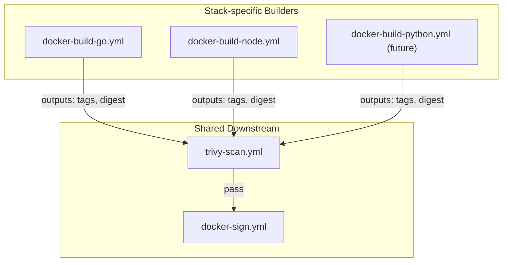
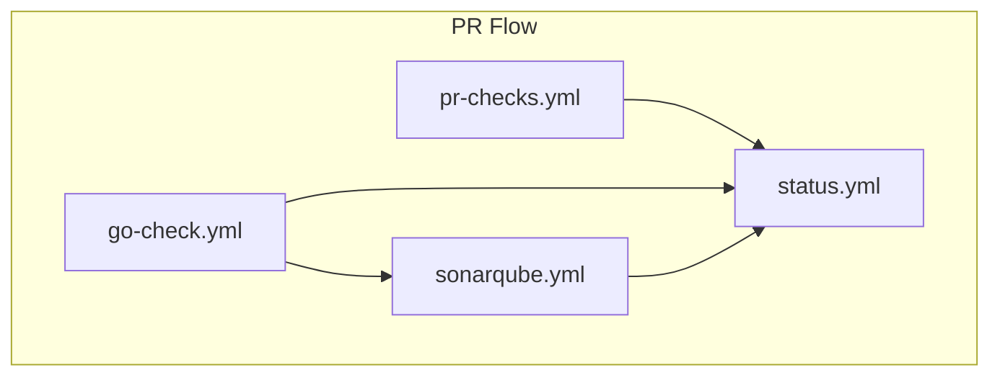
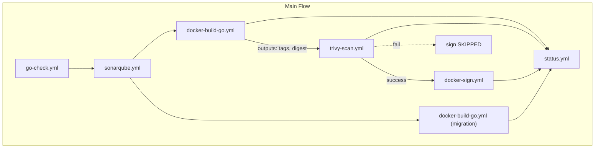
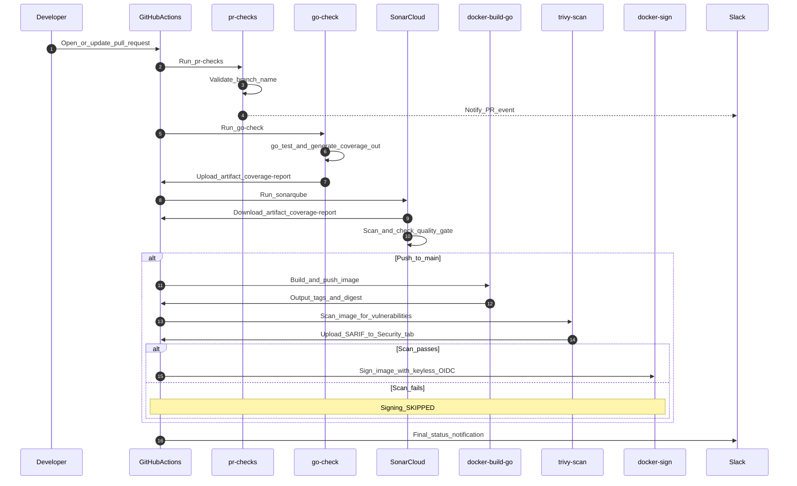
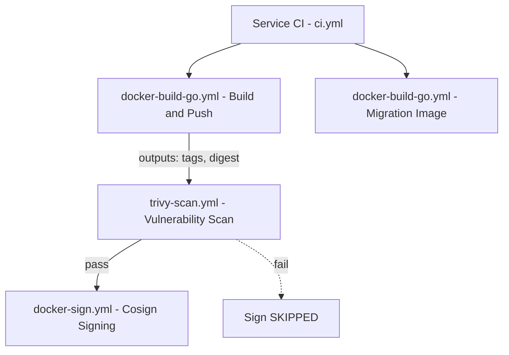
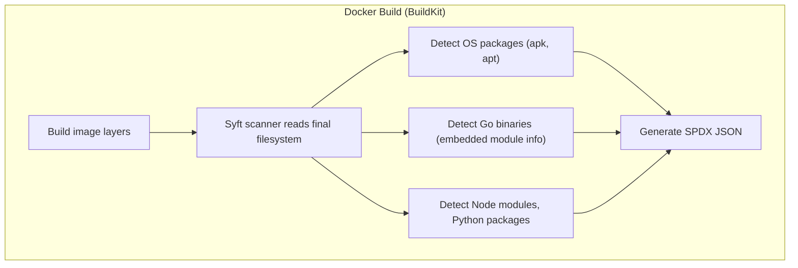
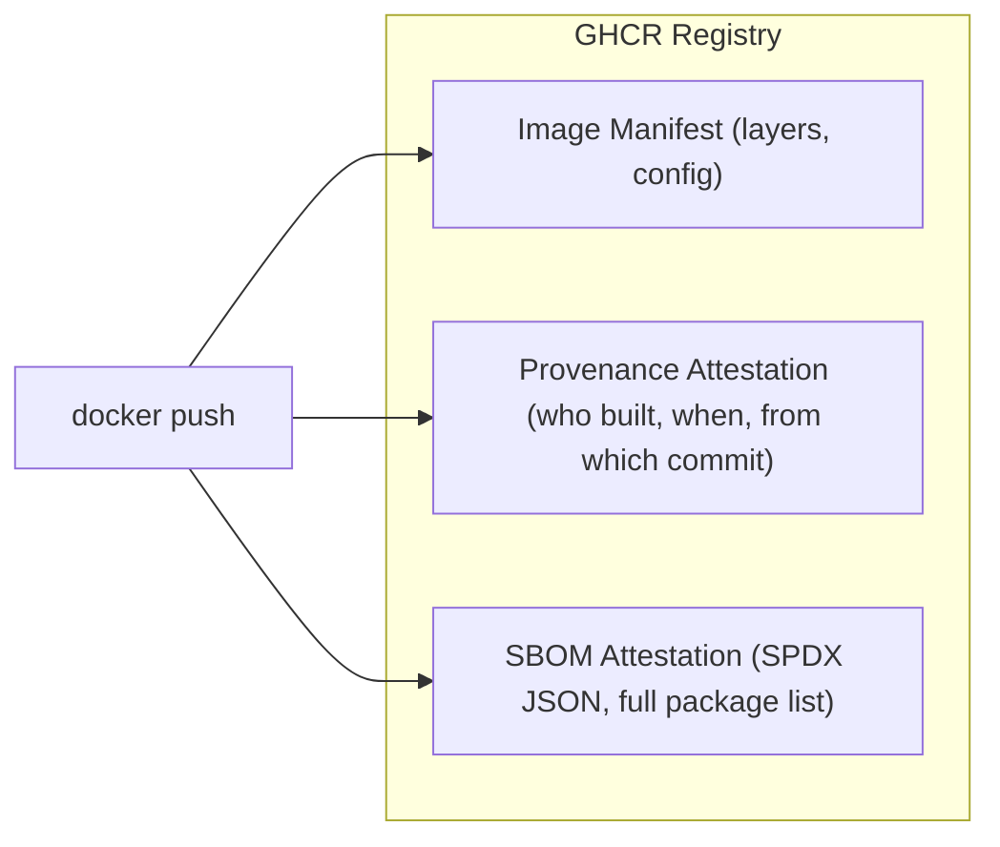
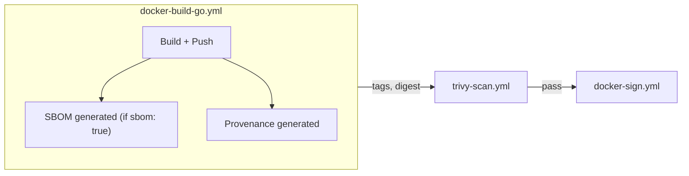

# 🚀 CI/CD Pipeline Documentation

This document outlines the **Trunk-Based Development** CI/CD pipeline implemented for all microservices (`auth`, `user`, `product`, `cart`, `order`, `review`, `notification`, `shipping`) and the `frontend` in a **polyrepo** setup.

Each service repository reuses workflows from `duyhenryer/shared-workflows`:
- `pr-checks.yml` (PR validation + Slack PR events)
- `go-check.yml` (tests + optional lint + coverage artifact)
- `sonarqube.yml` (SonarCloud analysis + optional Quality Gate enforcement)
- `docker-build-go.yml` (build & push Docker image for Go services — outputs `tags` + `digest`)
- `docker-build-node.yml` (build & push Docker image for Node.js services — same outputs)
- `trivy-scan.yml` (Trivy image vulnerability scan — SARIF + Google Sheets reporting)
- `docker-sign.yml` (Cosign keyless image signing)
- `status.yml` (final Slack + Google Sheets status notification)

The pipeline follows a **"Build Once, Analyze Everywhere"** pattern: `go-check` produces a `coverage.out` artifact that `sonarqube` consumes (no need to rerun tests for analysis).

## 📊 Workflow Visualization

### 1. Architecture Overview

Stack-specific builders feed into shared scan and sign workflows:



### 2. PR Flow



### 3. Main Flow (Push to main)



### 4. Execution Sequence

This diagram details the interaction between GitHub Actions, SonarCloud, Trivy, Cosign, and Slack.



---

## 🔄 Detailed Process Flows

### 1️⃣ Flow: Pull Request (Validation)
**Trigger:** Developer opens or updates a Pull Request targeting `main`.
**Goal:** Verify code quality, security, and functionality **before** merging.

| Step | Job Name | Trigger Condition | Action & Responsibility |
|------|----------|-------------------|-------------------------|
| **1** | `pr-checks` | **PR Only** | **Gateway Check**: validates branch naming (`feat/*`, `fix/*`, etc.) and sends Slack PR-event notification. |
| **2** | `go-check` | **Always** | **Test + Coverage Artifact**: runs Go tests and uploads `coverage-report` artifact containing `coverage.out`. **Lint runs only on PR** when enabled. |
| **3** | `sonar` | **Always** | **SonarCloud Analysis**: downloads `coverage-report` and runs Sonar scan. **Quality Gate enforcement is configurable** (`fail-on-quality-gate`). |
| **4** | `notify` | **Always** | **Reporting**: posts final pipeline status to Slack and Google Sheets (runs even if previous steps failed). |

> **Skipped on PR:** `docker-build` / `trivy-scan` / `docker-sign` / `docker-db-init` jobs do NOT run on PRs to avoid pushing images for non-merged code.

---

### 2️⃣ Flow: Push to Main (Delivery)
**Trigger:** PR is merged into `main` (or direct push).
**Goal:** Create a release candidate, scan it, sign it, and publish.

| Step | Job Name | Trigger Condition | Action & Responsibility |
|------|----------|-------------------|-------------------------|
| **1** | `go-check` | **Always** | **Regression Check**: re-runs tests and uploads fresh `coverage-report` artifact. (Lint is PR-only.) |
| **2** | `sonar` | **Always** | **Analysis Update**: updates SonarCloud main-branch analysis based on the coverage artifact. |
| **3** | `docker-build` | **Main Only** | **Build Artifact**: builds and pushes the service image to GHCR. Outputs `tags` and `digest`. |
| **4** | `trivy-scan` | **After build** | **Vulnerability Scan**: scans the built image with Trivy for CRITICAL/HIGH CVEs. Uploads SARIF to GitHub Security tab. Reports to Google Sheets. |
| **5** | `docker-sign` | **After scan passes** | **Image Signing**: signs the image with Cosign keyless (OIDC). Only runs if Trivy scan passes. |
| **6** | `docker-db-init` | **Main Only** | **Migration Artifact**: builds and pushes the migration image (Flyway init image) to GHCR. |
| **7** | `notify` | **Always** | **Reporting**: posts final pipeline status to Slack and Google Sheets. |

---

## Local Verification with `act`

> **`act` is for local verification only.** It is useful for validating YAML wiring and basic job logic before pushing, but it does **not** replicate the full GitHub Actions runtime. Known limitations:
>
> - JavaScript-based actions may not work (e.g., `actions/upload-artifact`, some installer actions).
> - Secrets, OIDC tokens, and `GITHUB_TOKEN` permissions are unavailable or limited.
> - Docker-in-Docker and registry push/sign steps will be skipped or fail.
> - Artifact upload/download between jobs is not supported.
>
> **Recommendation**: Use `act` to catch YAML syntax errors, job dependency issues, and shell script bugs. Always rely on GitHub Actions (real runtime) for production correctness.

```bash
# Example: dry-run a PR workflow locally
act pull_request -W .github/workflows/ci.yml --detect-event
```

---

## Docker Image Naming Convention

GHCR auto-grants `write_package` permission to images whose name **matches the GitHub repository name**. To avoid permission errors, the `image-name` input in the builder workflow must match the repo name. Migration images use the `{repo-name}-init` suffix as a separate GHCR package.

| GitHub Repo | GHCR Image (app) | GHCR Image (migration) |
|---|---|---|
| `product-service` | `ghcr.io/duynhne/product-service` | `ghcr.io/duynhne/product-service-init` |
| `auth-service` | `ghcr.io/duynhne/auth-service` | `ghcr.io/duynhne/auth-service-init` |
| `user-service` | `ghcr.io/duynhne/user-service` | `ghcr.io/duynhne/user-service-init` |

**Convention**: Always use the full GitHub repo name as `image-name` (e.g., `product-service`, not `product`). Append `-init` for migration images (e.g., `product-service-init`).

> **Note**: Helm values may reference different image names/tags (e.g., `product:v6`) that are managed separately from CI. The CI-published images and Helm-deployed images do not need to share the same GHCR repo.

---

## Shared Workflow Architecture

### Explicit Pipeline Pattern (Build → Scan → Sign)

Each service repo explicitly chains three independent reusable workflows via `needs:` dependencies:



| Workflow | Responsibility |
|---|---|
| `docker-build-go.yml` | Core build logic: checkout, QEMU/Buildx, GHCR login, metadata, build & push, summary. Designed for Go services. Outputs `tags` and `digest`. |
| `docker-build-node.yml` | Same as above but named for Node.js/frontend services. Same inputs and outputs interface. |
| `trivy-scan.yml` | Scans the built image for vulnerabilities using `aquasecurity/trivy-action`. Uploads SARIF to GitHub Security tab. Reports vulnerability counts to Google Sheets. |
| `docker-sign.yml` | Cosign keyless (OIDC) image signing. Receives tags + digest from the build job. |

### Why Stack-Specific Builders?

The build workflow is split by stack (`docker-build-go.yml`, `docker-build-node.yml`, etc.) for organizational clarity and future extensibility:

- **Current**: Go services use `docker-build-go.yml`, frontend uses `docker-build-node.yml`
- **Future**: Python, Rust, or other stacks can have their own builder (e.g., `docker-build-python.yml`)
- **Key constraint**: All builders must output the same interface (`tags` + `digest`) so that `trivy-scan.yml` and `docker-sign.yml` work identically regardless of the upstream builder

### Learnings from Clone-Workflow

Ideas adopted from a reference CI/CD repository:

- **Explicit pipeline pattern**: Each service repo explicitly chains `build → scan → sign` as separate jobs rather than using a wrapper workflow. This gives each repo full control over the pipeline and makes the flow visible in the GitHub Actions UI.
- **Future extensions** (not yet implemented):
  - **PII checks**: A dedicated workflow for scanning code or config for sensitive data before build (similar to `pii-checks.yml` pattern).
  - **CI status aggregation**: A common wrapper that orchestrates the entire CI pipeline, reducing boilerplate in individual service repos.

---

## SBOM (Software Bill of Materials)

### What is SBOM?

SBOM is a **complete inventory** of every package, library, and dependency inside a Docker image. Think of it as a "nutrition label" for your container -- it lists exactly what's inside, down to the version number.

Example contents of an SBOM:

```
alpine-baselayout       3.4.3-r2       (OS package)
ca-certificates         20240226-r0    (OS package)
github.com/gin-gonic/gin    v1.11.0    (Go module)
github.com/jackc/pgx/v5     v5.8.0     (Go module)
golang.org/x/crypto         v0.47.0    (Go module)
```

### How It Works

When `sbom: true` is set in the builder workflow, **BuildKit** automatically generates an SBOM during the Docker build process. No extra tools or steps needed.



BuildKit uses **Syft** (by Anchore, open source, embedded in BuildKit) to scan each layer:

| Layer type | How Syft detects packages |
|---|---|
| Alpine (apk) | Reads `/etc/apk/world`, `/lib/apk/db/installed` |
| Debian (apt) | Reads `/var/lib/dpkg/status` |
| Go binary | Reads `go version -m` metadata embedded in compiled binary |
| Node.js | Reads `node_modules/*/package.json` |
| Python | Reads `site-packages/*.dist-info/METADATA` |

### What Gets Stored in GHCR

When an image is pushed with SBOM enabled, GHCR stores three things under the same digest:



All three share the same image **digest** (sha256). The SBOM is metadata attached to the image, not a separate artifact.

### How It Fits in the Pipeline

SBOM generation happens inside the build step. It does not add a new job -- it's part of `docker/build-push-action`:



### How to Enable

Add `sbom: true` to the builder workflow call in your service `ci.yml`:

```yaml
docker-build:
  uses: duyhenryer/shared-workflows/.github/workflows/docker-build-go.yml@main
  with:
    image-name: 'auth'
    push: true
    sbom: true     # <-- just add this
```

No other changes needed. The builder workflows (`docker-build-go.yml`, `docker-build-node.yml`) already support the `sbom` input.

### How to Read SBOM

After the image is pushed, anyone with read access can inspect the SBOM:

```bash
# BuildKit native
docker buildx imagetools inspect ghcr.io/duynhne/auth-service:latest

# Cosign (verify SBOM attestation)
cosign verify-attestation --type spdx ghcr.io/duynhne/auth-service:latest

# Trivy (scan SBOM for CVEs without pulling full image)
trivy image --sbom ghcr.io/duynhne/auth-service:latest
```

### Why Use SBOM?

| Benefit | Without SBOM | With SBOM |
|---|---|---|
| **Know what's in the image** | Image is a black box | Full package inventory visible |
| **Post-deploy CVE scanning** | Must pull + rescan full image | Scan SBOM directly from registry (fast) |
| **Supply chain security** | Cannot prove contents | SBOM + Cosign = provable, signed inventory |
| **Compliance (SLSA, EO 14028)** | Does not meet requirements | Meets framework requirements |
| **GitHub Dependency Graph** | Only shows `go.mod` dependencies | Also shows container-level dependencies |

### Trade-offs

| Aspect | Impact |
|---|---|
| Build time | +5-10 seconds (Syft scanning layers) |
| Registry storage | +few KB per image (SPDX JSON attestation) |
| Complexity | Zero -- built into BuildKit, no extra tools |
| Cost | 100% free (open source tooling) |

### Local SBOM Testing

You can generate and inspect SBOM locally without relying on CI. This is useful for debugging, auditing, or verifying image contents before pushing.

#### Prerequisites

```bash
# Install syft (SBOM generator by Anchore)
curl -sSfL https://raw.githubusercontent.com/anchore/syft/main/install.sh | sh -s -- -b /usr/local/bin

# Install grype (vulnerability scanner by Anchore, works with syft SBOMs)
curl -sSfL https://raw.githubusercontent.com/anchore/grype/main/install.sh | sh -s -- -b /usr/local/bin
```

#### Generate SBOM from a GHCR image

```bash
# Table format (quick overview)
syft ghcr.io/duynhne/frontend/frontend:latest -o table

# SPDX JSON (standard format, same as BuildKit generates)
syft ghcr.io/duynhne/frontend/frontend:latest -o spdx-json > frontend-sbom.spdx.json

# CycloneDX JSON (alternative standard)
syft ghcr.io/duynhne/frontend/frontend:latest -o cyclonedx-json > frontend-sbom.cdx.json
```

#### Generate SBOM from a locally built image (podman)

```bash
# Build image locally with podman
podman build -t frontend:local -f Dockerfile .

# Generate SBOM from local image
syft frontend:local -o table
syft frontend:local -o spdx-json > frontend-sbom.spdx.json
```

#### Scan image for vulnerabilities

```bash
# Full scan (all severities)
grype ghcr.io/duynhne/frontend/frontend:latest

# Only show fixable vulnerabilities, fail on HIGH+
grype ghcr.io/duynhne/frontend/frontend:latest --only-fixed --fail-on high

# Scan a local image
grype frontend:local
```

#### Example output

```
# syft (SBOM table)
NAME                VERSION        TYPE
alpine-baselayout   3.7.1-r8       apk
busybox             1.37.0-r30     apk
curl                8.17.0-r1      apk
nginx               1.29.5-r1      apk
...

# grype (vulnerability scan)
NAME    INSTALLED   TYPE  VULNERABILITY   SEVERITY
tiff    4.7.1-r0    apk   CVE-2023-52356  High
curl    8.17.0-r1   apk   CVE-2025-14819  Medium
...
```

> **Note**: `syft` generates the same SPDX format as BuildKit's built-in SBOM generator. The difference is that CI uses BuildKit (embedded Syft) during `docker build`, while local testing uses Syft standalone against an already-built image.

### Current Status

SBOM support is **wired up but off by default** (`sbom: false`). To enable it for a service, add `sbom: true` to the `docker-build` job in that service's `ci.yml`. No changes to shared-workflows are needed.
