# CI/CD Pipeline Documentation

This document describes the CI/CD pipeline for all microservices (`auth`, `user`, `product`, `cart`, `order`, `review`, `notification`, `shipping`) and the `frontend` in a **polyrepo** setup.

> This page covers **both** the pipeline *how-to* (below) and the org-wide *standard/policy* —
> action SHA-pinning, least-privilege permissions, image signing/verification, the required-checks
> matrix, versioning, and the new-repo adoption checklist — consolidated into
> [CI/CD Standard & Policy](#cicd-standard--policy) (formerly the separate `cicd-standard.md`).

## Branching & Release Standard

This pipeline operates under the **Hybrid Enterprise Gitflow** model defined in [`gitflow.md`](gitflow.md):

- **`dev`** — internal integration; every push builds and deploys to the dev namespace.
- **`staging`** (optional) — release candidate; QA/UAT before production.
- **`main`** — production-ready code; merged from `staging` (or `dev` if staging is skipped).
- **`vX.Y.Z` tags** on `main` — immutable production releases; trigger release pipeline.
- **`feature/*`** from `dev`, **`hotfix/*`** from `main`.

**Container images** are **built once per commit** (on push to `main`) with an immutable `sha-<short>` tag; promotion between environments reuses the same digest — **no image rebuild occurs at tag time**. `latest` exists as a convenience alias but is never the sole deployment reference. Separately, a **`v*` tag** triggers a **GoReleaser binary release** (a Go binary + GitHub Release for the `packages` project) — that *does* compile, but it is a distinct artifact from the container image (see [Binary Releases](#binary-releases-goreleaser)). See [`gitflow.md`](gitflow.md) for the full branching model, tagging policy, runbooks, and governance rules.

**Branch enforcement** is managed via **GitHub Rulesets** (not legacy Branch Protection). Each service repo has 3 layered rulesets: Base Protection (all branches), Production Gate (`main` only), and Release Tags (`v*`). Required status checks (`go-check / Test`) are configured in the Base Protection ruleset, ensuring CI must pass before any merge. See [`gitflow.md` section 7](gitflow.md#7-github-rulesets-branch-enforcement) for the full ruleset configuration, CODEOWNERS integration, and setup guide.

**Workflow split**: Each service repo uses **three workflow files** instead of a single `ci.yml`:
- **`check.yml`** (PR only) -- runs tests, lint, secret scanning, SonarCloud analysis
- **`build.yml`** (push only) -- builds Docker images, scans **before push**, signs, notifies
- **`release.yml`** (`v*` tag only) -- builds a Go **release binary** with GoReleaser and publishes a GitHub Release (see [Binary Releases](#binary-releases-goreleaser))

This split ensures GitHub does not append `(pull_request)` or `(push)` suffixes to status check names, making ruleset matching predictable. See [`ruleset-automation.md`](ruleset-automation.md) for details on how check names are constructed and enforced.

> **Triggers today vs the Gitflow target.** The [`gitflow.md`](gitflow.md) model describes a
> `dev → staging → main` promotion. The **currently wired** CI triggers are: `check.yml` on
> **PRs to `main`**, `build.yml` on **push to `main`**, and `release.yml` on **`v*` tags**. The
> `dev`/`staging` branch builds shown in some diagrams below are the Gitflow *target*, not yet
> wired into the service workflows.

## Image Security: Scan Before Push

**Critical design**: Images are scanned with Trivy **before** being pushed to GHCR. The gate is **calibrated** (see [§7 Image security](#7-image-security)): only **CRITICAL** blocks the push; **HIGH** is reported in the job summary + Security tab but does **not** block — so a freshly-disclosed base-image HIGH with no upstream fix yet can't hold every service hostage.

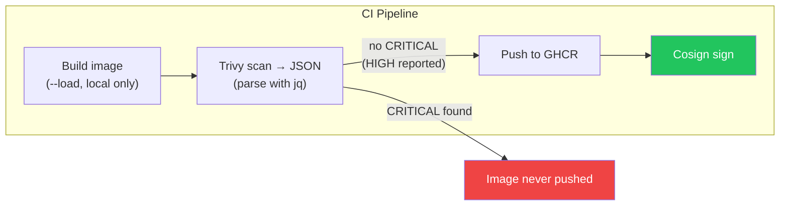

The `docker-build-go.yml` (and `docker-build-node.yml`) workflows handle this via `scan-before-push` (default `true`); the block set is `scan-block-severity` (default `CRITICAL`) and the report set is `scan-severity` (default `CRITICAL,HIGH`). The pre-push scan writes a severity-count table + CVE list to the job summary. Accept a specific CVE only via a time-boxed `.trivyignore.yaml`. See [§7 Image security](#7-image-security) for the full policy.

## Shared Workflows

Each service repository reuses workflows from `duynhlab/gha-workflows`:
- `pr-checks.yml` (PR validation + Slack PR events)
- `go-check.yml` (tests + optional lint + coverage artifact)
- `gitleaks.yml` (Secret scanning + SARIF output)
- `sonarqube.yml` (SonarCloud analysis + optional Quality Gate enforcement)
- `docker-build-go.yml` (build, scan before push, push Docker image for Go services — outputs `tags` + `digest` + `scan-status`)
- `docker-build-node.yml` (build, scan before push, push Docker image for Node.js services — same outputs)
- `trivy-scan.yml` (Post-push Trivy image scan — SARIF + Google Sheets reporting, non-blocking)
- `docker-sign.yml` (Cosign keyless image signing)
- `goreleaser.yml` (binary release on `v*` tags — GoReleaser → GitHub Release; tarball + `.sha256` + `build-info.env`, see [Binary Releases](#binary-releases-goreleaser))
- `status.yml` (final Slack + Google Sheets status notification)

The pipeline follows a **"Build Once, Analyze Everywhere"** pattern: `go-check` produces a `coverage.out` artifact that `sonarqube` consumes (no need to rerun tests for analysis).

## Workflow Visualization

### 1. Full Pipeline Architecture

This diagram illustrates the comprehensive end-to-end pipeline, showcasing the integration of secret scanning (`gitleaks`), code quality checks (`sonar`), and the scan-before-push delivery pattern.

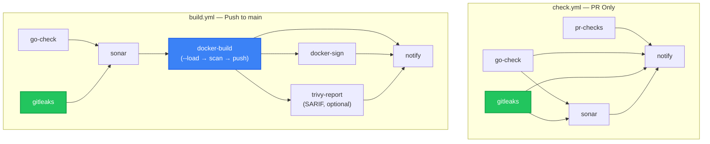

### 2. Architecture Overview

Stack-specific builders with integrated scanning feed into shared sign workflows:

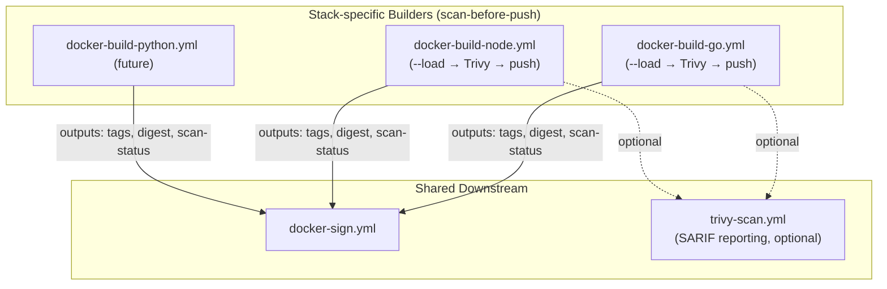

### 3. Branch Promotion & CI Trigger Map

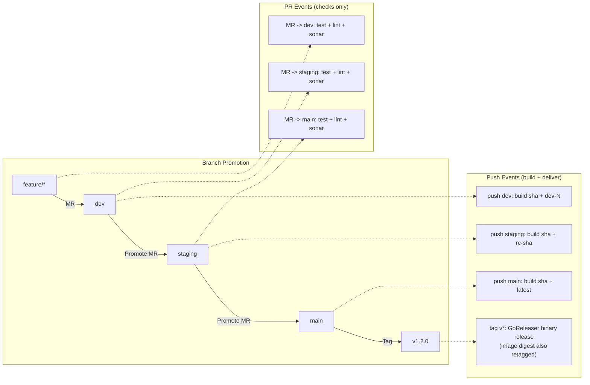

### 4. PR Flow

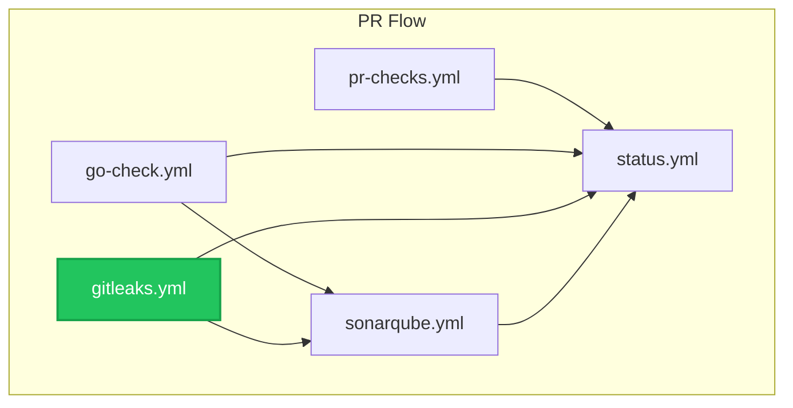

### 5. Build & Delivery Flow (Push to dev / staging / main)

On push to any persistent branch (`dev`, `staging`, `main`), the full build pipeline runs. Images are **scanned before push** — if Trivy finds CRITICAL/HIGH CVEs, the image is never pushed to the registry and the pipeline fails.

After each deployment, **post-deploy verification** runs automatically: smoke tests on all environments, plus integration/regression tests on staging. See [`gitflow.md` section 6.2](gitflow.md#62-post-deploy-verification) for the full verification matrix.

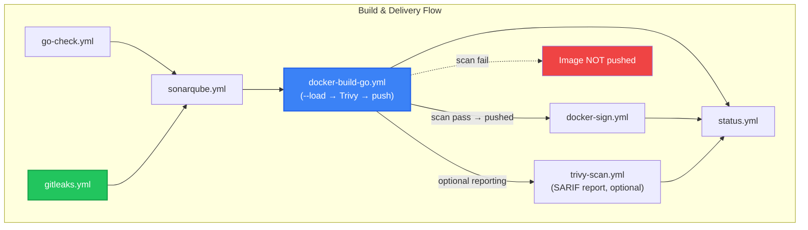

### 6. Execution Sequence

This diagram details the interaction between GitHub Actions, SonarCloud, Trivy, Cosign, and Slack across the full promotion lifecycle.

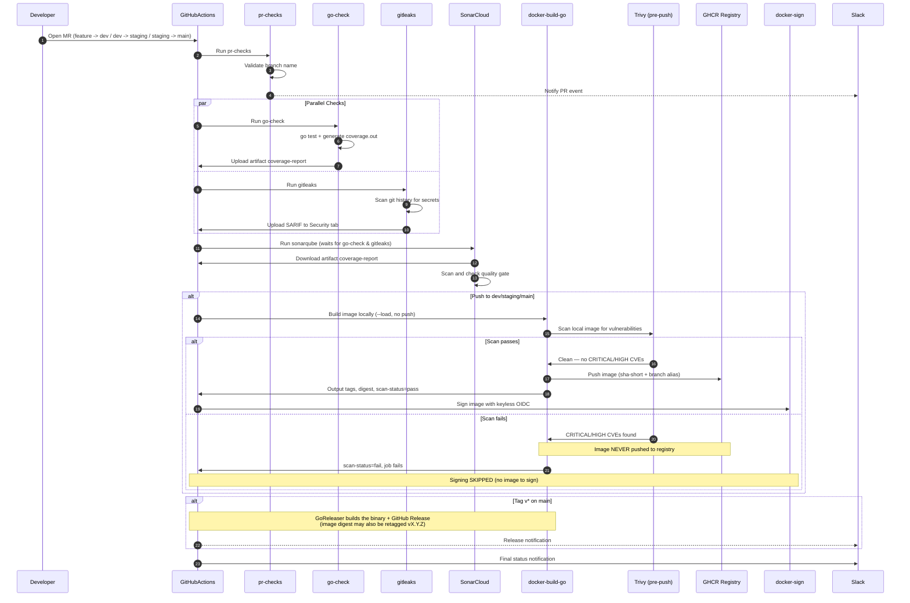

### 7. Security Layers

The pipeline implements defense-in-depth with multiple security gates:

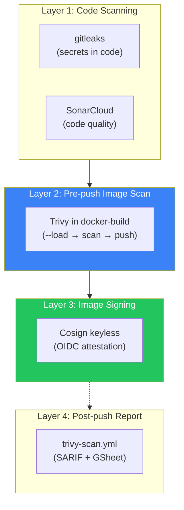

| Layer | What | Prevents |
|---|---|---|
| **L1: Code scan** | `gitleaks` + `sonar` | Secrets in code, code quality issues |
| **L2: Pre-push image scan** | Trivy in `docker-build-go.yml` | Known CVEs reaching registry |
| **L3: Image signing** | Cosign keyless (OIDC) | Tampering, provenance verification |
| **L4: Post-push report** | `trivy-scan.yml` (SARIF) | New CVEs discovered after push |

> **Future**: Layer 5 (Kyverno admission control) will verify Cosign signatures at deploy time. See [`kyverno.md`](kyverno.md) and [§7 Image security](#7-image-security).

---

## Detailed Process Flows

### 1. Flow: Pull Request (Validation)
**Trigger:** Developer opens or updates a Pull Request targeting `dev`, `staging`, or `main`.
**Goal:** Verify code quality, security, and functionality **before** merging.

| Step | Job Name | Trigger Condition | Action & Responsibility |
|------|----------|-------------------|-------------------------|
| **1** | `pr-checks` | **PR Only** | **Gateway Check**: validates branch naming (`feature/*`, `hotfix/*`, `fix/*`, etc.) and sends Slack PR-event notification. |
| **2a** | `go-check` | **Always** | **Test + Coverage Artifact**: runs Go tests and uploads `coverage-report` artifact containing `coverage.out`. **Lint runs only on PR** when enabled. |
| **2b** | `gitleaks` | **Always** | **Secret Scanning**: scans git history for secrets in parallel with `go-check`. Uploads SARIF. Block CI on leaks. |
| **3** | `sonar` | **Always** | **SonarCloud Analysis**: waits for 2a and 2b. Downloads `coverage-report` and runs Sonar scan. **Quality Gate enforcement is configurable**. |
| **4** | `notify` | **Always** | **Reporting**: posts final pipeline status to Slack and Google Sheets (runs even if previous steps failed). |

> **Skipped on PR:** `docker-build` / `trivy-report` / `docker-sign` jobs do NOT run on PRs to avoid pushing images for non-merged code.

---

### 2. Flow: Push to Persistent Branch (Delivery)
**Trigger:** PR is merged into `dev`, `staging`, or `main`.
**Goal:** Build an immutable artifact, scan it **before pushing**, sign it, and deploy to the corresponding environment.

| Step | Job Name | Trigger Condition | Action & Responsibility |
|------|----------|-------------------|-------------------------|
| **1** | `go-check` | **Always** | **Regression Check**: re-runs tests and uploads fresh `coverage-report` artifact. (Lint is PR-only.) |
| **1b** | `gitleaks` | **Always** | **Secret Scanning**: scans git history for secrets in parallel with `go-check`. |
| **2** | `sonar` | **Always** | **Analysis Update**: updates SonarCloud branch analysis based on the coverage artifact. |
| **3** | `docker-build` | **Push to dev/staging/main** | **Build + Scan + Push**: builds image locally (`--load`), scans with Trivy for CRITICAL/HIGH CVEs. **Only pushes to GHCR if scan passes.** Outputs `tags`, `digest`, and `scan-status`. |
| **4** | `trivy-report` | **After build (optional)** | **Vulnerability Reporting**: detailed scan with SARIF upload to GitHub Security tab and Google Sheets. Non-blocking (`exit-code: '0'`). |
| **5** | `docker-sign` | **After build passes** | **Image Signing**: signs the image with Cosign keyless (OIDC). Only runs if build (including scan) succeeded. |
| **6** | `notify` | **Always** | **Reporting**: posts final pipeline status to Slack and Google Sheets. |

### 3. Flow: Binary Release on `v*` Tag (GoReleaser)
**Trigger:** A `vX.Y.Z` tag is pushed (the service's `release.yml`).
**Goal:** Build a Go **release binary** and publish a **GitHub Release** whose assets the
[`packages`](#binary-releases-goreleaser) project can download (instead of compiling from source).

| Step | Job Name | Action & Responsibility |
|------|----------|-------------------------|
| **1** | `release` (calls `goreleaser.yml`) | Checkout (full history) → setup Go → generate `build-info.env` → run **GoReleaser** (`release --clean`): builds `bin/<repo>` (`CGO_ENABLED=0`, `-trimpath`, `-ldflags "-s -w -X main.version=…"`, `./cmd`, linux/amd64), archives it, and creates the GitHub Release. |

> Unlike the **container image** (built once on `main`, never rebuilt at tag time), this binary
> release **does compile** on the tag — it is a separate artifact stream for `packages`.

---

## Binary Releases (GoReleaser)

On a `v*` tag, each Go service publishes a **GitHub Release** of its compiled binary via
[GoReleaser](https://goreleaser.com), driven by the shared `goreleaser.yml` reusable workflow.
This exists to feed the **`packages`** project (the `dnf install duynhlab` mega-RPM), which can
**download** these release assets instead of cloning + compiling each service from source.

### Artifact contract (per service, per `vX.Y.Z`)

The assets deliberately match `packages/scripts/build-local.sh` so `packages` can consume them
unchanged:

| Asset | Detail |
|---|---|
| `<repo>-<version>-linux-amd64.tar.gz` | the archive; `<repo>` = `<svc>-service`, `<version>` = tag without `v`. Contains **`bin/<repo>`** (+ `README`/`LICENSE` when present). |
| `<tarball>.sha256` | per-file checksum (GoReleaser `checksum.split: true`). |
| `build-info.env` | sidecar: `SERVICE` (short name), `TYPE=backend`, `VERSION`, `GIT_SHA`, `GOOS=linux`, `GOARCH=amd64`, `SCHEMA_VERSION` (= highest `db/migrations/sql/*.up.sql`), `BUILT_AT`, `SOURCE=github-release`. |

### Where the config lives

- **Shared workflow** — `duynhlab/gha-workflows/.github/workflows/goreleaser.yml`: checkout
  (`fetch-depth: 0`) → setup Go → generate `build-info.env` (the SCHEMA_VERSION scan + git/tag
  metadata live here, once) → `goreleaser/goreleaser-action@v7` (SHA-pinned) `release --clean`.
  `permissions: contents: write`; the GoReleaser **CLI** is constrained to `~> v2` (independent of
  the action major v7).
- **Per service** — a `.goreleaser.yaml` (schema v2: `builds` with `binary: bin/<repo>`,
  `archives` `name_template`, `checksum.split`, `release.extra_files: build-info.env`) and a
  `.github/workflows/release.yml` (`on: push tags v*` → calls the shared workflow).

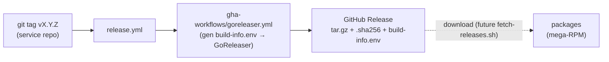

### Adding it to a new service

1. Add `.goreleaser.yaml` (copy an existing service's; change `project_name`/`binary` to
   `<svc>-service`).
2. Add `.github/workflows/release.yml` calling `goreleaser.yml@main` on `v*` tags.
3. Cut a tag: `git tag vX.Y.Z && git push origin vX.Y.Z`. The Release appears with the three
   assets above.

> **Note:** the `packages` consumer side (`fetch-releases.sh` to download these instead of
> building from source) is a separate, tracked follow-up in the `packages` repo.

---

## Local Verification with `act`

> **`act` is for local verification only.** It is useful for validating YAML wiring and basic job logic before pushing, but it does **not** replicate the full GitHub Actions runtime. Known limitations:
>
> - JavaScript-based actions may not work (e.g., `actions/upload-artifact`, some installer actions).
> - Secrets, OIDC tokens, and `GITHUB_TOKEN` permissions are unavailable or limited.
> - Docker-in-Docker and registry push/sign steps will be skipped or fail.
> - Artifact upload/download between jobs is not supported.
>
> **Recommendation**: Use `act` to catch YAML syntax errors, job dependency issues, and shell script bugs. Always rely on GitHub Actions (real runtime) for production correctness.

```bash
# Example: dry-run the PR check workflow locally
act pull_request -W .github/workflows/check.yml --detect-event

# Example: dry-run the build workflow locally
act push -W .github/workflows/build.yml --detect-event
```

---

## Docker Image Naming Convention

GHCR auto-grants `write_package` permission to images whose name **matches the GitHub repository name**. To avoid permission errors, the `image-name` input in the builder workflow must match the repo name. Migrations ship inside the app image (golang-migrate, run via the `migrate` subcommand in an init container) — there is no separate migration image.

| GitHub Repo | GHCR Image (app) |
|---|---|
| `product-service` | `ghcr.io/duynhlab/product-service` |
| `auth-service` | `ghcr.io/duynhlab/auth-service` |
| `user-service` | `ghcr.io/duynhlab/user-service` |

**Convention**: Always use the full GitHub repo name as `image-name` (e.g., `product-service`, not `product`).

> **Note**: Helm values may reference different image names/tags (e.g., `product:v6`) that are managed separately from CI. The CI-published images and Helm-deployed images do not need to share the same GHCR repo.

---

## Shared Workflow Architecture

### Scan-Before-Push Pattern (Build → Scan → Push → Sign)

Each service repo calls `docker-build-go.yml` which internally handles the full build → scan → push flow. The scan is integrated into the builder, not a separate job:

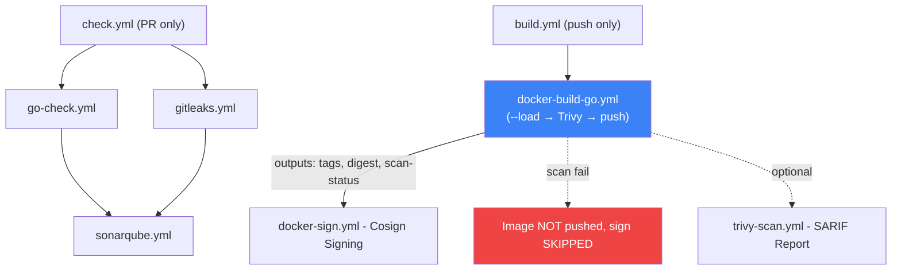

| Workflow | Responsibility |
|---|---|
| `docker-build-go.yml` | Build locally (`--load`), Trivy pre-push scan, push only if clean, registry caching, provenance, SBOM. Outputs `tags`, `digest`, and `scan-status`. |
| `docker-build-node.yml` | Same as above for Node.js/frontend services. Same inputs and outputs interface. |
| `trivy-scan.yml` | **Post-push reporting only** (not a security gate). Uploads SARIF to GitHub Security tab. Reports to Google Sheets. |
| `docker-sign.yml` | Cosign keyless (OIDC) image signing. Receives tags + digest from the build job. |

### Why Stack-Specific Builders?

The build workflow is split by stack (`docker-build-go.yml`, `docker-build-node.yml`, etc.) for organizational clarity and future extensibility:

- **Current**: Go services use `docker-build-go.yml`, frontend uses `docker-build-node.yml`
- **Future**: Python, Rust, or other stacks can have their own builder (e.g., `docker-build-python.yml`)
- **Key constraint**: All builders must output the same interface (`tags` + `digest` + `scan-status`) so that `docker-sign.yml` and optional `trivy-scan.yml` work identically regardless of the upstream builder

### Learnings from Clone-Workflow

Ideas adopted from a reference CI/CD repository:

- **Scan-before-push pattern**: Images are built locally (`--load`), scanned with Trivy, and only pushed to GHCR if no CRITICAL/HIGH CVEs are found. This prevents FluxCD from auto-deploying vulnerable images.
- **Explicit pipeline pattern**: Each service repo explicitly chains `build → sign` as separate jobs rather than using a wrapper workflow. This gives each repo full control over the pipeline and makes the flow visible in the GitHub Actions UI.
- **Future extensions** (not yet implemented):
  - **Kyverno admission control**: Kubernetes admission controller verifying Cosign signatures at deploy time (defense-in-depth).
  - **PII checks**: A dedicated workflow for scanning code or config for sensitive data before build.

---

## SBOM (Software Bill of Materials)

### What is SBOM?

SBOM is a **complete inventory** of every package, library, and dependency inside a Docker image. Think of it as a "nutrition label" for your container -- it lists exactly what's inside, down to the version number.

Example contents of an SBOM:

```
alpine-baselayout       3.4.3-r2       (OS package)
ca-certificates         20240226-r0    (OS package)
github.com/gin-gonic/gin    v1.11.0    (Go module)
github.com/jackc/pgx/v5     v5.8.0     (Go module)
golang.org/x/crypto         v0.47.0    (Go module)
```

### How It Works

When `sbom: true` is set in the builder workflow, **BuildKit** automatically generates an SBOM during the Docker build process. No extra tools or steps needed.

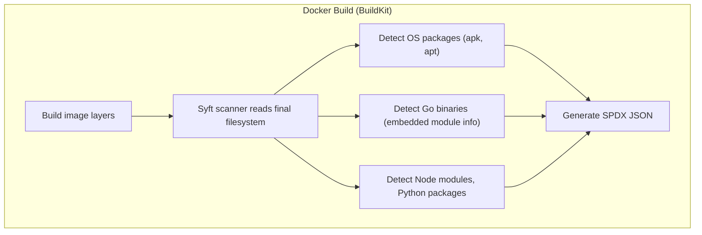

BuildKit uses **Syft** (by Anchore, open source, embedded in BuildKit) to scan each layer:

| Layer type | How Syft detects packages |
|---|---|
| Alpine (apk) | Reads `/etc/apk/world`, `/lib/apk/db/installed` |
| Debian (apt) | Reads `/var/lib/dpkg/status` |
| Go binary | Reads `go version -m` metadata embedded in compiled binary |
| Node.js | Reads `node_modules/*/package.json` |
| Python | Reads `site-packages/*.dist-info/METADATA` |

### What Gets Stored in GHCR

When an image is pushed with SBOM enabled, GHCR stores three things under the same digest:

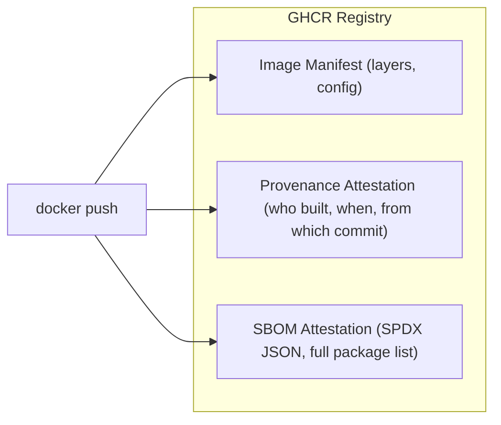

All three share the same image **digest** (sha256). The SBOM is metadata attached to the image, not a separate artifact.

### How It Fits in the Pipeline

SBOM generation happens inside the push step (after scan passes). It does not add a new job -- it's part of `docker/build-push-action`:

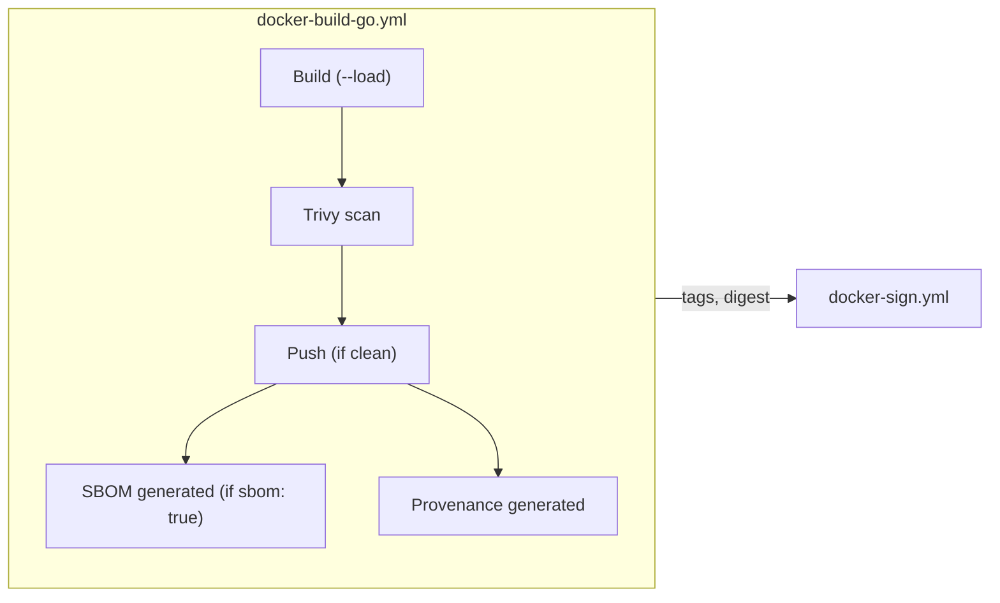

### How to Enable

Add `sbom: true` to the builder workflow call in your service `build.yml`:

```yaml
docker-build:
  uses: duynhlab/gha-workflows/.github/workflows/docker-build-go.yml@main
  with:
    image-name: 'auth-service'
    push: true
    sbom: true     # <-- just add this
```

No other changes needed. The builder workflows (`docker-build-go.yml`, `docker-build-node.yml`) already support the `sbom` input.

### How to Read SBOM

After the image is pushed, anyone with read access can inspect the SBOM:

```bash
# BuildKit native
docker buildx imagetools inspect ghcr.io/duynhlab/auth-service:latest

# Cosign (verify SBOM attestation)
cosign verify-attestation --type spdx ghcr.io/duynhlab/auth-service:latest

# Trivy (scan SBOM for CVEs without pulling full image)
trivy image --sbom ghcr.io/duynhlab/auth-service:latest
```

### Why Use SBOM?

| Benefit | Without SBOM | With SBOM |
|---|---|---|
| **Know what's in the image** | Image is a black box | Full package inventory visible |
| **Post-deploy CVE scanning** | Must pull + rescan full image | Scan SBOM directly from registry (fast) |
| **Supply chain security** | Cannot prove contents | SBOM + Cosign = provable, signed inventory |
| **Compliance (SLSA, EO 14028)** | Does not meet requirements | Meets framework requirements |
| **GitHub Dependency Graph** | Only shows `go.mod` dependencies | Also shows container-level dependencies |

### Trade-offs

| Aspect | Impact |
|---|---|
| Build time | +5-10 seconds (Syft scanning layers) |
| Registry storage | +few KB per image (SPDX JSON attestation) |
| Complexity | Zero -- built into BuildKit, no extra tools |
| Cost | 100% free (open source tooling) |

### Local SBOM Testing

You can generate and inspect SBOM locally without relying on CI. This is useful for debugging, auditing, or verifying image contents before pushing.

#### Prerequisites

```bash
# Install syft (SBOM generator by Anchore)
curl -sSfL https://raw.githubusercontent.com/anchore/syft/main/install.sh | sh -s -- -b /usr/local/bin

# Install grype (vulnerability scanner by Anchore, works with syft SBOMs)
curl -sSfL https://raw.githubusercontent.com/anchore/grype/main/install.sh | sh -s -- -b /usr/local/bin
```

#### Generate SBOM from a GHCR image

```bash
# Table format (quick overview)
syft ghcr.io/duynhlab/frontend/frontend:latest -o table

# SPDX JSON (standard format, same as BuildKit generates)
syft ghcr.io/duynhlab/frontend/frontend:latest -o spdx-json > frontend-sbom.spdx.json

# CycloneDX JSON (alternative standard)
syft ghcr.io/duynhlab/frontend/frontend:latest -o cyclonedx-json > frontend-sbom.cdx.json
```

#### Generate SBOM from a locally built image (podman)

```bash
# Build image locally with podman
podman build -t frontend:local -f Dockerfile .

# Generate SBOM from local image
syft frontend:local -o table
syft frontend:local -o spdx-json > frontend-sbom.spdx.json
```

#### Scan image for vulnerabilities

```bash
# Full scan (all severities)
grype ghcr.io/duynhlab/frontend/frontend:latest

# Only show fixable vulnerabilities, fail on HIGH+
grype ghcr.io/duynhlab/frontend/frontend:latest --only-fixed --fail-on high

# Scan a local image
grype frontend:local
```

#### Example output

```
# syft (SBOM table)
NAME                VERSION        TYPE
alpine-baselayout   3.7.1-r8       apk
busybox             1.37.0-r30     apk
curl                8.17.0-r1      apk
nginx               1.29.5-r1      apk
...

# grype (vulnerability scan)
NAME    INSTALLED   TYPE  VULNERABILITY   SEVERITY
tiff    4.7.1-r0    apk   CVE-2023-52356  High
curl    8.17.0-r1   apk   CVE-2025-14819  Medium
...
```

> **Note**: `syft` generates the same SPDX format as BuildKit's built-in SBOM generator. The difference is that CI uses BuildKit (embedded Syft) during `docker build`, while local testing uses Syft standalone against an already-built image.

### Current Status

SBOM support is **wired up but off by default** (`sbom: false`). To enable it for a service, add `sbom: true` to the `docker-build` job in that service's `build.yml`. No changes to gha-workflows are needed.

---

# CI/CD Standard & Policy

> **Audience:** every repo owner in the `duynhlab` org.
> **Status:** the baseline a repository must meet to be considered production-grade.
> **Scope:** GitHub Actions CI/CD built on the shared reusable-workflow library
> [`duynhlab/gha-workflows`](https://github.com/duynhlab/gha-workflows). The *how-to* is the rest
> of this page; related: [`gitflow.md`](gitflow.md) (branching/releases),
> [`ruleset-automation.md`](ruleset-automation.md) (branch protection),
> [`sonarcloud.md`](sonarcloud.md) (quality gate). Assumes **GitHub-hosted runners**; adversarially
> reviewed against GitHub's security-hardening guidance.

### 1. Principles

1. **Shift left** — lint/secret-scan/test/scan run on the PR, before merge.
2. **Faster is safer** — small PRs, squash-merge, frequent releases.
3. **Least privilege** — every workflow declares the minimum `permissions:` it needs.
4. **Supply-chain integrity** — third-party actions pinned to immutable SHAs; images scanned
   before push, signed (keyless/OIDC), and **verified at admission**.
5. **Immutability** — production runs an image **digest** (`sha256:…`); tags are mutable.
6. **One way to do it** — repos consume the shared workflows; they do not fork CI logic.

### 2. Reusable-workflow catalog

See [Shared Workflows](#shared-workflows) above for the full list (incl. `goreleaser.yml`).
Composite actions: `.github/actions/{gitleaks,slack-notification}`.

### 3. Action pinning & reusable-workflow refs

- **Third-party actions → full 40-char commit SHA**, with a trailing `# vX.Y.Z` comment:
  `uses: docker/build-push-action@<sha> # v7`. A mutable tag (`@v4`) is a remote-code-execution
  vector if the action is compromised. Renovate keeps SHAs current (§9), so pinning ≠ staleness.
- **First-party reusable workflows → `@main` today.** Be honest about the tradeoff: `@main` is
  **mutable** — a careless/compromised merge to `gha-workflows` changes CI/CD for *all*
  consumers with no consumer PR. The **only immutable** ref is a SHA; a future `@v1` major tag
  (§10) improves compatibility management but is **still mutable** (a major tag can be moved) —
  do not call `@v1` "pinning." `@main` is the current accepted tradeoff for an internal,
  CODEOWNER-gated library; high-blast-radius consumers may pin a SHA.

### 4. Least-privilege permissions

Set `permissions:` at the **caller** (top level = deny-all baseline, widen per job). Reusable
workflows declare the scope their job needs.

| Job / workflow | Required permissions |
|----------------|----------------------|
| go-check, tf-lint, pr-checks (validate) | `contents: read` |
| gitleaks, trivy-scan | `contents: read`, `security-events: write`, **`actions: read`** (SARIF upload in private repos) |
| sonarqube | `contents: read`, `pull-requests: read` |
| docker-build-* | `contents: read`, `packages: write` |
| docker-sign | `contents: read`, `packages: write`, `id-token: write` (OIDC) |
| goreleaser | `contents: write` (create the GitHub Release) |
| status / Slack | `actions: read` (list jobs); add `statuses: write` only if it posts commit status |

- **Prefer named secrets over `secrets: inherit`.** (Note: `workflow_call` cannot pass
  *environment* secrets; a called job that sets `environment:` reads that environment's secrets.)
- **Gate privileged jobs to trusted refs/events.** Any job with `packages: write`,
  `contents: write` (release), or `id-token: write` MUST run only on push to `main`/release tags
  (or a declared environment) — **never on fork PRs or arbitrary `workflow_dispatch`**.
  `id-token: write` is job-wide: keep the signing job isolated from build/test/untrusted actions.

### 5. Untrusted input & injection

Attacker-controllable context includes `github.head_ref`, **branch/tag names, commit messages,
PR title/body, issue comments, labels, author fields, changed file paths, and
`workflow_dispatch` inputs**. Do **not** interpolate them into `run:`/`script:`. Pass via `env:`
and reference the shell variable.

> `env:` only prevents *template-time* injection — it is still unsafe under unquoted expansion,
> `eval`, `bash -c`, heredocs, JSON construction, `github-script`, or Docker build-args. Quote
> and treat as data everywhere.

`pull_request_target` is **forbidden** to check out or execute PR-head code while secrets / a
write token are in scope.

### 6. Concurrency

```yaml
concurrency:
  group: ${{ github.workflow }}-${{ github.ref }}
  cancel-in-progress: true     # PR/CI only
```

- **Deploy/release: `cancel-in-progress: false`**, and be aware GitHub keeps only **one** queued
  run — design releases so a dropped intermediate run is safe (or serialize deliberately).
- **Build → push → sign must not be cancellable mid-chain.** A cancel after `push` but before
  `docker-sign` leaves an **unsigned** image in GHCR. Keep push+sign in one `needs` chain guarded
  so signing always runs for a pushed digest (or sign in the same job).

### 7. Image security

- **Scan before push — calibrated gate** (Trivy): mechanics in
  [Image Security: Scan Before Push](#image-security-scan-before-push) above — block on
  `CRITICAL`, report `HIGH`/`MEDIUM` without blocking, with `--ignore-unfixed`. Accept a *specific*
  CVE only via a **time-boxed `.trivyignore.yaml`** (`expired_at:` + a statement), never by
  loosening the gate globally.
- **Base images:** `:latest` is mutable and makes scans non-deterministic. **Pin a digest**
  (Renovate-managed) and **rebuild on a schedule** so base fixes land automatically — or use
  **Copacetic** to patch OS CVEs in-image. Keep a best-effort `apk --no-cache upgrade` in the
  runtime stage.
- **Sign** every pushed image with Cosign keyless OIDC — including the **`-init`** image.
- **Naming is multi-level** (platform convention): `ghcr.io/duynhlab/<repo>/<image>` — the `mop`
  chart renders `<name>-service/<name>` **and** `<name>-service/<name>-init`. Scan **and sign
  every** pushed image, not just the primary one.
- **TOCTOU:** bind scan result, signature, and deploy to the **same digest** — a locally-scanned
  artifact (esp. a multi-platform Buildx manifest) may differ from the pushed digest.
- **Production consumes an immutable `sha256:` digest** (GHCR tags are mutable); `vX.Y.Z`/
  `:latest` are human conveniences only.
- **Verification, not just signing:** an unverified signature is metadata. Admission
  (Kyverno — see [`kyverno.md`](kyverno.md)) MUST verify the Cosign signature with **strict
  certificate identity** (OIDC issuer = GitHub, expected repo + ref/workflow) and reject
  unsigned/wrongly-signed images.

### 8. Required checks / branch protection

Enforced via Rulesets (see [`ruleset-automation.md`](ruleset-automation.md)). Required checks
are **per repo type** — `go-check / Test` is meaningless on the Node frontend or the IaC repo:

| Repo type | Required checks on `main` (block merge) |
|-----------|------------------------------------------|
| Go service / Go library | `go-check / Test`, `gitleaks`, `sonarqube` (gate enforced) |
| Node frontend | node lint+build, `gitleaks`, `sonarqube` |
| Kubernetes / IaC (`homelab`) | manifest `validate`, `tf-lint`, `gitleaks` |

All `main`: 1 approval + CODEOWNERS, linear history, signed commits, no force-push. `v*` tags:
restrict create/delete/**update** (prevents tag retargeting → immutable releases).

Caveats:
- **SonarCloud:** a required *job* ≠ gate enforced. The workflow must wait for and **fail on**
  the quality-gate result (`fail-on-quality-gate: true`), else "passing" is hollow.
- **Skipped ≠ passed:** with path filters / skip logic, a required check that never runs leaves
  the PR **pending forever**. Use an always-running **aggregator** job as the required check.
- **Fork / Dependabot PRs** lack write perms + secrets, so SARIF-upload / Slack steps degrade —
  don't hard-require a job that can't run on a fork; split scan (always) from upload (gated).

### 9. Supply-chain automation

- **Renovate/Dependabot** on every repo: Go modules, Dockerfiles, **and `github-actions`** (so
  SHA pins auto-bump). `homelab` already runs Renovate; extend the same config to all repos.
- Base images updated on a schedule; Trivy gates regressions on the next build.

### 10. Reusable-workflow versioning (target)

Consumers pin `@main` today (§3). **Target:** release `gha-workflows` with semver — `vX.Y.Z` +
a moving `v1` major tag — so consumers pin `@v1` (auto-patches, fewer surprise breaks).
Migration is a separate tracked effort; this documents the goal.

### 11. Environments, secrets, retention

- **Secrets** in GitHub Secrets / OpenBAO — never in YAML. CI holds no prod secrets; signing
  uses OIDC. Note: GitHub log redaction is best-effort — mask transformed/derived secrets
  explicitly and audit logs.
- **GitHub Environments** (`dev`/`staging`/`prod`) only gate anything if the deploy/sign/promote
  job **declares `environment: prod`** — add it, with required reviewers on prod.
- **Artifact retention:** coverage `retention-days: 1`; prune old GHCR tags on a schedule; keep
  SBOM/signature attestations with the digest.

### 12. Observability (DORA)

Emit the four DORA signals from `status.yml` run data (already shipped to Google Sheets):
deployment frequency, lead time, change-failure rate, MTTR — on a Grafana dashboard against
VictoriaMetrics (see [observability](../observability/README.md)).

### 13. Additional hardening

- **Checkout in privileged jobs:** `persist-credentials: false` so the job token isn't left in
  local git config for build scripts / compromised tools.
- **Runners:** GitHub-hosted only. If self-hosted is ever introduced, untrusted PR code must
  never run on it (persistent-compromise / cross-job risk).
- **Cache/artifact trust boundary:** a PR-controlled cache or artifact must not be consumed by a
  privileged push/sign/deploy job without integrity checks.
- **Org-level enforcement:** several "MUST"s here are advisory without org rules — set an org
  ruleset / required-workflow, an action allowlist (or SHA-pin policy), disable
  Actions-created-PR approvals, and restrict the fork-PR `GITHUB_TOKEN` to read.

### 14. New-repo adoption checklist

- [ ] `check.yml` (PR) + `build.yml` (push) + `release.yml` (`v*` tag) call the shared workflows
      (see [`build_template.yml`](build_template.yml) / [`check_template.yml`](check_template.yml)
      and [Binary Releases](#binary-releases-goreleaser)).
- [ ] `permissions:` per §4; privileged jobs gated to trusted refs; concurrency per §6.
- [ ] `.github/CODEOWNERS` present; Rulesets applied per §8 (per repo type).
- [ ] Renovate enabled (Go + Docker + github-actions).
- [ ] Images multi-level named, scanned + signed (incl. `-init`); prod pins **digest**;
      admission verifies signatures.
- [ ] Secrets via Secrets/OpenBAO; signing via OIDC; prod jobs declare `environment:`.

### 15. Known follow-ups (post-transfer review)

- **Base-image determinism:** pin runtime base digests (Renovate) + a scheduled nightly rebuild
  (or Copacetic) so base-image CVE fixes land automatically — instead of `alpine:latest` (§7).
- Cut `@v1` tags on `gha-workflows` and migrate consumers off `@main` (§3/§10).
- Add Kyverno Cosign **signature-verification** policy with strict cert-identity (§7) — today
  signing is unverified.
- Add `actions: read` to the gitleaks/trivy reusable-workflow jobs (private-repo SARIF).
- Gate `packages:`/`id-token: write` jobs on trusted refs in the shared workflows (§4).
- Normalize consumer drift: SonarCloud `project-key` (dynamic vs hardcoded) and Trivy severity
  thresholds (build vs check). Prefer named secrets over `secrets: inherit`.
- Remove the dead `go-version` input from `sonarqube.yml` (unused; next interface bump).
