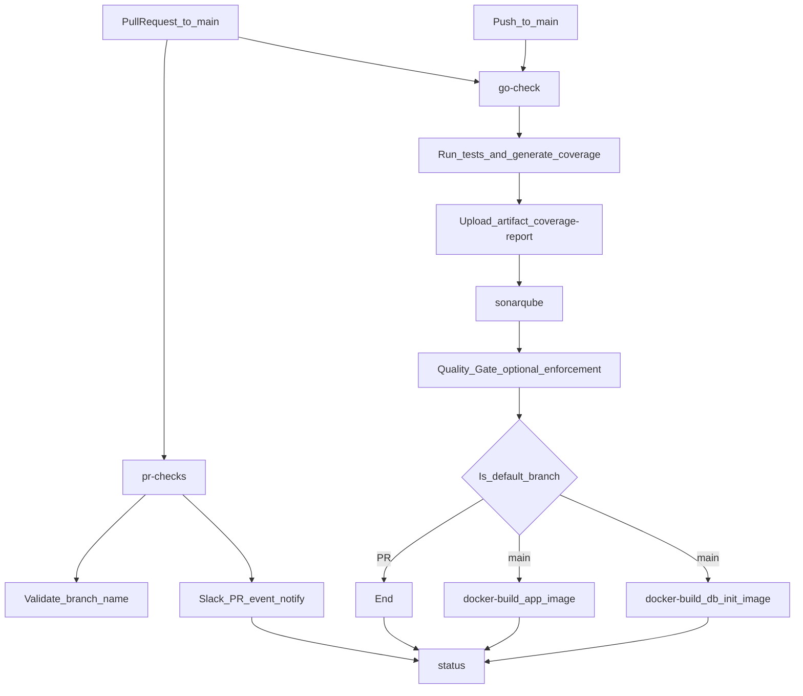
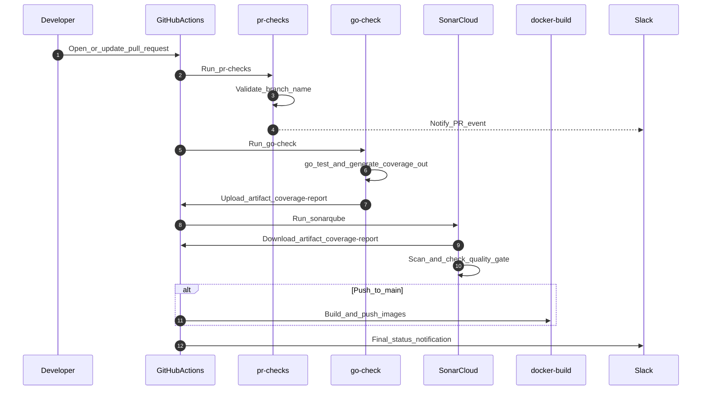
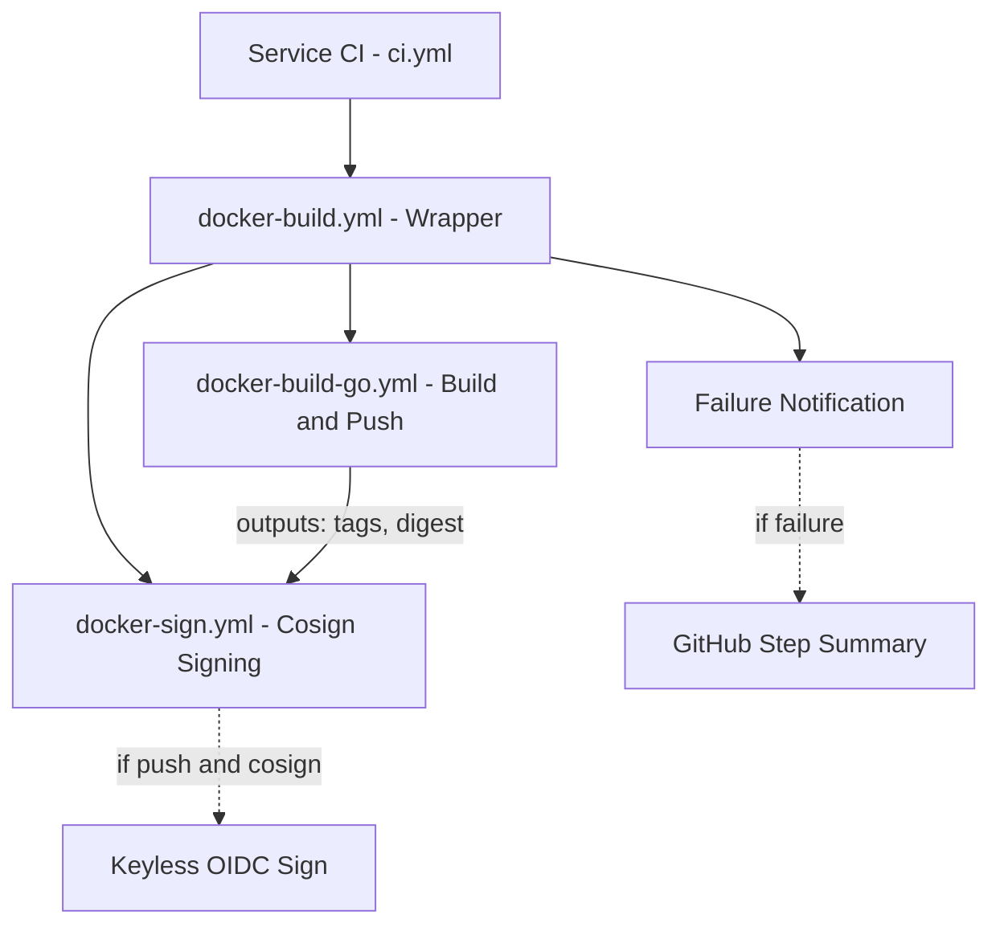

# 🚀 CI/CD Pipeline Documentation

This document outlines the **Trunk-Based Development** CI/CD pipeline implemented for all microservices (`auth`, `user`, `product`, `cart`, `order`, `review`, `notification`, `shipping`) in a **polyrepo** setup.

Each service repository reuses workflows from `duyhenryer/shared-workflows`:
- `pr-checks.yml` (PR validation + Slack PR events)
- `go-check.yml` (tests + optional lint + coverage artifact)
- `sonarqube.yml` (SonarCloud analysis + optional Quality Gate enforcement)
- `docker-build.yml` (wrapper: orchestrates build → sign → failure notification)
  - `docker-build-go.yml` (core build & push logic for Go services)
  - `docker-sign.yml` (Cosign keyless image signing)
- `status.yml` (final Slack status)

The pipeline follows a **"Build Once, Analyze Everywhere"** pattern: `go-check` produces a `coverage.out` artifact that `sonarqube` consumes (no need to rerun tests for analysis).

## 📊 Workflow Visualization

### 1. Orchestration Logic
This flowchart illustrates how jobs are connected and triggered based on events.



### 2. Execution Sequence
This diagram details the interaction between GitHub Actions, SonarCloud, and Slack.



---

## 🔄 Detailed Process Flows

### 1️⃣ Flow: Pull Request (Validation)
**Trigger:** Developer opens or updates a Pull Request targeting `main`.
**Goal:** Verify code quality, security, and functionality **before** merging.

| Step | Job Name | Trigger Condition | Action & Responsibility |
|------|----------|-------------------|-------------------------|
| **1** | `pr-checks` | **PR Only** | **Gateway Check**: validates branch naming (`feat/*`, `fix/*`, etc.) and sends Slack PR-event notification. |
| **2** | `go-check` | **Always** | **Test + Coverage Artifact**: runs Go tests and uploads `coverage-report` artifact containing `coverage.out`. **Lint runs only on PR** when enabled. |
| **3** | `sonar` | **Always** | **SonarCloud Analysis**: downloads `coverage-report` and runs Sonar scan. **Quality Gate enforcement is configurable** (`fail-on-quality-gate`). |
| **4** | `notify` | **Always** | **Reporting**: posts final pipeline status to Slack (runs even if previous steps failed). |

> **Skipped on PR:** `docker` / `docker-db-init` jobs do NOT run on PRs to avoid pushing images for non-merged code.

---

### 2️⃣ Flow: Push to Main (Delivery)
**Trigger:** PR is merged into `main` (or direct push).
**Goal:** Create a release candidate and publish the artifact.

| Step | Job Name | Trigger Condition | Action & Responsibility |
|------|----------|-------------------|-------------------------|
| **1** | `go-check` | **Always** | **Regression Check**: re-runs tests and uploads fresh `coverage-report` artifact. (Lint is PR-only.) |
| **2** | `sonar` | **Always** | **Analysis Update**: updates SonarCloud main-branch analysis based on the coverage artifact. |
| **3** | `docker` | **Main Only** | **Deployment Artifact**: builds and pushes the service image to GHCR. |
| **4** | `docker-db-init` | **Main Only** | **Migration Artifact**: builds and pushes the migration image (Flyway init image) to GHCR. |
| **5** | `notify` | **Always** | **Reporting**: posts final pipeline status to Slack. |

---

## Local Verification with `act`

> **`act` is for local verification only.** It is useful for validating YAML wiring and basic job logic before pushing, but it does **not** replicate the full GitHub Actions runtime. Known limitations:
>
> - JavaScript-based actions may not work (e.g., `actions/upload-artifact`, some installer actions).
> - Secrets, OIDC tokens, and `GITHUB_TOKEN` permissions are unavailable or limited.
> - Docker-in-Docker and registry push/sign steps will be skipped or fail.
> - Artifact upload/download between jobs is not supported.
>
> **Recommendation**: Use `act` to catch YAML syntax errors, job dependency issues, and shell script bugs. Always rely on GitHub Actions (real runtime) for production correctness.

```bash
# Example: dry-run a PR workflow locally
act pull_request -W .github/workflows/ci.yml --detect-event
```

---

## Docker Image Naming Convention

GHCR auto-grants `write_package` permission to images whose name **matches the GitHub repository name**. To avoid permission errors, the `image-name` input in `docker-build.yml` must match the repo name. Migration images use the `{repo-name}-init` suffix as a separate GHCR package.

| GitHub Repo | GHCR Image (app) | GHCR Image (migration) |
|---|---|---|
| `product-service` | `ghcr.io/duynhne/product-service` | `ghcr.io/duynhne/product-service-init` |
| `auth-service` | `ghcr.io/duynhne/auth-service` | `ghcr.io/duynhne/auth-service-init` |
| `user-service` | `ghcr.io/duynhne/user-service` | `ghcr.io/duynhne/user-service-init` |

**Convention**: Always use the full GitHub repo name as `image-name` (e.g., `product-service`, not `product`). Append `-init` for migration images (e.g., `product-service-init`).

> **Note**: Helm values may reference different image names/tags (e.g., `product:v6`) that are managed separately from CI. The CI-published images and Helm-deployed images do not need to share the same GHCR repo.

---

## Shared Workflow Architecture

### Docker Build Pipeline Split

The `docker-build.yml` workflow follows a **wrapper + reusable** pattern for maintainability:



| Workflow | Responsibility |
|---|---|
| `docker-build.yml` | Thin wrapper; orchestrates build → sign → failure notification. Service repos call this. |
| `docker-build-go.yml` | Core build logic: checkout, QEMU/Buildx, GHCR login, metadata, build & push, summary. Designed for Go services; create `docker-build-node.yml` for other stacks. |
| `docker-sign.yml` | Cosign keyless (OIDC) image signing. Receives tags + digest from the build job. |

**Backward compatibility**: Service repos continue calling `docker-build.yml` with the same inputs. The split is transparent.

### Learnings from Clone-Workflow

Ideas adopted from a reference CI/CD repository:

- **Wrapper workflow pattern**: A thin top-level workflow (`docker-build.yml`) that delegates to focused reusables, rather than a single monolithic workflow. This improves readability, testing, and reuse.
- **Future extensions** (not yet implemented):
  - **PII checks**: A dedicated workflow for scanning code or config for sensitive data before build (similar to `pii-checks.yml` pattern).
  - **CI status aggregation**: A `ci-common.yml`-style wrapper that orchestrates the entire CI pipeline, reducing boilerplate in individual service repos.