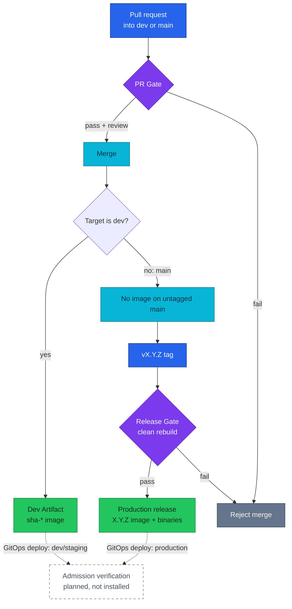
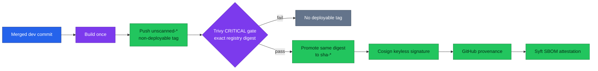

# CI/CD trust gates

CI is a trust-building pipeline: pull requests prove code quality without
publishing artifacts, `dev` creates deployable non-production artifacts, and a
semantic tag from `main` creates a production release from scratch.

| Fact | Value |
|------|-------|
| Branch model | Long-lived `dev` and `main`; no `uat` branch |
| Shared implementation | `duynhlab/gha-workflows` v2 candidate, [PR #119](https://github.com/duynhlab/gha-workflows/pull/119) |
| Consumer adoption | **Not started**; service repositories still need individual migration PRs |
| Production trigger | Exact `vX.Y.Z` tag whose commit is reachable from `main` |
| Image policy | `sha-*` for dev/staging; `X.Y.Z` for production; never `latest` |
| Cluster admission | Signature/provenance verification is **planned**, not installed |

## Overview

Each event has a different trust boundary. A PR has no trusted artifact identity,
so it cannot push, sign, or attest an image. A merge to `dev` creates an immutable
non-production identity. A release tag repeats every check and performs a clean
build instead of trusting an earlier branch artifact.

```mermaid
flowchart TD
  PR["Pull request<br/>into dev or main"] --> PRG{"PR Gate"}
  PRG -->|"pass + review"| MERGE["Merge"]
  PRG -->|"fail"| STOP["Reject merge"]
  MERGE --> DEV{"Target is dev?"}
  DEV -->|"yes"| DA["Dev Artifact<br/>sha-* image"]
  DEV -->|"no: main"| MAIN["No image on untagged main"]
  MAIN --> TAG["vX.Y.Z tag"]
  TAG --> RG{"Release Gate<br/>clean rebuild"}
  RG -->|"pass"| PROD["Production release<br/>X.Y.Z image + binaries"]
  RG -->|"fail"| STOP
  DA -. "GitOps deploy: dev/staging" .-> ADMISSION["Admission verification<br/>planned, not installed"]
  PROD -. "GitOps deploy: production" .-> ADMISSION

  classDef edge fill:#2563eb,color:#fff,stroke:#1e3a8a;
  classDef service fill:#06b6d4,color:#082f49,stroke:#0e7490;
  classDef worker fill:#f59e0b,color:#451a03,stroke:#b45309;
  classDef platform fill:#7c3aed,color:#fff,stroke:#5b21b6;
  classDef data fill:#22c55e,color:#052e16,stroke:#15803d;
  classDef external fill:#64748b,color:#fff,stroke:#334155;
  classDef planned fill:#fff,color:#475569,stroke:#64748b,stroke-dasharray:5 5;
  class PR,TAG edge;
  class MERGE,MAIN service;
  class PRG,RG platform;
  class DA,PROD data;
  class STOP external;
  class ADMISSION planned;
```

## Gate contract

### PR Gate: fast feedback, no publication

The caller runs on pull requests targeting `dev` or `main`. With the supplied
caller template, the expected aggregate context is `check / PR Gate`; confirm
it on a pilot PR before activating a ruleset.

| Check | Enforcement |
|-------|-------------|
| Branch policy | `dev` accepts approved topic prefixes; `main` accepts only `dev` or `hotfix/*` |
| Quality | `golangci-lint` and `go test -race` with `coverage.out` |
| Reachable vulnerabilities | `govulncheck` blocks findings reachable from application code |
| Secrets and SAST | Gitleaks plus CodeQL/security analysis |
| Container | Build for local loading only; never push; Trivy blocks `CRITICAL` and ignores unfixed findings |
| SonarCloud | Runs after tests so it receives `coverage.out`; waits for and fails on the Quality Gate |

The SonarCloud Quality Gate must assess **new code**, not punish a PR for legacy
debt. Configure the new-code definition and conditions in SonarCloud; the
workflow only enforces the result. Dependabot cannot receive repository secrets,
so Sonar may be skipped for Dependabot while the remaining checks and human
review remain mandatory.

PR workflows deliberately omit Cosign, provenance, and SBOM generation. Those
claims only become meaningful after the repository creates a publishable
artifact identity.

### Dev Artifact: immutable non-production identity

A push to `dev` reruns lint and tests, then publishes `sha-<short-sha>` for
dev/staging only. The image follows a quarantine-and-promote path:

```mermaid
flowchart LR
  SOURCE["Merged dev commit"] --> BUILD["Build once"]
  BUILD --> QUARANTINE["Push unscanned-*<br/>non-deployable tag"]
  QUARANTINE --> SCAN{"Trivy CRITICAL gate<br/>exact registry digest"}
  SCAN -->|"fail"| BLOCK["No deployable tag"]
  SCAN -->|"pass"| PROMOTE["Promote same digest<br/>to sha-*"]
  PROMOTE --> SIGN["Cosign keyless signature"]
  SIGN --> PROV["GitHub provenance"]
  PROV --> SBOM["Syft SBOM attestation"]

  classDef edge fill:#2563eb,color:#fff,stroke:#1e3a8a;
  classDef service fill:#06b6d4,color:#082f49,stroke:#0e7490;
  classDef platform fill:#7c3aed,color:#fff,stroke:#5b21b6;
  classDef data fill:#22c55e,color:#052e16,stroke:#15803d;
  classDef external fill:#64748b,color:#fff,stroke:#334155;
  class SOURCE edge;
  class BUILD,SCAN platform;
  class QUARANTINE,PROMOTE,SIGN,PROV,SBOM data;
  class BLOCK external;
```

Scanning the exact registry digest closes the gap between what was scanned and
what is deployed. Promotion copies that digest; it does not rebuild it. The
temporary `unscanned-*` tag is quarantine state and must never appear in GitOps.

### Release Gate: fresh production evidence

An untagged merge to `main` publishes nothing. A `vX.Y.Z` tag starts the release
workflow, which first proves the tagged commit is reachable from `main`, then:

1. Reruns lint, race tests, `govulncheck`, Gitleaks, and security analysis.
2. Builds the image without registry build cache.
3. Scans the exact pushed quarantine digest and promotes the same digest only on
   success.
4. Publishes only `X.Y.Z`; no `latest`, floating major, or floating minor tag.
5. Signs the image and attaches provenance and SBOM attestations.
6. Optionally runs GoReleaser and attests its checksum file.

Production GitOps must pin `X.Y.Z` or the digest. A release never reuses the
`sha-*` image because the tag event is the production trust boundary.

## Continuous and admission controls

Two control layers operate outside the event pipeline:

| Control | State | Purpose |
|---------|-------|---------|
| Dependabot | Current per repository | Opens dependency-update PRs that pass the PR Gate |
| Scheduled Go security scan | Available in shared workflows | Detects newly disclosed reachable vulnerabilities |
| Registry rescanning | **Planned** | Finds CVEs disclosed after publication |
| OpenSSF Scorecard / OSV schedule | **Planned** | Adds repository and ecosystem posture checks |
| Kyverno verification | **Planned, not installed** | Rejects images without an accepted registry, signature, and CI provenance |

Admission should roll out as `Audit` before `Enforce`. The enforce policy must
verify the immutable digest, a Cosign signature from the approved GitHub Actions
identity, provenance from the approved reusable workflow, and the GHCR
allowlist. Introducing that policy requires a separate security change with a
Kind audit and an exception/runbook review.

## Consumer templates

Copy the appropriate caller into a service repository and replace the workflow
reference with an immutable released v2 commit SHA:

| Template | Destination | Trigger |
|----------|-------------|---------|
| [`check_template.yml`](check_template.yml) | `.github/workflows/check.yml` | PR to `dev` or `main` |
| [`build_template.yml`](build_template.yml) | `.github/workflows/build.yml` | Push to `dev` |
| [`release_template.yml`](release_template.yml) | `.github/workflows/release.yml` | `vX.Y.Z` tag |
| [`sync_main_to_dev_template.yml`](sync_main_to_dev_template.yml) | `.github/workflows/sync-main-to-dev.yml` | Push to `main` |

The checked-in templates temporarily pin the immutable commit from the v2
candidate PR. Replace that pin with the final v2 release commit before consumer
rollout. Reusable workflows can only reduce caller permissions, so each caller
must grant the documented minimum permissions explicitly.

## Operations

### Required repository controls

- Require `check / PR Gate` on `dev` and `main`; confirm the exact check name
  from a real pilot PR before activating the ruleset.
- Require at least one human approval, dismiss stale approvals, block deletion
  and force-push, and require conversation resolution.
- Restrict release tags matching `v*`; create tags only from `main`.
- Store `SONAR_TOKEN` as an Actions secret and disable SonarCloud Automatic
  Analysis to avoid duplicate analysis.
- Store `SYNC_BRANCH_TOKEN` for the main-to-dev synchronization PR. A PR opened
  with the default `GITHUB_TOKEN` does not trigger another workflow run.

### Failure handling

| Failure | Response |
|---------|----------|
| PR Gate | Fix the topic branch; do not bypass the required check |
| Dev scan | No `sha-*` is promoted; fix or time-box a reviewed CVE exception |
| Release source guard | Delete the invalid tag and recreate it on a `main` commit |
| Release scan/sign/attest | Treat the version as failed; fix and issue a new version |
| Sync conflict | Resolve the generated main-to-dev PR manually; never force-update `dev` |

## Verification

Before adopting the standard in a service repository:

1. Validate callers with `actionlint`.
2. Open a PR to `dev` and prove no image or attestation is published.
3. Merge to `dev`; verify `sha-*`, digest equality after promotion, signature,
   provenance, and SBOM.
4. Promote `dev` to `main`; verify the untagged merge publishes no image and
   opens the synchronization PR when needed.
5. Tag a pilot `vX.Y.Z` commit on `main`; verify the versioned image and release
   assets, then confirm a non-main tag is rejected.
6. Observe exact check names before enabling active GitHub rulesets.

## References

- [Reusable workflows](https://docs.github.com/en/actions/sharing-automations/reusing-workflows)
- [GitHub artifact attestations](https://docs.github.com/en/actions/security-for-github-actions/using-artifact-attestations/using-artifact-attestations-to-establish-provenance-for-builds)
- [Docker Buildx attestations](https://docs.docker.com/build/metadata/attestations/)
- [Events triggered by `GITHUB_TOKEN`](https://docs.github.com/en/actions/how-tos/writing-workflows/choosing-when-your-workflow-runs/triggering-a-workflow)
- [Gitflow and branch governance](gitflow.md)
- [SonarCloud integration](sonarcloud.md)

_Last updated: 2026-08-31._
