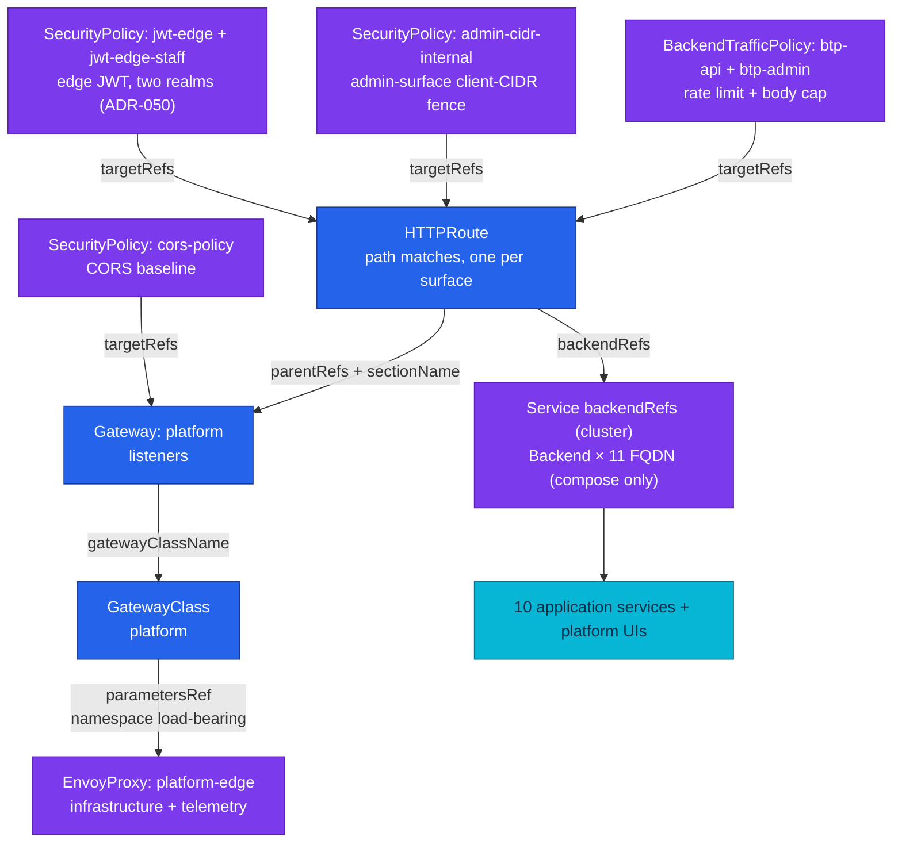
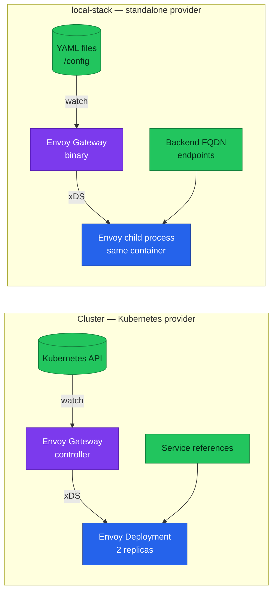
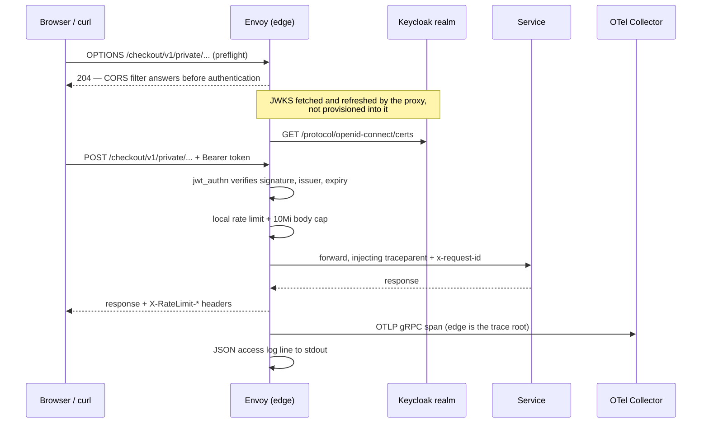

# Envoy Gateway

The platform edge: a Gateway API control plane that compiles declarative routing
and policy resources into Envoy configuration, and the one component every
external request passes through before it reaches a service.

| Fact | Value |
|------|-------|
| Control plane | Envoy Gateway v1.9.0 — cluster (chart digest-pinned) and the local standalone edge (compose image digest-pinned), skew closed 2026-08-19 |
| Data plane | Envoy proxy, configured over xDS by the control plane |
| API surface | Gateway API standard channel, bundle-version `v1.6.1` (`GatewayClass`, `Gateway`, `HTTPRoute`) + Envoy Gateway extensions (`Backend`, `EnvoyProxy`, `SecurityPolicy`, `BackendTrafficPolicy`) |
| Cluster config | `kubernetes/infra/configs/envoy-gateway/` — Kubernetes provider, 2 replicas, NodePort 30080/30443 |
| Local config | `local-stack/gateway/eg/` — standalone provider, one Envoy child process, published on `:8080`; `envoyproxy/gateway:v1.9.0` (bumps ride the compose E2E audit) |
| Edge authentication | `SecurityPolicy.jwt` with `remoteJWKS` against **two realms**: `duynhlab` (customer `/private/` surfaces) and `duynhlab-staff` (Backoffice `/protected/` surfaces, ADR-050); no key material in git |
| Edge telemetry | OTLP **gRPC** traces, JSON access log on **two** sinks — stdout (`File`) and OTLP to the collector ([ADR-060](../proposals/adr/ADR-060-envoy-access-log-transport/)) — Prometheus stats endpoint |
| Edge `service.name` in traces | Derived as `<gateway>.<namespace>` — locally `platform.envoy-gateway-system` |
| Verified | Local edge end-to-end on 2026-08-12: root span, trace continuity, access log field set, edge JWT 401/200 |
| Resources | 39 HTTPRoutes defined / **35 reconciled** (`routes/mcp.yaml` disabled) + 33 policy objects — [inventory](#resource-inventory) |
| Design records | [ADR-044](../proposals/adr/ADR-044-envoy-gateway-platform-edge/) (edge) · [ADR-045](../proposals/adr/ADR-045-local-first-edge-rate-limiting/) (rate limiting) · [ADR-046](../proposals/adr/ADR-046-e2e-gate-kind-fallback/) (the gate) — see [Design decisions](#design-decisions) |
| Cluster status | **Reconciled on Kind** during the RFC-0024 bring-up — #791 fixed two runtime defects against the live edge (CRD delivery, data-plane node placement); the full end-to-end Kind gate pass (K-rows) is still pending |

## Why an edge control plane at all

A service mesh's north-south edge has to answer four questions on every request,
and the platform wants those answers in git rather than in a running process:

1. **Does this path exist?** Routing is an allowlist, not a default. A path with
   no route is a 404 from the edge, and nothing behind it is contacted.
2. **May this caller proceed?** Token validation happens before routing, so an
   unauthenticated request never reaches a service.
3. **Is this request within its budget?** Body size and request rate are capped
   at the edge, where a rejection costs one proxy decision.
4. **What happened?** Every request produces a span and a structured log line
   from the proxy's own point of view, independent of what any service reports.

Envoy answers all four, and Envoy Gateway is the piece that lets those answers
be *declared* — Gateway API resources in, Envoy configuration out, reconciled
continuously.

## The resource model

Six kinds, in two groups. Gateway API defines the routing skeleton; Envoy
Gateway's extension APIs supply what the skeleton cannot express.

Blue is Gateway API, portable across implementations. Purple is an Envoy Gateway
extension kind. Solid arrows point from a resource to the resource it names.



Counts are deliberately **not** in the diagram labels — they drifted there
before. They live in [Resource inventory](#resource-inventory), which is one
table per kind and can be checked against the manifests in a single pass.

**GatewayClass** names the controller that will act on a Gateway, and — through
`parametersRef` — the implementation config to act with. **Gateway** declares
listeners: protocol, port, and which namespaces may attach routes.
**HTTPRoute** attaches to a listener and maps matches to backends.

The extensions fill three gaps. **EnvoyProxy** describes the proxy itself
(replicas, resources, telemetry) — things Gateway API deliberately leaves to
implementations. **Backend** names an upstream by FQDN, for environments with no
Kubernetes `Service` to reference. **SecurityPolicy** and
**BackendTrafficPolicy** are policy attachments: they carry authentication,
CORS, rate limiting, and body caps, and they bind to a target by reference
rather than being embedded in the route.

### Policy attachment, and the two rules that surprise people

Policies attach by `targetRefs` and compose *hierarchically* — Gateway-level
policy forms a baseline, route-level policy refines it. Two behaviours follow
that are worth knowing before writing a second policy:

- **A route-level policy of the same kind replaces the Gateway-level one by
  default.** It does not layer. Setting `mergeType: StrategicMerge` is what
  makes the route policy merge onto the baseline instead — without it, attaching
  a route-level `SecurityPolicy` for JWT silently removes that route's inherited
  CORS.
- **Two policies of the same kind on the same target do not merge at all.** The
  conflict is resolved by creation order — oldest wins — and the loser is
  reported as not-accepted in its status. A second policy contributes nothing,
  quietly.

## Resource inventory

Verified against `kubernetes/infra/configs/envoy-gateway/`. Every count here is a
`grep` away from being re-checked — do that rather than trusting the number.

### Core resources

| Object | File | What it fixes |
|--------|------|---------------|
| `GatewayClass platform` | `gatewayclass.yaml` | One class, one Gateway; `parametersRef` points at the `EnvoyProxy` — **the `namespace` field there is load-bearing** |
| `EnvoyProxy platform` | `envoyproxy.yaml` | Data-plane shape: 2 replicas + PDB `minAvailable: 1`, NodePort 30080/30443, JSON access log, OTLP tracing at 50 % (cluster baseline; 100 % on Kind), Prometheus stats |
| `Certificate platform-edge-tls` | `certificate.yaml` | The wildcard edge certificate — see [TLS](#tls-at-the-edge) |
| `Gateway platform` | `gateway.yaml` | Two listeners on `*.duynh.me`: `http:80` and `https:443` (Terminate) |
| `HTTPRoute https-redirect` | `gateway.yaml` | Attaches to the `http` listener only, and 301s everything to HTTPS |
| `Service edge` | `edge-service.yaml` | **Stable in-cluster name for the proxy fleet** (ADR-062): the EG-generated Service is name-hashed, so nothing in git can reference it; this one selects the same pods and forwards `443 → 10443` |
| `ConfigMap kube-system/coredns` | `coredns.yaml` | The **issuer hairpin**: a `rewrite` maps `id.duynh.me` → `edge.envoy-gateway.svc` so pods can reach the public issuer (OpenBAO's `oidc_discovery_url` cannot split URLs) |

**The CoreDNS row deserves a second look** — it is the one object here that
lives outside this namespace and outside Gateway API. kubeadm creates that
ConfigMap at cluster init; Flux takes it over by server-side apply (the file
carries the live-captured default Corefile verbatim plus one `rewrite stop`
block, and CoreDNS's default `reload` plugin picks edits up without a
restart). On a rebuild kubeadm writes its default again and Flux converges it
back within one reconcile. Split-horizon DNS is the whole trick: in-cluster,
`id.duynh.me` *is* the edge.

### Routes

**39 HTTPRoutes are defined; 35 reconcile.** The four in `routes/mcp.yaml` are
commented out of `kustomization.yaml` (disabled 2026-08-21 with `mcp-local`) —
their backends are gone, so leaving them active would resolve a route and then
503.

| File | Routes | Hostnames | Edge JWT | Rate limit | CIDR fence |
|------|:-----:|-----------|:--------:|:----------:|:----------:|
| `routes/api.yaml` | 18 | `gateway.duynh.me` | 13 of 18 | `btp-api` | — |
| `routes/monitoring.yaml` | 8 | `grafana`, `victoriametrics`, `vmalert`, `karma`, `victoriatraces`, `pyroscope`, `logs`, `slo` | — | `btp-admin` | ✅ |
| `routes/infra.yaml` | 4 | `ui`, `source`, `openbao`, `kyverno` | — | `btp-admin` | ✅ |
| `routes/frontend.yaml` | 1 | `local.duynh.me` | — | — | — |
| `routes/backoffice.yaml` | 1 | `backoffice.duynh.me` | — | — | — |
| `routes/keycloak.yaml` | 1 | `id.duynh.me` | — | — | — |
| `routes/temporal.yaml` | 1 | `temporal.duynh.me` | — | — | — |
| `gateway.yaml` | 1 | `*.duynh.me` (`http` listener) | — | — | — |
| `routes/mcp.yaml` | 4 | `vm-mcp`, `vl-mcp`, `flux-mcp`, `grafana-mcp` | — | — | ✅ |

The last row is **not reconciled**. `frontend`, `backoffice`, `id` and
`temporal` carrying no fence and no limit is deliberate in each case: the first
two are static assets, Keycloak owns its own security headers and must be
publicly reachable, and `temporal-ui` is recorded as an accepted exception in its
own file.

### The API surface

The 18 API routes, and which realm guards each. This is the table to read before
changing a prefix — the prefix *is* the security boundary
([Routing is audience-scoped](#routing-is-audience-scoped)).

| Route | Namespace | Path prefix | Edge JWT |
|-------|-----------|-------------|----------|
| `api-user-public` | user | `/user/v1/public` | none — anonymous |
| `api-product` | product | `/product/v1/public` | none — anonymous |
| `api-review-public` | review | `/review/v1/public` | none — anonymous |
| `api-shipping` | shipping | `/shipping/v1/public` | none — anonymous |
| `api-payment-webhooks` | payment | `/payment/v1/public/payments/webhooks`, `/payment/v1/public/webhooks` | none — **HMAC over the raw body is the credential** |
| `api-user-private` | user | `/user/v1/private` | `duynhlab` |
| `api-cart` | cart | `/cart/v1/private` | `duynhlab` |
| `api-order` | order | `/order/v1/private` | `duynhlab` |
| `api-review-private` | review | `/review/v1/private` | `duynhlab` |
| `api-notification` | notification | `/notification/v1/private` | `duynhlab` |
| `api-payment-private` | payment | `/payment/v1/private` | `duynhlab` |
| `api-checkout-private` | checkout | `/checkout/v1/private` | `duynhlab` |
| `api-user-protected` | user | `/user/v1/protected` | `duynhlab-staff` |
| `api-product-protected` | product | `/product/v1/protected` | `duynhlab-staff` |
| `api-inventory-protected` | inventory | `/inventory/v1/protected` | `duynhlab-staff` |
| `api-order-protected` | order | `/order/v1/protected` | `duynhlab-staff` |
| `api-payment-protected` | payment | `/payment/v1/protected` | `duynhlab-staff` |
| `api-shipping-protected` | shipping | `/shipping/v1/protected` | `duynhlab-staff` |

Every one of the 18 also carries a `ResponseHeaderModifier` security-headers
filter (`nosniff`, `strict-origin-when-cross-origin`, `X-Frame-Options: DENY`,
HSTS).

### Policies

**33 policy objects.** Policy `targetRefs` are same-namespace only, which is why
one logical policy appears once per namespace rather than once overall — the
repeated names below are not duplicates.

| Kind | Name | Count | Attaches to | Carries |
|------|------|:-----:|-------------|---------|
| `SecurityPolicy` | `cors-policy` | 1 | the **Gateway** | The CORS baseline every route inherits; exposes `X-RateLimit-*` so the SPA can read its quota |
| `SecurityPolicy` | `jwt-edge` | 7 | customer `/private/` routes | `remoteJWKS` against realm `duynhlab` |
| `SecurityPolicy` | `jwt-edge-staff` | 6 | staff `/protected/` routes | `remoteJWKS` against realm `duynhlab-staff` (ADR-050) |
| `SecurityPolicy` | `admin-cidr-internal` | 5 | admin UI routes in `monitoring`, `flux-system`, `rustfs`, `openbao`, `policy-reporter` | `defaultAction: Deny` + a private/in-cluster allow list |
| `BackendTrafficPolicy` | `btp-api` | 9 | the API routes, per namespace | Local rate limit 25/s **per instance**, 10Mi body cap, retries, timeouts, active + passive health checks |
| `BackendTrafficPolicy` | `btp-admin` | 5 | the same 5 admin namespaces | Local rate limit 600/min per instance |

All 13 JWT policies and all 5 CIDR policies set `mergeType: StrategicMerge` —
without it they would silently drop the inherited CORS baseline. No JWT policy
declares `audiences`; that is deliberate and explained in
[Design decisions](#design-decisions).

### TLS at the edge

One `Certificate`, `platform-edge-tls`, covers the whole edge: commonName
`duynh.me` with dnsNames `duynh.me` and `*.duynh.me`, ECDSA P-256,
`rotationPolicy: Always`, 90-day duration renewed 15 days out. The `https`
listener references the resulting Secret.

The issuer differs by environment and that difference is a **patch, not a second
manifest**: the base names `letsencrypt-prod`, and
`clusters/local/envoy-gateway-config.yaml` patches it to the self-signed
`homelab-ca` because Kind has no real `duynh.me` zone for an ACME DNS-01
challenge to complete against. Certificate mechanics, trust distribution, and
rotation live in [cert-manager.md](../secrets/cert-manager.md) — not here.

### Flux position

```text
controllers-local ─→ envoy-gateway-local ─┐
gateway-api-crds-local ───────────────────┤
cert-manager-local ───────────────────────┼─→ envoy-gateway-config-local
keycloak-local ───────────────────────────┘            │
secrets-local ──────────────────────────────────┬──────┘
                                                └─→ openbao-oidc-config-local
```

`envoy-gateway-config-local` waits on **cert-manager** (the listener needs its
Secret) and on **keycloak-local** (every JWT policy carries a `remoteJWKS` URL —
configuring the edge before the JWKS endpoint resolves would fail every guarded
route closed). It also owns the two local-only patches: the `homelab-ca` issuer
swap and 100 % trace sampling. **`openbao-oidc-config-local`** hangs off it
(ADR-062): that Job's `auth/oidc/config` write makes OpenBAO fetch the
discovery document through the CoreDNS hairpin above, so the edge must be
serving first. Full graph: [setup.md](setup.md).

## Two control planes, one dialect

The platform runs Envoy Gateway in both of its provider modes. This is the
single most useful property of the component here: the local release gate and the
cluster edge consume *the same resource dialect*, so a routing or policy mistake
is found on a laptop rather than in a cluster.



The differences are confined to where resources come from and how the data plane
is supervised:

| Aspect | Kubernetes provider | Standalone provider |
|--------|--------------------|--------------------|
| Resource source | Kubernetes API, watched | Files, watched (`provider.custom.resource.file.paths`) |
| Data plane | `Deployment` the controller manages | Child process of the control-plane container |
| Upstream reference | `Service` in `backendRefs` | `Backend` with `fqdn` endpoints |
| Namespaces | Real | All namespace-less resources land in one default namespace |
| Maturity | Stable | **Experimental upstream** — suitable for a local gate, not for production |

Standalone mode needs `extensionApis.enableBackend: true`, or the `Backend` kind
stays unimplemented and every route resolves to nothing.

## How it works in this platform

### Request path



Filter order is the part to internalise: **CORS answers preflights before
`jwt_authn` runs**. That ordering is required rather than convenient — a browser
preflight carries no `Authorization` header by definition, so authentication
ahead of CORS would reject every preflight and the real request would never be
sent.

### Routing is audience-scoped

Every service exposes three audiences under one prefix: `/public/` (anonymous),
`/private/` (caller-authenticated), and `/internal/` (east-west only). The edge
publishes the first two and **must never publish the third** — some internal
endpoints take the target user from the path, and some accept writes with no
authentication of their own, because their only intended caller is another
service inside the network.

This makes the route prefix itself a security boundary. Each `PathPrefix`
therefore stops *after* the audience segment (`/cart/v1/private`, never
`/cart/`). Gateway API's segment-wise matching is what makes this safe:
`/cart/v1/private` matches that segment and its children but never
`/cart/v1/privatefoo`. A request to any `/internal/` path matches no route at
all, which is why it is answered `404` by the edge — the audit asserts exactly
that, and distinguishes it from a service's own 404 by the empty `route_name`
in the access log.

### Telemetry the edge produces

The edge is a first-class telemetry producer, not just a hop that requests pass
through. Three signals, each with a detail that matters:

**Traces.** The edge is the trace **root** — the first span of every
browser-driven trace — and it propagates W3C `traceparent` to the upstream, so
the service's span is parented rather than starting a second disconnected trace.
The sampler is `ParentBased`, so `samplingRate` only decides what the edge does
when *it* starts a trace; an already-sampled inbound trace is always honoured.
Its `service.name` is not configured anywhere: Envoy Gateway derives it from the
Gateway's identity as `<gateway>.<namespace>`. Discover that value rather than
assuming it, because renaming the Gateway changes it.

The tracing provider speaks **OTLP gRPC only**. The Go services all export over
OTLP HTTP, so a collector configured for HTTP alone serves the entire fleet
perfectly while giving the edge nowhere to send anything — with no error on the
request path. Both receivers must be enabled.

**Access logs.** A custom JSON format, because field *names* are a contract that
log pipelines and dashboards select on. Two fields do the diagnostic work:
`response_flags` (how Envoy itself disposed of the request — `UAEX` denied by an
auth filter, `UF`/`UC` upstream connect failure, `NR` no route, `-` upstream
answered normally) and `route_name`/`upstream_cluster`, which carry the matched
route's identity into the log line.

**Metrics.** Envoy's Prometheus endpoint exposes proxy-internal stats. RED
metrics for edge traffic are derived downstream from spans by the collector's
spanmetrics connector, so the two are complementary rather than redundant.

### Signals, and who consumes them

| Signal | Producer | Pipeline | Consumer |
|--------|----------|----------|----------|
| Traces | Envoy, `ParentBased(TraceIDRatio)` — 50 % cluster baseline, 100 % local | OTLP **gRPC** → otel-collector | VictoriaTraces + ClickHouse; spanmetrics connector derives edge RED |
| Access logs | Envoy, custom JSON | Two sinks: stdout (`File`) → Vector, and OTLP → collector ([ADR-060](../proposals/adr/ADR-060-envoy-access-log-transport/)) | VictoriaLogs |
| Metrics | Envoy Prometheus stats endpoint | VMAgent scrape | VictoriaMetrics |

Consumers that exist today:

- **Dashboards** — "Envoy Gateway — Edge Overview" (uid `eg-edge`), plus four
  vendored upstream boards under
  `configs/observability/grafana/dashboards/envoy-gateway/` (Gateway Global,
  Envoy Global, Envoy Clusters, Resources Monitor).
- **Recording rules** — 10, all prefixed `edge:` or `edge_cluster:`
  (`edge:rq_5xx_ratio:rate5m`, `edge:latency_ms:p95_5m`, …). Alerts and
  dashboards read the rules, not raw stats, so a stat rename is a one-file fix.
- **Alerts** — 12 in
  `prometheusrules/envoy-gateway/alerts.yaml`, catalogued in
  [alert-catalog.md § 2](../observability/alerting/alert-catalog.md): `EdgeDown`,
  `Edge5xxRatioHigh`/`Critical`, `EdgeLatencyP95High`/`Critical`,
  `EdgeNoTraffic`, `Edge429RatioHigh`, `EdgeUpstreamUnhealthy`,
  `EdgeJWKSFetchFailing`, `EdgeAuthDeniedRatioHigh`,
  `EnvoyGatewayControllerDown`, `EnvoyGatewayReconcileErrors`.
- **Runbooks** — 10 under
  [`runbooks/envoy-gateway/`](../observability/runbooks/envoy-gateway/README.md);
  the `High`/`Critical` pairs share one runbook each.

Two of those alerts only exist because of this platform's specific failure
history: `EdgeJWKSFetchFailing` watches the dependency that took every guarded
route down when the identity NetworkPolicy was short two namespaces, and
`EdgeNoTraffic` catches the silent-misconfiguration class where the edge serves
200s while emitting nothing.

## Operations

### Verification runbook

An edge can serve traffic correctly and be misconfigured in ways no request
reveals — Step 3 exists entirely for that class. Run these after any change under
`configs/envoy-gateway/` or `local-stack/gateway/eg/`.

#### Step 1: The control plane accepted its config

```bash
# cluster
kubectl -n envoy-gateway get gatewayclass,gateway,envoyproxy
kubectl -n envoy-gateway get gateway platform -o jsonpath='{.status.conditions[*].type}{"\n"}'
# local-stack
curl -s http://localhost:8099/readyz
```

**Expected**: the `GatewayClass` is `Accepted`, the `Gateway` reports
`Programmed` **and** `Accepted`, and every listener shows its attached-route
count. Locally, `readyz` returns OK.

#### Step 2: Every route and policy was accepted

```bash
kubectl get httproute -A -o custom-columns='NS:.metadata.namespace,NAME:.metadata.name,HOSTS:.spec.hostnames[*]'
kubectl get securitypolicy,backendtrafficpolicy -A
```

**Expected**: **35** HTTPRoutes (not 39 — `routes/mcp.yaml` is disabled), and
**33** policy objects. A policy present but not `Accepted` is the quiet failure
described in [Policy attachment](#policy-attachment-and-the-two-rules-that-surprise-people)
— check its status conditions, because a losing policy contributes nothing
without erroring.

#### Step 3: The EnvoyProxy actually attached

```bash
kubectl -n envoy-gateway logs deploy/envoy-gateway | grep -c 'failed to find envoyproxy'
# local-stack
docker compose logs gateway 2>&1 | grep -c 'failed to find envoyproxy'
```

**Expected**: `0`. Any other number means `parametersRef` resolved nothing, so
the proxy is running with defaults: no access log, no tracing, and **no
indication on the request path** — every route still answers 200. This has
happened here; it is the reason the check exists.

#### Step 4: The data plane serves, and redirects

```bash
curl -so /dev/null -w '%{http_code}\n' http://localhost:8080/product/v1/public/products
curl -sI http://gateway.duynh.me/product/v1/public/products | head -1
```

**Expected**: `200` from the data plane, and `301` from the plain-HTTP listener
(the `https-redirect` route). A `200` over plain HTTP means the redirect route
lost its listener binding.

#### Step 5: Edge JWT denies and admits

```bash
curl -so /dev/null -w 'no token: %{http_code}\n'  http://localhost:8080/cart/v1/private/cart
TOKEN=$(local-stack/scripts/keycloak-token.sh)
curl -so /dev/null -w 'with token: %{http_code}\n' \
  -H "Authorization: Bearer $TOKEN" http://localhost:8080/cart/v1/private/cart
```

**Expected**: `401` then `200`. Repeat against a `/protected/` route with a
**staff** token — a customer token there must be rejected as wrong-issuer, which
is the whole point of two realms.

#### Step 6: `/internal/` is not published

```bash
curl -so /dev/null -w '%{http_code}\n' http://localhost:8080/user/v1/internal/users
```

**Expected**: `404` **from the edge** — no route matches. Distinguish it from a
service's own 404 by the empty `route_name` in the access log. Anything other
than 404 here is a security finding, not a routing bug.

#### Step 7: Rate limiting returns 429 with headers

```bash
for i in $(seq 1 60); do
  curl -so /dev/null -w '%{http_code} ' http://localhost:8080/product/v1/public/products
done; echo
```

**Expected**: 200s then 429s, with `X-RateLimit-*` (draft-03) on the responses.
The bucket is 25/s **per instance** — see
[Design decisions](#design-decisions) for why that number, and why it is not a
per-caller guarantee.

#### Step 8: Telemetry is arriving

```bash
curl -s http://localhost:8080/product/v1/public/products >/dev/null
docker compose logs --tail=5 gateway | grep -o '"response_flags":"[^"]*"'
```

**Expected**: a JSON access-log line per request with `response_flags` present
(`-` when the upstream answered normally). Then confirm a root span reached
VictoriaTraces with `service.name` = `<gateway>.<namespace>` — **discover** that
value rather than assuming it.

#### Step 9: The full gate

`make e2e GATE=compose` asserts the HTTP-shaped rows of the audit, including the
route, JWT and rate-limit rows above. The complete gate is
[the E2E release audit](../../local-stack/docs/e2e-audit.md); its cluster twin is
[kind-e2e-audit.md](kind-e2e-audit.md).

### Failure modes worth knowing

Each of these was observed on a running edge, and none is visible to manifest
validation.

| Symptom | Cause | Signal |
|---------|-------|--------|
| Every route answers 200, edge emits **zero spans and no JSON access log** | `parametersRef` omitted its `namespace`, so the controller resolved the `EnvoyProxy` in the wrong namespace and attached none | `failed to find envoyproxy <ns>/<name>` once at startup; otherwise only a trace query notices |
| **Every route** answers 500, backends healthy | A local rate limit with more than one rule lacking `clientSelectors`. A selector-less rule is the catch-all descriptor, two are a duplicate, and a refused policy becomes a 500 direct response on every targeted route | Blast radius is the whole edge, not the limiter — the shape of the symptom hides the cause |
| Edge answers nothing, container appears up | Standalone only: the control plane must self-sign xDS material before it can talk to its own Envoy child, and it downloads the Envoy binary at runtime | A certgen step must exit 0 before the gateway starts; the first boot after a volume wipe needs outbound internet |
| Nothing listening on the mapped port | A listener declared below port 1024 is bound at +10000 (so `80` listens on `10080`), which lets Envoy run without elevated capability | Port mapping targets a port nothing bound |
| An access-log field is always `null` | The operator sources an `x-envoy-*` response header; those are disabled by default, so the proxy never emitted it | Field present, value null on 100% of lines |
| A private route loses CORS after adding JWT | Route-level policy replaced the Gateway-level baseline instead of merging | Browser preflight fails on exactly the routes the SPA needs most |

### Troubleshooting by symptom

The table above names causes; these are the commands that confirm one.

**A route returns 404 and you expected it to exist**

```bash
kubectl get httproute -A | grep <name>
kubectl -n <ns> describe httproute <name> | sed -n '/Status/,$p'
```

Look at `Parents[].Conditions` — `ResolvedRefs: False` means the backend Service
name or port is wrong; `Accepted: False` means the hostname or listener binding
is. A route that is missing entirely may be one of the four in `routes/mcp.yaml`,
which are commented out of the kustomization.

**A route returns 401 with a valid-looking token**

```bash
kubectl -n <ns> describe securitypolicy jwt-edge | sed -n '/Status/,$p'
kubectl -n identity get endpoints keycloak
```

Check the issuer in the policy against the `iss` in the token — the two realms
are the usual mix-up. If the JWKS endpoint is unreachable the edge fails closed:
`EdgeJWKSFetchFailing` fires, and the identity NetworkPolicy is the first thing to
check ([Keycloak § Network reachability](keycloak.md#network-reachability)).

**Every route on the edge returns 500**

```bash
kubectl -n <ns> describe backendtrafficpolicy btp-api | sed -n '/Status/,$p'
```

Almost always a second selector-less rate-limit rule — see
[Design decisions](#design-decisions). The blast radius is the whole edge, which
disguises the cause.

**Browser preflight fails on exactly the routes the SPA needs**

```bash
kubectl -n <ns> get securitypolicy -o yaml | grep -A2 mergeType
```

A route-level `SecurityPolicy` without `mergeType: StrategicMerge` replaced the
Gateway-level CORS baseline instead of merging onto it.

**The edge serves fine but Grafana shows no edge traffic**

Run [Step 3](#step-3-the-envoyproxy-actually-attached) first — an unattached
`EnvoyProxy` produces exactly this. If that is clean, confirm the collector has
an OTLP **gRPC** receiver enabled; the edge speaks gRPC only, while every Go
service exports over HTTP, so an HTTP-only collector serves the fleet perfectly
and gives the edge nowhere to send anything.

### Changing routes or policy

1. Edit the resources — `kubernetes/infra/configs/envoy-gateway/` for the
   cluster, `local-stack/gateway/eg/` for local. Adding a file locally means
   adding it to `paths` in `standalone.yaml`; the file provider parses every
   non-hidden file in a watched directory as Gateway API YAML, so the control
   plane's own config cannot live in a watched directory.
2. `make validate`.
3. Bring the local stack up and run the
   [E2E release audit](../../local-stack/docs/e2e-audit.md). Route and policy
   changes are exactly what its Phase A and Phase C rows exist to catch;
   validation alone has never caught any of the failure modes above.
4. Keep the two environments' field names and route names aligned. A log field
   or route name that means different things in the two places makes every
   cross-environment comparison unreliable.

## Design decisions

Constraints that are already recorded in the design records, repeated here
because each one has bitten a change to this directory.

**Envoy Gateway is the edge, and Gateway API is the config model**
([ADR-044](../proposals/adr/ADR-044-envoy-gateway-platform-edge/), superseding
ADR-006's Kong binding). Two amendments to that ADR are live constraints today:

- **CRDs are delivered as vendored manifests with Flux server-side apply, not
  Helm.** The CRD Helm release Secret measured ~2.06 MB against a 1 MiB ceiling,
  and client-side `kubectl apply` hit the 256 KB annotation limit. The accepted
  cost is ~3.4 MB of generated YAML in git.
- **Adding `mergeType` to `cors-policy`, or re-targeting any merging policy at
  the `Gateway`, is an admission failure** since the v1.9.0 / Gateway API v1.6.1
  bump. The Gateway-level baseline stays as it is.

**Rate limiting is local token buckets, not a global rate-limit service**
([ADR-045](../proposals/adr/ADR-045-local-first-edge-rate-limiting/)). No RLS, no
Redis at the edge — so there is no stateful edge component and a whole class of
failure cannot occur. The honest cost: a bucket is **per instance and
aggregate**, not per caller, so with 2 replicas the effective ceiling is double
the configured number and one noisy client can consume another's budget. The
sizing was raised 2/s → 25/s per instance on 2026-08-22 after the original
number turned out to compare two incomparable things; `scripts/k6/ratelimit.js`
now asserts it.

**Exactly one selector-less rate-limit rule per policy.** A rule without
`clientSelectors` is the catch-all descriptor. Two of them are a duplicate, the
policy is refused, and a refused `BackendTrafficPolicy` becomes a 500 direct
response on **every** route it targeted.

**The edge does not verify the audience.** No `SecurityPolicy` declares
`audiences`, deliberately: the edge is a coarse pre-check and `pkg/authmw` is
authoritative, so the edge must never reject a token the services would accept.
The contract is owned by [identity.md](../api/identity.md#two-layers-and-what-each-one-actually-checks).

**The OIDC filter is not adopted.** Envoy Gateway can drive the whole
Authorization Code flow at the edge; the browser does it instead via
`keycloak-js` ([ADR-043](../proposals/adr/ADR-043-oidc-browser-workload-trust/)),
which keeps the edge stateless and session-free.

**The local gate runs the same dialect, and that was a conditional decision**
([ADR-046](../proposals/adr/ADR-046-e2e-gate-kind-fallback/), `Adoption:
Complete`). The standalone-spike arm was taken and passed, so the E2E gate stayed
on compose and the second config dialect — a 283-line `kong.yml` — is gone. The
Kind-fallback arm was never needed.

## References

- [`local-stack/gateway/eg/`](../../local-stack/gateway/eg/) — local resources,
  each file documenting its own non-obvious decisions
- [`kubernetes/infra/configs/envoy-gateway/`](../../kubernetes/infra/configs/envoy-gateway/)
  — cluster resources
- [E2E release audit](../../local-stack/docs/e2e-audit.md) — the gate that
  asserts the behaviour described here
- [`docs/api/api.md`](../api/api.md) — edge exposure and the per-service contracts
- [`docs/api/identity.md`](../api/identity.md) — the token contract the edge pre-checks and the services enforce
- [Keycloak (platform)](keycloak.md) — the JWKS endpoint every JWT policy depends on
- [cert-manager](../secrets/cert-manager.md) — how `platform-edge-tls` is issued and trusted
- [kind-e2e-audit.md](kind-e2e-audit.md) — the cluster twin of the compose gate
- [Alert catalog § 2](../observability/alerting/alert-catalog.md) · [edge runbooks](../observability/runbooks/envoy-gateway/README.md)
- Design records: [RFC-0024](../proposals/rfc/RFC-0024/) · [ADR-044](../proposals/adr/ADR-044-envoy-gateway-platform-edge/) (the edge) · [ADR-045](../proposals/adr/ADR-045-local-first-edge-rate-limiting/) (rate limiting) · [ADR-046](../proposals/adr/ADR-046-e2e-gate-kind-fallback/) (the gate) · [ADR-050](../proposals/adr/ADR-050-separate-staff-identity-realm/) (staff realm) · [ADR-060](../proposals/adr/ADR-060-envoy-access-log-transport/) (access-log transport)
- [`docs/platform/kong-gateway.md`](kong-gateway.md) — **archived**, the edge this replaced
- [Envoy Gateway documentation](https://gateway.envoyproxy.io/docs/) — upstream
- [Gateway API](https://gateway-api.sigs.k8s.io/) — the portable API this builds on

_Last updated: 2026-08-27 — ADR-062 issuer hairpin added to the inventory (Service `edge` + the CoreDNS ConfigMap takeover) and `openbao-oidc-config-local` to the Flux position. 2026-08-24 — refactored to the house shape. Adds a **Resource inventory** (core objects, route families, the 18-row API surface with its guarding realm, and all 33 policy objects), a TLS section, the Flux position, a signal/consumer table with the 12 alerts and 10 recording rules, a 9-step verification runbook replacing the 3-command triad, troubleshooting by symptom with commands, and a **Design decisions** section carrying the ADR-044/045/046 links the ADR-044 validation row required and this file never had. Counts moved out of a diagram label, where they had drifted: monitoring is 8 routes not 10, infra is 4 not 3, and 4 of the 39 do not reconcile — the previous total of 39 was right only by coincidence. Two route files still carry stale header comments (`api.yaml` says 12, `monitoring.yaml` says 10). Previously — 2026-08-20: HTTPRoute count 38 → 39 (mcp 3 → 4: the Grafana MCP route, also added to the admin-CIDR fence and btp-admin). 2026-08-19: cluster status corrected to "reconciled on Kind" (#791 fixed two runtime defects live; only the K-row gate pass remains), resource model recounted (13 JWT policies across two realms, admin-CIDR + btp-admin added, Backend marked compose-only); earlier same day: local edge bumped to v1.9.0 with the ADR-053 train_
