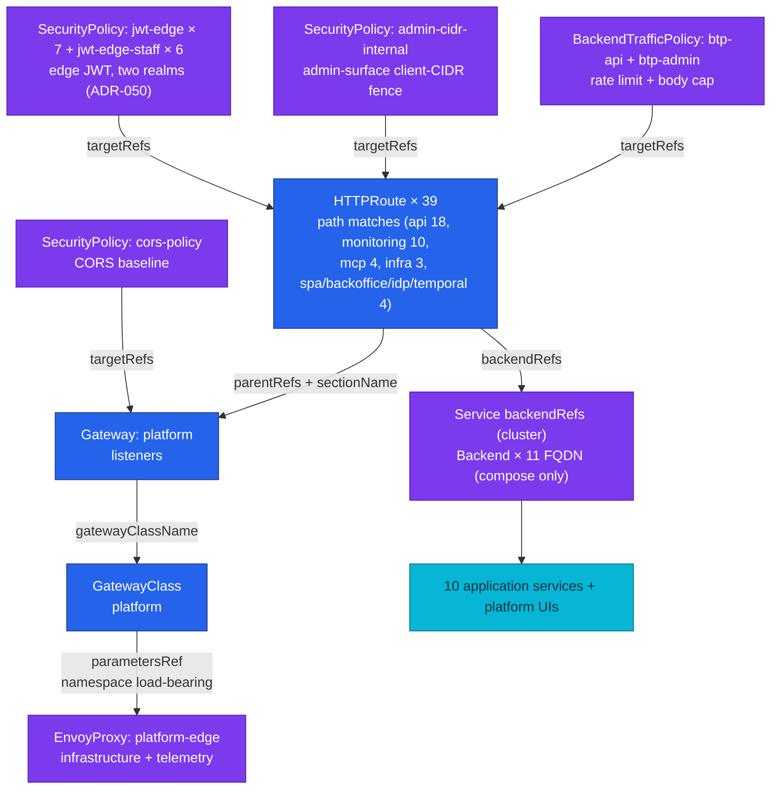
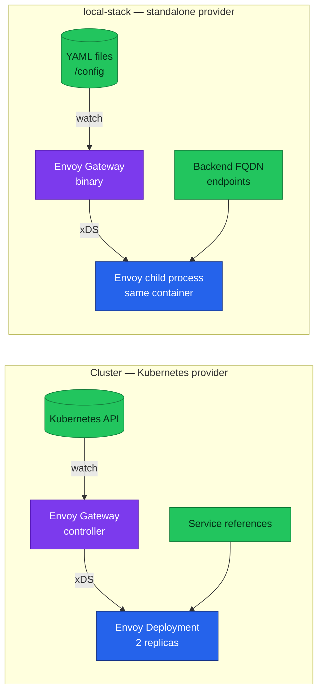
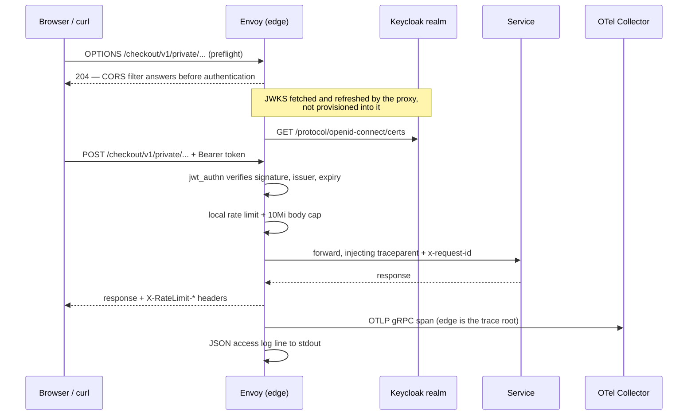

# Envoy Gateway

The platform edge: a Gateway API control plane that compiles declarative routing
and policy resources into Envoy configuration, and the one component every
external request passes through before it reaches a service.

| Fact | Value |
|------|-------|
| Control plane | Envoy Gateway v1.9.0 — cluster (chart digest-pinned) and the local standalone edge (compose image digest-pinned), skew closed 2026-08-19 |
| Data plane | Envoy proxy, configured over xDS by the control plane |
| API surface | Gateway API standard channel, bundle-version `v1.6.1` (`GatewayClass`, `Gateway`, `HTTPRoute`) + Envoy Gateway extensions (`Backend`, `EnvoyProxy`, `SecurityPolicy`, `BackendTrafficPolicy`) |
| Cluster config | `kubernetes/infra/configs/envoy-gateway/` — Kubernetes provider, 2 replicas, NodePort 30080/30443 |
| Local config | `local-stack/gateway/eg/` — standalone provider, one Envoy child process, published on `:8080`; `envoyproxy/gateway:v1.9.0` (bumps ride the compose E2E audit) |
| Edge authentication | `SecurityPolicy.jwt` with `remoteJWKS` against **two realms**: `duynhlab` (customer `/private/` surfaces) and `duynhlab-staff` (Backoffice `/protected/` surfaces, ADR-050); no key material in git |
| Edge telemetry | OTLP **gRPC** traces, JSON access log on stdout, Prometheus stats endpoint |
| Edge `service.name` in traces | Derived as `<gateway>.<namespace>` — locally `platform.envoy-gateway-system` |
| Verified | Local edge end-to-end on 2026-08-12: root span, trace continuity, access log field set, edge JWT 401/200 |
| Cluster status | **Reconciled on Kind** during the RFC-0024 bring-up — #791 fixed two runtime defects against the live edge (CRD delivery, data-plane node placement); the full end-to-end Kind gate pass (K-rows) is still pending |

## Why an edge control plane at all

A service mesh's north-south edge has to answer four questions on every request,
and the platform wants those answers in git rather than in a running process:

1. **Does this path exist?** Routing is an allowlist, not a default. A path with
   no route is a 404 from the edge, and nothing behind it is contacted.
2. **May this caller proceed?** Token validation happens before routing, so an
   unauthenticated request never reaches a service.
3. **Is this request within its budget?** Body size and request rate are capped
   at the edge, where a rejection costs one proxy decision.
4. **What happened?** Every request produces a span and a structured log line
   from the proxy's own point of view, independent of what any service reports.

Envoy answers all four, and Envoy Gateway is the piece that lets those answers
be *declared* — Gateway API resources in, Envoy configuration out, reconciled
continuously.

## The resource model

Six kinds, in two groups. Gateway API defines the routing skeleton; Envoy
Gateway's extension APIs supply what the skeleton cannot express.

Blue is Gateway API, portable across implementations. Purple is an Envoy Gateway
extension kind. Solid arrows point from a resource to the resource it names.



**GatewayClass** names the controller that will act on a Gateway, and — through
`parametersRef` — the implementation config to act with. **Gateway** declares
listeners: protocol, port, and which namespaces may attach routes.
**HTTPRoute** attaches to a listener and maps matches to backends.

The extensions fill three gaps. **EnvoyProxy** describes the proxy itself
(replicas, resources, telemetry) — things Gateway API deliberately leaves to
implementations. **Backend** names an upstream by FQDN, for environments with no
Kubernetes `Service` to reference. **SecurityPolicy** and
**BackendTrafficPolicy** are policy attachments: they carry authentication,
CORS, rate limiting, and body caps, and they bind to a target by reference
rather than being embedded in the route.

### Policy attachment, and the two rules that surprise people

Policies attach by `targetRefs` and compose *hierarchically* — Gateway-level
policy forms a baseline, route-level policy refines it. Two behaviours follow
that are worth knowing before writing a second policy:

- **A route-level policy of the same kind replaces the Gateway-level one by
  default.** It does not layer. Setting `mergeType: StrategicMerge` is what
  makes the route policy merge onto the baseline instead — without it, attaching
  a route-level `SecurityPolicy` for JWT silently removes that route's inherited
  CORS.
- **Two policies of the same kind on the same target do not merge at all.** The
  conflict is resolved by creation order — oldest wins — and the loser is
  reported as not-accepted in its status. A second policy contributes nothing,
  quietly.

## Two control planes, one dialect

The platform runs Envoy Gateway in both of its provider modes. This is the
single most useful property of the component here: the local release gate and the
cluster edge consume *the same resource dialect*, so a routing or policy mistake
is found on a laptop rather than in a cluster.



The differences are confined to where resources come from and how the data plane
is supervised:

| Aspect | Kubernetes provider | Standalone provider |
|--------|--------------------|--------------------|
| Resource source | Kubernetes API, watched | Files, watched (`provider.custom.resource.file.paths`) |
| Data plane | `Deployment` the controller manages | Child process of the control-plane container |
| Upstream reference | `Service` in `backendRefs` | `Backend` with `fqdn` endpoints |
| Namespaces | Real | All namespace-less resources land in one default namespace |
| Maturity | Stable | **Experimental upstream** — suitable for a local gate, not for production |

Standalone mode needs `extensionApis.enableBackend: true`, or the `Backend` kind
stays unimplemented and every route resolves to nothing.

## How it works in this platform

### Request path



Filter order is the part to internalise: **CORS answers preflights before
`jwt_authn` runs**. That ordering is required rather than convenient — a browser
preflight carries no `Authorization` header by definition, so authentication
ahead of CORS would reject every preflight and the real request would never be
sent.

### Routing is audience-scoped

Every service exposes three audiences under one prefix: `/public/` (anonymous),
`/private/` (caller-authenticated), and `/internal/` (east-west only). The edge
publishes the first two and **must never publish the third** — some internal
endpoints take the target user from the path, and some accept writes with no
authentication of their own, because their only intended caller is another
service inside the network.

This makes the route prefix itself a security boundary. Each `PathPrefix`
therefore stops *after* the audience segment (`/cart/v1/private`, never
`/cart/`). Gateway API's segment-wise matching is what makes this safe:
`/cart/v1/private` matches that segment and its children but never
`/cart/v1/privatefoo`. A request to any `/internal/` path matches no route at
all, which is why it is answered `404` by the edge — the audit asserts exactly
that, and distinguishes it from a service's own 404 by the empty `route_name`
in the access log.

### Telemetry the edge produces

The edge is a first-class telemetry producer, not just a hop that requests pass
through. Three signals, each with a detail that matters:

**Traces.** The edge is the trace **root** — the first span of every
browser-driven trace — and it propagates W3C `traceparent` to the upstream, so
the service's span is parented rather than starting a second disconnected trace.
The sampler is `ParentBased`, so `samplingRate` only decides what the edge does
when *it* starts a trace; an already-sampled inbound trace is always honoured.
Its `service.name` is not configured anywhere: Envoy Gateway derives it from the
Gateway's identity as `<gateway>.<namespace>`. Discover that value rather than
assuming it, because renaming the Gateway changes it.

The tracing provider speaks **OTLP gRPC only**. The Go services all export over
OTLP HTTP, so a collector configured for HTTP alone serves the entire fleet
perfectly while giving the edge nowhere to send anything — with no error on the
request path. Both receivers must be enabled.

**Access logs.** A custom JSON format, because field *names* are a contract that
log pipelines and dashboards select on. Two fields do the diagnostic work:
`response_flags` (how Envoy itself disposed of the request — `UAEX` denied by an
auth filter, `UF`/`UC` upstream connect failure, `NR` no route, `-` upstream
answered normally) and `route_name`/`upstream_cluster`, which carry the matched
route's identity into the log line.

**Metrics.** Envoy's Prometheus endpoint exposes proxy-internal stats. RED
metrics for edge traffic are derived downstream from spans by the collector's
spanmetrics connector, so the two are complementary rather than redundant.

## Operations

### Verifying an edge is actually configured

An edge can serve traffic correctly and be misconfigured in ways no request
reveals. Three checks, in order:

```bash
curl -s http://localhost:8099/readyz                          # control plane loaded config
curl -so /dev/null -w '%{http_code}\n' \
  http://localhost:8080/product/v1/public/products            # data plane serving — want 200
docker compose logs gateway 2>&1 | grep -c 'failed to find envoyproxy'   # want 0
```

The third is the one that catches a silent failure — see below.

### Failure modes worth knowing

Each of these was observed on a running edge, and none is visible to manifest
validation.

| Symptom | Cause | Signal |
|---------|-------|--------|
| Every route answers 200, edge emits **zero spans and no JSON access log** | `parametersRef` omitted its `namespace`, so the controller resolved the `EnvoyProxy` in the wrong namespace and attached none | `failed to find envoyproxy <ns>/<name>` once at startup; otherwise only a trace query notices |
| **Every route** answers 500, backends healthy | A local rate limit with more than one rule lacking `clientSelectors`. A selector-less rule is the catch-all descriptor, two are a duplicate, and a refused policy becomes a 500 direct response on every targeted route | Blast radius is the whole edge, not the limiter — the shape of the symptom hides the cause |
| Edge answers nothing, container appears up | Standalone only: the control plane must self-sign xDS material before it can talk to its own Envoy child, and it downloads the Envoy binary at runtime | A certgen step must exit 0 before the gateway starts; the first boot after a volume wipe needs outbound internet |
| Nothing listening on the mapped port | A listener declared below port 1024 is bound at +10000 (so `80` listens on `10080`), which lets Envoy run without elevated capability | Port mapping targets a port nothing bound |
| An access-log field is always `null` | The operator sources an `x-envoy-*` response header; those are disabled by default, so the proxy never emitted it | Field present, value null on 100% of lines |
| A private route loses CORS after adding JWT | Route-level policy replaced the Gateway-level baseline instead of merging | Browser preflight fails on exactly the routes the SPA needs most |

### Changing routes or policy

1. Edit the resources — `kubernetes/infra/configs/envoy-gateway/` for the
   cluster, `local-stack/gateway/eg/` for local. Adding a file locally means
   adding it to `paths` in `standalone.yaml`; the file provider parses every
   non-hidden file in a watched directory as Gateway API YAML, so the control
   plane's own config cannot live in a watched directory.
2. `make validate`.
3. Bring the local stack up and run the
   [E2E release audit](../../local-stack/docs/e2e-audit.md). Route and policy
   changes are exactly what its Phase A and Phase C rows exist to catch;
   validation alone has never caught any of the failure modes above.
4. Keep the two environments' field names and route names aligned. A log field
   or route name that means different things in the two places makes every
   cross-environment comparison unreliable.

## References

- [`local-stack/gateway/eg/`](../../local-stack/gateway/eg/) — local resources,
  each file documenting its own non-obvious decisions
- [`kubernetes/infra/configs/envoy-gateway/`](../../kubernetes/infra/configs/envoy-gateway/)
  — cluster resources
- [E2E release audit](../../local-stack/docs/e2e-audit.md) — the gate that
  asserts the behaviour described here
- [`docs/api/api.md`](../api/api.md) — edge exposure and the per-service contracts
- [Envoy Gateway documentation](https://gateway.envoyproxy.io/docs/) — upstream
- [Gateway API](https://gateway-api.sigs.k8s.io/) — the portable API this builds on

_Last updated: 2026-08-20 — HTTPRoute count 38 → 39 (mcp 3 → 4: the Grafana MCP route, also added to the admin-CIDR fence and btp-admin). 2026-08-19: cluster status corrected to "reconciled on Kind" (#791 fixed two runtime defects live; only the K-row gate pass remains), resource model recounted (13 JWT policies across two realms, admin-CIDR + btp-admin added, Backend marked compose-only); earlier same day: local edge bumped to v1.9.0 with the ADR-053 train_
