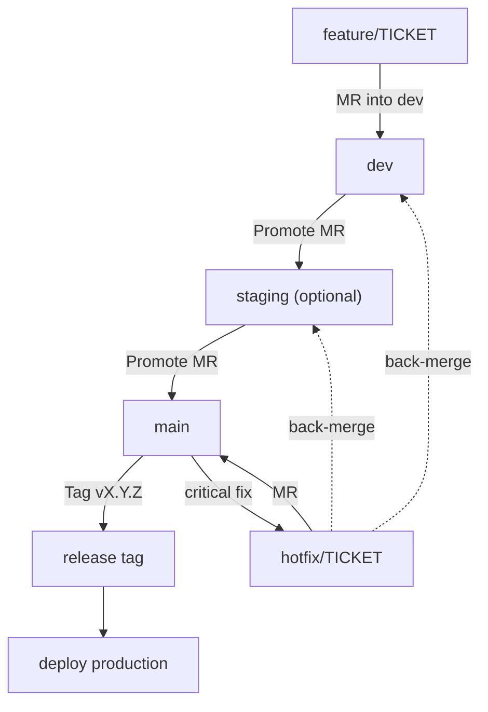
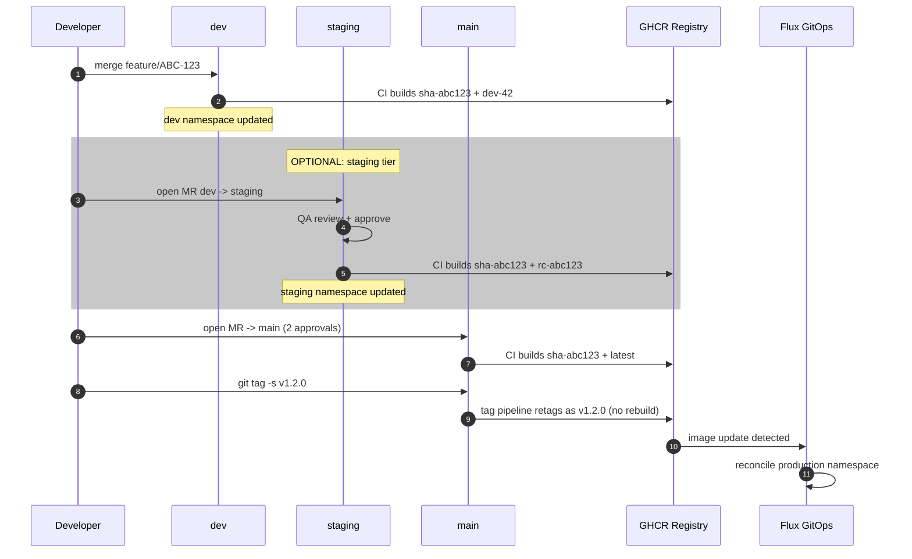
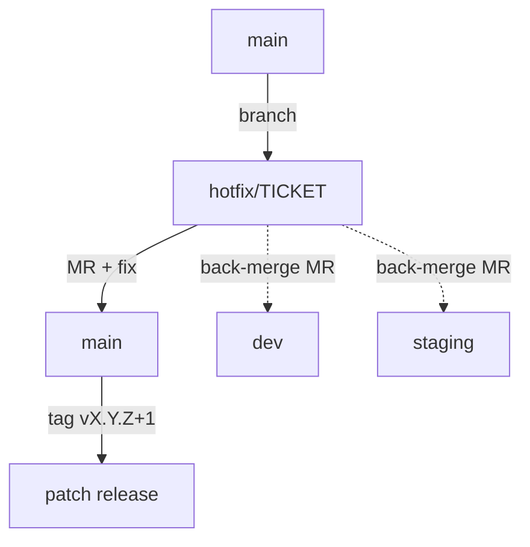
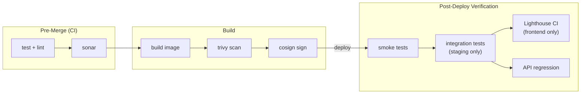
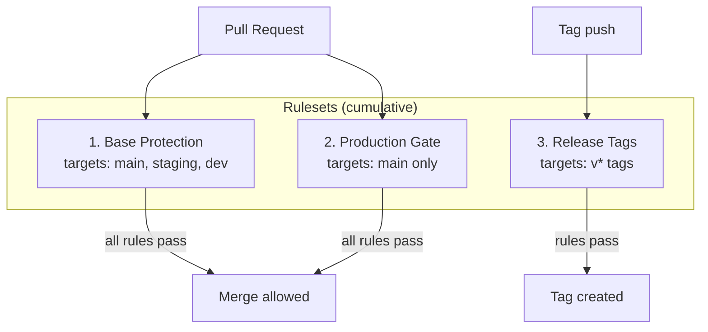
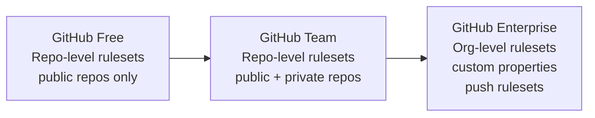
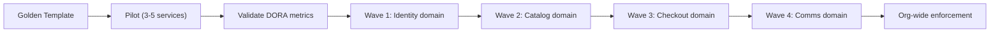

# Git Branching & Release Standard

This document defines the **production-ready branching strategy** for all microservice repositories in the `duynhne` platform. It is designed to scale from the current 8 services to 1000+ repositories while maintaining traceability, blast-radius control, and fast incident response.

**Model**: Hybrid Enterprise Flow (environment-aligned branch promotion + immutable tagging).

**References**: [nvie/GitFlow](https://nvie.com/posts/a-successful-git-branching-model/), [Shopify Git workflow](https://shopify.engineering/how-we-use-git-at-shopify), [DataCamp branching guide](https://www.datacamp.com/tutorial/git-branching-strategy-guide), [Atlassian trunk-based development](https://www.atlassian.com/continuous-delivery/continuous-integration/trunk-based-development).

---

## 1. Branch Model Overview



### Persistent Branches

| Branch | Purpose | Deploys to | Protected |
|--------|---------|------------|-----------|
| `main` | Production-ready code | production namespace | Yes (require MR + approvals) |
| `staging` | Release candidate for QA/UAT | staging namespace | Yes (require MR) |
| `dev` | Internal integration, daily development | dev namespace | Yes (require MR) |

`staging` is **optional** per service. Teams not ready for a 3-tier promotion can merge directly from `dev` to `main`. The CI template supports both modes.

### Ephemeral Branches

| Branch pattern | Created from | Merges into | Lifetime |
|----------------|-------------|-------------|----------|
| `feature/<ticket>` | `dev` | `dev` | Hours to days (max 1 week) |
| `hotfix/<ticket>` | `main` | `main` + back-merge to `dev` (and `staging` if active) | Hours |

---

## 2. How to Start a New Feature

Every new feature, enhancement, or bug fix starts from `dev`.

```bash
# 1. Switch to dev and pull latest
git checkout dev
git pull origin dev

# 2. Create feature branch
git checkout -b feature/ABC-123

# 3. Develop, commit with conventional messages
git commit -m "feat(auth): add OAuth2 PKCE flow"

# 4. Keep branch up to date (rebase preferred)
git fetch origin dev
git rebase origin/dev

# 5. Push and open MR targeting dev
git push origin feature/ABC-123
# Open MR: feature/ABC-123 -> dev
```

**Rules**:
- Never create feature branches from `main`.
- Keep feature branches short-lived (< 1 week).
- Squash or rebase before merging to keep `dev` history clean.
- Delete the feature branch after merge.

---

## 3. Promotion Flow (Code to Production)

This section is the definitive step-by-step guide for moving code from feature branch to production. Every step specifies **who** does it, **where** they do it, and **what CI does automatically**.



### 3.1 Feature -> dev

| Step | Who | Where | Action | CI auto-trigger |
|------|-----|-------|--------|-----------------|
| 1 | Developer | Local terminal | Create branch from `dev`, develop, push | -- |
| 2 | Developer | GitHub UI | Open MR: `feature/ABC-123` -> `dev` | `pull_request`: test, lint, sonar |
| 3 | Peer | GitHub UI | Review + approve (1 approval required) | -- |
| 4 | Developer | GitHub UI | Merge MR (squash) | `push dev`: build, scan, sign -> image `sha-abc123` + `dev-42` |
| 5 | (automatic) | Flux | Deploy to dev namespace | Smoke tests (health + readiness) |
| 6 | Developer | GitHub UI | Delete feature branch | -- |

```bash
# Step 1: Developer, local terminal
git checkout dev && git pull origin dev
git checkout -b feature/ABC-123
git commit -m "feat(auth): add OAuth2 PKCE flow"
git push origin feature/ABC-123

# Step 2-4: Developer, GitHub UI
#   Open MR: feature/ABC-123 -> dev
#   Wait for CI checks (green) + peer review (1 approval)
#   Click "Squash and merge"
#   CI auto-triggers: builds image, pushes to GHCR, Flux deploys to dev namespace
```

### 3.2 dev -> staging (OPTIONAL)

> **When to use staging**: Services with QA/UAT requirements, user-facing features that need manual testing, or services where a release candidate must be validated before production.
>
> **When to skip**: Internal services, infrastructure tooling, or teams doing continuous deployment directly from `dev` to `main`. If skipping, go directly to section 3.3.

| Step | Who | Where | Action | CI auto-trigger |
|------|-----|-------|--------|-----------------|
| 1 | Tech lead | GitHub UI | Open MR: `dev` -> `staging` | `pull_request`: test, lint, sonar |
| 2 | Tech lead | GitHub UI | Review + approve (1 approval) | -- |
| 3 | Tech lead | GitHub UI | Merge MR | `push staging`: build, scan, sign -> image `sha-abc123` + `rc-abc123` |
| 4 | (automatic) | Flux | Deploy to staging namespace | Smoke + integration + regression tests |
| 5 | QA team | Staging env | Manual QA/UAT testing | -- |

```bash
# Step 1-3: Tech lead, GitHub UI
#   Open MR: dev -> staging
#   Staging is now FEATURE-FROZEN: only bug fixes allowed, no new features
#   Wait for CI checks + approval -> merge
#   CI auto-triggers: builds RC image, Flux deploys to staging namespace

# Step 5: QA team tests on staging environment
#   If bugs found: fix on dev, cherry-pick or re-promote to staging
#   If QA passes: proceed to section 3.3
```

### 3.3 Release to production (-> main -> tag)

This is the critical path. Source is `staging` (if used) or `dev` (if staging is skipped).

| Step | Who | Where | Action | CI auto-trigger |
|------|-----|-------|--------|-----------------|
| 1 | Tech lead | GitHub UI | Open MR: `staging` -> `main` (or `dev` -> `main`) | `pull_request`: test, lint, sonar |
| 2 | Tech lead + QA | GitHub UI | Review + approve (**2 approvals required**: tech lead + QA) | -- |
| 3 | Tech lead | GitHub UI | Merge MR | `push main`: build, scan, sign -> image `sha-abc123` + `latest` |
| 4 | Tech lead | **Local terminal** | Create signed release tag (commands below) | -- |
| 5 | (automatic) | CI | Tag `v*` push detected -> retag existing digest as `v1.2.0` (**no rebuild**) | Release pipeline |
| 6 | (automatic) | Flux | Image `v1.2.0` detected -> reconcile production namespace | Smoke tests (prod) |
| 7 | Tech lead | **Local terminal** | Back-merge `main` -> `dev` (and `staging` if active) | -- |
| 8 | Tech lead | kubectl / Flux UI | Verify production deployment | -- |

**Step 4 -- Create release tag** (who: Tech lead, where: local terminal):

```bash
git checkout main
git pull origin main

# Create signed tag on the merge commit
git tag -s v1.2.0 -m "Release v1.2.0: OAuth2 PKCE flow, performance improvements"

# Push tag -> CI auto-triggers release pipeline
git push origin v1.2.0
```

What happens after `git push origin v1.2.0`:
1. CI detects `tags/v*` push event.
2. Release pipeline runs: retags the **existing** `sha-abc123` digest as `v1.2.0` in GHCR. No rebuild.
3. Flux detects image `v1.2.0` -> reconciles production namespace.
4. Pods roll out with the new image.

**Step 7 -- Back-merge** (who: Tech lead, where: local terminal):

```bash
# Back-merge main into dev to keep dev in sync
git checkout dev
git pull origin dev
git merge main --no-edit
git push origin dev

# If staging is active, also back-merge into staging
git checkout staging
git pull origin staging
git merge main --no-edit
git push origin staging
```

> Never skip back-merge. Forgotten merges cause regressions in the next release cycle.

**Step 8 -- Verify production** (who: Tech lead, where: terminal):

```bash
# Check CI release pipeline completed
gh run list --workflow=ci.yml | head -5

# Check image tag exists in GHCR
# (requires crane: go install github.com/google/go-containerregistry/cmd/crane@latest)
crane ls ghcr.io/duynhne/<service-name> | grep v1.2.0

# Check Flux reconciliation
flux get kustomizations

# Check pods running with new image
kubectl get pods -n <service> -o jsonpath='{.items[*].spec.containers[*].image}'
```

---

## 4. Hotfix Flow

For critical production issues that cannot wait for the normal release cycle.



### Runbook

```bash
# 1. Create hotfix from main
git checkout main
git pull origin main
git checkout -b hotfix/PROD-456

# 2. Fix the issue, add tests
git commit -m "fix(auth): prevent token replay attack"

# 3. Push and open MR targeting main
git push origin hotfix/PROD-456
# Open MR: hotfix/PROD-456 -> main (expedited review)

# 4. After merge to main, tag the patch release
git checkout main
git pull origin main
git tag -s v1.2.1 -m "Hotfix: prevent token replay attack"
git push origin v1.2.1

# 5. Back-merge to dev (and staging if active)
git checkout dev
git pull origin dev
git merge main
git push origin dev
```

**Rules**:
- Hotfix branches always start from `main`, never from `dev`.
- Fix on `main` first, then back-merge to `dev`/`staging`.
- Never skip back-merge; forgotten fixes cause regressions in the next release.
- If a `staging` branch has an active release candidate, merge hotfix into `staging` too.

---

## 5. Tagging & Versioning Policy

### Semantic Versioning

All production releases follow [semver](https://semver.org/):

```
vMAJOR.MINOR.PATCH
```

| Component | Bump when | Example |
|-----------|----------|---------|
| MAJOR | Breaking API change | `v1.0.0` -> `v2.0.0` |
| MINOR | New backward-compatible feature | `v1.0.0` -> `v1.1.0` |
| PATCH | Bug fix or hotfix | `v1.1.0` -> `v1.1.1` |

### Image Tag Strategy

| Event | Image tags produced | Purpose |
|-------|-------------------|---------|
| Push to `dev` | `sha-<short>`, `dev-<run>` | Integration testing |
| Push to `staging` | `sha-<short>`, `rc-<sha>` | QA/UAT candidate |
| Push to `main` | `sha-<short>`, `latest` | Production candidate |
| Git tag `v*` | `v1.2.3`, `sha-<short>` | Immutable production release |

**Critical rule**: `latest` is a convenience alias. Production deployments must reference either `vX.Y.Z` or a digest (`sha256:...`). Never deploy `latest` as the sole identifier.

### Tag Signing

Production tags should be signed:

```bash
git tag -s v1.2.0 -m "Release v1.2.0: OAuth2 PKCE support"
```

---

## 6. CI & Verification Matrix

CI and post-deploy verification are separated into two phases: **pre-merge checks** that gate code quality, and **post-deploy verification** that validates the running service after deployment.

### 6.1 Pre-Merge & Build (CI)

| Trigger | Branch/Ref | Jobs | Artifacts |
|---------|-----------|------|-----------|
| `pull_request` | `dev`, `staging`, `main` | test, lint, sonar | None (checks only) |
| `push` | `dev` | test, sonar, build, scan, sign | `sha-<short>`, `dev-<run>` |
| `push` | `staging` | test, sonar, build, scan, sign | `sha-<short>`, `rc-<sha>` |
| `push` | `main` | test, sonar, build, scan, sign | `sha-<short>`, `latest` |
| `push` | `tags/v*` | retag digest, release metadata | `vX.Y.Z` (no rebuild) |

See [`ci_template.yml`](ci_template.yml) for the reference workflow.

### 6.2 Post-Deploy Verification

After each deployment, automated verification runs against the live environment. This catches issues that unit tests and static analysis cannot: misconfigured env vars, missing secrets, broken connectivity, performance regressions.

| Environment | Trigger | Checks | Fail action |
|-------------|---------|--------|-------------|
| **dev** | Push to `dev` (after deploy) | Smoke tests (health + readiness endpoints) | Alert in Slack, block promotion to staging |
| **staging** | Push to `staging` (after deploy) | Smoke + integration tests, Lighthouse CI (frontend), regression tests | Alert in Slack, block promotion to main |
| **production** | Tag `v*` (after deploy) | Smoke tests (read-only health check), SLO validation | Alert on-call, trigger rollback runbook |

**Smoke test scope** (minimum per service):

```yaml
# Example: smoke-test.sh (runs in CI after deploy)
# 1. Health check
curl -sf http://${SERVICE}.${NAMESPACE}.svc.cluster.local:8080/health

# 2. Readiness check
curl -sf http://${SERVICE}.${NAMESPACE}.svc.cluster.local:8080/ready

# 3. Basic API response (service-specific)
curl -sf http://${SERVICE}.${NAMESPACE}.svc.cluster.local:8080/api/v1/ping
```

**Staging-only checks** (in addition to smoke):
- Integration tests against real database (test data)
- Lighthouse CI for frontend services (performance budget)
- API regression tests (contract validation against OpenAPI spec)
- Load baseline (compare p99 latency against previous release)

**Key principle**: The same image that passes staging verification is promoted to production. No rebuild, no retest of unit/integration -- only live health validation in prod.



---

## 7. GitHub Rulesets (Branch Enforcement)

Branch enforcement uses **GitHub Rulesets** instead of legacy Branch Protection rules. Rulesets are GitHub's successor to Branch Protection with significant advantages for governance at scale.

**References**: [GitHub Rulesets docs](https://docs.github.com/en/repositories/configuring-branches-and-merges-in-your-repository/managing-rulesets/about-rulesets), [Swissquote: GitHub Rulesets at 3000 repos](https://medium.com/swissquote-engineering/github-rulesets-because-two-reviewers-are-better-than-a-hotfix-9f03124f1110).

### Why Rulesets over Branch Protection

| Aspect | Branch Protection (legacy) | Rulesets |
|--------|---------------------------|----------|
| Scope | Per-repository only | Per-repo (Free) or org-wide (Enterprise) |
| Layering | Single rule per branch | Multiple rulesets stack; most restrictive wins |
| Bypass | Admin override (all-or-nothing) | Granular: "Always allow" or "PR-only bypass" |
| Testing | No dry-run | **Evaluate mode**: test impact before enforcing |
| Visibility | Only admins can view rules | Anyone with read access can see active rulesets |
| Status | Delete to disable | Active / Evaluate / Disabled states |

### Plan Availability

| Feature | Free (public repos) | Pro / Team | Enterprise |
|---------|-------------------|------------|------------|
| Repository-level rulesets | Yes | Yes (+ private repos) | Yes |
| Org-level rulesets | No | No | Yes |
| Custom properties targeting | No | No | Yes |
| Push rulesets (file restrictions) | No | No | Yes |

Your public service repos on the **Free plan** get full repository-level rulesets. For private repos, upgrade to Pro or Team. For org-wide enforcement across 1000 repos, Enterprise is required.

### Layered Rulesets (3 per repository)

Following the [Swissquote pattern](https://medium.com/swissquote-engineering/github-rulesets-because-two-reviewers-are-better-than-a-hotfix-9f03124f1110) of layered rulesets where rules are cumulative (all must pass), define 3 rulesets per service repo:



#### Ruleset 1: Base Protection

**Targets**: branches matching `main`, `staging`, `dev`

| Rule | Setting |
|------|---------|
| Restrict deletions | Enabled |
| Block force pushes | Enabled |
| Require a pull request before merging | Enabled |
| Required approvals | **1** |
| Dismiss stale pull request approvals when new commits are pushed | Enabled |
| Require status checks to pass | `go-check`, `sonar` |
| Require branches to be up to date before merging | Enabled (strict mode) |

**Bypass list**: GitHub Apps (CI bots) with "Always allow".

#### Ruleset 2: Production Gate

**Targets**: branch matching `main` only

| Rule | Setting |
|------|---------|
| Required approvals | **2** (layered on top of Base; most restrictive wins) |
| Require review from CODEOWNERS | Enabled |
| Require approval of the most recent reviewable push | Enabled (non-author must approve) |
| Require signed commits | Enabled |
| Require linear history | Recommended (squash merge) |

**Bypass list**: Repo maintainers with **"Allow for PR only"** (force-merge escape hatch for emergencies; auditable in Insights tab).

#### Ruleset 3: Release Tags

**Targets**: tags matching `v*`

| Rule | Setting |
|------|---------|
| Restrict creations | Only maintainers can create `v*` tags |
| Restrict deletions | Enabled (immutable tags) |
| Restrict updates | Enabled (no moving tags) |
| Require signed commits | Enabled |

**Bypass list**: None (no exceptions for production tags).

### Bypass Types

Rulesets offer two bypass modes (unlike Branch Protection's all-or-nothing admin override):

| Bypass type | Behavior | Use case |
|-------------|----------|----------|
| Always allow | Ruleset does not apply at all | CI/CD GitHub Apps that need to push status checks |
| Allow for PR only | Ruleset applies, but force-merge button appears on PR | Emergency hotfix by tech lead (auditable in Insights) |

When a maintainer uses "PR-only bypass" to force-merge, it is logged in the **Insights** tab of the ruleset. This provides an audit trail for compliance review.

### CODEOWNERS Integration

The Production Gate ruleset requires **CODEOWNERS review**. This routes PR approvals to domain experts automatically.

Place a `CODEOWNERS` file at `.github/CODEOWNERS` in every service repo (highest priority location):

```
# Default: team owns everything
*    @duynhne/<team-name>

# CI/CD and workflow changes need platform team review
.github/    @duynhne/platform-team

# Database migrations need DBA review
db/         @duynhne/platform-team
```

**Rules**:
- GitHub checks which files changed in a PR and assigns the matching CODEOWNERS as required reviewers.
- If no valid CODEOWNERS file exists, the ruleset falls back to "anyone with write access", which is less secure. Always include a valid CODEOWNERS file.
- CODEOWNERS teams/users must have at least **write** access to the repository.
- The golden template (section 10) includes a default CODEOWNERS file.

### Setup Guide (per repository)

#### Step 1: Create Base Protection ruleset

1. Go to **Settings > Rules > Rulesets** in the repository.
2. Click **New ruleset > New branch ruleset**.
3. Name: `Base Protection`, Enforcement: **Evaluate** (start in test mode).
4. Under **Target branches**, add patterns: `main`, `staging`, `dev`.
5. Enable rules: Restrict deletions, Block force pushes, Require PR (1 approval, dismiss stale reviews), Require status checks (`go-check`, `sonar`, strict mode).
6. Under **Bypass list**, add CI GitHub App with "Always allow".
7. Click **Create**.

#### Step 2: Create Production Gate ruleset

1. Click **New ruleset > New branch ruleset**.
2. Name: `Production Gate`, Enforcement: **Evaluate**.
3. Target branch: `main`.
4. Enable rules: Require PR (2 approvals, require CODEOWNERS, require non-author approval), Require signed commits, Require linear history.
5. Under **Bypass list**, add Maintainers role with "Allow for PR only".
6. Click **Create**.

#### Step 3: Create Release Tags ruleset

1. Click **New ruleset > New tag ruleset**.
2. Name: `Release Tags`, Enforcement: **Evaluate**.
3. Target tags: `v*`.
4. Enable rules: Restrict creations, Restrict deletions, Restrict updates.
5. Bypass list: empty (no exceptions).
6. Click **Create**.

#### Step 4: Validate with Evaluate mode

1. Go to **Settings > Rules > Rulesets** and open a ruleset.
2. Click **Insights** tab.
3. Verify rules would pass/fail as expected for recent PRs and pushes.
4. Once validated, change Enforcement status from **Evaluate** to **Active**.
5. Repeat for each ruleset.

---

## 8. Commit Message Convention

Use [Conventional Commits](https://www.conventionalcommits.org/) for automated changelog and version detection:

```
<type>(<scope>): <description>

[optional body]

[optional footer(s)]
```

| Type | Purpose | Version impact |
|------|---------|---------------|
| `feat` | New feature | Minor bump |
| `fix` | Bug fix | Patch bump |
| `docs` | Documentation only | No bump |
| `refactor` | Code restructuring | No bump |
| `test` | Adding/fixing tests | No bump |
| `ci` | CI/CD changes | No bump |
| `chore` | Maintenance | No bump |
| `perf` | Performance improvement | Patch bump |
| `BREAKING CHANGE` | Breaking API change (footer or `!` suffix) | Major bump |

---

## 9. Rollback Policy

### Application rollback
- Revert to previous `vX.Y.Z` tag.
- Flux/Helm: update image tag in ResourceSet InputProvider or HelmRelease values.
- The previous image is always available in GHCR (immutable digest).

### Code rollback
- `git revert <commit>` on `main`, create new patch tag.
- Never force-push `main`.

### Database rollback
- Flyway migrations are forward-only by design.
- For emergency rollback, create a new migration that reverses the schema change.

---

## 10. Governance at Scale (1000 Repos)

### Golden Template

Every new service repository must be created from the **org template** that includes:

| File | Purpose |
|------|---------|
| `.github/workflows/ci.yml` | CI pipeline (from [`ci_template.yml`](ci_template.yml)) |
| `.github/CODEOWNERS` | Ownership and review routing (required by Production Gate ruleset) |
| `.github/pull_request_template.md` | PR description checklist |
| `.github/rulesets/` | Exported ruleset JSON configs (3 rulesets, see section 7) |
| `Makefile` | Standard targets: `test`, `lint`, `build`, `run` |
| `AGENTS.md` | AI agent instructions for the service |

### Rulesets Baseline (Per-Repo)

Every service repo must have 3 rulesets configured (see section 7 for full details):

| Ruleset | Targets | Key rules |
|---------|---------|-----------|
| Base Protection | `main`, `staging`, `dev` | Require PR (1 approval), dismiss stale reviews, require status checks (`go-check`, `sonar`), block force push, restrict deletion |
| Production Gate | `main` | Require 2 approvals, require CODEOWNERS review, require signed commits, require non-author approval |
| Release Tags | `v*` tags | Restrict creation/deletion/updates (immutable tags) |

### Required Status Checks

All repos must configure these checks in the Base Protection ruleset:

- `go-check` (or stack equivalent: `node-check`, `python-check`)
- `sonar` (quality gate -- configurable per team)
- Strict mode: branch must be up to date before merging

### Upgrade Path (Free to Enterprise)



| Plan | What you get | When to upgrade |
|------|-------------|-----------------|
| **Free** (current) | Repo-level rulesets on public repos. Manually configure per repo. | Sufficient for < 20 public repos. |
| **Team** | Same rulesets on private repos. GitHub org features. | When you have private repos or need org-level teams for CODEOWNERS. |
| **Enterprise** | Org-level rulesets that auto-apply to all repos. Custom properties for ruleset targeting (Swissquote pattern). Push rulesets for file restrictions. | At 100+ repos, manual per-repo setup becomes unsustainable. Org rulesets + custom properties (e.g. `protection-level`, `domain`) enable automated governance. |

At Enterprise scale (1000 repos), adopt the [Swissquote pattern](https://medium.com/swissquote-engineering/github-rulesets-because-two-reviewers-are-better-than-a-hotfix-9f03124f1110):
- Define org-level rulesets that target repos via **custom properties** (e.g. `protection-level: standard`, `domain: identity`).
- Use a GitHub App to compute custom property values from repo metadata.
- Use an exclusion property (`ruleset-excluded: true`) managed via GitOps for exceptions.
- Layer org rulesets with repo-level rulesets: teams can be stricter, never more lenient.

### Immutable Artifact Rule

- Every merged commit to `dev`/`staging`/`main` produces a signed, immutable image.
- Production deployments reference digest or semver tag, never `latest` alone.
- SBOM is attached to every production image (enable `sbom: true` in CI).
- Tag immutability is enforced at the GHCR level — tags cannot be overwritten.

### Promotion Rules

| From | To | Allowed by | Rebuild? |
|------|----|-----------|----------|
| `feature/*` | `dev` | Any team member (1 approval) | Yes (CI builds on push to dev) |
| `dev` | `staging` | Tech lead (1 approval) | Yes (CI builds on push to staging) |
| `staging` | `main` | Tech lead + QA (2 approvals) | Yes (CI builds on push to main) |
| `main` + tag `v*` | Production | Release manager (tag push) | No (reuses existing digest) |
| `hotfix/*` | `main` | Tech lead (expedited, 1 approval min) | Yes (CI builds on push to main) |

### Audit Trail

- Every production release has a signed Git tag.
- Every image has a Cosign signature and provenance attestation.
- Deployment history is tracked via Flux ResourceSet reconciliation logs.
- GHCR retains all image versions (no auto-deletion of production tags).

### Rollout Strategy



1. **Define golden template** — `gitflow.md` + `ci_template.yml` + 3 rulesets (exported as JSON in `.github/rulesets/`).
2. **Pilot** (3-5 services) — Apply template, create rulesets in **Evaluate** mode, validate CI/CD flow end-to-end.
3. **Activate rulesets** — Switch from Evaluate to Active after validating Insights tab shows expected behavior.
4. **Validate signals** — Measure DORA metrics: deployment frequency, lead time, change failure rate, MTTR.
5. **Roll out in waves** — Group by domain/team. Each wave adopts the template and validates.
6. **Enforce org-wide** — At Enterprise tier, create org-level rulesets targeting repos via custom properties. All new repos auto-inherit.
7. **Continuous governance** — Quarterly audit of ruleset Insights, required checks, and tag immutability across all repos.

### Rollout Checklist (New Service)

- [ ] Create repo from org template
- [ ] Create 3 rulesets (Base Protection, Production Gate, Release Tags) in **Evaluate** mode
- [ ] Validate ruleset Insights tab shows expected pass/fail behavior
- [ ] Switch all 3 rulesets from Evaluate to **Active**
- [ ] Verify `CODEOWNERS` file maps to correct team
- [ ] Verify CI pipeline passes on first MR to `dev`
- [ ] Create initial `v0.1.0` tag after first successful production deploy
- [ ] Verify image is signed and SBOM is attached in GHCR
- [ ] Add service to Flux ResourceSet InputProvider (`kubernetes/apps/services/<name>.yaml`)
- [ ] Verify Flux deployment and health checks pass
- [ ] Add service to monitoring (SLO CRD, ServiceMonitor)
- [ ] Announce to team channel with link to `gitflow.md`

---

## Quick Reference

```
feature/ABC-123   -->  MR  -->  dev  -->  MR  -->  staging  -->  MR  -->  main  -->  tag v1.2.0
                                                   (optional)

hotfix/PROD-456   -->  MR  -->  main  -->  tag v1.2.1
                       |
                       +--->  back-merge to dev (and staging)
```

| Question | Answer |
|----------|--------|
| Where do I branch for a new feature? | From `dev` |
| Where do I branch for a hotfix? | From `main` |
| How do I release to production? | Merge to `main`, then create `vX.Y.Z` tag |
| What image tag do I deploy? | `vX.Y.Z` or `sha256:...` digest, never only `latest` |
| How do I rollback? | Redeploy previous `vX.Y.Z` tag |
