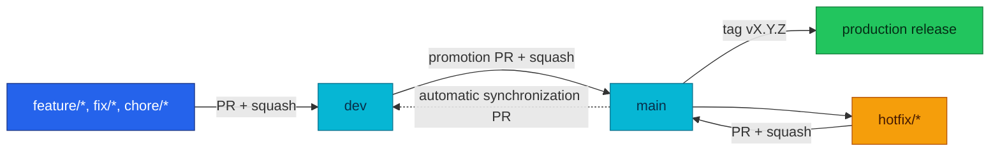
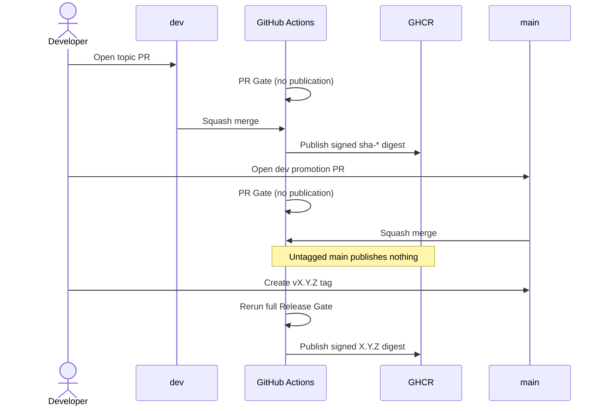

# Git workflow

The platform uses two long-lived branches: `dev` integrates changes and `main`
records production-ready source. Production artifacts exist only after a
semantic version tag is created from `main`.

| Fact | Policy |
|------|--------|
| Integration branch | `dev` |
| Production source branch | `main` |
| UAT branch | None; staging deploys the same `sha-*` dev artifact |
| Merge strategy | Pull request and squash merge |
| Normal promotion | Topic branch → `dev`, then `dev` → `main` |
| Emergency promotion | `hotfix/*` from `main` → `main`, then sync `main` → `dev` |
| Artifact creation | Push to `dev` or `vX.Y.Z` tag; never an untagged `main` push |
| Implementation state | v2 candidate in [gha-workflows PR #119](https://github.com/duynhlab/gha-workflows/pull/119); consumer migration not started |

## Branch topology

This diagram answers how source changes move between long-lived branches.

```mermaid
flowchart LR
  TOPIC["feature/*, fix/*, chore/*"] -->|"PR + squash"| DEV["dev"]
  DEV -->|"promotion PR + squash"| MAIN["main"]
  MAIN -->|"tag vX.Y.Z"| RELEASE["production release"]
  MAIN --> HOTFIX["hotfix/*"]
  HOTFIX -->|"PR + squash"| MAIN
  MAIN -. "automatic synchronization PR" .-> DEV

  classDef edge fill:#2563eb,color:#fff,stroke:#1e3a8a;
  classDef service fill:#06b6d4,color:#082f49,stroke:#0e7490;
  classDef worker fill:#f59e0b,color:#451a03,stroke:#b45309;
  classDef data fill:#22c55e,color:#052e16,stroke:#15803d;
  class TOPIC edge;
  class DEV,MAIN service;
  class HOTFIX worker;
  class RELEASE data;
```

There is no `uat` branch. Environment progression is a deployment concern:
dev and staging may consume the same immutable `sha-*` artifact at different
times and with different configuration. Adding an environment does not require
adding another source branch.

## Normal change lifecycle

1. Branch from the latest `dev` using an approved prefix such as `feature/`,
   `fix/`, `chore/`, `docs/`, `refactor/`, or `ci/`.
2. Open a pull request into `dev`. The PR Gate runs all pre-merge checks but
   publishes no artifact.
3. Squash-merge after the required check and human review pass.
4. The `dev` push reruns quality checks and creates an attested `sha-*` image.
5. Deploy that immutable image to dev, then staging through GitOps.
6. Open a `dev` → `main` promotion pull request. Do not cherry-pick an arbitrary
   subset into `main`; fix or revert on `dev` before promotion.
7. Merge the promotion PR. The untagged `main` push creates no image.
8. Create `vX.Y.Z` on the selected `main` commit. The Release Gate rebuilds and
   verifies the production artifact from scratch.

```mermaid
sequenceDiagram
  actor Developer
  participant Dev as dev
  participant CI as GitHub Actions
  participant Registry as GHCR
  participant Main as main

  Developer->>Dev: Open topic PR
  CI->>CI: PR Gate (no publication)
  Dev->>CI: Squash merge
  CI->>Registry: Publish signed sha-* digest
  Developer->>Main: Open dev promotion PR
  CI->>CI: PR Gate (no publication)
  Main->>CI: Squash merge
  Note over CI,Registry: Untagged main publishes nothing
  Developer->>Main: Create vX.Y.Z tag
  CI->>CI: Rerun full Release Gate
  CI->>Registry: Publish signed X.Y.Z digest
```

## Hotfix lifecycle

A hotfix starts from `main` because it repairs the exact production source
line. It does not bypass tests or review.

1. Create `hotfix/<short-description>` from the latest `main`.
2. Open a pull request into `main`; run the same PR Gate and review policy.
3. Squash-merge and create a new patch tag, for example `v2.4.1`.
4. Let the Release Gate rebuild and publish the patch release.
5. The main-to-dev synchronization workflow opens a PR from its managed sync
   branch into `dev`.
6. Merge that PR after checks pass. Resolve conflicts in the PR branch; never
   force-push either long-lived branch.

The synchronization action needs a dedicated `SYNC_BRANCH_TOKEN`. GitHub does
not start a second workflow in response to a pull request created with the
repository's default `GITHUB_TOKEN`, which would leave the sync PR without its
required checks.

## Branch and tag rulesets

Configure rulesets in Evaluate mode on a pilot repository, observe the actual
check-run names, and activate them only after a complete dry run.

### `dev`

- Require a pull request with at least one approval.
- Require conversation resolution and dismiss stale approvals.
- Require `check / PR Gate` after confirming that exact context on a pilot PR.
- Block force-push and deletion.
- Allow approved topic-branch prefixes; the shared workflow enforces them.

### `main`

- Apply all `dev` protections.
- Accept source only from `dev` or `hotfix/*`; the shared workflow enforces this.
- Restrict direct pushes and administrator bypass.
- Require CODEOWNERS review where the repository defines owners.

### `v*` tags

- Restrict tag creation and deletion to release maintainers.
- Use exact `vX.Y.Z`; prerelease/floating formats are rejected by the workflow.
- Create the tag only on a commit reachable from `main`.
- Never move or reuse a published version tag. Fix forward with a new patch.

Rulesets are repository configuration, not YAML in this repository. See
[`ruleset-automation.md`](ruleset-automation.md) for rollout mechanics.

## Artifact-to-environment mapping

| Source event | Published identity | Allowed environment |
|--------------|--------------------|---------------------|
| Pull request | None | None |
| Push to `dev` | `sha-<short-sha>` and digest | Dev and staging |
| Untagged push to `main` | None | None |
| `vX.Y.Z` tag on `main` history | `X.Y.Z` and digest | Production |

Never deploy `unscanned-*`: it is the registry quarantine tag used inside the
publisher. Never deploy `latest`, a branch name, a floating major, or a floating
minor. GitOps records the exact approved version or digest.

## Rollback and recovery

Rollback means changing GitOps back to a previously verified immutable digest;
it does not mean rebuilding an old source revision under the same version.

| Situation | Action |
|-----------|--------|
| Bad `sha-*` in dev/staging | Revert or fix on `dev`; deploy the previous digest while CI produces a new one |
| Bad production release | Re-pin the previous production digest, then fix forward with a new patch version |
| Invalid tag location | Delete it before publication and recreate it from `main`; after publication, issue a new version |
| Promotion conflict | Resolve on `dev`; do not merge around the conflict directly on `main` |
| Hotfix sync conflict | Resolve the generated sync PR and rerun its PR Gate |

## Adoption checklist

- [ ] Merge and version the reusable workflow v2 candidate.
- [ ] Replace template candidate pins with the immutable v2 release commit SHA.
- [ ] Create `dev` from the agreed current source in each pilot repository.
- [ ] Install the PR, dev-build, release, and main-to-dev sync callers.
- [ ] Configure `SONAR_TOKEN` and `SYNC_BRANCH_TOKEN`.
- [ ] Verify the full lifecycle and exact check names on the pilot.
- [ ] Activate `dev`, `main`, and `v*` rulesets.
- [ ] Update GitOps only after an image's signature and attestations are verified.
- [ ] Roll out repository by repository; do not claim fleet adoption from the
      shared-workflow merge alone.

## References

- [CI/CD trust gates](cicd.md)
- [Ruleset automation](ruleset-automation.md)
- [Consumer PR template](check_template.yml)
- [Consumer dev-build template](build_template.yml)
- [Consumer release template](release_template.yml)
- [Consumer synchronization template](sync_main_to_dev_template.yml)

_Last updated: 2026-08-31._
