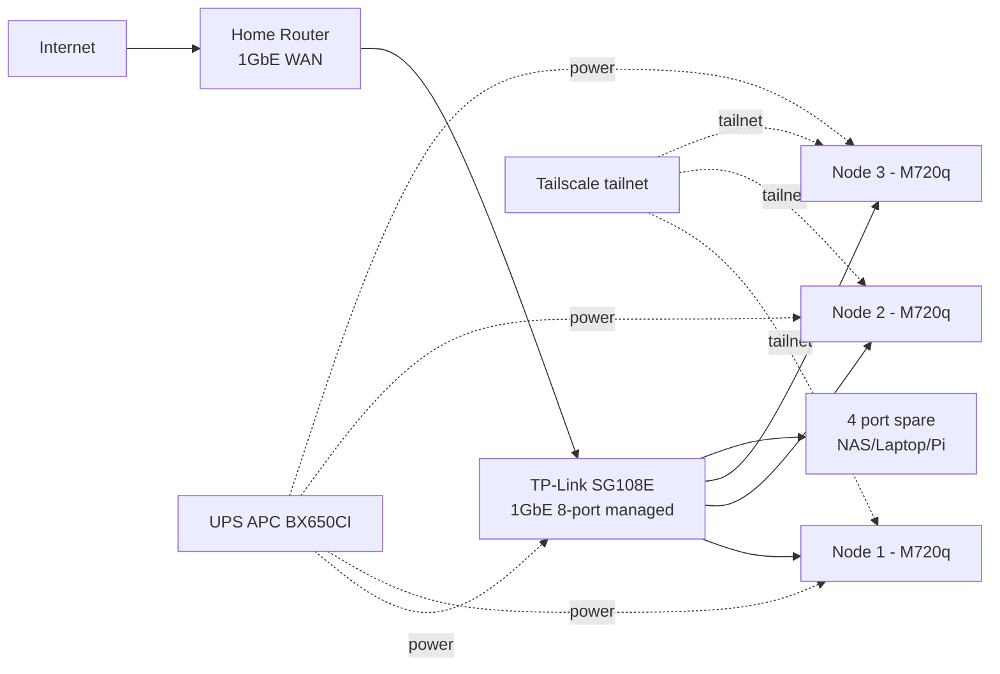
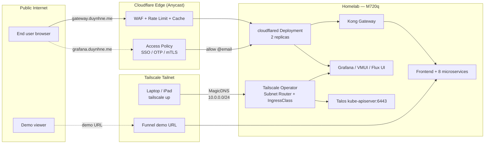
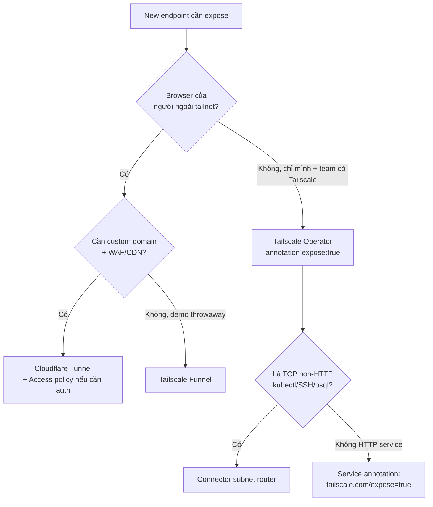

# Homelab Migration Plan: Kind → Bare-metal Talos

> **Status**: Planning document. Not yet implemented. Discussion artifact (May 2026).
>
> **Purpose**: Capture the multi-phase plan to graduate this homelab from Kind (ephemeral, single-host Docker) to bare-metal Talos Linux on Lenovo ThinkCentre M720q mini PCs, scaling from 1 node to a 3-node HA cluster.
>
> **Related**:
> - [`tamsu.md`](../../tamsu.md) — original deep-dive that triggered this plan (OpenBAO PVC pain on Kind)
> - [`docs/secrets/README.md`](../secrets/README.md) — current OpenBAO architecture
> - [`docs/secrets/cert-manager.md`](../secrets/cert-manager.md) — current cert-manager + LE DNS-01 setup

---

## Table of Contents

1. [Why Migrate](#1-why-migrate)
2. [Hardware Plan](#2-hardware-plan)
3. [Reference Repos](#3-reference-repos)
4. [Stack Decisions: Adopt / Cân nhắc / Reject](#4-stack-decisions-adopt--cân-nhắc--reject)
5. [Final Stack: Current vs Phase 1 vs Phase 2](#5-final-stack-current-vs-phase-1-vs-phase-2)
6. [RAM Budget on M720q (32GB)](#6-ram-budget-on-m720q-32gb)
7. [Disk Budget on M720q (1TB NVMe + 500GB SATA)](#7-disk-budget-on-m720q-1tb-nvme--500gb-sata)
8. [Public Exposure: Tailscale vs Cloudflare Zero Trust](#8-public-exposure-tailscale-vs-cloudflare-zero-trust)
9. [Roadmap](#9-roadmap)
10. [Open Decisions](#10-open-decisions)
11. [References](#references)

---

## 1. Why Migrate

**Pain points của Kind (single-host Docker)**:

- **Ephemeral PVCs**: mỗi `make down && make up` mất toàn bộ data → OpenBAO mất CF token → cert-manager fail → cascade lỗi toàn cluster (chi tiết trong [`tamsu.md`](../../tamsu.md))
- **Bootstrap secret pain**: phải nhớ re-seed Cloudflare API token mỗi lần dựng lại
- **Không thật**: không học được bare-metal networking, storage, OS-level concerns
- **Single-host Docker**: không thể test HA, không thể chaos engineering thật
- **Không production-grade**: stack hiện tại là "production-grade design trên dev-grade infrastructure"

**Mục tiêu sau migrate**:

- Chạy 24/7 không sợ mất data
- Học bare-metal K8s đầy đủ (Talos, Cilium, Rook-Ceph, Tailscale)
- Backup tự động → Cloudflare R2 (off-site)
- Path rõ ràng từ 1 node → 3 node HA mà không phải redesign

---

## 2. Hardware Plan

### Triết lý chọn

- Mua 2nd-hand Lenovo Tiny: rẻ hơn 50–70% vs new, hiệu năng dư cho homelab
- Đồng nhất 3 node cùng model → spare parts swap, troubleshoot dễ
- Mua đúng từ đầu, không phải "tiết kiệm bằng cách mua rẻ"
- Mua switch ngay từ Phase 1, topology cuối cùng đã sẵn

### Phase 1 — Mua ngay (~7tr VND / ~$280)

```
1× Lenovo ThinkCentre M720q Tiny (barebone, 2nd-hand)
   - CPU: i5-8500T (6c/6t, 35W TDP) hoặc i5-9500T
   - 2× M.2 NVMe slots + 1× 2.5" SATA bay
                                                   ~3.0tr
2× 16GB DDR4 SODIMM 3200MHz (Crucial/Kingston)     ~1.2tr
1× 1TB NVMe Lexar NM710 (PCIe 3.0)                 ~1.3tr
1× 500GB SATA M.2 KingSpec/Lexar
   (cho Ceph 2nd OSD trong tương lai)              ~0.7tr
─────────────────────────────────────────────────────────
Node #1                                            6.2tr

1× Switch TP-Link TL-SG108E (1GbE 8-port managed)  0.6tr
3× Cable CAT6 1m (mua sẵn cho 3 node)              0.2tr
─────────────────────────────────────────────────────────
Total Phase 1                                      7.0tr (~$280)
```

**Tại sao mua switch + 3 cable ngay**:

- Topology cuối cùng đã sẵn → cắm node #1 vào switch → switch lên router
- TP-Link SG108E có VLAN tag, QoS, port mirror → đủ học network
- 8 port = 3 node + uplink + 4 port spare (cho NAS/Pi/laptop sau này)

**Tại sao mua 500GB M.2 thứ 2 ngay**:

- M720q có 2 khe M.2 → tận dụng từ đầu
- Tách OS+workload (NVMe 1TB) khỏi Ceph data (SATA M.2 500GB) → I/O không tranh nhau
- Khi scale 3 node → mỗi node đã sẵn 2 disk cho Ceph

### Phase 2 — Scale lên 3 node (sau 6–12 tháng, ~14tr VND / ~$560)

```
2× Lenovo M720q Tiny barebone                      6.0tr
4× 16GB DDR4 SODIMM (2 node × 32GB)                2.4tr
2× 1TB NVMe                                        2.6tr
2× 500GB SATA M.2                                  1.4tr
1× UPS APC BX650CI (650VA)                         1.8tr
─────────────────────────────────────────────────────────
Total Phase 2                                     14.2tr
```

**Tại sao Phase 2 mới mua UPS**:

- 1 node Phase 1 mất điện reboot → OK (Talos immutable, restore từ R2 backup)
- 3 node + Ceph 3-replica + etcd quorum: mất điện đột ngột → corrupt etcd/Ceph
- 650VA = ~10–15 phút uptime cho 3 mini PC + switch (đủ shutdown gracefully)

### Tổng investment

| Phase | Khi nào | Cost | Tích lũy |
|---|---|---|---|
| Phase 1 | Ngay | 7.0tr | 7.0tr |
| Phase 2 | +6–12 tháng | 14.2tr | **21.2tr** (~$840) |

→ Dưới $1000 cho HA homelab dùng được 3–5 năm.

### Pitfall thường gặp khi mua

| Sai lầm | Hậu quả |
|---|---|
| Mua i3 thay i5-8500T | Thiếu core cho Ceph + workload |
| Mua RAM 8GB rồi tính nâng sau | Lãng phí, mua 32GB từ đầu |
| Mua SSD 512GB "tiết kiệm" | 6 tháng hết → migrate đau |
| Bỏ qua SATA M.2 thứ 2 | Ceph dùng cùng disk OS → I/O wait kinh khủng |
| Mua switch unmanaged (không có "E" suffix) | Không VLAN, không QoS → không học được network |
| Quên adapter 90W zin | Throttle CPU, instability |

### Network topology cuối cùng (Phase 2)



---

## 3. Reference Repos

Hai repo opinionated được dùng làm reference cho stack design:

- **<https://github.com/jfroy/flatops>** — Talos + Cilium + Rook-Ceph + Envoy Gateway + cloudflared + tuppr
- **<https://github.com/haraldkoch/kochhaus-home>** — Cilium + Envoy + cert-manager + External Secrets + 1Password + SOPS + Rook/Longhorn + VolSync + Harbor + actions-runner-controller

Cả 2 đều **production-grade homelab pattern** nhưng đắt về cognitive load. Plan này chọn lọc, không adopt 100%.

---

## 4. Stack Decisions: Adopt / Cân nhắc / Reject

### Adopt 100%

| Pattern | Lý do |
|---|---|
| **Talos Linux** | Immutable, API-driven, không SSH, auto-recover. Hợp Mini PC chạy 24/7 không màn hình |
| **Cilium CNI** | eBPF, thay kube-proxy → ít overhead, observability network tốt (Hubble) |
| **Tailscale Operator** | Game-changer. Access cluster từ laptop/phone không cần expose, không cần VPN tự host |
| **VolSync + Kopia → R2** | **Bắt buộc** trên 1 node. Mất disk = mất tất. Free tier R2 10GB đủ cho metadata + DB dump |
| **cert-manager + LE DNS-01** | Đã có. Giữ |
| **External Secrets** | Đã có. Giữ |

### Cân nhắc kỹ

| Pattern | Vấn đề trên 1 node |
|---|---|
| **Rook-Ceph** | Trên 1 node với 2 OSD = không HA thật, nhưng có snapshot/clone cho VolSync. Overhead ~2GB RAM. **Đáng** vì Phase 2 sẽ scale lên 3 node |
| **Envoy Gateway** | Đang chạy Kong tốt. Switch sang Envoy Gateway = học lại config, mất time. **Giữ Kong** |
| **cloudflared tunnel** | Hữu ích nếu cần expose ra internet. Nếu chỉ Tailscale là đủ → bỏ |
| **tuppr** | Auto-upgrade Talos + K8s. Hữu ích cho 3 node, hơi overkill cho 1 node. **Phase 2 mới add** |
| **actions-runner-controller** | Self-hosted GH runner. Tốn ~1GB RAM idle. **Bỏ Phase 1**, chỉ add nếu CI bottleneck |
| **Harbor (image mirror)** | Tiết kiệm bandwidth nếu pull nhiều image. Phase 1 chưa cần, Phase 2 nếu network chậm thì add |

### Reject

| Pattern | Lý do |
|---|---|
| **1Password Connect** | Thêm dependency external (license $20/user/tháng). Đã có **OpenBAO**, cứ giữ |
| **SOPS thay External Secrets** | SOPS hợp cho secret tĩnh trong Git. Đang dùng OpenBAO + ESO cho dynamic + rotation → tốt hơn. Chỉ dùng SOPS cho **bootstrap-only secret** (CF token, age key) — đó là pattern đúng |
| **Longhorn** | Alternative của Rook-Ceph. Đơn giản hơn nhưng chỉ block storage, không có S3. Rook-Ceph cho cả block + S3 (object) → phù hợp hơn |

---

## 5. Final Stack: Current vs Phase 1 vs Phase 2

| Layer | **Current (Kind)** | **Phase 1 (1× M720q Talos)** | **Phase 2 (3× M720q Talos HA)** |
|---|---|---|---|
| **OS** | Docker container (Kind) | Talos Linux | Talos Linux |
| **CNI** | kindnet | Cilium (Hubble off, kube-proxy replacement on) | Cilium (Hubble on) |
| **Ingress** | Kong (DB-less) ✅ | Kong (DB-less) ✅ | Kong (DB-less) ✅ |
| **Storage** | hostPath ephemeral | Rook-Ceph 2 OSD (1 node, no HA) | Rook-Ceph 6 OSD (3 node, 3-replica) |
| **Backup** | ❌ None | VolSync + Kopia → Cloudflare R2 | VolSync + Kopia → Cloudflare R2 |
| **Secrets manager** | OpenBAO HA Raft (1 pod thực tế) | OpenBAO single replica + VolSync backup PVC | OpenBAO HA Raft 3 nodes thật |
| **Secrets sync** | External Secrets ✅ | External Secrets ✅ | External Secrets ✅ |
| **Bootstrap secret** | Manual `bao kv put` (đau) | SOPS + age (CF token, age key trong `~/.homelab/`) | SOPS + age |
| **Cert** | cert-manager + LE DNS-01 ✅ | cert-manager + LE DNS-01 ✅ | cert-manager + LE DNS-01 ✅ |
| **Trust distribution** | trust-manager + homelab-ca | **Bỏ** (chưa có mTLS internal use case) | Add lại nếu cần mTLS |
| **GitOps** | Flux Operator + ResourceSets + OCI ✅ | Flux Operator + ResourceSets + OCI ✅ | Flux Operator + ResourceSets + OCI ✅ |
| **Remote access** | localhost only | Tailscale Operator | Tailscale Operator |
| **Public expose** | localhost | cloudflared tunnel (optional) | cloudflared tunnel |
| **Cluster upgrade** | recreate Kind | Manual `talosctl upgrade` | tuppr (auto + healthcheck) |
| **CI runner** | GitHub-hosted | GitHub-hosted | actions-runner-controller (nếu CI bottleneck) |
| **Image mirror** | ❌ | ❌ | Harbor (nếu network chậm) |
| **Postgres** | 3 cluster + DR | 3 cluster, 1 instance mỗi cluster | 3 cluster HA, 3 instance mỗi cluster |
| **Observability** | Full stack (VM + Tempo + VL + Vector + Pyroscope + Grafana) ✅ | Full stack ✅ (retention 7d) | Full stack ✅ (retention 30d) |
| **Apps** | 8 microservices + frontend ✅ | Same ✅ | Same ✅ |

### Net change

- ✅ **Add**: Talos, Cilium, Rook-Ceph, VolSync+Kopia, Tailscale Operator, SOPS (cho bootstrap)
- ❌ **Remove (Phase 1)**: trust-manager + homelab-ca (defer đến khi có mTLS use case)
- 🔄 **Restructure**: OpenBAO HA → single + backup (Phase 1), trở lại HA Raft (Phase 2)
- ✅ **Keep**: Kong, ESO, cert-manager+LE, Flux+ResourceSets+OCI, observability stack, 8 microservices

---

## 6. RAM Budget on M720q (32GB)

Phase 1 — 1 node, headroom-friendly:

| Component | RAM | Note |
|---|---|---|
| Talos OS + kernel | 0.5GB | Immutable, lean |
| K8s control plane (etcd + apiserver + controller-manager + scheduler) | 1.5GB | Single node |
| Cilium agent + operator | 0.5GB | Hubble disabled Phase 1 |
| Rook-Ceph (mon + mgr + 2 OSD) | 2.5GB | 2 OSD trên 2 disk |
| Flux Operator + Source/Helm/Kustomize controllers | 0.4GB | |
| cert-manager + ESO + Kyverno | 0.6GB | |
| OpenBAO (single replica) | 0.3GB | Backup PVC qua VolSync |
| VolSync + Kopia | 0.2GB | Idle khi không backup |
| Tailscale Operator + cloudflared | 0.3GB | |
| Kong | 0.4GB | DB-less, 1 replica |
| VictoriaMetrics single + VMAgent + VMAlert + VMAlertmanager | 1.5GB | Trim retention 7d |
| Tempo + OTel Collector | 0.8GB | Trace retention 24h |
| VictoriaLogs + Vector | 0.8GB | Log retention 7d |
| Pyroscope | 0.5GB | Optional, có thể bỏ Phase 1 |
| Grafana | 0.3GB | |
| Sloth Operator | 0.1GB | |
| 3 PostgreSQL clusters (Zalando + CNPG + DR) | 3.0GB | Mỗi cluster 1 instance Phase 1 |
| PgBouncer + PgDog poolers | 0.4GB | |
| Valkey cache | 0.3GB | |
| 8 microservices | 1.6GB | ~200MB/service Go |
| Frontend (nginx + React build) | 0.1GB | |
| MCP servers (3) | 0.5GB | Có thể bỏ nếu không dùng AI assistant |
| kube-system overhead (CoreDNS, metrics-server, …) | 0.5GB | |
| Buffer / OS cache | 4.0GB | Page cache cho I/O performance |
| **Total** | **~21GB** | trên 32GB → **~66% utilization, 11GB headroom** |

→ **Thoải mái**. Có thể giữ stack đầy đủ, không phải trim quyết liệt.

### Optional trim (nếu muốn lean hơn)

| Trim | Save RAM | Tradeoff |
|---|---|---|
| Bỏ Pyroscope | 0.5GB | Mất profiling — chỉ cần khi debug perf |
| Bỏ DR replica (cnpg-db-replica) | 0.5GB | Đỡ tải, backup VolSync vẫn OK |
| Bỏ MCP servers | 0.5GB | Chỉ enable khi dùng AI assistant |
| Trim VM retention 7d → 3d | 0.5GB | Mất history dài |
| Bỏ Kyverno (giữ admission policy mode `audit`) | 0.4GB | Mất enforcement |

→ Có thể trim xuống **~17GB** nếu cần.

---

## 7. Disk Budget on M720q (1TB NVMe + 500GB SATA)

### NVMe 1TB (OS + workload + hot data)

| Volume | Size | |
|---|---|---|
| Talos system + container images | ~50GB | |
| etcd data | ~5GB | |
| Postgres data + WAL (3 clusters) | ~40GB sau 6 tháng | |
| VictoriaMetrics data (7d retention) | ~15GB | |
| VictoriaLogs (7d retention) | ~10GB | |
| Tempo (24h retention) | ~5GB | |
| OpenBAO Raft data | ~1GB | |
| Grafana + misc PVC | ~5GB | |
| **NVMe 1TB used** | **~131GB** | **~13% — rộng rãi** |

### SATA M.2 500GB (Ceph 2nd OSD + backup staging)

| Volume | Size | |
|---|---|---|
| Ceph OSD #2 (cho block storage HA-ready) | 500GB raw | |
| VolSync staging (snapshots trước khi push R2) | ~50GB | |
| **SATA M.2 used** | **~100–200GB** | **~20–40%** |

→ **1TB + 500GB hoàn toàn dư cho Phase 1**, không phải lo disk space ít nhất 2 năm.

### Phase 2 Ceph capacity

- 3 node × (1TB NVMe + 500GB SATA) = **4.5TB raw**
- Ceph 3-replica → **~1.5TB usable**
- Đủ cho: PostgreSQL HA + observability long retention (30d) + media + backup local

---

## 8. Public Exposure: Tailscale vs Cloudflare Zero Trust

Homelab cần expose 2 loại traffic ra ngoài:

- **Private** — Grafana, VictoriaMetrics UI, Flux UI, kubectl/talosctl, SSH, Postgres exec → chỉ mình mình + cộng tác viên (≤ 5 user). Không bao giờ cho Internet công cộng chạm vào.
- **Public** — Frontend React (`gateway.duynhne.me`), microservice API public endpoints (`/auth/v1/public/*`, `/product/v1/public/*`, …), webhook endpoints, blog. Anyone on Internet phải reach được, browser thuần (không cài client).

Hai sản phẩm cùng dùng được nhưng **mục đích khác nhau**. Đây là phân tích deep, đối chiếu với requirement của repo này.

### 8.1. Bản chất kỹ thuật khác nhau ở đâu

| Khía cạnh | **Tailscale** (Funnel + Serve + Subnet Router) | **Cloudflare One** (cloudflared Tunnel + Access) |
|---|---|---|
| **Mô hình mạng** | Mesh VPN trên WireGuard. Mỗi node = peer trong tailnet. Coordination server (control plane) chỉ trao đổi public key + ACL; data plane peer-to-peer trực tiếp khi NAT cho phép, fallback qua DERP relay. | Outbound-only tunnel HTTP/2 + QUIC từ `cloudflared` lên Cloudflare edge (Anycast 300+ PoP). Không peer-to-peer; mọi byte chạy qua edge. |
| **Identity model** | Identity = device key + tag/user (SSO). Phù hợp **người + máy đáng tin**. | Identity = HTTP request được Access policy chấp nhận (email OTP, Google/GitHub SSO, mTLS, IP, geolocation). Phù hợp **mọi browser request**. |
| **Public Internet reach** | **Funnel**: chỉ port `443/8443/10000`, hostname cố định `<node>.<tailnet>.ts.net`, **không custom domain**, bandwidth bị throttle non-configurable, no WAF, no caching. | **Tunnel public hostname**: bất kỳ domain nào trên Cloudflare DNS, full WAF / DDoS / CDN / Bot Management / Rate Limiting / Cache, custom Page Rules. |
| **Private reach (admin)** | Subnet Router + MagicDNS → SSH/kubectl/Postgres native, không cần proxy HTTP. Đường thẳng giữa laptop ↔ pod IP. | WARP client + Private Network route + Access app → bắt buộc qua edge, latency +30-80 ms (tùy vị trí PoP). Có thể proxy SSH/RDP qua browser-based render. |
| **Free tier limits** | 100 device, 3 user, ACL đầy đủ, **Funnel free** nhưng kèm bandwidth cap. | **Zero Trust Free**: 50 user, **unlimited Tunnel**, full Access policies, full WAF rule, full Cache. |
| **Latency cho public** | Funnel: client → DERP relay → node (1 hop extra). Slower than direct CDN. | Edge PoP gần client (< 50 ms p95 toàn cầu), TLS terminate tại edge, gửi qua tunnel đã sẵn warm. |
| **TLS** | Auto LetsEncrypt qua Tailscale, hostname cố định. | Auto-managed bởi Cloudflare (Universal SSL hoặc Advanced Certificate Manager), domain của bạn. |
| **Source IP visibility** | Origin thấy IP DERP relay (không phải IP client thật). | Origin thấy IP Cloudflare edge; client IP qua header `CF-Connecting-IP`. |
| **Streaming media restriction** | Không. | **Có** — TOS section 2.8 cấm dùng tunnel để serve large video/audio (HLS, MP4 streaming). Vi phạm → bị tắt tunnel. Frontend SPA + REST API thì OK. |
| **K8s integration** | **Tailscale Operator**: `IngressClass: tailscale`, annotation `tailscale.com/funnel: "true"` để publish Service ra Funnel; `tailscale.com/expose: "true"` để publish vào tailnet. CRD `Connector` cho subnet router declarative. | **`cloudflared` Deployment**: 1 pod (hoặc HPA 2-3 replica) chạy `cloudflared tunnel run`, config qua ConfigMap (`ingress: hostname → service.namespace.svc.cluster.local:port`). Hoặc dùng third-party operator (`stringke/cloudflare-operator`) cho declarative tunnel + Access. |
| **Kong Gateway tương tác** | Kong vẫn nguyên si. Funnel chỉ proxy `host_header → Kong Service IP` → Kong route theo path như cũ. | `cloudflared` ingress rule trỏ `gateway.duynhne.me → http://kong-proxy.kong.svc:80`. Kong vẫn handle path routing, JWT, rate limit (kết hợp với Cloudflare WAF cấp ngoài). |

### 8.2. Use case mapping cho repo này

| Endpoint / dịch vụ | Audience | Recommended | Lý do |
|---|---|---|---|
| `gateway.duynhne.me` (Frontend SPA + public API) | Public Internet | **Cloudflare Tunnel + Access (no policy)** | Cần custom domain, WAF, CDN cho assets, latency thấp toàn cầu, source IP cho audit log. |
| `/auth/v1/public/login`, `/product/v1/public/products` | Public Internet | **Cloudflare Tunnel** (cùng host trên) | Ăn theo Kong route. Cloudflare Rate Limiting bảo vệ login brute force trước khi vào Kong. |
| `grafana.duynhne.me`, `vmui.duynhne.me`, `flux.duynhne.me` | Mình + 1-2 cộng tác viên | **Cloudflare Tunnel + Access policy** (allow email `@example.com`) | Browser-only. Access OTP / Google SSO. Không cần cài Tailscale lên máy của partner. Audit log đầy đủ. |
| `talosctl`, `kubectl`, `kubectl exec`, `psql` | Chỉ mình | **Tailscale Subnet Router** | Native TCP, không HTTP. WARP client cũng làm được nhưng tunnel-over-edge → kubectl exec/port-forward chậm khó chịu. Tailscale direct peer-to-peer = fast. |
| SSH vào node M720q | Chỉ mình | **Tailscale SSH** (zero-config, ACL key auth) | Khỏi mở port 22, khỏi quản key file. ACL `tag:admin → tag:server`. |
| Webhook từ GitHub Actions vào cluster (nếu cần) | GitHub egress IP | **Cloudflare Tunnel + Access service token** | mTLS hoặc service token, GitHub Actions có official action. |
| Backup → Cloudflare R2 | Egress only | **Không cần expose** | `cloudflared` chỉ outbound, R2 access bằng API token. |
| Demo cho recruiter / talk public | Public Internet, ngắn hạn | **Tailscale Funnel** (nếu lười cấu hình DNS) | Quick share `https://demo.tailxxxx.ts.net` không setup gì. Cho demo 1-2h thì OK. |

### 8.3. Architecture đề xuất (Phase 1 + Phase 2)



### 8.4. Kết luận: dùng cả hai, đúng vai trò

**Quy tắc đơn giản**:

- **Bất cứ thứ gì browser của người lạ cần chạm → Cloudflare Tunnel + (optional) Access policy**.
- **Bất cứ thứ gì cần TCP/SSH/native protocol cho mình hoặc đội nhỏ → Tailscale**.
- **Funnel chỉ dùng cho demo throwaway**, không phải production exposure.

**Chi phí**:

- Cloudflare Zero Trust Free: 0 USD, đủ 50 user, unlimited tunnel.
- Tailscale Free: 0 USD, đủ 100 device / 3 user.
- → Tổng **0 USD/tháng** cho cả setup, scale tới mức homelab cá nhân thừa thãi.

**RAM cost trên cluster** (đã include trong section 6):

- `cloudflared` 2 replica × ~50 MB = **0.1 GB**
- Tailscale Operator + 1 subnet router pod = **0.2 GB**
- → Tổng **0.3 GB** — không thay đổi RAM budget hiện tại.

**TOS guardrail** (quan trọng):

- Cloudflare Tunnel **cấm streaming media lớn** (HLS/MP4 video) qua tunnel free — TOS section 2.8. Frontend React + JSON API thì hoàn toàn hợp lệ. Nếu sau này host video / podcast → đẩy assets lên R2 + signed URL, không qua tunnel.
- Funnel có **bandwidth cap** không công bố cụ thể (rate limit khi vượt). Production traffic không nên dùng Funnel.

### 8.5. Deep dive: Tailscale Operator (CRDs) vs cloudflared

Để **chọn đúng** thay vì chỉ "biết cả hai", soi từng góc kỹ thuật mà 2 sản phẩm khác biệt — đặc biệt là **mô hình deploy trên K8s** (CRDs + controller behavior), vốn là điểm quyết định trên GitOps repo này.

#### 8.5.1. Tailscale Kubernetes Operator — CRD inventory

Tailscale Operator (Helm chart `tailscale-operator`, namespace `tailscale`) cài 1 controller pod + on-demand các "proxy pod" StatefulSet. Yêu cầu:

- OAuth client (Tailscale admin → Settings → OAuth clients) với scopes `devices:core` + `auth_keys`.
- Tag `tag:k8s-operator` + tag dành cho proxy (`tag:k8s`) khai báo trong tailnet policy file (ACL).

**CRD list (API group `tailscale.com/v1alpha1`, version v1.96.x):**

| CRD | Mục đích | Use case homelab |
|---|---|---|
| `Connector` | Subnet router + exit node declarative. Set `spec.subnetRouter.advertiseRoutes` để quảng bá CIDR (kube-apiserver, pod CIDR, service CIDR, mạng LAN nhà) vào tailnet. `spec.exitNode: true` để node thành exit. | **Quan trọng nhất** cho homelab. 1 `Connector` cover toàn bộ in-cluster + LAN. Laptop bật Tailscale → routing thẳng tới `10.0.0.0/24` + service CIDR mà không cần kubectl port-forward. |
| `ProxyClass` | Customize template của các proxy pod operator sinh ra (resources, tolerations, nodeSelector, image, env, sidecar metrics port). Reference bằng annotation `tailscale.com/proxy-class: <name>` trên Service/Ingress. | Bắt buộc khi muốn proxy pod có `resources.requests/limits` (Kyverno PSS sẽ block nếu thiếu — repo này enforce). Cũng để inject Prometheus scrape annotation. |
| `ProxyGroup` | StatefulSet **HA** của proxy pods (thay vì 1 pod/Service). Type: `ingress` (incoming traffic) hoặc `egress` (outbound to tailnet). Replicas ≥ 2 → rolling update zero-downtime. | Hữu ích Phase 2 (3-node Talos): expose Kong/Grafana qua Tailscale với 2 replica → restart 1 node không drop session. Phase 1 (1 node) thì 1 replica đủ. |
| `ProxyGroupPolicy` | Áp dụng ProxyClass cho cả ProxyGroup. | Cùng concept, scope StatefulSet. |
| `DNSConfig` | Khai báo nameserver MagicDNS bên trong cluster để pod K8s **cũng** resolve được `*.<tailnet>.ts.net` (mặc định CoreDNS không biết tailnet). | Khi pod cần gọi service nằm bên ngoài cluster qua tailnet (ví dụ NAS, máy đào trên LAN). Phase 1 chưa cần, Phase 2+ có thể cần. |
| `Recorder` | Deploy `tsrecorder` để ghi session Tailscale SSH (compliance). | Overkill cho homelab cá nhân. Bỏ qua. |
| `Tailnet` | Multi-tailnet routing (1 operator, nhiều tailnet). | Không cần. |

**Cách expose Service (không cần Ingress controller riêng):**

```yaml
# Cách 1 — Annotation trên Service (đơn giản nhất, không tạo Ingress)
apiVersion: v1
kind: Service
metadata:
  name: grafana
  namespace: monitoring
  annotations:
    tailscale.com/expose: "true"            # publish vào tailnet (private)
    tailscale.com/hostname: "grafana"       # MagicDNS: grafana.<tailnet>.ts.net
    tailscale.com/proxy-class: "homelab"    # áp dụng resources từ ProxyClass
spec:
  type: ClusterIP
  ...
```

```yaml
# Cách 2 — Ingress với ingressClassName: tailscale
apiVersion: networking.k8s.io/v1
kind: Ingress
metadata:
  name: grafana-public
  annotations:
    tailscale.com/funnel: "true"            # publish ra Internet qua Funnel
spec:
  ingressClassName: tailscale
  rules: [...]                              # path-based routing tới backend Service
  tls: [{ hosts: ["grafana.<tailnet>.ts.net"] }]
```

#### 8.5.2. cloudflared — deployment topology

cloudflared **không có CRDs first-party**. 3 cách deploy phổ biến trên K8s:

| Phương pháp | Ưu | Nhược |
|---|---|---|
| **Helm chart `cloudflare/cloudflared`** + Tunnel token sealed | Đơn giản, 1 HelmRelease. Token tạo 1 lần trên Cloudflare Dashboard → cất OpenBAO. Ingress rule khai báo trong `values.yaml` (`config.ingress`) hoặc ConfigMap. | Không declarative cho Tunnel object & Access policy — vẫn phải bấm dashboard / Terraform riêng. Reload config khi đổi ingress rule = restart pod. |
| **Third-party operator: `adyanth/cloudflare-operator`** (CRDs `Tunnel`, `TunnelBinding`, `ClusterTunnel`) | Fully declarative. Tạo Tunnel + binding Service → tunnel routes update tự động. Hỗ trợ ClusterTunnel (1 tunnel cho cả cluster, các Service tự bind). | Operator độc lập (không official), update cadence chậm hơn cloudflared upstream. Không quản Access policy (vẫn dashboard/TF). |
| **`stringke/cloudflare-operator`** (cũ, ít active) | Có CRD `Tunnel` + `AccessApplication`. | Maintenance thưa, không khuyến nghị 2025. |
| **Pulumi/Terraform Cloudflare provider + cloudflared HelmRelease** | Tunnel + Access policy hoàn toàn IaC. Tách rõ cấp control (TF) vs data (cloudflared). | Phải learn TF, drift detection riêng (atlantis/spacelift hoặc tf-controller). Đáng làm khi đội nhiều người. |

Khuyến nghị **cho repo này (1 user, Flux-only)**: **Helm chart cloudflared + token sealed trong OpenBAO** cho Phase 0-3. Khi cần CRDs declarative thật sự → đổi sang `adyanth/cloudflare-operator` (Phase 6+).

#### 8.5.3. Bảng so sánh đầy đủ — homelab perspective

| Tiêu chí | **Tailscale Operator** | **cloudflared (Cloudflare Tunnel)** |
|---|---|---|
| **Loại truy cập** | Private mesh — chỉ thiết bị đã join tailnet thấy được. Funnel = public, hạn chế. | Public Internet (Tunnel public hostname) hoặc private (Tunnel + Access + WARP). |
| **Lớp giao thức** | L3/L4 — bất kỳ TCP/UDP (kubectl, ssh, psql, MySQL, RDP, SMB, NFS). | L7 HTTP/HTTPS chủ yếu (Tunnel public hostname); Tunnel `private network` route hỗ trợ L4 nhưng cần WARP client. |
| **Custom domain** | Không trên Funnel (chỉ `*.<tailnet>.ts.net`). MagicDNS cho tailnet. | Có — bất kỳ domain Cloudflare DNS. |
| **WAF / DDoS / CDN** | Không. | Có (Cloudflare edge full feature). |
| **Latency** | Direct P2P khi NAT cho phép → gần như zero overhead. DERP relay khi NAT đối xứng. | Luôn qua edge PoP (~20-50ms tùy vị trí). |
| **Browser-only access cho non-techie** | Phải cài Tailscale client → friction. | Yes — chỉ cần browser + (optional) Access SSO/OTP. |
| **K8s native objects** | CRDs `Connector`/`ProxyClass`/`ProxyGroup` + IngressClass `tailscale` + Service annotations. **First-party**. | Không có CRDs official. Helm chart + ConfigMap, hoặc 3rd-party operator. |
| **Auth/Authz** | ACL file (HuJSON) declarative, tag-based. Tích hợp SSO (Google/Microsoft/GitHub/Okta/OIDC). | Access policies (per app, ad-hoc UI hoặc TF), OTP/SSO/mTLS/service token. |
| **Audit log** | Configuration audit + Network flow logs (paid tiers). | Access logs (login, evaluation), Tunnel logs. Free tier có. |
| **Source IP của client** | Origin thấy IP DERP relay khi qua Funnel. P2P thì thấy IP Tailscale. | Header `CF-Connecting-IP`. |
| **Bandwidth cap** | Funnel có cap (Tailscale chưa công bố), nói chung không phù hợp serve traffic production. | Tunnel free **unlimited bandwidth** cho Cloudflare-CDN-cacheable traffic. Cấm large video streaming (TOS 2.8). |
| **HA trên 1 node** | 1 subnet router pod đủ; nếu chết, tailnet reroute (vài giây). ProxyGroup chỉ ý nghĩa khi ≥ 2 node. | 1 pod cloudflared đủ. HPA 2-3 replica = zero-downtime restart. |
| **Outbound only (NAT-friendly)** | Có — không cần expose port nào. | Có — chỉ outbound 7844/TCP+UDP (QUIC). |
| **Free tier (homelab)** | 100 device, 3 user, unlimited Funnel cho personal. | 50 user Zero Trust, unlimited Tunnel/bandwidth. |
| **Vendor lock-in escape** | Headscale (open-source server) thay thế control plane → 100% self-hosted. | Không có Cloudflare-edge-replacement; nếu lock-out → fall back self-host ingress. |
| **Production-grade trên K8s** | v1.96 (Oct 2025), được Tailscale official maintain. Stable cho ingress/subnet router; ProxyGroup HA ổn định từ v1.78+. | cloudflared chính chủ rất ổn (đã chạy >5 năm production scale). 3rd-party operator stability tùy maintainer. |
| **Phù hợp nhất cho** | Admin access (kubectl/SSH/DB), in-house tools cho team có cài client, IoT/NAS peer-to-peer. | Public-facing apps cần WAF + CDN, expose web UI cho cộng tác viên không cài client, webhook inbound. |

#### 8.5.4. Quy tắc phân loại endpoint (cheat sheet)



### 8.6. Migration step (gộp vào Roadmap section 9)

1. **Tháng 0-1**: deploy `cloudflared` Deployment + Tunnel cho `gateway.duynh.me` (thay thế Kind-time `make flux-ui` port-forward). Frontend public từ ngày đầu.
2. **Tháng 1-2**: deploy Tailscale Operator. Subnet router cho `kube-apiserver` và pod CIDR. Bỏ kubeconfig dùng IP public, chuyển sang MagicDNS.
3. **Tháng 2**: thêm Cloudflare Access policy cho Grafana / VMUI / Flux UI. Email OTP + Google SSO.
4. **Tháng 3**: Tailscale ACL chặt (tag-based). `tag:admin → tag:server:22`, `tag:admin → tag:server:6443`. Disable SSH password.
5. **Tháng 6+**: nếu mở demo cho talk → bật Funnel cho 1 hostname riêng, tắt sau khi xong.

### 8.7. Mapping 19 hostname `*.duynh.me` → cloudflared + Access

Hiện trạng `/etc/hosts` của bạn map 19 hostname về `127.0.0.1` (Kind dev-time). Sau migration, **tất cả** đi qua **1 cloudflared Tunnel** → Kong (Kong giữ nguyên ingress rules), Cloudflare Access gate per-hostname.

#### Mapping table

| Hostname | Audience | Cloudflare Access policy | Backend (cloudflared ingress) | Ghi chú |
|---|---|---|---|---|
| `gateway.duynh.me` | **Public** | _no policy_ | `http://kong-proxy.kong.svc:80` | Frontend SPA + public API. WAF + Rate Limit ngoài. |
| `local.duynh.me` | Dev local only | **Không expose** | — | Giữ `/etc/hosts` cho dev, không cần Tunnel. |
| `grafana.duynh.me` | Mình + team | Access: email `@your-domain.com` (OTP) | `http://kong-proxy.kong.svc:80` | Kong routes theo Host header. |
| `vmui.duynh.me` | Mình + team | Access: email allowlist | Kong | VictoriaMetrics query UI. |
| `vmalert.duynh.me` | Mình + team | Access: email allowlist | Kong | |
| `karma.duynh.me` | Mình + team | Access: email allowlist | Kong | Alertmanager dashboard. |
| `jaeger.duynh.me` | Mình + team | Access: email allowlist | Kong | |
| `tempo.duynh.me` | Mình | Access: chỉ email cá nhân | Kong | |
| `pyroscope.duynh.me` | Mình | Access: chỉ email cá nhân | Kong | |
| `logs.duynh.me` | Mình + team | Access: email allowlist | Kong | VictoriaLogs UI — **sensitive** (chứa app logs). |
| `slo.duynh.me` | Mình + team | Access: email allowlist | Kong | Sloth UI. |
| `ui.duynh.me` | Mình | Access: chỉ email cá nhân | Kong | Flux Web UI — **rất sensitive** (control plane). |
| `source.duynh.me` | Mình | Access: chỉ email cá nhân | Kong | RustFS Console. |
| `openbao.duynh.me` | **Chỉ mình** | Access: email + **device posture** (WARP managed) | Kong | OpenBAO UI — secret manager, **bắt buộc** thêm posture check hoặc đặt sau Tailscale luôn. |
| `pgui.duynh.me` | Mình | Access: chỉ email cá nhân | Kong | Postgres Operator UI. |
| `vm-mcp.duynh.me` | AI assistant (mình) | Access: service token | Kong | MCP server cho LLM client. |
| `vl-mcp.duynh.me` | AI assistant (mình) | Access: service token | Kong | |
| `flux-mcp.duynh.me` | AI assistant (mình) | Access: service token | Kong | |

**Cân nhắc bổ sung**:
- `openbao.duynh.me`, `ui.duynh.me`, `pgui.duynh.me`, `flux-mcp.duynh.me` — **control plane**. Có thể chọn **không expose ra Cloudflare** mà chỉ qua Tailscale (`*.duynh.me` → set ACL trong tailnet). An toàn hơn 1 lớp. Quyết định theo personal threat model.
- 3 MCP hostname dùng **service token** vì client là LLM (Claude/Crush) — không có browser tương tác user.

#### Cloudflared deployment skeleton

**1 cloudflared HelmRelease + 1 Tunnel**, routes khai báo trong ConfigMap (single source of truth):

```yaml
# kubernetes/infra/configs/cloudflared/configmap.yaml
apiVersion: v1
kind: ConfigMap
metadata:
  name: cloudflared-config
  namespace: cloudflared
data:
  config.yaml: |
    tunnel: duynh-homelab
    credentials-file: /etc/cloudflared/creds/credentials.json
    metrics: 0.0.0.0:2000
    no-autoupdate: true
    ingress:
      # Public — no Access
      - hostname: gateway.duynh.me
        service: http://kong-proxy.kong.svc.cluster.local:80
        originRequest:
          httpHostHeader: gateway.duynh.me

      # Private — Cloudflare Access gates these at edge (policies in Zero Trust UI / Terraform)
      - hostname: grafana.duynh.me
        service: http://kong-proxy.kong.svc.cluster.local:80
      - hostname: vmui.duynh.me
        service: http://kong-proxy.kong.svc.cluster.local:80
      - hostname: vmalert.duynh.me
        service: http://kong-proxy.kong.svc.cluster.local:80
      - hostname: karma.duynh.me
        service: http://kong-proxy.kong.svc.cluster.local:80
      - hostname: jaeger.duynh.me
        service: http://kong-proxy.kong.svc.cluster.local:80
      - hostname: tempo.duynh.me
        service: http://kong-proxy.kong.svc.cluster.local:80
      - hostname: pyroscope.duynh.me
        service: http://kong-proxy.kong.svc.cluster.local:80
      - hostname: logs.duynh.me
        service: http://kong-proxy.kong.svc.cluster.local:80
      - hostname: slo.duynh.me
        service: http://kong-proxy.kong.svc.cluster.local:80
      - hostname: ui.duynh.me
        service: http://kong-proxy.kong.svc.cluster.local:80
      - hostname: source.duynh.me
        service: http://kong-proxy.kong.svc.cluster.local:80
      - hostname: openbao.duynh.me
        service: http://kong-proxy.kong.svc.cluster.local:80
      - hostname: pgui.duynh.me
        service: http://kong-proxy.kong.svc.cluster.local:80

      # MCP — service-token Access (clients = LLM agents, not browsers)
      - hostname: vm-mcp.duynh.me
        service: http://kong-proxy.kong.svc.cluster.local:80
      - hostname: vl-mcp.duynh.me
        service: http://kong-proxy.kong.svc.cluster.local:80
      - hostname: flux-mcp.duynh.me
        service: http://kong-proxy.kong.svc.cluster.local:80

      # Catch-all (required)
      - service: http_status:404
```

**Lưu ý quan trọng**:
1. Kong **không cần đổi** — Kong giữ nguyên `ingress-*.yaml` hiện có; cloudflared chỉ là L7 entry point thay cho NodePort 30080. Kong tiếp tục route theo `Host` header.
2. **DNS records** trên Cloudflare: mỗi hostname tạo 1 CNAME → `<tunnel-id>.cfargotunnel.com` (cloudflared tự tạo qua `cloudflared tunnel route dns`, hoặc khai báo Terraform/CRD `adyanth/cloudflare-operator`).
3. **Sau khi expose**: xóa các dòng `127.0.0.1 *.duynh.me` khỏi `/etc/hosts` — Cloudflare DNS public sẽ resolve. Giữ lại 1 dòng `127.0.0.1 local.duynh.me` cho frontend dev local.
4. **TLS**: Cloudflare terminate TLS tại edge; cloudflared → Kong là HTTP cleartext nội bộ. Hoặc bật Kong HTTPS + dùng `originServerName` trong ingress rule nếu muốn end-to-end TLS.
5. **Access policy** quản qua Cloudflare Zero Trust Dashboard (manual) hoặc Terraform `cloudflare_zero_trust_access_application` resource — recommend Terraform cho 19 app này.

#### Phân loại policy theo nhóm

| Nhóm | Hostname | Access type | Lý do |
|---|---|---|---|
| Public | `gateway.duynh.me` | None | Frontend phục vụ end user. |
| Team browser | `grafana`, `vmui`, `vmalert`, `karma`, `jaeger`, `logs`, `slo` | Email OTP + Google SSO (allowlist) | Operator hằng ngày, cộng tác viên cần xem. |
| Personal browser | `tempo`, `pyroscope`, `ui`, `source`, `pgui` | Chỉ email cá nhân | Control plane / debug riêng. |
| High-sensitivity | `openbao` | Email + device posture (WARP) HOẶC **chỉ Tailscale** | Secret manager — rủi ro cao nhất. |
| Machine (LLM) | `vm-mcp`, `vl-mcp`, `flux-mcp` | Service token | Client là agent, không phải browser. |
| Dev only | `local.duynh.me` | Không expose | `/etc/hosts` 127.0.0.1, frontend dev. |

---

## 9. Roadmap

| Tháng | Hardware | Software milestone |
|---|---|---|
| **0** | Mua node 1 + switch (7tr) | Talos single-node + migrate Kind stack |
| **1–2** | — | VolSync + Kopia → Cloudflare R2 backup setup |
| **0–1** | — | cloudflared Tunnel cho `gateway.duynhne.me` (public), Cloudflare Access cho Grafana/VMUI |
| **1–2** | — | Tailscale Operator + Subnet Router (kubectl, talosctl, psql qua MagicDNS) |
| **3–6** | — | Trim observability, validate stack stability, run smooth |
| **6–12** | Mua node 2+3 + UPS (14tr) | Talos HA cluster, Ceph 3-replica, OpenBAO Raft 3 |
| **12+** | (Optional) 2.5GbE / 10GbE upgrade | chaos engineering, tuppr |

---

## 10. Open Decisions

Cần chốt trước khi bắt đầu Phase 1:

1. **OS**: Talos Linux (immutable, opinionated) hay Ubuntu Server + k3s (debug dễ hơn nhưng kém immutable)?
2. **OpenBAO Phase 1**: single replica (không HA, backup PVC qua VolSync) hay vẫn deploy 3 replica trên 1 node (HA giả, tốn 3× RAM)?
3. **Bootstrap secret**: SOPS + age (commit encrypted vào Git, giải mã khi bootstrap) hay giữ pattern `~/.homelab/secrets.env` script-based?
4. ~~**Public expose**~~ — **CHỐT**: Cloudflare Tunnel cho public/admin browser, Tailscale cho TCP/SSH/native. Chi tiết section 8.
5. **MCP servers**: giữ Phase 1 (vì đang dùng AI assistant) hay bỏ tiết kiệm RAM?
6. **Cloudflare Tunnel deploy method**: HelmRelease với manual `cloudflared` token trong OpenBAO, hay dùng `stringke/cloudflare-operator` declarative (CRD `Tunnel`/`AccessApplication`)?

Trả lời 5 câu này → finalize Talos config skeleton + repo migration plan từ Kind sang Talos.

---

## Pre-purchase checklist

Trước khi mua phần cứng:

- [ ] Confirm budget Phase 1 (7tr) hay phải cắt xuống 5.5tr (bỏ SATA M.2 thứ 2 + chỉ 16GB RAM)
- [ ] Có UPS hay nguồn điện ổn định? Nếu nhà hay cúp điện → mua UPS sớm hơn (Phase 1)
- [ ] Tailscale account đã có? (Free tier 100 device, đủ cho homelab)
- [ ] Cloudflare R2 đã set up? (Free tier 10GB storage + 1M Class A ops/tháng)
- [ ] Có cần expose service ra internet thật không? (Quyết định cloudflared vs chỉ Tailscale)
- [ ] Mua Lenovo M720q ở đâu (HN: Mai Hắc Đế / Lê Thanh Nghị, hoặc Shopee shop có ≥1000 đánh giá)
- [ ] Hỏi shop: adapter 90W zin, 2 khe M.2 đều enable, có WiFi M.2 card không

---

## References

### Tailscale
- [Tailscale Kubernetes Operator (official docs)](https://tailscale.com/kb/1236/kubernetes-operator) — install, OAuth, ingress/expose annotations, subnet router CRD, Funnel.
- [Tailscale Kubernetes feature page](https://tailscale.com/docs/features/kubernetes-operator) — feature overview, ProxyClass/ProxyGroup HA.
- [Tailscale Operator CRD spec explorer (kubespec.dev)](https://kubespec.dev/tailscale-operator) — full schema cho `Connector`, `ProxyClass`, `ProxyGroup`, `DNSConfig`, `Recorder`, `Tailnet` (v1.96.x).
- [Tailscale for Homelab](https://tailscale.com/use-cases/homelab) — pattern phổ biến: NAS, Pi-hole, Home Assistant, mesh-VPN không port-forward.
- [Tailscale Funnel](https://tailscale.com/kb/1223/tailscale-funnel) — expose tailnet service ra Internet, hạn chế port & bandwidth.
- [Tailscale SSH](https://tailscale.com/kb/1193/tailscale-ssh) — zero-config SSH với ACL key auth.

### Cloudflare
- [Cloudflare Tunnel overview](https://developers.cloudflare.com/cloudflare-one/connections/connect-networks/) — kiến trúc cloudflared, public hostname, private network.
- [Run cloudflared in Kubernetes](https://developers.cloudflare.com/cloudflare-one/connections/connect-networks/deployment-guides/kubernetes/) — Helm + token deployment.
- [Cloudflare Zero Trust / Access](https://developers.cloudflare.com/cloudflare-one/policies/access/) — policy types (email/OTP/SSO/mTLS/service token).
- [`adyanth/cloudflare-operator`](https://github.com/adyanth/cloudflare-operator) — third-party CRDs (`Tunnel`, `ClusterTunnel`, `TunnelBinding`) cho cloudflared declarative.
- [Cloudflare Tunnel TOS section 2.8](https://www.cloudflare.com/service-specific-terms-application-services/#content-delivery-network-terms) — restriction về large video/audio streaming qua tunnel free.

### Reference homelab repos
- [`jfroy/flatops`](https://github.com/jfroy/flatops) — Talos + Cilium + Rook-Ceph + Envoy Gateway + cloudflared + tuppr.
- [`haraldkoch/kochhaus-home`](https://github.com/haraldkoch/kochhaus-home) — Cilium + Envoy + cert-manager + ESO + 1Password + SOPS + Rook/Longhorn + VolSync.
