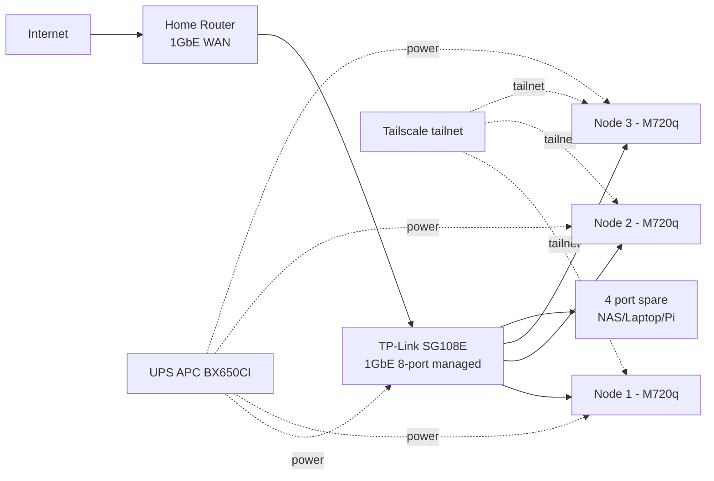

# Homelab Migration Plan: Kind → Bare-metal Talos

> **Status**: Planning document. Not yet implemented. Discussion artifact (May 2026).
>
> **Purpose**: Capture the multi-phase plan to graduate this homelab from Kind (ephemeral, single-host Docker) to bare-metal Talos Linux on Lenovo ThinkCentre M720q mini PCs, scaling from 1 node to a 3-node HA cluster.
>
> **Related**:
> - [`tamsu.md`](../../tamsu.md) — original deep-dive that triggered this plan (OpenBAO PVC pain on Kind)
> - [`docs/secrets/README.md`](../secrets/README.md) — current OpenBAO architecture
> - [`docs/secrets/cert-manager.md`](../secrets/cert-manager.md) — current cert-manager + LE DNS-01 setup

---

## Table of Contents

1. [Why Migrate](#1-why-migrate)
2. [Hardware Plan](#2-hardware-plan)
3. [Reference Repos](#3-reference-repos)
4. [Stack Decisions: Adopt / Cân nhắc / Reject](#4-stack-decisions-adopt--cân-nhắc--reject)
5. [Final Stack: Current vs Phase 1 vs Phase 2](#5-final-stack-current-vs-phase-1-vs-phase-2)
6. [RAM Budget on M720q (32GB)](#6-ram-budget-on-m720q-32gb)
7. [Disk Budget on M720q (1TB NVMe + 500GB SATA)](#7-disk-budget-on-m720q-1tb-nvme--500gb-sata)
8. [Roadmap](#8-roadmap)
9. [Open Decisions](#9-open-decisions)

---

## 1. Why Migrate

**Pain points của Kind (single-host Docker)**:

- **Ephemeral PVCs**: mỗi `make down && make up` mất toàn bộ data → OpenBAO mất CF token → cert-manager fail → cascade lỗi toàn cluster (chi tiết trong [`tamsu.md`](../../tamsu.md))
- **Bootstrap secret pain**: phải nhớ re-seed Cloudflare API token mỗi lần dựng lại
- **Không thật**: không học được bare-metal networking, storage, OS-level concerns
- **Single-host Docker**: không thể test HA, không thể chaos engineering thật
- **Không production-grade**: stack hiện tại là "production-grade design trên dev-grade infrastructure"

**Mục tiêu sau migrate**:

- Chạy 24/7 không sợ mất data
- Học bare-metal K8s đầy đủ (Talos, Cilium, Rook-Ceph, Tailscale)
- Backup tự động → Cloudflare R2 (off-site)
- Path rõ ràng từ 1 node → 3 node HA mà không phải redesign

---

## 2. Hardware Plan

### Triết lý chọn

- Mua 2nd-hand Lenovo Tiny: rẻ hơn 50–70% vs new, hiệu năng dư cho homelab
- Đồng nhất 3 node cùng model → spare parts swap, troubleshoot dễ
- Mua đúng từ đầu, không phải "tiết kiệm bằng cách mua rẻ"
- Mua switch ngay từ Phase 1, topology cuối cùng đã sẵn

### Phase 1 — Mua ngay (~7tr VND / ~$280)

```
1× Lenovo ThinkCentre M720q Tiny (barebone, 2nd-hand)
   - CPU: i5-8500T (6c/6t, 35W TDP) hoặc i5-9500T
   - 2× M.2 NVMe slots + 1× 2.5" SATA bay
                                                   ~3.0tr
2× 16GB DDR4 SODIMM 3200MHz (Crucial/Kingston)     ~1.2tr
1× 1TB NVMe Lexar NM710 (PCIe 3.0)                 ~1.3tr
1× 500GB SATA M.2 KingSpec/Lexar
   (cho Ceph 2nd OSD trong tương lai)              ~0.7tr
─────────────────────────────────────────────────────────
Node #1                                            6.2tr

1× Switch TP-Link TL-SG108E (1GbE 8-port managed)  0.6tr
3× Cable CAT6 1m (mua sẵn cho 3 node)              0.2tr
─────────────────────────────────────────────────────────
Total Phase 1                                      7.0tr (~$280)
```

**Tại sao mua switch + 3 cable ngay**:

- Topology cuối cùng đã sẵn → cắm node #1 vào switch → switch lên router
- TP-Link SG108E có VLAN tag, QoS, port mirror → đủ học network
- 8 port = 3 node + uplink + 4 port spare (cho NAS/Pi/laptop sau này)

**Tại sao mua 500GB M.2 thứ 2 ngay**:

- M720q có 2 khe M.2 → tận dụng từ đầu
- Tách OS+workload (NVMe 1TB) khỏi Ceph data (SATA M.2 500GB) → I/O không tranh nhau
- Khi scale 3 node → mỗi node đã sẵn 2 disk cho Ceph

### Phase 2 — Scale lên 3 node (sau 6–12 tháng, ~14tr VND / ~$560)

```
2× Lenovo M720q Tiny barebone                      6.0tr
4× 16GB DDR4 SODIMM (2 node × 32GB)                2.4tr
2× 1TB NVMe                                        2.6tr
2× 500GB SATA M.2                                  1.4tr
1× UPS APC BX650CI (650VA)                         1.8tr
─────────────────────────────────────────────────────────
Total Phase 2                                     14.2tr
```

**Tại sao Phase 2 mới mua UPS**:

- 1 node Phase 1 mất điện reboot → OK (Talos immutable, restore từ R2 backup)
- 3 node + Ceph 3-replica + etcd quorum: mất điện đột ngột → corrupt etcd/Ceph
- 650VA = ~10–15 phút uptime cho 3 mini PC + switch (đủ shutdown gracefully)

### Tổng investment

| Phase | Khi nào | Cost | Tích lũy |
|---|---|---|---|
| Phase 1 | Ngay | 7.0tr | 7.0tr |
| Phase 2 | +6–12 tháng | 14.2tr | **21.2tr** (~$840) |

→ Dưới $1000 cho HA homelab dùng được 3–5 năm.

### Pitfall thường gặp khi mua

| Sai lầm | Hậu quả |
|---|---|
| Mua i3 thay i5-8500T | Thiếu core cho Ceph + workload |
| Mua RAM 8GB rồi tính nâng sau | Lãng phí, mua 32GB từ đầu |
| Mua SSD 512GB "tiết kiệm" | 6 tháng hết → migrate đau |
| Bỏ qua SATA M.2 thứ 2 | Ceph dùng cùng disk OS → I/O wait kinh khủng |
| Mua switch unmanaged (không có "E" suffix) | Không VLAN, không QoS → không học được network |
| Quên adapter 90W zin | Throttle CPU, instability |

### Network topology cuối cùng (Phase 2)



---

## 3. Reference Repos

Hai repo opinionated được dùng làm reference cho stack design:

- **<https://github.com/jfroy/flatops>** — Talos + Cilium + Rook-Ceph + Envoy Gateway + cloudflared + tuppr
- **<https://github.com/haraldkoch/kochhaus-home>** — Cilium + Envoy + cert-manager + External Secrets + 1Password + SOPS + Rook/Longhorn + VolSync + Harbor + actions-runner-controller

Cả 2 đều **production-grade homelab pattern** nhưng đắt về cognitive load. Plan này chọn lọc, không adopt 100%.

---

## 4. Stack Decisions: Adopt / Cân nhắc / Reject

### Adopt 100%

| Pattern | Lý do |
|---|---|
| **Talos Linux** | Immutable, API-driven, không SSH, auto-recover. Hợp Mini PC chạy 24/7 không màn hình |
| **Cilium CNI** | eBPF, thay kube-proxy → ít overhead, observability network tốt (Hubble) |
| **Tailscale Operator** | Game-changer. Access cluster từ laptop/phone không cần expose, không cần VPN tự host |
| **VolSync + Kopia → R2** | **Bắt buộc** trên 1 node. Mất disk = mất tất. Free tier R2 10GB đủ cho metadata + DB dump |
| **cert-manager + LE DNS-01** | Đã có. Giữ |
| **External Secrets** | Đã có. Giữ |

### Cân nhắc kỹ

| Pattern | Vấn đề trên 1 node |
|---|---|
| **Rook-Ceph** | Trên 1 node với 2 OSD = không HA thật, nhưng có snapshot/clone cho VolSync. Overhead ~2GB RAM. **Đáng** vì Phase 2 sẽ scale lên 3 node |
| **Envoy Gateway** | Đang chạy Kong tốt. Switch sang Envoy Gateway = học lại config, mất time. **Giữ Kong** |
| **cloudflared tunnel** | Hữu ích nếu cần expose ra internet. Nếu chỉ Tailscale là đủ → bỏ |
| **tuppr** | Auto-upgrade Talos + K8s. Hữu ích cho 3 node, hơi overkill cho 1 node. **Phase 2 mới add** |
| **actions-runner-controller** | Self-hosted GH runner. Tốn ~1GB RAM idle. **Bỏ Phase 1**, chỉ add nếu CI bottleneck |
| **Harbor (image mirror)** | Tiết kiệm bandwidth nếu pull nhiều image. Phase 1 chưa cần, Phase 2 nếu network chậm thì add |

### Reject

| Pattern | Lý do |
|---|---|
| **1Password Connect** | Thêm dependency external (license $20/user/tháng). Đã có **OpenBAO**, cứ giữ |
| **SOPS thay External Secrets** | SOPS hợp cho secret tĩnh trong Git. Đang dùng OpenBAO + ESO cho dynamic + rotation → tốt hơn. Chỉ dùng SOPS cho **bootstrap-only secret** (CF token, age key) — đó là pattern đúng |
| **Longhorn** | Alternative của Rook-Ceph. Đơn giản hơn nhưng chỉ block storage, không có S3. Rook-Ceph cho cả block + S3 (object) → phù hợp hơn |

---

## 5. Final Stack: Current vs Phase 1 vs Phase 2

| Layer | **Current (Kind)** | **Phase 1 (1× M720q Talos)** | **Phase 2 (3× M720q Talos HA)** |
|---|---|---|---|
| **OS** | Docker container (Kind) | Talos Linux | Talos Linux |
| **CNI** | kindnet | Cilium (Hubble off, kube-proxy replacement on) | Cilium (Hubble on) |
| **Ingress** | Kong (DB-less) ✅ | Kong (DB-less) ✅ | Kong (DB-less) ✅ |
| **Storage** | hostPath ephemeral | Rook-Ceph 2 OSD (1 node, no HA) | Rook-Ceph 6 OSD (3 node, 3-replica) |
| **Backup** | ❌ None | VolSync + Kopia → Cloudflare R2 | VolSync + Kopia → Cloudflare R2 |
| **Secrets manager** | OpenBAO HA Raft (1 pod thực tế) | OpenBAO single replica + VolSync backup PVC | OpenBAO HA Raft 3 nodes thật |
| **Secrets sync** | External Secrets ✅ | External Secrets ✅ | External Secrets ✅ |
| **Bootstrap secret** | Manual `bao kv put` (đau) | SOPS + age (CF token, age key trong `~/.homelab/`) | SOPS + age |
| **Cert** | cert-manager + LE DNS-01 ✅ | cert-manager + LE DNS-01 ✅ | cert-manager + LE DNS-01 ✅ |
| **Trust distribution** | trust-manager + homelab-ca | **Bỏ** (chưa có mTLS internal use case) | Add lại nếu cần mTLS |
| **GitOps** | Flux Operator + ResourceSets + OCI ✅ | Flux Operator + ResourceSets + OCI ✅ | Flux Operator + ResourceSets + OCI ✅ |
| **Remote access** | localhost only | Tailscale Operator | Tailscale Operator |
| **Public expose** | localhost | cloudflared tunnel (optional) | cloudflared tunnel |
| **Cluster upgrade** | recreate Kind | Manual `talosctl upgrade` | tuppr (auto + healthcheck) |
| **CI runner** | GitHub-hosted | GitHub-hosted | actions-runner-controller (nếu CI bottleneck) |
| **Image mirror** | ❌ | ❌ | Harbor (nếu network chậm) |
| **Postgres** | 3 cluster + DR | 3 cluster, 1 instance mỗi cluster | 3 cluster HA, 3 instance mỗi cluster |
| **Observability** | Full stack (VM + Tempo + VL + Vector + Pyroscope + Grafana) ✅ | Full stack ✅ (retention 7d) | Full stack ✅ (retention 30d) |
| **Apps** | 8 microservices + frontend + k6 ✅ | Same ✅ | Same ✅ |

### Net change

- ✅ **Add**: Talos, Cilium, Rook-Ceph, VolSync+Kopia, Tailscale Operator, SOPS (cho bootstrap)
- ❌ **Remove (Phase 1)**: trust-manager + homelab-ca (defer đến khi có mTLS use case)
- 🔄 **Restructure**: OpenBAO HA → single + backup (Phase 1), trở lại HA Raft (Phase 2)
- ✅ **Keep**: Kong, ESO, cert-manager+LE, Flux+ResourceSets+OCI, observability stack, 8 microservices

---

## 6. RAM Budget on M720q (32GB)

Phase 1 — 1 node, headroom-friendly:

| Component | RAM | Note |
|---|---|---|
| Talos OS + kernel | 0.5GB | Immutable, lean |
| K8s control plane (etcd + apiserver + controller-manager + scheduler) | 1.5GB | Single node |
| Cilium agent + operator | 0.5GB | Hubble disabled Phase 1 |
| Rook-Ceph (mon + mgr + 2 OSD) | 2.5GB | 2 OSD trên 2 disk |
| Flux Operator + Source/Helm/Kustomize controllers | 0.4GB | |
| cert-manager + ESO + Kyverno | 0.6GB | |
| OpenBAO (single replica) | 0.3GB | Backup PVC qua VolSync |
| VolSync + Kopia | 0.2GB | Idle khi không backup |
| Tailscale Operator + cloudflared | 0.3GB | |
| Kong | 0.4GB | DB-less, 1 replica |
| VictoriaMetrics single + VMAgent + VMAlert + VMAlertmanager | 1.5GB | Trim retention 7d |
| Tempo + OTel Collector | 0.8GB | Trace retention 24h |
| VictoriaLogs + Vector | 0.8GB | Log retention 7d |
| Pyroscope | 0.5GB | Optional, có thể bỏ Phase 1 |
| Grafana | 0.3GB | |
| Sloth Operator | 0.1GB | |
| 3 PostgreSQL clusters (Zalando + CNPG + DR) | 3.0GB | Mỗi cluster 1 instance Phase 1 |
| PgBouncer + PgDog poolers | 0.4GB | |
| Valkey cache | 0.3GB | |
| 8 microservices | 1.6GB | ~200MB/service Go |
| Frontend (nginx + React build) | 0.1GB | |
| K6 load test (idle) | 0.1GB | |
| MCP servers (3) | 0.5GB | Có thể bỏ nếu không dùng AI assistant |
| kube-system overhead (CoreDNS, metrics-server, …) | 0.5GB | |
| Buffer / OS cache | 4.0GB | Page cache cho I/O performance |
| **Total** | **~21GB** | trên 32GB → **~66% utilization, 11GB headroom** |

→ **Thoải mái**. Có thể giữ stack đầy đủ, không phải trim quyết liệt.

### Optional trim (nếu muốn lean hơn)

| Trim | Save RAM | Tradeoff |
|---|---|---|
| Bỏ Pyroscope | 0.5GB | Mất profiling — chỉ cần khi debug perf |
| Bỏ DR replica (cnpg-db-replica) | 0.5GB | Đỡ tải, backup VolSync vẫn OK |
| Bỏ MCP servers | 0.5GB | Chỉ enable khi dùng AI assistant |
| Bỏ K6 deployment | 0.1GB | Chạy ad-hoc thôi |
| Trim VM retention 7d → 3d | 0.5GB | Mất history dài |
| Bỏ Kyverno (giữ admission policy mode `audit`) | 0.4GB | Mất enforcement |

→ Có thể trim xuống **~17GB** nếu cần.

---

## 7. Disk Budget on M720q (1TB NVMe + 500GB SATA)

### NVMe 1TB (OS + workload + hot data)

| Volume | Size | |
|---|---|---|
| Talos system + container images | ~50GB | |
| etcd data | ~5GB | |
| Postgres data + WAL (3 clusters) | ~40GB sau 6 tháng | |
| VictoriaMetrics data (7d retention) | ~15GB | |
| VictoriaLogs (7d retention) | ~10GB | |
| Tempo (24h retention) | ~5GB | |
| OpenBAO Raft data | ~1GB | |
| Grafana + misc PVC | ~5GB | |
| **NVMe 1TB used** | **~131GB** | **~13% — rộng rãi** |

### SATA M.2 500GB (Ceph 2nd OSD + backup staging)

| Volume | Size | |
|---|---|---|
| Ceph OSD #2 (cho block storage HA-ready) | 500GB raw | |
| VolSync staging (snapshots trước khi push R2) | ~50GB | |
| **SATA M.2 used** | **~100–200GB** | **~20–40%** |

→ **1TB + 500GB hoàn toàn dư cho Phase 1**, không phải lo disk space ít nhất 2 năm.

### Phase 2 Ceph capacity

- 3 node × (1TB NVMe + 500GB SATA) = **4.5TB raw**
- Ceph 3-replica → **~1.5TB usable**
- Đủ cho: PostgreSQL HA + observability long retention (30d) + media + backup local

---

## 8. Roadmap

| Tháng | Hardware | Software milestone |
|---|---|---|
| **0** | Mua node 1 + switch (7tr) | Talos single-node + migrate Kind stack |
| **1–2** | — | VolSync + Kopia → Cloudflare R2 backup setup |
| **2–3** | — | Tailscale Operator, cloudflared tunnel (nếu cần) |
| **3–6** | — | Trim observability, validate stack stability, run smooth |
| **6–12** | Mua node 2+3 + UPS (14tr) | Talos HA cluster, Ceph 3-replica, OpenBAO Raft 3 |
| **12+** | (Optional) 2.5GbE / 10GbE upgrade | k6 load test, chaos engineering, tuppr |

---

## 9. Open Decisions

Cần chốt trước khi bắt đầu Phase 1:

1. **OS**: Talos Linux (immutable, opinionated) hay Ubuntu Server + k3s (debug dễ hơn nhưng kém immutable)?
2. **OpenBAO Phase 1**: single replica (không HA, backup PVC qua VolSync) hay vẫn deploy 3 replica trên 1 node (HA giả, tốn 3× RAM)?
3. **Bootstrap secret**: SOPS + age (commit encrypted vào Git, giải mã khi bootstrap) hay giữ pattern `~/.homelab/secrets.env` script-based?
4. **Public expose**: chỉ Tailscale (private) hay add cloudflared tunnel (host blog/app ra internet)?
5. **MCP servers**: giữ Phase 1 (vì đang dùng AI assistant) hay bỏ tiết kiệm RAM?

Trả lời 5 câu này → finalize Talos config skeleton + repo migration plan từ Kind sang Talos.

---

## Pre-purchase checklist

Trước khi mua phần cứng:

- [ ] Confirm budget Phase 1 (7tr) hay phải cắt xuống 5.5tr (bỏ SATA M.2 thứ 2 + chỉ 16GB RAM)
- [ ] Có UPS hay nguồn điện ổn định? Nếu nhà hay cúp điện → mua UPS sớm hơn (Phase 1)
- [ ] Tailscale account đã có? (Free tier 100 device, đủ cho homelab)
- [ ] Cloudflare R2 đã set up? (Free tier 10GB storage + 1M Class A ops/tháng)
- [ ] Có cần expose service ra internet thật không? (Quyết định cloudflared vs chỉ Tailscale)
- [ ] Mua Lenovo M720q ở đâu (HN: Mai Hắc Đế / Lê Thanh Nghị, hoặc Shopee shop có ≥1000 đánh giá)
- [ ] Hỏi shop: adapter 90W zin, 2 khe M.2 đều enable, có WiFi M.2 card không
