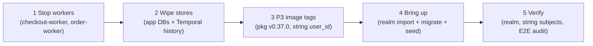

# Identity cutover runbook — the RFC-0024 P3 greenfield DB reset

One-shot reset that moves the fleet from auth-service-minted numeric `user_id`s to
Keycloak realm subjects (string UUIDs) — the data is demo-only, so the cutover is a
wipe-and-reseed, not a migration.

| Item | Value |
|------|-------|
| Scope | local-stack (compose) + local cluster (Kind) |
| Trigger | Deploying the P3 image tags (pkg v0.37.0 `OIDC_*` contract, string `user_id`) |
| Data loss | Intended — all app DBs and Temporal history are demo data (greenfield contract, RFC-0022) |
| Cluster steps | **Pending** the P0/Kind verification window — rehearse on compose first |
| Design records | [RFC-0024](../proposals/rfc/RFC-0024/README.md) · [ADR-041](../proposals/adr/ADR-041-keycloak-platform-idp/) · [ADR-042](../proposals/adr/ADR-042-oidc-sub-as-user-id/) |

## Why a reset

ADR-042 changes `user_id` from a numeric auth-service id to the Keycloak `sub`
(string UUID, fixed demo scheme `a11ce000-0000-4000-8000-00000000000N`). Rows,
idempotency keys, and in-flight Temporal workflow inputs created before the cutover
carry numeric ids that the P3 binaries reject — so the P3 tags must only ever start
against empty stores.

## Steps — local-stack (compose)

1. **Stop the workers first** so no saga writes race the wipe:
   `docker compose stop checkout-worker order-worker`
2. **Wipe everything**: `docker compose down -v` — postgres has no data volume, so
   `down` alone drops all app DBs, the `keycloak` DB, and Temporal history; `-v`
   additionally clears the observability volumes.
3. **Check out the P3 tags** in the sibling service repos (compose builds from
   `../../<service>`): every authmw consumer on the pkg v0.37.0 `OIDC_*` contract,
   frontend with the keycloak-js build args (frontend#90).
4. **Bring up**: `docker compose up -d --build` — Keycloak imports
   `keycloak/duynhlab-realm.json` into the empty realm set, migrations and seeds
   re-create the schema with string `user_id` columns.

## Steps — cluster (Kind) — pending the P0/Kind verification window

Same order, cluster vehicles. Do not run until the P0 spike has verified the edge +
realm on Kind.

1. Scale the workers to zero (`checkout-worker`, `order-worker` HelmReleases).
2. `make down && make up` — the Kind rebuild drops and recreates the app databases
   (CNPG `initdb` + postInitSQL, including `keycloak` on `platform-db`) and wipes
   Temporal history; the realm ConfigMap imports on Keycloak's first start.
3. The service RSIPs must already pin the P3 image tags (and the frontend tag must
   be built with `KEYCLOAK_URL=https://id.duynh.me` — see the comment in
   `kubernetes/apps/frontend-rs.yaml`); `make validate` before pushing.

## Verification

- **Realm import**: Keycloak healthy; `GET /realms/duynhlab/.well-known/openid-configuration`
  answers with the expected issuer; the five demo users exist with the fixed UUIDs.
- **String subjects end-to-end**: log in as `alice` / `password123` (by username),
  place an order, and confirm `user_id` is the string UUID across HTTP → gRPC → DB
  rows → the Temporal workflow input (Temporal UI, namespace `mop`).
- **Both workers running** and the order-fulfillment saga completes.
- **Full E2E release audit**: all A/B/C rows in
  [`local-stack/docs/e2e-audit.md`](../../local-stack/docs/e2e-audit.md) pass —
  mandatory before tagging.

## References

- [RFC-0024 — Replatform edge and identity](../proposals/rfc/RFC-0024/README.md) (§Identity cutover)
- [ADR-041 — Keycloak as the platform IdP](../proposals/adr/ADR-041-keycloak-platform-idp/)
- [ADR-042 — OIDC `sub` as `user_id`](../proposals/adr/ADR-042-oidc-sub-as-user-id/)
- [local-stack E2E release audit](../../local-stack/docs/e2e-audit.md)

---
_Last updated: 2026-08-12_
