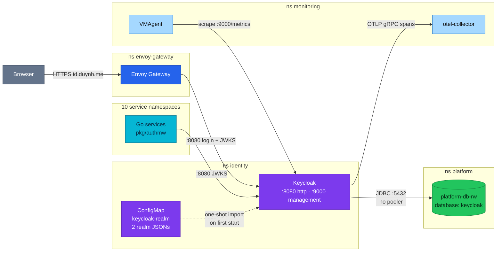
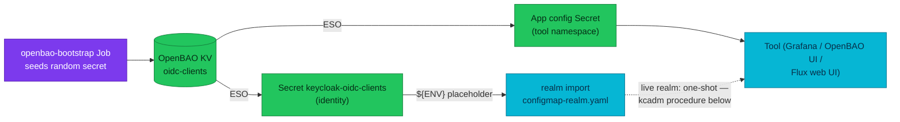

# Keycloak (Identity Provider)

Keycloak is the platform's only token issuer. It runs as a single hand-written
Deployment in the `identity` namespace, imports two realms from a ConfigMap, and
stores its state in the `keycloak` database on `platform-db` — deliberately
bypassing the connection pooler that every application service goes through.

| | |
|---|---|
| **Image** | `quay.io/keycloak/keycloak:26.7.2`, digest-pinned |
| **Shape** | Raw `Deployment`, `replicas: 1` — no Helm chart, no Keycloak Operator |
| **Namespace** | `identity` — a platform component, not an app-tier service |
| **Realms** | `duynhlab` (customers) · `duynhlab-staff` (workforce, [ADR-050](../proposals/adr/ADR-050-separate-staff-identity-realm/)) |
| **Database** | `keycloak` on `platform-db`, **direct to `platform-db-rw`**, pooler bypassed |
| **Edge** | `https://id.duynh.me` — fully public, no auth, no rate limit |
| **Signals** | ServiceMonitor on `:9000` · 5 alerts + 5 runbooks · Sloth `keycloak-login` · dashboard `keycloak-identity` |
| **Environments** | Local Kind cluster + local-stack compose. **No production deployment** — `clusters/production/` is a stub |
| **Design record** | [RFC-0022](../proposals/rfc/RFC-0022/) (design) · [RFC-0024](../proposals/rfc/RFC-0024/) P1/P3/P5 (execution) · [ADR-041](../proposals/adr/ADR-041-keycloak-platform-idp/) |

> **Application contract** — realms, claims, `user_id`, the `OIDC_*` env pair, and
> which service verifies what: [Identity and Tokens](../api/identity.md). This
> doc is the **platform view**: how the thing is deployed, operated, and watched.

---

## What it does here

Keycloak replaced a hand-rolled `auth-service` that owned an RS256 signer,
refresh-token families, and a JWKS endpoint. That service is gone entirely
(RFC-0024 P5): no manifest, no namespace, no database, no edge route.

What Keycloak is actually used for is narrow, and worth being explicit about
because it is much less than Keycloak can do:

- Issue and refresh access tokens for two browser clients over Authorization
  Code + PKCE.
- Publish a JWKS per realm, which the edge and ten services fetch to verify
  signatures.
- Hold realm roles (`customer`, `backoffice_admin`) and the demo users.
- **Staff SSO for infra tools** ([ADR-062](../proposals/adr/ADR-062-staff-groups-sso/)):
  the staff realm carries the team groups (`infra-team`/`sre-team`/`dev-team`)
  and three confidential clients — `grafana` (generic_oauth, groups → org
  role), `openbao` (auth/oidc, groups → external groups → team policies) and
  `flux-web` (the Flux Operator web UI at ui.duynh.me: Web Config OIDC,
  groups impersonated as Kubernetes groups → flux-web-admin/-user
  ClusterRoleBindings). Their
  secrets are realm-import `${ENV}` placeholders fed from OpenBAO via ESO —
  never literals in git. Login and admin **events are enabled** on the staff
  realm and land in VictoriaLogs through the JSON console log.

Deliberately **not** used: self-registration, password recovery, identity
brokering, user federation, fine-grained authorization services, and the Envoy
Gateway `oidc` filter (the browser drives the flow instead —
[ADR-043](../proposals/adr/ADR-043-oidc-browser-workload-trust/)).

## Architecture

Who talks to Keycloak, and on which port:



`:9000` is the management port — health probes and `/metrics`. It is never
exposed at the edge, and in local-stack it is not even published to the host.

## Deployment inventory

Every row is a file in this repo.

| Object | File | Purpose |
|--------|------|---------|
| `Kustomization keycloak-local` | `kubernetes/clusters/local/keycloak.yaml` | Flux entry point; `timeout: 10m`, health-gated on the Deployment |
| `Namespace identity` | `kubernetes/infra/controllers/namespaces.yaml` | No `app-tier` label — so app-tier default-deny generation does not apply |
| `Deployment keycloak` | `kubernetes/infra/controllers/keycloak/deployment.yaml` | The server: `start --import-realm`, `replicas: 1` |
| `Service keycloak` | `kubernetes/infra/controllers/keycloak/service.yaml` | ClusterIP, ports `http` 8080 + `management` 9000 |
| `ConfigMap keycloak-realm` | `kubernetes/infra/controllers/keycloak/configmap-realm.yaml` | Both realm JSONs, mounted read-only at `/opt/keycloak/data/import` |
| `ExternalSecret keycloak-bootstrap-admin` | `kubernetes/infra/controllers/keycloak/external-secret.yaml` | Bootstrap admin from OpenBAO `secret/local/infra/keycloak/admin` |
| `Database` + `DatabaseRole` + `ExternalSecret` | `kubernetes/infra/configs/databases/clusters/platform-db/services/keycloak.yaml` | The declarative CNPG triplet: database `keycloak`, owner role, credential |
| `ExternalSecret` (identity ns copy) | `.../platform-db/secrets/platform-db-keycloak-secret-identity-ns.yaml` | Same OpenBAO path, second namespace — the Deployment reads it locally |
| `HTTPRoute keycloak` | `kubernetes/infra/configs/envoy-gateway/routes/keycloak.yaml` | `id.duynh.me` → `keycloak:8080` |
| 13 `SecurityPolicy` | `kubernetes/infra/configs/envoy-gateway/policies/security-jwt.yaml` | Edge JWT per guarded route, `remoteJWKS` against both realms |
| `NetworkPolicy` ×2 | `kubernetes/infra/configs/network-policies/identity.yaml` | Default-deny ingress + three explicit allows |

Runtime shape worth knowing: requests `500m` CPU / `1Gi` memory, limit `2Gi`
memory and **no CPU limit**; probes all on `:9000` (`/health/started` with a
5-minute startup budget, then `/health/ready` and `/health/live`); JSON console
logging; OTLP tracing at 10 % ratio in-cluster.

### Flux position

```text
controllers-local ─┐
databases-local  ──┼─→ keycloak-local ─→ envoy-gateway-config-local
secrets-local    ──┤
monitoring-local ──┘
```

Two edges in that chain are load-bearing:

- `databases-local` first, because Keycloak cannot start without its database,
  its role, and the credential copied into `identity`.
- `envoy-gateway-config-local` **after** `keycloak-local`, because the edge's
  `SecurityPolicy` objects carry `remoteJWKS` URLs. If the edge configured
  before Keycloak resolved, every guarded route would fail closed.

The full graph is in [setup.md](setup.md).

### Database, and why the pooler is bypassed

Keycloak connects **direct to `platform-db-rw:5432`**, not through the PgDog
pooler that application services use. Its Agroal connection pool needs
long-lived connections and server-side prepared statements, both of which
transaction pooling breaks (RFC-0022 OQ#8,
[ADR-041](../proposals/adr/ADR-041-keycloak-platform-idp/)).

This is a deliberate, documented exception. Do not "fix" it by routing Keycloak
through the pooler for consistency.

### Realm delivery

Both realms ship as keys in the `keycloak-realm` ConfigMap and are imported by
`start --import-realm` on container start.

**Import is one-shot.** Keycloak imports a realm only if it does not already
exist. There is no reconciliation loop, no Keycloak Operator, and no
`KeycloakRealmImport` CR — so **editing the ConfigMap does not change a running
realm**. Applying realm changes means either a manual edit through the admin
console (which then drifts from git) or the reset procedure below.

That is the single biggest operational limitation of this deployment. It is
acceptable today because the realms hold only demo users.

### One SSO client, four owners

Every confidential client (`grafana`, `openbao`, `flux-web`) crosses four
GitOps owners; this is the whole chain — nothing else holds secret material:



### Network reachability

`kubernetes/infra/configs/network-policies/identity.yaml` — `deny-all-ingress`
plus one `allow-internal-callers` policy with three rules:

| From | To port | Why |
|------|---------|-----|
| ns `monitoring` | 9000 | VMAgent scrape |
| ns `envoy-gateway` | 8080 | The `id.duynh.me` route + the edge's `remoteJWKS` fetches |
| 10 service namespaces | 8080 | In-service `pkg/authmw` JWKS fetches |

The ten namespaces are `cart`, `checkout`, `inventory`, `notification`, `order`,
`payment`, `product`, `review`, `shipping`, `user` — the exact set of
`authmw` consumers. This rule closed a real outage on 2026-08-22 in which every
private and protected route returned `401`: the policy had been written for seven
namespaces when ten services needed it. **Adding an eleventh `authmw` consumer
means editing this policy**, or that service fails closed.

`frontend` and `backoffice` are deliberately absent — the browser holds the
token, so those pods never fetch a JWKS.

Both policies are `policyTypes: [Ingress]` only. **There is no egress policy for
`identity`**, so Keycloak's outbound traffic to `platform-db` and the collector
is unrestricted. Reciprocal ingress on the database side lives in
`network-policies/platform.yaml`.

## Operations

### Verify a deployment is healthy

```bash
kubectl -n identity get deploy,pod,svc
kubectl -n identity logs deploy/keycloak --tail=50 | grep -i "realm\|listening"
kubectl -n flux-system get kustomization keycloak-local
```

**Expected**: one `keycloak` pod `1/1 Running`; the log shows both realms
imported *or* already existing; the Kustomization is `Ready=True`.

### Verify both realms, not just one

```bash
for r in duynhlab duynhlab-staff; do
  echo "--- $r"
  curl -sk "https://id.duynh.me/realms/$r/.well-known/openid-configuration" \
    | python3 -c 'import json,sys; d=json.load(sys.stdin); print(d["issuer"])'
  curl -sk "https://id.duynh.me/realms/$r/protocol/openid-connect/certs" \
    | python3 -c 'import json,sys; print(len(json.load(sys.stdin)["keys"]), "key(s)")'
done
```

**Expected**: the `issuer` echoes the public host for each realm, and each JWKS
returns at least one key. Checking only the customer realm would pass while the
staff realm is broken — always do both.

### Mint a token

Direct Access Grants are disabled on both realms, so there is no password grant.
Use the PKCE helper — see
[Identity and Tokens § Getting a token](../api/identity.md#getting-a-token-for-tests).

### Check the connection pool

```bash
kubectl -n identity port-forward deploy/keycloak 9000:9000 &
curl -s localhost:9000/metrics | grep -E '^agroal_(active|available|awaiting)_count'
```

**Expected**: `agroal_awaiting_count 0`. A non-zero value for two minutes fires
`KeycloakDbPoolExhausted` — runbook at
`docs/observability/runbooks/keycloak/KeycloakDbPoolExhausted.md`.

### Rotate the database credential

The credential lives in OpenBAO at
`secret/local/databases/platform-db/keycloak` and is projected by two
ExternalSecrets (one per namespace). Rotate at the source, let both refresh, then
restart the Deployment — Keycloak reads `KC_DB_PASSWORD` from env at startup, so
a synced secret alone changes nothing. See
[openbao.md](../secrets/openbao.md).

### Add a confidential client to a live realm

The realm import is one-shot, so a client added to
`configmap-realm.yaml` never reaches an already-imported realm — and the
reset procedure below is a full cluster rebuild. The non-nuclear path,
exercised for `flux-web` (2026-08-27), is to make the live realm match git
with `kcadm`. Order matters: seed the client secret in OpenBAO first (the
[live-seed runbook](../secrets/runbooks/add-secret-live-cluster.md)), let ESO
sync it, then create the client with that same value so both sides agree.

```bash
POD=$(kubectl get pod -n identity -l app.kubernetes.io/name=keycloak -o name | head -1)
KU=$(kubectl get secret keycloak-bootstrap-admin -n identity -o jsonpath='{.data.username}' | base64 -d)
KP=$(kubectl get secret keycloak-bootstrap-admin -n identity -o jsonpath='{.data.password}' | base64 -d)
SECRET=$(kubectl get secret keycloak-oidc-clients -n identity -o jsonpath='{.data.<client>_client_secret}' | base64 -d)
kc() { kubectl exec -n identity "$POD" -- /opt/keycloak/bin/kcadm.sh "$@"; }

kc config credentials --server http://localhost:8080 --realm master --user "$KU" --password "$KP"

# Idempotent: bail if it already exists
kc get clients -r duynhlab-staff -q clientId=<client> --fields id --format csv --noquotes

ID=$(kc create clients -r duynhlab-staff -i \
  -s clientId=<client> -s enabled=true -s protocol=openid-connect \
  -s publicClient=false -s "secret=$SECRET" \
  -s standardFlowEnabled=true -s implicitFlowEnabled=false \
  -s directAccessGrantsEnabled=false -s serviceAccountsEnabled=false \
  -s 'redirectUris=["https://<host>/oauth2/callback"]' \
  -s 'webOrigins=["https://<host>"]')

# groups membership mapper — identical to the other staff clients
kc create "clients/$ID/protocol-mappers/models" -r duynhlab-staff \
  -s name=groups -s protocol=openid-connect \
  -s protocolMapper=oidc-group-membership-mapper -s consentRequired=false \
  -s 'config."claim.name"=groups' -s 'config."full.path"=false' \
  -s 'config."id.token.claim"=true' -s 'config."access.token.claim"=true' \
  -s 'config."userinfo.token.claim"=true'
```

Verify the result matches git field-for-field (`kc get clients -r
duynhlab-staff -q clientId=<client>`), because from here on the ConfigMap and
the live realm are reconciled by hand until the next rebuild.

Two scope rules every staff client follows (both learned as live login
failures on flux-web): request only `openid profile email` — `groups` is not
a client scope here (the claim comes from the mapper above), and
`offline_access` needs a realm role staff users are deliberately not granted.

### Reset and reseed the realms

The destructive procedure, needed because realm import is one-shot. **This wipes
application data** — every store here holds demo data by design (the greenfield
contract in RFC-0022).

This is also the still-outstanding half of the RFC-0024 P3 cutover: the
local-stack rehearsal is done, the cluster run is **pending the Kind gate**. Do
not run the cluster steps until the edge and realms have been verified on Kind.

**local-stack** (executed, PR #752):

```bash
cd local-stack
docker compose stop checkout-worker order-worker
docker compose down -v          # drops volumes: Postgres, Temporal, realms
docker compose up -d --build    # realm import + migrate + seed
```

**Cluster** (pending the Kind gate):

1. Scale both workers to zero so no saga is mid-flight.
2. `make down && make up` — CNPG `initdb` + `postInitSQL` recreate every
   database including `keycloak`, Temporal history is wiped, and the realm
   ConfigMap imports on first start.
3. Confirm the `ResourceSetInputProvider`s pin the intended image tags, and that
   the frontend tag was built with `KEYCLOAK_URL=https://id.duynh.me`.
4. `make validate` before pushing.

**Verification after either path:**

- Both realms imported (the two-realm check above).
- String subjects end to end: log in as `alice` / `password123`, place an order,
  and confirm the same UUID appears across HTTP → gRPC → DB → the Temporal
  workflow input in namespace `mop`.
- Both workers running and the fulfillment saga completing.
- The full A/B/C [E2E release audit](../../local-stack/docs/e2e-audit.md) —
  mandatory before tagging.

## Observability

All of this is live in both environments unless noted.

| Signal | Producer | Pipeline | Consumer |
|--------|----------|----------|----------|
| Metrics | Keycloak `:9000/metrics` (`KC_METRICS_ENABLED`, user-event metrics tagged `realm,clientId`) | `ServiceMonitor keycloak` → auto-converted to `VMServiceScrape` | VictoriaMetrics → Grafana, vmalert |
| Traces | Keycloak OTLP exporter (`KC_TRACING_ENABLED`, ParentBased ratio 0.1 cluster / 1.0 local) | otel-collector | VictoriaTraces + ClickHouse |
| Logs | JSON console (`KC_LOG_CONSOLE_OUTPUT=json`), pod label `app: keycloak` | Vector | VictoriaLogs |
| SLO | `keycloak_user_events_total`, `http_server_requests_seconds` | Sloth `PrometheusServiceLevel keycloak-login` | Burn-rate alerts |

- **Dashboard** — "Keycloak — Identity", uid `keycloak-identity`: overview
  (logins/min, auth failure ratio, p95, SLO compliance), latency, auth events by
  type/error/realm, and infrastructure (Agroal pool, JVM heap, GC).
- **Alerts** — five, each with a `runbook_url` and a runbook file under
  `docs/observability/runbooks/keycloak/`: `KeycloakDown`,
  `KeycloakRestartLoop`, `KeycloakLoginFailureRatioHigh`,
  `KeycloakTokenLatencyHigh`, `KeycloakDbPoolExhausted`. Catalogued in
  [alert-catalog.md § 2b](../observability/alerting/alert-catalog.md).
- **SLOs** — `login-availability` at 99.9 % (login events carrying a non-empty
  `error` label — Keycloak 26.x emits no `login_error` event, so the ratio is
  built from the error label) and `auth-latency` at 95 % under 250 ms.
- local-stack carries four of the five alerts; `KeycloakRestartLoop` needs
  kube-state-metrics and so is cluster-only.

## Known gaps

Stated plainly, because none of these are hidden by the manifests:

| Gap | Consequence |
|-----|-------------|
| **No production deployment** | `clusters/production/` is a stub. Everything above is Kind + compose. |
| `replicas: 1`, no PDB, no HPA, no anti-affinity | A single pod restart takes down **all new logins**. Existing tokens keep working until they expire. |
| No CPU limit | Memory is capped at `2Gi`; CPU is not. A hot JVM can starve neighbours on the node. |
| Realm import is one-shot | No drift detection, no reconciliation. See [Realm delivery](#realm-delivery). |
| Bootstrap admin is never removed | The ExternalSecret keeps it alive; Keycloak warns about it indefinitely. |
| Edge does not verify `aud`, and has no rate limit | Any realm-signed token passes the edge; the public login surface has no throttle or CIDR fence. |
| No egress NetworkPolicy for `identity` | Outbound traffic from Keycloak is unrestricted. |
| No log parsing, trace-based signals, or recording rules | Logs land in VictoriaLogs unparsed; spans are collected but nothing alerts on them. |
| `OTEL_RESOURCE_ATTRIBUTES` says `deployment.environment.name=production` | Set on the **local** cluster, to satisfy the vmagent promote allowlist. Misleading when read at face value. |
| local-stack realm JSONs have drifted | Their `redirectUris`/`webOrigins` differ from the cluster ConfigMap while a compose comment still calls them verbatim copies. (The ADR-062 groups/clients/events shape IS carried in both.) |
| Local Grafana/OpenBAO client secrets in local-stack are dev literals | The cluster generates them randomly in OpenBAO; the compose realm uses placeholder strings — same class as the other committed dev creds below. |
| Credentials are committed in git | The OpenBAO bootstrap ConfigMap and realm JSONs carry dev-only passwords in plaintext. Acceptable for a demo platform, disqualifying for anything real. |

## References

- [Identity and Tokens](../api/identity.md) — the application-facing contract
- [Envoy Gateway](envoy-gateway.md) — edge routing, policy attachment, the JWT policies
- [setup.md](setup.md) — the full Flux dependency graph
- [Network policies](../security/network-policies.md) · [OpenBAO](../secrets/openbao.md)
- [Alert catalog](../observability/alerting/alert-catalog.md) · runbooks in `docs/observability/runbooks/keycloak/`
- [RFC-0022](../proposals/rfc/RFC-0022/) · [RFC-0024](../proposals/rfc/RFC-0024/) · [ADR-041](../proposals/adr/ADR-041-keycloak-platform-idp/) · [ADR-050](../proposals/adr/ADR-050-separate-staff-identity-realm/)
- [Keycloak server documentation](https://www.keycloak.org/documentation)

---

_Last updated: 2026-08-27 — live-realm client procedure (kcadm, exercised for flux-web) + the four-owner chain diagram + the two scope rules. Previously: added the ADR-062 staff-SSO consumers (groups, confidential clients, realm events). First version 2026-08-24 closed the deliverable named by ADR-041 and RFC-0022 and absorbed the retired `identity-cutover-runbook.md` as the realm reset procedure._
