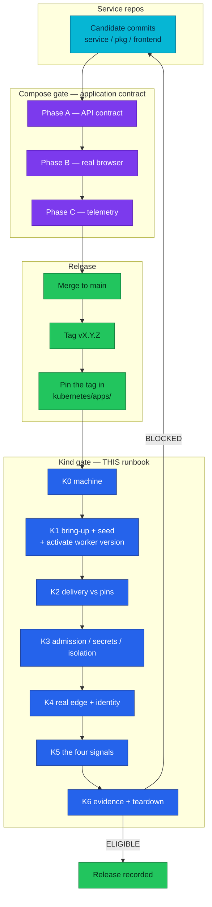

# Kind E2E audit

The cluster gate: the runbook that proves Flux delivered what the manifests
promise, on a Kind cluster built from zero. Twin of
[`local-stack/docs/e2e-audit.md`](../../local-stack/docs/e2e-audit.md) — the
Compose gate — and deliberately **not** a repeat of it.

| Attribute | Value |
|-----------|-------|
| **Applies to** | The Kind cluster `homelab`, brought up from this repository |
| **Complements** | [Compose E2E release audit](../../local-stack/docs/e2e-audit.md). That gate proves the application contract; this one proves delivery, admission, the real edge, and cluster-only telemetry |
| **Execution** | By hand, in `bash`, on a cluster recreated from scratch. macOS + podman and Linux + Docker are both supported — see [K0](#k0--the-machine) |
| **Estimated** | 90–120 minutes, most of it waiting on reconciliation |
| **Evidence** | The block in [K6.1](#k6--evidence-and-teardown), pasted into the pull request or release record |
| **Pass decision** | `ELIGIBLE` only when every row that is not marked *optional* passes |
| **Failure decision** | `BLOCKED` — a Kind failure blocks the homelab pull request even when the Compose candidate passed |

## What this audit is for

The Compose gate already proved the **application contract** — API rows, browser
rows, telemetry rows, and a Playwright suite, all against the same service code.
Repeating that here would cost hours and prove nothing new.

What only a cluster can prove is everything Compose has no equivalent for:

1. **Flux actually delivers** what the manifests promise, in dependency order.
2. **The images running are the images pinned** — Compose builds from a working
   copy and never touches a tag. It also never touches an image *platform*, which
   is how the fleet's amd64-only manifest lists survived every green Compose run
   ([2026-08-20](#2026-08-20--the-arm64-bring-up)).
3. **Admission, secrets and network policy** exist at all.
4. **The real edge** — TLS, Host-header routing, HTTP→HTTPS.
5. **Controller-minted credentials** — the Grafana MCP server consumes a token
   the Grafana Operator writes, which has no Compose analogue at all
   ([K3.6](#k3--admission-secrets-isolation)).
6. **Kubernetes resource attributes** — `k8s.pod.name`, `k8s.namespace.name` and
   the `GrafanaDashboard` reconcile path only exist here.

### Why this file is permanent

Its ancestor was `KIND-E2E-CHECKLIST.md` at the repository root, whose own last
row said "delete this file and close its pull request". That model was the
problem: the Kind gate **recurs**, so every audit re-derived the checklist from
scratch, and the file rotted while it sat in an open pull request. Rows that
name a version number rot fastest, which is why the pin, hostname, dashboard and
Kustomization rows below are **commands that read the answer out of git**, not
tables of numbers. Findings live in [Previous runs](#previous-runs) rather than
dying with the file.

### Where the gate sits



**Legend** — cyan: candidate code. Purple: the Compose gate. Blue: this runbook's
groups. Green: release state. The Kind gate runs on the **pinned** tags, after
the tag exists; running it earlier audits the previous release.

## Preconditions

1. **The tags this audit asserts are already pinned.** `kubernetes/apps/` must
   carry the tags intended for release. Running the audit before the pins move
   audits the previous release and its evidence block is worthless.
2. **The Compose gate passed on the same code.** This runbook assumes the
   application contract is settled; a Compose failure is not something to
   discover here.
3. **Start from no cluster.** `make down` first if one exists. Cumulative
   telemetry and adopted-but-stale Flux objects both make a re-used cluster
   unable to tell "this candidate produced it" from "the last run left it".
4. **Run every shell block in `bash`.** The two zsh traps documented in the
   [Compose gate](../../local-stack/docs/e2e-audit.md) apply verbatim: `USERNAME`
   is a zsh special parameter, so `USERNAME=alice ./keycloak-token.sh` silently
   mints a token for the host account; and zsh does not word-split unquoted
   parameters, so multi-word command handles are passed as one argument.

---

## K0 — The machine

- [ ] **K0.1** A container runtime answers, and `kind` will use it.
  `scripts/kind-up.sh` and `scripts/kind-down.sh` call `docker inspect|run|network
  connect|rm` **unconditionally** — they never probe for a provider — so a podman
  host needs both a `docker` CLI shim and kind's podman provider opted in.

  On **macOS + podman** the full sequence, including two load-bearing kernel
  settings, is [`setup.md` § Prerequisites](setup.md#prerequisites). Read it
  rather than transcribing it; the short version is:

  ```bash
  export KIND_EXPERIMENTAL_PROVIDER=podman
  export DOCKER_HOST="unix://$(podman machine inspect --format '{{.ConnectionInfo.PodmanSocket.Path}}')"
  podman machine ssh 'sudo sysctl -w net.ipv4.ip_unprivileged_port_start=80'
  podman machine ssh 'sudo sysctl -w kernel.keys.maxkeys=20000 kernel.keys.maxbytes=4000000'
  docker info >/dev/null && echo ok
  ```

  **Neither sysctl survives `podman machine stop`.** Re-apply them after every
  VM restart, before `make cluster-up`.
  **FAIL:** `docker info` errors; or the port sysctl is missing and creation dies
  at "Preparing nodes" with `rootlessport cannot expose privileged port 80`; or
  the keyring sysctl is missing and CNPG's `postgres` container crash-loops on
  **exit 128** with `unable to join session keyring: disk quota exceeded` — a
  container-runtime quota wearing a database costume.

- [ ] **K0.2** Bring-up tools present. `make prereqs` checks six:
  `flux kubectl kind helm docker tofu`. `tofu` must be ≥1.11, or export
  `TF_BIN=terraform`. `git` needs an `origin` remote.
  `make prereqs`
  **FAIL:** any `MISS` line.

- [ ] **K0.3** Validation tools present. **`make prereqs` does not check these**
  and `make validate` needs all four:
  `for b in yq kustomize kubeconform curl; do command -v $b >/dev/null && echo "OK $b" || echo "MISS $b"; done`
  Minimums: `yq` ≥4.50, `kustomize` ≥5.8, `kubeconform` ≥0.7.
  **FAIL:** any `MISS`.

- [ ] **K0.4** Host ports 80, 443 and 5050 are free. 80/443 are the kind
  `extraPortMappings` (container 30080/30443); 5050 is the local registry.
  Linux: `ss -ltnp '( sport = :80 or sport = :443 or sport = :5050 )'`.
  macOS: `lsof -nP -iTCP -sTCP:LISTEN | grep -E ':(80|443|5050) '`.
  **FAIL:** anything listening. Rootless Docker cannot bind <1024 at all;
  rootless podman needs K0.1's port sysctl.

- [ ] **K0.5** Egress reaches Docker Hub, `ghcr.io`, `quay.io`, the OpenTofu
  registry, `raw.githubusercontent.com` and `grafana.com`. Every image pulls
  anonymously — there is no `imagePullSecret` anywhere in `kubernetes/`. The last
  two are not incidental: 15 of the 33 `GrafanaDashboard` CRs fetch their JSON by
  `url:` at reconcile time ([K5.7](#k5--the-four-signals)).
  **FAIL:** a proxy that intercepts TLS, or an airgap.

- [ ] **K0.6** Every hostname the edge serves resolves. Do not check a frozen
  list — read it out of the script, which is itself kept in step with
  `kubernetes/infra/configs/envoy-gateway/routes/`:
  ```bash
  sudo scripts/setup-hosts.sh
  getent hosts $(awk '/^HOSTS=\(/,/^\)/' scripts/setup-hosts.sh \
    | grep -oE '[a-z0-9.-]+\.duynh\.me|^  duynh\.me' | tr -d ' ') | wc -l
  # compare with:
  grep -rhoE '^ *- [a-z0-9.-]+\.duynh\.me' kubernetes/infra/configs/envoy-gateway/routes/*.yaml \
    | sed 's/^ *- //' | sort -u | wc -l
  ```
  `getent` does not exist on macOS — use `dscacheutil -q host -a name <host>` or
  a `for h in …; do ping -c1 -W1 $h; done` loop there.
  **Rule:** every hostname in a route's `hostnames:` list must appear in
  `setup-hosts.sh`, and `getent` must answer for all of them. A route hostname
  missing from the script is simply unreachable, with no error pointing at
  either file. The reverse (an entry in the script with no route) is harmless but
  worth noting.
  **FAIL:** a route hostname that does not resolve.

- [ ] **K0.7** Every pinned image carries a leg for **this host's architecture**.
  Compose builds from a working copy for the host's own architecture and never
  consults a published manifest list, so it is structurally unable to catch this;
  a cluster pulls the index. On arm64 the difference is a bring-up versus a fleet
  of `CrashLoopBackOff` / `exec format error` pods that read as application bugs.

  Ask the registry, before there is a cluster or even a container runtime — the
  GHCR manifest API answers anonymously, so no daemon and no `buildx` are needed:
  ```bash
  uname -m   # arm64 / aarch64 -> every pin below must list linux/arm64

  arch_legs() {  # $1 = ghcr.io/duynhlab/<repo>/<image>   $2 = tag
    local repo="${1#ghcr.io/}" tok
    tok=$(curl -s "https://ghcr.io/token?scope=repository:${repo}:pull&service=ghcr.io" | jq -r .token)
    curl -s -H "Authorization: Bearer $tok" \
      -H 'Accept: application/vnd.oci.image.index.v1+json, application/vnd.docker.distribution.manifest.list.v2+json' \
      "https://ghcr.io/v2/${repo}/manifests/$2" \
      | jq -r 'if .manifests then [.manifests[] | select(.platform.architecture != "unknown")
               | "\(.platform.os)/\(.platform.architecture)"] | sort | join(" ")
               else "SINGLE-PLATFORM (not an index)" end'
  }

  # The ten services, straight from the pins (mop renders <name>-service/<name>-service):
  for f in kubernetes/apps/services/*.yaml; do
    n=$(basename "$f" .yaml); t=$(yq '.spec.inputs[0].image_tag' "$f")
    printf '%-16s %-8s %s\n' "$n" "$t" "$(arch_legs ghcr.io/duynhlab/$n-service/$n-service "$t")"
  done
  # The five standalone ResourceSets read their repository and tag directly:
  for f in kubernetes/apps/frontend-rs.yaml kubernetes/apps/backoffice-rs.yaml \
           kubernetes/apps/mockpay.yaml kubernetes/apps/checkout-worker.yaml \
           kubernetes/apps/order-worker-*.yaml; do
    grep -HE 'repository:|  tag:' "$f"
  done   # then run arch_legs on each pair
  ```
  **Want:** `linux/amd64 linux/arm64` on every first-party pin.
  **FAIL:** `SINGLE-PLATFORM`, or a missing `linux/arm64` on an arm64 host — with
  **one expected exception**, below.

- [ ] **K0.8** **Every first-party image the cluster pins has an `arm64` leg —
  including the worker.** This row was an *expected finding* until 2026-08-21:
  `order-service:1.13.2` was amd64-only and could not be re-tagged, because
  re-tagging changes the code behind a determinism-frozen build id. The escape
  hatch was a new build id, which is cheap exactly when the replay corpus says
  the code is compatible — `gen3` was recorded from the P4 code 1.13.2 ran and
  replays green on 2.4.0, so the worker moved to `order-worker-2-4-0.yaml` and
  the gap closed. Assert it rather than assume it:
  ```bash
  for t in $(grep -h 'image_tag:' kubernetes/apps/services/*.yaml | grep -oE '"[0-9.]+"' | tr -d '"'); do echo "$t"; done
  arch_legs ghcr.io/duynhlab/order-service/order-service 2.4.0   # want amd64 AND arm64
  ```
  **FAIL:** any pinned first-party tag missing `linux/arm64`. On an arm64 node
  that is not a degraded pod — nothing starts at all, and for the worker the
  order saga has no poller.
  **If it is the worker specifically**, do **not** edit the pin in place: that is
  the silent-hang shape. A new build id is the only correct move, and
  `scripts/new-worker-build.sh <build-id>` stages it.

---

## K1 — Bring-up

- [ ] **K1.1** `make validate` passes on the checked-out revision, before any
  cluster exists. It needs no cluster.
  **FAIL:** any schema or kustomize error.

- [ ] **K1.2** `make up` completes. It is
  **`cluster-up` → `flux-push` → `flux-up`**, in that order, because the
  FluxInstance's sync source `oci://homelab-registry:5000/flux-cluster-sync` must
  exist before the OpenTofu bootstrap runs.
  > `kubernetes/clusters/local/README.md` documents the **opposite** order and
  > several names that no longer exist. It is stale — do not follow it.
  **FAIL:** a non-zero exit; read `scripts/flux-up.sh`'s header before retrying.

- [ ] **K1.3** The cluster is the expected shape: 1 control-plane + 3 workers on
  the `CLUSTER_VERSION` in `scripts/kind-up.sh`, and the registry container is up.
  `kubectl get nodes -o wide && docker ps --filter name=homelab-registry`
  **FAIL:** fewer than 4 nodes, or no registry.

- [ ] **K1.4** **Every** Flux Kustomization reports Ready. Count them rather than
  trusting a number in prose:
  ```bash
  DECLARED=$(grep -h -A2 '^kind: Kustomization$' kubernetes/clusters/local/*.yaml \
             | grep -c '^  name:')
  echo "declared=$DECLARED  expected total=$((DECLARED + 1))   # + flux-system, generated by the FluxInstance"
  flux get kustomizations -A
  kubectl get kustomization -A -o json | jq -r '
    .items[] | select(.status.conditions[]? | select(.type=="Ready" and .status!="True"))
    | "\(.metadata.name): \(.status.conditions[] | select(.type=="Ready") | .message)"'
  ```
  At the time of writing that is **22 declared + `flux-system` = 23**, matching
  [`platform/README.md`](README.md) and `AGENTS.md`. First reconcile takes 5–10
  minutes; `temporal-local` is the long pole at a 20m timeout.
  **FAIL:** any name printed by the last command, or a Ready count below
  `DECLARED + 1`.

- [ ] **K1.5** If and only if `envoy-gateway-config-local` is not Ready, check the
  NodePort collision first — it is the documented failure mode and it looks
  nothing like a traffic problem.
  `kubectl -n envoy-gateway get svc -l gateway.envoyproxy.io/owning-gateway-name=platform -o yaml | grep -A2 nodePort`
  **FAIL signature:** the API server refused to allocate 30080/30443 because
  something else holds them.

- [ ] **K1.6** **Seed demo data.** `scripts/kind-seed.sh` (homelab #836) — the
  cluster has no equivalent of local-stack's eight `command: ["seed"]` one-shot
  services, because seed data is not desired state and Flux would re-run it
  forever, which is why the script lives in `scripts/`, not `kubernetes/apps/`.
  ```bash
  scripts/kind-seed.sh          # all eight; or name a subset
  ```
  It derives **one Job per service from the running Deployment**, so each Job
  inherits the exact image, DB host, user and password `secretKeyRef` the service
  itself uses — a hand-written Job would seed the wrong database while looking
  correct. It makes exactly one deliberate override: `ENV`. The fleet runs with
  `ENV=production` (the ResourceSet sets it fleet-wide) and every seed refuses to
  run there; the Job sets `ENV=development`, and a `kubectl config
  current-context` guard (`kind-*` only) is what keeps that override off a real
  cluster. **Do not remove the guard.**
  Eight services seed: `user product cart order review shipping notification
  inventory`. `payment` and `checkout` have no seed.
  **FAIL:** a non-zero exit. Read the tailed Job logs it prints — a seed that
  fails on an empty database is a migration problem, not a seeding one.
  **This row unblocks the rows the 2026-08-17 run could not run at all**:
  [K4.6](#k4--the-real-edge-and-identity), [K4.7](#k4--the-real-edge-and-identity),
  [K5.1](#k5--the-four-signals), [K5.3](#k5--the-four-signals) and
  [K5.7](#k5--the-four-signals) all need real rows in real tables.

- [ ] **K1.7** **Activate the worker deployment version.** A fresh cluster is
  *born* in the `OrderSagaNotCompleting` failure state, and nothing in `make up`
  fixes it. The Temporal database is new, so the `order-fulfillment` deployment
  has **no Current version**; the worker polls as its build id, and the SDK is
  explicit about what nil Current means — *"Specifies which Deployment Version
  should receive new workflow executions… **If nil, all unversioned workers are
  the target**"* (quoted in `pkg/temporalx/versioning.go`). There are no
  unversioned workers, so every new order is accepted and then dispatched
  nowhere.
  This is deliberately **not** reconciled: the activation CronJob ships
  `suspend: true` on a `0 0 31 2 *` schedule (a date that does not exist),
  because ADR-030 treats making a version Current as a decision, not desired
  state — a Job re-asserting it every reconcile would fight an operator
  mid-ramp. On a cluster you rebuild, that makes it a **per-bring-up** step, not
  a per-release one.
  ```bash
  JOB="order-set-current-$(date +%s)"
  kubectl -n temporal create job "$JOB" --from=cronjob/temporal-worker-set-current-version
  kubectl -n temporal wait --for=condition=complete "job/$JOB" --timeout=120s
  kubectl -n temporal logs "job/$JOB"
  ```
  Verify the server agrees, and that the build it names is the build that is
  actually running — do not read one without the other:
  ```bash
  kubectl -n temporal exec deploy/temporal-admintools -- \
    temporal worker deployment describe --namespace mop \
      --address temporal-frontend.temporal.svc.cluster.local:7233 \
      --name order-fulfillment
  grep -h '  tag: "' kubernetes/apps/order-worker-*.yaml    # want: the same build id
  ```
  **FAIL — and this is the failure mode to recognise, because it looks like
  nothing:** orders stay `pending`, no error is logged, no activity fails, pods
  stay `Ready`, and the outbox gauges stay green because the workflow *did*
  start. Diagnosis and the `--unversioned` first-cutover variant are in
  [`OrderSagaNotCompleting`](../observability/runbooks/microservices/OrderSagaNotCompleting.md);
  do not re-derive them here.
  **Skipping this row does not fail this row.** It fails
  [K4](#k4--the-real-edge-and-identity) and [K5](#k5--the-four-signals) later,
  as what reads like an application bug.

- [ ] **K1.8** *(informational)* `make tf-plan` shows a zero diff.
  **FAIL:** a non-empty plan means the bootstrap did not converge.

---

## K2 — GitOps delivered what the manifests promise

This is the largest gap in the repo today: **no command anywhere diffs the
running images against the committed pins.** That is this group's whole job.

The rule, not a table: **for every first-party workload, the running image tag
equals the tag committed for it in `kubernetes/apps/`.** Two workloads take their
tag from another workload's pin, and those couplings are the only thing that
cannot be derived from a single file — they get their own row (K2.3).

- [ ] **K2.1** Read the pins out of git.
  ```bash
  grep -H 'image_tag:' kubernetes/apps/services/*.yaml
  grep -Hn '  tag:' kubernetes/apps/frontend-rs.yaml kubernetes/apps/backoffice-rs.yaml \
                    kubernetes/apps/mockpay.yaml kubernetes/apps/checkout-worker.yaml \
                    kubernetes/apps/order-worker-*.yaml
  ```
  Ten service pins (`kubernetes/apps/services/*.yaml`, one file per service) plus
  five standalone ResourceSets: `frontend-rs` (SPA), `backoffice-rs`
  (`admin-service`), `mockpay`, `checkout-worker`, and one
  `order-worker-<build>.yaml` per live worker version.

- [ ] **K2.2** Read the images actually running, and compare them to K2.1 line by
  line. Write the comparison into the evidence block as `<workload> <pinned> →
  <running> ✓`, one line per workload — 15 lines at the time of writing.
  ```bash
  kubectl get pods -A -o jsonpath='{range .items[*]}{.metadata.namespace}{"\t"}{.spec.containers[*].image}{"\n"}{end}' \
    | grep 'ghcr.io/duynhlab' | sort -u
  ```
  **FAIL:** any workload on a tag other than its pin. A pod stuck on the old tag
  usually means its HelmRelease did not upgrade — check
  `flux get hr -A | grep -v True` before blaming the pin.

- [ ] **K2.3** The coupled pins hold. Nothing in CI enforces either equality, so
  assert both — the commands are verified against the current tree:
  ```bash
  W=kubernetes/apps; S=$W/services
  [ "$(yq '.spec.values.image.tag' $W/checkout-worker.yaml)" = "$(yq '.spec.defaultValues.image_tag' $S/checkout.yaml)" ] \
    && echo "checkout-worker coupled" || echo "SKEW checkout-worker vs checkout"
  [ "$(yq '.spec.values.image.tag' $W/mockpay.yaml)" = "$(yq '.spec.defaultValues.image_tag' $S/payment.yaml)" ] \
    && echo "mockpay coupled" || echo "SKEW mockpay vs payment"
  ```
  - **`checkout-worker` tracks `checkout`.** Same tag, moved together.
  - **`mockpay` tracks `payment`, by hand.** Its `tag:` carries the
    `$imagepolicy` marker for `flux-system:payment:tag`, but nothing enforces the
    equality, so it has skewed before — it sat at 1.5.3 while payment was 2.3.0
    through the 2026-08-17 run. **That skew is now closed** and both moved
    together through the multi-arch re-pin. Treat any future gap as a finding to
    file, not to fix in place.
  - **`order-worker` cannot be re-tagged at all.** `order-worker-2-4-0.yaml` pins
    `order-service:2.4.0`, and `scripts/flux-validate.sh`'s
    `validate_worker_build_id` enforces `TEMPORAL_WORKER_BUILD_ID` == the file's
    `image.tag` == the build id in the filename == the cutover CronJob's
    `--build-id`. The Temporal server pins every workflow to the version that
    started it, so a bump in place strands this version's pinned workflows with no
    pollers — and it fails **silently**: no error, no failed activity, just orders
    that never leave pending. A new build lands as a new
    `order-worker-<build>.yaml` side by side, is activated by a separate
    deliberate step, and the old file is deleted only once its version shows
    `DRAINED` (ADR-030; RFC-0021 `cutover-rollback.md`).
    `make validate` covers the equality; assert here that it still ran:
    `./scripts/flux-validate.sh 2>&1 | tail -1   # want "INFO - All validations passed"`
    This freeze is also why the tag is amd64-only — see
    [K0.8](#k0--the-machine).
  **FAIL:** a skew other than a deliberate, recorded one.

- [ ] **K2.4** `auth` is absent — **10** services, not 11. auth-service was
  retired in RFC-0024 P5 and Keycloak replaced it; its cluster surface, database
  triplet and pg_hba rule were all deleted.
  ```bash
  ls kubernetes/apps/services/*.yaml | wc -l      # want 10
  kubectl get ns | grep -c '^auth '               # want 0
  ```
  **FAIL:** an `auth` namespace, Deployment, or database exists.

- [ ] **K2.5** All seven ResourceSets that `apps-local` health-checks are Ready:
  `rs-identity`, `rs-catalog`, `rs-checkout`, `rs-fulfillment`, `rs-comms`,
  `rs-frontend`, `rs-backoffice`.
  `kubectl get resourcesets -A`
  **FAIL:** any not Ready —
  [`application-delivery.md`](application-delivery.md) has the recurring template
  errors and how to read them.

- [ ] **K2.6** Every HelmRelease is Ready.
  `flux get helmreleases -A | grep -v True || echo "all Ready"`

- [ ] **K2.7** *(build-arg contract — cannot be checked with kubectl)* The pinned
  `frontend` and `admin-service` tags were **built** with the cluster's Keycloak
  URL/realm/client baked in. A tag built for Compose loads fine and then talks to
  `localhost` from the operator's browser. Confirm against the CI run that
  produced each tag.
  **FAIL:** K4.6/K4.7 will fail later and the cause will look like a Keycloak
  problem.

---

## K3 — Admission, secrets, isolation

- [ ] **K3.1** Kyverno: the violation set matches the **registered exceptions**.
  Note the assertion carefully — only `disallow-default-namespace` is `Enforce`;
  every other Tier-1 policy is `Audit`, so "no violations" is the wrong thing to
  expect and "it admitted everything" proves little.
  ```bash
  kubectl get clusterpolicyreport -A
  kubectl get policyreport -A -o json | jq -r '
    .items[].results[]? | select(.result=="fail") | "\(.policy)/\(.rule): \(.resources[0].namespace)/\(.resources[0].name)"' | sort | uniq -c
  # the registered set, from git:
  ls kubernetes/infra/configs/kyverno/exceptions/*.yaml | grep -v kustomization
  ```
  There are **two** exceptions: `openbao` (needs `IPC_LOCK` so unsealed secrets
  never swap to disk) and `postgres-operators` (operator-defined securityContext,
  scoped to the namespaces that actually host CNPG Clusters). A third,
  `vector-hostpath`, was **deleted on 2026-08-19** as inert — it targeted
  `monitoring` while Vector runs in `kube-system`, which is baseline-excluded.
  Also note `pss-restricted-apps` is **disabled since 2026-08-17**; the Kind audit
  that disabled it is [recorded below](#2026-08-17--the-first-run).
  **FAIL:** a failing resource not covered by one of the two live exceptions.
  Catalog: [`docs/security/policy-exceptions.md`](../security/policy-exceptions.md).

- [ ] **K3.2** Those exceptions have not expired.
  `grep -rh 'expires-at' kubernetes/infra/configs/kyverno/exceptions/`
  **FAIL:** a date in the past — the exception is live but unowned.

- [ ] **K3.3** OpenBAO self-unsealed and ESO is serving. No manual unseal step
  exists; the bootstrap Job initialises, unseals, seeds, then **revokes root**.
  ```bash
  kubectl -n openbao get pods
  kubectl get clustersecretstore openbao -o jsonpath='{.status.conditions[*].status}{"\n"}'
  kubectl get externalsecrets -A | grep -v SecretSynced || echo "all synced"
  ```
  **FAIL:** a sealed pod, or an ExternalSecret not synced.
  > Do **not** try to fix a missing secret by re-running the Job — it revoked its
  > own root token and a re-run seeds nothing while exiting 0. Use the
  > break-glass procedure in [`docs/secrets/openbao.md`](../secrets/openbao.md).

- [ ] **K3.4** Database isolation holds. `scripts/db-isolation-sweep.sh` is the
  role×database `pg_hba` matrix ADR-015 promised would run "at each bring-up", and
  no document other than this one schedules it.
  `./scripts/db-isolation-sweep.sh`
  **Read the script's `platform_roles` / `platform_dbs` arrays against the
  committed pg_hba first** — they are the audit's own expectations, and they
  currently disagree with the manifests in two ways:
  - The arrays still carry a role and a database named **`auth`**, expecting an
    `allow`. `platform-db/instance.yaml`'s pg_hba has no `auth` line (K2.4), so
    the pair answers `does not exist` → `missing` and the sweep exits non-zero.
    **The script is wrong here, not the cluster.**
  - The pg_hba carries a **`keycloak`** role the arrays never test — Keycloak
    connects direct to `:5432` because its Agroal pool needs long-lived
    connections and server-side prepared statements (ADR-041). It is untested
    coverage, not a failure.
  **FAIL:** a non-zero exit for any reason **other** than the `auth` pair. Fix the
  script in its own PR; do not paper over it here.

- [ ] **K3.5** Edge isolation holds. `./scripts/edge-isolation-sweep.sh --live`
  The stale-`auth` warning that used to sit on this row is **resolved**:
  `EDGE_ALLOWS` now reads `cart checkout inventory notification order payment
  product review shipping user` on `:8080` plus `identity:8080` (Keycloak, for
  `id.duynh.me` + JWKS), with `EDGE_DENIES="inventory:9090"`. No `auth` entry
  remains. The script runs manifest-grep mode always and probes the cluster with
  `--live`.
  **FAIL:** non-zero exit.

- [ ] **K3.6** **The four MCP servers reconciled, and the controller-minted token
  exists.** `kubernetes/infra/controllers/mcp/` delivers `victoria-metrics-mcp`,
  `victoria-logs-mcp`, `flux-operator-mcp` and `grafana-mcp` through the
  `mcp-local` Kustomization. `grafana-mcp` is the platform's **first
  controller-minted credential consumed by a workload**: the Grafana Operator
  reconciles the `GrafanaServiceAccount` CR
  (`configs/observability/grafana/grafana-service-account-mcp.yaml`, role
  `Viewer`) and writes a `glsa_…` token into `Secret/grafana-mcp-token` under key
  `token`, in its **own namespace only** — which is why both the CR and the
  HelmRelease live in `monitoring`.
  ```bash
  flux get hr -n monitoring victoria-metrics-mcp victoria-logs-mcp grafana-mcp
  flux get hr -n flux-system flux-operator-mcp
  kubectl -n monitoring get grafanaserviceaccount grafana-mcp
  kubectl -n monitoring get secret grafana-mcp-token \
    -o jsonpath='{.data.token}' | base64 -d | cut -c1-5   # want "glsa_"
  ```
  **FAIL:** a HelmRelease not Ready, or a missing/empty `grafana-mcp-token`. A
  missing token is a *controller* failure, not a secrets-store failure — ESO and
  OpenBAO are not in this path at all, so K3.3 passing tells you nothing about
  it. Note `expires` is deliberately unset on the token: an expiring token is
  deleted and recreated by the operator, while the consumer reads it through env
  `secretKeyRef`, which does not hot-reload.
  Reachability through the edge is [K4.9](#k4--the-real-edge-and-identity).
  Reference: [`mcp-servers.md`](mcp-servers.md).

---

## K4 — The real edge and identity

Compose reached everything on a fixed localhost port. The cluster reaches nothing
that way. Translation table:

| Compose | Cluster |
|---|---|
| edge `:8080` | `https://gateway.duynh.me` |
| Keycloak `:8081` | `https://id.duynh.me` |
| storefront `:3001` | `https://local.duynh.me` |
| portal `:3009` | `https://backoffice.duynh.me` |
| Grafana `:3002` | `https://grafana.duynh.me` |
| VictoriaMetrics `:8428` | `https://vmui.duynh.me` |
| VictoriaLogs `:9428` | `https://logs.duynh.me` |
| VictoriaTraces `:10428` | `https://victoriatraces.duynh.me` |
| Pyroscope `:4040` | `https://pyroscope.duynh.me` |
| vmalert `:8880` | `https://vmalert.duynh.me` — **service port is 8080** |
| Temporal UI | `https://temporal.duynh.me` |
| — | `https://vm-mcp.duynh.me`, `vl-mcp`, `flux-mcp`, `grafana-mcp` (MCP, K4.9) |
| — | `karma`, `jaeger`, `tempo`, `slo`, `source`, `ui`, `openbao` (platform UIs) |
| vmagent `:8429` | **no route** → `kubectl port-forward -n monitoring svc/vmagent-victoria-metrics 8429:8429` |
| ClickHouse `:8123` | **no route, by design** → `kubectl port-forward -n monitoring svc/clickhouse-clickhouse 8123:8123` |

The authoritative list is `kubernetes/infra/configs/envoy-gateway/routes/*.yaml`
(K0.6 reads it). Three cluster-only facts, each its own row because each silently
breaks a command copied from the Compose audit:

- [ ] **K4.1** Plain HTTP is redirected, not served.
  `curl -s -o /dev/null -w '%{http_code}\n' http://gateway.duynh.me/product/v1/public/products`
  **Want 301.** A body here means the redirect route is missing.

- [ ] **K4.2** TLS is the self-signed `homelab-ca`, so **every** `curl` needs `-k`
  (or `--cacert`). Kind has no Cloudflare token, so `platform-edge-tls` is patched
  to the local issuer.
  `curl -sk https://gateway.duynh.me/product/v1/public/products | head -c 120`
  **FAIL:** a certificate error even with `-k`, or an empty body. After K1.6 this
  should return seeded products, not `[]`.

- [ ] **K4.3** Routing is by **Host header**, not by IP.
  `curl -sk -o /dev/null -w '%{http_code}\n' https://127.0.0.1/product/v1/public/products`
  **Want 404** — no route matches. A 200 would mean a route is bound too widely.

- [ ] **K4.4** Both realms exist and are the ones from git
  (`kubernetes/infra/controllers/keycloak/configmap-realm.yaml`).
  ```bash
  curl -sk https://id.duynh.me/realms/duynhlab       | jq -r .realm
  curl -sk https://id.duynh.me/realms/duynhlab-staff | jq -r .realm
  ```
  **FAIL:** a 404 → the ConfigMap did not mount, or the realm import did not run.
  The import is one-shot; a failed import needs a rebuild, not a retry.

- [ ] **K4.5** A customer token mints through the realm. There is **no password
  grant** — Direct Access Grants are disabled on both realms' SPA clients, so the
  helper does the Authorization-Code + PKCE dance with a cookie jar.
  **The cluster serves Keycloak over HTTPS with the self-signed `homelab-ca`, and
  `curl` will not verify it out of the box.** Without `KC_CACERT` or
  `KC_INSECURE` the very first request fails and the whole flow dies before a code
  is ever issued — and the failure used to read as a passing test. Both knobs are
  in `local-stack/scripts/keycloak-token.sh`; every invocation below sets one.
  ```bash
  KCT="local-stack/scripts/keycloak-token.sh"
  KC_URL=https://id.duynh.me KC_INSECURE=1 USERNAME=alice PASSWORD=password123 $KCT
  # Preferred — verify against the CA instead of skipping verification. The root
  # is committed on purpose, so this needs no cluster access:
  #   CA=kubernetes/infra/configs/cert-manager/ca-source/homelab-ca.crt
  #   KC_URL=https://id.duynh.me KC_CACERT=$CA USERNAME=alice PASSWORD=password123 $KCT
  # (the live copy is Secret/homelab-ca-secret in cert-manager, distributed to
  #  labelled namespaces as ConfigMap/homelab-ca-bundle by trust-manager)
  ```
  `KC_URL` must be the origin the token's `iss` should carry — Keycloak derives
  `iss` from the request host and the edge SecurityPolicy pins the issuer exactly.
  `KC_REDIRECT` defaults to `http://localhost:3001/` for local-stack; if the
  cluster realm's `customer-spa` does not list that URI, pass the cluster's
  (`KC_REDIRECT=https://local.duynh.me/`) or the code exchange is refused.
  **FAIL:** empty output. Check `id.duynh.me` resolves (K0.6) before anything
  else, then that a TLS knob is set.

- [ ] **K4.6** **The storefront signs in end to end** at `https://local.duynh.me`
  as `alice` / `password123`, in a browser, and the catalog shows **seeded
  products** — not an empty grid. Run it with the **agent-browser** skill (read it
  from the agent IDE, then `agent-browser skills get core`), the same tool the
  Compose gate's Phase B uses.
  This is not a re-run of Compose Phase B. Compose proved the SPA works against
  services on localhost; what only the cluster can prove is the SPA talking to the
  **real edge** over **self-signed TLS** with an `iss` derived from
  `id.duynh.me` — the exact combination K2.7's build args decide.
  **FAIL:** `invalid_redirect_uri` → the realm's `redirectUris` do not list the
  cluster origin, and the realm import cannot be fixed in place. Rebuild.
  An empty catalog after K1.6 passed is a routing or CORS problem, not a seeding
  one.
  > The storefront's route layout moves between frontend majors. Read the pinned
  > tag's release notes rather than assuming `/` or `/products` is the grid.

- [ ] **K4.7** **The Backoffice portal signs in** at
  `https://backoffice.duynh.me` as the staff operator (`duyne`), lands on the
  shell, and its dashboard cards show **numerals from seeded data** rather than
  zeros or skeletons. Staff identity is the **`duynhlab-staff`** realm (ADR-050),
  a different realm from K4.5's.
  **FAIL:** landing on `/forbidden` is a role problem (the token lacks
  `backoffice_admin`), not a sign-in problem — read which one before reporting.
  Cards stuck at zero after K1.6 passed means the portal is reaching the edge but
  the aggregate routes are not wired.

- [ ] **K4.8** The realm fence holds at the edge. A **customer** token on a
  `/protected/` route dies as wrong-issuer before any service role logic —
  `/protected/` rides `jwt-edge-staff` (staff issuer).
  ```bash
  AT=$(KC_URL=https://id.duynh.me KC_INSECURE=1 USERNAME=alice PASSWORD=password123 $KCT)
  curl -sk -o /dev/null -w '%{http_code}\n' -H "Authorization: Bearer $AT" \
    https://gateway.duynh.me/inventory/v1/protected/balances
  ```
  **Want 401.** A 403 means the edge let it through and a service rejected it —
  weaker than the contract, and a finding.

- [ ] **K4.9** All four MCP servers answer **through their gateway hostname**.
  ```bash
  for h in vm-mcp vl-mcp flux-mcp grafana-mcp; do
    printf '%-12s ' "$h"
    curl -sk -o /dev/null -w '%{http_code}\n' "https://$h.duynh.me/mcp"
  done
  ```
  A 405/406/400 on a bare GET is fine — these are Streamable-HTTP endpoints, not
  browsable pages; what matters is that the edge routed to a live backend rather
  than answering 404 (no route) or 503 (no endpoints).
  **FAIL:** 404, 503, or a connection error. **A 403 from `grafana-mcp`
  specifically is its own signature:** `mcp-grafana` validates the `Host` header
  on every route and defaults to localhost only, so the gateway hostname must
  appear in **both** `--allowed-hosts` (in
  `controllers/mcp/grafana-mcp.yaml`) and the HTTPRoute's `hostnames:` — those two
  lists are kept in step by hand and drift silently. The servers also sit behind
  the `admin-cidr-internal` SecurityPolicy (deny by default, private CIDRs only),
  so a 403 from *outside* a private CIDR is the policy working.

---

## K5 — The four signals

The Compose audit's Phase C, re-pointed at the cluster. Local patches the edge
`samplingRate` to **100**, so trace results here are deterministic.

Drive some traffic first, and tag it so later rows can find one request:
```bash
TAG=$(date +%s)
curl -sk -o /dev/null "https://gateway.duynh.me/product/v1/public/products?audit=$TAG"
sleep 45   # OTLP export is 15s; give the collector and the stores a flush
```

- [ ] **K5.1 Traces — the edge is the root and the chain is unbroken.**
  Port-forward ClickHouse (no route, by design), then:
  ```sql
  SELECT ServiceName, SpanName, SpanKind, ParentSpanId != '' AS has_parent
  FROM otel.otel_traces
  WHERE TraceId = (SELECT TraceId FROM otel.otel_traces
                   WHERE SpanAttributes['http.url'] LIKE '%audit=<TAG>%' LIMIT 1)
  ORDER BY Timestamp FORMAT PrettyCompact
  ```
  **Want:** the edge's `ingress` with `has_parent = 0` first, then the service's
  Server span with `has_parent = 1`.
  **FAIL:** two roots, or a service Server span with no parent — propagation is
  broken. This is a **cluster-only** assertion: the edge span comes from Envoy
  Gateway's own OTLP exporter with W3C + ParentBased sampling, a component
  local-stack runs standalone and configures differently.

- [ ] **K5.2 Traces — coverage.** All 10 services plus the edge appear with
  `server_spans > 0`; `auth` is absent.
  `curl -sk https://victoriatraces.duynh.me/select/jaeger/api/services | jq -r '.data[]' | sort`

- [ ] **K5.3 Logs — both legs, and correlation.** The OTLP leg is the services'
  own tee; the Vector leg carries containers with no SDK.
  ```bash
  curl -sk 'https://logs.duynh.me/select/logsql/query' --data-urlencode 'query=_time:45m _stream:{"service.name"="cart"} | count()'
  curl -sk 'https://logs.duynh.me/select/logsql/query' --data-urlencode 'query=_time:45m _stream:{service="gateway"} upstream_cluster:* route_name:* | count()'
  ```
  **FAIL:** both empty at once is **one** failure (the Vector leg), not two. Vector
  runs as a DaemonSet in `kube-system` and has no Compose twin at all, so this row
  is the only place it is exercised.

- [ ] **K5.4 Metrics — worker telemetry identity (regression check).**
  Two series, different `k8s_pod_name`, for the API and the worker:
  ```bash
  curl -sk 'https://vmui.duynh.me/api/v1/query' --data-urlencode 'query=count by (service_name) (go_goroutine_count)' \
    | jq -r '.data.result[] | "\(.metric.service_name) \(.value[1])"' | sort
  ```
  **Want:** `order`, `order-worker`, `checkout` and `checkout-worker` each
  present as **separate** `service_name` values, each with count 1.
  **FAIL:** a worker missing, or a `service_name` carrying more than one process's
  series.
  > **This row used to be the reason the audit existed, and its premise turned out
  > to be false.** On Compose, `order` and `order-worker` published under an
  > identical identity and overwrote each other's series — an alternating value
  > (`78 84 84 78 78 84…`) against a steady single-process service. VictoriaMetrics
  > promotes only `service.name, service.version, k8s.namespace.name,
  > k8s.pod.name, deployment.environment.name`, and Compose set no k8s attribute.
  > The 2026-08-17 run settled it: **there is no collision on the cluster**, and
  > not because `k8s.pod.name` disambiguates, but because `service.name` already
  > differs — `kubernetes/apps/order-worker-2-4-0.yaml` and
  > `checkout-worker.yaml` set `OTEL_SERVICE_NAME: order-worker` /
  > `checkout-worker` (and `service.instance.id` in
  > `OTEL_RESOURCE_ATTRIBUTES` besides). The collision was Compose-only, rooted in
  > two `compose.yaml` lines that gave each worker its service's
  > `OTEL_SERVICE_NAME`. `docs/api/metrics.md` is correct for the cluster, and the
  > fix once proposed here — `service.instance.id` in `obsx` plus adding it to
  > VM's `promoteResourceAttributes` — is **not needed**. Fixed in #794. What
  > remains is this cheap regression check.

- [ ] **K5.5 Metrics — the legs that fail independently.**
  ```bash
  for q in 'sum(http_server_request_duration_seconds_count)' \
           'sum(rpc_server_call_duration_seconds_count{service_name="inventory"})' \
           'count(temporal_workflow_endtoend_latency_seconds_bucket)' \
           'sum(envoy_http_downstream_rq_total)'; do
    echo -n "$q => "
    curl -sk 'https://vmui.duynh.me/api/v1/query' --data-urlencode "query=$q" | jq -r '.data.result[0].value[1] // "NO SERIES"'
  done
  ```
  Four legs: app HTTP semconv (OTLP ingest), app gRPC semconv, the Temporal SDK,
  and the edge's own Envoy stats. `inventory` is gRPC-only with no edge route, so
  its `rpc_*` count is the only metrics evidence it is instrumented at all.
  **The spanmetrics leg is N/A here.** `spanmetrics_calls_total` and
  `spanmetrics_duration_milliseconds_*` come from the OTel Collector's
  **spanmetrics connector**, which exists only in `local-stack/compose.yaml`
  (`grep -rc spanmetrics kubernetes/` → zero). The cluster enables Tempo's
  **metrics-generator** (`service-graphs`, `span-metrics`) instead, but no
  dashboard, alert or recording rule in `kubernetes/infra/configs/observability/`
  reads its output — so there is nothing to assert and a copied Compose query
  reports a false FAIL. Do not add a spanmetrics row until a consumer exists.

- [ ] **K5.6 Profiles.** Pyroscope carries all 10 services; `auth` is absent.
  ```bash
  curl -sk -X POST 'https://pyroscope.duynh.me/querier.v1.QuerierService/LabelValues' \
    -H 'Content-Type: application/json' \
    -d "{\"name\":\"service_name\",\"matchers\":[\"{}\"],\"start\":$(( ($(date +%s)-3600)*1000 )),\"end\":$(( $(date +%s)*1000 ))}" | jq -r '.names[]' | sort
  ```

- [ ] **K5.7 Dashboards resolve, not merely load.** The cluster's dashboards are
  **`GrafanaDashboard` CRs** from
  `kubernetes/infra/configs/observability/grafana/dashboards/`, reconciled by the
  Grafana Operator — a delivery path Compose does not have. Three assertions, in
  order:

  1. **Every CR reconciled.** Derive the expected count from git rather than
     writing a number here:
     ```bash
     D=kubernetes/infra/configs/observability/grafana/dashboards
     grep -h -c '^kind: GrafanaDashboard' $D/*.yaml | paste -sd+ - | bc   # 33 at time of writing
     kubectl -n monitoring get grafanadashboards
     kubectl -n monitoring get grafanadashboards -o json | jq -r '
       .items[] | select(.status.conditions[]? | select(.type=="DashboardSynced" and .status!="True"))
       | "\(.metadata.name): \(.status.conditions[] | select(.type=="DashboardSynced") | .message)"'
     ```
     **FAIL:** any CR named by the last command.

  2. **The `url:`-sourced CRs actually fetched.** Of the 33, **18 use
     `configMapRef`** (JSON committed here) and **15 use `url:`** — they have no
     local JSON at all and fetch at reconcile time. Twelve of those 15 are
     effectively unpinned: seven `@main` on `duynhlab/grafana-dashboards`, two
     `@main` on `fluxcd/flux2-monitoring-example`, and three grafana.com
     `revisions/latest` (`slo-overview`, `slo-detailed`, `vector`). Only the three
     VictoriaMetrics boards pin a numbered revision. A fetch failure or a silent
     upstream edit is a cluster-only failure mode with no Compose twin, and it
     surfaces as a **missing** dashboard rather than a broken one — so it is
     invisible to assertion 3.
     ```bash
     grep -l '    url:' $D/*.yaml | wc -l   # the url-sourced files, from git
     kubectl -n monitoring get grafanadashboards -o json \
       | jq -r '.items[] | select(.spec.url) | .metadata.name'
     ```
     Cross-check every name that command prints against `/api/search` below; a CR
     that reconciled but fetched nothing still reports Ready.
     Precedent for the fix when one of these bites: the `temporal-workflows` board
     was **vendored in-repo** precisely because a runtime URL fetch from a source
     that went deprecated had made it unauditable
     (`grafana-dashboard-temporal.yaml`, `kustomization.yaml`).

  3. **Every datasource reference resolves.** A dashboard whose panels name
     `${DS_PROMETHEUS}` without declaring it, or a `"uid"` no datasource carries,
     returns **HTTP 200** and then renders `Datasource … was not found` on **every
     panel** — an error banner, never "No data". Use the Compose gate's **C18
     block 2** (`local-stack/docs/e2e-audit.md`, § Phase C) with
     `GRAF=https://grafana.duynh.me` and `curl -k`, and drive the uid list from
     `/api/search` rather than a literal, since the cluster set differs from
     local-stack's.
     ```bash
     GRAF=https://grafana.duynh.me
     curl -sk "$GRAF/api/search?type=dash-db" | jq -r '.[].uid' | sort   # feed these into C18 block 2
     ```
     **Cluster-specific note:** five committed JSONs (`clickhouse-server-engine`,
     `cutover-baseline`, `inventory`, `eg-edge`, `keycloak-identity`) carry an
     `__inputs` block instead of declaring the variable in `templating.list`, and
     rely on the CR's `spec.datasources[].inputName` → `datasourceName` mapping to
     substitute it at import. Their safety depends entirely on the operator
     honouring that mapping — so a CR that loses its `datasources:` block
     reproduces the failure with a green 200. The four vendored
     `envoy-gateway/*.json` boards are the inverse: no `__inputs`, so their CRs
     carry no `datasources:` block and they self-resolve via `templating.list`.
     **`clickhouse-server-engine` needs reading carefully, and the old checklist
     got it wrong.** The board is dual-target: 21 expressions read `chi_*` (the
     Altinity metrics-exporter's `/chi` engine view) and 18 read the engine's own
     `ClickHouseMetrics_*` / `ClickHouseProfileEvents_*` families. The predecessor
     checklist said the `chi_*` panels are "empty by design, in both
     environments, because nothing here runs that operator" — **that is false for
     the cluster.** The Altinity operator *is* deployed
     (`kubernetes/infra/controllers/clickhouse-operator/`, wired into
     `controllers/kustomization.yaml`), so on Kind the `chi_*` panels are expected
     to populate. Empty `chi_*` panels here are a **finding**, and the likely cause
     is already written down — see [K5.10](#k5--the-four-signals).

- [ ] **K5.8 Alert rules loaded, none firing wrongly.**
  `curl -sk https://vmalert.duynh.me/api/v1/rules | jq -r '[.data.groups[].rules[] | select(.state=="firing") | .name] | unique[]'`
  **Do not** assert a total count:
  [`alert-catalog.md`](../observability/alerting/alert-catalog.md) marks a subset
  **inactive on Kind** for platform reasons. Assert only that rules loaded and
  that nothing is firing on a healthy stack.

- [ ] **K5.9 Keycloak's own signals.** New surface since the last audit: Keycloak
  emits metrics, tracing and JSON logs, and has a consumer for each.
  ```bash
  kubectl -n monitoring get servicemonitor keycloak
  curl -sk 'https://vmui.duynh.me/api/v1/query' --data-urlencode 'query=up{job=~".*keycloak.*"}' | jq -r '.data.result[].value[1]'
  # 5 alerts: KeycloakDown, KeycloakRestartLoop, KeycloakLoginFailureRatioHigh,
  #           KeycloakTokenLatencyHigh, KeycloakDbPoolExhausted
  curl -sk https://vmalert.duynh.me/api/v1/rules | jq -r '[.data.groups[].rules[].name] | map(select(startswith("Keycloak")))[]'
  # 2 Sloth SLOs on the keycloak-login service: login-availability (99.9), auth-latency (95)
  kubectl get prometheusservicelevel -A | grep keycloak
  # the dashboard, uid keycloak-identity
  curl -sk -o /dev/null -w '%{http_code}\n' "https://grafana.duynh.me/api/dashboards/uid/keycloak-identity"
  ```
  **FAIL:** `up == 0` for the Keycloak job (the ServiceMonitor reconciled but the
  management port is not exposed), a missing alert, or a
  `PrometheusServiceLevel` that generated no rules. K4.4/K4.5 passing does **not**
  cover this — an identity provider can serve tokens perfectly while emitting
  nothing.

- [ ] **K5.10 Resolve the work explicitly deferred *to this gate*.** Several
  manifests and docs park a question on the Kind bring-up rather than guess at a
  live series name. They are marked in-tree, so the list is a command, not prose:
  ```bash
  grep -rn 'VERIFY-AT-KIND' kubernetes/ docs/
  ```
  At the time of writing that is **four** markers, plus two docs that say
  expression tuning happens here
  ([`alert-catalog.md`](../observability/alerting/alert-catalog.md),
  [`clickhouse/README.md`](../observability/clickhouse/README.md)):

  | Marker | Question | How to answer |
  |---|---|---|
  | `controllers/clickhouse-operator/helmrelease.yaml` | Does the chart's ServiceMonitor scrape **both** `/metrics` (operator control plane) and `/chi` (metrics-exporter engine view), or only `/metrics`? | `kubectl -n <ns> get servicemonitor -l app.kubernetes.io/name=altinity-clickhouse-operator -o yaml` and count `endpoints[]`. If only one, the fix is already specified: a hand-rolled ServiceMonitor at `configs/observability/metrics/servicemonitors/clickhouse-operator.yaml` with two `endpoints[]`, shaped like `otel-collector.yaml`. **This is the most likely cause of empty `chi_*` panels in [K5.7](#k5--the-four-signals).** |
  | `prometheusrules/observability/clickhouse-alerts.yaml` ×3 | The real series names: the fetch-error counter, `PartsActive` casing, and the event-counter names (`RejectedInserts`, …) | Query the live label values: `curl -sk 'https://vmui.duynh.me/api/v1/label/__name__/values' \| jq -r '.data[]' \| grep -iE 'chi_\|clickhouse'` and correct each expression against what exists. |

  These are **not optional**: a rule whose expression names a series that does not
  exist loads cleanly, never fires, and is indistinguishable from a healthy alert
  in [K5.8](#k5--the-four-signals). That is precisely the failure this gate exists
  to catch, and it is why the marker convention was invented rather than the
  expressions being guessed.
  **FAIL:** a marker left unanswered after a successful bring-up. Answer it in a
  follow-up PR that also deletes the marker; record which ones you closed in the
  evidence block.

---

## K6 — Evidence and teardown

- [ ] **K6.1** Fill this in and paste it into the pull request or release record.

```markdown
## Kind E2E audit — YYYY-MM-DD

Cluster: kind `homelab`, 4 nodes, `kindest/node:<version>`
Host: <macOS + podman | Linux + Docker>, arch <arm64|amd64>
Revision: <sha on main>   Pins asserted: <the tags in kubernetes/apps/ at that sha>
Preconditions: Compose gate <link/date> · tags pinned · previous cluster torn down

| Group | Rows | Result | Evidence |
|---|---|---|---|
| K0 machine | 8 | | tools present; ports free; N/N route hostnames resolve; multi-arch legs |
| K1 bring-up | 8 | | `make up` <time> exit 0; N/N Kustomizations Ready; seed 8/8; worker version Current |
| K2 delivery | 7 | | image↔pin table N/N exact; `auth` absent; 7/7 ResourceSets Ready |
| K3 admission/secrets | 6 | | exceptions 2/2 live; OpenBAO self-unsealed; 4/4 MCP Ready + glsa_ token |
| K4 edge/identity | 9 | | 301 → 200; issuer `CN = homelab-ca`; both realms; both browser flows |
| K5 signals | 10 | | traces rooted at edge; both log legs; 33/33 dashboards resolve; N VERIFY-AT-KIND markers closed |
| K6 wrap | 3 | | `make down` removes cluster **and** registry |

**Image ↔ pin comparison (K2.2), one line per workload:**

    <workload>  pinned <tag>  running <tag>  ✓

**Findings:** <one line each, with the PR or follow-up that files it>

**Decision: ELIGIBLE | BLOCKED**
Rows not run: <list, with why> — outstanding, not passed.
```

- [ ] **K6.2** Every finding is filed — as a follow-up PR (this repo does not use
  GitHub issues for platform findings; see
  [`policy-exceptions.md`](../security/policy-exceptions.md) on the PR-based
  workflow). A finding discovered here and left only in the evidence block is a
  finding that dies. Add it to [Previous runs](#previous-runs) once resolved, so
  the next audit inherits the knowledge instead of rediscovering it.

- [ ] **K6.3** `make down` — deletes the cluster **and** the registry container,
  so all pushed OCI artifacts go with it. A later bring-up must re-run
  `flux-push`, which `make up` does for you. On podman, the two K0.1 sysctls are
  also gone once the machine stops.

---

## Previous runs

Kept so the next audit inherits the findings instead of rediscovering them.

### 2026-08-17 — the first run

The first time the Envoy/Keycloak layer ever reconciled on Kind.
**BLOCKED at first run, ELIGIBLE after six fixes**, each re-proved on a cluster
rebuilt from zero. 23/23 Kustomizations Ready, `make up` in 2m56s, image↔pin
table 15/15 exact, 7/7 ResourceSets Ready, OpenBAO self-unsealed 3/3, 0
ExternalSecrets unsynced.

**Eight defects, all fixed:**

| PR | Defect |
|---|---|
| #791 | CRD delivery impossible via Helm; edge unreachable from the host |
| #792 | 13/13 `BackendTrafficPolicy` invalid → 500 on the entire API |
| #793 | OpenBAO bootstrap hangs on a standby node → the whole Flux chain wedges |
| #794 | `keycloak-token.sh` cannot reach an HTTPS Keycloak, **and its failure reads as a passing test**; worker telemetry identity settled |
| #795 | PSS `restricted` unsatisfiable → disabled with conditions recorded; PgDog had no probes |
| #796 | ADR-038 pins split out of the audit branch |

Plus ten documentation-drift items. The settled question is
[K5.4](#k5--the-four-signals): **there is no telemetry identity collision on the
cluster.**

**Rows it could not run:** K4.6, K4.7, K5.1, K5.3, K5.7 and part of K5.5 — all
for want of seeded data and a browser. [K1.6](#k1--bring-up) and the
agent-browser skill close that gap; those rows are first-class above.

### 2026-08-20 — the arm64 bring-up

The first bring-up on macOS + podman on Apple silicon, and the run that found the
largest defect the Compose gate is structurally unable to see.

**Headline finding: the whole fleet published amd64-only images.** On an arm64
Kind cluster **not one first-party pod could start**. Compose builds from a
working copy for the host's own architecture and never consults a published
manifest list, so every Compose run had been green throughout — which is why
[K0.7](#k0--the-machine) now exists as a preflight row rather than something the
auditor discovers at K1.

**Fixed at the root, and verified — not inferred.** `duynhlab/gha-workflows`
**PR #114** (`566b6222`) made multi-arch the default; twelve service PRs added the
Dockerfile cross-compile; twelve tags were cut and each one was then fetched from
the GHCR manifest API and confirmed to be a real index carrying **both**
`linux/amd64` and `linux/arm64`:

| Tag | Tag | Tag |
|---|---|---|
| `product` 1.13.1 | `order` 2.3.1 | `cart` 2.1.1 |
| `checkout` 0.9.1 | `notification` 2.1.1 | `payment` 2.3.1 |
| `review` 2.1.1 | `shipping` 1.6.1 | `user` 2.2.1 |
| `inventory` **0.6.0** | `frontend` 3.2.1 | `admin-service` 0.4.1 |

`inventory` took a **minor**, not a patch, because its `main` carried four
unreleased commits. `mockpay` → 2.3.1 and `checkout-worker` → 0.9.1 followed by
their pair rules ([K2.3](#k2--gitops-delivered-what-the-manifests-promise)).
homelab **#837** re-pinned all of it (`make validate` green;
`validate_worker_build_id` still reports builds `[1.13.2]` consistent), and
homelab **#836** added `scripts/kind-seed.sh` ([K1.6](#k1--bring-up)).

**One residual gap at the time** — `order-service:1.13.2` — plus two honest CI
gaps. *(The first was closed on 2026-08-21: the worker moved to build `2.4.0`,
which carries both platforms. Kept here because the reasoning is the part worth
re-reading, not the status.)*

1. **`order-service:1.13.2` has no arm64 leg and cannot get one in place.** The
   frozen Worker Versioning build id is enforced by `validate_worker_build_id`
   ([K2.3](#k2--gitops-delivered-what-the-manifests-promise)): force-pushing the
   tag would change the code behind a determinism-frozen build id, and a new tag
   is a full worker version cutover (replay corpus + activation + drain), not a
   pin bump. On an arm64 cluster the order saga therefore has **no poller**. Two
   ways out were open at the time: **backfill** a `linux/arm64` leg onto the
   existing tag while preserving the amd64 digest, or **cut a new build id** under
   RFC-0021's activation procedure. The second was taken on 2026-08-21 — the
   worker is `2.4.0` and carries both platforms — which is why
   [K0.8](#k0--the-machine) now asserts arm64 coverage instead of excusing its
   absence.
2. **The pre-push Trivy gate builds single-platform** — `load: true` cannot take a
   multi-platform build result — so the **arm64 layers ship unscanned**. A
   vulnerability present only in the arm64 base or toolchain passes the gate.
3. **`docker-sign.yml` signs only the index digest**, not the per-arch children.
   `cosign verify <tag>` still passes, so this is not load-bearing today: Kyverno
   `verifyImages` is only an RBAC comment and Flux's OCI cosign verify is
   commented out. It becomes load-bearing the moment either is switched on.

**A gate that failed silently in the "wrong" repo.** `inventory-service` was the
only live service still on the old `.golangci.yml` — the other nine share one
byte-identical curated config. That drift had failed its Check gate since
golangci-lint v2.12.2, and because `docker-build` needs `go-check`, the repo could
publish **no image at all**; four commits were merged over the red gate before
anyone noticed. Fixed in inventory-service **#57** — which unblocked publishing
but is *not* why that tag took a minor: the behaviour changes in the four already
merged commits are. The lesson for this runbook:
a Kind bring-up surfaces a *publishing* failure in a service repo as a pull
error here, so read [K2.2](#k2--gitops-delivered-what-the-manifests-promise)'s
failures as possibly-upstream before assuming a pin is wrong.

Also from this run: the two podman sysctls now in
[`setup.md` § Prerequisites](setup.md#prerequisites), both found by hitting them
([K0.1](#k0--the-machine)).

---

## Deliberately not in scope

- **Re-running Phase A/B of the Compose audit.** It proved the application
  contract against this exact service code. Repeating it on Kind costs hours and
  raises confidence by roughly nothing. K4.6/K4.7 are *not* that re-run — they
  exercise the real edge, self-signed TLS and a cluster-derived `iss`, which
  Compose has no equivalent for.
- **Asserting the full alert catalogue.** Part of it is inactive on Kind by
  design; a count assertion would fail a healthy cluster.
- **Treating `make flux-sync` as "synced".** It reconciles a **subset** of the
  Kustomizations and skips the edge, Keycloak, Temporal, ClickHouse, tracing and
  cert-manager entirely. Use `flux reconcile kustomization <name>` for anything
  outside that subset.
- **Fixing the two isolation scripts' drift in place.** K3.4 records it; the fix
  belongs in its own PR so the audit's evidence stays about the cluster.
- **Prod.** `kubernetes/clusters/production/` is a stub. This runbook is the local
  Kind gate only.

## References

- [Compose E2E release audit](../../local-stack/docs/e2e-audit.md) — the twin gate
- [Setup guide](setup.md) — bring-up commands, podman prerequisites, seed data, the full Flux graph
- [Platform hub](README.md) — deployed vs planned, doc map
- [Application delivery](application-delivery.md) — ResourceSets, image pins, domain labels
- [Envoy Gateway](envoy-gateway.md) — the edge resource model and failure modes
- [MCP servers](mcp-servers.md) — the four servers, access model, the Grafana token
- [Alert catalog](../observability/alerting/alert-catalog.md) — including the rows inactive on Kind
- [ClickHouse](../observability/clickhouse/README.md) — the engine board, and the tuning deferred to this gate
- [Policy catalog](../security/policy-catalog.md) · [Policy exceptions](../security/policy-exceptions.md)
- [Network policies](../security/network-policies.md) — what the isolation sweeps assert
- [OpenBAO](../secrets/openbao.md) — break-glass when a secret is missing

_Last updated: 2026-08-21_
