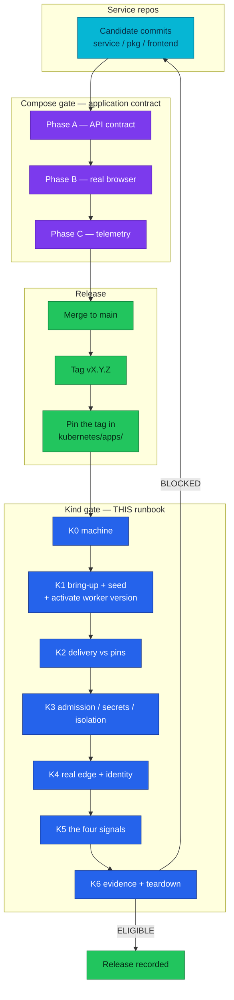

# Kind E2E audit

The cluster gate: the runbook that proves Flux delivered what the manifests
promise, on a Kind cluster built from zero. Twin of
[`local-stack/docs/e2e-audit.md`](../../local-stack/docs/e2e-audit.md) — the
Compose gate — and deliberately **not** a repeat of it.

| Attribute | Value |
|-----------|-------|
| **Applies to** | The Kind cluster `homelab`, brought up from this repository |
| **Complements** | [Compose E2E release audit](../../local-stack/docs/e2e-audit.md). That gate proves the application contract; this one proves delivery, admission, the real edge, and cluster-only telemetry |
| **Execution** | By hand, in `bash`, on a cluster recreated from scratch. macOS + podman and Linux + Docker are both supported — see [K0](#k0--the-machine) |
| **Estimated** | 90–120 minutes, most of it waiting on reconciliation |
| **Evidence** | The block in [K6.1](#k6--evidence-and-teardown), pasted into the pull request or release record |
| **Pass decision** | `ELIGIBLE` only when every row that is not marked *optional* passes |
| **Failure decision** | `BLOCKED` — a Kind failure blocks the homelab pull request even when the Compose candidate passed |

## What this audit is for

The Compose gate already proved the **application contract** — API rows, browser
rows, telemetry rows, and a Playwright suite, all against the same service code.
Repeating that here would cost hours and prove nothing new.

What only a cluster can prove is everything Compose has no equivalent for:

1. **Flux actually delivers** what the manifests promise, in dependency order.
2. **The images running are the images pinned** — Compose builds from a working
   copy and never touches a tag. It also never touches an image *platform*, which
   is how the fleet's amd64-only manifest lists survived every green Compose run
   ([2026-08-20](#2026-08-20--the-arm64-bring-up)).
3. **Admission, secrets and network policy** exist at all.
4. **The real edge** — TLS, Host-header routing, HTTP→HTTPS.
5. **Controller-minted credentials** — the Grafana MCP server consumes a token
   the Grafana Operator writes, which has no Compose analogue at all
   ([K3.6](#k3--admission-secrets-isolation)). 💤 Off since 2026-08-21; the row
   records its last verified pass.
6. **Kubernetes resource attributes** — `k8s.pod.name`, `k8s.namespace.name` and
   the `GrafanaDashboard` reconcile path only exist here.

### Why this file is permanent

Its ancestor was `KIND-E2E-CHECKLIST.md` at the repository root, whose own last
row said "delete this file and close its pull request". That model was the
problem: the Kind gate **recurs**, so every audit re-derived the checklist from
scratch, and the file rotted while it sat in an open pull request. Rows that
name a version number rot fastest, which is why the pin, hostname, dashboard and
Kustomization rows below are **commands that read the answer out of git**, not
tables of numbers. Findings live in [Previous runs](#previous-runs) rather than
dying with the file.

### Where the gate sits



**Legend** — cyan: candidate code. Purple: the Compose gate. Blue: this runbook's
groups. Green: release state. The Kind gate runs on the **pinned** tags, after
the tag exists; running it earlier audits the previous release.

## Preconditions

1. **The tags this audit asserts are already pinned.** `kubernetes/apps/` must
   carry the tags intended for release. Running the audit before the pins move
   audits the previous release and its evidence block is worthless.
2. **The Compose gate passed on the same code.** This runbook assumes the
   application contract is settled; a Compose failure is not something to
   discover here.
3. **Start from no cluster.** `make down` first if one exists. Cumulative
   telemetry and adopted-but-stale Flux objects both make a re-used cluster
   unable to tell "this candidate produced it" from "the last run left it".
4. **Run every shell block in `bash`.** The two zsh traps documented in the
   [Compose gate](../../local-stack/docs/e2e-audit.md) apply verbatim: `USERNAME`
   is a zsh special parameter, so `USERNAME=alice ./keycloak-token.sh` silently
   mints a token for the host account; and zsh does not word-split unquoted
   parameters, so multi-word command handles are passed as one argument.

---

## K0 — The machine

- [ ] **K0.1** A container runtime answers, and `kind` will use it.
  `scripts/kind-up.sh` and `scripts/kind-down.sh` call `docker inspect|run|network
  connect|rm` **unconditionally** — they never probe for a provider — so a podman
  host needs both a `docker` CLI shim and kind's podman provider opted in.

  On **macOS + podman** the full sequence, including two load-bearing kernel
  settings, is [`setup.md` § Prerequisites](setup.md#prerequisites). Read it
  rather than transcribing it; the short version is:

  ```bash
  export KIND_EXPERIMENTAL_PROVIDER=podman
  export DOCKER_HOST="unix://$(podman machine inspect --format '{{.ConnectionInfo.PodmanSocket.Path}}')"
  podman machine ssh 'sudo sysctl -w net.ipv4.ip_unprivileged_port_start=80'
  podman machine ssh 'sudo sysctl -w kernel.keys.maxkeys=20000 kernel.keys.maxbytes=4000000'
  docker info >/dev/null && echo ok
  ```

  **Neither sysctl survives `podman machine stop`.** Re-apply them after every
  VM restart, before `make cluster-up`.
  **FAIL:** `docker info` errors; or the port sysctl is missing and creation dies
  at "Preparing nodes" with `rootlessport cannot expose privileged port 80`; or
  the keyring sysctl is missing and CNPG's `postgres` container crash-loops on
  **exit 128** with `unable to join session keyring: disk quota exceeded` — a
  container-runtime quota wearing a database costume.

- [ ] **K0.2** Bring-up tools present. `make prereqs` checks six:
  `flux kubectl kind helm docker tofu`. `tofu` must be ≥1.11, or export
  `TF_BIN=terraform`. `git` needs an `origin` remote.
  `make prereqs`
  **FAIL:** any `MISS` line.

- [ ] **K0.3** Validation tools present. **`make prereqs` does not check these**
  and `make validate` needs all four:
  `for b in yq kustomize kubeconform curl; do command -v $b >/dev/null && echo "OK $b" || echo "MISS $b"; done`
  Minimums: `yq` ≥4.50, `kustomize` ≥5.8, `kubeconform` ≥0.7.
  **FAIL:** any `MISS`.

- [ ] **K0.4** Host ports 80, 443 and 5050 are free. 80/443 are the kind
  `extraPortMappings` (container 30080/30443); 5050 is the local registry.
  Linux: `ss -ltnp '( sport = :80 or sport = :443 or sport = :5050 )'`.
  macOS: `lsof -nP -iTCP -sTCP:LISTEN | grep -E ':(80|443|5050) '`.
  **FAIL:** anything listening. Rootless Docker cannot bind <1024 at all;
  rootless podman needs K0.1's port sysctl.

- [ ] **K0.5** Egress reaches Docker Hub, `ghcr.io`, `quay.io`, the OpenTofu
  registry, `raw.githubusercontent.com` and `grafana.com`. Every image pulls
  anonymously — there is no `imagePullSecret` anywhere in `kubernetes/`. The last
  two are not incidental: 15 of the 33 `GrafanaDashboard` CRs fetch their JSON by
  `url:` at reconcile time ([K5.7](#k5--the-four-signals)).
  **FAIL:** a proxy that intercepts TLS, or an airgap.

- [ ] **K0.6** Every hostname the edge serves resolves. Do not check a frozen
  list — read it out of the script, which is itself kept in step with
  `kubernetes/infra/configs/envoy-gateway/routes/`:
  ```bash
  sudo scripts/setup-hosts.sh
  getent hosts $(awk '/^HOSTS=\(/,/^\)/' scripts/setup-hosts.sh \
    | grep -oE '[a-z0-9.-]+\.duynh\.me|^  duynh\.me' | tr -d ' ') | wc -l
  # compare with:
  grep -rhoE '^ *- [a-z0-9.-]+\.duynh\.me' kubernetes/infra/configs/envoy-gateway/routes/*.yaml \
    | sed 's/^ *- //' | sort -u | wc -l
  ```
  `getent` does not exist on macOS — use `dscacheutil -q host -a name <host>` or
  a `for h in …; do ping -c1 -W1 $h; done` loop there.
  **Rule:** every hostname in a route's `hostnames:` list must appear in
  `setup-hosts.sh`, and `getent` must answer for all of them. A route hostname
  missing from the script is simply unreachable, with no error pointing at
  either file. The reverse (an entry in the script with no route) is harmless but
  worth noting.
  **FAIL:** a route hostname that does not resolve.

- [ ] **K0.7** Every pinned image carries a leg for **this host's architecture**.
  Compose builds from a working copy for the host's own architecture and never
  consults a published manifest list, so it is structurally unable to catch this;
  a cluster pulls the index. On arm64 the difference is a bring-up versus a fleet
  of `CrashLoopBackOff` / `exec format error` pods that read as application bugs.

  Ask the registry, before there is a cluster or even a container runtime — the
  GHCR manifest API answers anonymously, so no daemon and no `buildx` are needed:
  ```bash
  uname -m   # arm64 / aarch64 -> every pin below must list linux/arm64

  arch_legs() {  # $1 = ghcr.io/duynhlab/<repo>/<image>   $2 = tag
    local repo="${1#ghcr.io/}" tok
    tok=$(curl -s "https://ghcr.io/token?scope=repository:${repo}:pull&service=ghcr.io" | jq -r .token)
    curl -s -H "Authorization: Bearer $tok" \
      -H 'Accept: application/vnd.oci.image.index.v1+json, application/vnd.docker.distribution.manifest.list.v2+json' \
      "https://ghcr.io/v2/${repo}/manifests/$2" \
      | jq -r 'if .manifests then [.manifests[] | select(.platform.architecture != "unknown")
               | "\(.platform.os)/\(.platform.architecture)"] | sort | join(" ")
               else "SINGLE-PLATFORM (not an index)" end'
  }

  # The ten services, straight from the pins (mop renders <name>-service/<name>-service):
  for f in kubernetes/apps/services/*.yaml; do
    n=$(basename "$f" .yaml); t=$(yq '.spec.inputs[0].image_tag' "$f")
    printf '%-16s %-8s %s\n' "$n" "$t" "$(arch_legs ghcr.io/duynhlab/$n-service/$n-service "$t")"
  done
  # The four standalone workloads that carry their own repository + tag:
  for f in kubernetes/apps/frontend-rs.yaml kubernetes/apps/backoffice-rs.yaml \
           kubernetes/apps/mockpay.yaml kubernetes/apps/checkout-worker.yaml; do
    grep -HE 'repository:|  tag:' "$f"
  done   # then run arch_legs on each pair
  # order-worker is NOT in that loop and must not be: it is a WorkerDeployment
  # whose image is one field, not a repository/tag pair. K0.8 reads it with yq.
  # It used to be globbed as order-worker-*.yaml, which since ADR-054 matches
  # nothing -- so the arm64 preflight silently skipped the one workload the
  # 2026-08-20 run found broken.
  ```
  **Want:** `linux/amd64 linux/arm64` on every first-party pin.
  **FAIL:** `SINGLE-PLATFORM`, or a missing `linux/arm64` on an arm64 host — with
  **one expected exception**, below.

- [ ] **K0.8** **Every first-party image the cluster pins has an `arm64` leg —
  including the worker.** This row was an *expected finding* until 2026-08-21:
  `order-service:1.13.2` was amd64-only and could not be re-tagged, because
  re-tagging changes the code behind a determinism-frozen build id. The escape
  hatch was a new build id, which is cheap exactly when the replay corpus says
  the code is compatible — `gen3` was recorded from the P4 code 1.13.2 ran and
  replays green on 2.4.0, so the worker moved to `order-worker-2-4-0.yaml` and
  the gap closed. Assert it rather than assume it:
  ```bash
  for t in $(grep -h 'image_tag:' kubernetes/apps/services/*.yaml | grep -oE '"[0-9.]+"' | tr -d '"'); do echo "$t"; done
  # The worker's tag is NOT in that glob — it lives in the WorkerDeployment, so
  # read it from there rather than hardcoding what this file was last updated with.
  WT=$(yq 'select(.kind == "WorkerDeployment") | .spec.template.spec.containers[0].image' \
       kubernetes/apps/order-worker.yaml | cut -d: -f2)
  arch_legs ghcr.io/duynhlab/order-service/order-service "$WT"   # want amd64 AND arm64
  ```
  **FAIL:** any pinned first-party tag missing `linux/arm64`. On an arm64 node
  that is not a degraded pod — nothing starts at all, and for the worker the
  order saga has no poller.
  **If it is the worker specifically**, a new build is the only correct move — but
  since [ADR-054](../proposals/adr/ADR-054-temporal-worker-controller/) that IS
  editing the pin: the controller derives a fresh build id from the changed pod
  template and rolls the new version in beside the old one. What used to be the
  silent-hang shape (an in-place tag bump stranding pinned workflows) is now the
  supported path, and `kubernetes/apps/order-worker.yaml` is the only file to
  touch.

---

## K1 — Bring-up

- [ ] **K1.1** `make validate` passes on the checked-out revision, before any
  cluster exists. It needs no cluster.
  **FAIL:** any schema or kustomize error.

- [ ] **K1.2** `make up` completes. It is
  **`cluster-up` → `flux-push` → `flux-up`**, in that order, because the
  FluxInstance's sync source `oci://homelab-registry:5000/flux-cluster-sync` must
  exist before the OpenTofu bootstrap runs.
  > `kubernetes/clusters/local/README.md` documents the **opposite** order and
  > several names that no longer exist. It is stale — do not follow it.
  **FAIL:** a non-zero exit; read `scripts/flux-up.sh`'s header before retrying.

- [ ] **K1.3** The cluster is the expected shape: 1 control-plane + 3 workers on
  the `CLUSTER_VERSION` in `scripts/kind-up.sh`, and the registry container is up.
  `kubectl get nodes -o wide && docker ps --filter name=homelab-registry`
  **FAIL:** fewer than 4 nodes, or no registry.

- [ ] **K1.4** **Every** Flux Kustomization reports Ready. Count them rather than
  trusting a number in prose:
  ```bash
  DECLARED=$(grep -h -A2 '^kind: Kustomization$' kubernetes/clusters/local/*.yaml \
             | grep -c '^  name:')
  echo "declared=$DECLARED  expected total=$((DECLARED + 1))   # + flux-system, generated by the FluxInstance"
  flux get kustomizations -A
  kubectl get kustomization -A -o json | jq -r '
    .items[] | select(.status.conditions[]? | select(.type=="Ready" and .status!="True"))
    | "\(.metadata.name): \(.status.conditions[] | select(.type=="Ready") | .message)"'
  ```
  At the time of writing that is **21 declared + `flux-system` = 22**, matching
  [`platform/README.md`](README.md) and `AGENTS.md`. First reconcile takes 5–10
  minutes; `temporal-local` is the long pole at a 20m timeout.
  **FAIL:** any name printed by the last command, or a Ready count below
  `DECLARED + 1`.
  > **Count from `kustomization.yaml`, not from the directory.** Grepping
  > `clusters/local/*.yaml` for `kind: Kustomization` over-counts, because a file
  > can sit on disk without being referenced — `mcp.yaml` has done exactly that
  > since 2026-08-21, when the `- mcp.yaml` entry was commented out and the file
  > kept. On 2026-08-21 the directory grep said **23** while the cluster had
  > **22**, which reads as a missing Kustomization. Derive it from the
  > uncommented `resources:` entries instead:
  > ```bash
  > FILES=$(grep -E '^\s+- [a-z][a-z0-9-]*\.yaml' kubernetes/clusters/local/kustomization.yaml \
  >   | sed 's/^\s*- //;s/ *#.*//')
  > for f in $FILES; do grep -c '^kind: Kustomization' "kubernetes/clusters/local/$f"; done \
  >   | paste -sd+ - | bc     # 21 on 2026-08-21; + flux-system = 22 live
  > ```

- [ ] **K1.5** If and only if `envoy-gateway-config-local` is not Ready, check the
  NodePort collision first — it is the documented failure mode and it looks
  nothing like a traffic problem.
  `kubectl -n envoy-gateway get svc -l gateway.envoyproxy.io/owning-gateway-name=platform -o yaml | grep -A2 nodePort`
  **FAIL signature:** the API server refused to allocate 30080/30443 because
  something else holds them.

- [ ] **K1.6** **Seed demo data.** `scripts/kind-seed.sh` (homelab #836) — the
  cluster has no equivalent of local-stack's eight `command: ["seed"]` one-shot
  services, because seed data is not desired state and Flux would re-run it
  forever, which is why the script lives in `scripts/`, not `kubernetes/apps/`.
  ```bash
  scripts/kind-seed.sh          # all eight; or name a subset
  ```
  It derives **one Job per service from the running Deployment**, so each Job
  inherits the exact image, DB host, user and password `secretKeyRef` the service
  itself uses — a hand-written Job would seed the wrong database while looking
  correct. It makes exactly one deliberate override: `ENV`. The fleet runs with
  `ENV=production` (the ResourceSet sets it fleet-wide) and every seed refuses to
  run there; the Job sets `ENV=development`, and a `kubectl config
  current-context` guard (`kind-*` only) is what keeps that override off a real
  cluster. **Do not remove the guard.**
  Eight services seed: `user product cart order review shipping notification
  inventory`. `payment` and `checkout` have no seed.
  **FAIL:** a non-zero exit. Read the tailed Job logs it prints — a seed that
  fails on an empty database is a migration problem, not a seeding one.
  > **Two things in the worker logs look like defects on a fresh cluster and are
  > not. Both were flagged by a reader during the 2026-08-21 run, which is the
  > point of writing them down.**
  >
  > **`order-worker` logs a burst of `42P01`.** The worker Deployment and the
  > order API's `migrate` init container have no ordering relationship, so the
  > worker starts first and its sweep loops query tables that do not exist yet:
  > ```
  > ERROR: relation "fulfillment_start_requests" does not exist (SQLSTATE 42P01)
  > ERROR: relation "cancellation_requests"      does not exist (SQLSTATE 42P01)
  > ERROR: relation "orders"                     does not exist (SQLSTATE 42P01)
  > caller=sweeploop/sweeploop.go:36  "fulfillment start dispatcher sweep failed"
  > ```
  > Measured on 2026-08-21: the worker pod was **100 seconds older** than the API
  > pod, errors ran for about **2.5 minutes**, and stopped by themselves the
  > moment `migrate` reported `ready=true exit=0` — **0 occurrences in the
  > following 60 seconds**. Confirm it healed rather than assuming it:
  > `kubectl -n order logs <worker> --since=60s | grep -c 42P01` must be `0`.
  > A count that stays non-zero after the API is Ready is a real failure.
  >
  > **`checkout-worker` logs `temporalx: worker versioning off`.** That is
  > correct, and the line means *the caller never asked* — `checkout-service`
  > passes no versioning option to `temporalx.NewWorker`, so no env var is
  > involved in that decision. [ADR-030](../proposals/adr/ADR-030-temporal-workflow-versioning/)
  > scopes Worker Versioning to **the order saga**, and
  > [RFC-0026](../proposals/rfc/RFC-0026/) deliberately left checkout out. Per the
  > SDK, a deployment with no Current version targets unversioned workers, so
  > nothing is stranded. `order-worker` gets its identity from the Worker
  > Controller (`TEMPORAL_DEPLOYMENT_NAME` + `TEMPORAL_WORKER_BUILD_ID`, injected
  > per version), so it prints `worker versioning on` with a build id — see
  > [K1.7](#k1--bring-up). The line would be alarming from `order-worker`; from
  > `checkout-worker` it is the designed state.

  **This row unblocks the rows the 2026-08-17 run could not run at all**:
  [K4.6](#k4--the-real-edge-and-identity), [K4.7](#k4--the-real-edge-and-identity),
  [K5.1](#k5--the-four-signals), [K5.3](#k5--the-four-signals) and
  [K5.7](#k5--the-four-signals) all need real rows in real tables.

- [ ] **K1.7** **Confirm the worker version needs no human.** This row used to be
  *"activate the worker deployment version"*: a fresh cluster was **born** in the
  `OrderSagaNotCompleting` state, because the Temporal database was new, the
  `order-fulfillment` deployment had no Current version, and the SDK is explicit
  that nil Current means *"all unversioned workers are the target"* — of which
  there were none. Every new order was accepted and dispatched nowhere. Fixing it
  meant running a Job by hand on **every** bring-up.
  [ADR-054](../proposals/adr/ADR-054-temporal-worker-controller/) removed that
  step: the Worker Controller registers the version and sets Current itself, so
  activation is desired state reconciled from git. This row now **proves the step
  is unnecessary** rather than performing it.
  Run **no** Job. Read what the controller did:
  ```bash
  kubectl -n order get wd order-fulfillment
  # want: CURRENT populated, TARGET equal to it, RAMP % empty (rollout settled)
  kubectl -n temporal exec deploy/temporal-admintools -- \
    temporal worker deployment describe --namespace mop \
      --address temporal-frontend.temporal.svc.cluster.local:7233 \
      --name order/order-fulfillment
  # NOTE the name: the controller composes <k8s-namespace>/<resource-name>,
  # so it is order/order-fulfillment, not the bare order-fulfillment ADR-030 used.
  kubectl -n order get po -L temporal.io/build-id
  # want: a Ready pod labelled with the CURRENT build id.
  # MORE than one build-id label is NORMAL, not a failure: a version stays up for
  # sunset.scaledownDelay (1h) after the server reports it drained, so a cluster
  # that has rolled once legitimately shows two. Check the extras are accounted for:
  kubectl -n order get wd order-fulfillment -o jsonpath='{range .status.deprecatedVersions[*]}{.buildID}{" drainedSince="}{.drainedSince}{"\n"}{end}'
  ```
  **FAIL:** `CURRENT` empty after the chain is Ready, or **no** pod carrying the
  Current build id, or a build-id label that appears on a pod while being absent
  from both `CURRENT` and `deprecatedVersions` (an orphan the controller is not
  tracking). Both reproduce the old failure mode, which still looks like
  nothing: orders stay `pending`, no error is logged, no activity fails, pods stay
  `Ready`, and the outbox gauges stay green because the workflow *did* start.
  Diagnosis is unchanged —
  [`OrderSagaNotCompleting`](../observability/runbooks/microservices/OrderSagaNotCompleting.md).
  **If this row fails, suspect the controller, not the saga:** check
  `kubectl -n temporal get hr temporal-worker-controller-crds temporal-worker-controller`
  and the manager's logs before touching anything in `order`.

  > **Also asserted by `make e2e-saga GATE=kind`** (SG.4), which reads the same
  > facts over HTTP: the Temporal UI serves a JSON API carrying a deployment's
  > `routingConfig.currentDeploymentVersion.buildId` and a workflow's
  > `versioningInfo`. That comparison is **stronger** than reading the CRD's
  > status — the routing config is what the server actually dispatches on, while
  > the CRD reports what the controller believes it asked for. Keep the `kubectl`
  > form below for diagnosing a disagreement between the two.

- [ ] **K1.8** *(informational)* `make tf-plan` shows a zero diff.
  **FAIL:** a non-empty plan means the bootstrap did not converge.

---

## K2 — GitOps delivered what the manifests promise

This is the largest gap in the repo today: **no command anywhere diffs the
running images against the committed pins.** That is this group's whole job.

The rule, not a table: **for every first-party workload, the running image tag
equals the tag committed for it in `kubernetes/apps/`.** Two workloads take their
tag from another workload's pin, and those couplings are the only thing that
cannot be derived from a single file — they get their own row (K2.3).

- [ ] **K2.1** Read the pins out of git.
  ```bash
  grep -H 'image_tag:' kubernetes/apps/services/*.yaml
  grep -Hn '  tag:' kubernetes/apps/frontend-rs.yaml kubernetes/apps/backoffice-rs.yaml \
                    kubernetes/apps/mockpay.yaml kubernetes/apps/checkout-worker.yaml
  # The worker's pin lives in the WorkerDeployment, as one image field:
  yq 'select(.kind == "WorkerDeployment") | .spec.template.spec.containers[0].image' \
     kubernetes/apps/order-worker.yaml
  ```
  Ten service pins (`kubernetes/apps/services/*.yaml`, one file per service) plus
  five standalone ResourceSets: `frontend-rs` (SPA), `backoffice-rs`
  (`admin-service`), `mockpay`, `checkout-worker`, and one
  `order-worker-<build>.yaml` per live worker version.

- [ ] **K2.2** Read the images actually running, and compare them to K2.1 line by
  line. Write the comparison into the evidence block as `<workload> <pinned> →
  <running> ✓`, one line per workload — 15 lines at the time of writing.
  ```bash
  kubectl get pods -A -o jsonpath='{range .items[*]}{.metadata.namespace}{"\t"}{.spec.containers[*].image}{"\n"}{end}' \
    | grep 'ghcr.io/duynhlab' | sort -u
  ```
  **FAIL:** any workload on a tag other than its pin. A pod stuck on the old tag
  usually means its HelmRelease did not upgrade — check
  `flux get hr -A | grep -v True` before blaming the pin.

- [ ] **K2.3** The coupled pins hold. Nothing in CI enforces either equality, so
  assert both — the commands are verified against the current tree:
  ```bash
  W=kubernetes/apps; S=$W/services
  [ "$(yq '.spec.values.image.tag' $W/checkout-worker.yaml)" = "$(yq '.spec.defaultValues.image_tag' $S/checkout.yaml)" ] \
    && echo "checkout-worker coupled" || echo "SKEW checkout-worker vs checkout"
  [ "$(yq '.spec.values.image.tag' $W/mockpay.yaml)" = "$(yq '.spec.defaultValues.image_tag' $S/payment.yaml)" ] \
    && echo "mockpay coupled" || echo "SKEW mockpay vs payment"
  ```
  - **`checkout-worker` tracks `checkout`.** Same tag, moved together.
  - **`mockpay` tracks `payment`, by hand.** Its `tag:` carries the
    `$imagepolicy` marker for `flux-system:payment:tag`, but nothing enforces the
    equality, so it has skewed before — it sat at 1.5.3 while payment was 2.3.0
    through the 2026-08-17 run. **That skew is now closed** and both moved
    together through the multi-arch re-pin. Treat any future gap as a finding to
    file, not to fix in place.
  - **`order-worker` is re-tagged in place now, and that is the change.** Until
    2026-08-21 it could not be: `order-worker-2-4-0.yaml` pinned
    `order-service:2.4.0` and `scripts/flux-validate.sh`'s
    `validate_worker_build_id` enforced a four-way equality — env `BUILD_ID` ==
    `image.tag` == the build id in the filename == the cutover CronJob's
    `--build-id` — because a bump in place stranded that version's pinned workflows
    with no pollers, and it failed **silently**: no error, no failed activity, just
    orders that never left pending.
    Since [ADR-054](../proposals/adr/ADR-054-temporal-worker-controller/) the
    controller derives the build id from the pod template, so editing the tag in
    `kubernetes/apps/order-worker.yaml` mints a NEW version beside the old one
    rather than replacing it — the stranding shape is gone by construction. There
    is no filename, no CronJob and no env copy left to disagree, so the four-way
    check is retired; `validate_worker_versioning` now asserts what remains
    reachable (no leftover per-build manifests, a resolvable `connectionRef`, no
    hand-set version identity).
    `make validate` covers the equality; assert here that it still ran:
    `./scripts/flux-validate.sh 2>&1 | tail -1   # want "INFO - All validations passed"`
    This freeze is also why the tag is amd64-only — see
    [K0.8](#k0--the-machine).
  **FAIL:** a skew other than a deliberate, recorded one.

- [ ] **K2.4** `auth` is absent — **10** services, not 11. auth-service was
  retired in RFC-0024 P5 and Keycloak replaced it; its cluster surface, database
  triplet and pg_hba rule were all deleted.
  ```bash
  ls kubernetes/apps/services/*.yaml | wc -l      # want 10
  kubectl get ns | grep -c '^auth '               # want 0
  ```
  **FAIL:** an `auth` namespace, Deployment, or database exists.

- [ ] **K2.5** All seven ResourceSets that `apps-local` health-checks are Ready:
  `rs-identity`, `rs-catalog`, `rs-checkout`, `rs-fulfillment`, `rs-comms`,
  `rs-frontend`, `rs-backoffice`.
  `kubectl get resourcesets -A`
  **FAIL:** any not Ready —
  [`application-delivery.md`](application-delivery.md) has the recurring template
  errors and how to read them.

- [ ] **K2.6** Every HelmRelease is Ready.
  `flux get helmreleases -A | grep -v True || echo "all Ready"`

- [ ] **K2.7** *(build-arg contract — cannot be checked with kubectl)* The pinned
  `frontend` and `admin-service` tags were **built** with the cluster's Keycloak
  URL/realm/client baked in. A tag built for Compose loads fine and then talks to
  `localhost` from the operator's browser. Confirm against the CI run that
  produced each tag.
  **FAIL:** K4.6/K4.7 will fail later and the cause will look like a Keycloak
  problem.

---

## K3 — Admission, secrets, isolation

- [ ] **K3.1** Kyverno: the violation set matches the **registered exceptions**.
  Note the assertion carefully — only `disallow-default-namespace` is `Enforce`;
  every other Tier-1 policy is `Audit`, so "no violations" is the wrong thing to
  expect and "it admitted everything" proves little.
  ```bash
  kubectl get clusterpolicyreport -A
  kubectl get policyreport -A -o json | jq -r '
    .items[].results[]? | select(.result=="fail") | "\(.policy)/\(.rule): \(.resources[0].namespace)/\(.resources[0].name)"' | sort | uniq -c
  # the registered set, from git:
  ls kubernetes/infra/configs/kyverno/exceptions/*.yaml | grep -v kustomization
  ```
  There are **two** exceptions: `openbao` (needs `IPC_LOCK` so unsealed secrets
  never swap to disk) and `postgres-operators` (operator-defined securityContext,
  scoped to the namespaces that actually host CNPG Clusters). A third,
  `vector-hostpath`, was **deleted on 2026-08-19** as inert — it targeted
  `monitoring` while Vector runs in `kube-system`, which is baseline-excluded.
  Also note `pss-restricted-apps` is **disabled since 2026-08-17**; the Kind audit
  that disabled it is [recorded below](#2026-08-17--the-first-run).
  **FAIL:** a failing resource not covered by one of the two live exceptions.
  Catalog: [`docs/security/policy-exceptions.md`](../security/policy-exceptions.md).

- [ ] **K3.2** Those exceptions have not expired.
  `grep -rh 'expires-at' kubernetes/infra/configs/kyverno/exceptions/`
  **FAIL:** a date in the past — the exception is live but unowned.

- [ ] **K3.3** OpenBAO self-unsealed and ESO is serving. No manual unseal step
  exists; the bootstrap Job initialises, unseals, seeds, then **revokes root**.
  ```bash
  kubectl -n openbao get pods
  kubectl get clustersecretstore openbao -o jsonpath='{.status.conditions[*].status}{"\n"}'
  kubectl get externalsecrets -A | grep -v SecretSynced || echo "all synced"
  ```
  **FAIL:** a sealed pod, or an ExternalSecret not synced.
  > Do **not** try to fix a missing secret by re-running the Job — it revoked its
  > own root token and a re-run seeds nothing while exiting 0. Use the
  > break-glass procedure in [`docs/secrets/openbao.md`](../secrets/openbao.md).

- [ ] **K3.4** Database isolation holds. `scripts/db-isolation-sweep.sh` is the
  role×database `pg_hba` matrix ADR-015 promised would run "at each bring-up", and
  no document other than this one schedules it.
  `./scripts/db-isolation-sweep.sh`
  Expect **72 rows, all PASS** — 36 per cluster (6 roles x 6 databases), of which
  6 + 7 are `allow`. The row count is itself an assertion: the script fails if it
  parses fewer verdicts than the matrix has pairs, so "PASS" cannot mean "probed
  nothing". Run it with no cluster reachable and it says `FAIL … parsed 0
  verdicts, expected 36`, not `PASS`. Two defects that used to sit on this row were fixed on
  2026-08-21 and should not be re-diagnosed: the arrays carried a retired
  **`auth`** role and database expecting an `allow` that pg_hba no longer has, and
  the script needed **bash 4** for `declare -A` while this machine ships bash 3.2
  — it died before probing anything, with `declare: -A: invalid option`.
  One gap is still open, and it is coverage rather than a failure: the pg_hba
  carries a **`keycloak`** role the matrix does not test. Keycloak connects direct
  to `:5432` because its Agroal pool needs long-lived connections and server-side
  prepared statements (ADR-041). Adding it means deciding its whole allow/reject
  row against every other platform role, so it is its own change — the script
  records the gap in a comment rather than pretending the matrix is complete.
  **FAIL:** any non-zero exit. A `missing` verdict means the script and the
  manifests disagree about which roles exist — fix whichever is wrong in its own
  PR, and do not relax the matrix to make the sweep green.

- [ ] **K3.5** Edge isolation holds — **and read what this row can and cannot
  prove.** `./scripts/edge-isolation-sweep.sh --live`
  **Kind's default CNI is `kindnet`, which ships no NetworkPolicy controller, so
  NetworkPolicy is declared here and NOT enforced.** Measured 2026-08-21: a pod in
  `user` reached `inventory:8080`, which `allow-inventory-protected-http` grants to
  envoy-gateway *only*, in a namespace that also carries `deny-all-ingress`. The
  policies are correct; nothing applies them. The sweep now detects this and marks
  the deny probes `SKIP` rather than reporting them as isolation failures — before
  that it read as `FAIL live: inventory:9090 -> got=open want=closed`, which
  blames the manifests for the CNI's behaviour.
  So: **manifest mode is the only isolation evidence this gate can give.** Do not
  let a green K3.5 be read as "network isolation verified". Getting more requires
  swapping in Calico or Cilium, which is its own change.
  **FAIL:** a non-zero exit — i.e. a manifest-mode gap (a namespace the edge must
  reach with no allow on that port, the blackhole risk) or an allow probe that
  cannot connect. Deny probes cannot fail here, and that is the point of the row.
  The stale-`auth` warning that used to sit on this row is **resolved**:
  `EDGE_ALLOWS` now reads `cart checkout inventory notification order payment
  product review shipping user` on `:8080` plus `identity:8080` (Keycloak, for
  `id.duynh.me` + JWKS), with `EDGE_DENIES="inventory:9090"`. No `auth` entry
  remains. The script runs manifest-grep mode always and probes the cluster with
  `--live`.
  **FAIL:** non-zero exit.

  > **⚠️ `--live` mode is NOT TRUSTWORTHY as of 2026-08-21 — do not read a green
  > from it.** Measured on a settled cluster (all pods 17–19 minutes old, 0
  > restarts, every Service carrying endpoints), two runs a minute apart produced
  > **inverted** failing sets:
  > ```
  > run 1: cart, order, review  -> closed        (8 others open)
  > run 2: those three OPEN; checkout, inventory, notification, payment,
  >        product, shipping, user, identity -> closed
  > ```
  > The original probe was `nc -z -w 3 <ns>.<ns>.svc.cluster.local <port>`, run
  > sequentially for ~13 probes, each paying its own DNS lookup — so it conflated
  > "slower than 3s" with "port closed". Resolving the name once, retrying three
  > times with a 5s budget, and reporting `unresolved` separately (shipped the
  > same day) **reduced but did not remove** the nondeterminism: a following pair
  > of runs gave 12/12 PASS, then 2 spurious failures.
  > **And it cuts both ways, which is the dangerous half.** In one run
  > `inventory:9090` reported `closed` and scored a **PASS** — on kindnet, where
  > NetworkPolicy is not enforced, that port is reachable and the honest result is
  > the `SKIP` banner. A flaky probe that happens to match a deny expectation
  > manufactures evidence of isolation that does not exist.
  > Until this is fixed: treat `--live` as **informational only**. Manifest mode
  > (above) is the isolation evidence, and on kindnet it is the *only* one.

- [ ] **K3.6** **The four MCP servers — 💤 not deployed since 2026-08-21.** The
  owner turned them off: they were unused and the biggest idle consumers on the
  Kind host (`victoria-metrics-mcp` alone held 662Mi). `mcp.yaml` is commented out
  in [`clusters/local/kustomization.yaml`](../../kubernetes/clusters/local/kustomization.yaml),
  along with the `GrafanaServiceAccount` that minted their Grafana token and the
  `routes/mcp.yaml` HTTPRoutes. Re-enable by uncommenting those three lines.
  **Run this row only after re-enabling.** It asserted the four HelmReleases plus
  the platform's first controller-minted credential: the Grafana Operator
  reconciles `GrafanaServiceAccount` (role `Viewer`) and writes a `glsa_…` token
  into `Secret/grafana-mcp-token`, in its own namespace only — which is why both
  the CR and the HelmRelease lived in `monitoring`.
  ```bash
  flux get hr -n monitoring victoria-metrics-mcp victoria-logs-mcp grafana-mcp
  flux get hr -n flux-system flux-operator-mcp
  kubectl -n monitoring get grafanaserviceaccount grafana-mcp
  kubectl -n monitoring get secret grafana-mcp-token \
    -o jsonpath='{.data.token}' | base64 -d | cut -c1-5   # want "glsa_"
  ```
  **FAIL:** a HelmRelease not Ready, or a missing/empty `grafana-mcp-token`. A
  missing token is a *controller* failure, not a secrets-store failure — ESO and
  OpenBAO are not in this path at all, so K3.3 passing tells you nothing about
  it. Note `expires` is deliberately unset: an expiring token is deleted and
  recreated by the operator, while the consumer reads it through env
  `secretKeyRef`, which does not hot-reload.
  > **Verified PASS on 2026-08-21, immediately before being switched off** — the
  > row was run first precisely so turning MCP off would not erase the evidence:
  > all four HelmReleases Ready (`grafana-mcp` 0.20.0, `victoria-logs-mcp` 0.1.0,
  > `victoria-metrics-mcp` 0.3.0, `flux-operator-mcp` 0.58.1),
  > `GrafanaServiceAccount/grafana-mcp` present, and the token's first five
  > characters were `glsa_`.
  Reachability through the edge is [K4.9](#k4--the-real-edge-and-identity), also
  not runnable while this is off.
  Reference: [`mcp-servers.md`](mcp-servers.md).

---

## K4 — The real edge and identity

> **Run these rows with one command.** `make e2e-smoke GATE=kind` asserts
> **K4.1–K4.5, K4.5s and K4.8** and prints a PASS/FAIL table per row — paste that
> table as the evidence for them ([ADR-056](../proposals/adr/ADR-056-k6-e2e-assertion-layer/),
> [`docs/testing/k6.md`](../testing/k6.md)). The `curl` in each row below stays as
> the **diagnostic** for a row the suite reports as failing: it shows the single
> request in isolation, which is what you want in your hand when you are working
> out why. What it is no longer is the gate — a status code read by eye cannot
> fail a release, and one of these rows had been unpassable for weeks without
> anyone noticing (see K4.3).

Compose reached everything on a fixed localhost port. The cluster reaches nothing
that way. Translation table:

| Compose | Cluster |
|---|---|
| edge `:8080` | `https://gateway.duynh.me` |
| Keycloak `:8081` | `https://id.duynh.me` |
| storefront `:3001` | `https://local.duynh.me` |
| portal `:3009` | `https://backoffice.duynh.me` |
| Grafana `:3002` | `https://grafana.duynh.me` |
| VictoriaMetrics `:8428` | `https://vmui.duynh.me` |
| VictoriaLogs `:9428` | `https://logs.duynh.me` |
| VictoriaTraces `:10428` | `https://victoriatraces.duynh.me` |
| Pyroscope `:4040` | `https://pyroscope.duynh.me` |
| vmalert `:8880` | `https://vmalert.duynh.me` — **service port is 8080** |
| Temporal UI | `https://temporal.duynh.me` |
| — | ~~`https://vm-mcp.duynh.me`, `vl-mcp`, `flux-mcp`, `grafana-mcp`~~ — 💤 MCP off since 2026-08-21, routes commented out ([K4.9](#k4--the-real-edge-and-identity)) |
| — | `karma`, `slo`, `source`, `ui`, `openbao` (platform UIs). `jaeger` and `tempo` were removed with their backends ([RFC-0027](../proposals/rfc/RFC-0027/README.md)) |
| vmagent `:8429` | **no route** → `kubectl port-forward -n monitoring svc/vmagent-victoria-metrics 8429:8429` |
| ClickHouse `:8123` | **no route, by design** → `kubectl port-forward -n monitoring svc/clickhouse-clickhouse 8123:8123` |

The authoritative list is `kubernetes/infra/configs/envoy-gateway/routes/*.yaml`
(K0.6 reads it). Three cluster-only facts, each its own row because each silently
breaks a command copied from the Compose audit:

- [ ] **K4.1** Plain HTTP is redirected, not served. Asserted as **K4.1** by
  `make e2e-smoke GATE=kind`.
  **Want 301.** A body here means the redirect route is missing.

- [ ] **K4.2** TLS is the self-signed `homelab-ca`, so **every** `curl` needs `-k`
  (or `--cacert`). Kind has no Cloudflare token, so `platform-edge-tls` is patched
  to the local issuer. Asserted as **K4.2**.
  **FAIL:** a certificate error even trusting the CA, or an empty body. After K1.6
  this should return seeded products, not `[]`.

- [ ] **K4.3** Routing is by **Host header**, not by whatever answers the socket.
  Asserted as **K4.3** — a valid SNI carrying a Host no HTTPRoute claims.
  **Want 404** — the request was routed, and the routing layer found no route for
  that Host. A 200 would mean a route is bound too widely.
  > **This row could not pass as written until 2026-08-22.** It drove
  > `https://127.0.0.1/product/v1/public/products` and wanted 404. That request
  > never reaches HTTP: SNI may not carry an IP literal, so no TLS filter chain
  > matches and Envoy drops the connection — `curl` reports exit **35** and
  > `http_code` **000**, and k6 an EOF. The intent was right and the mechanism
  > was not; reaching the real listener with a valid SNI and an unclaimed Host
  > tests the same thing and can actually pass. Found by porting the row to k6,
  > which is the argument for porting rows.

- [ ] **K4.4** Both realms exist and are the ones from git
  (`kubernetes/infra/controllers/keycloak/configmap-realm.yaml`). Asserted as
  **K4.4** — each realm answers 200 and names itself.
  **FAIL:** a 404 → the ConfigMap did not mount, or the realm import did not run.
  The import is one-shot; a failed import needs a rebuild, not a retry.

- [ ] **K4.5** A customer token mints through the realm. There is **no password
  grant** — Direct Access Grants are disabled on both realms' SPA clients, so the
  helper does the Authorization-Code + PKCE dance with a cookie jar.
  **The cluster serves Keycloak over HTTPS with the self-signed `homelab-ca`, and
  `curl` will not verify it out of the box.** Without `KC_CACERT` or
  `KC_INSECURE` the very first request fails and the whole flow dies before a code
  is ever issued — and the failure used to read as a passing test. Both knobs are
  in `local-stack/scripts/keycloak-token.sh`; every invocation below sets one.
  ```bash
  KCT="local-stack/scripts/keycloak-token.sh"
  KC_URL=https://id.duynh.me KC_INSECURE=1 USERNAME=alice PASSWORD=password123 $KCT
  # Preferred — verify against the CA instead of skipping verification. Take the
  # CA from the cluster, NOT from git:
  #   CA=/tmp/homelab-ca.crt
  #   kubectl -n cert-manager get secret homelab-ca-secret \
  #     -o jsonpath='{.data.tls\.crt}' | base64 -d > $CA
  #   KC_URL=https://id.duynh.me KC_CACERT=$CA USERNAME=alice PASSWORD=password123 $KCT
  # (the live copy is Secret/homelab-ca-secret in cert-manager, distributed to
  #  labelled namespaces as ConfigMap/homelab-ca-bundle by trust-manager)
  ```
  > **The committed CA cannot validate a fresh cluster, and the runbook used to
  > say the opposite** ("the root is committed on purpose, so this needs no
  > cluster access"). cert-manager mints a **new self-signed CA on every
  > bring-up**: on 2026-08-21 the copy in
  > `configs/cert-manager/ca-source/homelab-ca.crt` carried serial
  > `6AF504AB…` dated 2026-05-05, while the cluster served `57B2C1F3…` issued
  > 05:04 that morning — `make up` time. Both paths were tried: the committed
  > file fails with `SSL certificate problem: unable to get local issuer
  > certificate` before a code is ever issued; the live Secret returns a token.
  > Only `KC_INSECURE=1` or the live CA works, and the live CA needs cluster
  > access — so the "no cluster access" claim was the wrong half to keep.

  `KC_URL` must be the origin the token's `iss` should carry — Keycloak derives
  `iss` from the request host and the edge SecurityPolicy pins the issuer exactly.
  `KC_REDIRECT` defaults to `http://localhost:3001/` for local-stack; if the
  cluster realm's `customer-spa` does not list that URI, pass the cluster's
  (`KC_REDIRECT=https://local.duynh.me/`) or the code exchange is refused.
  **FAIL:** empty output. Check `id.duynh.me` resolves (K0.6) before anything
  else, then that a TLS knob is set.

- [ ] **K4.5s A staff token mints through the workforce realm.** The audit had no
  staff mint anywhere — K4.7 exercised staff identity in a browser only — so
  nothing here could reach a `/protected/` route, and the surface went unverified
  on every cluster run. Asserted as **K4.5s** — different realm, different
  client, different redirect from K4.5, all three handled by the suite.
  **Want 200** with real rows. The hand-driven form is in
  [Diagnostics](#diagnostics), and it must run under `bash`, not zsh: zsh sets
  `USERNAME` itself to the OS user, so the assignment is ignored and the script
  logs in as whoever is at the keyboard. The suite mints in-process and does not
  have that problem.
  **FAIL:** `503 Authentication temporarily unavailable` means the service's
  staff JWKS is unreachable, not that identity is down — see
  [`api.md` § protected surfaces](../api/api.md). That was the state of all six
  `/protected/` services until 2026-08-22: the staff JWKS URL was left implicit,
  so each derived it from the public issuer and hairpinned to `127.0.0.1`.

- [ ] **K4.6** **The storefront signs in end to end** at `https://local.duynh.me`
  as `alice` / `password123`, in a browser, and the catalog shows **seeded
  products** — not an empty grid. Run it with the **agent-browser** skill (read it
  from the agent IDE, then `agent-browser skills get core`), the same tool the
  Compose gate's Phase B uses.
  This is not a re-run of Compose Phase B. Compose proved the SPA works against
  services on localhost; what only the cluster can prove is the SPA talking to the
  **real edge** over **self-signed TLS** with an `iss` derived from
  `id.duynh.me` — the exact combination K2.7's build args decide.
  **FAIL:** `invalid_redirect_uri` → the realm's `redirectUris` do not list the
  cluster origin, and the realm import cannot be fixed in place. Rebuild.
  An empty catalog after K1.6 passed is a routing or CORS problem, not a seeding
  one.
  > The storefront's route layout moves between frontend majors. Read the pinned
  > tag's release notes rather than assuming `/` or `/products` is the grid.

- [ ] **K4.7** **The Backoffice portal signs in** at
  `https://backoffice.duynh.me` as the staff operator (`duyne`), lands on the
  shell, and its dashboard cards show **numerals from seeded data** rather than
  zeros or skeletons. Staff identity is the **`duynhlab-staff`** realm (ADR-050),
  a different realm from K4.5's.
  **FAIL:** landing on `/forbidden` is a role problem (the token lacks
  `backoffice_admin`), not a sign-in problem — read which one before reporting.
  Cards stuck at zero after K1.6 passed means the portal is reaching the edge but
  the aggregate routes are not wired.

- [ ] **K4.8** The realm fence holds at the edge. A **customer** token on a
  `/protected/` route dies as wrong-issuer before any service role logic —
  `/protected/` rides `jwt-edge-staff` (staff issuer). Asserted as **K4.8**.
  **Want 401.** A 403 means the edge let it through and a service rejected it —
  weaker than the contract, and a finding.

- [ ] **K4.11 The edge rate limiter holds, in both directions.** Added
  2026-08-22. This audit had never mentioned rate limiting at all, and the gap
  mattered more here than on compose: the compose edge allows 50/s and tells you
  a 429 is a finding, while this one was configured at **2/Second per instance**
  — roughly 4/s across two replicas, shared by every client, identity and route,
  because the catch-all rule has no client dimension. A single page fanning out
  parallel calls could exhaust it and see its own 429, and no row would have
  caught that.
  ```bash
  make e2e-ratelimit GATE=kind
  ```
  **Want:** nothing limited below the ceiling, and above it a **429** carrying
  `X-RateLimit-Limit`, `-Remaining` and `-Reset` (draft-03) so a client can back
  off correctly. The ceiling was raised to **25/Second** per instance (~50/s
  fleet-wide, matching compose) on 2026-08-22 — see
  [ADR-045 § History](../proposals/adr/ADR-045-local-first-edge-rate-limiting/#history).
  **FAIL:** limited *below* the ceiling means `btp-api.yaml` and
  `scripts/k6/lib/config.js` disagree about the number. Never limited *above* it
  means the policy is not attached to the route — the limiter is absent, not fast.
  > A second rule cannot be used to exempt a caller: Envoy Gateway applies every
  > matching rule and rejects if any triggers, so `clientSelectors` can only ever
  > make a subset stricter. Raising the ceiling means changing the number.

- [ ] **K4.9** **💤 Not runnable since 2026-08-21 — MCP is off** (see
  [K3.6](#k3--admission-secrets-isolation); the HTTPRoutes are commented out too,
  so these hostnames have no route at all). All four MCP servers answer **through
  their gateway hostname**.
  ```bash
  for h in vm-mcp vl-mcp flux-mcp grafana-mcp; do
    printf '%-12s ' "$h"
    curl -sk -o /dev/null -w '%{http_code}\n' "https://$h.duynh.me/mcp"
  done
  ```
  A 405/406/400 on a bare GET is fine — these are Streamable-HTTP endpoints, not
  browsable pages; what matters is that the edge routed to a live backend rather
  than answering 404 (no route) or 503 (no endpoints).
  **FAIL:** 404, 503, or a connection error. **A 403 from `grafana-mcp`
  specifically is its own signature:** `mcp-grafana` validates the `Host` header
  on every route and defaults to localhost only, so the gateway hostname must
  appear in **both** `--allowed-hosts` (in
  `controllers/mcp/grafana-mcp.yaml`) and the HTTPRoute's `hostnames:` — those two
  lists are kept in step by hand and drift silently. The servers also sit behind
  the `admin-cidr-internal` SecurityPolicy (deny by default, private CIDRs only),
  so a 403 from *outside* a private CIDR is the policy working.

- [ ] **K4.10** **An order completes, and nobody touched anything to make it.**
  Added 2026-08-22 with [ADR-054](../proposals/adr/ADR-054-temporal-worker-controller/).
  Until then **no row in this audit confirmed an order** — K4.6 signed in and looked at
  a catalog, and K5's preamble opened a checkout session without confirming it. So the
  whole gate could go green while the order saga had never run on a cluster, which is
  precisely what the Worker Controller changed and therefore what is most worth proving.
  The Compose audit has this as A10; the cluster had nothing.
  Asserted as **SG.1–SG.4** by `make e2e-saga GATE=kind`, which needs no
  `kubectl` at all — see the note below. The hand-driven form is in
  [Diagnostics](#diagnostics).
  **Want:** `Status COMPLETED`, and the versioning block showing `Behavior Pinned`
  with `DeploymentName` **`order/order-fulfillment`** and a `BuildId` equal to the
  `CURRENT` that [K1.7](#k1--bring-up) read. That build id is the controller's derived
  value — not the image tag, and written down nowhere in git.
  **FAIL, and what each shape means:**
  - Order stuck `pending`, workflow `Running` with no progress → the old K1.7 failure
    is back. Read `kubectl -n order get wd order-fulfillment` for an empty `CURRENT`
    before suspecting the saga.
  - `Behavior` absent, or `DeploymentName` the bare `order-fulfillment` → the pod is
    polling unversioned. The worker log settles it: `worker versioning off` means the
    identity never reached the process.
  - A 5xx at `confirm` is an application failure, not a versioning one — that is what
    `OrderSagaNotCompleting` and K5 are for. Do not re-derive it here.
  > **Run no Job before this row.** The point is not that an order *can* complete —
  > Compose already proves that — but that it completes on a cluster built from zero
  > with no human step in between. Running the retired activation Job "just in case"
  > destroys the only evidence this row exists to collect.

  > **Now a single command: `make e2e-saga GATE=kind`.** It arms stock through the
  > staff receipt endpoint, drives the funnel, then polls the Temporal UI's JSON
  > API until the workflow is terminal and asserts `COMPLETED`, `Pinned`, the
  > composed `DeploymentName`, a build id equal to the deployment's **Current**,
  > and no half-finished ramp — SG.1 through SG.4, no `kubectl exec` anywhere.
  > Arming the stock is not incidental: a single SKU carries finite seeded stock,
  > so a repeated run eventually meets `insufficient stock to reserve` and the
  > saga fails, correctly refusing to oversell. Unarmed, this row would decay run
  > over run and read as a broken saga. The commands above remain the diagnostic
  > for a run the suite reports as failing.

---

## K5 — The four signals

> **K5.2, K5.6 and K5.8 are asserted by `make e2e-smoke GATE=kind`** together
> with the K4 rows. The suite drives its own traffic first and waits for the
> spans to land, which is a step this section used to leave to the reader: a
> coverage row reads a store that lags the traffic, and `review` in particular is
> only reachable through product's fan-out, so a run that lists products leaves
> it with no span and the row fails for a reason that has nothing to do with
> telemetry.

The Compose audit's Phase C, re-pointed at the cluster. Local patches the edge
`samplingRate` to **100**, so trace results here are deterministic.

Drive some traffic first, and tag it so later rows can find one request. **This
preamble is only needed for the rows that are still hand-run** — K5.1 reads
ClickHouse through a port-forward and needs a tagged request to look for.
`make e2e-smoke GATE=kind` drives its own traffic and waits for it to land, so
K5.2-K5.9 do not depend on what you type here.
```bash
TAG=$(date +%s)
curl -sk -o /dev/null "https://gateway.duynh.me/product/v1/public/products?audit=$TAG"
# One public GET is NOT enough. It reaches product and nothing else, which
# leaves inventory, checkout and the east-west gRPC legs cold -- and a cold
# service is indistinguishable from an uninstrumented one, because OTel only
# materialises a series after the first call. Drive a real checkout session too:
# it is the cheapest call that exercises gRPC, and it is what K5.5's rpc_* leg
# and K5.2's coverage list actually depend on.
CA=/tmp/homelab-ca.crt
kubectl -n cert-manager get secret homelab-ca-secret -o jsonpath='{.data.tls\.crt}' | base64 -d > $CA
TOK=$(KC_URL=https://id.duynh.me KC_CACERT=$CA KC_REDIRECT=https://local.duynh.me/ \
      USERNAME=alice PASSWORD=password123 local-stack/scripts/keycloak-token.sh | tail -1)
curl -sk -X POST "https://gateway.duynh.me/checkout/v1/private/checkout/sessions" \
  -H "Authorization: Bearer $TOK" -H 'Content-Type: application/json' -d '{}'
sleep 45   # OTLP export is 15s; give the collector and the stores a flush
```
> Measured on 2026-08-21: before the checkout call,
> `rpc_server_call_duration_seconds_count{service_name="inventory"}` returned
> **NO SERIES** and `inventory` was **absent** from the trace service list. After
> one session: `= 1`, and `inventory`, `checkout` and `checkout-worker` all
> appeared. The row had looked like a missing-instrumentation defect for two
> audits; it was a cold service.

- [ ] **K5.1 Traces — the edge is the root and the chain is unbroken.**
  Port-forward ClickHouse (no route, by design), then:
  ```sql
  SELECT ServiceName, SpanName, SpanKind, ParentSpanId != '' AS has_parent
  FROM otel.otel_traces
  WHERE TraceId = (SELECT TraceId FROM otel.otel_traces
                   WHERE SpanAttributes['http.url'] LIKE '%audit=<TAG>%' LIMIT 1)
  ORDER BY Timestamp FORMAT PrettyCompact
  ```
  **Want:** the edge's `ingress` with `has_parent = 0` first, then the service's
  Server span with `has_parent = 1`.
  **FAIL:** two roots, or a service Server span with no parent — propagation is
  broken. This is a **cluster-only** assertion: the edge span comes from Envoy
  Gateway's own OTLP exporter with W3C + ParentBased sampling, a component
  local-stack runs standalone and configures differently.

- [ ] **K5.2 Traces — coverage.** All 10 services plus the edge appear with
  `server_spans > 0`; `auth` is absent. Asserted as **K5.2**, which also drives
  the traffic first: `review` is only reachable through product's fan-out, so a
  run that never calls it leaves it with no span and the row fails for a reason
  that has nothing to do with telemetry.

- [ ] **K5.3 Logs — both legs, and correlation.** The OTLP leg is the services'
  own tee; the Vector leg carries containers with no SDK.
  Asserted as **K5.3** — both counts must be non-zero.
  **FAIL:** both empty at once is **one** failure (the Vector leg), not two. Vector
  runs as a DaemonSet in `kube-system` and has no Compose twin at all, so this row
  is the only place it is exercised.
  > **The Vector-leg query was wrong twice over until 2026-08-21, and each error
  > alone made the row unpassable.** It selected `_stream:{service="gateway"}`,
  > but Vector sets `service` from `pod_labels.app` and falls back to the **pod
  > name** — there has never been a `gateway` value to match; select the stream by
  > `namespace` + `container_name`, which survive pod churn. And it filtered on
  > `upstream_cluster` / `route_name` as **fields** while Vector left the access
  > log as an unparsed JSON string in `_msg`, so the field predicates matched
  > nothing even once the right pods were selected. Both are fixed (#850 and the
  > PR carrying this note); the failure mode to remember is that a row can be
  > written so that it cannot pass, and reads exactly like a broken platform.
  > Note also **which pod** must appear. Envoy Gateway runs two deployments: the
  > control plane (`envoy-gateway-*`, tab-separated text) and the data plane
  > (`envoy-envoy-gateway-platform-*`, the JSON access log). Only the second
  > carries this evidence, and on Kind it is pinned to the **control-plane node**
  > by `clusters/local/envoy-gateway-config.yaml` — so Vector needs its
  > control-plane toleration (#850) or the row fails while the control plane's own
  > logs arrive normally and make the namespace look healthy.

- [ ] **K5.4 Metrics — worker telemetry identity (regression check).**
  Two series, different `k8s_pod_name`, for the API and the worker:
  Asserted as **K5.4**.
  **Want:** `order`, `order-worker`, `checkout` and `checkout-worker` each present
  as **separate** `service_name` values, each with count **≥ 1**.
  `order-worker` above 1 is expected whenever a version is inside its
  `sunset.scaledownDelay` window — two versions of one worker are two processes with
  one `service_name`, which is the very thing `service_version` exists to split:
  — and the suite asserts that split too, so a second version inside its sunset
  window reads as two `service_version` values rather than as a duplicate.
  **FAIL:** a worker missing entirely, or an `order-worker` series whose
  `service_version` matches neither `CURRENT` nor an entry in
  `status.deprecatedVersions` — that is a real collision, not a drain.
  > **This row used to be the reason the audit existed, and its premise turned out
  > to be false.** On Compose, `order` and `order-worker` published under an
  > identical identity and overwrote each other's series — an alternating value
  > (`78 84 84 78 78 84…`) against a steady single-process service. VictoriaMetrics
  > promotes only `service.name, service.version, k8s.namespace.name,
  > k8s.pod.name, deployment.environment.name`, and Compose set no k8s attribute.
  > The 2026-08-17 run settled it: **there is no collision on the cluster**, and
  > not because `k8s.pod.name` disambiguates, but because `service.name` already
  > differs — the order worker's manifest (then `order-worker-2-4-0.yaml`, now the
  > `WorkerDeployment` in `order-worker.yaml`) and
  > `checkout-worker.yaml` set `OTEL_SERVICE_NAME: order-worker` /
  > `checkout-worker` (and `service.instance.id` in
  > `OTEL_RESOURCE_ATTRIBUTES` besides). The collision was Compose-only, rooted in
  > two `compose.yaml` lines that gave each worker its service's
  > `OTEL_SERVICE_NAME`. `docs/api/metrics.md` is correct for the cluster, and the
  > fix once proposed here — `service.instance.id` in `obsx` plus adding it to
  > VM's `promoteResourceAttributes` — is **not needed**. Fixed in #794. What
  > remains is this cheap regression check.

- [ ] **K5.5 Metrics — the legs that fail independently.**
  Asserted as **K5.5** — one check per leg, so a dead exporter names itself
  instead of hiding behind three healthy ones.
  Four legs: app HTTP semconv (OTLP ingest), app gRPC semconv, the Temporal SDK,
  and the edge's own Envoy stats.
  > **The Temporal leg named a series that does not exist until 2026-08-21.** The
  > query asked for `temporal_workflow_endtoend_latency_seconds_bucket`; the Go
  > SDK emits `temporal_workflow_endtoend_latency_bucket` — **no `_seconds`**. It
  > therefore reported `NO SERIES` on every run, indistinguishable from a dead
  > SDK exporter. The correct name has 40 series on a seeded cluster. This is the
  > same failure class the `VERIFY-AT-KIND` convention exists for: an expression
  > that names a missing series loads cleanly and is silent forever. `inventory` is gRPC-only with no edge route, so
  its `rpc_*` count is the only metrics evidence it is instrumented at all.
  **The spanmetrics leg is live on the cluster now.**
  [ADR-057](../proposals/adr/ADR-057-span-metrics-in-collector/) added the
  `span_metrics` **connector** to `otel-collector.yaml`, so
  `spanmetrics_calls_total` and `spanmetrics_duration_milliseconds_*` are real
  cluster series — measured at 421 series / 5473 buckets on a seeded Kind run.
  This replaced Tempo's metrics-generator, which went away with Tempo
  ([RFC-0027](../proposals/rfc/RFC-0027/README.md)); the old note here said the
  connector existed "only in `local-stack/compose.yaml`", which is no longer true.
  Assert the series directly — but check the dashboard side before adding a
  *dashboard* row: `red-spanmetrics` and `otel-collector-health` are still
  local-stack-only boards.

- [ ] **K5.6 Profiles.** Pyroscope carries all 10 services; `auth` is absent.
  Asserted as **K5.6** (Connect-RPC `LabelValues` over a one-hour window).

- [ ] **K5.7 Dashboards resolve, not merely load.** The cluster's dashboards are
  **`GrafanaDashboard` CRs** from
  `kubernetes/infra/configs/observability/grafana/dashboards/`, reconciled by the
  Grafana Operator — a delivery path Compose does not have. Three assertions, in
  order:

  1. **Every CR reconciled.** Derive the expected count from git rather than
     writing a number here:
     ```bash
     D=kubernetes/infra/configs/observability/grafana/dashboards
     grep -h -c '^kind: GrafanaDashboard' $D/*.yaml | paste -sd+ - | bc   # 33 at time of writing
     # ...plus any chart-provisioned CR. Kyverno's chart renders its own
     # (`grafana.grafanaDashboard.create`), so the cluster holds 34 while git
     # holds 33 — the git figure is a floor, not the expected total.
     kubectl -n monitoring get grafanadashboards
     kubectl -n monitoring get grafanadashboards -o json | jq -r '
       .items[] | select((.status.conditions[]? | select(.type=="DashboardSynchronized") | .status) != "True")
       | "\(.metadata.name): \(.status.conditions[] | select(.type=="DashboardSynchronized") | .message)"'
     ```
     **FAIL:** any CR named by the last command.
     > **That command named nothing until 2026-08-21, and could not have.** It
     > filtered on `.type=="DashboardSynced"`; the Grafana Operator emits
     > **`DashboardSynchronized`**. Checked across every CR on the cluster, the
     > only condition type that exists is the longer name — so the query matched
     > no element, printed nothing, and read as a clean pass on every previous
     > run. It is now the correct type, and with it the cluster reports
     > **34/34 synchronized**.

  2. **The `url:`-sourced CRs actually fetched.** Of the 33, **18 use
     `configMapRef`** (JSON committed here) and **15 use `url:`** — they have no
     local JSON at all and fetch at reconcile time. Twelve of those 15 are
     effectively unpinned: seven `@main` on `duynhlab/grafana-dashboards`, two
     `@main` on `fluxcd/flux2-monitoring-example`, and three grafana.com
     `revisions/latest` (`slo-overview`, `slo-detailed`, `vector`). Only the three
     VictoriaMetrics boards pin a numbered revision. A fetch failure or a silent
     upstream edit is a cluster-only failure mode with no Compose twin, and it
     surfaces as a **missing** dashboard rather than a broken one — so it is
     invisible to assertion 3.
     ```bash
     grep -l '    url:' $D/*.yaml | wc -l   # the url-sourced files, from git
     kubectl -n monitoring get grafanadashboards -o json \
       | jq -r '.items[] | select(.spec.url) | .metadata.name'
     ```
     Cross-check every name that command prints against `/api/search` below; a CR
     that reconciled but fetched nothing still reports Ready.
     Precedent for the fix when one of these bites: the `temporal-workflows` board
     was **vendored in-repo** precisely because a runtime URL fetch from a source
     that went deprecated had made it unauditable
     (`grafana-dashboard-temporal.yaml`, `kustomization.yaml`).

  3. **Every datasource reference resolves.** A dashboard whose panels name
     `${DS_PROMETHEUS}` without declaring it, or a `"uid"` no datasource carries,
     returns **HTTP 200** and then renders `Datasource … was not found` on **every
     panel** — an error banner, never "No data".
     Asserted as **K5.7** by `make e2e-smoke GATE=kind`, which enumerates the uid
     list from `/api/search` rather than a literal — the cluster's set comes from
     operator CRs and differs from local-stack's. It counts a datasource **name**
     as a legal reference too: older boards write `"uid": "VictoriaMetrics"`,
     which Grafana resolves, and a uid-only view reports those as broken.

     > **OPEN FINDING, 2026-08-22 — three boards carry references that resolve
     > to nothing**, and this row had never actually been run on a cluster, which
     > is why nobody knew. On a 41-dashboard cluster: `flux-cluster` and
     > `cloudnative-pg` both hard-code `"uid": "prometheus"` in panels while
     > declaring a `DS_PROMETHEUS` variable, and no datasource carries that uid
     > or that name; `_hAsuzBnz` names `y-Ka8y37k`, an upstream uid that came
     > with a vendored board. Their panels render `Datasource … was not found`
     > while the dashboard answers 200 — exactly the failure this assertion
     > exists to catch. **The row is expected to fail until they are fixed**; do
     > not weaken the assertion to make the gate green. Note also the count: this
     > section says 34 CRs while the cluster serves 41 boards, so the chart- and
     > operator-provisioned extras need reconciling with assertion (1).
     **Cluster-specific note:** five committed JSONs (`clickhouse-server-engine`,
     `cutover-baseline`, `inventory`, `eg-edge`, `keycloak-identity`) carry an
     `__inputs` block instead of declaring the variable in `templating.list`, and
     rely on the CR's `spec.datasources[].inputName` → `datasourceName` mapping to
     substitute it at import. Their safety depends entirely on the operator
     honouring that mapping — so a CR that loses its `datasources:` block
     reproduces the failure with a green 200. The four vendored
     `envoy-gateway/*.json` boards are the inverse: no `__inputs`, so their CRs
     carry no `datasources:` block and they self-resolve via `templating.list`.
     **`clickhouse-server-engine` is dual-target, and both earlier readings of it
     were wrong.** 21 expressions read `chi_*` (the Altinity metrics-exporter's
     view of the CHI) and 18 read the engine's own `ClickHouseMetrics_*` /
     `ClickHouseProfileEvents_*` families. The original checklist called the
     `chi_*` panels "empty by design, because nothing here runs that operator" —
     false, the Altinity operator *is* deployed. The correction that replaced it
     then predicted empty `chi_*` panels as the likely finding — **also false.**
     Measured 2026-08-21: **914 `chi_*` series present**, and **zero**
     `ClickHouse*` series. So the exporter half populates and the engine-native
     half is the empty one, which is the opposite of what was written down. The
     engine's own Prometheus endpoint is not scraped at all; those 18 panels stay
     blank until something scrapes it, and the alert expressions that name
     `chi_*` families are the ones worth tuning — see
     [K5.10](#k5--the-four-signals).

- [ ] **K5.8 Alert rules loaded, none firing wrongly.** Group the firing set by
  `severity` — the name alone cannot tell you which of two Sloth variants fired:
  Asserted as **K5.8**, which prints the firing `page`/`critical` names on
  failure so the group-by is not needed by hand.
  **Do not** assert a total count:
  [`alert-catalog.md`](../observability/alerting/alert-catalog.md) marks a subset
  **inactive on Kind** for platform reasons.
  **Want:** rules loaded (800 across 195 groups on 2026-08-21), **no `page` and
  no `critical` firing**, and `Watchdog` **present** — it is the dead-man's
  switch, so its absence is the failure, not its presence.
  **Expected on Kind, not a finding:**
  - Sloth **`severity: ticket`** alerts (the slow-burn variants, 2h/1d and 6h/3d
    windows) firing while the cluster is younger than the window. On 2026-08-21 a
    cluster **1h51m** old had `CheckoutHighLatency`, `KeycloakLoginHighErrorRate`
    and `ReviewHighOverallErrorRate` firing on `ticket` while **every** matching
    `page` variant stayed `inactive` — the shortest ticket window (2h) already
    exceeded the cluster's lifetime, so a couple of client-side 400s dominate the
    ratio. `ReviewHighOverallErrorRate` fired on exactly **two** `400`s.
  - kube-level rows such as `KubePodCPUThrottlingHigh`, which fires on
    `kube-system/kindnet-*` at ~100% throttling. kindnet is Kind's own CNI and
    nothing in this repo sets its limits. Record it and move on.
  - **After running `make e2e-load`**, expect `InventoryGrpcHighErrorRate` on
    `page`. Sustained order load exhausts a SKU's seeded stock, inventory then
    answers `FailedPrecondition: insufficient stock to reserve`, and the saga
    fails — which is inventory *working*, refusing to oversell. The alert counts
    that business rejection as a gRPC error, so a correct refusal inflates an
    error-rate SLO. Worth a decision of its own (should `FailedPrecondition` be
    excluded from the error ratio?); until then it is drill fallout, not a
    defect. `MicroserviceNoSuccessfulRequests` firing alongside it usually means
    a worker was scaled to zero for the backlog drill and never scaled back.
  > The row used to read *"nothing is firing on a healthy stack"*, which is
  > **unachievable by construction** here: `Watchdog` fires by design, and the
  > slow-burn windows cannot be satisfied by a cluster that has just been built.
  > Asserting it guaranteed a false FAIL on every run.

- [ ] **K5.9 Keycloak's own signals.** New surface since the last audit: Keycloak
  emits metrics, tracing and JSON logs, and has a consumer for each.
  The HTTP half is asserted as **K5.9** — the scrape target is `up`, the five
  Keycloak alerts are loaded, and the `keycloak-identity` dashboard answers 200.
  The two delivery checks stay `kubectl`, because that is what they are:
  ```bash
  kubectl -n monitoring get servicemonitor keycloak
  # 2 Sloth SLOs on the keycloak-login service: login-availability (99.9), auth-latency (95)
  kubectl get prometheusservicelevel -A | grep keycloak
  ```
  **FAIL:** `up == 0` for the Keycloak job (the ServiceMonitor reconciled but the
  management port is not exposed), a missing alert, or a
  `PrometheusServiceLevel` that generated no rules. K4.4/K4.5 passing does **not**
  cover this — an identity provider can serve tokens perfectly while emitting
  nothing.

- [ ] **K5.10 Resolve the work explicitly deferred *to this gate*.** Several
  manifests and docs park a question on the Kind bring-up rather than guess at a
  live series name. They are marked in-tree, so the list is a command, not prose:
  ```bash
  grep -rn 'VERIFY-AT-KIND' kubernetes/ docs/
  ```
  At the time of writing that is **three** markers (a fourth, on the
  ClickHouse scrape, was closed on 2026-08-21 — see the struck row below), plus
  two docs that say
  expression tuning happens here
  ([`alert-catalog.md`](../observability/alerting/alert-catalog.md),
  [`clickhouse/README.md`](../observability/clickhouse/README.md)):

  | Marker | Question | How to answer |
  |---|---|---|
  | ~~`controllers/clickhouse-operator/helmrelease.yaml`~~ ✅ **closed 2026-08-21** | Does the chart's ServiceMonitor scrape **both** surfaces, or only one? | **Both, and the question's premise was wrong.** The chart renders one ServiceMonitor with **two `endpoints[]`**, split by **port** rather than path — `port=ch-metrics` (exporter, the CHI view) and `port=op-metrics` (operator control plane), both `path: /metrics`. `/chi` is not a second path on one port. The hand-rolled ServiceMonitor this row specified is **not needed**, and it was never the cause of anything: 914 `chi_*` series are present. |
  | ~~`prometheusrules/observability/clickhouse-alerts.yaml` ×3~~ ✅ **closed 2026-08-22** | The real series names: the fetch-error counter, `PartsActive` casing, and the event-counter names (`RejectedInserts`, …) | **920 `chi_*` series live; two markers were right, one was worse than expected.** `chi_clickhouse_metric_fetch_errors` **does** exist (an earlier note in this repo said it did not — that was wrong) and `chi_clickhouse_metric_PartsActive` is exactly right. But **three of the four event-counter alerts named series that do not exist** — `event_{RejectedInserts,FailedInsertQuery,FailedMerges}`, and a search for `Failed` across all 920 returns nothing, so there was nothing to re-point them at. They are **deleted**: an expression that cannot fire reads as coverage. `ClickHouseInsertsDelayed` moved to `chi_clickhouse_metric_DelayedInserts` with `> 0` instead of `rate()` (gauge, not counter). The parts→delay→reject chain keeps its first two links. |

  These are **not optional**: a rule whose expression names a series that does not
  exist loads cleanly, never fires, and is indistinguishable from a healthy alert
  in [K5.8](#k5--the-four-signals). That is precisely the failure this gate exists
  to catch, and it is why the marker convention was invented rather than the
  expressions being guessed.
  **FAIL:** a marker left unanswered after a successful bring-up. Answer it in a
  follow-up PR that also deletes the marker; record which ones you closed in the
  evidence block.

---

## K6 — Evidence and teardown

- [ ] **K6.1** Fill this in and paste it into the pull request or release record.

```markdown
## Kind E2E audit — YYYY-MM-DD

Cluster: kind `homelab`, 4 nodes, `kindest/node:<version>`
Host: <macOS + podman | Linux + Docker>, arch <arm64|amd64>
Revision: <sha on main>   Pins asserted: <the tags in kubernetes/apps/ at that sha>
Preconditions: Compose gate <link/date> · tags pinned · previous cluster torn down

| Group | Rows | Result | Evidence |
|---|---|---|---|
| K0 machine | 8 | | tools present; ports free; N/N route hostnames resolve; multi-arch legs |
| K1 bring-up | 8 | | `make up` <time> exit 0; N/N Kustomizations Ready; seed 8/8; worker version Current |
| K2 delivery | 7 | | image↔pin table N/N exact; `auth` absent; 7/7 ResourceSets Ready |
| K3 admission/secrets | 6 | | exceptions 2/2 live; OpenBAO self-unsealed; 4/4 MCP Ready + glsa_ token |
| K4 edge/identity | 10 | | 301 → 200; issuer `CN = homelab-ca`; both realms; both browser flows |
| K5 signals | 10 | | traces rooted at edge; both log legs; 33/33 dashboards resolve; N VERIFY-AT-KIND markers closed |
| K6 wrap | 3 | | `make down` removes cluster **and** registry |

**Image ↔ pin comparison (K2.2), one line per workload:**

    <workload>  pinned <tag>  running <tag>  ✓

**Findings:** <one line each, with the PR or follow-up that files it>

**Decision: ELIGIBLE | BLOCKED**
Rows not run: <list, with why> — outstanding, not passed.
```

- [ ] **K6.2** Every finding is filed — as a follow-up PR (this repo does not use
  GitHub issues for platform findings; see
  [`policy-exceptions.md`](../security/policy-exceptions.md) on the PR-based
  workflow). A finding discovered here and left only in the evidence block is a
  finding that dies. Add it to [Previous runs](#previous-runs) once resolved, so
  the next audit inherits the knowledge instead of rediscovering it.

- [ ] **K6.3** `make down` — deletes the cluster **and** the registry container,
  so all pushed OCI artifacts go with it. A later bring-up must re-run
  `flux-push`, which `make up` does for you. On podman, the two K0.1 sysctls are
  also gone once the machine stops.

---

## Previous runs

Kept so the next audit inherits the findings instead of rediscovering them.

### 2026-08-17 — the first run

The first time the Envoy/Keycloak layer ever reconciled on Kind.
**BLOCKED at first run, ELIGIBLE after six fixes**, each re-proved on a cluster
rebuilt from zero. 23/23 Kustomizations Ready, `make up` in 2m56s, image↔pin
table 15/15 exact, 7/7 ResourceSets Ready, OpenBAO self-unsealed 3/3, 0
ExternalSecrets unsynced.

**Eight defects, all fixed:**

| PR | Defect |
|---|---|
| #791 | CRD delivery impossible via Helm; edge unreachable from the host |
| #792 | 13/13 `BackendTrafficPolicy` invalid → 500 on the entire API |
| #793 | OpenBAO bootstrap hangs on a standby node → the whole Flux chain wedges |
| #794 | `keycloak-token.sh` cannot reach an HTTPS Keycloak, **and its failure reads as a passing test**; worker telemetry identity settled |
| #795 | PSS `restricted` unsatisfiable → disabled with conditions recorded; PgDog had no probes |
| #796 | ADR-038 pins split out of the audit branch |

Plus ten documentation-drift items. The settled question is
[K5.4](#k5--the-four-signals): **there is no telemetry identity collision on the
cluster.**

**Rows it could not run:** K4.6, K4.7, K5.1, K5.3, K5.7 and part of K5.5 — all
for want of seeded data and a browser. [K1.6](#k1--bring-up) and the
agent-browser skill close that gap; those rows are first-class above.

### 2026-08-20 — the arm64 bring-up

The first bring-up on macOS + podman on Apple silicon, and the run that found the
largest defect the Compose gate is structurally unable to see.

**Headline finding: the whole fleet published amd64-only images.** On an arm64
Kind cluster **not one first-party pod could start**. Compose builds from a
working copy for the host's own architecture and never consults a published
manifest list, so every Compose run had been green throughout — which is why
[K0.7](#k0--the-machine) now exists as a preflight row rather than something the
auditor discovers at K1.

**Fixed at the root, and verified — not inferred.** `duynhlab/gha-workflows`
**PR #114** (`566b6222`) made multi-arch the default; twelve service PRs added the
Dockerfile cross-compile; twelve tags were cut and each one was then fetched from
the GHCR manifest API and confirmed to be a real index carrying **both**
`linux/amd64` and `linux/arm64`:

| Tag | Tag | Tag |
|---|---|---|
| `product` 1.13.1 | `order` 2.3.1 | `cart` 2.1.1 |
| `checkout` 0.9.1 | `notification` 2.1.1 | `payment` 2.3.1 |
| `review` 2.1.1 | `shipping` 1.6.1 | `user` 2.2.1 |
| `inventory` **0.6.0** | `frontend` 3.2.1 | `admin-service` 0.4.1 |

`inventory` took a **minor**, not a patch, because its `main` carried four
unreleased commits. `mockpay` → 2.3.1 and `checkout-worker` → 0.9.1 followed by
their pair rules ([K2.3](#k2--gitops-delivered-what-the-manifests-promise)).
homelab **#837** re-pinned all of it (`make validate` green;
`validate_worker_build_id` still reports builds `[1.13.2]` consistent), and
homelab **#836** added `scripts/kind-seed.sh` ([K1.6](#k1--bring-up)).

**One residual gap at the time** — `order-service:1.13.2` — plus two honest CI
gaps. *(The first was closed on 2026-08-21: the worker moved to build `2.4.0`,
which carries both platforms. Kept here because the reasoning is the part worth
re-reading, not the status.)*

1. **`order-service:1.13.2` has no arm64 leg and cannot get one in place.** The
   frozen Worker Versioning build id is enforced by `validate_worker_build_id`
   ([K2.3](#k2--gitops-delivered-what-the-manifests-promise)): force-pushing the
   tag would change the code behind a determinism-frozen build id, and a new tag
   is a full worker version cutover (replay corpus + activation + drain), not a
   pin bump. On an arm64 cluster the order saga therefore has **no poller**. Two
   ways out were open at the time: **backfill** a `linux/arm64` leg onto the
   existing tag while preserving the amd64 digest, or **cut a new build id** under
   RFC-0021's activation procedure. The second was taken on 2026-08-21 — the
   worker is `2.4.0` and carries both platforms — which is why
   [K0.8](#k0--the-machine) now asserts arm64 coverage instead of excusing its
   absence.
2. **The pre-push Trivy gate builds single-platform** — `load: true` cannot take a
   multi-platform build result — so the **arm64 layers ship unscanned**. A
   vulnerability present only in the arm64 base or toolchain passes the gate.
3. **`docker-sign.yml` signs only the index digest**, not the per-arch children.
   `cosign verify <tag>` still passes, so this is not load-bearing today: Kyverno
   `verifyImages` is only an RBAC comment and Flux's OCI cosign verify is
   commented out. It becomes load-bearing the moment either is switched on.

**A gate that failed silently in the "wrong" repo.** `inventory-service` was the
only live service still on the old `.golangci.yml` — the other nine share one
byte-identical curated config. That drift had failed its Check gate since
golangci-lint v2.12.2, and because `docker-build` needs `go-check`, the repo could
publish **no image at all**; four commits were merged over the red gate before
anyone noticed. Fixed in inventory-service **#57** — which unblocked publishing
but is *not* why that tag took a minor: the behaviour changes in the four already
merged commits are. The lesson for this runbook:
a Kind bring-up surfaces a *publishing* failure in a service repo as a pull
error here, so read [K2.2](#k2--gitops-delivered-what-the-manifests-promise)'s
failures as possibly-upstream before assuming a pin is wrong.

Also from this run: the two podman sysctls now in
[`setup.md` § Prerequisites](setup.md#prerequisites), both found by hitting them
([K0.1](#k0--the-machine)).

---

## Deliberately not in scope

- **Re-running Phase A/B of the Compose audit.** It proved the application
  contract against this exact service code. Repeating it on Kind costs hours and
  raises confidence by roughly nothing. K4.6/K4.7 are *not* that re-run — they
  exercise the real edge, self-signed TLS and a cluster-derived `iss`, which
  Compose has no equivalent for.
- **Asserting the full alert catalogue.** Part of it is inactive on Kind by
  design; a count assertion would fail a healthy cluster.
- **Treating `make flux-sync` as "synced".** It reconciles a **subset** of the
  Kustomizations and skips the edge, Keycloak, Temporal, ClickHouse, tracing and
  cert-manager entirely. Use `flux reconcile kustomization <name>` for anything
  outside that subset.
- **Fixing the two isolation scripts' drift in place.** K3.4 records it; the fix
  belongs in its own PR so the audit's evidence stays about the cluster.
- **Prod.** `kubernetes/clusters/production/` is a stub. This runbook is the local
  Kind gate only.

## Diagnostics

Commands the suite replaced, kept because they are the right thing to have in
your hand when a row fails: they show one request in isolation, which a suite
deliberately does not.

These are **not** the gate. A status code read by eye cannot fail a release, and
one row here had been unpassable for weeks before anything noticed (K4.3).

**A staff token, and one protected call** (K4.5s). Run it under `bash`: zsh sets
`USERNAME` itself to the OS user, so under zsh the assignment is ignored and the
script logs in as whoever is at the keyboard.

```bash
KCT="local-stack/scripts/keycloak-token.sh"
AT_STAFF=$(KC_URL=https://id.duynh.me KC_INSECURE=1 \
  KC_REALM=duynhlab-staff KC_CLIENT_ID=admin-portal \
  KC_REDIRECT=https://backoffice.duynh.me/ \
  USERNAME=duyne PASSWORD='p@ss1234' bash $KCT)
curl -sk -o /dev/null -w '%{http_code}\n' -H "Authorization: Bearer $AT_STAFF" \
  https://gateway.duynh.me/inventory/v1/protected/balances
```

**The full checkout funnel** (K4.10). Prefer the live CA over skipping
verification — cert-manager mints a new one on every bring-up, so the committed
copy cannot validate a fresh cluster.

```bash
CA=/tmp/homelab-ca.crt
kubectl -n cert-manager get secret homelab-ca-secret -o jsonpath='{.data.tls\.crt}' | base64 -d > $CA
AT=$(KC_URL=https://id.duynh.me KC_CACERT=$CA KC_REDIRECT=https://local.duynh.me/ \
     USERNAME=alice PASSWORD=password123 local-stack/scripts/keycloak-token.sh | tail -1)
B=https://gateway.duynh.me
curl -sk -o /dev/null -X DELETE $B/cart/v1/private/cart -H "Authorization: Bearer $AT"
curl -sk -o /dev/null -X POST $B/cart/v1/private/cart -H "Authorization: Bearer $AT" \
  -H 'Content-Type: application/json' \
  -d '{"product_id":"1","product_name":"Wireless Mouse","product_price":29.99,"quantity":1}'
SID=$(curl -sk -X POST $B/checkout/v1/private/checkout/sessions -H "Authorization: Bearer $AT" \
      | python3 -c 'import json,sys;print(json.load(sys.stdin)["id"])')
curl -sk -o /dev/null -X PUT $B/checkout/v1/private/checkout/sessions/$SID/address \
  -H "Authorization: Bearer $AT" -H 'Content-Type: application/json' \
  -d '{"full_name":"Alice","line1":"1 Main St","city":"HN","country":"VN"}'
curl -sk -o /dev/null -X PUT $B/checkout/v1/private/checkout/sessions/$SID/shipping \
  -H "Authorization: Bearer $AT" -H 'Content-Type: application/json' -d '{"shipping_method":"standard"}'
curl -sk -o /dev/null -X PUT $B/checkout/v1/private/checkout/sessions/$SID/payment \
  -H "Authorization: Bearer $AT" -H 'Content-Type: application/json' -d '{"payment_method_token":"tok_visa_ok"}'
OID=$(curl -sk -X POST $B/checkout/v1/private/checkout/sessions/$SID/confirm \
      -H "Authorization: Bearer $AT" -H "Idempotency-Key: k410-$(date +%s)" \
      | python3 -c 'import json,sys;d=json.load(sys.stdin);print(d.get("order_id") or d.get("id"))')
echo "OID=$OID"; sleep 15
kubectl -n temporal exec deploy/temporal-admintools -- \
  temporal workflow describe --workflow-id "order-fulfillment-$OID" --namespace mop \
  | grep -E '^  Status|Behavior|DeploymentName|BuildId'
```

Then read the workflow the way the row used to:

```bash
kubectl -n temporal exec deploy/temporal-admintools -- \
  temporal workflow describe --workflow-id "order-fulfillment-$OID" --namespace mop \
  | grep -E '^  Status|Behavior|DeploymentName|BuildId'
```

---

## References

- [Compose E2E release audit](../../local-stack/docs/e2e-audit.md) — the twin gate
- [Setup guide](setup.md) — bring-up commands, podman prerequisites, seed data, the full Flux graph
- [Platform hub](README.md) — deployed vs planned, doc map
- [Application delivery](application-delivery.md) — ResourceSets, image pins, domain labels
- [Envoy Gateway](envoy-gateway.md) — the edge resource model and failure modes
- [MCP servers](mcp-servers.md) — the four servers, access model, the Grafana token
- [Alert catalog](../observability/alerting/alert-catalog.md) — including the rows inactive on Kind
- [ClickHouse](../observability/clickhouse/README.md) — the engine board, and the tuning deferred to this gate
- [Policy catalog](../security/policy-catalog.md) · [Policy exceptions](../security/policy-exceptions.md)
- [Network policies](../security/network-policies.md) — what the isolation sweeps assert
- [OpenBAO](../secrets/openbao.md) — break-glass when a secret is missing

_Last updated: 2026-08-22 — RFC-0026/ADR-054: the Temporal Worker Controller owns the versioned-worker lifecycle (build id derived, one file, no activation step). Previously 2026-08-21_
