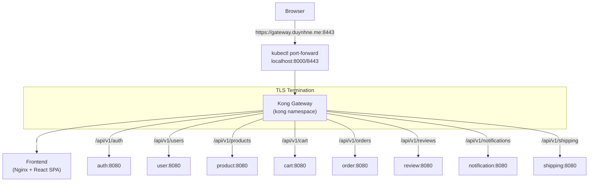

# Kong API Gateway

Kong Ingress Controller (KIC) runs in **DB-less mode** — all configuration is declarative via Kubernetes CRDs and Ingress resources, reconciled by Flux.

## Architecture



## Components

| Component | Location | Purpose |
|-----------|----------|---------|
| HelmRelease | `kubernetes/infra/controllers/kong/helmrelease.yaml` | Kong KIC deployment (DB-less) |
| HelmRepository | `kubernetes/clusters/local/sources/helm/kong.yaml` | Chart source (`charts.konghq.com`) |
| Flux Kustomization | `kubernetes/clusters/local/kong-config.yaml` | Deploys Ingress + plugins |
| Plugins | `kubernetes/infra/configs/kong/plugins.yaml` | Global CORS + Prometheus |
| Frontend Ingress | `kubernetes/infra/configs/kong/ingress-frontend.yaml` | Routes `/` to frontend |
| API Ingress | `kubernetes/infra/configs/kong/ingress-api.yaml` | Routes `/api/v1/*` to services |
| TLS Certificate | `kubernetes/infra/configs/cert-manager/certificates-microservices.yaml` | `kong-proxy-tls` via homelab-ca |
| ServiceMonitor | `kubernetes/infra/configs/monitoring/servicemonitors/kong.yaml` | Prometheus metrics scraping |

## Local Access

### Prerequisites

Add to `/etc/hosts`:

```
127.0.0.1  gateway.duynhne.me
```

### Port Forwarding

Port forwarding is included in `make flux-ui`:

```bash
# Start all port forwards (including Kong)
make flux-ui

# Or manually:
kubectl port-forward -n kong svc/kong-kong-proxy 8000:80 8443:443
```

### Access URLs

| URL | Description |
|-----|-------------|
| `https://gateway.duynhne.me:8443` | Kong HTTPS (self-signed cert) |
| `http://gateway.duynhne.me:8000` | Kong HTTP |
| `https://gateway.duynhne.me:8443/api/v1/products` | Example API route |

> **Note**: Browser will show a certificate warning for the self-signed cert. Accept it to proceed.

## TLS / cert-manager

The homelab uses a **self-signed CA** chain (works offline):

1. `selfsigned-bootstrap` — ClusterIssuer that bootstraps itself
2. `homelab-ca` — Certificate (10-year CA) signed by the bootstrap issuer
3. `homelab-ca` — ClusterIssuer backed by the CA cert, signs all service certificates
4. `kong-proxy-tls` — Certificate for `gateway.duynhne.me` signed by the CA

For production, uncomment the Let's Encrypt issuers in `clusterissuers.yaml` and switch the certificate's `issuerRef` to `letsencrypt-prod`.

## Plugins

### Active (Global)

| Plugin | Purpose |
|--------|---------|
| `cors` | CORS headers for frontend API access |
| `prometheus` | Metrics endpoint scraped by VictoriaMetrics |

### Future (Phase 2)

- `rate-limiting` — Per-route rate limits (backed by Valkey)
- `ip-restriction` — Internal-only endpoints
- `jwt` / `key-auth` — Gateway-level authentication

## Routing Rules

All routes use `konghq.com/strip-path: "false"` — the full request path is forwarded to the backend as-is.

| Path Prefix | Backend | Namespace |
|-------------|---------|-----------|
| `/` | `frontend:80` | default |
| `/api/v1/auth` | `auth:8080` | auth |
| `/api/v1/users` | `user:8080` | user |
| `/api/v1/products` | `product:8080` | product |
| `/api/v1/cart` | `cart:8080` | cart |
| `/api/v1/orders` | `order:8080` | order |
| `/api/v1/reviews` | `review:8080` | review |
| `/api/v1/notifications` | `notification:8080` | notification |
| `/api/v1/shipping` | `shipping:8080` | shipping |

## Flux Dependency Chain

```
controllers-local (Kong HelmRelease + cert-manager HelmRelease)
  -> cert-manager-local (homelab-ca + kong-proxy-tls Certificate)
  -> kong-config-local (Ingress resources + KongClusterPlugins)
  -> apps-local (microservices + frontend)
```

## Verification Runbook

Complete runbook to verify Kong API Gateway is working correctly after deployment.

### Step 1: Check Flux Kustomizations

All kustomizations must be `Ready: True`.

```bash
flux get kustomizations
```

**Expected**: All 9 kustomizations show `Ready: True`, especially:
- `controllers-local` — Kong HelmRelease deployed
- `cert-manager-local` — CA chain + kong-proxy-tls Certificate
- `kong-config-local` — Ingress resources + plugins

### Step 2: Check Kong Pod

```bash
kubectl get pods -n kong
```

**Expected**: `kong-kong-*` pod is `2/2 Running` (proxy + ingress-controller containers).

### Step 3: Check Kong Services

```bash
kubectl get svc -n kong
```

**Expected**: `kong-kong-proxy` service exists with type `ClusterIP`, ports `80/TCP, 443/TCP`.

### Step 4: Check cert-manager

```bash
kubectl get clusterissuer
kubectl get certificate -A
```

**Expected**:
- ClusterIssuers `homelab-ca` and `selfsigned-bootstrap` both `Ready: True`
- Certificate `kong-proxy-tls` in `kong` namespace is `Ready: True`

### Step 5: Check Ingress Resources

```bash
kubectl get ingress -A
```

**Expected**: 9 Ingress resources, all with class `kong`, host `gateway.duynhne.me`, and an ADDRESS assigned:

| Namespace | Name | Path |
|-----------|------|------|
| default | frontend | `/` |
| auth | api-auth | `/api/v1/auth` |
| user | api-user | `/api/v1/users` |
| product | api-product | `/api/v1/products` |
| cart | api-cart | `/api/v1/cart` |
| order | api-order | `/api/v1/orders` |
| review | api-review | `/api/v1/reviews` |
| notification | api-notification | `/api/v1/notifications` |
| shipping | api-shipping | `/api/v1/shipping` |

### Step 6: Check Kong Plugins

```bash
kubectl get kongclusterplugins
```

**Expected**: 2 plugins: `cors-policy` (cors) and `prometheus-metrics` (prometheus).

### Step 7: Start Port Forwarding

```bash
# Kill stale port-forwards first
pkill -f "kubectl port-forward -n kong" 2>/dev/null

# Start fresh
kubectl port-forward -n kong svc/kong-kong-proxy 8000:80 8443:443 &
```

### Step 8: Test API Routes (curl)

Test each route through Kong. Replace `8443` with `8000` for HTTP.

```bash
# Frontend
curl -sk -o /dev/null -w "%{http_code}" https://gateway.duynhne.me:8443/
# Expected: 200

curl -sk https://gateway.duynhne.me:8443/health
# Expected: ok

# Auth — login and get token
TOKEN=$(curl -sk -X POST https://gateway.duynhne.me:8443/api/v1/auth/login \
  -H "Content-Type: application/json" \
  -d '{"username":"alice","password":"password123"}' \
  | python3 -c "import sys,json; print(json.load(sys.stdin).get('token',''))")
echo "Token: ${TOKEN:0:30}..."
# Expected: jwt-token-v1-...

# Products (public)
curl -sk -o /dev/null -w "%{http_code}" https://gateway.duynhne.me:8443/api/v1/products
# Expected: 200

# Cart (requires auth)
curl -sk -o /dev/null -w "%{http_code}" -H "Authorization: Bearer $TOKEN" \
  https://gateway.duynhne.me:8443/api/v1/cart
# Expected: 200

# Orders (requires auth)
curl -sk -o /dev/null -w "%{http_code}" -H "Authorization: Bearer $TOKEN" \
  https://gateway.duynhne.me:8443/api/v1/orders
# Expected: 200 or 401 (depends on order service auth validation)

# Users profile (requires auth)
curl -sk -H "Authorization: Bearer $TOKEN" \
  https://gateway.duynhne.me:8443/api/v1/users/profile
# Expected: 200 with user JSON

# Notifications (requires auth)
curl -sk -o /dev/null -w "%{http_code}" -H "Authorization: Bearer $TOKEN" \
  https://gateway.duynhne.me:8443/api/v1/notifications
# Expected: 200

# Reviews
curl -sk -o /dev/null -w "%{http_code}" https://gateway.duynhne.me:8443/api/v1/reviews
# Expected: 400 (requires query params) — confirms routing works

# Shipping
curl -sk -o /dev/null -w "%{http_code}" https://gateway.duynhne.me:8443/api/v1/shipping
# Expected: 404 (no data) — confirms routing works
```

**Pass criteria**: Every route returns a response from the correct backend service (not Kong's default 404). HTTP codes like 401, 400, 404 from the backend are fine — they confirm Kong routed correctly.

### Step 9: Test CORS Headers

```bash
curl -sk -X OPTIONS https://gateway.duynhne.me:8443/api/v1/products \
  -H "Origin: https://gateway.duynhne.me:8443" \
  -H "Access-Control-Request-Method: GET" \
  -D - -o /dev/null 2>&1 | grep -i "access-control"
```

**Expected**:
```
access-control-allow-origin: https://gateway.duynhne.me:8443
access-control-allow-credentials: true
access-control-allow-headers: Content-Type,Authorization,X-Request-ID
access-control-allow-methods: GET,POST,PUT,PATCH,DELETE,OPTIONS
access-control-max-age: 3600
```

### Step 10: Browser E2E Test (agent-browser)

Use the `agent-browser` CLI to test the full frontend experience through Kong.

```bash
# 1. Open homepage
agent-browser open http://gateway.duynhne.me:8000
agent-browser screenshot
# Verify: "Welcome to Shop" page loads, nav shows "Products" and "Login"

# 2. Check Products page
agent-browser snapshot -i
# Click the "Products" link (use ref from snapshot)
agent-browser click @e4    # ref may vary — check snapshot output
agent-browser wait 2000
agent-browser screenshot
# Verify: Products grid with items and pagination

# 3. Login
agent-browser snapshot -i
# Click "Login" link
agent-browser click @e5    # ref may vary
agent-browser wait 2000
agent-browser snapshot -i
# Fill login form
agent-browser fill @e8 "alice"         # username field ref
agent-browser fill @e9 "password123"   # password field ref
agent-browser click @e10               # Login button ref
agent-browser wait 3000
agent-browser screenshot
# Verify: "Login successful!" toast, nav shows Cart/Orders/Notifications/Profile/Logout

# 4. Check Cart (authenticated)
agent-browser snapshot -i
agent-browser click @e5    # Cart link ref (check snapshot)
agent-browser wait 2000
agent-browser screenshot
# Verify: Cart items with quantities, prices, order summary

# 5. Check Notifications (authenticated)
agent-browser snapshot -i
agent-browser click @e7    # Notifications link ref
agent-browser wait 2000
agent-browser screenshot
# Verify: Notification list with unread items

# 6. Check Profile (authenticated)
agent-browser snapshot -i
agent-browser click @e8    # Profile link ref
agent-browser wait 3000
agent-browser screenshot
# Verify: User profile with username, email, name, phone

# 7. Cleanup
agent-browser close
```

**Notes on agent-browser**:
- Refs (`@e1`, `@e2`, ...) change after every page navigation. Always run `snapshot -i` to get fresh refs before interacting.
- On Linux without a display, you may need `--args "--no-sandbox"` on first launch.
- Use `batch` to chain commands: `agent-browser batch "click @e4" "wait 2000" "screenshot"`
- Screenshots are saved to `~/.agent-browser/tmp/screenshots/`.

**Test accounts** (seed data):
- Usernames: `alice`, `bob`, `carol`, `david`, `eve`
- Password: `password123`

### Step 11: Check Kong Metrics (optional)

```bash
# Port-forward to Kong status endpoint
kubectl exec -n kong deploy/kong-kong -c proxy -- curl -s localhost:8100/metrics | head -20
```

Or check in Grafana (if running) via the Kong ServiceMonitor.

## Troubleshooting

### Kong pod not starting

```bash
kubectl describe pod -n kong -l app.kubernetes.io/name=kong
kubectl logs -n kong -l app.kubernetes.io/name=kong -c proxy
kubectl logs -n kong -l app.kubernetes.io/name=kong -c ingress-controller
```

### Ingress not getting ADDRESS

```bash
# Check Kong ingress controller logs
kubectl logs -n kong -l app.kubernetes.io/name=kong -c ingress-controller --tail=50
```

### Route returns Kong default 404 (not backend 404)

Kong's default 404 response body is `{"message":"no Route matched ..."}`. This means the Ingress rule doesn't match. Check:

```bash
kubectl get ingress -A -o wide
kubectl describe ingress <name> -n <namespace>
```

### CORS not working

```bash
kubectl get kongclusterplugins
kubectl describe kongclusterplugin cors-policy
```

### cert-manager certificate not Ready

```bash
kubectl describe certificate kong-proxy-tls -n kong
kubectl describe clusterissuer homelab-ca
kubectl logs -n cert-manager -l app.kubernetes.io/name=cert-manager --tail=50
```

### Flux kustomization stuck

```bash
flux get kustomizations
flux logs --kind=Kustomization --name=kong-config-local
flux logs --kind=Kustomization --name=controllers-local
```

### Port-forward not working

```bash
# Kill all and restart
pkill -f "kubectl port-forward"
sleep 2
make flux-ui
```

## Design Decisions

### Why DB-less mode?
Kong in DB-less mode stores all configuration in Kubernetes CRDs. No PostgreSQL dependency for Kong itself, fully declarative, reconciled by Flux.

### Why no TLS secret volume mount?
The cert-manager TLS certificate (`kong-proxy-tls`) is created by `cert-manager-local`, which depends on `controllers-local`. If Kong's HelmRelease (in `controllers-local`) requires the TLS secret to start, it creates a circular dependency. Kong uses its default self-signed cert instead. The cert-manager certificate is available for future use.

### Why path-based routing (single domain)?
The frontend uses relative URLs (`/api/v1/*`). A single domain with path-based routing means the browser sends API requests to the same origin — no CORS complexity, no multiple `/etc/hosts` entries.
