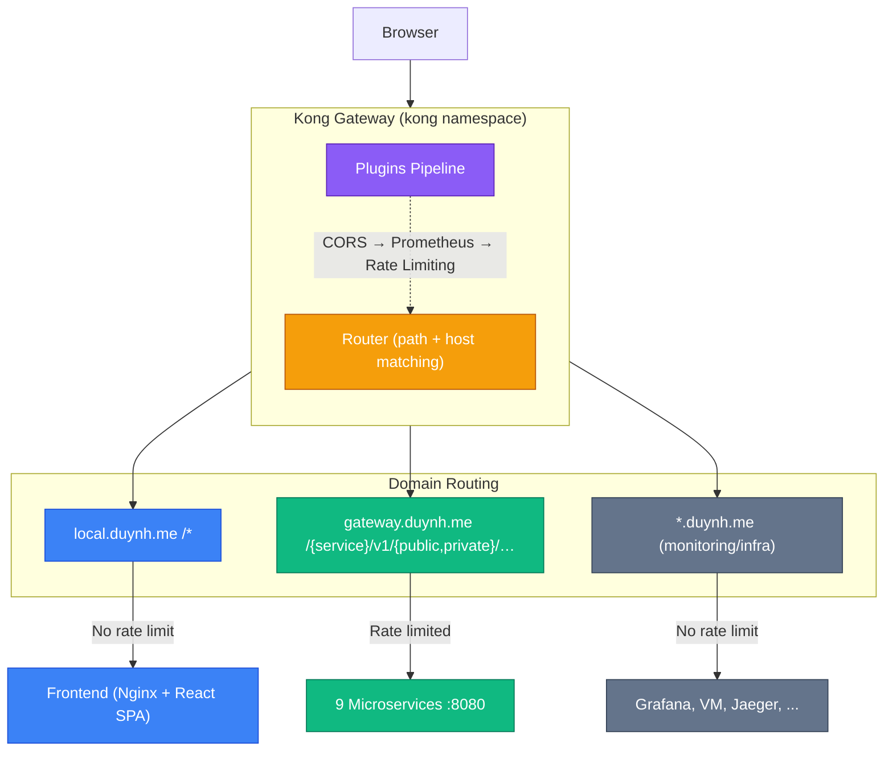
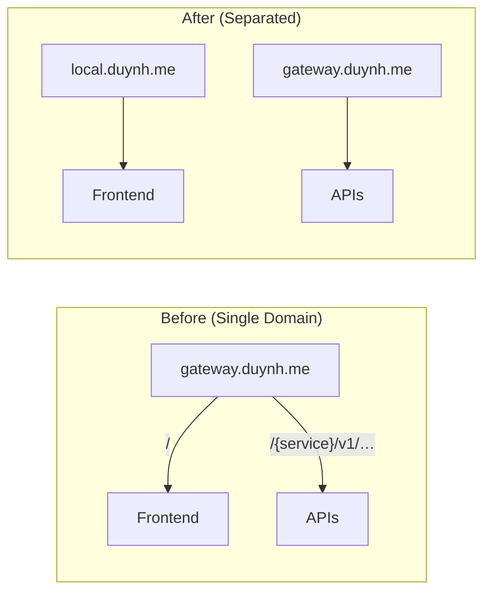
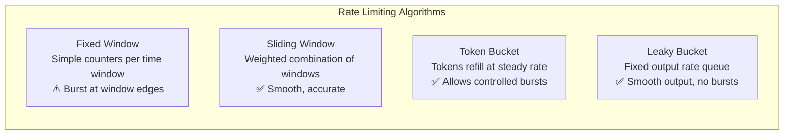
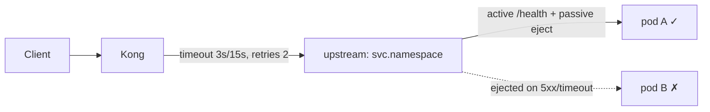
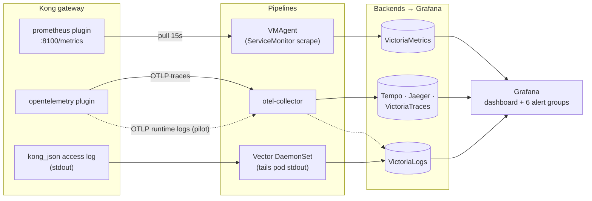

# Kong API Gateway

Kong Ingress Controller (KIC) runs in **DB-less mode** — all configuration is declarative via Kubernetes CRDs and Ingress resources, reconciled by Flux.

---

## Table of Contents

- [What is an API gateway?](#what-is-an-api-gateway)
- [Why Kong?](#why-kong)
- [Architecture](#architecture)
- [Domain Routing Strategy](#domain-routing-strategy)
- [Rate Limiting Deep Dive](#rate-limiting-deep-dive)
- [Edge Resilience](#edge-resilience)
- [Plugin Ecosystem](#plugin-ecosystem)
- [Observability](#observability)
- [Components](#components)
- [Local Access](#local-access)
- [TLS / cert-manager](#tls--cert-manager)
- [Routing Rules](#routing-rules)
- [Flux Dependency Chain](#flux-dependency-chain)
- [Verification Runbook](#verification-runbook)
- [Troubleshooting](#troubleshooting)
- [Design Decisions](#design-decisions)
- [Future Roadmap](#future-roadmap)

---

## What is an API gateway?

An **API gateway** is the single front door for client traffic: one endpoint in
front of many backend services that applies cross-cutting concerns *once* at the
edge instead of in every service. Core responsibilities:

- **Routing & composition** — match host/path and forward to the right service;
  optionally aggregate calls or translate protocols.
- **TLS termination** — terminate HTTPS at the edge with one certificate.
- **Authentication / authorization** — optionally validate tokens at the edge.
- **Traffic control** — rate limiting, request-size limits, CORS, retries.
- **Observability** — one consistent place for access logs, metrics, and a
  correlation/request id that ties a request to its downstream spans.

**Tradeoffs (every decision is one):**

- **Central control vs. single point of failure** — one place to secure, route, and
  observe, but it *must* run HA (here: 2 replicas + a PodDisruptionBudget) or it
  takes the whole API surface down with it.
- **An extra network hop** — a little latency in exchange for doing TLS, routing,
  and rate-limiting in one place rather than N.
- **Edge auth vs. service-side auth** — validating JWTs at the gateway means fewer
  moving parts but a *second* source of truth. This platform keeps **auth
  authoritative in the services** (single source of truth, fail-closed —
  [ADR-003](../proposals/adr/ADR-003-jwt-validation-in-services-not-kong/)),
  **plus** a coarse edge JWT check on `/private/` routes as defense-in-depth
  ([ADR-006](../proposals/adr/ADR-006-kong-edge-jwt/), the `jwt-edge` plugin).

In this platform Kong is a **pass-through** gateway: it routes, terminates TLS,
rate-limits, and adds CORS / security-headers / correlation-id / metrics — but does
**not** authenticate, rewrite paths, or hold business logic (see
[Architecture](#architecture) and [Routing Rules](#routing-rules)).

---

## Why Kong?

### Kong vs Alternatives

| Feature | Kong OSS | Traefik | NGINX Ingress | APISIX | Envoy/Istio |
|---------|----------|---------|---------------|--------|-------------|
| **Plugin Ecosystem** | 80+ bundled plugins | Middleware (limited) | Annotations only | 50+ plugins | Envoy filters (complex) |
| **DB-less Mode** | Native | Native | N/A | Native | N/A |
| **K8s CRDs** | KongPlugin, KongConsumer, KongConsumerGroup | IngressRoute | ConfigMap/annotations | ApisixRoute | VirtualService |
| **Gateway API** | Full support (v1) | Full support | Partial | Partial | Full support |
| **Rate Limiting** | Built-in (local/cluster/redis) | Built-in (basic) | Annotation only | Built-in | Envoy filter |
| **Auth Plugins** | JWT, OAuth2, OIDC, key-auth, LDAP, mTLS | BasicAuth, ForwardAuth | External auth only | JWT, key-auth | ext_authz filter |
| **Observability** | Prometheus, OpenTelemetry, Datadog, Zipkin | Prometheus, OTel | Prometheus | Prometheus, Skywalking | Native (Envoy stats) |
| **Performance** | High (Nginx + LuaJIT core) | Good (Go, single binary) | High (Nginx core) | High (Nginx + LuaJIT) | Very High (C++) |
| **Learning Curve** | Medium | Low | Low | Medium | High |
| **Enterprise Features** | Kong Gateway Enterprise | Traefik Enterprise | NGINX Plus | N/A | Istio ambient mesh |

### Why Kong for This Project

1. **Plugin-driven architecture** — Rate limiting, CORS, Prometheus, auth all as declarative plugins, no custom code
2. **DB-less + GitOps** — Zero external database dependency for Kong itself, fully reconciled by Flux
3. **Kubernetes-native CRDs** — `KongPlugin`, `KongClusterPlugin`, `KongConsumer` are first-class K8s resources
4. **Production-proven** — Used by Stripe, Nasdaq, Honeywell, Samsung at massive scale
5. **Extensible** — Custom plugins in Lua, Go, Python, JavaScript via PDK (Plugin Development Kit)

### DB-less vs Database mode

Kong runs in two deployment topologies. This project uses **DB-less** (Ingress Controller mode); the table below explains why.

| Aspect | **DB-less (declarative)** | **Database (Postgres)** |
|---|---|---|
| **Config source** | YAML file / ConfigMap / Kubernetes CRDs | Admin API writes to Postgres |
| **State** | In-memory only, loaded at start | Persistent, shared across nodes |
| **Scaling** | Each pod loads YAML independently, stateless | All nodes read the shared DB |
| **Config update** | Full reload (`/config` endpoint or rolling restart) | Per-entity CRUD via Admin API, propagated through the DB |
| **Admin API** | Read-only (`GET` only) | Full CRUD |
| **Plugin support** | ~95% (missing: rate-limiting `cluster` policy, OAuth2 token store, ACL with dynamic consumers, some plugins that need persistent state) | 100% |
| **Consumer / Credential** | Declared in YAML / `KongConsumer` CRD (static) | Created/deleted at runtime via Admin API |
| **Rate-limiting policies** | `local`, `redis` | `local`, `cluster`, `redis` |
| **Vitals / Analytics** | No (Enterprise only via Redis) | Yes, with the Postgres backend |
| **HA / multi-node** | Stateless, easy horizontal scale, no SPOF | Needs HA Postgres → extra operational burden |
| **Cold start** | Fast (load YAML) | Requires the DB to be ready first |
| **GitOps fit** | ⭐ Best — config = a file in Git | Hard — state lives in the DB, prone to drift |
| **Use case** | Kubernetes Ingress, edge proxy, immutable infra | Kong as an API platform with many self-service teams |

**When to use DB-less:**

- Kubernetes with the Ingress Controller (this repo's case)
- GitOps workflow (config in Git, reconciled by Flux)
- No need for dynamic consumer/credential management
- Reduce the operational surface (1 component instead of 2)

**When to use Database mode:**

- Many teams create routes/consumers via the Admin API or Kong Manager UI
- Kong Enterprise with Vitals, RBAC, Workspaces
- Plugins that require persistent state (long-lived OAuth2 token introspection cache, dynamic ACL)
- No Konnect (cloud control plane)

**In this repo:** Kong runs **DB-less** (Ingress Controller mode). All Ingress/routes are declared via Kubernetes CRDs (`Ingress`, `KongPlugin`); Flux reconciles the config from Git → drift = 0; Postgres is reserved for app data, not wasted on the Kong control plane. **Do not switch to DB mode** unless onboarding Kong Enterprise + Konnect.

---

## Architecture



### Plugin Pipeline (per-request execution order)

Every request flows through Kong's plugin pipeline. Plugins execute in a defined order based on priority:

```
Request → CORS → correlation-id → Prometheus → Rate Limiting (per-route) → Upstream
       → (response) security-headers → Client
```

| Plugin | Scope | Purpose |
|--------|-------|---------|
| `cors-policy` (`cors`) | Global | CORS headers for cross-origin requests; exposes `X-Request-ID` |
| `correlation-id` | Global | Generates `X-Request-ID` per request, echoed downstream |
| `prometheus-metrics` (`prometheus`) | Global | Metrics for every request (status/latency/bandwidth) |
| `security-headers` (`response-transformer`) | Global | Adds `X-Content-Type-Options`, `Referrer-Policy`, `X-Frame-Options`, HSTS; strips `Server` |
| `rate-limiting-api` | Per-route (API only) | Protects backends from abuse (`redis` policy — exact cluster-wide counter shared by both Kong replicas) |
| `request-size-limiting-api` | Per-route (API only) | Rejects oversized payloads (10 MB) |

### Authentication — edge pre-check at Kong, services authoritative

Two layers, both verifying the same RS256 signature (defense-in-depth,
[ADR-006](../proposals/adr/ADR-006-rs256-jwt-kong-edge-auth/) — supersedes
[ADR-003](../proposals/adr/ADR-003-jwt-validation-in-services-not-kong/)):

- **Kong edge (`jwt-edge`, OSS `jwt` plugin)** on every `…/private/` Ingress —
  matches the token's `iss` to the `auth-issuer` consumer credential (static
  RS256 **public** key delivered by ESO from OpenBAO) and checks `exp`.
  Bad/expired/missing tokens are shed at the gateway with `401`.
- **Services (`pkg/authmw`, fail-closed)** verify the JWT **locally** against
  the cached JWKS (`/auth/v1/public/auth/jwks`), pinning issuer/audience/alg — this
  remains the single source of truth. Since RFC-0009 **Phase 5** this is
  JWT-only: the opaque-token `auth.GetMe` gRPC fallback was removed (auth no
  longer runs a gRPC server), and `sessions` are gone — session lifetime is
  managed by rotating refresh tokens (`/auth/v1/public/{refresh,logout}`).

Kong never sees the private signing key (public-key verification only).

---

## Domain Routing Strategy

Clear separation of concerns — each domain has a single responsibility:

| Domain | Responsibility | Rate Limited | Ingress File |
|--------|---------------|--------------|--------------|
| `local.duynh.me` | Frontend (React SPA) | No | `ingress-frontend.yaml` |
| `gateway.duynh.me` | API Gateway (9 microservices) | **Yes** | `ingress-api.yaml` |
| `grafana.duynh.me` | Grafana dashboards | No | `ingress-monitoring.yaml` |
| `vmui.duynh.me` | VictoriaMetrics UI | No | `ingress-monitoring.yaml` |
| `jaeger.duynh.me` | Distributed tracing | No | `ingress-monitoring.yaml` |
| `logs.duynh.me` | VictoriaLogs | No | `ingress-monitoring.yaml` |
| `ui.duynh.me` | Flux UI | No | `ingress-infra.yaml` |
| `vm-mcp.duynh.me` | VictoriaMetrics MCP | No | `ingress-mcp.yaml` |
| *(+ more: victoriatraces, tempo, pyroscope, karma, …)* | See `scripts/setup-hosts.sh` (authoritative host list) | No | Various |

### Why Separate Frontend and API Domains?



| Aspect | Single Domain | Separated Domains |
|--------|--------------|-------------------|
| Rate limiting | Risk of limiting static assets | API-only, no impact on frontend |
| CDN/caching | Complex path-based rules | Domain-level cache policies |
| Security | Shared cookie scope | Isolated origins |
| Scaling | Coupled | Independent scaling per domain |
| CORS | Same-origin (no CORS needed) | Cross-origin (explicit CORS config) |

The tradeoff is explicit CORS configuration, which we handle via Kong's `cors-policy` plugin.

---

## Rate Limiting Deep Dive

### How Large Companies Do It

Understanding industry practices helps design production-grade rate limiting:

#### GitHub

- **Unauthenticated**: 60 req/hour per IP
- **Authenticated**: 5,000 req/hour per user (15,000 for Enterprise)
- **Secondary limits**: 100 concurrent requests, 900 points/min per endpoint
- **Headers**: `x-ratelimit-limit`, `x-ratelimit-remaining`, `x-ratelimit-used`, `x-ratelimit-reset`
- **Strategy**: Per-user token bucket, separate limits per resource type

#### Stripe

- **Live mode**: 100 req/s global, 25 req/s per endpoint (default)
- **Concurrency limiter**: Separate from rate limiter
- **Per-resource limits**: PaymentIntents 1,000 updates/hr, Files 20 req/s
- **Headers**: `Stripe-Rate-Limited-Reason` (global-rate, endpoint-rate, global-concurrency, endpoint-concurrency)
- **Read allocation**: 500 read requests per transaction (rolling 30 days)
- **Strategy**: Token bucket + concurrency limiter, recommend client-side throttling

#### Shopify

- **REST**: 40 req/app/store bucket, refills 2 req/s (leaky bucket)
- **GraphQL**: 1,000 cost points/s per app
- **Headers**: `X-Shopify-Shop-Api-Call-Limit: 32/40`
- **Strategy**: Leaky bucket with burst capacity

#### Twitter/X

- **Free tier**: 1,500 tweets/month
- **Basic**: 100 reads/month, 10,000 tweets/month
- **Per-endpoint**: 15 or 75 requests per 15-min window
- **Strategy**: Fixed window per endpoint per user

### Rate Limiting Algorithms



| Algorithm | Burst Handling | Accuracy | Complexity | Used By |
|-----------|---------------|----------|------------|---------|
| **Fixed Window** | Poor (2x burst at boundary) | Low | Simple | Twitter/X |
| **Sliding Window** | Good (no boundary burst) | High | Medium | Kong Advanced, Cloudflare |
| **Token Bucket** | Controlled bursts allowed | Medium | Medium | Stripe, AWS API Gateway |
| **Leaky Bucket** | No bursts (smoothed) | High | Medium | Shopify, NGINX |

### Kong Rate Limiting: OSS vs Enterprise

| Feature | `rate-limiting` (OSS) | `rate-limiting-advanced` (Enterprise) |
|---------|----------------------|--------------------------------------|
| Algorithm | Fixed window counter | Sliding window |
| Multiple limits | `second`, `minute`, `hour`, `day`, `month`, `year` | Array of `limit[]` + `window_size[]` |
| Window type | Fixed only | `fixed` or `sliding` |
| Counter storage | `local`, `cluster`, `redis` | `local`, `cluster`, `redis`, `redis-cluster`, `redis-sentinel` |
| Consumer groups | Per-consumer only | Per-consumer-group (tiered plans) |
| Namespace isolation | No | Yes (`namespace` config) |
| Penalty mode | Always reject | Optional (`disable_penalty`) |

### Our Configuration

We use the **OSS `rate-limiting` plugin** with `redis` policy:

```yaml
# kubernetes/infra/configs/kong/plugins.yaml
apiVersion: configuration.konghq.com/v1
kind: KongClusterPlugin
metadata:
  name: rate-limiting-api
plugin: rate-limiting
config:
  second: 5       # Burst protection
  minute: 100     # Sustained load protection
  hour: 2500      # Abuse prevention
  policy: redis   # Shared counter in Valkey (exact across both Kong replicas)
  redis:
    host: valkey.cache-system.svc.cluster.local
    port: 6379
    database: 1
    timeout: 2000
  fault_tolerant: true
  hide_client_headers: false
  error_code: 429
  error_message: "Rate limit exceeded. Please slow down."
```

**Applied to**: All 9 currently deployed service API ingresses via annotation `konghq.com/plugins: rate-limiting-api`

**Not applied to**: Frontend (`local.duynh.me`), monitoring dashboards, MCP servers

### Response Headers

When rate limiting is active, Kong returns standard headers:

```
RateLimit-Limit: 5
RateLimit-Remaining: 3
RateLimit-Reset: 3
X-RateLimit-Limit-Second: 5
X-RateLimit-Remaining-Second: 3
X-RateLimit-Limit-Minute: 100
X-RateLimit-Remaining-Minute: 85
```

When limit is exceeded (HTTP 429):

```json
{
  "message": "Rate limit exceeded. Please slow down."
}
```

### Policy Strategy: `local` vs `cluster` vs `redis`

| Policy | Accuracy | Performance | When to Use |
|--------|----------|-------------|-------------|
| **`local`** | Per-node only (inexact with multiple replicas) | Fastest (in-memory) | Single replica, dev/uat |
| **`cluster`** | Cluster-wide (uses Kong DB) | Moderate | DB-mode Kong, small clusters (**not available in DB-less**) |
| **`redis`** | Cluster-wide (external counter) | Moderate | Multi-replica, production scale |

**Current choice: `redis`** — We run **2 Kong replicas** (`replicaCount: 2` in the HelmRelease), so the counter must be shared or the limit would be enforced per pod. DB-less mode does **not** support the `cluster` policy, so `redis` against Valkey (already deployed in `cache-system`) is the way to a single cluster-wide counter:

```yaml
config:
  policy: redis
  redis:
    host: valkey.cache-system.svc.cluster.local
    port: 6379
    database: 1
    timeout: 2000
```

`database: 1` isolates the rate-limit keyspace from the product Cache-Aside (db 0).

### Rate Limit Accuracy

Because the `redis` policy keeps one shared counter in Valkey, the configured
limits are the exact cluster-wide ceiling regardless of how many Kong replicas
serve the request — no per-node fudge factor is needed. (The `local` policy is
the single-replica alternative, where each pod counts independently.)

### Choosing Limits

Our limits are designed for a homelab/learning platform:

| Limit | Value | Reasoning |
|-------|-------|-----------|
| `second: 5` | 5 req/s | Prevents rapid-fire abuse, allows normal browsing |
| `minute: 100` | 100 req/min | ~1.7 req/s sustained, generous for real users |
| `hour: 2500` | 2500 req/hr | ~42 req/min, prevents long-term scraping |

For production, calibrate based on actual traffic patterns:

```
Expected Peak QPS × Safety Multiplier (2-3x) = second limit
second limit × 60 × 0.6 = minute limit (assume 60% sustained)
minute limit × 60 × 0.5 = hour limit (assume 50% sustained)
```

---

## Edge Resilience

The gateway fails fast and sheds unhealthy backends instead of hanging on a dead
or slow upstream (RFC-0009 roadmap #5). Two layers, both plain Kong OSS:

**1. Bounded timeouts + retries** — per-service, set as `konghq.com/*` annotations
on each app Service (rendered by the `mop` chart's `service.annotations`, ≥ 0.13.0):

| Setting | Value | Why |
|---------|-------|-----|
| `connect-timeout` | 3s | fail fast on a dead pod instead of the 60s default |
| `read-timeout` / `write-timeout` | 15s | cap slow upstreams |
| `retries` | 2 | bounded — retries only on connection errors (no replay of a sent body), so no retry storm |

**2. Health-checks (circuit-breaking)** — a `resilience-default` `KongUpstreamPolicy`
in each app namespace, referenced by the Service's `konghq.com/upstream-policy`
annotation:

- **Active**: HTTP probe `GET /health` every 5s; 2 successes → healthy, 3 failures → ejected.
- **Passive**: eject a target after 5 HTTP failures or 3 timeouts on real traffic —
  the OSS approximation of a circuit breaker. K8s readiness already removes
  not-ready pods from Endpoints; passive checks add fast ejection on 5xx bursts
  from a pod that is still "ready".

State is **per Kong replica** (each runs its own health-checker). local-stack
mirrors this in its declarative config (`local-stack/gateway/kong.yml`), where a
chaos test (`docker compose stop <svc>`) shows fail-fast (503 in ~2ms once
ejected) and auto-recovery.

> `trusted_ips` tightening (roadmap #3) is deferred — kept at `0.0.0.0/0` so
> `X-Forwarded-*` keeps working behind the Kind port-forward.



---

## Plugin Ecosystem

### Active Plugins

| Plugin | Type | Scope | Configuration |
|--------|------|-------|---------------|
| **CORS** | Traffic Control | Global | Origins: `https://local.duynh.me`, `https://duynh.me`; methods: GET/POST/PUT/PATCH/DELETE/OPTIONS |
| **HTTPS Redirect** | Traffic Control | Per-Ingress annotations | `konghq.com/protocols: "https"` + `konghq.com/https-redirect-status-code: "301"` on every Ingress forces HTTP→HTTPS 301 |
| **Prometheus** | Observability | Global | Status codes, latency, bandwidth, upstream health |
| **Rate Limiting** | Traffic Control | API routes | 5/s, 100/min, 2500/hr, redis policy (shared Valkey counter, db 1) |
| **Request Size Limiting** | Security | API routes | 10 MB max payload |
| **IP Restriction** | Security | Internal ingresses | `ip-restriction-internal` — private/in-cluster CIDRs only (403 for public) on the admin/observability/MCP surfaces |
| **Rate Limiting (admin)** | Traffic Control | Internal ingresses | `rate-limiting-admin` — 1200/min, 30000/hr (generous, for dashboard fan-out), shared Valkey counter |
| **OpenTelemetry** | Observability | Global | `opentelemetry-tracing` — edge span + `propagation.inject: [w3c]` (forces `traceparent` to upstream); OTLP→collector. Trace starts at the gateway — see [tracing/architecture.md](../observability/tracing/architecture.md#edge--service-linkage) |

> **Internal-surface lockdown** (roadmap #1): the admin UIs (Grafana, OpenBAO,
> Postgres/Flux/RustFS), the observability UIs, and the MCP endpoints are *not*
> the public API — they carry `ip-restriction-internal` + `rate-limiting-admin`
> so only private/in-cluster clients reach them. Because `trusted_ips` is kept
> permissive for the Kind port-forward, this is **defense-in-depth**, not a hard
> boundary — a real auth story (OIDC/SSO) is the follow-up.

### Kong Plugin Categories

Kong has 80+ bundled plugins. Here's what's relevant for this project:

#### Authentication

| Plugin | Use Case | Status |
|--------|----------|--------|
| `jwt` | Edge JWT validation on `/private/` routes (`jwt-edge` KongClusterPlugin) | **Active** — RS256 tokens rejected at the gateway as a coarse first filter ([ADR-006](../proposals/adr/ADR-006-kong-edge-jwt/)); the service-side check stays authoritative |
| `key-auth` | API key authentication | Future |
| `oauth2` | Full OAuth2 flow | Future |
| `basic-auth` | Username/password | Future |
| `hmac-auth` | HMAC signature validation | Future |
| `ldap-auth` | LDAP/Active Directory | Future |

Auth remains authoritative at the application level (`pkg/authmw` verifies against the JWKS); `jwt-edge` is defense-in-depth, not a second source of truth.

#### Security

| Plugin | Purpose | Status |
|--------|---------|--------|
| `cors` | Cross-origin resource sharing | **Active** |
| `ip-restriction` | Allow/deny by IP | **Active** (`ip-restriction-internal`, internal ingresses) |
| `bot-detection` | Block known bots | Planned |
| `acl` | Access control lists | Future |
| `request-size-limiting` | Limit request body size | **Active** |

#### Traffic Control

| Plugin | Purpose | Status |
|--------|---------|--------|
| `rate-limiting` | Request rate limiting | **Active** |
| `request-termination` | Block routes (maintenance mode) | Future |
| `proxy-cache` | Response caching at gateway | Future |
| `request-size-limiting` | Limit payload sizes | **Active** |

#### Observability

| Plugin | Purpose | Status |
|--------|---------|--------|
| `prometheus` | Metrics endpoint | **Active** |
| `opentelemetry` | Distributed tracing (OTel) | **Active** (`opentelemetry-tracing`, global) |
| `correlation-id` | Request correlation | **Active** (global) |
| `http-log` | HTTP logging | Future |
| `tcp-log` | TCP logging | Future |
| `file-log` | File-based logging | Future |

#### Transformations

| Plugin | Purpose | Use Case |
|--------|---------|----------|
| `request-transformer` | Modify request headers/body | Add tracing headers |
| `response-transformer` | Modify response headers | Security headers |
| `correlation-id` | Add unique request ID | Distributed tracing |

---

## Observability

How the gateway is monitored today, and the tradeoffs behind each choice. Kong
positions its `opentelemetry` plugin as the unified telemetry path — evaluated
below against this platform's VictoriaMetrics/VictoriaLogs/Vector stack.

> **Why Kong shows two version lines.** Kong ships two editions on separate
> release trains: **Kong Gateway (Enterprise)** — currently 3.14 LTS, image
> `kong/kong-gateway` — and **Kong Gateway OSS/Community** — currently 3.9.x,
> image `kong:3.9`, which this platform runs. Features documented as "3.10+"
> through "3.14" exist only on the Enterprise train today; the OSS line stops
> at 3.9. That version gate drives the metrics and access-log decisions below.

### Current state (all live)



> Solid = primary paths · dotted = the OTel-logs **pilot** running alongside
> Vector. The three signals pivot on shared keys: `trace_id` (logs ↔ traces)
> and `request_id` (access log ↔ correlation-id header).

| Signal | Producer | Pipeline | Consumer |
|--------|----------|----------|----------|
| **Metrics** | `prometheus` plugin (status codes, latency histograms, bandwidth, upstream health) on the status listener `:8100/metrics` | chart-native ServiceMonitor (`serviceMonitor.enabled` in `controllers/kong/helmrelease.yaml`) → VMAgent (`selectAllByDefault`) → VictoriaMetrics | Grafana Kong dashboard (GrafanaDashboard CRD); 6 alert groups + recording rules in `configs/observability/metrics/prometheusrules/kong/` |
| **Traces** | `opentelemetry` plugin — root span per request + forced W3C `traceparent` injection (100% edge→service linkage) | OTLP-HTTP → otel-collector → Tempo + Jaeger + VictoriaTraces | Grafana Explore / Jaeger UI |
| **Access logs** | nginx `kong_json` log format on stdout — one JSON line per request (`status`, `request_time`, `upstream_time`, `request_id`, …) | Vector DaemonSet → VictoriaLogs (jsonline) | LogsQL queries by field |
| **Runtime logs (pilot)** | `opentelemetry` plugin `logs_endpoint` (Kong ≥ 3.8) — trace-correlated OTLP log records | otel-collector `logs` pipeline → VictoriaLogs (OTLP ingest) | Runs **alongside** Vector for comparison |

### Tradeoff: `prometheus` plugin vs OTel metrics

**Decision: keep the `prometheus` plugin.** OTLP metrics export from the
`opentelemetry` plugin requires Kong **3.13+** — an Enterprise-train version;
it does not exist on OSS 3.9. Even when it becomes available:

| | `prometheus` plugin (current) | OTel metrics (3.13+) |
|---|---|---|
| Availability | OSS 3.9 ✅ | Enterprise train only ❌ |
| Model | Pull — VMAgent scrapes `:8100/metrics`, exactly how every other component is scraped | Push — OTLP to the collector, a second metrics path to operate |
| Metric set | Purpose-built gateway RED: `kong_http_requests_total`, `kong_{kong,request,upstream}_latency_ms` histograms, bandwidth, upstream health, shared-dict memory | Generic OTel semconv; would need dashboard + 15-rule alert rewrite |
| Investment | Dashboard + 6 alert groups + recording rules already built on these names | Restart from zero |

**Revisit trigger:** the OSS line reaching 3.13-feature parity (or an
Enterprise migration) *and* a concrete need to unify metrics onto OTLP.

### Tradeoff: Vector vs OTel logs (pilot running)

Kong's OTel pitch is one plugin for all three signals. On OSS 3.9 the log
signal is **runtime logs only** — `access_logs_endpoint` (per-request logs
carrying Kong route/service context that nginx variables cannot express) is
version-gated like metrics. The pilot ships runtime logs via OTLP in parallel
with Vector; the comparison to settle in a follow-up:

| | Vector (primary) | OTel `logs_endpoint` (pilot) |
|---|---|---|
| Scope | Every pod in the cluster, incl. Kong's JSON access log | Kong runtime logs only (no access logs on 3.9) |
| Delivery | DaemonSet with disk buffering — survives sink outages | Plugin in-memory queue — drops on collector outage |
| Fields | Whatever is on stdout (access log = nginx vars; no route/service names) | Trace-correlated records with `service.*` resource attrs + introspection fields |
| Coupling | Independent of Kong config | Lives in gateway config; adds per-request work in the log phase |
| Verdict so far | Stays primary | Keep as pilot; promotes only if/when `access_logs_endpoint` reaches OSS — that would add the route/service context Vector cannot get from stdout |

Local-stack mirrors both paths (Vector container + `victoria-logs` sink), so
the comparison is testable offline — see `local-stack/README.md`.

### Known gaps

- Go services double-log through gin's default writer (`[GIN]` plain-text lines
  next to the structured JSON) — service-repo cleanup, tracked separately.
- Access logs lack Kong route/service names (nginx-var limitation, above).

---

## Components

| Component | Location | Purpose |
|-----------|----------|---------|
| HelmRelease | `kubernetes/infra/controllers/kong/helmrelease.yaml` | Kong KIC deployment (DB-less, chart 3.2.0 (Kong 3.9)) |
| Plugins | `kubernetes/infra/configs/kong/plugins.yaml` | Global CORS + Prometheus, API rate limiting + request size limiting |
| Frontend Ingress | `kubernetes/infra/configs/kong/ingress-frontend.yaml` | Routes `local.duynh.me /` to frontend |
| API Ingress | `kubernetes/infra/configs/kong/ingress-api.yaml` | Routes `gateway.duynh.me /{service}/v1/{public,private}/…` to services (rate-limited, pass-through) |
| Monitoring Ingress | `kubernetes/infra/configs/kong/ingress-monitoring.yaml` | Routes monitoring tools (Grafana, VM, Jaeger, etc.) |
| Infra Ingress | `kubernetes/infra/configs/kong/ingress-infra.yaml` | Routes infra tools (Flux UI, RustFS, OpenBAO, PG UI) |
| MCP Ingress | `kubernetes/infra/configs/kong/ingress-mcp.yaml` | Routes MCP servers (VM, VL, Flux) |
| TLS Certificate | `kubernetes/infra/configs/cert-manager/certificates-microservices.yaml` | `kong-proxy-tls` — `letsencrypt-prod` ClusterIssuer (Cloudflare DNS-01) on prod, self-signed `homelab-ca` on local Kind (overlay patch); SANs: `duynh.me`, `*.duynh.me` |
| ServiceMonitor | chart-native (`serviceMonitor.enabled` in `kubernetes/infra/controllers/kong/helmrelease.yaml`) | Prometheus metrics scraping |

---

## Local Access

### Prerequisites

Run the helper to populate `/etc/hosts` with every `*.duynh.me` host the platform exposes:

```bash
sudo ./scripts/setup-hosts.sh
# remove later: sudo ./scripts/setup-hosts.sh remove
```

The script edits a marker-managed block, so it is idempotent and reversible.

### Access via Kong (NodePort)

Kong runs as NodePort with Kind port mappings (80→30080, 443→30443). After `make cluster-up`:

| URL | Description |
|-----|-------------|
| `https://local.duynh.me` | Frontend (React SPA) |
| `https://gateway.duynh.me/product/v1/public/products` | API route example (Variant A) |
| `https://grafana.duynh.me` | Grafana dashboards |

Kong forces HTTPS via per-Ingress annotation; HTTP requests return `301` to the HTTPS URL.

---

## TLS / cert-manager

Kong terminates TLS with a wildcard cert (`*.duynh.me`). On **prod** this is a public-trust cert from **Let's Encrypt**, issued via Cloudflare DNS-01; on **local Kind** the `clusters/local` overlay patches the Certificate to the self-signed **`homelab-ca`** issuer (Kind has no real `duynh.me` DNS zone, so LE DNS-01 can't complete — expect a browser warning unless `homelab-ca` is trusted). The Certificate (`kong-proxy-tls` in the `kong` ns) is mounted as `ssl_cert`/`ssl_cert_key` on the Kong pod via a secretVolume.

Full pipeline (OpenBAO → ESO → cert-manager → Kong), DNS-01 prerequisites, the dual-PKI split (Let's Encrypt vs `homelab-ca`), and troubleshooting are documented in:

- [`docs/secrets/cert-manager.md`](../secrets/cert-manager.md) — controller, ClusterIssuers, `kong-proxy-tls` Certificate, deployment runbook
- [`docs/secrets/trust-distribution.md`](../secrets/trust-distribution.md) — trust-manager `homelab-ca-bundle`, two-PKI rationale

On prod, to switch the wildcard to LE staging while iterating (avoid prod rate limits), change `kong-proxy-tls.issuerRef` to `letsencrypt-staging`. (Local Kind already overrides this to `homelab-ca`.)

---

## Routing Rules

URL shape is **Variant A** from [`api.md`](../api/api.md#http-url-model): `/{service}/v1/{audience}/{resource…}`. Services mount these paths directly on their HTTP routers; Kong is **pure pass-through** (`strip-path: false`, no rewrite plugin). Services keep validating JWTs themselves.

Per-ingress `path:` entries are scoped to `public` and `private` audiences only — `internal` is never listed on the gateway, so requests to `https://gateway.duynh.me/notification/v1/internal/…` return Kong's default 404.

| Host | Path | Backend | Namespace | Rate limited |
|------|------|---------|-----------|--------------|
| `local.duynh.me` | `/` | `frontend:80` | frontend | No |
| `gateway.duynh.me` | `/auth/v1/public/` | `auth:8080` | auth | Yes |
| `gateway.duynh.me` | `/user/v1/public/`, `/user/v1/private/` | `user:8080` | user | Yes |
| `gateway.duynh.me` | `/product/v1/public/` | `product:8080` | product | Yes |
| `gateway.duynh.me` | `/cart/v1/private/` | `cart:8080` | cart | Yes |
| `gateway.duynh.me` | `/order/v1/private/` | `order:8080` | order | Yes |
| `gateway.duynh.me` | `/review/v1/public/`, `/review/v1/private/` | `review:8080` | review | Yes |
| `gateway.duynh.me` | `/notification/v1/private/` | `notification:8080` | notification | Yes |
| `gateway.duynh.me` | `/shipping/v1/public/` | `shipping:8080` | shipping | Yes |
| `gateway.duynh.me` | `/payment/v1/private/` | `payment:8080` | payment | Yes |
| `gateway.duynh.me` | `/payment/v1/public/webhooks/` | `payment:8080` | payment | Yes |

`api-payment-private` (`/payment/v1/private/`, edge JWT) and `api-payment-webhooks` (`/payment/v1/public/webhooks/`, anonymous — the HMAC signature over the raw body is the credential) are separate Ingresses so `jwt-edge` applies only to the private path.

**Internal endpoints NOT routed here** (reachable only via Kubernetes Service DNS):

| Service | Path | Caller |
|---------|------|--------|
| product | `POST /product/v1/internal/products` | Admin / seed jobs |
| user | `POST /user/v1/internal/users` | auth-service during registration flow |
| notification | `POST /notification/v1/internal/notifications/{email,sms}` | Any service publishing a notification |
| shipping | `GET /shipping/v1/internal/shipments/orders/:orderId` | order-service (order aggregation) |
| payment | `POST /payment/v1/internal/payments/:id/refunds` | order-service (saga refund) |
| payment | `POST /payment/v1/internal/payments/reconciliation/runs`, `GET /payment/v1/internal/payments/reconciliation/runs/:id` | Reconciliation trigger / status (in-cluster) |

Adding any `internal` audience to a gateway Ingress is a safety/privacy regression — keep them private-by-network (NetworkPolicy + no public rule).

---

## Flux Dependency Chain

```
controllers-local (cert-manager HelmRelease + Kong CRDs + namespaces)
  → cert-manager-local (homelab-ca + letsencrypt-prod ClusterIssuers + kong-proxy-tls Certificate → Secret; local overlay patches kong-proxy-tls issuerRef → homelab-ca; dependsOn secrets-local for cloudflare-api-token, a dev placeholder locally)
  → kong-local (Kong HelmRelease — mounts kong-proxy-tls Secret at startup)
  → kong-config-local (Ingress resources + KongClusterPlugins)
  → apps-local (microservices + frontend)
```

> Why Kong is **not** in `controllers-local`: the Kong proxy pod mounts the
> `kong-proxy-tls` Secret as a volume, so it cannot start until cert-manager
> has issued the Certificate. Putting Kong in `controllers-local` (which
> `cert-manager-local` `dependsOn`) creates a deadlock — `kong-local` lives
> after `cert-manager-local` to break that cycle.

---

## Verification Runbook

### Step 1: Check Flux Kustomizations

```bash
flux get kustomizations
```

**Expected**: `controllers-local`, `cert-manager-local`, `kong-config-local` all `Ready: True`.

### Step 2: Check Kong Pod

```bash
kubectl get pods -n kong
```

**Expected**: `kong-kong-*` pod is `2/2 Running` (proxy + ingress-controller containers).

### Step 3: Check Kong Plugins

```bash
kubectl get kongclusterplugins
kubectl get kongplugins -A
```

**Expected**:

- 10 `KongClusterPlugin`s: `cors-policy`, `prometheus-metrics`, `rate-limiting-api`, `request-size-limiting-api`, `correlation-id`, `security-headers`, `ip-restriction-internal`, `rate-limiting-admin`, `opentelemetry-tracing`, `jwt-edge`.
- No namespaced `KongPlugin` resources needed — Kong is pure pass-through (services mount Variant A paths directly).

### Step 4: Check Kong Services

```bash
kubectl get svc -n kong
```

**Expected**: `kong-kong-proxy` service exists with type `NodePort`, ports `80/TCP, 443/TCP`, NodePorts `30080, 30443`.

### Step 5: Check cert-manager

```bash
kubectl get clusterissuer
kubectl get certificate -A
```

**Expected**:
- ClusterIssuers `selfsigned-bootstrap`, `homelab-ca`, `letsencrypt-staging`, `letsencrypt-prod` all `Ready: True`
- Certificate `kong-proxy-tls` in `kong` namespace is `Ready: True`; `Issuer: homelab-ca` on local Kind (`letsencrypt-prod` on prod)
- `Secret/cloudflare-api-token` present in `cert-manager` namespace (synced by ESO)

On **prod**, if `letsencrypt-*` issuers are NotReady with `secret "cloudflare-api-token" not found`, the token has not been seeded into OpenBAO yet. Operator runbook: [`docs/secrets/secrets-management.md` § Bootstrap-only secrets](../secrets/secrets-management.md#bootstrap-only-secrets). On **local Kind** `kong-proxy-tls` is issued by `homelab-ca` (not the LE issuers), so this is not a local bring-up blocker.

### Step 6: Check Ingress Resources

```bash
kubectl get ingress -A
```

**Expected**: Ingress resources with class `kong` and an ADDRESS assigned:

| Namespace | Name | Host | Edge path |
|-----------|------|------|-----------|
| frontend | frontend | `local.duynh.me` | `/` |
| auth | api-auth-public | `gateway.duynh.me` | `/auth/v1/public/` |
| user | api-user-public | `gateway.duynh.me` | `/user/v1/public/` |
| user | api-user-private | `gateway.duynh.me` | `/user/v1/private/` (jwt-edge) |
| product | api-product | `gateway.duynh.me` | `/product/v1/public/` |
| cart | api-cart | `gateway.duynh.me` | `/cart/v1/private/` (jwt-edge) |
| order | api-order | `gateway.duynh.me` | `/order/v1/private/` (jwt-edge) |
| review | api-review-public | `gateway.duynh.me` | `/review/v1/public/` |
| review | api-review-private | `gateway.duynh.me` | `/review/v1/private/` (jwt-edge) |
| notification | api-notification | `gateway.duynh.me` | `/notification/v1/private/` (jwt-edge) |
| shipping | api-shipping | `gateway.duynh.me` | `/shipping/v1/public/` |
| payment | api-payment-private | `gateway.duynh.me` | `/payment/v1/private/` |
| payment | api-payment-webhooks | `gateway.duynh.me` | `/payment/v1/public/webhooks/` |
| *(+ monitoring, infra, MCP ingresses)* | | | |

### Step 7: Test API Routes (curl)

All browser-facing requests use Variant A paths. Kong passes them through unchanged; services mount these paths directly.

```bash
# Frontend
curl -s -o /dev/null -w "%{http_code}\n" https://local.duynh.me/
# Expected: 200

# Auth — login (public)
TOKEN=$(curl -s -X POST https://gateway.duynh.me/auth/v1/public/auth/login \
  -H "Content-Type: application/json" \
  -d '{"username":"alice","password":"password123"}' \
  | python3 -c "import sys,json; print(json.load(sys.stdin).get('access_token',''))")
echo "Token: ${TOKEN:0:30}..."
# Expected: eyJhbGciOiJSUzI1NiIs... (RS256 JWT)

# Confirm HTTP→HTTPS redirect (Kong returns 301)
curl -s -o /dev/null -w "%{http_code}\n" http://gateway.duynh.me/product/v1/public/products
# Expected: 301

# Products (public, anonymous)
curl -s -o /dev/null -w "%{http_code}\n" https://gateway.duynh.me/product/v1/public/products
# Expected: 200

# Cart (private — requires JWT)
curl -s -o /dev/null -w "%{http_code}\n" -H "Authorization: Bearer $TOKEN" \
  https://gateway.duynh.me/cart/v1/private/cart
# Expected: 200

# Orders
curl -s -o /dev/null -w "%{http_code}\n" -H "Authorization: Bearer $TOKEN" \
  https://gateway.duynh.me/order/v1/private/orders
# Expected: 200

# Users profile
curl -s -H "Authorization: Bearer $TOKEN" \
  https://gateway.duynh.me/user/v1/private/users/profile
# Expected: 200 with user JSON

# Notifications
curl -s -o /dev/null -w "%{http_code}\n" -H "Authorization: Bearer $TOKEN" \
  https://gateway.duynh.me/notification/v1/private/notifications
# Expected: 200

# Reviews (public list)
curl -s -o /dev/null -w "%{http_code}\n" https://gateway.duynh.me/review/v1/public/reviews
# Expected: 400 (product_id query param required) — confirms routing works

# Shipping track (public)
curl -s -o /dev/null -w "%{http_code}\n" \
  "https://gateway.duynh.me/shipping/v1/public/shipments/track?tracking_number=TRACK123"
# Expected: 200 or 404

# Legacy /api/v1/* is gone everywhere (services + gateway) — expected 404
curl -s -o /dev/null -w "legacy /api/v1 on gateway: %{http_code}\n" \
  https://gateway.duynh.me/api/v1/products

# Internal endpoint NOT on gateway — expected 404
curl -s -o /dev/null -w "notifications/email on gateway: %{http_code}\n" \
  -X POST https://gateway.duynh.me/notification/v1/internal/notifications/email

# Check rate limit headers
curl -sI https://gateway.duynh.me/product/v1/public/products 2>&1 | grep -i ratelimit
# Expected: RateLimit-Limit, RateLimit-Remaining, RateLimit-Reset headers
```

**Pass criteria**: Every route returns a response from the correct backend service (not Kong's default 404). HTTP codes like 401, 400, 404 from the backend are fine — they confirm Kong routed correctly.

### Step 8: Test CORS Headers

```bash
curl -s -X OPTIONS https://gateway.duynh.me/product/v1/public/products \
  -H "Origin: https://local.duynh.me" \
  -H "Access-Control-Request-Method: GET" \
  -D - -o /dev/null 2>&1 | grep -i "access-control"
```

**Expected**:

```
access-control-allow-origin: https://local.duynh.me
access-control-allow-credentials: true
access-control-allow-headers: Content-Type,Authorization,X-Request-ID
access-control-allow-methods: GET,POST,PUT,PATCH,DELETE,OPTIONS
access-control-max-age: 3600
```

### Step 9: Test Rate Limiting

```bash
# Rapid-fire 15 requests (limit is 5/s)
for i in $(seq 1 15); do
  code=$(curl -s -o /dev/null -w "%{http_code}" https://gateway.duynh.me/product/v1/public/products)
  echo "Request $i: $code"
done
# Expected: First ~5 return 200, remaining return 429
```

### Step 10: Browser E2E Test (agent-browser)

Use the `agent-browser` CLI to test the full frontend experience through Kong.

```bash
# 1. Open homepage
agent-browser open https://local.duynh.me
agent-browser screenshot
# Verify: "Welcome to Shop" page loads, nav shows "Products" and "Login"

# 2. Check Products page
agent-browser snapshot -i
# Click the "Products" link (use ref from snapshot)
agent-browser click @e4    # ref may vary — check snapshot output
agent-browser wait 2000
agent-browser screenshot
# Verify: Products grid with items and pagination

# 3. Login
agent-browser snapshot -i
# Click "Login" link
agent-browser click @e5    # ref may vary
agent-browser wait 2000
agent-browser snapshot -i
# Fill login form
agent-browser fill @e8 "alice"         # username field ref
agent-browser fill @e9 "password123"   # password field ref
agent-browser click @e10               # Login button ref
agent-browser wait 3000
agent-browser screenshot
# Verify: "Login successful!" toast, nav shows Cart/Orders/Notifications/Profile/Logout

# 4. Check Cart (authenticated)
agent-browser snapshot -i
agent-browser click @e5    # Cart link ref (check snapshot)
agent-browser wait 2000
agent-browser screenshot
# Verify: Cart items with quantities, prices, order summary

# 5. Check Notifications (authenticated)
agent-browser snapshot -i
agent-browser click @e7    # Notifications link ref
agent-browser wait 2000
agent-browser screenshot
# Verify: Notification list with unread items

# 6. Check Profile (authenticated)
agent-browser snapshot -i
agent-browser click @e8    # Profile link ref
agent-browser wait 3000
agent-browser screenshot
# Verify: User profile with username, email, name, phone

# 7. Cleanup
agent-browser close
```

**Notes on agent-browser**:
- Refs (`@e1`, `@e2`, ...) change after every page navigation. Always run `snapshot -i` to get fresh refs before interacting.
- On Linux without a display, you may need `--args "--no-sandbox"` on first launch.
- Use `batch` to chain commands: `agent-browser batch "click @e4" "wait 2000" "screenshot"`
- Screenshots are saved to `~/.agent-browser/tmp/screenshots/`.

**Test accounts** (seed data):
- Usernames: `alice`, `bob`, `carol`, `david`, `eve`
- Password: `password123`

### Step 11: Check Kong Metrics (optional)

```bash
# Port-forward to Kong status endpoint
kubectl exec -n kong deploy/kong-kong -c proxy -- curl -s localhost:8100/metrics | head -20
```

Or check in Grafana (if running) via the Kong ServiceMonitor and Kong Dashboard.

---

## Troubleshooting

### Kong pod not starting

```bash
kubectl describe pod -n kong -l app.kubernetes.io/name=kong
kubectl logs -n kong -l app.kubernetes.io/name=kong -c proxy
kubectl logs -n kong -l app.kubernetes.io/name=kong -c ingress-controller
```

### Route returns Kong default 404

Kong's default 404 body: `{"message":"no Route matched ..."}` — means the Ingress rule doesn't match.

```bash
kubectl get ingress -A -o wide
kubectl describe ingress <name> -n <namespace>
```

### Rate limiting not working

```bash
# Check plugin is applied
kubectl get kongclusterplugins rate-limiting-api -o yaml

# Check annotation on ingress
kubectl get ingress api-auth-public -n auth -o jsonpath='{.metadata.annotations}'

# Check Kong logs for plugin errors
kubectl logs -n kong -l app.kubernetes.io/name=kong -c proxy --tail=50 | grep rate
```

### CORS not working

```bash
kubectl describe kongclusterplugin cors-policy
```

Ensure the `Origin` header matches one of the configured origins exactly (including protocol).

### cert-manager certificate not Ready

See [`docs/secrets/cert-manager.md` § Troubleshooting & validation](../secrets/cert-manager.md#10-troubleshooting--validation).

---

## Design Decisions

### Why DB-less mode?

Kong in DB-less mode stores all configuration in Kubernetes CRDs. No PostgreSQL dependency for Kong itself, fully declarative, reconciled by Flux. This eliminates an entire database just for gateway config.

### Why separate frontend and API domains?

- Rate limiting applies only to API traffic, not static assets
- Independent scaling and caching policies per domain
- Cleaner security boundaries (isolated cookie scopes)
- Production-ready pattern used by most SaaS companies

### Why `rate-limiting` (OSS) over `rate-limiting-advanced`?

- OSS plugin covers our needs (fixed window, multiple time-based limits)
- No Enterprise license required
- Works with the `redis` policy, which DB-less mode requires for a shared counter
- No dependency on Kong's DB (the `cluster` policy is unavailable in DB-less)

### Why `redis` policy?

- We run **2 Kong replicas**, so a per-node (`local`) counter would enforce the
  limit per pod — the configured limits are only exact with a shared counter
- DB-less mode does **not** support the `cluster` policy, so `redis` (against the
  already-deployed Valkey in `cache-system`, db 1) is the only shared-counter option
- `fault_tolerant: true` fails **open** on a Valkey outage — limiting degrades to
  off rather than 500-ing requests
- `local` remains the single-replica alternative (in-memory, zero dependency)

### Why `fault_tolerant: true`?

If the rate limiting counter encounters an error (memory pressure, internal issue), the request is **allowed through** rather than blocked. This prioritizes availability over strict enforcement — better to serve a few extra requests than to block legitimate users due to a bug.

---

## Future Roadmap

### Phase 2: Security Hardening

- ~~`ip-restriction`~~ — ✅ Done (`ip-restriction-internal` on the admin/observability/MCP ingresses)
- ~~`response-transformer` / security-headers~~ — ✅ Done (`security-headers` adds HSTS, X-Frame-Options, X-Content-Type-Options, Referrer-Policy globally)
- ~~`request-size-limiting`~~ — ✅ Done (10MB limit, applied to API routes)
- `bot-detection` — Block known malicious bots

### Phase 3: Gateway-Level Auth

- ~~`jwt`~~ — ✅ **Done** ([ADR-006](../proposals/adr/ADR-006-rs256-jwt-kong-edge-auth/) / [RFC-0009](../proposals/rfc/RFC-0009/) Phase 4): the `jwt-edge` plugin verifies RS256 tokens on `/private/` routes (matches the token `iss` to the `auth-issuer` consumer's public-key credential, delivered by ESO from OpenBAO; checks `exp`). Public routes stay anonymous. Services **still** verify (`pkg/authmw`, authoritative) — the edge is the coarse first filter (defense-in-depth); Kong holds only the **public** key, never the signing key.
- `key-auth` — API key authentication for external integrations (planned)
- `acl` — Consumer-based access control lists (planned; pairs with Authorization/RBAC — roadmap #3)

### Phase 4: Advanced Traffic Control

- `proxy-cache` — Cache GET responses at gateway level (reduce backend load)
- `request-transformer` — Inject tracing headers, strip sensitive headers

### Phase 5: Multi-Replica Scaling

- ~~Switch rate limiting from `local` to `redis` policy (Valkey backend)~~ — **done** (`policy: redis`, Valkey db 1, both rate-limit plugins)
- Consider `KongConsumer` + `KongConsumerGroup` for tiered rate limits
- Evaluate Kong Gateway API support (migrate from Ingress to HTTPRoute)

---

_Last updated: 2026-07-10 — jwt-edge counted/active (10 KongClusterPlugins, ADR-006); redis rate-limit marked done; split user/review ingress names; host list pointer._
