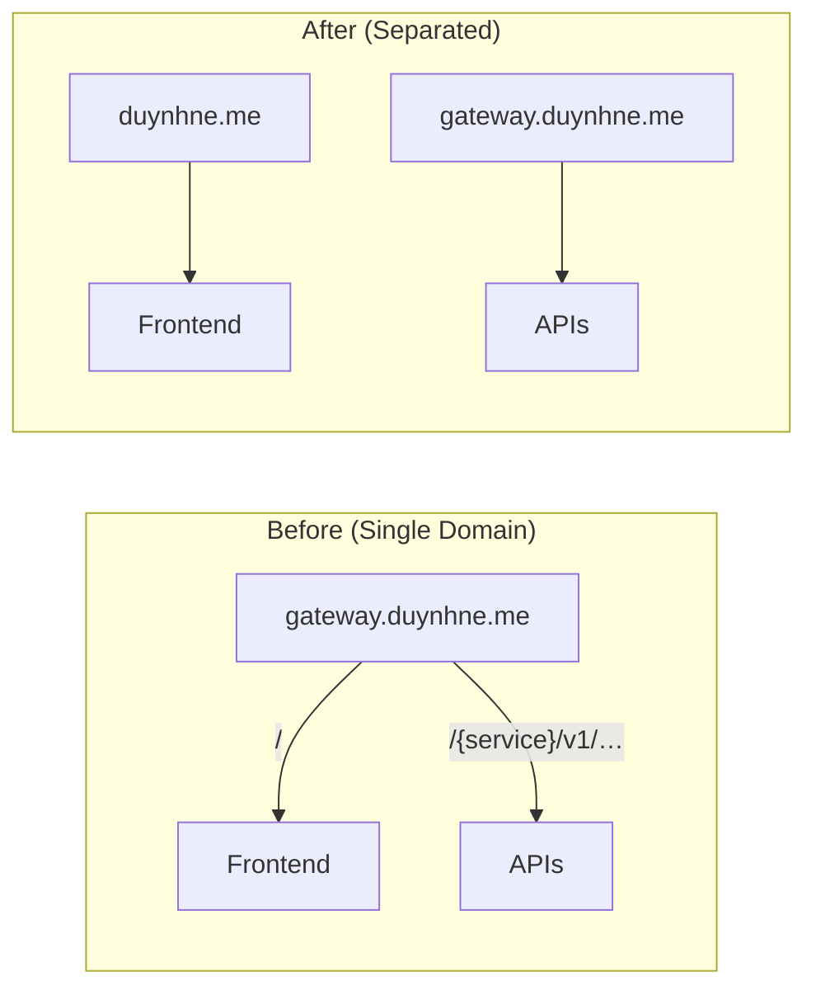
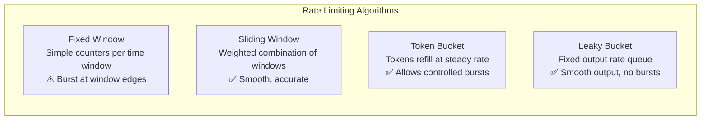

# Kong API Gateway

Kong Ingress Controller (KIC) runs in **DB-less mode** — all configuration is declarative via Kubernetes CRDs and Ingress resources, reconciled by Flux.

---

## Table of Contents

- [Why Kong?](#why-kong)
- [Architecture](#architecture)
- [Domain Routing Strategy](#domain-routing-strategy)
- [Rate Limiting Deep Dive](#rate-limiting-deep-dive)
- [Plugin Ecosystem](#plugin-ecosystem)
- [Components](#components)
- [Local Access](#local-access)
- [TLS / cert-manager](#tls--cert-manager)
- [Verification Runbook](#verification-runbook)
- [Troubleshooting](#troubleshooting)
- [Design Decisions](#design-decisions)
- [Future Roadmap](#future-roadmap)

---

## Why Kong?

### Kong vs Alternatives

| Feature | Kong OSS | Traefik | NGINX Ingress | APISIX | Envoy/Istio |
|---------|----------|---------|---------------|--------|-------------|
| **Plugin Ecosystem** | 80+ bundled plugins | Middleware (limited) | Annotations only | 50+ plugins | Envoy filters (complex) |
| **DB-less Mode** | Native | Native | N/A | Native | N/A |
| **K8s CRDs** | KongPlugin, KongConsumer, KongConsumerGroup | IngressRoute | ConfigMap/annotations | ApisixRoute | VirtualService |
| **Gateway API** | Full support (v1) | Full support | Partial | Partial | Full support |
| **Rate Limiting** | Built-in (local/cluster/redis) | Built-in (basic) | Annotation only | Built-in | Envoy filter |
| **Auth Plugins** | JWT, OAuth2, OIDC, key-auth, LDAP, mTLS | BasicAuth, ForwardAuth | External auth only | JWT, key-auth | ext_authz filter |
| **Observability** | Prometheus, OpenTelemetry, Datadog, Zipkin | Prometheus, OTel | Prometheus | Prometheus, Skywalking | Native (Envoy stats) |
| **Performance** | High (Nginx + LuaJIT core) | Good (Go, single binary) | High (Nginx core) | High (Nginx + LuaJIT) | Very High (C++) |
| **Learning Curve** | Medium | Low | Low | Medium | High |
| **Enterprise Features** | Kong Gateway Enterprise | Traefik Enterprise | NGINX Plus | N/A | Istio ambient mesh |

### Why Kong for This Project

1. **Plugin-driven architecture** — Rate limiting, CORS, Prometheus, auth all as declarative plugins, no custom code
2. **DB-less + GitOps** — Zero external database dependency for Kong itself, fully reconciled by Flux
3. **Kubernetes-native CRDs** — `KongPlugin`, `KongClusterPlugin`, `KongConsumer` are first-class K8s resources
4. **Production-proven** — Used by Stripe, Nasdaq, Honeywell, Samsung at massive scale
5. **Extensible** — Custom plugins in Lua, Go, Python, JavaScript via PDK (Plugin Development Kit)

---

## Architecture


### Plugin Pipeline (per-request execution order)

Every request flows through Kong's plugin pipeline. Plugins execute in a defined order based on priority:

```
Request → CORS (global) → Prometheus (global) → Rate Limiting (per-route) → Upstream
```

| Plugin | Scope | Priority | Purpose |
|--------|-------|----------|---------|
| `cors-policy` | Global | High | CORS headers for cross-origin requests |
| `prometheus-metrics` | Global | Medium | Metrics collection for every request |
| `rate-limiting-api` | Per-route (API only) | Medium | Protects backend services from abuse |

---

## Domain Routing Strategy

Clear separation of concerns — each domain has a single responsibility:

| Domain | Responsibility | Rate Limited | Ingress File |
|--------|---------------|--------------|--------------|
| `duynhne.me` | Frontend (React SPA) | No | `ingress-frontend.yaml` |
| `gateway.duynhne.me` | API Gateway (8 microservices) | **Yes** | `ingress-api.yaml` |
| `grafana.duynhne.me` | Grafana dashboards | No | `ingress-monitoring.yaml` |
| `vmui.duynhne.me` | VictoriaMetrics UI | No | `ingress-monitoring.yaml` |
| `jaeger.duynhne.me` | Distributed tracing | No | `ingress-monitoring.yaml` |
| `logs.duynhne.me` | VictoriaLogs | No | `ingress-monitoring.yaml` |
| `ui.duynhne.me` | Flux UI | No | `ingress-infra.yaml` |
| `vm-mcp.duynhne.me` | VictoriaMetrics MCP | No | `ingress-mcp.yaml` |
| *(+ 8 more)* | See README.md | No | Various |

### Why Separate Frontend and API Domains?



| Aspect | Single Domain | Separated Domains |
|--------|--------------|-------------------|
| Rate limiting | Risk of limiting static assets | API-only, no impact on frontend |
| CDN/caching | Complex path-based rules | Domain-level cache policies |
| Security | Shared cookie scope | Isolated origins |
| Scaling | Coupled | Independent scaling per domain |
| CORS | Same-origin (no CORS needed) | Cross-origin (explicit CORS config) |

The tradeoff is explicit CORS configuration, which we handle via Kong's `cors-policy` plugin.

---

## Rate Limiting Deep Dive

### How Large Companies Do It

Understanding industry practices helps design production-grade rate limiting:

#### GitHub

- **Unauthenticated**: 60 req/hour per IP
- **Authenticated**: 5,000 req/hour per user (15,000 for Enterprise)
- **Secondary limits**: 100 concurrent requests, 900 points/min per endpoint
- **Headers**: `x-ratelimit-limit`, `x-ratelimit-remaining`, `x-ratelimit-used`, `x-ratelimit-reset`
- **Strategy**: Per-user token bucket, separate limits per resource type

#### Stripe

- **Live mode**: 100 req/s global, 25 req/s per endpoint (default)
- **Concurrency limiter**: Separate from rate limiter
- **Per-resource limits**: PaymentIntents 1,000 updates/hr, Files 20 req/s
- **Headers**: `Stripe-Rate-Limited-Reason` (global-rate, endpoint-rate, global-concurrency, endpoint-concurrency)
- **Read allocation**: 500 read requests per transaction (rolling 30 days)
- **Strategy**: Token bucket + concurrency limiter, recommend client-side throttling

#### Shopify

- **REST**: 40 req/app/store bucket, refills 2 req/s (leaky bucket)
- **GraphQL**: 1,000 cost points/s per app
- **Headers**: `X-Shopify-Shop-Api-Call-Limit: 32/40`
- **Strategy**: Leaky bucket with burst capacity

#### Twitter/X

- **Free tier**: 1,500 tweets/month
- **Basic**: 100 reads/month, 10,000 tweets/month
- **Per-endpoint**: 15 or 75 requests per 15-min window
- **Strategy**: Fixed window per endpoint per user

### Rate Limiting Algorithms



| Algorithm | Burst Handling | Accuracy | Complexity | Used By |
|-----------|---------------|----------|------------|---------|
| **Fixed Window** | Poor (2x burst at boundary) | Low | Simple | Twitter/X |
| **Sliding Window** | Good (no boundary burst) | High | Medium | Kong Advanced, Cloudflare |
| **Token Bucket** | Controlled bursts allowed | Medium | Medium | Stripe, AWS API Gateway |
| **Leaky Bucket** | No bursts (smoothed) | High | Medium | Shopify, NGINX |

### Kong Rate Limiting: OSS vs Enterprise

| Feature | `rate-limiting` (OSS) | `rate-limiting-advanced` (Enterprise) |
|---------|----------------------|--------------------------------------|
| Algorithm | Fixed window counter | Sliding window |
| Multiple limits | `second`, `minute`, `hour`, `day`, `month`, `year` | Array of `limit[]` + `window_size[]` |
| Window type | Fixed only | `fixed` or `sliding` |
| Counter storage | `local`, `cluster`, `redis` | `local`, `cluster`, `redis`, `redis-cluster`, `redis-sentinel` |
| Consumer groups | Per-consumer only | Per-consumer-group (tiered plans) |
| Namespace isolation | No | Yes (`namespace` config) |
| Penalty mode | Always reject | Optional (`disable_penalty`) |

### Our Configuration

We use the **OSS `rate-limiting` plugin** with `local` policy:

```yaml
# kubernetes/infra/configs/kong/plugins.yaml
apiVersion: configuration.konghq.com/v1
kind: KongClusterPlugin
metadata:
  name: rate-limiting-api
plugin: rate-limiting
config:
  second: 10      # Burst protection
  minute: 200     # Sustained load protection
  hour: 5000      # Abuse prevention
  policy: local   # Per-node counters (single Kong replica)
  fault_tolerant: true
  hide_client_headers: false
  error_code: 429
  error_message: "Rate limit exceeded. Please slow down."
```

**Applied to**: All 8 API ingresses via annotation `konghq.com/plugins: rate-limiting-api`

**Not applied to**: Frontend (`duynhne.me`), monitoring dashboards, MCP servers

### Response Headers

When rate limiting is active, Kong returns standard headers:

```
RateLimit-Limit: 10
RateLimit-Remaining: 7
RateLimit-Reset: 3
X-RateLimit-Limit-Second: 10
X-RateLimit-Remaining-Second: 7
X-RateLimit-Limit-Minute: 200
X-RateLimit-Remaining-Minute: 185
```

When limit is exceeded (HTTP 429):

```json
{
  "message": "Rate limit exceeded. Please slow down."
}
```

### Policy Strategy: `local` vs `cluster` vs `redis`

| Policy | Accuracy | Performance | When to Use |
|--------|----------|-------------|-------------|
| **`local`** | Per-node only (inexact with multiple replicas) | Fastest (in-memory) | Single replica, dev/staging |
| **`cluster`** | Cluster-wide (uses Kong DB) | Moderate | DB-mode Kong, small clusters |
| **`redis`** | Cluster-wide (external counter) | Moderate | Multi-replica, production scale |

**Current choice: `local`** — We run a single Kong replica. When scaling to multiple replicas, switch to `redis` with Valkey (already deployed in `cache-system` namespace):

```yaml
config:
  policy: redis
  redis:
    host: valkey.cache-system.svc.cluster.local
    port: 6379
```

### Scaling Rate Limit Accuracy

With `local` policy and N Kong replicas, the effective limit per node is `global_limit / N`. But traffic isn't perfectly balanced, so:

- **2 replicas**: Set limit to `limit * 0.6` per node (allows 20% headroom)
- **3+ replicas**: Use `redis` policy for accurate cluster-wide counters

### Choosing Limits

Our limits are designed for a homelab/learning platform:

| Limit | Value | Reasoning |
|-------|-------|-----------|
| `second: 10` | 10 req/s | Prevents rapid-fire abuse, allows normal browsing |
| `minute: 200` | 200 req/min | ~3.3 req/s sustained, generous for real users |
| `hour: 5000` | 5000 req/hr | ~83 req/min, prevents long-term scraping |

For production, calibrate based on actual traffic patterns:

```
Expected Peak QPS × Safety Multiplier (2-3x) = second limit
second limit × 60 × 0.6 = minute limit (assume 60% sustained)
minute limit × 60 × 0.5 = hour limit (assume 50% sustained)
```

---

## Plugin Ecosystem

### Active Plugins

| Plugin | Type | Scope | Configuration |
|--------|------|-------|---------------|
| **CORS** | Traffic Control | Global | Origins: `duynhne.me`, methods: GET/POST/PUT/PATCH/DELETE/OPTIONS |
| **Prometheus** | Observability | Global | Status codes, latency, bandwidth, upstream health |
| **Rate Limiting** | Traffic Control | API routes | 10/s, 200/min, 5000/hr, local policy |
| **Request Size Limiting** | Security | API routes | 10 MB max payload |

### Kong Plugin Categories

Kong has 80+ bundled plugins. Here's what's relevant for this project:

#### Authentication (Future)

| Plugin | Use Case | Complexity |
|--------|----------|------------|
| `key-auth` | API key authentication | Low |
| `jwt` | JWT validation at gateway level | Medium |
| `oauth2` | Full OAuth2 flow | High |
| `basic-auth` | Username/password | Low |
| `hmac-auth` | HMAC signature validation | Medium |
| `ldap-auth` | LDAP/Active Directory | Medium |

Currently, auth is handled at the application level (auth-service). Gateway-level auth could offload JWT validation from all 8 services.

#### Security

| Plugin | Purpose | Status |
|--------|---------|--------|
| `cors` | Cross-origin resource sharing | **Active** |
| `ip-restriction` | Allow/deny by IP | Planned |
| `bot-detection` | Block known bots | Planned |
| `acl` | Access control lists | Future |
| `request-size-limiting` | Limit request body size | **Active** |

#### Traffic Control

| Plugin | Purpose | Status |
|--------|---------|--------|
| `rate-limiting` | Request rate limiting | **Active** |
| `request-termination` | Block routes (maintenance mode) | Future |
| `proxy-cache` | Response caching at gateway | Future |
| `request-size-limiting` | Limit payload sizes | **Active** |

#### Observability

| Plugin | Purpose | Status |
|--------|---------|--------|
| `prometheus` | Metrics endpoint | **Active** |
| `opentelemetry` | Distributed tracing (OTel) | Future |
| `correlation-id` | Request correlation | Future |
| `http-log` | HTTP logging | Future |
| `tcp-log` | TCP logging | Future |
| `file-log` | File-based logging | Future |

#### Transformations

| Plugin | Purpose | Use Case |
|--------|---------|----------|
| `request-transformer` | Modify request headers/body | Add tracing headers |
| `response-transformer` | Modify response headers | Security headers |
| `correlation-id` | Add unique request ID | Distributed tracing |

---

## Components

| Component | Location | Purpose |
|-----------|----------|---------|
| HelmRelease | `kubernetes/infra/controllers/kong/helmrelease.yaml` | Kong KIC deployment (DB-less, chart v2.44.0) |
| Plugins | `kubernetes/infra/configs/kong/plugins.yaml` | Global CORS + Prometheus, API rate limiting + request size limiting |
| Frontend Ingress | `kubernetes/infra/configs/kong/ingress-frontend.yaml` | Routes `duynhne.me /` to frontend |
| API Ingress | `kubernetes/infra/configs/kong/ingress-api.yaml` | Routes `gateway.duynhne.me /{service}/v1/{public,private}/…` to services (rate-limited, pass-through) |
| Monitoring Ingress | `kubernetes/infra/configs/kong/ingress-monitoring.yaml` | Routes monitoring tools (Grafana, VM, Jaeger, etc.) |
| Infra Ingress | `kubernetes/infra/configs/kong/ingress-infra.yaml` | Routes infra tools (Flux UI, RustFS, OpenBAO, PG UI) |
| MCP Ingress | `kubernetes/infra/configs/kong/ingress-mcp.yaml` | Routes MCP servers (VM, VL, Flux) |
| TLS Certificate | `kubernetes/infra/configs/cert-manager/certificates-microservices.yaml` | `kong-proxy-tls` via homelab-ca |
| ServiceMonitor | `kubernetes/infra/configs/monitoring/servicemonitors/kong.yaml` | Prometheus metrics scraping |

---

## Local Access

### Prerequisites

Add to `/etc/hosts`:

```
127.0.0.1  duynhne.me
127.0.0.1  gateway.duynhne.me
```

See `README.md` for the full `/etc/hosts` block with all domains.

### Access via Kong (NodePort)

Kong runs as NodePort with Kind port mappings (80→30080, 443→30443). After `make cluster-up`:

| URL | Description |
|-----|-------------|
| `http://duynhne.me` | Frontend (React SPA) |
| `http://gateway.duynhne.me/product/v1/public/products` | API route example (Variant A) |
| `http://grafana.duynhne.me` | Grafana dashboards |

### Fallback: Port Forwarding

If NodePort mapping is not available:

```bash
make flux-ui

# Or manually:
kubectl port-forward -n kong svc/kong-kong-proxy 8000:80 8443:443
```

---

## TLS / cert-manager

The homelab uses a **self-signed CA** chain (works offline):

1. `selfsigned-bootstrap` — ClusterIssuer that bootstraps itself
2. `homelab-ca` — Certificate (10-year CA) signed by the bootstrap issuer
3. `homelab-ca` — ClusterIssuer backed by the CA cert, signs all service certificates
4. `kong-proxy-tls` — Certificate for `*.duynhne.me` signed by the CA

For production, uncomment the Let's Encrypt issuers in `clusterissuers.yaml` and switch the certificate's `issuerRef` to `letsencrypt-prod`.

---

## Routing Rules

URL shape is **Variant A** from [`api-naming-convention.md`](../api/api-naming-convention.md): `/{service}/v1/{audience}/{resource…}`. Services mount these paths directly on their HTTP routers; Kong is **pure pass-through** (`strip-path: false`, no rewrite plugin). Services keep validating JWTs themselves.

Per-ingress `path:` entries are scoped to `public` and `private` audiences only — `internal` is never listed on the gateway, so requests to `https://gateway.duynhne.me/notification/v1/internal/…` return Kong's default 404.

| Host | Path | Backend | Namespace | Rate limited |
|------|------|---------|-----------|--------------|
| `duynhne.me` | `/` | `frontend:80` | frontend | No |
| `gateway.duynhne.me` | `/auth/v1/public/`, `/auth/v1/private/` | `auth:8080` | auth | Yes |
| `gateway.duynhne.me` | `/user/v1/public/`, `/user/v1/private/` | `user:8080` | user | Yes |
| `gateway.duynhne.me` | `/product/v1/public/` | `product:8080` | product | Yes |
| `gateway.duynhne.me` | `/cart/v1/private/` | `cart:8080` | cart | Yes |
| `gateway.duynhne.me` | `/order/v1/private/` | `order:8080` | order | Yes |
| `gateway.duynhne.me` | `/review/v1/public/`, `/review/v1/private/` | `review:8080` | review | Yes |
| `gateway.duynhne.me` | `/notification/v1/private/` | `notification:8080` | notification | Yes |
| `gateway.duynhne.me` | `/shipping/v1/public/` | `shipping:8080` | shipping | Yes |

**Internal endpoints NOT routed here** (reachable only via Kubernetes Service DNS):

| Service | Path | Caller |
|---------|------|--------|
| product | `POST /product/v1/internal/products` | Admin / seed jobs |
| user | `POST /user/v1/internal/users` | auth-service during registration flow |
| notification | `POST /notification/v1/internal/notify/{email,sms}` | Any service publishing a notification |
| shipping | `GET /shipping/v1/internal/orders/:orderId` | order-service (order aggregation) |

Adding any `internal` audience to a gateway Ingress is a safety/privacy regression — keep them private-by-network (NetworkPolicy + no public rule).

---

## Flux Dependency Chain

```
controllers-local (cert-manager HelmRelease + Kong CRDs + namespaces)
  → cert-manager-local (homelab-ca ClusterIssuer + kong-proxy-tls Certificate → Secret)
  → kong-local (Kong HelmRelease — mounts kong-proxy-tls Secret at startup)
  → kong-config-local (Ingress resources + KongClusterPlugins)
  → apps-local (microservices + frontend)
```

> Why Kong is **not** in `controllers-local`: the Kong proxy pod mounts the
> `kong-proxy-tls` Secret as a volume, so it cannot start until cert-manager
> has issued the Certificate. Putting Kong in `controllers-local` (which
> `cert-manager-local` `dependsOn`) creates a deadlock — `kong-local` lives
> after `cert-manager-local` to break that cycle.

---

## Verification Runbook

### Step 1: Check Flux Kustomizations

```bash
flux get kustomizations
```

**Expected**: `controllers-local`, `cert-manager-local`, `kong-config-local` all `Ready: True`.

### Step 2: Check Kong Pod

```bash
kubectl get pods -n kong
```

**Expected**: `kong-kong-*` pod is `2/2 Running` (proxy + ingress-controller containers).

### Step 3: Check Kong Plugins

```bash
kubectl get kongclusterplugins
kubectl get kongplugins -A
```

**Expected**:

- 4 `KongClusterPlugin`s: `cors-policy`, `prometheus-metrics`, `rate-limiting-api`, `request-size-limiting-api`.
- No namespaced `KongPlugin` resources needed — Kong is pure pass-through (services mount Variant A paths directly).

### Step 4: Check Kong Services

```bash
kubectl get svc -n kong
```

**Expected**: `kong-kong-proxy` service exists with type `NodePort`, ports `80/TCP, 443/TCP`, NodePorts `30080, 30443`.

### Step 5: Check cert-manager

```bash
kubectl get clusterissuer
kubectl get certificate -A
```

**Expected**:
- ClusterIssuers `homelab-ca` and `selfsigned-bootstrap` both `Ready: True`
- Certificate `kong-proxy-tls` in `kong` namespace is `Ready: True`

### Step 6: Check Ingress Resources

```bash
kubectl get ingress -A
```

**Expected**: Ingress resources with class `kong` and an ADDRESS assigned:

| Namespace | Name | Host | Edge path |
|-----------|------|------|-----------|
| frontend | frontend | `duynhne.me` | `/` |
| auth | api-auth | `gateway.duynhne.me` | `/auth/v1/` |
| user | api-user | `gateway.duynhne.me` | `/user/v1/` |
| product | api-product | `gateway.duynhne.me` | `/product/v1/` |
| cart | api-cart | `gateway.duynhne.me` | `/cart/v1/` |
| order | api-order | `gateway.duynhne.me` | `/order/v1/` |
| review | api-review | `gateway.duynhne.me` | `/review/v1/` |
| notification | api-notification | `gateway.duynhne.me` | `/notification/v1/` |
| shipping | api-shipping | `gateway.duynhne.me` | `/shipping/v1/` |
| *(+ monitoring, infra, MCP ingresses)* | | | |

### Step 7: Test API Routes (curl)

All browser-facing requests use Variant A paths. Kong passes them through unchanged; services mount these paths directly.

```bash
# Frontend
curl -s -o /dev/null -w "%{http_code}\n" http://duynhne.me/
# Expected: 200

# Auth — login (public)
TOKEN=$(curl -s -X POST http://gateway.duynhne.me/auth/v1/public/login \
  -H "Content-Type: application/json" \
  -d '{"username":"alice","password":"password123"}' \
  | python3 -c "import sys,json; print(json.load(sys.stdin).get('token',''))")
echo "Token: ${TOKEN:0:30}..."
# Expected: jwt-token-v1-...

# Products (public, anonymous)
curl -s -o /dev/null -w "%{http_code}\n" http://gateway.duynhne.me/product/v1/public/products
# Expected: 200

# Cart (private — requires JWT)
curl -s -o /dev/null -w "%{http_code}\n" -H "Authorization: Bearer $TOKEN" \
  http://gateway.duynhne.me/cart/v1/private/cart
# Expected: 200

# Orders
curl -s -o /dev/null -w "%{http_code}\n" -H "Authorization: Bearer $TOKEN" \
  http://gateway.duynhne.me/order/v1/private/orders
# Expected: 200

# Users profile
curl -s -H "Authorization: Bearer $TOKEN" \
  http://gateway.duynhne.me/user/v1/private/users/profile
# Expected: 200 with user JSON

# Notifications
curl -s -o /dev/null -w "%{http_code}\n" -H "Authorization: Bearer $TOKEN" \
  http://gateway.duynhne.me/notification/v1/private/notifications
# Expected: 200

# Reviews (public list)
curl -s -o /dev/null -w "%{http_code}\n" http://gateway.duynhne.me/review/v1/public/reviews
# Expected: 400 (product_id query param required) — confirms routing works

# Shipping track (public)
curl -s -o /dev/null -w "%{http_code}\n" \
  "http://gateway.duynhne.me/shipping/v1/public/track?tracking_number=TRACK123"
# Expected: 200 or 404

# Legacy /api/v1/* is gone everywhere (services + gateway) — expected 404
curl -s -o /dev/null -w "legacy /api/v1 on gateway: %{http_code}\n" \
  http://gateway.duynhne.me/api/v1/products

# Internal endpoint NOT on gateway — expected 404
curl -s -o /dev/null -w "notify/email on gateway: %{http_code}\n" \
  -X POST http://gateway.duynhne.me/notification/v1/internal/notify/email

# Check rate limit headers
curl -sI http://gateway.duynhne.me/product/v1/public/products 2>&1 | grep -i ratelimit
# Expected: RateLimit-Limit, RateLimit-Remaining, RateLimit-Reset headers
```

**Pass criteria**: Every route returns a response from the correct backend service (not Kong's default 404). HTTP codes like 401, 400, 404 from the backend are fine — they confirm Kong routed correctly.

### Step 8: Test CORS Headers

```bash
curl -s -X OPTIONS http://gateway.duynhne.me/product/v1/public/products \
  -H "Origin: http://duynhne.me" \
  -H "Access-Control-Request-Method: GET" \
  -D - -o /dev/null 2>&1 | grep -i "access-control"
```

**Expected**:

```
access-control-allow-origin: http://duynhne.me
access-control-allow-credentials: true
access-control-allow-headers: Content-Type,Authorization,X-Request-ID
access-control-allow-methods: GET,POST,PUT,PATCH,DELETE,OPTIONS
access-control-max-age: 3600
```

### Step 9: Test Rate Limiting

```bash
# Rapid-fire 15 requests (limit is 10/s)
for i in $(seq 1 15); do
  code=$(curl -s -o /dev/null -w "%{http_code}" http://gateway.duynhne.me/product/v1/public/products)
  echo "Request $i: $code"
done
# Expected: First ~10 return 200, remaining return 429
```

### Step 10: Browser E2E Test (agent-browser)

Use the `agent-browser` CLI to test the full frontend experience through Kong.

```bash
# 1. Open homepage
agent-browser open http://duynhne.me
agent-browser screenshot
# Verify: "Welcome to Shop" page loads, nav shows "Products" and "Login"

# 2. Check Products page
agent-browser snapshot -i
# Click the "Products" link (use ref from snapshot)
agent-browser click @e4    # ref may vary — check snapshot output
agent-browser wait 2000
agent-browser screenshot
# Verify: Products grid with items and pagination

# 3. Login
agent-browser snapshot -i
# Click "Login" link
agent-browser click @e5    # ref may vary
agent-browser wait 2000
agent-browser snapshot -i
# Fill login form
agent-browser fill @e8 "alice"         # username field ref
agent-browser fill @e9 "password123"   # password field ref
agent-browser click @e10               # Login button ref
agent-browser wait 3000
agent-browser screenshot
# Verify: "Login successful!" toast, nav shows Cart/Orders/Notifications/Profile/Logout

# 4. Check Cart (authenticated)
agent-browser snapshot -i
agent-browser click @e5    # Cart link ref (check snapshot)
agent-browser wait 2000
agent-browser screenshot
# Verify: Cart items with quantities, prices, order summary

# 5. Check Notifications (authenticated)
agent-browser snapshot -i
agent-browser click @e7    # Notifications link ref
agent-browser wait 2000
agent-browser screenshot
# Verify: Notification list with unread items

# 6. Check Profile (authenticated)
agent-browser snapshot -i
agent-browser click @e8    # Profile link ref
agent-browser wait 3000
agent-browser screenshot
# Verify: User profile with username, email, name, phone

# 7. Cleanup
agent-browser close
```

**Notes on agent-browser**:
- Refs (`@e1`, `@e2`, ...) change after every page navigation. Always run `snapshot -i` to get fresh refs before interacting.
- On Linux without a display, you may need `--args "--no-sandbox"` on first launch.
- Use `batch` to chain commands: `agent-browser batch "click @e4" "wait 2000" "screenshot"`
- Screenshots are saved to `~/.agent-browser/tmp/screenshots/`.

**Test accounts** (seed data):
- Usernames: `alice`, `bob`, `carol`, `david`, `eve`
- Password: `password123`

### Step 11: Check Kong Metrics (optional)

```bash
# Port-forward to Kong status endpoint
kubectl exec -n kong deploy/kong-kong -c proxy -- curl -s localhost:8100/metrics | head -20
```

Or check in Grafana (if running) via the Kong ServiceMonitor and Kong Dashboard.

---

## Troubleshooting

### Kong pod not starting

```bash
kubectl describe pod -n kong -l app.kubernetes.io/name=kong
kubectl logs -n kong -l app.kubernetes.io/name=kong -c proxy
kubectl logs -n kong -l app.kubernetes.io/name=kong -c ingress-controller
```

### Route returns Kong default 404

Kong's default 404 body: `{"message":"no Route matched ..."}` — means the Ingress rule doesn't match.

```bash
kubectl get ingress -A -o wide
kubectl describe ingress <name> -n <namespace>
```

### Rate limiting not working

```bash
# Check plugin is applied
kubectl get kongclusterplugins rate-limiting-api -o yaml

# Check annotation on ingress
kubectl get ingress api-auth -n auth -o jsonpath='{.metadata.annotations}'

# Check Kong logs for plugin errors
kubectl logs -n kong -l app.kubernetes.io/name=kong -c proxy --tail=50 | grep rate
```

### CORS not working

```bash
kubectl describe kongclusterplugin cors-policy
```

Ensure the `Origin` header matches one of the configured origins exactly (including protocol).

### cert-manager certificate not Ready

```bash
kubectl describe certificate kong-proxy-tls -n kong
kubectl describe clusterissuer homelab-ca
```

---

## Design Decisions

### Why DB-less mode?

Kong in DB-less mode stores all configuration in Kubernetes CRDs. No PostgreSQL dependency for Kong itself, fully declarative, reconciled by Flux. This eliminates an entire database just for gateway config.

### Why separate frontend and API domains?

- Rate limiting applies only to API traffic, not static assets
- Independent scaling and caching policies per domain
- Cleaner security boundaries (isolated cookie scopes)
- Production-ready pattern used by most SaaS companies

### Why `rate-limiting` (OSS) over `rate-limiting-advanced`?

- OSS plugin covers our needs (fixed window, multiple time-based limits)
- No Enterprise license required
- `local` policy is optimal for single-replica Kong
- Upgrade path is clear: switch to `redis` policy when scaling replicas

### Why `local` policy?

- Single Kong replica = no counter sync needed
- Zero external dependency (no Redis connection)
- Fastest option (in-memory counters)
- `fault_tolerant: true` ensures requests aren't blocked if counters fail

### Why `fault_tolerant: true`?

If the rate limiting counter encounters an error (memory pressure, internal issue), the request is **allowed through** rather than blocked. This prioritizes availability over strict enforcement — better to serve a few extra requests than to block legitimate users due to a bug.

---

## Future Roadmap

### Phase 2: Security Hardening

- `ip-restriction` — Internal-only endpoints (monitoring, MCP)
- `bot-detection` — Block known malicious bots
- ~~`request-size-limiting`~~ — ✅ Done (10MB limit, applied to API routes)

### Phase 3: Gateway-Level Auth

- `jwt` — Validate JWT tokens at Kong, offload from 8 microservices
- `key-auth` — API key authentication for external integrations
- `acl` — Consumer-based access control lists

### Phase 4: Advanced Traffic Control

- `proxy-cache` — Cache GET responses at gateway level (reduce backend load)
- `request-transformer` — Inject tracing headers, strip sensitive headers
- `response-transformer` — Add security headers (HSTS, CSP, X-Frame-Options)

### Phase 5: Multi-Replica Scaling

- Switch rate limiting from `local` to `redis` policy (Valkey backend)
- Consider `KongConsumer` + `KongConsumerGroup` for tiered rate limits
- Evaluate Kong Gateway API support (migrate from Ingress to HTTPRoute)
