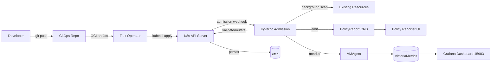

# Kyverno — Admission Policies

Kyverno is the policy engine for the duynhlab platform. It validates, mutates,
generates, verifies images, and cleans up Kubernetes resources at admission and
in the background.

## Why Kyverno

The platform is fully GitOps-driven via Flux. Drift from `kubectl edit` is rare,
so the highest-value Kyverno features are:

1. **Validate** — catch insecure manifests *before* they reach etcd
2. **Background scan** — surface violations in resources applied before Kyverno
3. **PolicyReports** — feed Grafana / policy-reporter UI for dev visibility

## Adoption matrix

| # | Feature | Adopted | Tier | Notes |
|---|---------|---------|------|-------|
| 1 | Validate | ✅ | 1 | Core use case |
| 2 | Mutate | ⚠️ partial | 3 | Labels/annotations only — never spec (Flux drift) |
| 3 | Generate | ⚠️ partial | 3 | Only `default-deny` NetworkPolicy. ConfigMap/Secret stay in Flux ResourceSet |
| 4 | Verify Images (Cosign) | ✅ planned | 2 | Layer atop Flux OCI Cosign verify |
| 5 | Cleanup Policies | ✅ | 4 | Completed/Evicted Pods > 24h |
| 6 | PolicyException | ✅ required | — | Only sanctioned way to whitelist |
| 7 | ValidatingAdmissionPolicy (CEL/VAP) | ❌ | — | Wait for K8s 1.32 GA |
| 8 | Pod Security Standards | ✅ | 1 | Baseline cluster-wide, restricted on apps |
| 9 | PolicyReport CRD | ✅ | 1 | Auto, no config |
| 10 | Policy Reporter UI | ✅ planned | 2 | `kyverno.duynh.me` |
| 11 | Background scan | ✅ | 1 | Catches pre-Kyverno resources |
| 12 | Auto-gen rules | ✅ | 1 | Default-on |
| 13 | JMESPath / context | ✅ when needed | — | Use sparingly (latency) |
| 14 | Foreach | ✅ | 1 | Required for resources/probes rules |
| 15 | `kyverno-policies` Helm chart | ❌ | — | Forked rules into repo, no chart |
| 16 | Kyverno CLI `test` | ✅ planned | 2 | CI gate in shared-workflows |
| 17 | Reports server | ❌ | — | KinD scale doesn't need it |
| 18 | Namespaced `Policy` | ✅ when needed | — | Most rules are ClusterPolicy |

**Skipped on purpose**: full `kyverno-policies` chart (avoid implicit policies),
ConfigMap/Secret generation (handled by Flux), VAP (K8s version), reports server.

## Architecture



## Repository layout

```
kubernetes/
  infra/
    controllers/kyverno/         # HelmRelease (Kyverno chart 3.3.4)
    configs/kyverno/
      cluster-policies/          # ClusterPolicy resources
      exceptions/                # PolicyException resources
  clusters/local/
    kyverno.yaml                 # Flux Kustomization for ./configs/kyverno
```

The Kyverno controller is bundled into `controllers-local` Kustomization;
policies live in their own Kustomization (`kyverno-policies-local`) so they
can be re-pushed without restarting Kyverno.

## Rollout strategy

| Phase | Duration | Action |
|-------|----------|--------|
| 0 | 1 day | Install Kyverno, no policies. Verify Flux still reconciles. |
| 1 | 7 days | Tier 1 policies in **Audit** mode. Watch `PolicyReport` via Grafana. |
| 2 | 1 day | Add `PolicyException` for legitimate operator violations. |
| 3 | indefinite | Flip Tier 1 policies to **Enforce**. |
| 4 | 14 days | Tier 2 (verifyImages, NetworkPolicy validate) in Audit. |
| 5+ | — | Tier 3 mutate/generate, Tier 4 cleanup. |

**failurePolicy** mantra:

- `Ignore` for everything during rollout
- `Fail` only for PSS baseline + image registry allowlist after enforcement is stable
- Never `Fail` on mutation webhooks (causes drift loop with Flux)

## Excluded namespaces (admission)

These namespaces are excluded from admission webhooks via `resourceFilters` in
the Helm release. Background scan still runs, so violations are reported but
never block applies.

- `kube-system`, `kube-public`, `kube-node-lease` — kubelet & control-plane
- `flux-system` — Flux reconciliation must never be blocked by Kyverno
- `kyverno` — self-protection
- `cert-manager` — webhook chains
- `external-secrets-system` — ESO controller

## Operations

### View policy reports

```bash
# Cluster-wide PolicyReports
kubectl get clusterpolicyreport -A
kubectl get policyreport -A

# Pretty summary
kubectl describe policyreport -n auth
```

### Add a new policy

1. Branch off main
2. Add `ClusterPolicy` to `kubernetes/infra/configs/kyverno/cluster-policies/`
3. Add unit tests (planned: `tests/<policy>/kyverno-test.yaml`)
4. PR with `validationFailureAction: Audit`
5. Merge → wait 7 days → review reports
6. Second PR flips to `Enforce`

### Add a PolicyException

PolicyException is the **only** sanctioned escape hatch. Required annotations:

```yaml
metadata:
  annotations:
    platform.duynhlab.dev/owner: <team>
    platform.duynhlab.dev/expires-at: "YYYY-MM-DD"
    platform.duynhlab.dev/justification: "<why>"
```

File path: `kubernetes/infra/configs/kyverno/exceptions/<name>.yaml`.

### Emergency disable

Don't delete the policy — disable it for audit trail:

```bash
kubectl annotate clusterpolicy <name> kyverno.io/disabled=true --overwrite
```

### Debug blocked admission

```bash
# Recent events
kubectl get events -A --sort-by='.lastTimestamp' | grep -i kyverno

# Kyverno admission logs
kubectl logs -n kyverno -l app.kubernetes.io/component=admission-controller --tail=200
```

## Observability

- **Metrics**: `serviceMonitor.enabled: true` in HelmRelease → VMAgent scrape →
  VictoriaMetrics → Grafana (import dashboard ID `15983`)
- **Reports**: Aggregate via `kubectl get policyreport -A` or the upcoming
  policy-reporter UI at `kyverno.duynh.me`

## References

- Policy catalog: [`docs/security/policy-catalog.md`](../security/policy-catalog.md)
- Active exceptions: [`docs/security/policy-exceptions.md`](../security/policy-exceptions.md)
- Upstream docs: <https://kyverno.io/docs/>
