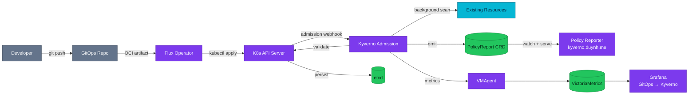
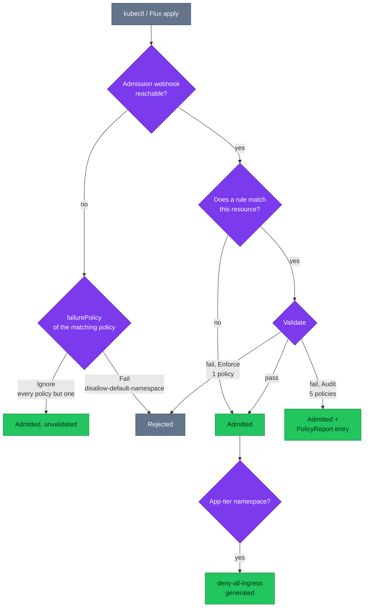

# Kyverno — Admission Policies

Kyverno is the policy engine for the duynhlab platform. It validates,
generates, and cleans up Kubernetes resources at admission and in the
background — and, with one deliberate exception, it does all of it in **Audit**
mode, so a violation is reported rather than blocked.

| | |
|---|---|
| **Chart** | `kyverno/kyverno` 3.8.2, four controllers (admission, background, cleanup, reports) |
| **Policies** | 7 deployed — 6 `ClusterPolicy` + 1 `ClusterCleanupPolicy` — plus 1 disabled. See [Policy inventory](#policy-inventory) |
| **Enforcing** | Exactly one: `disallow-default-namespace` (`failurePolicy: Fail`). The other five validating policies are Audit |
| **Exceptions** | 2 registered, both expiring 2026-12-31, accepted only from ns `kyverno` |
| **Tests** | 3 CLI fixtures under `configs/kyverno/tests/`, run by `make validate` + the `validate` CI job |
| **Reports UI** | Policy Reporter 3.9.1 at `kyverno.duynh.me` — **deployed** |
| **Flux** | `kyverno-policies-local` (`./configs/kyverno`), after `controllers-local` + `monitoring-local` |
| **Signals** | 4 ServiceMonitors · 4 alerts + 4 runbooks · chart-native Grafana dashboard |
| **Design record** | The operative manifest contract is [AGENTS.md § Kyverno admission rules](../../AGENTS.md); per-policy modes are owned by [policy-catalog.md](../security/policy-catalog.md) |

---

## Why Kyverno

The platform is fully GitOps-driven via Flux. Drift from `kubectl edit` is rare,
so the highest-value Kyverno features are:

1. **Validate** — catch insecure manifests *before* they reach etcd
2. **Background scan** — surface violations in resources applied before Kyverno
3. **PolicyReports** — read them in the **Policy Reporter UI** at `kyverno.duynh.me` (deployed; see [Reports](#observability))

## Adoption matrix

| # | Feature | Adopted | Tier | Notes |
|---|---------|---------|------|-------|
| 1 | Validate | ✅ | 1 | Core use case |
| 2 | Mutate | ❌ none | 3 | No mutate rule deployed (zero `mutate:` blocks in `cluster-policies/`). If ever added: labels/annotations only — never spec (Flux drift) |
| 3 | Generate | ⚠️ partial | 3 | Only `default-deny` NetworkPolicy. ConfigMap/Secret stay in Flux ResourceSet |
| 4 | Verify Images (Cosign) | ⏳ planned — not deployed | 2 | Layer atop Flux OCI Cosign verify |
| 5 | Cleanup Policies | ✅ | 4 | Completed/Evicted Pods > 24h |
| 6 | PolicyException | ✅ required | — | Only sanctioned way to whitelist |
| 7 | ValidatingAdmissionPolicy (CEL/VAP) | ❌ not adopted | — | No version blocker: the cluster runs Kind v1.34.3 (`scripts/kind-up.sh`) where the API is GA — the Gateway API CRD bundle already ships a `safe-upgrades` ValidatingAdmissionPolicy the cluster accepts. Candidate for CEL-only rules |
| 8 | Pod Security Standards | ✅ | 1 | Baseline cluster-wide; restricted-on-apps **disabled 2026-08-17** ([catalog — known gaps](../security/policy-catalog.md#known-gaps--history)) |
| 9 | PolicyReport CRD | ✅ | 1 | Auto, no config |
| 10 | Policy Reporter UI | ✅ | 2 | **Deployed** at `kyverno.duynh.me` — chart `kyverno/policy-reporter` 3.9.1 via `policy-reporter-local`, HTTPRoute in `routes/infra.yaml`, hostname in `scripts/setup-hosts.sh`. See [Reports](#observability) |
| 11 | Background scan | ✅ | 1 | Catches pre-Kyverno resources |
| 12 | Auto-gen rules | ✅ | 1 | Default-on |
| 13 | JMESPath / context | ✅ when needed | — | Use sparingly (latency) |
| 14 | Foreach | ✅ | 1 | Required for resources/probes rules |
| 15 | `kyverno-policies` Helm chart | ❌ | — | Forked rules into repo, no chart |
| 16 | Kyverno CLI `test` | ✅ | 3 | Gate in this repo — `make validate` + the `validate` CI job; CLI pinned to the engine (v1.18.2) |
| 17 | Reports server | ❌ | — | KinD scale doesn't need it |
| 18 | Namespaced `Policy` | ✅ when needed | — | Most rules are ClusterPolicy |
| 19 | Tracing (OTLP) | ❌ not adopted — blocked upstream of Kyverno | 3 | Metrics already answer "which policy is slow"; spans would arrive as orphan roots until **API server tracing** is enabled. [Full reasoning](#why-tracing-is-not-adopted) |

**Skipped on purpose**: full `kyverno-policies` chart (avoid implicit policies),
ConfigMap/Secret generation (handled by Flux), reports server (KinD scale).
VAP is no longer version-blocked (row 7) — unadopted by choice, not constraint.
Only row 4 (Cosign) remains **⏳ planned**: it describes intent, and nothing for
it is deployed.

## Architecture


```mermaid
flowchart LR
    Dev["Developer"] -->|"git push"| Repo["GitOps Repo"]
    Repo -->|"OCI artifact"| Flux["Flux Operator"]
    Flux -->|"kubectl apply"| API["K8s API Server"]
    API -->|"admission webhook"| Kyverno["Kyverno Admission"]
    Kyverno -->|"validate"| API
    API -->|"persist"| Etcd[("etcd")]
    Kyverno -->|"background scan"| Existing["Existing Resources"]
    Kyverno -->|"emit"| PR[("PolicyReport CRD")]
    PR -->|"watch + serve"| Reporter["Policy Reporter<br/>kyverno.duynh.me"]
    Kyverno -->|"metrics"| VMAgent["VMAgent"]
    VMAgent --> VMSingle[("VictoriaMetrics")]
    VMSingle --> Grafana["Grafana<br/>GitOps → Kyverno"]

    classDef service fill:#06b6d4,color:#082f49,stroke:#0e7490;
    classDef platform fill:#7c3aed,color:#fff,stroke:#5b21b6;
    classDef data fill:#22c55e,color:#052e16,stroke:#15803d;
    classDef external fill:#64748b,color:#fff,stroke:#334155;

    class Dev,Repo external;
    class Flux,API,Kyverno,VMAgent,Grafana,Reporter platform;
    class Etcd,PR,VMSingle data;
    class Existing service;
```

## Repository layout

```
kubernetes/
  infra/
    controllers/kyverno/          # HelmRelease (Kyverno chart 3.8.2)
    controllers/policy-reporter/  # HelmRelease (policy-reporter 3.9.1) — the reports UI
    configs/kyverno/
      cluster-policies/           # 8 active + 1 disabled — see Policy inventory
      exceptions/                 # PolicyException resources (2)
      tests/                      # Kyverno CLI fixtures (3), run by `make validate`
  clusters/local/
    kyverno.yaml                  # Kustomization kyverno-policies-local
    policy-reporter.yaml          # Kustomization policy-reporter-local
```

The Kyverno controller is bundled into the `controllers-local` Kustomization;
policies live in their own (`kyverno-policies-local`, after `controllers-local`
and `monitoring-local`) so they can be re-pushed without restarting Kyverno.

## Policy inventory

Every file under `kubernetes/infra/configs/kyverno/cluster-policies/`. This table
answers *what exists and what it does*; **per-policy tiers and prod-mode targets
are owned by [policy-catalog.md](../security/policy-catalog.md)** — do not
maintain a second copy of those here.

| Policy | Kind | Mode | `failurePolicy` | What the rule does |
|--------|------|------|-----------------|--------------------|
| `pss-baseline` | `ClusterPolicy` | Audit | `Ignore` | Pod Security Standards **baseline** on all Pods, excluding 7 control-plane/operator namespaces |
| `pss-restricted-apps` | — | **disabled 2026-08-17** | — | Commented out of the kustomization. `runAsNonRoot` fails structurally — the service images ship no non-root `USER` — so it produced 63 findings nobody could action. Re-enable conditions are in the file header |
| `disallow-latest-tag` | `ClusterPolicy` | Audit | `Ignore` | Two rules: an image must carry a tag, and that tag must not be `latest`. Covers `initContainers` and `ephemeralContainers` |
| `require-resources` | `ClusterPolicy` | Audit | `Ignore` | `foreach` container: `requests.cpu`, `requests.memory`, `limits.memory` must be set. Scoped to the 10 app namespaces |
| `require-probes` | `ClusterPolicy` | Audit | `Ignore` | `foreach` container: `livenessProbe` + `readinessProbe` required. Job-owned Pods excluded, autogen off |
| `disallow-default-namespace` | `ClusterPolicy` | **Enforce** | **`Fail`** | A Pod may not land in `default`. The only policy that blocks an apply |
| `default-deny-networkpolicy` | `ClusterPolicy` | Generate | n/a | On a namespace labelled `platform.duynhlab.dev/tier: app`, generates a `deny-all-ingress` NetworkPolicy, `generateExisting: true`, `synchronize: true` |
| `cleanup-completed-pods` | `ClusterCleanupPolicy` | Cleanup | n/a | Deletes `Succeeded`/`Failed` Pods older than 24 h, every 30 minutes |
| `cleanup-controller-rbac` | `ClusterRole` | n/a | n/a | **Not a policy** — the aggregated role that lets the cleanup controller delete Pods |

Two things about this table are easy to misread:

- **Audit is not a rollout accident.** Only `disallow-default-namespace`
  enforces, and that is the current intended state (see
  [Rollout strategy](#rollout-strategy)). A failing Audit policy is a
  `PolicyReport` entry, not a rejected apply.
- **`failurePolicy: Ignore` means a broken webhook fails open.** If the
  admission controller is down, applies succeed unvalidated. Only
  `disallow-default-namespace` (`Fail`) would block, which is why it is the one
  policy safe to enforce on a single-replica cluster.

### How an admission request is decided

One question only: what happens to a single `apply`. Background scan and the
cleanup policy are separate paths, described above and below.


```mermaid
flowchart TD
  apply["kubectl / Flux apply"] --> reachable{"Admission webhook<br/>reachable?"}
  reachable -->|"no"| fp{"failurePolicy<br/>of the matching policy"}
  fp -->|"Ignore<br/>every policy but one"| open["Admitted, unvalidated"]
  fp -->|"Fail<br/>disallow-default-namespace"| reject["Rejected"]
  reachable -->|"yes"| match{"Does a rule match<br/>this resource?"}
  match -->|"no"| admit["Admitted"]
  match -->|"yes"| verdict{"Validate"}
  verdict -->|"pass"| admit
  verdict -->|"fail, Audit<br/>5 policies"| audited["Admitted +<br/>PolicyReport entry"]
  verdict -->|"fail, Enforce<br/>1 policy"| reject
  admit --> gen{"App-tier namespace?"}
  gen -->|"yes"| np["deny-all-ingress<br/>generated"]

  classDef platform fill:#7c3aed,color:#fff,stroke:#5b21b6;
  classDef data fill:#22c55e,color:#052e16,stroke:#15803d;
  classDef external fill:#64748b,color:#fff,stroke:#334155;
  class apply external
  class reachable,fp,match,verdict,gen platform
  class admit,open,audited,np data
  class reject external
```

The two paths worth remembering: an **unreachable webhook** admits almost
everything unvalidated, and an **Audit failure still admits** — it only writes a
report.

## Exceptions

Two are registered. Both are accepted only when the `PolicyException` object
itself lives in namespace `kyverno`, so an app team cannot self-waive by
shipping one alongside its workload.

| Exception | Waives | For | Expires |
|-----------|--------|-----|---------|
| `openbao` | `pss-baseline` (+ autogen) | Pods in ns `openbao` — OpenBAO needs `IPC_LOCK` for `mlock` | 2026-12-31 |
| `postgres-operators` | `pss-baseline` + `require-resources` (+ autogen) | CNPG operator and instance Pods in ns `cloudnative-pg`, `platform`, `product` | 2026-12-31 |

The workflow for adding or retiring one — including the required annotations —
is owned by [policy-exceptions.md](../security/policy-exceptions.md). The Envoy
Gateway data plane deliberately needs **no** exception: its listeners bind
10080/10443, above the privileged-port boundary.

## Rollout strategy

| Phase | Duration | Action |
|-------|----------|--------|
| 0 | 1 day | Install Kyverno, no policies. Verify Flux still reconciles. |
| 1 | 7 days | Tier 1 policies in **Audit** mode. Watch `PolicyReport` via Grafana. |
| 2 | 1 day | Add `PolicyException` for legitimate operator violations. |
| 3 | indefinite | Flip Tier 1 policies to **Enforce**. *(Current state: still **Audit** for every Tier-1 policy except `disallow-default-namespace`, which is Enforce.)* |
| 4 | 14 days | Tier 2 (verifyImages, NetworkPolicy validate) in Audit. |
| 5+ | — | Tier 3 mutate/generate, Tier 4 cleanup. |

**failurePolicy** mantra:

- `Ignore` for everything during rollout
- `Fail` only for PSS baseline + image registry allowlist after enforcement is stable
- Never `Fail` on mutation webhooks (causes drift loop with Flux)

## Excluded namespaces (admission)

These namespaces are excluded from admission webhooks via `resourceFilters` in
the Helm release. Background scan still runs, so violations are reported but
never block applies.

- `kube-system`, `kube-public`, `kube-node-lease` — kubelet & control-plane
- `flux-system` — Flux reconciliation must never be blocked by Kyverno
- `kyverno` — self-protection
- `cert-manager` — webhook chains
- `external-secrets-system` — ESO controller

## Operations

### View policy reports

Browsable at **`kyverno.duynh.me`** (Policy Reporter — see [Observability](#observability)).
The Kyverno plugin is what makes a failing result name the policy that failed,
rather than just the rule id.

The CLI still works and is the fallback when the UI is down:

```bash
# Cluster-wide PolicyReports
kubectl get clusterpolicyreport -A
kubectl get policyreport -A

# Pretty summary — pick a namespace that exists (auth was retired with RFC-0024)
kubectl describe policyreport -n product
```

### Add a new policy

1. Branch off main
2. Add `ClusterPolicy` to `kubernetes/infra/configs/kyverno/cluster-policies/`
3. Add unit tests at `kubernetes/infra/configs/kyverno/tests/<policy>/` — a
   `kyverno-test.yaml` plus a `resources.yaml`. Cover a **pass** case, a **fail**
   case, and, where a `PolicyException` applies, the **skip** case; `make
   validate` runs them and fails the PR if any expectation moves
4. PR with `validationFailureAction: Audit`
5. Merge → wait 7 days → review reports
6. Second PR flips to `Enforce`

### Add a PolicyException

PolicyException is the **only** sanctioned escape hatch — never loosen the policy
itself. The object goes in `kubernetes/infra/configs/kyverno/exceptions/` and must
live in namespace `kyverno` to be accepted.

The required annotations and the full add/retire workflow are owned by
[policy-exceptions.md § Workflow](../security/policy-exceptions.md); the two
active exceptions are listed in [Exceptions](#exceptions) above.

### Emergency disable

Don't delete the policy — disable it for audit trail:

```bash
kubectl annotate clusterpolicy <name> kyverno.io/disabled=true --overwrite
```

### Debug blocked admission

```bash
# Recent events
kubectl get events -A --sort-by='.lastTimestamp' | grep -i kyverno

# Kyverno admission logs
kubectl logs -n kyverno -l app.kubernetes.io/component=admission-controller --tail=200
```

## Verification runbook

Run after any change under `configs/kyverno/`, and as the first step when
admission behaves unexpectedly.

### Step 1: The four controllers are up

```bash
kubectl -n kyverno get deploy
kubectl -n flux-system get kustomization kyverno-policies-local
```

**Expected**: four Deployments — admission, background, cleanup, reports — each
`1/1`. The Kustomization is `Ready=True`. If admission is `0/1`, remember the
eight `Ignore` policies are now failing open.

### Step 2: The webhooks are registered

```bash
kubectl get validatingwebhookconfigurations | grep kyverno
kubectl get clusterpolicy
```

**Expected**: Kyverno's validating webhook configurations exist, and
`kubectl get clusterpolicy` lists **6** ClusterPolicies. Two things deliberately
do not appear: `pss-restricted-apps` (commented out of the kustomization) and
`cleanup-completed-pods` (a `ClusterCleanupPolicy`, queried below).

```bash
kubectl get clustercleanuppolicy
```

**Expected**: `cleanup-completed-pods`, `Ready`.

### Step 3: Only one policy enforces

```bash
kubectl get clusterpolicy -o custom-columns='NAME:.metadata.name,ACTION:.spec.validationFailureAction,FAILPOL:.spec.failurePolicy'
```

**Expected**: `disallow-default-namespace` is `Enforce`/`Fail`; every other row is
`Audit`/`Ignore`. A second `Enforce` row that nobody planned is a regression —
compare against [Policy inventory](#policy-inventory).

### Step 4: The Enforce policy actually blocks

```bash
kubectl run kyverno-probe --image=nginx:1.29-alpine -n default --dry-run=server
```

**Expected**: the apply is **rejected**, citing `disallow-default-namespace`. A
success here means either the webhook is not registered or the policy has drifted
to Audit — both are silent failures otherwise. (`--dry-run=server` runs admission
without creating anything.)

### Step 5: Reports exist and are readable

```bash
kubectl get clusterpolicyreport,policyreport -A | head
kubectl get policyreport -n product -o wide
```

**Expected**: reports present, with `PASS`/`FAIL` counts. Audit-mode failures
appear here rather than blocking; browse them at `kyverno.duynh.me`.

### Step 6: The generate rule produced its NetworkPolicy

```bash
kubectl get networkpolicy -A -l 'generate.kyverno.io/policy-name=default-deny-networkpolicy'
kubectl get ns -l platform.duynhlab.dev/tier=app --no-headers | wc -l
```

**Expected**: one `deny-all-ingress` per app-tier namespace — the two counts
match. A missing one means the background controller has not reconciled that
namespace.

### Step 7: The policy fixtures pass

```bash
make validate      # includes the Kyverno CLI test fixtures
```

**Expected**: the three fixtures under `configs/kyverno/tests/`
(`disallow-default-namespace`, `require-probes`, `require-resources`) all pass.
This is the same gate the `validate` CI job runs, with the CLI pinned to engine
v1.18.2.

### Step 8: Metrics are actually arriving

```bash
kubectl -n kyverno get servicemonitor
```

**Expected**: **four** ServiceMonitors, one per controller. Zero is the specific
failure this platform has already hit once — see the nesting note under
[Observability](#observability).

## Troubleshooting

### An apply was rejected and the message names Kyverno

```bash
kubectl get events -A --sort-by='.lastTimestamp' | grep -i kyverno | tail -20
kubectl logs -n kyverno -l app.kubernetes.io/component=admission-controller --tail=200
```

Only `disallow-default-namespace` can reject on policy grounds. If the rejection
names anything else, a policy has drifted out of Audit — check
[Step 3](#step-3-only-one-policy-enforces).

### A policy reports `error` instead of pass or fail

The rule threw rather than reaching a verdict — usually a JMESPath expression
resolving against a field that is absent. `require-probes` hit exactly this with
Pods that have no `ownerReferences`, found by its own test fixture; the fix was a
`|| []` default in the precondition. Reproduce it locally against the fixture
before changing the policy.

### Nothing is being reported at all

Check the background and reports controllers, not the admission one — Audit-mode
verdicts and pre-existing resources both come from background scan.

```bash
kubectl -n kyverno logs -l app.kubernetes.io/component=background-controller --tail=100
kubectl -n kyverno logs -l app.kubernetes.io/component=reports-controller --tail=100
```

### `kyverno.duynh.me` does not resolve or returns 403

The route is CIDR-fenced like the other admin UIs. Confirm the hostname is in
`/etc/hosts` (`scripts/setup-hosts.sh`) and that you are reaching it from an
allowed source. Enforcement is unaffected — see the Reports bullet under
[Observability](#observability).

### Failure modes worth knowing

| Symptom | Cause | Signal |
|---------|-------|--------|
| Applies succeed but nothing is validated | Admission controller down; every policy except `disallow-default-namespace` is `failurePolicy: Ignore` and fails open | `KyvernoControllerDown`; `kubectl -n kyverno get deploy` |
| A legitimate manifest is blocked | It landed in `default` — the one Enforce policy | Rejection message names `disallow-default-namespace` |
| Zero `kyverno_*` series in VictoriaMetrics | `serviceMonitor` set at the top level of Helm values instead of per controller; chart 3.8.2 ignores it silently | `kubectl -n kyverno get servicemonitor` returns nothing |
| Audit findings nobody can action | A policy the platform structurally cannot satisfy — what took `pss-restricted-apps` out | Rising `FAIL` counts with no owner |
| A new app namespace has no default-deny | Missing `platform.duynhlab.dev/tier: app` label, so the generate rule never matched | [Step 6](#step-6-the-generate-rule-produced-its-networkpolicy) counts disagree |
| Exception stops working | `PolicyException` was created outside ns `kyverno` | Findings reappear for an exempted workload |

## Observability

- **Metrics**: `serviceMonitor.enabled: true` **under each of the four
  controllers** in the HelmRelease → 4 ServiceMonitors → VM operator converts to
  VMServiceScrape → VMAgent (`selectAllByDefault`) → VictoriaMetrics. Jobs are
  the Service names: `kyverno-svc-metrics` (admission),
  `kyverno-background-controller-metrics`,
  `kyverno-cleanup-controller-metrics`, `kyverno-reports-controller-metrics`.
  > The nesting is the whole point. Until 2026-08-21 this file described metrics
  > as solved while the values set `metricsService` and `serviceMonitor` at the
  > **top level**, which chart 3.8.2 does not define — Helm accepted them,
  > ignored them, and the cluster carried zero ServiceMonitors and zero
  > `kyverno_*` series.
- **Dashboard**: chart-native. `grafana.enabled` + `grafana.grafanaDashboard.create`
  render a ConfigMap plus a `GrafanaDashboard` CR whose `matchLabels` already
  match this platform's Grafana `instanceSelector`; it lands in the **GitOps**
  folder. No vendored JSON, so nothing to drift — the same reasoning as
  cert-manager's chart-native ServiceMonitor.
- **Alerts**: 4, in [`prometheusrules/kyverno/alerts.yaml`](../../kubernetes/infra/configs/observability/metrics/prometheusrules/kyverno/alerts.yaml),
  catalogued at [`alert-catalog.md` § 6b](../observability/alerting/alert-catalog.md#6b-kyverno-admission)
  with one runbook each under [`runbooks/kyverno/`](../observability/runbooks/kyverno/README.md).
- **Logs**: nothing to wire. Vector tails every pod that does not carry
  `platform.duynhlab.dev/otlp-logs=true`, so Kyverno's stdout is already in
  VictoriaLogs (`namespace:"kyverno"`). Only `level` is lifted to a queryable
  field; promoting other JSON keys would need a container-scoped merge branch in
  Vector's `add_labels`, as the Envoy access log has — a known gap, not done.
- **Tracing**: **not enabled, and the reason is not cost** — see
  [Why tracing is not adopted](#why-tracing-is-not-adopted) after this list.
- **Reports**: **Policy Reporter** at `kyverno.duynh.me` — chart
  `kyverno/policy-reporter` 3.9.1, delivered by the `policy-reporter-local`
  Kustomization (`controllers/policy-reporter`). Three Deployments: the core
  (watches PolicyReports, serves the REST API and Prometheus metrics), the **UI**,
  and the **Kyverno plugin**. `kubectl get policyreport -A` still works and is the
  fallback the `PolicyReporterDown` alert points at.
  - **What the plugin buys.** Without it the UI lists *results*: a resource, a
    rule name, a status. With it a result resolves back to the policy behind it —
    verified on this cluster, `GET /v1/policies` on the plugin returns each
    `ClusterPolicy` with its title, category, severity and description, which is
    what turns "`require-resources` failed" into something actionable.
  - **Admin surface, fenced like its siblings.** The route lives in
    `configs/envoy-gateway/routes/infra.yaml` beside the Flux, RustFS and OpenBAO
    UIs, and carries the same CIDR fence (`policies/security-admin-cidr.yaml`) and
    admin rate limit (`policies/btp-admin.yaml`). Both target same-namespace
    routes only, so each gained a `policy-reporter` block — an entry in the
    `monitoring` one would not have applied.
  - **Enforcement is unaffected if it is down.** Kyverno keeps admitting and keeps
    writing reports; only the browsable view stops. That is why
    `PolicyReporterDown` is `warning`, not `critical`.

### Why tracing is not adopted

Recorded because the question keeps coming back, and because the first version of
this note answered it wrongly.

**The reason is not span volume or effort. It is that there is nothing for the
spans to attach to.**

Tracing earns its cost when a span can be *correlated* — when the admission call
is one segment of a larger request's trace. Nothing on this cluster puts trace
context into an admission request:

| Producer | Emits traces? |
|---|---|
| Envoy Gateway (edge) | ✅ OTLP gRPC to the collector |
| Keycloak | ✅ `KC_TRACING_ENABLED` |
| The 10 Go services | ✅ via `pkg/obsx` |
| **Kubernetes API server** | ❌ no `TracingConfiguration` in `scripts/kind-up.sh` or `clusters/local/` |
| **Flux / `kubectl`** | ❌ do not propagate trace context into admission |

So Kyverno spans would arrive as **orphan roots** — a pile of parentless spans
that join nothing.

**And the question tracing was going to answer is already answered.** The first
version of this note claimed tracing would "show per-policy latency inside
admission". It would, but so do the metrics that shipped in the same train, with
percentiles and eight dimensions:

```promql
histogram_quantile(0.99,
  sum by (le, policy_name, rule_name) (
    rate(kyverno_policy_execution_duration_seconds_bucket[5m])
  )
)
```

`kyverno_policy_execution_duration_seconds` carries `policy_name`, `rule_name`,
`rule_type`, `rule_result`, `resource_kind`, `policy_validation_mode`, `dry_run`
and `rule_execution_cause`. For "which policy is slow, on which kind", an
aggregate histogram is the better instrument, not the worse one.

**The prerequisite, if this is ever revisited:** enable API server tracing
(`TracingConfiguration` pointing at
`otel-collector-opentelemetry-collector.monitoring.svc:4317`) *first*. Until
admission is part of a real trace, Kyverno tracing adds a surface to audit and
returns spans nobody can follow.

**And when it is enabled, mind the nesting.** Chart 3.8.2 defines `tracing:`
**four times — once per controller** (`admissionController`,
`backgroundController`, `cleanupController`, `reportsController`), exactly like
`serviceMonitor`. Setting it at the top level of `values` is accepted by Helm and
silently ignored — the failure that left this cluster with zero ServiceMonitors
while the manifest read as if metrics were solved. Verify against the rendered
Deployment, never the values file.

## References

- Policy catalog (per-policy tiers and prod-mode targets): [`docs/security/policy-catalog.md`](../security/policy-catalog.md)
- Exception registry and workflow: [`docs/security/policy-exceptions.md`](../security/policy-exceptions.md)
- The operative manifest contract every change must satisfy: [AGENTS.md § Kyverno admission rules](../../AGENTS.md)
- Security area hub: [`docs/security/README.md`](../security/README.md)
- Alert rows and runbooks: [`alert-catalog.md` § 6b](../observability/alerting/alert-catalog.md#6b-kyverno-admission) · [`runbooks/kyverno/`](../observability/runbooks/kyverno/README.md)
- Upstream docs: <https://kyverno.io/docs/>

---

_Last updated: 2026-08-24 — refactored to the house shape: adds a quick-facts table, a **Policy inventory** (the doc previously named no policy file at all), a decision-path diagram, an exceptions table, an 8-step verification runbook, and troubleshooting by symptom with a failure-modes table. Corrects a self-contradiction: the adoption matrix called Policy Reporter “planned — not deployed” while three other sections, the HelmRelease, the HTTPRoute and `setup-hosts.sh` all say it is live — the architecture diagram's `planned` node is gone with it. The PolicyException YAML block now delegates to `policy-exceptions.md` instead of duplicating it._

_2026-08-21 — added row 19 (Tracing, not adopted) and a **Why tracing is not adopted** section: the blocker is upstream of Kyverno (no API server `TracingConfiguration`, so spans would be orphan roots), and the per-policy latency question tracing was going to answer is already answered by `kyverno_policy_execution_duration_seconds`, which carries `policy_name` + `rule_name`. Also records that the chart defines `tracing:` per controller, the same nesting trap that left the cluster with zero ServiceMonitors. Previously — CLI `test` row flipped to adopted: policy fixtures live at `configs/kyverno/tests/` and run in `make validate` + the `validate` CI job, with the CLI pinned to the engine (v1.18.2). Their first run found `require-probes` reporting `error` rather than a verdict for Pods with no ownerReferences._

_2026-08-19 — adoption matrix trued up: Mutate is not deployed, VAP is no longer version-blocked (Kind v1.34.3), planned rows (Cosign, Policy Reporter UI, CLI test) marked ⏳ not-deployed; architecture diagram moved to the house palette._
