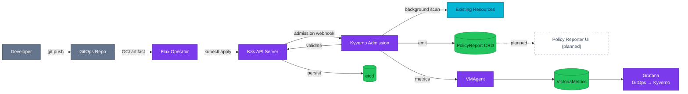

# Kyverno — Admission Policies

Kyverno is the policy engine for the duynhlab platform. It validates, mutates,
generates, verifies images, and cleans up Kubernetes resources at admission and
in the background.

## Why Kyverno

The platform is fully GitOps-driven via Flux. Drift from `kubectl edit` is rare,
so the highest-value Kyverno features are:

1. **Validate** — catch insecure manifests *before* they reach etcd
2. **Background scan** — surface violations in resources applied before Kyverno
3. **PolicyReports** — feed Grafana / policy-reporter UI for dev visibility

## Adoption matrix

| # | Feature | Adopted | Tier | Notes |
|---|---------|---------|------|-------|
| 1 | Validate | ✅ | 1 | Core use case |
| 2 | Mutate | ❌ none | 3 | No mutate rule deployed (zero `mutate:` blocks in `cluster-policies/`). If ever added: labels/annotations only — never spec (Flux drift) |
| 3 | Generate | ⚠️ partial | 3 | Only `default-deny` NetworkPolicy. ConfigMap/Secret stay in Flux ResourceSet |
| 4 | Verify Images (Cosign) | ⏳ planned — not deployed | 2 | Layer atop Flux OCI Cosign verify |
| 5 | Cleanup Policies | ✅ | 4 | Completed/Evicted Pods > 24h |
| 6 | PolicyException | ✅ required | — | Only sanctioned way to whitelist |
| 7 | ValidatingAdmissionPolicy (CEL/VAP) | ❌ not adopted | — | No version blocker: the cluster runs Kind v1.34.3 (`scripts/kind-up.sh`) where the API is GA — the Gateway API CRD bundle already ships a `safe-upgrades` ValidatingAdmissionPolicy the cluster accepts. Candidate for CEL-only rules |
| 8 | Pod Security Standards | ✅ | 1 | Baseline cluster-wide; restricted-on-apps **disabled 2026-08-17** ([catalog — known gaps](../security/policy-catalog.md#known-gaps--history)) |
| 9 | PolicyReport CRD | ✅ | 1 | Auto, no config |
| 10 | Policy Reporter UI | ⏳ planned — not deployed | 2 | Target `kyverno.duynh.me` — today there is no HelmRelease, no HTTPRoute, and the hostname is not in `scripts/setup-hosts.sh` |
| 11 | Background scan | ✅ | 1 | Catches pre-Kyverno resources |
| 12 | Auto-gen rules | ✅ | 1 | Default-on |
| 13 | JMESPath / context | ✅ when needed | — | Use sparingly (latency) |
| 14 | Foreach | ✅ | 1 | Required for resources/probes rules |
| 15 | `kyverno-policies` Helm chart | ❌ | — | Forked rules into repo, no chart |
| 16 | Kyverno CLI `test` | ✅ | 3 | Gate in this repo — `make validate` + the `validate` CI job; CLI pinned to the engine (v1.18.2) |
| 17 | Reports server | ❌ | — | KinD scale doesn't need it |
| 18 | Namespaced `Policy` | ✅ when needed | — | Most rules are ClusterPolicy |

**Skipped on purpose**: full `kyverno-policies` chart (avoid implicit policies),
ConfigMap/Secret generation (handled by Flux), reports server (KinD scale).
VAP is no longer version-blocked (row 7) — unadopted by choice, not constraint.
Rows marked **⏳ planned** describe intent only; nothing for them is deployed yet.

## Architecture


```mermaid
flowchart LR
    Dev["Developer"] -->|"git push"| Repo["GitOps Repo"]
    Repo -->|"OCI artifact"| Flux["Flux Operator"]
    Flux -->|"kubectl apply"| API["K8s API Server"]
    API -->|"admission webhook"| Kyverno["Kyverno Admission"]
    Kyverno -->|"validate"| API
    API -->|"persist"| Etcd[("etcd")]
    Kyverno -->|"background scan"| Existing["Existing Resources"]
    Kyverno -->|"emit"| PR[("PolicyReport CRD")]
    PR -.->|"planned"| Reporter["Policy Reporter UI (planned)"]
    Kyverno -->|"metrics"| VMAgent["VMAgent"]
    VMAgent --> VMSingle[("VictoriaMetrics")]
    VMSingle --> Grafana["Grafana<br/>GitOps → Kyverno"]

    classDef service fill:#06b6d4,color:#082f49,stroke:#0e7490;
    classDef platform fill:#7c3aed,color:#fff,stroke:#5b21b6;
    classDef data fill:#22c55e,color:#052e16,stroke:#15803d;
    classDef external fill:#64748b,color:#fff,stroke:#334155;
    classDef planned fill:#fff,color:#475569,stroke:#64748b,stroke-dasharray:5 5;

    class Dev,Repo external;
    class Flux,API,Kyverno,VMAgent,Grafana platform;
    class Etcd,PR,VMSingle data;
    class Existing service;
    class Reporter planned;
```

## Repository layout

```
kubernetes/
  infra/
    controllers/kyverno/         # HelmRelease (Kyverno chart 3.8.2)
    configs/kyverno/
      cluster-policies/          # ClusterPolicy resources
      exceptions/                # PolicyException resources
  clusters/local/
    kyverno.yaml                 # Flux Kustomization for ./configs/kyverno
```

The Kyverno controller is bundled into `controllers-local` Kustomization;
policies live in their own Kustomization (`kyverno-policies-local`) so they
can be re-pushed without restarting Kyverno.

## Rollout strategy

| Phase | Duration | Action |
|-------|----------|--------|
| 0 | 1 day | Install Kyverno, no policies. Verify Flux still reconciles. |
| 1 | 7 days | Tier 1 policies in **Audit** mode. Watch `PolicyReport` via Grafana. |
| 2 | 1 day | Add `PolicyException` for legitimate operator violations. |
| 3 | indefinite | Flip Tier 1 policies to **Enforce**. *(Current state: still **Audit** for every Tier-1 policy except `disallow-default-namespace`, which is Enforce.)* |
| 4 | 14 days | Tier 2 (verifyImages, NetworkPolicy validate) in Audit. |
| 5+ | — | Tier 3 mutate/generate, Tier 4 cleanup. |

**failurePolicy** mantra:

- `Ignore` for everything during rollout
- `Fail` only for PSS baseline + image registry allowlist after enforcement is stable
- Never `Fail` on mutation webhooks (causes drift loop with Flux)

## Excluded namespaces (admission)

These namespaces are excluded from admission webhooks via `resourceFilters` in
the Helm release. Background scan still runs, so violations are reported but
never block applies.

- `kube-system`, `kube-public`, `kube-node-lease` — kubelet & control-plane
- `flux-system` — Flux reconciliation must never be blocked by Kyverno
- `kyverno` — self-protection
- `cert-manager` — webhook chains
- `external-secrets-system` — ESO controller

## Operations

### View policy reports

```bash
# Cluster-wide PolicyReports
kubectl get clusterpolicyreport -A
kubectl get policyreport -A

# Pretty summary
kubectl describe policyreport -n auth
```

### Add a new policy

1. Branch off main
2. Add `ClusterPolicy` to `kubernetes/infra/configs/kyverno/cluster-policies/`
3. Add unit tests at `kubernetes/infra/configs/kyverno/tests/<policy>/` — a
   `kyverno-test.yaml` plus a `resources.yaml`. Cover a **pass** case, a **fail**
   case, and, where a `PolicyException` applies, the **skip** case; `make
   validate` runs them and fails the PR if any expectation moves
4. PR with `validationFailureAction: Audit`
5. Merge → wait 7 days → review reports
6. Second PR flips to `Enforce`

### Add a PolicyException

PolicyException is the **only** sanctioned escape hatch. Required annotations:

```yaml
metadata:
  annotations:
    platform.duynhlab.dev/owner: <team>
    platform.duynhlab.dev/expires-at: "YYYY-MM-DD"
    platform.duynhlab.dev/justification: "<why>"
```

File path: `kubernetes/infra/configs/kyverno/exceptions/<name>.yaml`.

### Emergency disable

Don't delete the policy — disable it for audit trail:

```bash
kubectl annotate clusterpolicy <name> kyverno.io/disabled=true --overwrite
```

### Debug blocked admission

```bash
# Recent events
kubectl get events -A --sort-by='.lastTimestamp' | grep -i kyverno

# Kyverno admission logs
kubectl logs -n kyverno -l app.kubernetes.io/component=admission-controller --tail=200
```

## Observability

- **Metrics**: `serviceMonitor.enabled: true` **under each of the four
  controllers** in the HelmRelease → 4 ServiceMonitors → VM operator converts to
  VMServiceScrape → VMAgent (`selectAllByDefault`) → VictoriaMetrics. Jobs are
  the Service names: `kyverno-svc-metrics` (admission),
  `kyverno-background-controller-metrics`,
  `kyverno-cleanup-controller-metrics`, `kyverno-reports-controller-metrics`.
  > The nesting is the whole point. Until 2026-08-21 this file described metrics
  > as solved while the values set `metricsService` and `serviceMonitor` at the
  > **top level**, which chart 3.8.2 does not define — Helm accepted them,
  > ignored them, and the cluster carried zero ServiceMonitors and zero
  > `kyverno_*` series.
- **Dashboard**: chart-native. `grafana.enabled` + `grafana.grafanaDashboard.create`
  render a ConfigMap plus a `GrafanaDashboard` CR whose `matchLabels` already
  match this platform's Grafana `instanceSelector`; it lands in the **GitOps**
  folder. No vendored JSON, so nothing to drift — the same reasoning as
  cert-manager's chart-native ServiceMonitor.
- **Alerts**: 4, in [`prometheusrules/kyverno/alerts.yaml`](../../kubernetes/infra/configs/observability/metrics/prometheusrules/kyverno/alerts.yaml),
  catalogued at [`alert-catalog.md` § 6b](../observability/alerting/alert-catalog.md#6b-kyverno-admission)
  with one runbook each under [`runbooks/kyverno/`](../observability/runbooks/kyverno/README.md).
- **Logs**: nothing to wire. Vector tails every pod that does not carry
  `platform.duynhlab.dev/otlp-logs=true`, so Kyverno's stdout is already in
  VictoriaLogs (`namespace:"kyverno"`). Only `level` is lifted to a queryable
  field; promoting other JSON keys would need a container-scoped merge branch in
  Vector's `add_labels`, as the Envoy access log has — a known gap, not done.
- **Tracing**: not enabled. The chart exposes `tracing.*` and the collector is
  reachable at `otel-collector-opentelemetry-collector.monitoring.svc:4317`;
  adopting it would show per-policy latency inside admission. Deliberately out of
  scope for now.
- **Reports**: Aggregate via `kubectl get policyreport -A`. A policy-reporter UI
  at `kyverno.duynh.me` is planned but **not deployed** — no HelmRelease, no
  HTTPRoute, and the hostname is absent from `scripts/setup-hosts.sh`

## References

- Policy catalog: [`docs/security/policy-catalog.md`](../security/policy-catalog.md)
- Active exceptions: [`docs/security/policy-exceptions.md`](../security/policy-exceptions.md)
- Upstream docs: <https://kyverno.io/docs/>

---

_Last updated: 2026-08-21 — CLI `test` row flipped to adopted: policy fixtures live at `configs/kyverno/tests/` and run in `make validate` + the `validate` CI job, with the CLI pinned to the engine (v1.18.2). Their first run found `require-probes` reporting `error` rather than a verdict for Pods with no ownerReferences._

_2026-08-19 — adoption matrix trued up: Mutate is not deployed, VAP is no longer version-blocked (Kind v1.34.3), planned rows (Cosign, Policy Reporter UI, CLI test) marked ⏳ not-deployed; architecture diagram moved to the house palette._
