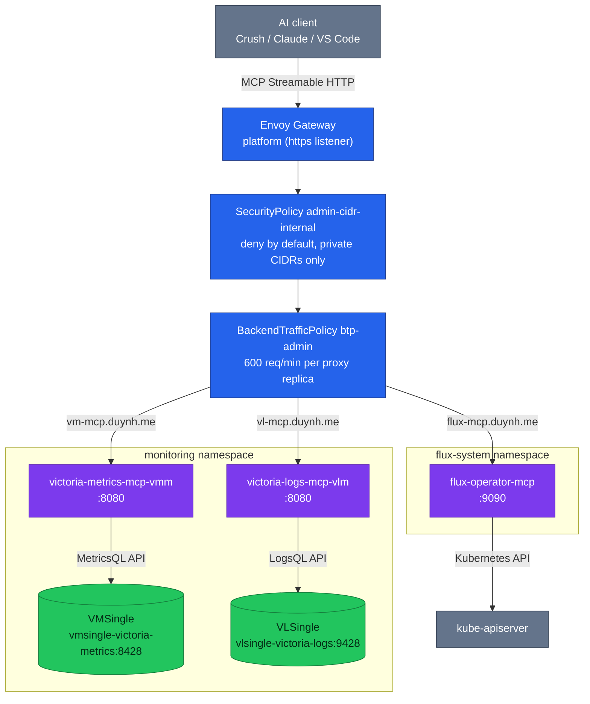

# MCP Servers for AI-Assisted Observability & GitOps

## Overview

MCP (Model Context Protocol) servers expose observability data and GitOps
operational capabilities to AI assistants. This lets AI agents query metrics,
search logs, reconcile Flux resources, and assist with debugging directly from
an IDE or CLI — against live cluster data, not stale copies.

The homelab cluster runs **3 MCP servers**, delivered by the Flux `mcp-local`
Kustomization and reachable through the Envoy Gateway edge:

| MCP Server | Purpose | Connects To | Chart | Namespace | Hostname |
|---|---|---|---|---|---|
| **victoria-metrics-mcp** | Query metrics, alerts, cardinality, rules | VMSingle | `0.3.0` | `monitoring` | `vm-mcp.duynh.me` |
| **victoria-logs-mcp** | Query logs, streams, fields | VLSingle | `0.1.0` | `monitoring` | `vl-mcp.duynh.me` |
| **flux-operator-mcp** | Flux resources, reconciliation, logs | Kubernetes API | `*` (floating OCI semver) | `flux-system` | `flux-mcp.duynh.me` |



---

## Access model

### Primary: gateway hostnames

Each MCP server has an HTTPRoute on the `platform` Gateway (`https` listener)
in `kubernetes/infra/configs/envoy-gateway/routes/mcp.yaml`:

| Hostname | HTTPRoute (namespace) | Backend Service | Port |
|---|---|---|---|
| `vm-mcp.duynh.me` | `victoria-metrics-mcp` (monitoring) | `victoria-metrics-mcp-vmm` | 8080 |
| `vl-mcp.duynh.me` | `victoria-logs-mcp` (monitoring) | `victoria-logs-mcp-vlm` | 8080 |
| `flux-mcp.duynh.me` | `flux-operator-mcp` (flux-system) | `flux-operator-mcp` | 9090 |

The hostnames resolve locally via the managed `/etc/hosts` block —
`sudo scripts/setup-hosts.sh` provisions all three alongside the other
`*.duynh.me` entries. Plain `http://` requests hit the gateway's
`https-redirect` route (301) and clients follow to the `https` listener.

Two edge policies fence these routes:

- **CIDR fence** (`kubernetes/infra/configs/envoy-gateway/policies/security-admin-cidr.yaml`):
  SecurityPolicy `admin-cidr-internal` per namespace with
  `defaultAction: Deny` and one Allow rule for private/in-cluster networks —
  `10.0.0.0/8`, `172.16.0.0/12`, `192.168.0.0/16`, `127.0.0.1/32`, `::1/128`,
  `fc00::/7`. Any other client address gets **403**. Behind the Kind
  port-forward the client address Envoy sees depends on forwarded-header
  trust, so the fence is defense-in-depth, not authentication.
- **Rate limit** (`kubernetes/infra/configs/envoy-gateway/policies/btp-admin.yaml`):
  BackendTrafficPolicy `btp-admin` applies a local rate limit of
  **600 requests/minute per proxy replica** (1200/min across the 2-replica
  fleet, ADR-045), with `X-RateLimit-*` headers (draft v03).

### Fallback: port-forward

When the gateway is down (or you are debugging it), port-forward the Services
directly:

```bash
kubectl port-forward -n monitoring svc/victoria-metrics-mcp-vmm 18080:8080 &
kubectl port-forward -n monitoring svc/victoria-logs-mcp-vlm 18081:8080 &
kubectl port-forward -n flux-system svc/flux-operator-mcp 19090:9090 &
```

Then point clients at `http://localhost:18080/mcp` etc. Note the flux MCP
NetworkPolicy only allows ingress from the `envoy-gateway` namespace —
`kubectl port-forward` still works because it tunnels through the kubelet,
not pod-network ingress.

---

## AI assistant configuration

### Crush (CLI agent — primary)

The repo-root [`.crush.json`](../../.crush.json) is committed and points at
the gateway hostnames — Crush picks it up automatically in this project:

```json
{
  "$schema": "https://charm.land/crush.json",
  "mcp": {
    "victoria-metrics": {
      "type": "http",
      "url": "http://vm-mcp.duynh.me/mcp",
      "timeout": 30
    },
    "victoria-logs": {
      "type": "http",
      "url": "http://vl-mcp.duynh.me/mcp",
      "timeout": 30
    },
    "flux-operator": {
      "type": "http",
      "url": "http://flux-mcp.duynh.me/mcp",
      "timeout": 30
    }
  }
}
```

> Project-local config merges with `~/.local/share/crush/crush.json`, so
> globally configured MCPs remain available.

Verify inside Crush with `/info` — all three servers should show
`connected (N tools, 0 resources)`.

Usage examples:

```bash
# Metrics
> "Show me top 10 metrics by cardinality"
> "List all active alerts and their severity"
> "Explain this query: rate(http_requests_total{namespace='auth'}[5m])"

# Logs
> "Show me error logs from the auth namespace in the last hour"
> "Search logs for 'connection refused' across all namespaces"

# Flux
> "Show me all failed HelmReleases"
> "Reconcile the infrastructure-local Kustomization"
```

### VS Code / Cursor

Add to `.vscode/settings.json` or Cursor settings (same hostnames):

```json
{
  "mcp": {
    "servers": {
      "victoria-metrics": { "type": "http", "url": "http://vm-mcp.duynh.me/mcp" },
      "victoria-logs": { "type": "http", "url": "http://vl-mcp.duynh.me/mcp" },
      "flux-operator": { "type": "http", "url": "http://flux-mcp.duynh.me/mcp" }
    }
  },
  "chat.mcp.enabled": true
}
```

> For VS Code: enable **Agent mode** in GitHub Copilot Chat to access MCP tools.

### Claude Desktop

Add to `~/Library/Application Support/Claude/claude_desktop_config.json`
(macOS) or `~/.config/claude/claude_desktop_config.json` (Linux):

```json
{
  "mcpServers": {
    "victoria-metrics": { "type": "http", "url": "http://vm-mcp.duynh.me/mcp" },
    "victoria-logs": { "type": "http", "url": "http://vl-mcp.duynh.me/mcp" },
    "flux-operator": { "type": "http", "url": "http://flux-mcp.duynh.me/mcp" }
  }
}
```

---

## Delivery mechanism

The servers are reconciled by the dedicated Flux Kustomization **`mcp-local`**
(`kubernetes/clusters/local/mcp.yaml`): `path: ./controllers/mcp`,
`dependsOn: monitoring-local` (the MCP servers need VMSingle/VLSingle up),
`prune: true`, `wait: false`, interval 10m.

Charts come from three OCIRepositories in
`kubernetes/clusters/local/sources/oci/` (all `interval: 10m`):

| OCIRepository | Chart URL | Pin |
|---|---|---|
| `victoria-metrics-mcp-oci` | `oci://ghcr.io/victoriametrics/helm-charts/victoria-metrics-mcp` | `semver: "0.3.0"` |
| `victoria-logs-mcp-oci` | `oci://ghcr.io/victoriametrics/helm-charts/victoria-logs-mcp` | `semver: "0.1.0"` |
| `flux-operator-mcp-oci` | `oci://ghcr.io/controlplaneio-fluxcd/charts/flux-operator-mcp` | `semver: "*"` (floating) |

The HelmReleases live in `kubernetes/infra/controllers/mcp/` and are listed in
that directory's own `kustomization.yaml` — adding a fourth server means a new
HelmRelease there plus an OCIRepository under `clusters/local/sources/oci/`,
not an edit to `controllers/kustomization.yaml`.

---

## 1. VictoriaMetrics MCP Server

### What it does

Exposes VictoriaMetrics metrics data to AI assistants:

- **Query metrics** using MetricsQL (with graph rendering if the client supports it)
- **List/export** available metrics, labels, label values, entire time series
- **Analyze alerting/recording rules** and active alerts
- **Explore cardinality** and metrics usage statistics
- **Debug** relabeling rules, downsampling, retention policy configurations
- **Trace/explain queries** for optimization

### Deployed values

Load-bearing values — full HelmRelease in
`kubernetes/infra/controllers/mcp/victoria-metrics-mcp.yaml`:

```yaml
# HelmRelease victoria-metrics-mcp (ns monitoring)
# spec: interval 30m, timeout 10m, install.remediation.retries 5
nameOverride: vmm
mcp:
  mode: http                # Streamable HTTP
vm:
  type: single
  entrypoint: "http://vmsingle-victoria-metrics.monitoring.svc:8428"
service:
  type: ClusterIP
  port: 8080
resources:
  requests: { cpu: 50m, memory: 128Mi }
  limits: { cpu: 1000m, memory: 1Gi }
livenessProbe:
  httpGet: { path: /health/liveness, port: http }
readinessProbe:
  httpGet: { path: /health/readiness, port: http }
scrape:
  enabled: false            # see callout below
```

> **Why `scrape.enabled: false`:** in `mcp.mode: http` the server exposes no
> Prometheus `/metrics` endpoint on `:8080`, so the chart's auto-created
> VMServiceScrape matched nothing and `VMAgentScrapePoolHasNoTargets` fired
> forever. The alert-ruler audit removed the scrape rather than silencing the
> alert — a scrape object with no possible target is config debt, not
> monitoring.

---

## 2. VictoriaLogs MCP Server

### What it does

Exposes VictoriaLogs log data to AI assistants:

- **Query logs** using LogsQL
- **List streams, fields, field values** for log exploration
- **Show VictoriaLogs instance parameters**
- **Query statistics** for logs-as-metrics analysis

### Deployed values

Load-bearing values — full HelmRelease in
`kubernetes/infra/controllers/mcp/victoria-logs-mcp.yaml`:

```yaml
# HelmRelease victoria-logs-mcp (ns monitoring)
# spec: interval 30m, timeout 5m, install.remediation.retries 3
nameOverride: vlm
mcp:
  mode: http
vl:
  entrypoint: "http://vlsingle-victoria-logs.monitoring.svc:9428"
service:
  type: ClusterIP
  port: 8080
resources:
  requests: { cpu: 10m, memory: 32Mi }
  limits: { cpu: 200m, memory: 128Mi }
scrape:
  enabled: true
```

---

## 3. Flux Operator MCP Server

### What it does

Enables AI assistants to interact with the Flux-managed cluster. Tools grouped
by category:

**Reporting** (read-only):
- `get_flux_instance` — Flux installation details, component status
- `get_kubernetes_resources` — Any K8s/Flux resource + status + events
- `get_kubernetes_logs` — Pod container logs
- `get_kubernetes_metrics` — CPU/Memory usage (requires metrics-server)
- `get_kubernetes_api_versions` — Registered CRDs and preferred API versions

**Reconciliation** (write):
- `reconcile_flux_source` — Trigger GitRepository/OCIRepository/HelmRepository reconciliation
- `reconcile_flux_kustomization` — Trigger Kustomization reconciliation
- `reconcile_flux_helmrelease` — Trigger HelmRelease reconciliation
- `reconcile_flux_resourceset` — Trigger ResourceSet reconciliation

**Suspend/Resume**:
- `suspend_flux_reconciliation` / `resume_flux_reconciliation`

**Cluster Operations**:
- `apply_kubernetes_manifest` — Server-side apply YAML
- `delete_kubernetes_resource` — Delete resources
- `install_flux_instance` — Install Flux from manifest URL

**Documentation**:
- `search_flux_docs` — Search Flux documentation

### Deployed values

Load-bearing values — full HelmRelease in
`kubernetes/infra/controllers/mcp/flux-operator-mcp.yaml`:

```yaml
# HelmRelease flux-operator-mcp (ns flux-system)
# spec: interval 30m, timeout 5m, serviceAccountName: flux-operator
transport: http
readonly: false             # write tools enabled (local dev cluster)
networkPolicy:
  create: true
  ingress:
    namespaces: [envoy-gateway]   # flux-mcp.duynh.me HTTPRoute is served
                                  # by the Envoy proxy fleet
rbac:
  create: true                    # cluster-admin for the MCP SA
resources:
  requests: { cpu: 10m, memory: 64Mi }
  limits: { cpu: 500m, memory: 512Mi }
securityContext:
  runAsNonRoot: true
  readOnlyRootFilesystem: true
  allowPrivilegeEscalation: false
  capabilities: { drop: ["ALL"] }
  seccompProfile: { type: "RuntimeDefault" }
```

The HelmRelease reconciles as ServiceAccount `flux-operator`
(`spec.serviceAccountName`), and the NetworkPolicy allow-list means only the
Envoy proxy fleet can reach the pod over the pod network — in-cluster clients
in other namespaces are denied.

### Security posture

- **Write tools are on** (`readonly: false`) — this is a local dev cluster; set
  `readonly: true` to disable reconcile/suspend/apply/delete tools.
- **Secret masking** is enabled by default (masks Secret values in responses).
- The gateway path adds the admin CIDR fence + rate limit on top of the
  NetworkPolicy.
- In-cluster deployment: kubeconfig context switching is disabled (single
  cluster only).

---

## History

Shipped 2026-04-15 (v0.84.0): all three HelmReleases, the `mcp-local`
Kustomization, and the OCIRepositories landed together. 2026-07-17 (#540):
the alert-ruler audit set VM MCP `scrape.enabled: false` and right-sized
resources/probes. 2026-08-12/13 (#751, #753): access moved from
port-forwards to the Envoy Gateway hostnames behind the admin CIDR fence,
and `.crush.json` switched to them.

---

## Verification

### Gateway path smoke test

From a machine with the `setup-hosts.sh` entries (client address inside the
allowed CIDRs):

```bash
curl -sk -o /dev/null -w '%{http_code}\n' https://vm-mcp.duynh.me/health/readiness   # 200
curl -sk -o /dev/null -w '%{http_code}\n' https://vl-mcp.duynh.me/health/readiness   # 200
curl -sk -o /dev/null -w '%{http_code}\n' https://flux-mcp.duynh.me/mcp              # non-403 = fence passed
```

A client outside the allow-listed CIDRs gets **403** from the
`admin-cidr-internal` SecurityPolicy; hammering past 600 req/min per proxy
replica returns **429** with `X-RateLimit-*` headers.

### Prompt-level checks

**VictoriaMetrics MCP**
- "Show me the top 10 metrics by cardinality"
- "List all active alerts"
- "Explain this query: `rate(http_requests_total[5m])`"

**VictoriaLogs MCP**
- "Show me recent error logs from the auth namespace"
- "What log streams are available?"

**Flux Operator MCP**
- "What version of Flux is running?"
- "Are there any failed Kustomizations?"
- "Reconcile the infrastructure-local Kustomization"

---

## Troubleshooting

### MCP server not connecting

```bash
# Flux delivery chain
flux get kustomization mcp-local -n flux-system
kubectl get helmrelease -n monitoring victoria-metrics-mcp victoria-logs-mcp
kubectl get helmrelease -n flux-system flux-operator-mcp

# Pods
kubectl get pods -n monitoring -l app.kubernetes.io/name=victoria-metrics-mcp
kubectl get pods -n monitoring -l app.kubernetes.io/name=victoria-logs-mcp
kubectl get pods -n flux-system -l app.kubernetes.io/name=flux-operator-mcp

# Gateway routes accepted?
kubectl get httproute -n monitoring victoria-metrics-mcp victoria-logs-mcp
kubectl get httproute -n flux-system flux-operator-mcp
```

### Crush shows "disconnected"

1. Hostname resolves? `getent hosts vm-mcp.duynh.me` (or `dscacheutil -q host -a name vm-mcp.duynh.me` on macOS) — re-run `sudo scripts/setup-hosts.sh` if missing.
2. Fence passing? `curl -sk -o /dev/null -w '%{http_code}\n' https://vm-mcp.duynh.me/mcp` — a 403 means your client address is outside the allowed CIDRs.
3. Restart Crush and check `/info` output for MCP section errors.

### VM MCP can't query metrics

- Verify `vm.entrypoint` matches the VMSingle service: `kubectl get svc -n monitoring | grep vmsingle`
- Check connectivity from the MCP pod: `kubectl exec -n monitoring <mcp-pod> -- wget -qO- http://vmsingle-victoria-metrics.monitoring.svc:8428/health`

### Flux MCP permission or network errors

- RBAC: `kubectl get clusterrolebinding | grep flux-operator-mcp`
- NetworkPolicy: remember pod-network ingress is limited to the
  `envoy-gateway` namespace — test through the hostname or a port-forward,
  not from an arbitrary pod.

---

## References

| Resource | URL |
|---|---|
| VictoriaMetrics MCP Docs | https://docs.victoriametrics.com/helm/victoria-metrics-mcp/ |
| VictoriaLogs MCP Docs | https://docs.victoriametrics.com/helm/victoria-logs-mcp/ |
| VM AI Tools Overview | https://docs.victoriametrics.com/ai-tools/ |
| Flux MCP Install Guide | https://fluxoperator.dev/docs/mcp/install/ |
| Flux MCP Tools Reference | https://fluxoperator.dev/docs/mcp/tools |
| Flux MCP Helm Chart | https://fluxoperator.dev/docs/charts/flux-operator-mcp |
| Flux MCP Configuration | https://fluxoperator.dev/docs/mcp/config |
| Crush MCP Config Docs | https://charm.land/crush (see MCP Servers section) |
| VictoriaMetrics MCP GitHub | https://github.com/VictoriaMetrics/mcp-victoriametrics |
| VictoriaLogs MCP GitHub | https://github.com/VictoriaMetrics/mcp-victorialogs |
| VM Agent Skills | https://github.com/VictoriaMetrics/skills |

---
_Last updated: 2026-08-19 — rewritten from implementation-plan voice to the deployed reality: mcp-local Kustomization delivery, gateway-hostname access model behind the admin CIDR fence (.crush.json matches), scrape.enabled=false story, real resources/probes; chart pins unchanged._
