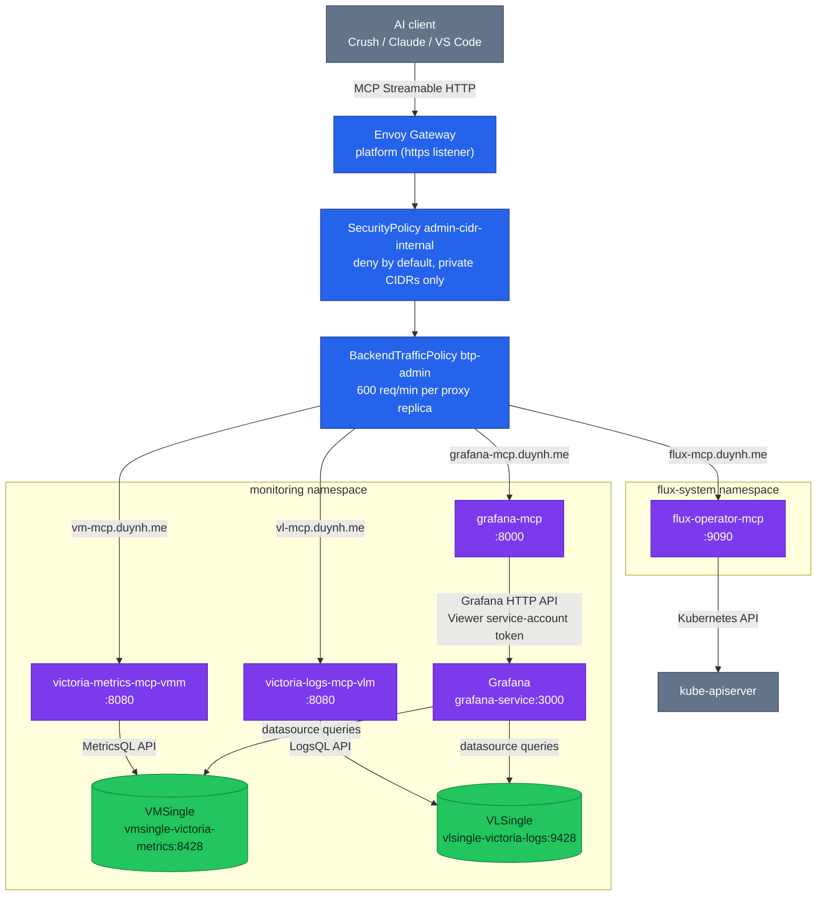

# MCP Servers for AI-Assisted Observability & GitOps

## Overview

MCP (Model Context Protocol) servers expose observability data and GitOps
operational capabilities to AI assistants. This lets AI agents query metrics,
search logs, reconcile Flux resources, and assist with debugging directly from
an IDE or CLI — against live cluster data, not stale copies.

The homelab cluster runs **4 MCP servers**, delivered by the Flux `mcp-local`
Kustomization and reachable through the Envoy Gateway edge:

| MCP Server | Purpose | Connects To | Chart | Namespace | Hostname |
|---|---|---|---|---|---|
| **victoria-metrics-mcp** | Query metrics, alerts, cardinality, rules | VMSingle | `0.3.0` | `monitoring` | `vm-mcp.duynh.me` |
| **victoria-logs-mcp** | Query logs, streams, fields | VLSingle | `0.1.0` | `monitoring` | `vl-mcp.duynh.me` |
| **flux-operator-mcp** | Flux resources, reconciliation, logs | Kubernetes API | `*` (floating OCI semver) | `flux-system` | `flux-mcp.duynh.me` |
| **grafana-mcp** | Dashboards, datasources, datasource queries, alert-rule reads | Grafana HTTP API | `0.20.0` | `monitoring` | `grafana-mcp.duynh.me` |

> **Grafana MCP was verified on a live Kind cluster on 2026-08-20.** The
> `GrafanaServiceAccount` CR reached `ServiceAccountSynchronized=True`, the
> operator wrote a `glsa_…` token into `grafana-mcp-token`, the HelmRelease went
> Ready, and the server answered an MCP handshake both in-cluster and through
> the gateway. What it exposes was checked, not assumed: **59 tools, none of
> them write tools**, and `list_datasources` returned the real datasource list.
> See [§ 4](#4-grafana-mcp) for the two convention divergences that still
> stand.



---

## Access model

### Primary: gateway hostnames

Each MCP server has an HTTPRoute on the `platform` Gateway (`https` listener)
in `kubernetes/infra/configs/envoy-gateway/routes/mcp.yaml`:

| Hostname | HTTPRoute (namespace) | Backend Service | Port |
|---|---|---|---|
| `vm-mcp.duynh.me` | `victoria-metrics-mcp` (monitoring) | `victoria-metrics-mcp-vmm` | 8080 |
| `vl-mcp.duynh.me` | `victoria-logs-mcp` (monitoring) | `victoria-logs-mcp-vlm` | 8080 |
| `flux-mcp.duynh.me` | `flux-operator-mcp` (flux-system) | `flux-operator-mcp` | 9090 |
| `grafana-mcp.duynh.me` | `grafana-mcp` (monitoring) | `grafana-mcp` | 8000 |

The hostnames resolve locally via the managed `/etc/hosts` block —
`sudo scripts/setup-hosts.sh` provisions all four alongside the other
`*.duynh.me` entries. Plain `http://` requests hit the gateway's
`https-redirect` route (301) and clients follow to the `https` listener.

Two edge policies fence these routes:

- **CIDR fence** (`kubernetes/infra/configs/envoy-gateway/policies/security-admin-cidr.yaml`):
  SecurityPolicy `admin-cidr-internal` per namespace with
  `defaultAction: Deny` and one Allow rule for private/in-cluster networks —
  `10.0.0.0/8`, `172.16.0.0/12`, `192.168.0.0/16`, `127.0.0.1/32`, `::1/128`,
  `fc00::/7`. Any other client address gets **403**. Behind the Kind
  port-forward the client address Envoy sees depends on forwarded-header
  trust, so the fence is defense-in-depth, not authentication.
- **Rate limit** (`kubernetes/infra/configs/envoy-gateway/policies/btp-admin.yaml`):
  BackendTrafficPolicy `btp-admin` applies a local rate limit of
  **600 requests/minute per proxy replica** (1200/min across the 2-replica
  fleet, ADR-045), with `X-RateLimit-*` headers (draft v03).

### Fallback: port-forward

When the gateway is down (or you are debugging it), port-forward the Services
directly:

```bash
kubectl port-forward -n monitoring svc/victoria-metrics-mcp-vmm 18080:8080 &
kubectl port-forward -n monitoring svc/victoria-logs-mcp-vlm 18081:8080 &
kubectl port-forward -n flux-system svc/flux-operator-mcp 19090:9090 &
kubectl port-forward -n monitoring svc/grafana-mcp 18000:8000 &
```

Then point clients at `http://localhost:18080/mcp` etc. Note the flux MCP
NetworkPolicy only allows ingress from the `envoy-gateway` namespace —
`kubectl port-forward` still works because it tunnels through the kubelet,
not pod-network ingress.

> **The Grafana MCP port-forward needs a Host header.** `--allowed-hosts`
> replaces the built-in localhost default rather than extending it, so a
> `localhost:18000` request is not on the list and mcp-grafana answers **403**.
> Send one of the allowed names instead:
> `curl -H 'Host: grafana-mcp:8000' http://localhost:18000/mcp`. The other
> three servers do no Host validation and need no such trick.

---

## AI assistant configuration

### Crush (CLI agent — primary)

The repo-root [`.crush.json`](../../.crush.json) is committed and points at
the gateway hostnames — Crush picks it up automatically in this project:

```json
{
  "$schema": "https://charm.land/crush.json",
  "mcp": {
    "victoria-metrics": {
      "type": "http",
      "url": "http://vm-mcp.duynh.me/mcp",
      "timeout": 30
    },
    "victoria-logs": {
      "type": "http",
      "url": "http://vl-mcp.duynh.me/mcp",
      "timeout": 30
    },
    "flux-operator": {
      "type": "http",
      "url": "http://flux-mcp.duynh.me/mcp",
      "timeout": 30
    },
    "grafana": {
      "type": "http",
      "url": "http://grafana-mcp.duynh.me/mcp",
      "timeout": 30
    }
  }
}
```

> Project-local config merges with `~/.local/share/crush/crush.json`, so
> globally configured MCPs remain available.

Verify inside Crush with `/info` — all four servers should show
`connected (N tools, 0 resources)`.

Usage examples:

```bash
# Metrics
> "Show me top 10 metrics by cardinality"
> "List all active alerts and their severity"
> "Explain this query: rate(http_requests_total{namespace='auth'}[5m])"

# Logs
> "Show me error logs from the auth namespace in the last hour"
> "Search logs for 'connection refused' across all namespaces"

# Flux
> "Show me all failed HelmReleases"
> "Reconcile the infrastructure-local Kustomization"
```

### VS Code / Cursor

Add to `.vscode/settings.json` or Cursor settings (same hostnames):

```json
{
  "mcp": {
    "servers": {
      "victoria-metrics": { "type": "http", "url": "http://vm-mcp.duynh.me/mcp" },
      "victoria-logs": { "type": "http", "url": "http://vl-mcp.duynh.me/mcp" },
      "flux-operator": { "type": "http", "url": "http://flux-mcp.duynh.me/mcp" },
      "grafana": { "type": "http", "url": "http://grafana-mcp.duynh.me/mcp" }
    }
  },
  "chat.mcp.enabled": true
}
```

> For VS Code: enable **Agent mode** in GitHub Copilot Chat to access MCP tools.

### Claude Desktop

Add to `~/Library/Application Support/Claude/claude_desktop_config.json`
(macOS) or `~/.config/claude/claude_desktop_config.json` (Linux):

```json
{
  "mcpServers": {
    "victoria-metrics": { "type": "http", "url": "http://vm-mcp.duynh.me/mcp" },
    "victoria-logs": { "type": "http", "url": "http://vl-mcp.duynh.me/mcp" },
    "flux-operator": { "type": "http", "url": "http://flux-mcp.duynh.me/mcp" },
    "grafana": { "type": "http", "url": "http://grafana-mcp.duynh.me/mcp" }
  }
}
```

---

## Delivery mechanism

The servers are reconciled by the dedicated Flux Kustomization **`mcp-local`**
(`kubernetes/clusters/local/mcp.yaml`): `path: ./controllers/mcp`,
`dependsOn: monitoring-local` (the MCP servers need VMSingle/VLSingle up),
`prune: true`, `wait: false`, interval 10m.

Charts come from four OCIRepositories in
`kubernetes/clusters/local/sources/oci/` (all `interval: 10m`):

| OCIRepository | Chart URL | Pin |
|---|---|---|
| `victoria-metrics-mcp-oci` | `oci://ghcr.io/victoriametrics/helm-charts/victoria-metrics-mcp` | `semver: "0.3.0"` |
| `victoria-logs-mcp-oci` | `oci://ghcr.io/victoriametrics/helm-charts/victoria-logs-mcp` | `semver: "0.1.0"` |
| `flux-operator-mcp-oci` | `oci://ghcr.io/controlplaneio-fluxcd/charts/flux-operator-mcp` | `semver: "*"` (floating) |
| `grafana-mcp-oci` | `oci://ghcr.io/grafana-community/helm-charts/grafana-mcp` | `semver: "0.20.0"` |

The HelmReleases live in `kubernetes/infra/controllers/mcp/` and are listed in
that directory's own `kustomization.yaml` — adding a fifth server means a new
HelmRelease there plus an OCIRepository under `clusters/local/sources/oci/`,
not an edit to `controllers/kustomization.yaml`.

The Grafana MCP has one extra ordering dependency the others do not: its token
Secret is produced by a `GrafanaServiceAccount` CR that ships with
**`monitoring-local`** (`configs/observability/grafana/`), not with `mcp-local`.
The existing `dependsOn: monitoring-local` covers it — `monitoring-local` is
`wait: true` with a health check on the Grafana CR, so Grafana is up before the
MCP is applied. What that chain does *not* guarantee is that the operator has
finished minting the token by then, since Flux's readiness check reads the CR's
status rather than the Secret. Expect the MCP pod to crash-loop briefly on a
missing `secretKeyRef` on a cold bring-up; it clears itself on the kubelet
retry once the Secret lands.

---

## 1. VictoriaMetrics MCP Server

### What it does

Exposes VictoriaMetrics metrics data to AI assistants:

- **Query metrics** using MetricsQL (with graph rendering if the client supports it)
- **List/export** available metrics, labels, label values, entire time series
- **Analyze alerting/recording rules** and active alerts
- **Explore cardinality** and metrics usage statistics
- **Debug** relabeling rules, downsampling, retention policy configurations
- **Trace/explain queries** for optimization

### Deployed values

Load-bearing values — full HelmRelease in
`kubernetes/infra/controllers/mcp/victoria-metrics-mcp.yaml`:

```yaml
# HelmRelease victoria-metrics-mcp (ns monitoring)
# spec: interval 30m, timeout 10m, install.remediation.retries 5
nameOverride: vmm
mcp:
  mode: http                # Streamable HTTP
vm:
  type: single
  entrypoint: "http://vmsingle-victoria-metrics.monitoring.svc:8428"
service:
  type: ClusterIP
  port: 8080
resources:
  requests: { cpu: 50m, memory: 128Mi }
  limits: { cpu: 1000m, memory: 1Gi }
livenessProbe:
  httpGet: { path: /health/liveness, port: http }
readinessProbe:
  httpGet: { path: /health/readiness, port: http }
scrape:
  enabled: false            # see callout below
```

> **Why `scrape.enabled: false`:** in `mcp.mode: http` the server exposes no
> Prometheus `/metrics` endpoint on `:8080`, so the chart's auto-created
> VMServiceScrape matched nothing and `VMAgentScrapePoolHasNoTargets` fired
> forever. The alert-ruler audit removed the scrape rather than silencing the
> alert — a scrape object with no possible target is config debt, not
> monitoring.

---

## 2. VictoriaLogs MCP Server

### What it does

Exposes VictoriaLogs log data to AI assistants:

- **Query logs** using LogsQL
- **List streams, fields, field values** for log exploration
- **Show VictoriaLogs instance parameters**
- **Query statistics** for logs-as-metrics analysis

### Deployed values

Load-bearing values — full HelmRelease in
`kubernetes/infra/controllers/mcp/victoria-logs-mcp.yaml`:

```yaml
# HelmRelease victoria-logs-mcp (ns monitoring)
# spec: interval 30m, timeout 5m, install.remediation.retries 3
nameOverride: vlm
mcp:
  mode: http
vl:
  entrypoint: "http://vlsingle-victoria-logs.monitoring.svc:9428"
service:
  type: ClusterIP
  port: 8080
resources:
  requests: { cpu: 10m, memory: 32Mi }
  limits: { cpu: 200m, memory: 128Mi }
scrape:
  enabled: true
```

---

## 3. Flux Operator MCP Server

### What it does

Enables AI assistants to interact with the Flux-managed cluster. Tools grouped
by category:

**Reporting** (read-only):
- `get_flux_instance` — Flux installation details, component status
- `get_kubernetes_resources` — Any K8s/Flux resource + status + events
- `get_kubernetes_logs` — Pod container logs
- `get_kubernetes_metrics` — CPU/Memory usage (requires metrics-server)
- `get_kubernetes_api_versions` — Registered CRDs and preferred API versions

**Reconciliation** (write):
- `reconcile_flux_source` — Trigger GitRepository/OCIRepository/HelmRepository reconciliation
- `reconcile_flux_kustomization` — Trigger Kustomization reconciliation
- `reconcile_flux_helmrelease` — Trigger HelmRelease reconciliation
- `reconcile_flux_resourceset` — Trigger ResourceSet reconciliation

**Suspend/Resume**:
- `suspend_flux_reconciliation` / `resume_flux_reconciliation`

**Cluster Operations**:
- `apply_kubernetes_manifest` — Server-side apply YAML
- `delete_kubernetes_resource` — Delete resources
- `install_flux_instance` — Install Flux from manifest URL

**Documentation**:
- `search_flux_docs` — Search Flux documentation

### Deployed values

Load-bearing values — full HelmRelease in
`kubernetes/infra/controllers/mcp/flux-operator-mcp.yaml`:

```yaml
# HelmRelease flux-operator-mcp (ns flux-system)
# spec: interval 30m, timeout 5m, serviceAccountName: flux-operator
transport: http
readonly: false             # write tools enabled (local dev cluster)
networkPolicy:
  create: true
  ingress:
    namespaces: [envoy-gateway]   # flux-mcp.duynh.me HTTPRoute is served
                                  # by the Envoy proxy fleet
rbac:
  create: true                    # cluster-admin for the MCP SA
resources:
  requests: { cpu: 10m, memory: 64Mi }
  limits: { cpu: 500m, memory: 512Mi }
securityContext:
  runAsNonRoot: true
  readOnlyRootFilesystem: true
  allowPrivilegeEscalation: false
  capabilities: { drop: ["ALL"] }
  seccompProfile: { type: "RuntimeDefault" }
```

The HelmRelease reconciles as ServiceAccount `flux-operator`
(`spec.serviceAccountName`), and the NetworkPolicy allow-list means only the
Envoy proxy fleet can reach the pod over the pod network — in-cluster clients
in other namespaces are denied.

### Security posture

- **Write tools are on** (`readonly: false`) — this is a local dev cluster; set
  `readonly: true` to disable reconcile/suspend/apply/delete tools.
- **Secret masking** is enabled by default (masks Secret values in responses).
- The gateway path adds the admin CIDR fence + rate limit on top of the
  NetworkPolicy.
- In-cluster deployment: kubeconfig context switching is disabled (single
  cluster only).

---

## 4. Grafana MCP

### What it does

Exposes Grafana's own APIs to AI assistants — the layer above the individual
datastores that the VM and VL MCPs speak to directly:

- **Search dashboards and datasources**, and read panel queries out of a board
- **Run datasource queries** (PromQL/MetricsQL against VMSingle, LogsQL against
  VictoriaLogs) through Grafana's datasource proxy, so the MCP inherits whatever
  datasources are provisioned
- **Read alert rules**
- **Read Sift investigations and incidents**
- **Query Pyroscope profiles** through the profiles datasource

The practical difference from the VM MCP: ask the VM MCP "what does this
MetricsQL return", ask the Grafana MCP "which dashboard panel produces this
number and what query is behind it".

### Deployed values

Load-bearing values — full HelmRelease in
`kubernetes/infra/controllers/mcp/grafana-mcp.yaml`:

```yaml
# HelmRelease grafana-mcp (ns monitoring)
# spec: interval 30m, timeout 5m, install/upgrade remediation retries 3
# chartRef: OCIRepository grafana-mcp-oci (chart 0.20.0 → mcp-grafana 1.1.0)
grafana:
  url: "http://grafana-service.monitoring.svc:3000"
  apiKeySecret:                 # → env GRAFANA_SERVICE_ACCOUNT_TOKEN
    name: grafana-mcp-token
    key: token
disableWrite: true              # → chart-rendered --disable-write
command: ["/app/mcp-grafana"]   # replaces the image ENTRYPOINT
extraArgs:
  - --transport=streamable-http
  - --address=0.0.0.0:8000
  - --allowed-hosts=grafana-mcp.monitoring.svc.cluster.local:8000,grafana-mcp.monitoring.svc:8000,grafana-mcp:8000,grafana-mcp.duynh.me
service:
  type: ClusterIP
  port: 8000
resources:
  requests: { cpu: 10m, memory: 64Mi }
  limits: { cpu: 500m, memory: 256Mi }
livenessProbe:
  tcpSocket: { port: mcp-http }
readinessProbe:
  tcpSocket: { port: mcp-http }
metrics:
  enabled: false                # same reason as the VM MCP: no empty scrape pool
serviceMonitor:
  enabled: false
```

> **Why `command` is overridden:** the upstream image's ENTRYPOINT hardcodes
> `--transport sse --address 0.0.0.0:8000`. Setting `extraArgs` alone would
> append to that, leaving SSE as the transport. Replacing the entrypoint with
> `/app/mcp-grafana` makes every flag above authoritative — confirmed by
> `helm template`, which renders our args after the chart's own
> `--disable-write` and carries no `sse` flag.

### Why `--allowed-hosts`

mcp-grafana validates the HTTP `Host` header on **every** route (`/mcp`,
`/healthz`, `/metrics`) and the default allow-list is localhost only. Without
the flag, both in-cluster service-DNS traffic and gateway traffic arrive with a
non-localhost Host and get a flat **403** — a failure that looks like a network
or policy problem and is neither. The list therefore enumerates the three
in-cluster names plus the gateway hostname.

**This couples two files.** `--allowed-hosts` and the `hostnames:` of the
`grafana-mcp` HTTPRoute in
`kubernetes/infra/configs/envoy-gateway/routes/mcp.yaml` must be edited
together; changing the route hostname alone produces a 403 that no gateway
config will explain. Both files carry a comment saying so.

### Why `tcpSocket` probes

Kubelet sends the **pod IP** as the Host header, which is not in the allow-list
above, so an `httpGet` probe against `/healthz` would get 403 and the pod would
never go Ready. Upstream documents two ways out — a wildcard host list, or
probes that do not speak HTTP. This deployment takes the second: `tcpSocket` on
the `mcp-http` port. The cost is honest and worth stating: the probes now prove
only that the listener is bound, not that the server can reach Grafana. A
Grafana outage or a revoked token shows up as failing tool calls, not as an
unready pod.

### Read-only posture

Two independent controls, both narrower than the alternative:

1. **`--disable-write`** on the server — it refuses every write tool regardless
   of what the credential could do.
2. **`role: Viewer`** on the Grafana service account.

The second one is the interesting half. Grafana here runs with
`auth.anonymous.enabled: true` and `org_role: Admin`
([grafana.yaml](../../kubernetes/infra/configs/observability/grafana/grafana.yaml)),
so an **unauthenticated** in-cluster caller already has Admin. Handing the MCP a
token is therefore not about granting access it lacks — it is about *taking
access away*: a Viewer token is strictly less than the anonymous Admin the
server would otherwise inherit by making no credential decision at all. Read
the token as a downgrade, not a grant. Confirmed on the 2026-08-20 Kind run:
`tools/list` returned 59 tools and **not one** `create_*`/`update_*`/`delete_*`
among them, so `--disable-write` removes the capability rather than merely
refusing it at call time.

### Token and Secret lifecycle

The token comes from a `GrafanaServiceAccount` CR
(`kubernetes/infra/configs/observability/grafana/grafana-service-account-mcp.yaml`),
a Grafana Operator **v5.20.0+** feature — which is why
`grafana-operator-oci` moved off its floating `>=5.0.0` range onto a hard
`5.24.0` pin in the same change. A float resolving to an older chart would drop
the CRD and break this silently. The 5.24.0 chart was unpacked to confirm
`crds/grafana.integreatly.org_grafanaserviceaccounts.yaml` is present, rather
than trusting release notes.

Shape of the CR that matters:

- `role: Viewer`, `instanceName: grafana` (the Grafana CR in the same namespace).
- One token, `name: mcp`, with an explicit `secretName: grafana-mcp-token`.
  Without `secretName` the operator generates
  `<instance>-<cr>-<token>-<random>` — a name nothing in git could reference.
- `spec.name` is **immutable**, enforced by a CEL rule in the CRD itself.
  Adding or removing it later is rejected; renaming means replacing the CR.
- `expires` is deliberately **unset**. An expiring token gets deleted and
  recreated by the operator, while the consumer reads it via env
  `secretKeyRef`, which does not hot-reload — the pod would sit on a revoked
  token until something restarted it.
- The token spec is `{name, expires, secretName}`. Note the upstream rendered
  API reference page still shows a `secondsToLive` field; that is stale
  relative to the CRD actually shipped in 5.24.0. Trust the CRD.

Operationally: the operator **owns** that Secret. Hand-edit it or delete it and
the operator prunes and recreates it; delete the CR and the Secret is
garbage-collected with it. There is no `kubectl edit` path here.

### Two divergences from platform convention

Both are deliberate. Neither should be discovered later and mistaken for an
oversight.

**1. This is the first workload credential in the platform that a controller
mints instead of OpenBAO.** Every other workload secret is materialised by
External Secrets Operator out of OpenBAO — see
`kubernetes/infra/controllers/keycloak/external-secret.yaml` for the standard
shape. This token is generated *inside* the cluster by the Grafana Operator. The
consequences are concrete: it is **not in OpenBAO**, it is **not reproducible
from `openbao-bootstrap`**, and a fresh cluster gets a *different* token value
rather than the same one restored. Nothing to restore, nothing to rotate by
hand — but also nothing to look up if you go hunting in OpenBAO for it. The
recovery procedure for a lost token is "let the operator mint another", which is
a different mental model from every other secret documented in
[`docs/secrets/`](../secrets/README.md).

**2. There is no caller authentication on the MCP endpoint.** mcp-grafana
supports it (`MCP_GRAFANA_SERVER_TOKEN`, a bearer token every client must
present) and it is **off**. The server even logs a security warning when it
binds `0.0.0.0` with no caller auth configured. That warning is expected, not a
misconfiguration to chase. The admin CIDR fence is the only access control, and
the three pre-existing MCP servers are in exactly the same position — so this is
consistency, not a new hole. It is still a real gap worth naming: anything
inside the allowed private CIDRs can read every dashboard, datasource, and query
result this server can reach.

Closing it is viable. The Crush config schema (`https://charm.land/crush.json`)
**does** support a `headers` map on `http`/`sse` MCP entries, so a client could
send `Authorization` from a token stored in OpenBAO and delivered through ESO —
which would also put this credential back on the platform's normal secrets path.
Not done, not scheduled; recorded here so the choice is legible.

---

## History

Shipped 2026-04-15 (v0.84.0): all three HelmReleases, the `mcp-local`
Kustomization, and the OCIRepositories landed together. 2026-07-17 (#540):
the alert-ruler audit set VM MCP `scrape.enabled: false` and right-sized
resources/probes. 2026-08-12/13 (#751, #753): access moved from
port-forwards to the Envoy Gateway hostnames behind the admin CIDR fence,
and `.crush.json` switched to them. 2026-08-20: the Grafana MCP joins as the
fourth server — chart `0.20.0` (mcp-grafana 1.1.0), a `GrafanaServiceAccount`
minting its Viewer token, the `grafana-operator-oci` pin tightened from a
floating `>=5.0.0` to `5.24.0` to guarantee that CRD, and the 4th HTTPRoute
added to both edge policies. Verified by `helm template`, by unpacking the
operator chart, and then **live on Kind** (CRD present, token minted, MCP
handshake 200 in-cluster and through the edge, wrong-`Host` correctly 403).

---

## Verification

### Gateway path smoke test

From a machine with the `setup-hosts.sh` entries (client address inside the
allowed CIDRs):

```bash
curl -sk -o /dev/null -w '%{http_code}\n' https://vm-mcp.duynh.me/health/readiness   # 200
curl -sk -o /dev/null -w '%{http_code}\n' https://vl-mcp.duynh.me/health/readiness   # 200
curl -sk -o /dev/null -w '%{http_code}\n' https://flux-mcp.duynh.me/mcp              # non-403 = fence passed
curl -sk -o /dev/null -w '%{http_code}\n' https://grafana-mcp.duynh.me/healthz      # 200
```

A 403 on the Grafana one is ambiguous — it is either the CIDR fence or
mcp-grafana's own Host check, and the status code is the same. Read
`kubectl logs -n monitoring deploy/grafana-mcp` to tell them apart: a rejected
Host is logged by the server, whereas a fence denial never reaches the pod.

A client outside the allow-listed CIDRs gets **403** from the
`admin-cidr-internal` SecurityPolicy; hammering past 600 req/min per proxy
replica returns **429** with `X-RateLimit-*` headers.

### Prompt-level checks

**VictoriaMetrics MCP**
- "Show me the top 10 metrics by cardinality"
- "List all active alerts"
- "Explain this query: `rate(http_requests_total[5m])`"

**VictoriaLogs MCP**
- "Show me recent error logs from the auth namespace"
- "What log streams are available?"

**Flux Operator MCP**
- "What version of Flux is running?"
- "Are there any failed Kustomizations?"
- "Reconcile the infrastructure-local Kustomization"

**Grafana MCP**
- "List the provisioned datasources"
- "Which dashboard panel shows checkout error rate, and what query does it use?"
- "Try to create a dashboard" — must be **refused** (`--disable-write` +
  Viewer); a success here means the read-only posture is not holding

---

## Troubleshooting

### MCP server not connecting

```bash
# Flux delivery chain
flux get kustomization mcp-local -n flux-system
kubectl get helmrelease -n monitoring victoria-metrics-mcp victoria-logs-mcp grafana-mcp
kubectl get helmrelease -n flux-system flux-operator-mcp

# Pods
kubectl get pods -n monitoring -l app.kubernetes.io/name=victoria-metrics-mcp
kubectl get pods -n monitoring -l app.kubernetes.io/name=victoria-logs-mcp
kubectl get pods -n monitoring -l app.kubernetes.io/name=grafana-mcp
kubectl get pods -n flux-system -l app.kubernetes.io/name=flux-operator-mcp

# Gateway routes accepted?
kubectl get httproute -n monitoring victoria-metrics-mcp victoria-logs-mcp grafana-mcp
kubectl get httproute -n flux-system flux-operator-mcp
```

### Crush shows "disconnected"

1. Hostname resolves? `getent hosts vm-mcp.duynh.me` (or `dscacheutil -q host -a name vm-mcp.duynh.me` on macOS) — re-run `sudo scripts/setup-hosts.sh` if missing.
2. Fence passing? `curl -sk -o /dev/null -w '%{http_code}\n' https://vm-mcp.duynh.me/mcp` — a 403 means your client address is outside the allowed CIDRs.
3. Restart Crush and check `/info` output for MCP section errors.

### VM MCP can't query metrics

- Verify `vm.entrypoint` matches the VMSingle service: `kubectl get svc -n monitoring | grep vmsingle`
- Check connectivity from the MCP pod: `kubectl exec -n monitoring <mcp-pod> -- wget -qO- http://vmsingle-victoria-metrics.monitoring.svc:8428/health`

### Grafana MCP 403s, or the pod will not start

Three distinct failures, in the order they are worth checking:

```bash
# 1. Does the token Secret exist at all? (owned by the operator, via the CR)
kubectl get grafanaserviceaccount -n monitoring grafana-mcp
kubectl get secret -n monitoring grafana-mcp-token
```

- **Pod in `CreateContainerConfigError`** — the Secret is missing, so the
  `secretKeyRef` cannot resolve. On a cold bring-up this is the ordering race
  described under Delivery mechanism and clears itself. If it persists, the
  operator is older than v5.20.0 (the CRD is absent — check
  `kubectl get crd grafanaserviceaccounts.grafana.integreatly.org`) or the
  `instanceName` does not match a Grafana CR in `monitoring`.
- **403 on every request** — Host header. Compare `--allowed-hosts` in the
  HelmRelease against the HTTPRoute hostname; they must agree. Also see the
  port-forward caveat above: `localhost` is *not* on the list.
- **Tool calls fail while `/healthz` is fine** — the `tcpSocket` probes cannot
  see Grafana-side problems by design, so a Ready pod proves nothing about the
  Grafana leg. Read `kubectl logs -n monitoring deploy/grafana-mcp` for 401/403
  responses from `grafana-service` (revoked or wrong token) and confirm Grafana
  itself is healthy from a pod that has a shell.

Do not repair the Secret by hand — the operator prunes and recreates it. Fix the
CR, or delete the CR and let it be recreated.

### Flux MCP permission or network errors

- RBAC: `kubectl get clusterrolebinding | grep flux-operator-mcp`
- NetworkPolicy: remember pod-network ingress is limited to the
  `envoy-gateway` namespace — test through the hostname or a port-forward,
  not from an arbitrary pod.

---

## References

| Resource | URL |
|---|---|
| VictoriaMetrics MCP Docs | https://docs.victoriametrics.com/helm/victoria-metrics-mcp/ |
| VictoriaLogs MCP Docs | https://docs.victoriametrics.com/helm/victoria-logs-mcp/ |
| VM AI Tools Overview | https://docs.victoriametrics.com/ai-tools/ |
| Flux MCP Install Guide | https://fluxoperator.dev/docs/mcp/install/ |
| Flux MCP Tools Reference | https://fluxoperator.dev/docs/mcp/tools |
| Flux MCP Helm Chart | https://fluxoperator.dev/docs/charts/flux-operator-mcp |
| Flux MCP Configuration | https://fluxoperator.dev/docs/mcp/config |
| Crush MCP Config Docs | https://charm.land/crush (see MCP Servers section) |
| VictoriaMetrics MCP GitHub | https://github.com/VictoriaMetrics/mcp-victoriametrics |
| VictoriaLogs MCP GitHub | https://github.com/VictoriaMetrics/mcp-victorialogs |
| VM Agent Skills | https://github.com/VictoriaMetrics/skills |
| Grafana MCP (mcp-grafana) GitHub | https://github.com/grafana/mcp-grafana |
| Grafana Operator Docs | https://grafana.github.io/grafana-operator/ |

---
_Last updated: 2026-08-20 — Grafana MCP added as the fourth server: chart 0.20.0 (mcp-grafana 1.1.0), entrypoint override + `--allowed-hosts` + tcpSocket probes explained, Viewer service-account token read as a downgrade from anonymous Admin, and the two convention divergences stated plainly (operator-minted credential outside OpenBAO; no caller auth behind the CIDR fence). `grafana-operator-oci` pin 5.24.0 recorded. Verified live on Kind the same day: operator v5.24.0 ships the CRD, the SA synchronized, the token landed, 59 tools with no write tool, handshake 200 in-cluster and via the gateway, wrong-`Host` 403._
