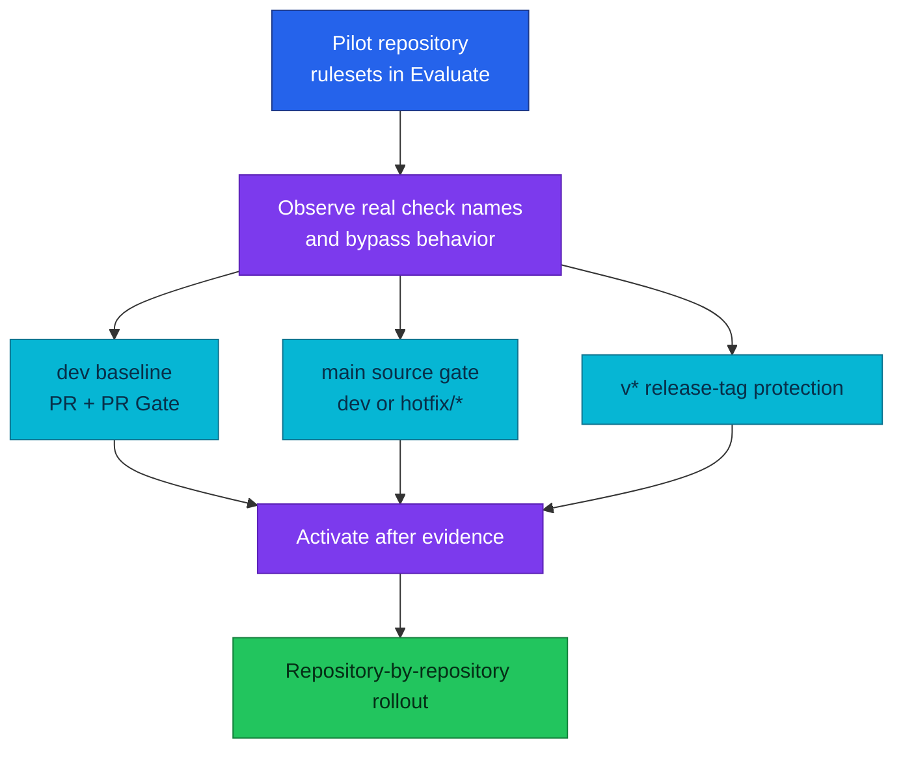

# GitHub ruleset automation

`duynhlab/gh-patcher` applies a baseline repository ruleset across the
organization; CI/CD v2 adds explicit `dev`, `main`, and release-tag controls
that must be proven on a pilot before fleet rollout.

| Fact | Value |
|------|-------|
| Automation owner | Private `duynhlab/gh-patcher` repository |
| Execution | Scheduled and manually dispatchable |
| Baseline | PR review, required checks, no deletion, no force-push |
| v2 required context | `check / PR Gate`, subject to pilot verification |
| Scope gap | Production-source and `v*` tag rules may require manual per-repo configuration |
| Rollout state | CI/CD v2 consumer adoption not started |

## Ruleset layers

GitHub derives a reusable workflow's status context from the caller **job ID**
and the called job name. The candidate caller job ID is `check`, and the
reusable workflow's aggregate job is `PR Gate`, so the expected context is
`check / PR Gate`. Treat that string as a hypothesis until `gh pr checks` on a
real consumer PR confirms it.

## gh-patcher configuration

| Variable | Purpose | Candidate value |
|----------|---------|-----------------|
| `GITHUB_TOKEN` | Fine-grained token with repository administration access | Stored as `GH_PATCHER_TOKEN` |
| `GITHUB_ORG` | Organization to reconcile | `duynhlab` |
| `REPO_PATTERN` | Repositories to include | `.*-service frontend pkg` |
| `REPO_EXCLUDE_PATTERN` | Repositories to omit | `^auth-service$` |
| `STATUS_CHECK_CONTEXTS` | Required status contexts | `check / PR Gate` after pilot confirmation |
| `DRY_RUN` | Preview without mutation | `true` during migration |

The token should receive only the repository administration and metadata access
needed by the tool. Its exact payload and schedule are owned and verified in the
private `gh-patcher` repository, not inferred from homelab.

## Rollout procedure

1. Merge and version `gha-workflows` v2.
2. Install the four immutable-pinned callers in one service repository.
3. Create `dev` and run the complete PR, dev artifact, main promotion, release,
   and main-to-dev synchronization lifecycle.
4. Read the exact context from `gh pr checks`; update
   `STATUS_CHECK_CONTEXTS` if it differs.
5. Apply rulesets in Evaluate mode and inspect rule insights and bypasses.
6. Activate `dev`, `main`, and tag rules only when the observed behavior matches
   [`gitflow.md`](gitflow.md).
7. Expand the repository selector in small batches and retain a rollback record
   of the previous ruleset payload.

`homelab` itself has repository-specific checks such as manifest validation and
Markdown links. Do not overwrite those with a Go-service check list.

## Verification

- A direct push and force-push to both long-lived branches are rejected.
- A PR cannot merge while the aggregate PR Gate is failing or pending.
- `main` rejects an ordinary topic branch at both workflow and review-policy
  layers.
- Unauthorized users cannot create, move, or delete `v*` tags.
- A hotfix synchronization PR triggers its checks when created with
  `SYNC_BRANCH_TOKEN`.
- Archived repositories and intentionally excluded repositories remain
  unchanged.

## References

- [Git workflow](gitflow.md)
- [CI/CD trust gates](cicd.md)
- [GitHub rulesets](https://docs.github.com/en/repositories/configuring-branches-and-merges-in-your-repository/managing-rulesets/about-rulesets)

_Last updated: 2026-08-31._
