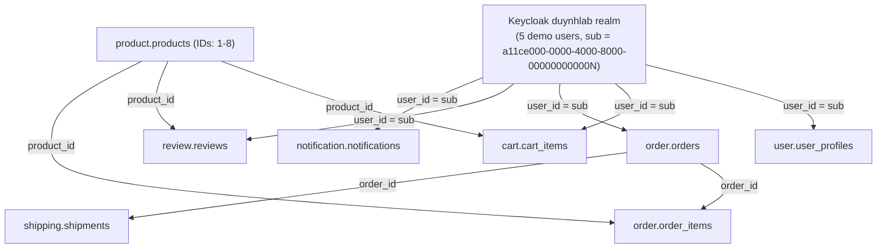

# Setup Guide - GitOps with Flux Operator

Comprehensive guide to deploying the microservices platform using **GitOps**, **Flux Operator**, and **Kustomize** on Kind (Kubernetes in Docker).

---

## Command Reference

### Quick Start (Makefile)

- **Bootstrap Environment**: `make up` (cluster-up + flux-push + flux-up — the OCI registry is pushed **before** the Flux bootstrap so the first reconcile finds the manifests)
- **Synchronize Changes**: `make sync` (flux-push + flux-sync)
- **Tear Down Environment**: `make down` (cluster-down)
- **Validate Manifests**: `make validate`

### Detailed Commands (Makefile)

- **Cluster Management**: `make cluster-up`, `make cluster-down`
- **Flux Operations**: `make flux-up`, `make flux-push`, `make flux-sync`, `make flux-status`, `make flux-logs`, `make flux-ui`
- **OpenTofu (Flux bootstrap)**: `make tf-init`, `make tf-plan`, `make tf-apply`, `make tf-destroy`
- **Utilities**: `make prereqs`, `make help`

---

## Workspace Configuration (Polyrepo)

Since the project utilizes a polyrepo architecture, you must clone all component repositories to facilitate local development.

### 1. Initialize Workspace Directory

```bash
mkdir -p ~/Working/duynhlab
cd ~/Working/duynhlab
```

### 2. Clone Repositories

Execute the following script to clone all required components:

```bash
# Infrastructure Repositories
git clone https://github.com/duynhlab/homelab.git
git clone https://github.com/duynhlab/gha-workflows.git
git clone https://github.com/duynhlab/pkg.git

# Microservices Repositories
for service in user product inventory cart order review notification shipping payment checkout; do
  git clone https://github.com/duynhlab/${service}-service.git
done

# Frontend Repository
git clone https://github.com/duynhlab/frontend.git
git clone https://github.com/duynhlab/helm-charts.git
```

This creates a structured local environment with all necessary source code.

---

## Deployment Workflow

### Prerequisites

Before the first `make up`, one host-side prerequisite must be in place:

1. **`/etc/hosts` entries for `*.duynh.me`** — the Envoy Gateway edge Service is a NodePort and Kind maps host ports 80/443. Use the helper:
   ```bash
   sudo ./scripts/setup-hosts.sh           # adds the marker block
   sudo ./scripts/setup-hosts.sh remove    # cleans it up
   ```

2. **Podman instead of Docker (macOS)** — `kind-up.sh` speaks the Docker CLI, so
   export the podman socket as `DOCKER_HOST` and opt into kind's podman
   provider. Two kernel settings inside the podman machine are load-bearing;
   both were found the hard way on the 2026-08-20 bring-up:
   ```bash
   export KIND_EXPERIMENTAL_PROVIDER=podman
   export DOCKER_HOST="unix://$(podman machine inspect --format '{{.ConnectionInfo.PodmanSocket.Path}}')"
   # kind-up.sh maps container 30080/30443 -> host 80/443; rootless podman
   # refuses privileged ports, failing at "Preparing nodes" with
   # "rootlessport cannot expose privileged port 80".
   podman machine ssh 'sudo sysctl -w net.ipv4.ip_unprivileged_port_start=80'
   # Each container claims a session keyring and the default quota is 200 keys
   # per user, which the full platform exhausts: CNPG's postgres container
   # crash-loops with exit 128 and "unable to join session keyring:
   # disk quota exceeded" — a runtime error, not a Postgres or manifest fault.
   podman machine ssh 'sudo sysctl -w kernel.keys.maxkeys=20000 kernel.keys.maxbytes=4000000'
   ```
   Neither setting survives a `podman machine stop`; persist them in the VM's
   `/etc/sysctl.conf` if you bring clusters up often.

On **local Kind** that is enough: `envoy-gateway-config.yaml` in the `clusters/local` overlay patches the `platform-edge-tls` Certificate to the self-signed **`homelab-ca`** issuer, so the edge terminates HTTPS with a self-signed wildcard (expect a browser warning unless `homelab-ca` is trusted). **No Cloudflare token or Let's Encrypt is needed locally.**

**Prod only — Cloudflare API token in OpenBAO:** on prod the `letsencrypt-prod` ClusterIssuer uses Cloudflare DNS-01 to issue a publicly-trusted wildcard `*.duynh.me` cert. That token is **bootstrap-only** (not in Git) and must be re-seeded after every fresh cluster:
   ```bash
   ROOT=$(kubectl get secret -n openbao openbao-init-keys -o jsonpath='{.data.root_token}' | base64 -d)
   kubectl exec -n openbao openbao-0 -- sh -c \
     "BAO_TOKEN=$ROOT bao kv put secret/local/infra/cloudflare/api-token api_token=cfut_..."
   flux reconcile ks secrets-local --with-source
   flux reconcile ks cert-manager-local --with-source
   ```
   ESO syncs the token to `Secret/cloudflare-api-token` in the `cert-manager` namespace via `kubernetes/infra/configs/secrets/cluster-external-secrets/cloudflare.yaml`. Without it, the `letsencrypt-*` issuers stay NotReady on prod — but this is **not** a local bring-up blocker (`homelab-ca` issues `platform-edge-tls` locally).

---

### Step 1: Provision Kind Cluster

```bash
make cluster-up
```

**Actions Performed:**
- Initializes a local OCI registry (`localhost:5050`).
- Provisions a 4-node Kubernetes cluster named `homelab`.
- Establishes network connectivity between the registry and the Kind cluster.

**Verification:**
```bash
kubectl cluster-info
kubectl get nodes
docker ps | grep homelab-registry
```

---

### Step 2: Publish Manifests to the OCI Registry

```bash
make flux-push
```

**Actions Performed:**
- Publishes three OCI artifacts to the local registry:
  - `flux-cluster-sync:local` (Source: `kubernetes/clusters/local/`)
  - `flux-infra-sync:local` (Source: `kubernetes/infra/`)
  - `flux-apps-sync:local` (Source: `kubernetes/apps/`)

**Verification:**
```bash
docker ps | grep homelab-registry   # registry serving the pushed artifacts
```

---

### Step 3: Bootstrap Flux Operator

```bash
make flux-up
```

**Actions Performed:**
- Runs `tofu init` + `tofu apply` in `terraform/` (the
  `controlplaneio-fluxcd/flux-operator-bootstrap` module).
- A bootstrap `Job` installs the Flux Operator and applies the `FluxInstance`
  from `kubernetes/clusters/local/flux-system/instance.yaml`.
- Flux then adopts those resources and reconciles steady-state.
- Awaits readiness of the `FluxInstance` / Flux controllers.
- Flux then reconciles the pushed artifacts in dependency order:
  - **Phase 1: Foundation** — `controllers-local`: namespaces + operators (cert-manager, CNPG, VictoriaMetrics/Grafana operators, OpenBAO + ESO, Kyverno, ClickHouse operator).
  - **Phase 2: Security & configs** — `secrets-local` (bootstrap Job + ClusterSecretStore + ExternalSecrets), `cert-manager-local`, `monitoring-local` (observability configs + Sloth SLO CRs).
  - **Phase 3: Platform services** — Envoy Gateway, Keycloak, Valkey, RustFS, tracing/profiling, ClickHouse, databases, Temporal.
  - **Phase 4: Applications** — `apps-local`: ResourceSets + standalone workers (`order-worker-2-4-0`, `checkout-worker`, `mockpay`).

> OpenTofu owns only the ephemeral bootstrap mechanism; re-running `make flux-up`
> with unchanged manifests is a no-op (`make tf-plan` shows zero diff). See
> [`terraform/README.md`](../../terraform/README.md).

**Verification:**
```bash
kubectl get pods -n flux-system
make flux-status
flux get kustomizations --watch
```

**Estimated Duration:** 5-10 minutes.

---

### Step 4: Validate Deployment

```bash
make flux-status
```

**Resource Inspection:**
```bash
# Verify ResourceSet Status
kubectl get resourcesets -A

# Inspect auto-generated HelmReleases
kubectl get helmrelease -A

# Verify SLO configuration
kubectl get prometheusservicelevel -n monitoring
```

**Expected State:**
- Namespaces for every domain provisioned (user, product, **inventory**, cart, **checkout**, order, review, notification, shipping, payment, frontend, **backoffice**, **identity**, **platform**, **cache-system**, **rustfs**, envoy-gateway, cert-manager, openbao, external-secrets-system, monitoring, cloudnative-pg, database, kyverno, **temporal** — source of truth: `kubernetes/infra/controllers/namespaces.yaml`; `flux-system` is created by the bootstrap).
- 7 ResourceSets (`rs-identity`, `rs-catalog`, `rs-checkout`, `rs-fulfillment`, `rs-comms`, `rs-frontend`, `rs-backoffice`) successfully reconciled.
- HelmReleases for the **10 microservices** + frontend + back-office portal, plus **`mockpay`**, **`order-worker-2-4-0`**, and **`checkout-worker`** (in the `payment` / `order` / `checkout` namespaces), in `Ready` state.
- 3 CloudNativePG clusters (`platform-db`, `product-db`, `product-db-replica`) operational.
- ClusterIssuers `selfsigned-bootstrap`, `homelab-ca`, `letsencrypt-staging`, `letsencrypt-prod` Ready; `platform-edge-tls` Certificate Ready — signed by `homelab-ca` on local Kind (`letsencrypt-prod` on prod).

> **One step `make up` does not do: activate the order worker's deployment
> version.** A fresh cluster has a fresh Temporal database, so the
> `order-fulfillment` deployment has no Current version — and a nil Current
> version means new workflows target *unversioned* workers, of which there are
> none. The worker pod is `Ready`, no error is logged, and every order sits
> `pending`. Activation is a deliberate one-shot (ADR-030 treats it as a
> decision, not desired state, so its CronJob ships suspended):
>
> ```bash
> JOB="order-set-current-$(date +%s)"
> kubectl -n temporal create job "$JOB" --from=cronjob/temporal-worker-set-current-version
> kubectl -n temporal wait --for=condition=complete "job/$JOB" --timeout=120s
> ```
>
> Verify with `temporal worker deployment describe --name order-fulfillment` via
> `deploy/temporal-admintools`. Failure mode and the `--unversioned` variant:
> [`OrderSagaNotCompleting`](../observability/runbooks/microservices/OrderSagaNotCompleting.md).

---

## Accessing Services

All user-facing endpoints go through the Envoy Gateway edge on `*.duynh.me` (on local Kind, terminated with the self-signed `homelab-ca` wildcard — expect a browser warning; prod uses the Let's Encrypt wildcard). Make sure `scripts/setup-hosts.sh` has been run.

| Service | URL | Credentials |
|---------|-----|-------------|
| Frontend (React SPA) | https://local.duynh.me | alice / password123 (Keycloak login) |
| Back-office portal | https://backoffice.duynh.me | duyne / p@ss1234 (`duynhlab-staff` realm, dev-only placeholder) |
| API Gateway | https://gateway.duynh.me | Keycloak realm token — `local-stack/scripts/keycloak-token.sh` or sign in through the SPA |
| Keycloak (issuer) | https://id.duynh.me | realm `duynhlab` — demo users below |
| Temporal UI | https://temporal.duynh.me | - |
| Grafana | https://grafana.duynh.me | anonymous (Admin org role — login form disabled) |
| VictoriaMetrics UI | https://vmui.duynh.me | - |
| Jaeger UI | https://jaeger.duynh.me | - |
| VictoriaTraces UI | https://victoriatraces.duynh.me | - |
| VictoriaLogs UI | https://logs.duynh.me | - |
| Flux UI | https://ui.duynh.me | - |
| OpenBAO UI | https://openbao.duynh.me | root token from `openbao-init-keys` secret |

This table is a selection — the full host inventory (22 hostnames) lives in `scripts/setup-hosts.sh`; the per-host HTTPRoutes live in `kubernetes/infra/configs/envoy-gateway/routes/` (edge guide: [envoy-gateway.md](./envoy-gateway.md)).

---

## Seed Data & Demo Accounts

### Overview

All services include seed data via golang-migrate `000002_*.up.sql` migrations for immediate demo/local/dev functionality. Seed data is automatically loaded during database initialization.

### Demo Users

5 test users are available for authentication:

| User | Email | Password | Purpose |
|------|-------|----------|---------|
| Alice Johnson | `alice@example.com` | `password123` | Active shopper (2 orders, cart items) |
| Bob Smith | `bob@example.com` | `password123` | Cart only, no orders yet |
| Carol White | `carol@example.com` | `password123` | Frequent reviewer |
| David Brown | `david@example.com` | `password123` | Recent order with tracking |
| Eve Davis | `eve@example.com` | `password123` | Inactive user |

**Login** (binds `username`, not `email`): identity is the realm's job — the SPA
redirects to Keycloak (`https://id.duynh.me`, realm `duynhlab`) and there is no
password-grant endpoint to curl, because Direct Access Grants are disabled on the
realm's clients. Sign in through the SPA, or mint a token headlessly with the
Authorization Code + PKCE helper (the same one the local release audit uses):

```bash
KC_URL=https://id.duynh.me USERNAME=alice PASSWORD=password123 \
  ./local-stack/scripts/keycloak-token.sh
```

> The edge layer has reconciled on Kind during the RFC-0024 bring-up (#791);
> the full end-to-end Kind gate pass is still pending. On local-stack the same
> flow is verified end to end (`KC_URL` defaults to `http://localhost:8081`).

### Seeded Data Summary

| Service | Table | Records | Description |
|---------|-------|---------|-------------|
| **Product** | `products` | 8 | Electronics, peripherals, accessories |
| **Product** | `categories` | 4 | Electronics, Computers, Accessories, Peripherals |
| **Identity** | Keycloak realm import | 5 | Demo users, fixed UUIDs `a11ce000-0000-4000-8000-00000000000N` (ADR-042) |
| **User** | `user_profiles` | 5 | Complete profiles with addresses |
| **Cart** | `cart_items` | 5 | Alice (3 items), Bob (2 items) |
| **Order** | `orders` | 5 | Mix of pending/completed/shipped |
| **Order** | `order_items` | 8 | Order line items |
| **Review** | `reviews` | 12 | Product reviews (3-5 stars) |
| **Notification** | `notifications` | 8 | Order/shipping/promo notifications |
| **Shipping** | `shipments` | 3 | USPS, FedEx, UPS tracking |

### Data Relationships

Cross-service references use fixed IDs for consistency:


```mermaid
flowchart TD
    RealmUsers["Keycloak duynhlab realm<br/>(5 demo users, sub = a11ce000-0000-4000-8000-00000000000N)"]
    ProductProducts["product.products (IDs: 1-8)"]

    UserProfiles["user.user_profiles"]
    CartItems["cart.cart_items"]
    Orders["order.orders"]
    Reviews["review.reviews"]
    Notifications["notification.notifications"]

    OrderItems["order.order_items"]
    Shipments["shipping.shipments"]

    %% Top-down: sources -> consumers (services store the realm sub as string user_id)
    RealmUsers -->|user_id = sub| UserProfiles
    RealmUsers -->|user_id = sub| CartItems
    RealmUsers -->|user_id = sub| Orders
    RealmUsers -->|user_id = sub| Reviews
    RealmUsers -->|user_id = sub| Notifications

    ProductProducts -->|product_id| CartItems
    ProductProducts -->|product_id| Reviews
    ProductProducts -->|product_id| OrderItems

    %% Orders -> downstream relations
    Orders -->|order_id| OrderItems
    Orders -->|order_id| Shipments
```

### Example Seeded Products

| ID | Name | Price | Category | Stock |
|----|------|-------|----------|-------|
| 1 | Wireless Mouse | $29.99 | Electronics | 50 |
| 2 | Mechanical Keyboard | $79.99 | Peripherals | 30 |
| 3 | USB-C Hub | $39.99 | Computers | 25 |
| 4 | Laptop Stand | $44.99 | Accessories | 40 |
| 5 | Webcam HD | $59.99 | Electronics | 20 |
| 6 | Monitor 24" | $149.99 | Electronics | 15 |
| 7 | Gaming Headset | $89.99 | Accessories | 35 |
| 8 | External SSD 1TB | $99.99 | Computers | 18 |

### Alice's Cart (Example)

```json
{
  "user_id": "a11ce000-0000-4000-8000-000000000001",
  "items": [
    {"product_id": 1, "product_name": "Wireless Mouse", "quantity": 2, "price": 29.99},
    {"product_id": 2, "product_name": "Mechanical Keyboard", "quantity": 1, "price": 79.99},
    {"product_id": 5, "product_name": "Webcam HD", "quantity": 1, "price": 59.99}
  ],
  "subtotal": 169.97,
  "shipping": 5.00,
  "total": 174.97
}
```

### Idempotency

All seed migrations use `ON CONFLICT DO NOTHING` to safely handle:
- Pod restarts
- Re-running migrations
- Multiple deployments

**Safe to restart services** - Seed data won't be inserted twice.

### Environment Configuration

**Local/Dev/Demo**: ✅ Seed data enabled (default)  
**UAT**: ⚠️ Optional (configure via golang-migrate target version)  
**Production**: ❌ Disabled (use golang-migrate target or separate migration path)

### Migration Files

Seed data located in each service:

```
{service}-service/db/migrations/sql/
├── 000001_init_schema.up.sql   # Schema creation
└── 000002_seed_{service}.up.sql # Demo data
```

**golang-migrate Execution**: 000001 → 000002 (automatic via the `migrate` subcommand, no manual intervention)

### Verification

```bash
# Check products (Kind edge; on local-stack use http://localhost:8080)
curl -k https://gateway.duynh.me/product/v1/public/products

# Mint Alice's realm token (Authorization Code + PKCE — no password grant exists)
TOKEN=$(KC_URL=https://id.duynh.me USERNAME=alice PASSWORD=password123 \
  ./local-stack/scripts/keycloak-token.sh)

# Check Alice's cart
curl -k https://gateway.duynh.me/cart/v1/private/cart \
  -H "Authorization: Bearer $TOKEN"

# Check Alice's orders
curl -k https://gateway.duynh.me/order/v1/private/orders \
  -H "Authorization: Bearer $TOKEN"
```

`-k` because local Kind terminates TLS with the self-signed `homelab-ca`
wildcard; drop it once `homelab-ca` is trusted, and on prod.


---

## Project Architecture

```
homelab/
├── kubernetes/
│   ├── infra/                          # Core infrastructure definitions
│   │   ├── controllers/                # Operators and CRD definitions (Flux wave 1)
│   │   │   ├── namespaces.yaml         # Cluster-wide namespace definitions
│   │   │   ├── metrics/                # VictoriaMetrics + Grafana + Sloth operators
│   │   │   ├── logging/                # VictoriaLogs operator
│   │   │   ├── databases/              # CloudNativePG operator
│   │   │   ├── secrets/                # OpenBAO + External Secrets Operator HelmReleases
│   │   │   ├── cert-manager/
│   │   │   ├── clickhouse-operator/    # Altinity ClickHouse operator (CRDs)
│   │   │   ├── temporal/               # Temporal operator
│   │   │   └── kyverno/
│   │   │   # tracing/, profiling/, caching/, storage/, envoy-gateway/, keycloak/ — separate Flux Kustomizations
│   │   ├── configs/                    # Component instances and configurations
│   │   │   ├── observability/          # Metrics, logging, tracing, Grafana, Sloth SLO CRs
│   │   │   ├── databases/              # PostgreSQL clusters and PgDog poolers
│   │   │   ├── secrets/                # Bootstrap Job, ClusterSecretStore, ExternalSecrets
│   │   │   ├── cert-manager/           # ClusterIssuers
│   │   │   ├── clickhouse/             # ClickHouseInstallation CR (operator lives in controllers/)
│   │   │   └── envoy-gateway/          # Gateway, HTTPRoutes, policies, platform-edge-tls Certificate
│   │   └── kustomization.yaml
│   ├── apps/                           # Application definitions (Hybrid ResourceSet)
│   │   ├── domains/                    # Domain ResourceSets (template + inputsFrom selector)
│   │   │   ├── identity-rs.yaml        # rs-identity: user
│   │   │   ├── catalog-rs.yaml         # rs-catalog: product, review
│   │   │   ├── checkout-rs.yaml        # rs-checkout: cart, checkout, order, payment
│   │   │   ├── fulfillment-rs.yaml     # rs-fulfillment: inventory
│   │   │   └── comms-rs.yaml           # rs-comms: notification, shipping
│   │   ├── services/                   # Per-service InputProviders (Static)
│   │   │   ├── user.yaml               # domain=identity
│   │   │   ├── product.yaml            # domain=catalog
│   │   │   ├── review.yaml             # domain=catalog
│   │   │   ├── cart.yaml               # domain=checkout
│   │   │   ├── checkout.yaml           # domain=checkout
│   │   │   ├── order.yaml              # domain=checkout
│   │   │   ├── payment.yaml            # domain=checkout
│   │   │   ├── inventory.yaml          # domain=fulfillment
│   │   │   ├── notification.yaml       # domain=comms
│   │   │   └── shipping.yaml           # domain=comms
│   │   ├── mockpay.yaml                # mockpay HelmRelease (payment ns)
│   │   ├── order-worker-2-4-0.yaml     # order-worker-2-4-0 HelmRelease (order ns, Temporal saga)
│   │   ├── checkout-worker.yaml        # checkout-worker HelmRelease (checkout ns)
│   │   ├── frontend-rs.yaml            # rs-frontend (standalone, namespace: frontend)
│   │   └── backoffice-rs.yaml          # rs-backoffice (back-office portal, namespace: backoffice)
│   └── clusters/                       # Environment-specific Flux configurations
│       └── local/                      # Kind local environment (22 Kustomization CRs — see kustomization.yaml)
│           ├── flux-system/            # Bootstrap FluxInstance resource
│           ├── sources/                # OCI and Helm source definitions
│           ├── controllers.yaml        # Operator orchestration
│           ├── secrets.yaml            # Secrets bootstrap configs
│           ├── cert-manager-config.yaml / cnpg-barman-plugin.yaml
│           ├── gateway-api-crds.yaml / envoy-gateway.yaml / envoy-gateway-config.yaml
│           ├── keycloak.yaml
│           ├── caching.yaml / storage.yaml
│           ├── clickhouse.yaml / tracing.yaml / profiling.yaml
│           ├── databases.yaml / databases-cnpg-dr.yaml
│           ├── monitoring.yaml / kyverno.yaml / network-policies.yaml
│           ├── mcp.yaml / temporal.yaml / temporal-config.yaml / apps.yaml
│           └── kustomization.yaml
├── Makefile                            # Centralized automation entrypoint
└── scripts/                            # Implementation logic for automation tasks
```

**Dependency Graph:**
1. `controllers-local`: Provisions namespaces and operators (cert-manager, CNPG, VictoriaMetrics/Grafana/Sloth, OpenBAO + ESO **HelmReleases**, Kyverno, ClickHouse operator). The Temporal operator was retired (ADR-030) — Temporal now ships as a HelmRelease in `temporal-local`. **Does not** install the edge or Tempo/Pyroscope (those are separate Kustomizations to avoid deadlocks).
2. `secrets-local`: Applies `./configs/secrets` — OpenBAO bootstrap Job, ClusterSecretStore, ExternalSecrets (depends on `controllers-local` for the OpenBAO/ESO operators).
3. `cert-manager-local`: ClusterIssuers (`selfsigned-bootstrap`, `homelab-ca`, `letsencrypt-staging`, `letsencrypt-prod`), trust-manager Bundle (depends on `controllers-local`, `secrets-local` — needs the synced `cloudflare-api-token` Secret on prod).
3a. `keycloak-local`: the `duynhlab` realm — Keycloak on `platform-db` with the deterministic realm import (depends on `controllers-local`, `databases-local`, `secrets-local`, `monitoring-local` — the keycloak scrape needs the ServiceMonitor CRD).
4. `gateway-api-crds-local`: Gateway API CRDs chart (depends on `controllers-local`).
5. `envoy-gateway-local`: the Envoy Gateway controller (depends on `gateway-api-crds-local`, `cert-manager-local`).
5a. `envoy-gateway-config-local`: GatewayClass + Gateway + HTTPRoutes + SecurityPolicies + BackendTrafficPolicies + the `platform-edge-tls` Certificate, with the local `homelab-ca` issuer patch (depends on `envoy-gateway-local`, `cert-manager-local`, `keycloak-local` — the JWT SecurityPolicy's `remoteJWKS` endpoint must resolve).
6. `monitoring-local`: Observability **configs** — Grafana dashboards, VMAlert rules, Sloth **PrometheusServiceLevel** CRs (depends on `controllers-local`; Sloth **operator** is in `controllers-local`).
7. `storage-local`: Provisions RustFS (S3) object storage (depends on `controllers-local`, `secrets-local`).
7a. `caching-local`: Valkey (product cache-aside, db 0 — the edge does not use it) (depends on `controllers-local`, `monitoring-local`).
8. `network-policies-local`: Per-namespace NetworkPolicies (depends on `controllers-local`).
8a. `clickhouse-local`: ClickHouse OLAP for OTel logs+traces SQL (depends on `controllers-local`, `secrets-local`).
9. `tracing-local`: Tempo + Jaeger + OTel Collector configs (depends on `secrets-local`, `storage-local`, **`clickhouse-local`** — collector `create_schema` needs ClickHouse up first).
10. `profiling-local`: Pyroscope (depends on `secrets-local`, `storage-local`).
11. `cnpg-barman-plugin-local`: CNPG Barman Cloud Plugin + `ObjectStore` CRD (depends on `controllers-local`, `cert-manager-local`).
12. `databases-local`: CNPG `platform-db` and `product-db` clusters (depends on `secrets-local`, `monitoring-local`, `cnpg-barman-plugin-local`, `storage-local`, `network-policies-local`).
13. `databases-cnpg-dr-local`: CNPG DR replica (depends on `databases-local`, `secrets-local`).
14. `temporal-local`: Temporal server via the official `temporalio` HelmRelease (server 1.31.2 — ADR-030), `mop` namespace created by the chart's namespace Job, persistence on `platform-db-rw.platform:5432` (depends on `controllers-local`, `databases-local`, `monitoring-local`).
14a. `temporal-config-local`: the Temporal config half (`./configs/temporal` — server alerts; the Web UI HTTPRoute lives in `configs/envoy-gateway/routes/temporal.yaml`) (depends on `temporal-local`).
15. `kyverno-policies-local`: Admission policies (depends on `controllers-local`, `monitoring-local`). See [kyverno.md](kyverno.md).
15a. `mcp-local`: MCP servers (depends on `monitoring-local`). See [mcp-servers.md](mcp-servers.md).
16. `apps-local`: Business logic — ResourceSets + workers (`dependsOn` `databases-local`, `monitoring-local`, `temporal-local`; workers dial Temporal at startup).

> **`make flux-sync` caveat:** `scripts/flux-sync.sh` reconciles only six Kustomizations
> (`flux-system`, `controllers-local`, `databases-local`, `monitoring-local`,
> `secrets-local`, `apps-local`). It does **not** force the edge, Keycloak, Temporal, ClickHouse,
> tracing, or cert-manager. After changes to those layers, run
> `flux reconcile kustomization <name>-local --with-source` or `make sync` after
> `make flux-push` and reconcile the specific Kustomization manually.

---

For detailed API specifications, refer to [api.md](../api/api.md).  
For persistence layer details, refer to [002-database-integration.md](../databases/002-database-integration.md).

---

_Last updated: 2026-08-19 — synced to the deployed platform (Keycloak login flow, anonymous Grafana, 22 Kustomizations, 7 ResourceSets, inventory; auth-service rows removed)._