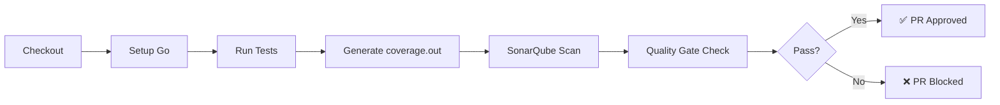

# SonarCloud Integration

## Overview

SonarCloud provides static code analysis, code quality checks, and security scanning for Pull Requests and the `main` branch.

| Property | Value |
|----------|-------|
| **Platform** | [SonarCloud](https://sonarcloud.io) (Free Plan) |
| **Project Key** | per-repository: `duynhlab_<repo>` (e.g. `duynhlab_auth-service`, `duynhlab_order-service`) |
| **Organization** | `duynhlab` |
| **Workflow** | `.github/workflows/sonarqube.yml` |

## CI/CD Flow



## Configuration

### GitHub Secrets Required

| Secret | Description |
|--------|-------------|
| `SONAR_TOKEN` | API token from SonarCloud |

### Service Repo Usage (Example)

In each service repo CI, the Sonar step is wired via shared workflows. Example (from a `*-service` repo):

```yaml
sonar:
  needs: go-check
  uses: duynhlab/gha-workflows/.github/workflows/sonarqube.yml@main
  with:
    project-key: 'duynhlab_cart-service'
    organization: 'duynhlab'
    fail-on-quality-gate: false
  secrets:
    SONAR_TOKEN: ${{ secrets.SONAR_TOKEN }}
```

## Quality Gate (new-code coverage ≥ 80%)

Each Go service repo enforces SonarCloud's Quality Gate with a **≥ 80% coverage on new code**
condition (plus the default reliability/security/duplication conditions). "New code" = lines
changed in the PR / since the previous version, so the gate pushes coverage **forward** without
demanding the whole legacy codebase be backfilled.

- The condition is configured **in SonarCloud** (Quality Gate), not in the workflow. When adding
  new conditionals, cover **both** branches or the gate fails the PR / `main` analysis.
- **Coverage exclusions** (counted-against-% only; still analyzed for issues), set via the
  `coverage-exclusions` input of `sonarqube.yml`: `**/cmd/**`, `**/internal/core/database.go`,
  `**/db/migrations/**`, `**/mocks/**`, `**/*_mock.go` (bootstrap / wiring / migrations / generated).
  The **repository (DB) layer is NOT excluded** — it is integration-tested with testcontainers and
  its coverage is **merged** into the Sonar report via `integration-coverage: true`
  (`coverage.out` + `coverage-integration.out`). See [Testing & Coverage](cicd.md#testing--coverage).
- The PR workflow may run with `fail-on-quality-gate: false` (non-blocking on the PR job), but the
  **branch analysis still records the gate** — a red `main` gate is the signal to fix coverage.

## Coverage

### Go Services

Coverage is generated per-repository during `go test -race -coverprofile=coverage.out ./...`
(unit) plus `go test -tags=integration -coverprofile=coverage-integration.out ./internal/core/repository/...`
(integration, testcontainers). Both profiles are merged in the Sonar scan via
`sonar.go.coverage.reportPaths`. Full testing standard: [Testing & Coverage](cicd.md#testing--coverage).

### Frontend (React)

❌ Not configured - no test framework installed.

## Important Notes

> [!WARNING]
> **Automatic Analysis must be DISABLED** in SonarCloud.
> 
> SonarCloud does not allow running both Automatic Analysis and CI Analysis simultaneously.
> 
> To disable: SonarCloud → Project → Administration → Analysis Method → Disable Automatic Analysis

## Links

- SonarCloud projects are per-repository (e.g. `duynhlab_auth-service`, `duynhlab_cart-service`, `duynhlab_checkout-service`)
- [SonarCloud Test Coverage Docs](https://docs.sonarsource.com/sonarqube-cloud/enriching/test-coverage/overview/)
- Shared workflow: `duynhlab/gha-workflows/.github/workflows/sonarqube.yml`

---
_Last updated: 2026-07-22 — checkout-service project-key example._
