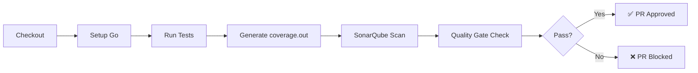

# SonarCloud Integration

## Overview

SonarCloud provides static code analysis, code quality checks, and security scanning for Pull Requests and the `main` branch.

| Property | Value |
|----------|-------|
| **Platform** | [SonarCloud](https://sonarcloud.io) (Free Plan) |
| **Project Key** | `duynhlab_monitoring` |
| **Organization** | `duynhlab` |
| **Workflow** | `.github/workflows/sonarqube.yml` |

## CI/CD Flow



## Configuration

### GitHub Secrets Required

| Secret | Description |
|--------|-------------|
| `SONAR_TOKEN` | API token from SonarCloud |

### Service Repo Usage (Example)

In each service repo CI, the Sonar step is wired via shared workflows. Example (from a `*-service` repo):

```yaml
sonar:
  needs: go-check
  uses: duyhenryer/shared-workflows/.github/workflows/sonarqube.yml@main
  with:
    project-key: 'duynhlab_cart-service'
    organization: 'duynhlab'
    fail-on-quality-gate: false
  secrets:
    SONAR_TOKEN: ${{ secrets.SONAR_TOKEN }}
```

## Coverage

### Go Services

Coverage is generated per-repository during `go test -race -coverprofile=coverage.out ./...` and consumed by the Sonar workflow.

### Frontend (React)

❌ Not configured - no test framework installed.

## Important Notes

> [!WARNING]
> **Automatic Analysis must be DISABLED** in SonarCloud.
> 
> SonarCloud does not allow running both Automatic Analysis and CI Analysis simultaneously.
> 
> To disable: SonarCloud → Project → Administration → Analysis Method → Disable Automatic Analysis

## Links

- SonarCloud projects are per-repository (e.g. `duynhlab_auth-service`, `duynhlab_cart-service`)
- [SonarCloud Test Coverage Docs](https://docs.sonarsource.com/sonarqube-cloud/enriching/test-coverage/overview/)
- Shared workflow: `duyhenryer/shared-workflows/.github/workflows/sonarqube.yml`
