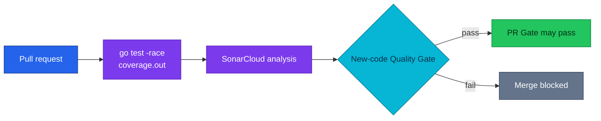

# SonarCloud integration

SonarCloud evaluates the code changed by a pull request after tests have
produced coverage evidence; the v2 PR Gate blocks merging when that Quality
Gate fails.

| Property | Value |
|----------|-------|
| Platform | SonarCloud |
| Project key | `duynhlab_<repository-name>` |
| Organization | `duynhlab` |
| Analysis event | Pull request into `dev` or `main` |
| Coverage input | `coverage.out` from the preceding race-enabled Go test job |
| Enforcement | `quality-gate-wait: true` and `fail-on-quality-gate: true` |
| Rollout | v2 candidate in `gha-workflows` PR #119; consumer adoption not started |

## Analysis flow

```mermaid
flowchart LR
  PR["Pull request"] --> TEST["go test -race<br/>coverage.out"]
  TEST --> SCAN["SonarCloud analysis"]
  SCAN --> GATE{"New-code Quality Gate"}
  GATE -->|"pass"| MERGE["PR Gate may pass"]
  GATE -->|"fail"| BLOCK["Merge blocked"]

  classDef edge fill:#2563eb,color:#fff,stroke:#1e3a8a;
  classDef service fill:#06b6d4,color:#082f49,stroke:#0e7490;
  classDef platform fill:#7c3aed,color:#fff,stroke:#5b21b6;
  classDef data fill:#22c55e,color:#052e16,stroke:#15803d;
  classDef external fill:#64748b,color:#fff,stroke:#334155;
  class PR edge;
  class TEST,SCAN platform;
  class GATE service;
  class MERGE data;
  class BLOCK external;
```

Sonar runs after the test job rather than in parallel because the scanner needs
the uploaded `coverage.out`. The shared `check.yml` composes both jobs and
enforces the result; service callers should use that public workflow instead of
calling `sonarqube.yml` directly.

## Quality Gate policy

Configure the Quality Gate and new-code definition in SonarCloud. CI cannot
define those server-side conditions; it only waits for and enforces their
verdict.

Recommended new-code conditions are:

- Coverage on new code at least 80%.
- No new blocker or critical reliability issues.
- No new blocker or critical security issues.
- Security hotspots reviewed.
- Duplication on new code within the agreed project threshold.

This approach improves touched code without requiring a PR to repair all legacy
debt. Any coverage exclusion must be narrow, justified in the owning repository,
and must not exclude the database/repository layer merely because its tests need
containers.

## Repository configuration

Each consumer repository needs:

1. A SonarCloud project named `duynhlab_<repository-name>`.
2. An Actions secret named `SONAR_TOKEN`.
3. Automatic Analysis disabled; CI Analysis and Automatic Analysis must not run
   together.
4. The caller in [`check_template.yml`](check_template.yml), pinned to an
   immutable shared-workflow release commit.
5. The aggregate `check / PR Gate` check required by the `dev` and `main`
   rulesets.

Dependabot pull requests do not receive ordinary Actions secrets. The shared
gate permits Sonar to skip only for the Dependabot actor; all other PR checks
and human review still apply.

## Operations

| Symptom | Check |
|---------|-------|
| Scanner cannot find coverage | Confirm the test command writes `coverage.out` and the quality job uploaded `coverage-report` |
| Duplicate analysis | Disable Automatic Analysis in SonarCloud |
| Gate is green despite old debt | Expected when the Quality Gate is scoped to new code |
| Gate is red but workflow passes | Consumer is on a legacy workflow or calls Sonar with enforcement disabled |
| Dependabot Sonar job is skipped | Expected when `SONAR_TOKEN` is unavailable; review other required results |

## References

- [CI/CD trust gates](cicd.md)
- [SonarCloud test coverage](https://docs.sonarsource.com/sonarqube-cloud/enriching/test-coverage/overview/)
- [SonarCloud quality gates](https://docs.sonarsource.com/sonarqube-cloud/standards/managing-quality-gates/introduction-to-quality-gates/)

_Last updated: 2026-08-31._
