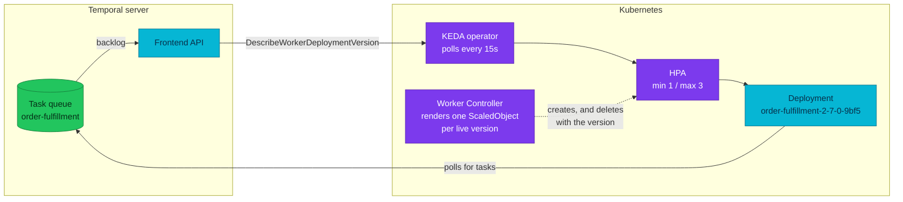
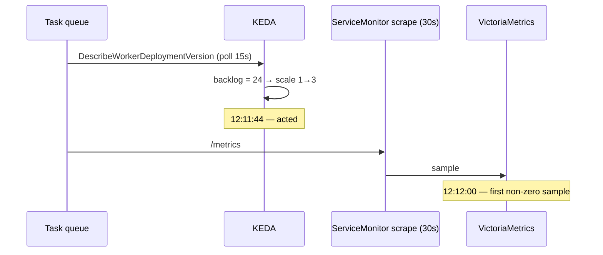

# Worker Autoscaling — and what a Kind drill taught us about it

How a **versioned Temporal worker** gets its replica count, why a plain
HorizontalPodAutoscaler cannot do the job, and the five non-obvious mechanics that
only showed up when the design was run on a real cluster instead of read about.

| | |
|---|---|
| **Autoscaler** | KEDA `2.20.2`, namespace `keda`, Flux wave `keda-local` |
| **Signal** | Temporal task-queue backlog, polled from the frontend API every 15 s |
| **Who renders the scaler** | Temporal Worker Controller `v1.9.0` — one `ScaledObject` per *worker version*, from a `WorkerResourceTemplate` |
| **Bounds** | `minReplicaCount: 1`, `maxReplicaCount: 3`, `targetQueueSize: 5`, `cooldownPeriod: 120` |
| **Who owns `replicas`** | The autoscaler. `spec.replicas` is **absent** from both `WorkerDeployment` CRs |
| **Design records** | [ADR-055](../proposals/adr/ADR-055-keda-worker-autoscaling/), [ADR-054](../proposals/adr/ADR-054-temporal-worker-controller/), [RFC-0026](../proposals/rfc/RFC-0026/) |
| **Alerts** | [§8c KEDA](../observability/alerting/alert-catalog.md#8c-keda-autoscaling) + the two Temporal capacity rules in [§8](../observability/alerting/alert-catalog.md#8-temporal--pyroscope--watchdog) |

---

## Overview

A Temporal worker is not a web server. A web server is scaled on a signal it
*emits* — CPU, request rate, latency. A worker is scaled on a signal that lives
**somewhere else entirely**: the depth of the task queue on the Temporal server.
The worker itself looks perfectly idle while a thousand tasks wait for it.

That single fact is why this page exists. Every decision below follows from it,
and most of the traps do too.

There is a second complication. This platform runs **versioned** workers
(ADR-030): several builds of the same worker can be alive at once, each pinned to
the workflows that started on it, each with its own Kubernetes Deployment created
and destroyed by a controller. So "scale the worker" is really "scale *this
version* of the worker, on *this version's* share of the backlog, for as long as
this version exists".



## 1. Two writers on one field is the whole game

The most expensive bug in this design is also the most boring: **two controllers
writing `Deployment.spec.replicas`.**

The Temporal Worker Controller can manage replicas itself. Whether it does is
decided by one optional field on the `WorkerDeployment` CR:

> Number of desired pods. When set, the controller manages replicas for all active
> worker versions. **When omitted (nil), the controller creates versioned
> Deployments with nil replicas and never calls UpdateScale on active versions** —
> following the Kubernetes-recommended pattern for HPA and other external
> autoscalers.
>
> — `api/v1alpha1/workerdeployment_types.go`, Worker Controller v1.9.0

So `replicas: 1` is not a harmless default. Leave it set and every reconcile
writes the version back down while KEDA writes it up. The autoscaler renders
correctly, validates, passes CI — and moves nothing.

**The rule:** whenever you hand a workload to an autoscaler, find the field that
says who owns the replica count and *remove* it. This is not Temporal-specific;
it is the same reason the Kubernetes docs tell you to drop `replicas` from a
Deployment manifest once an HPA targets it. A GitOps repo makes it worse, because
the manifest keeps re-asserting the value forever.

`scripts/flux-validate.sh` now fails `make validate` if either `WorkerDeployment`
carries `spec.replicas` again — a guard is cheaper than remembering.

### How to see the fight

There is no error for this. Both writers are behaving correctly. The signature is
in the events and the controller log:

```bash
# healthy: one line per genuine scaling decision
kubectl -n order get events --field-selector reason=ScalingReplicaSet \
  --sort-by=.lastTimestamp

# the fight: "scaling deployment" lines from the controller interleaved with
# HPA events on the same Deployment, at the reconcile interval
kubectl -n temporal logs deploy/temporal-worker-controller-manager | grep "scaling deployment"
```

Measured on the drill (2026-09-05), the healthy shape is exactly three events for
a whole load cycle — `0 → 1` on create, `1 → 3` under load, `3 → 1` after the
cooldown — and **zero** `scaling deployment` lines.

## 2. Polling an API beats reading a metric — and we measured how much

The obvious way to autoscale on a queue is: scrape the queue depth into
Prometheus, put an adapter in front of it, let the HPA read it. Upstream even
recommends that path for continuously loaded queues.

The drill produced an accidental, very clean measurement of what that costs.

| Time (UTC) | Event |
|---|---|
| 12:11:44 | KEDA scales the Deployment `1 → 3` |
| 12:12:00 | `approximate_backlog_count` first reads non-zero in VictoriaMetrics |
| 12:12:01 | the 30-second load test ends |

KEDA acted **16 seconds before the metric existed anywhere a query could see it.**
Not because KEDA is clever, but because it asks the Temporal frontend directly
while the metric path has to wait for a 30-second scrape.



**The lesson that generalises:** a scraped metric is never "now". Its floor
latency is the scrape interval, and anything reacting to it inherits that floor.
When the thing you are reacting to is shorter-lived than the scrape interval, the
metric path cannot see it at all — which is a *measurement* problem long before it
is an autoscaling problem (see §5).

## 3. Reading the backlog metric without lying to yourself

`approximate_backlog_count` looks like one number per queue. It is not. On this
platform **one application task queue carries 17 series**:

| Label | Values | What it means |
|---|---|---|
| `partition` | `0`, `1`, `2`, `3`, `__sticky__` | Temporal shards a task queue; the queue's real depth is the **sum** |
| `task_type` | `Workflow`, `Activity` | two separate pools, with separate worker slots |
| `worker_version` | the build id, or `__unversioned__` | different populations, not duplicates |
| `taskqueue` | `order_fulfillment` | note: **no underscore in the label name, underscores in the value** |

Two wrong answers are easy to reach:

- `max by (taskqueue)` reads **one partition's share**. With four partitions a
  queue needs roughly 4× the backlog before a threshold trips.
- `sum by (taskqueue)` adds Workflow to Activity and the live version to
  `__unversioned__` — a number that describes nothing.

The correct shape collapses **only** `partition`:

```promql
sum by (taskqueue, task_type, worker_version) (approximate_backlog_count)
```

That mirrors what the scaler itself does: with a versioned template, KEDA calls
`DescribeWorkerDeploymentVersion` and sums `ApproximateBacklogCount` across the
version's task queues, already aggregated over partitions.

One deliberate difference: KEDA does **not** split `task_type` (the `queueTypes`
metadata is unset, so no type filter applies) and scales on Workflow + Activity
combined. The alert splits them so a page can name the starved pool, which means
in a mixed-load incident the alert trails the scaler rather than leading it. That
is the correct direction for a rule whose message is *"the scaler is not coping"*.

### And do not trust the SDK label

The server emits `taskqueue`. The Go SDK emits `task_queue`, and its values use
hyphens (`order-fulfillment`) where the server uses underscores
(`order_fulfillment`). A dashboard panel grouped a server metric by the SDK label
for weeks and simply never split — no error, no empty panel, just one flat line
that looked plausible.

## 4. `up == 0` cannot see a target that disappeared

This one cost a rule, and it is the most transferable lesson on the page.

A natural way to alert on a dead component is `up{job="x"} == 0`. That works when
the process is down but the **scrape target still exists** — a pod that is failing
its endpoint. It does **not** work when the target itself goes away: scale the
Deployment to zero and the Service loses its endpoint, so Prometheus has nothing
to scrape and `up` for that job is **absent**, not `0`. `== 0` then matches
nothing and the alert is silent.

Measured on the drill:

```text
up{job=~".*keda.*metrics-apiserver.*"}                       → no series
up{job=~".*keda.*metrics-apiserver.*"} == 0                  → no series  (cannot fire)
... == 0 or absent(up{job=~".*keda.*metrics-apiserver.*"})   → 1          (fires)
```

…while `kubectl -n order describe hpa` was already reporting
`ScalingActive=False` / `FailedGetExternalMetric`. The component was
unambiguously broken and the alert written to catch it could not.

**The rule:** any "X is down" alert needs a second half that covers *X stopped
being scraped at all*. Either `absent(up{...})` on the same selector, or
`absent(<a series only X emits>)`. Pick the second when the component has a
signature metric — `KedaOperatorDown` uses `absent(keda_build_info)` and was
therefore never vulnerable.

This is the same family as three earlier defects in this repo: an alert whose
expression is syntactically perfect, evaluates without error, reports healthy —
and matches nothing. `vmalert` will happily show `health=ok` for a rule that can
never fire. **The only proof is to break the thing and watch the alert.**

## 5. Two ways a counter can lie

**A counter that gets deleted.** KEDA's `DeleteScalerMetrics` wipes
`keda_scaler_detail_errors_total` whenever it rebuilds a `ScaledObject`'s scalers.
On the drill, 15 real trigger errors were logged in a 15-second window and the
counter still read `0` afterwards, because the rebuild that fixed the problem also
erased the evidence. A *sustained* failure keeps incrementing and alerts fine —
this only hides transients.

**A counter you sampled too rarely.** `make e2e-load` reported `Backlog peak 0`
while KEDA's own value peaked at 24. The harness samples a 30-second-scrape metric
during a 30-second run, so it read zeros for the whole test (§2). Its own hint —
that the label must be wrong — sent the reader in the wrong direction entirely.

**The rule:** when a measurement disagrees with reality, check the *sampling*
before you doubt the *query*. And when a test asserts on a scraped metric, the run
has to outlast the scrape interval by a comfortable margin.

## 6. Delays that add, and a floor that fights a sunset

A drained worker version is retired in two steps: the controller scales it to zero
after `scaledownDelay`, then deletes the Deployment. The trap is that the deletion
condition is:

```text
time.Since(drainedSince) > scaledownDelay + deleteDelay   AND   observed replicas == 0
```

The delays **add**. Setting them equal to close the gap does not close it — with
`24h / 24h` the zero happens at 24 h and the delete at 48 h, so the window gets
*longer*.

Why the window matters at all: between the zero and the delete, the version's
`ScaledObject` is still attached, and KEDA's executor raises any target below
`minReplicaCount` back to 1 on every poll. The controller re-zeroes it. That is a
0↔1 flap for the entire window — and note it is **KEDA**, not the HPA, doing the
raise: a plain HPA refuses to act on a target sitting at 0, which is exactly why
KEDA exists.

The fix is `deleteDelay: 0s`: the reconcile that observes the zero also deletes the
Deployment, and the `ScaledObject` goes with it. Nothing is left to raise.

Two tempting alternatives are both wrong here, and it is worth knowing why:

| Option | Why it fails |
|---|---|
| `minReplicaCount: 0` / `idleReplicaCount: 0` | Stops KEDA raising the *drained* version, but now an idle **Current** version also drops to 0 — and the controller floors the rollout target at 1. Same flap, on the version that matters |
| `autoscaling.keda.sh/paused-scale-in` | Also sets the HPA's scale-down policy to `Disabled`, so 3 → 1 never happens after a load spike |

That the delete is fast enough depends on one more detail: `Deployment.status.replicas`
counts only **active** pods, and a pod with a `DeletionTimestamp` is not active. So
the count reaches 0 the moment the pod is *marked*, not when its 30-second grace
period expires — comfortably inside one 15-second KEDA poll.

## Operations

```bash
# Is the scaler rendered, and did the controller inject the version identity?
kubectl get scaledobject -A -o yaml | yq '.items[].spec.triggers'
#   expect workerDeploymentName: order/order-fulfillment, workerDeploymentBuildId,
#   namespace: mop — all three written by the controller from "" sentinels

# Does the autoscaler own replicas?
kubectl -n order get wd order-fulfillment -o jsonpath='{.spec.replicas}'   # must print nothing

# What does KEDA think the backlog is, versus what the metric says?
#   keda_scaler_metrics_value{scaler="temporalScaler"}
#   sum by (taskqueue, task_type, worker_version) (approximate_backlog_count)

# Prove an alert can fire (the only proof there is)
kubectl -n keda scale deploy keda-operator-metrics-apiserver --replicas=0   # then back to 1
kubectl -n order describe hpa | grep -E "ScalingActive|FailedGetExternalMetric"
```

Labels to expect on `keda_*` series: KEDA stamps its own `namespace` (the
`ScaledObject`'s), and the ServiceMonitor scrape stamps the target's — so KEDA's
becomes **`exported_namespace`**. Dashboards and alerts filter on that, not on
`namespace`.

## References

- [ADR-055 — KEDA worker autoscaling](../proposals/adr/ADR-055-keda-worker-autoscaling/) — the decision, and the drill results in § As-built
- [ADR-054 — Temporal Worker Controller](../proposals/adr/ADR-054-temporal-worker-controller/) — who owns the version lifecycle
- [Alert catalog §8c](../observability/alerting/alert-catalog.md#8c-keda-autoscaling) and [runbooks/keda/](../observability/runbooks/keda/README.md)
- [`docs/api/temporal.md`](../api/temporal.md) — worker versioning from the application side
- KEDA Temporal scaler — <https://keda.sh/docs/latest/scalers/temporal/>

---
_Last updated: 2026-09-05 — written from the ADR-055 Kind drill; every measurement quoted here was taken on a from-scratch cluster that day._
