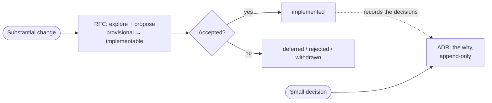

# Proposals — RFCs & ADRs

Design proposals and architectural decisions for the duynhlab platform live here,
split by artifact type:

- **[`rfc/`](rfc/) — Requests for Comments.** Propose a **substantial change**
  (design doc + diagram), discussed on a PR **before** it's built. Numbered
  `RFC-NNNN`, each in its own folder. Start at [`rfc/README.md`](rfc/README.md).
- **[`adr/`](adr/) — Architecture Decision Records.** **Record a decision** already
  made and its rationale (short, Nygard-style). Numbered `ADR-NNN`. Start at
  [`adr/README.md`](adr/README.md).

## How they fit together

- An **RFC** is the *async exploration + proposal* (broader, has a diagram, invites
  feedback). When accepted and built, the concrete decisions it made are recorded as
  one or more **ADRs** — the permanent "why".
- A **small** standalone decision can be written directly as an ADR without an RFC.
- **Not here:** bugs/small improvements → [`REVIEW` issue tracker](https://github.com/duynhlab/homelab/issues);
  learning items → [`TODO.md`](../../TODO.md). (Planning ⊋ RFC — only *substantial*
  changes become RFCs.)

> "ADR" is the industry-standard term (Nygard 2011; adr.github.io). RFC + ADR used
> together is a common open-source pattern (e.g. Kubernetes, Flux).
