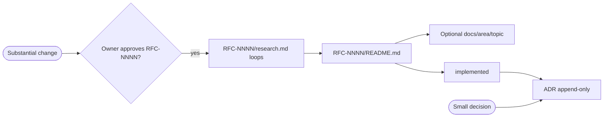

# Proposals — RFCs & ADRs

Design proposals and architectural decisions for the duynhlab platform live here,
split by artifact type:

- **[`rfc/`](rfc/) — Requests for Comments.** Reserve **`RFC-NNNN`**, explore in
  **`research.md`**, decide in **`README.md`**. **RFC index & backlog:**
  [`rfc/README.md`](rfc/README.md).
- **[`adr/`](adr/) — Architecture Decision Records.** **Record a decision** already
  made and its rationale (short, Nygard-style). Numbered `ADR-NNN`, each in its own
  folder. Start at [`adr/README.md`](adr/README.md).

## How they fit together

| Artifact | Purpose | Lives in | Lifecycle |
|----------|---------|----------|-----------|
| **research.md** | Plain-language explore + verify (Context7); **real-world problem** first | `rfc/RFC-NNNN/research.md` | `researching → gate passed` |
| **RFC** | Decision + target architecture + rollout | `rfc/RFC-NNNN/README.md` | `provisional → implementable → implemented` |
| **ADR** | Record the **why** after a decision ships | [`adr/ADR-NNN-slug/`](adr/) | `Proposed → Accepted → Superseded` |
| **Domain doc** (optional) | Durable platform reference distilled from research | `docs/<area>/<topic>/` | owner-maintained |

- **Research** is a plain-language deep dive — start from a **real-world problem**
  (the kind you'd hit at work), then teach yourself before deciding.
- An **RFC** is the time-bound proposal; it links `./research.md` and must not
  repeat the full mechanism tutorial.
- When accepted and built, concrete decisions become one or more **ADRs**.
- A **small** standalone decision can skip RFC and go straight to an ADR.
- Bug fixes, cleanups, and dependency bumps need no RFC. Substantial unnumbered themes →
  [RFC backlog](rfc/README.md#backlog--candidate-rfcs). Planning ⊋ RFC — only *substantial*
  changes reserve an RFC number.

> **Historical note:** [RFC-0001](rfc/RFC-0001/) through [RFC-0018](rfc/RFC-0018/) predate the
> research-first workflow — most folders have **`README.md` only** (no `research.md`, no review
> gate). **From RFC-0019 onward**, reserve a number → [`research.md`](rfc/RFC-0000/research.md) →
> owner **ready for RFC** → `README.md`. Do not backfill legacy RFCs unless an owner asks.

> "ADR" is the industry-standard term (Nygard 2011; adr.github.io). RFC + ADR used
> together is a common open-source pattern (e.g. Kubernetes, Flux).

---
_Last updated: 2026-07-17_
