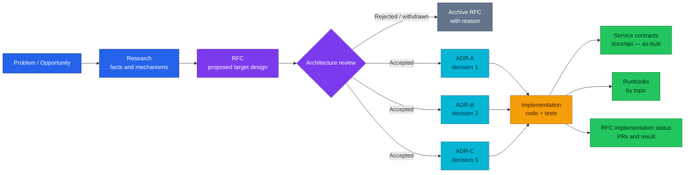

# Proposals — RFCs & ADRs

Design proposals and architectural decisions for the duynhlab platform live here,
split by artifact type:

- **[`rfc/`](rfc/) — Requests for Comments.** Reserve **`RFC-NNNN`**, explore in
  **`research.md`**, decide in **`README.md`** (template v3). **RFC index & backlog:**
  [`rfc/README.md`](rfc/README.md). Copy source: [`RFC-0000/`](rfc/RFC-0000/).
- **[`adr/`](adr/) — Architecture Decision Records.** Record **one durable decision**
  per ADR (template v2). Process, vocabulary, and index:
  [`adr/README.md`](adr/README.md). Copy source: [`ADR-0000-template/`](adr/ADR-0000-template/).

## How they fit together

```mermaid
flowchart LR
    Problem["Problem / Opportunity"] --> Research["Research<br/>facts and mechanisms"]
    Research --> RFC["RFC<br/>proposed target design"]
    RFC --> Review{"Architecture review"}

    Review -->|"Rejected / withdrawn"| Archive["Archive RFC<br/>with reason"]
    Review -->|"Accepted"| ADR1["ADR-A<br/>decision 1"]
    Review -->|"Accepted"| ADR2["ADR-B<br/>decision 2"]
    Review -->|"Accepted"| ADR3["ADR-C<br/>decision 3"]

    ADR1 --> Implementation["Implementation<br/>code + tests"]
    ADR2 --> Implementation
    ADR3 --> Implementation

    Implementation --> Contracts["Service contracts<br/>docs/api — as-built"]
    Implementation --> Runbooks["Runbooks<br/>by topic"]
    Implementation --> History["RFC implementation status<br/>PRs and result"]

    classDef edge fill:#2563eb,color:#fff,stroke:#1e3a8a;
    classDef service fill:#06b6d4,color:#082f49,stroke:#0e7490;
    classDef worker fill:#f59e0b,color:#451a03,stroke:#b45309;
    classDef platform fill:#7c3aed,color:#fff,stroke:#5b21b6;
    classDef data fill:#22c55e,color:#052e16,stroke:#15803d;
    classDef external fill:#64748b,color:#fff,stroke:#334155;

    class Problem,Research edge;
    class RFC,Review platform;
    class ADR1,ADR2,ADR3 service;
    class Implementation worker;
    class Contracts,Runbooks,History data;
    class Archive external;
```

| Artifact | Purpose | Lives in | Lifecycle |
|----------|---------|----------|-----------|
| **research.md** | Plain-language explore + verify (Context7); **real-world problem** first | `rfc/RFC-NNNN/research.md` | `researching → gate passed` |
| **RFC** | Proposed target architecture + rollout | `rfc/RFC-NNNN/README.md` | `provisional → Accepted → implemented` |
| **ADR** | One architectural **decision** + trade-offs + review rules | [`adr/ADR-NNN-slug/`](adr/) | `Proposed → Accepted → Superseded`; **Adoption** tracks ship progress |
| **Domain doc** (optional) | Durable platform reference distilled from research | `docs/<area>/<topic>/` | owner-maintained |
| **docs/api sync** | Normative as-built contract after ship | [`docs/api/`](../api/README.md) when API-touching | with Adoption **Complete** / RFC **implemented** |
| **Runbooks** (optional) | Ops playbooks for meaningful failure modes | by topic under `docs/observability/runbooks/`, `docs/databases/runbooks/`, … | when ops-relevant |

- **Research** is a plain-language deep dive — start from a **real-world problem**
  (the kind you'd hit at work), then teach yourself before deciding.
- An **RFC** is the time-bound proposal; it links `./research.md` and must not
  repeat the full mechanism tutorial.
- During **RFC review**, split independent decisions into ADR(s) at **`Proposed`**.
  On approval, RFC and ADR(s) move to **`Accepted`**; **Adoption** stays **`Not
  started`** until implementation lands.
- **API-touching** work syncs [`docs/api/`](../api/README.md) when ADR **Adoption**
  is **Complete** (or RFC **`implemented`**). Update owning contract files, hub
  rollup, and **Design records** links. Infra-only changes update platform docs
  instead.
- A **small** standalone decision can skip RFC and go straight to an ADR.
- Bug fixes, cleanups, and dependency bumps need no RFC. Substantial unnumbered themes →
  [RFC backlog](rfc/README.md#backlog--candidate-rfcs).

> **Historical note — RFC status:** legacy index rows may still say **`implementable`**
> — that status is equivalent to **`Accepted`** (design approved, ready to build).
> Do not bulk-rename live RFC folders in drive-by PRs; use **`Accepted`** for new
> work and hub docs.

> **Historical note — ADRs:** [RFC-0001](rfc/RFC-0001/) through [RFC-0018](rfc/RFC-0018/)
> predate the research-first workflow. **From RFC-0019 onward**, reserve a number →
> [`research.md`](rfc/RFC-0000/research.md) → owner **ready for RFC** → `README.md`.
> ADR-001–031 use template v1 unless backfilled by owner request; new ADRs use
> [`ADR-0000-template/`](adr/ADR-0000-template/) v2. RFCs authored before
> 2026-08-18 use RFC template v1 (no **Other solutions considered** section) and
> those before 2026-08-24 use v2 (no **Decision outcome** section); new RFCs use
> [`RFC-0000/README.md`](rfc/RFC-0000/README.md) v3.

> "ADR" is the industry-standard term (Nygard 2011; adr.github.io). RFC + ADR used
> together is a common open-source pattern (e.g. Kubernetes, Flux).

---
_Last updated: 2026-08-24 — RFC template bumped to v3: added § Decision outcome (chosen option + rationale). It had no home before, so every RFC put it somewhere different — the Summary, prose under Alternatives, a bolded "Owner decision" paragraph in `research.md`, or a bespoke decisions table. Per-option pros/cons stay in `research.md` § Alternatives, and the ADR template is unchanged: `## Decision drivers` + `## Alternatives considered` + `### Why the selected option won` already cover the same ground. Previously — 2026-08-18: RFC template bumped to v2: added § Other solutions considered._
