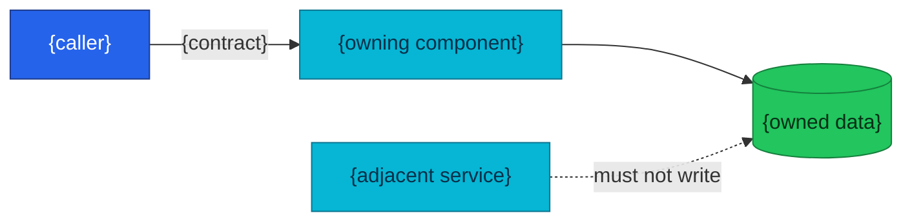

# ADR-NNN: {Imperative decision title}

<!--
Use an imperative, decision-shaped title:

Good:
- Separate Inventory from Product
- Use Temporal for Order Fulfillment
- Keep Checkout as a Purchase-Funnel Orchestrator
- Expose Administrative Commands through Protected APIs

Avoid:
- Inventory Architecture
- Thoughts about Temporal
- Order Service Improvements
-->

> **Decision summary:** We will {decision} because {primary reason}. We accept
> {main cost or limitation} in exchange for {main benefit}.

| Attribute | Value |
|-----------|-------|
| **Status** | Proposed |
| **Decision date** | — |
| **Owners** | `{person or team responsible for the record}` |
| **Deciders** | `{people or architecture group that accepts the decision}` |
| **Scope** | `{bounded scope of this decision}` |
| **Affected components** | `{services, workers, databases, frontend, platform}` |
| **Related RFC** | [RFC-NNNN](../../rfc/RFC-NNNN/) or — |
| **Related research** | [research.md](../../rfc/RFC-NNNN/research.md) or — |
| **Supersedes** | ADR-NNN or — |
| **Superseded by** | ADR-NNN or — |
| **Implementation tracking** | `{issue / epic / planning document / PRs}` |
| **Adoption** | Not started / Partial / Complete |

<!--
Decision status:
Proposed → Accepted → (Deprecated | Superseded by ADR-NNN)
Proposed → Withdrawn

Adoption describes implementation progress and is independent from the
decision status.
-->

## Context

<!--
State the facts and forces that made a decision necessary.

Include:
- the current condition;
- the concrete problem;
- affected actors and components;
- constraints;
- why the decision is needed now.

Do not announce the selected option in this section.
Do not copy the full mechanism deep dive from research.md.
-->

{Describe the current architecture and the problem.}

{Describe the correctness, operational, delivery, security, or maintainability
pressure.}

## Scope

### In scope

<!-- Name exactly what this ADR decides. -->

- {decision boundary 1}
- {decision boundary 2}

### Out of scope

<!--
Name adjacent topics that this ADR deliberately does not decide.
They may become separate ADRs.
-->

- {non-goal 1}
- {non-goal 2}

## Decision drivers

<!--
Drivers are the criteria used to compare alternatives.
Order them by importance.
-->

| Priority | Driver | Why it matters |
|---------:|--------|----------------|
| 1 | {correctness / ownership / security / operability} | {reason} |
| 2 | {simplicity / delivery speed / reversibility} | {reason} |
| 3 | {cost / performance / learning value} | {reason} |

## Decision

<!--
Write the decision in active voice:

"We will ..."
"The platform will ..."
"{Service} will own ..."

Be precise enough that an engineer can tell whether an implementation complies
with the decision.

Do not turn this section into the complete implementation plan.
-->

We will {exact decision}.

{One or two paragraphs describing the architectural shape and its boundaries.}

### Decision rules

<!--
Durable architectural rules derived from the decision.
These rules make the ADR useful during code review.
-->

| Rule | Required behavior |
|------|-------------------|
| **Ownership** | {which component is authoritative} |
| **Write path** | {who may change the owned state} |
| **Read path** | {how other components obtain the state} |
| **Boundary** | {what must not be implemented in this component} |
| **Failure behavior** | {important failure or consistency rule} |
| **Compatibility** | {breaking change / compatibility expectation} |

### Decision view

<!--
Optional. Use at most one small Mermaid diagram.

The diagram should clarify the decision boundary, not redraw the whole
platform. Delete this subsection when a diagram adds no value.
-->

## Alternatives considered

<!--
Include only credible alternatives.

Do not use obviously bad straw-man options.
For a large analysis, summarize here and link to RFC research.
-->

| Option | Benefits | Costs / risks | Result |
|--------|----------|---------------|--------|
| **A — {option}** | {benefits} | {costs} | Selected / Rejected |
| **B — {option}** | {benefits} | {costs} | Rejected |
| **C — {option}** | {benefits} | {costs} | Rejected |

### Why the selected option won

{Explain how the selected option best satisfies the decision drivers.}

### Why the closest alternative lost

{Explain the real trade-off. Avoid saying only that it was "more complex".}

## Consequences

### Positive consequences

- {benefit that becomes true}
- {correctness, ownership, operability, delivery, or learning benefit}

### Negative consequences and accepted trade-offs

- {new cost, complexity, latency, dependency, limitation, or operational burden}
- {capability deliberately deferred}
- {risk that remains}

### Neutral consequences

- {changes that are neither clearly good nor bad}
- {teams or repositories that must adapt}

## Implementation obligations

<!--
This is not the full phase plan.
Link to planning for detailed tasks.

List work that must happen for the decision to be considered adopted.
-->

| Obligation | Owner | Tracking | Completion signal |
|------------|-------|----------|-------------------|
| {code or contract change} | {team} | {issue/PR} | {observable result} |
| {test or operational work} | {team} | {issue/PR} | {observable result} |
| Update service contracts | {team} | `docs/api/...` | As-built docs match code |
| Update diagrams and call graph | {team} | `docs/api/api.md` | No stale edge remains |

## Validation and compliance

<!--
Explain how engineers and CI can verify that implementation follows this ADR.
-->

| Requirement | Verification |
|-------------|--------------|
| {ownership rule} | {contract test / static check / repository test} |
| {transport rule} | {Kong route test / gRPC contract test} |
| {data invariant} | {database constraint / concurrency test} |
| {failure rule} | {integration / workflow / chaos test} |
| Documentation | Relevant `docs/api/` contracts link this ADR |

## Revisit triggers

<!--
Use observable conditions that invalidate an assumption.
Do not use a vague calendar date unless the decision truly expires with time.
-->

Re-open this decision when one or more of the following become true:

- {scale threshold}
- {new business requirement}
- {security or compliance change}
- {operational cost threshold}
- {assumption is proven false}

A review does not automatically reverse the decision. A changed decision
requires a new ADR that supersedes this one.

## References

- [RFC-NNNN](../../rfc/RFC-NNNN/)
- [RFC-NNNN research](../../rfc/RFC-NNNN/research.md)
- [{Service} contract](../../../api/{service}.md)
- [{Related workflow}](../../../api/workflows.md)
- [{Planning document}]({link})
- [{Runbook}]({link})

## History

<!--
Append-only after acceptance.

Allowed:
- correct spelling and broken links;
- append implementation links;
- update Adoption;
- add a history row;
- mark Deprecated or Superseded.

Not allowed:
- silently rewrite Decision, Alternatives, or accepted trade-offs.

A changed architectural decision requires a new ADR.
-->

| Date | Status / adoption | Change |
|------|-------------------|--------|
| YYYY-MM-DD | Proposed / Not started | Initial draft |
| YYYY-MM-DD | Accepted / Not started | Decision accepted in RFC-NNNN review |
| YYYY-MM-DD | Accepted / Complete | Implementation and contract tests completed |

---
_Last updated: YYYY-MM-DD_
