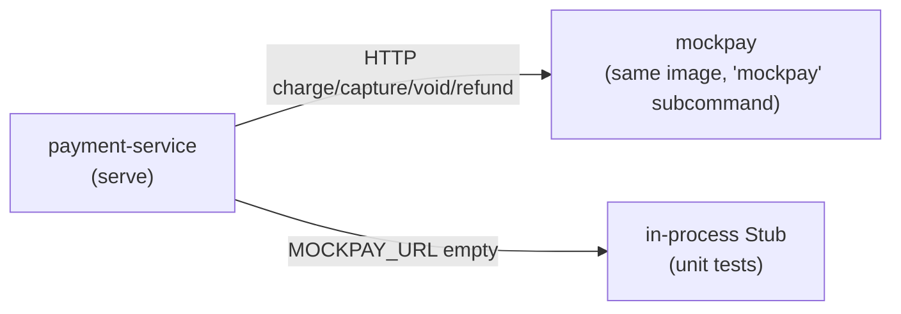

# ADR-008: Run the mock payment provider as a standalone process

Ship `mockpay` — the mock payment provider — as a real out-of-process HTTP
service (a subcommand of the payment binary), not an in-process stub, so the
provider integration exercises a genuine network boundary.

| Status | Date | Related RFC |
|--------|------|-------------|
| Accepted | 2026-07-04 | [RFC-0010](../../rfc/RFC-0010/) |

> **Don't forget: every decision is a tradeoff.** Record what you gave up, not just
> what you gained.

## Context

The payment service talks to a payment provider through an outbound port
(`Charge`/`Capture`/`Void`/`Refund`). Through P1 that port was satisfied only by
an in-process Go stub: correct for unit tests, but it hides the lessons the
service exists to teach. Signed webhooks, provider latency, at-least-once/out-of-
order delivery, and ledger↔provider reconciliation are only honest if the
provider is a **separate process that can fail, lag, and be restarted
independently** — an in-process call can model none of that.

We need a mock provider that is real enough to integrate against (a network hop,
its own lifecycle) while staying deterministic and free of real money, cards, or
PCI scope. It also has to fit the platform's existing deployment shape rather
than inventing a new one.

## Decision

We will implement `mockpay` as a standalone HTTP service exposing the provider
operations (`POST /charges`, `/charges/{id}/capture`, `/charges/{id}/void`,
`POST /refunds`), and have the payment service reach it through an
`HTTPClient` that implements the same provider port. `MOCKPAY_URL` selects the
client at startup; empty falls back to the in-process stub (unit tests, stub-only
local runs).

`mockpay` is a **subcommand of the payment binary** (`payment-service mockpay`),
deployed as its own container — the same pattern as `order-worker` being a second
deployment of `order-service`. It reuses the one image and Dockerfile; only the
launch command differs.

The mock and the stub share one deterministic trigger table (`provider.Classify`
maps an amount's minor-unit suffix to approve / decline / transient), so both
behave identically. The HTTP client maps mockpay's status codes back onto the
port's error contract: `402 → DeclinedError` (→ `422 PAYMENT_DECLINED`), `503 →
ErrTransient`, and any transport failure is likewise treated as transient — the
caller releases the idempotency lock so a retry re-drives safely, relying on
mockpay's per-key replay to avoid a double charge.

## Alternatives considered

- **Keep the in-process stub only.** Simplest and already working, but it cannot
  model a network boundary — no webhooks, no latency, no independent failure, no
  reconciliation. Rejected: those are the point of the phase.
- **A separate `cmd/provider` main + a multi-target Dockerfile.** A literally
  separate binary, but it adds a second build target and image to the pipeline
  for a *mock*. The platform already has a "second deployment of one binary"
  pattern (`order-worker`), and matching it means zero Dockerfile change.
  Rejected in favour of the subcommand.
- **A separate repository for mockpay.** Cleanest isolation, but the mock and the
  client share a wire contract; keeping them in one repo versions that contract
  together and avoids cross-repo lockstep for a throwaway-grade dependency.
  Rejected.

## Consequences

- **Mock code ships inside the payment image.** Accepted for a learning-platform
  mock: it is gated behind an explicit subcommand and never runs in serve mode; a
  real provider would be an external service, not a subcommand. Revisit if
  mockpay ever grows toward something shipped to production.
- **The integration is now a real hop.** Latency, restarts, and independent
  failure are observable; transport errors flow through the transient path
  (lock released, safe retry via per-key replay). This unblocks HMAC-signed
  webhook emission (next slice) and ledger↔provider reconciliation (later).
- **Deterministic parity.** Sharing `provider.Classify` means the stub and the
  live mock decline/approve identically, so unit tests and e2e agree.
- **Deferred:** the paged `GET /transactions` API that reconciliation will poll
  lands with the reconciliation phase that consumes it — not built speculatively
  here.
- **mockpay is unauthenticated by design** — its safety rests on network
  fencing. When it gets a cluster manifest (deployment phase), it must have **no
  `/private` ingress route and a NetworkPolicy** admitting only the payment
  service (this platform's "NetworkPolicy is the fence" convention). Body-size
  caps and full server timeouts are in place on both the client read and the
  mock server.

---

_Last updated: 2026-07-04_
