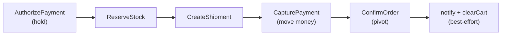

# ADR-009: Authorize payment early, capture late in the order saga

Integrate payment into the order-fulfillment saga as an **authorize-early /
capture-late** flow behind a `PAYMENT_ENABLED` flag: place the hold before doing
fulfillment work, move the money only immediately before the confirm pivot.

| Status | Date | Related RFC |
|--------|------|-------------|
| Accepted | 2026-07-04 | [RFC-0010](../../rfc/RFC-0010/) |

> **Don't forget: every decision is a tradeoff.** Record what you gave up, not just
> what you gained.

## Context

The order-fulfillment saga was `ReserveStock → CreateShipment → ConfirmOrder
(pivot)`, compensating in reverse on failure (see
[temporal-order-fulfillment.md](../../../api/temporal-order-fulfillment.md)).
Adding payment raises one real question: **when does money move relative to the
fulfillment work?**

Money movement is the most expensive thing to get wrong: charging a customer for
an order that then fails to reserve stock or ship means a refund, a support
ticket, and a chargeback risk. But we also want to **fail fast** — discovering a
declined card *after* reserving stock and creating a shipment wastes work and
holds inventory. The two goals pull in opposite directions, which is exactly what
the authorize/capture split exists to reconcile.

## Decision

Add two payment steps, gated by `PAYMENT_ENABLED` (default **false** → the saga
is byte-identical to before). When enabled:

- **Authorize first** (a hold, no money moved) so a decline fails the order
  before any stock/shipment work — cheap, reversible by expiry.
- **Capture last**, immediately before the confirm pivot, so money only moves
  once fulfillment is otherwise assured.
- **Compensation is capture-state-dependent:** a failure *before* capture runs
  `VoidPayment` (release the hold); a failure at the pivot (after capture) runs
  `RefundPayment` (return the money). Reverse-order with the existing
  `ReleaseStock` / `CancelShipment` compensations.
- **Idempotent by the natural key** `order:<id>` (refunds `refund:order:<id>`),
  so Temporal retries never double-authorize/capture/refund. A provider decline
  is a normal response (`status=failed`), mapped to a non-retryable rejection.
- **`PaymentEnabled` is carried in the workflow input** (read once at start), so
  a mid-flight flag flip can't break Temporal determinism.
- **The worker dials payment unconditionally** (lazy `grpc.NewClient`); whether
  the steps run is decided by the workflow input, not by whether a client exists.
  This removes a config-skew footgun (a flag-off worker with a nil client would
  panic on a payment-enabled workflow).
- **Internal auth model:** the saga calls payment's cluster-only gRPC surface as
  the unscoped owner (`userID 0`) — there is no end-user JWT east-west. This is
  the platform's "NetworkPolicy is the fence" convention. **Accepted risk:** with
  no in-process authorization, any workload that can reach payment `:9090` can
  move money. **Compensating controls** (land with payment's cluster onboarding —
  see [RFC-0010](../../rfc/RFC-0010/) P5): a source-restricted NetworkPolicy
  admitting only the order-worker, `GRPC_REFLECTION=false` in prod, and mTLS /
  caller-identity as the "money-grade" hardening step.

## Alternatives considered

- **Capture at authorize time (charge up front).** Simplest — one payment call.
  Rejected: money moves before stock/shipment are secured, so every downstream
  failure becomes a refund + chargeback risk instead of a free void.
- **No hold; charge once at the confirm pivot.** Avoids the two-step dance, but
  loses the early fail-fast (a decline is only discovered after all fulfillment
  work) and races stock: you reserve, then find the card is dead. Rejected.
- **Charge synchronously in the CreateOrder HTTP handler, outside the saga.**
  Not durable or compensatable — a crash mid-charge has no retry/rollback owner,
  and it couples checkout latency to the provider. Rejected: money movement
  belongs in the durable saga.
- **A dedicated payment status column on the order, written by the saga.**
  Considered for order-detail enrichment, but the payment service is the source
  of truth and has no read RPC yet; enrichment is deferred to the frontend phase.

## Consequences

- **Money moves only when fulfillment is otherwise assured**, and a decline
  fails the order cheaply (before stock/shipment). Refund volume is minimized.
- **Two compensations to reason about** (void vs refund), selected by whether
  capture has happened. Every failure path runs exactly one.
- **A narrow captured-but-failed window exists:** capture commits at the provider
  but the response is lost and payment is unreachable for the whole retry window,
  then the confirm pivot fails. Void-after-capture may be rejected, leaving money
  captured on a failed order. Mitigation: compensation failures are logged at
  `Error` for alerting; a reconciliation job closes the window
  (deferred to RFC-0010 P4).
- **Payment authorizes with a fixed demo token** while behind the flag — there is
  no checkout UI collecting a real method until the frontend phase; the flag must
  never be enabled in an environment wired to a real provider before then.
- **`PAYMENT_ENABLED` was temporary — now removed (P3.exit).** The flag and its
  two guarded branches were the rollout scaffolding; once payment became
  permanent the flag was deleted and payment is now unconditional in the saga.

---

_Last updated: 2026-07-04_
