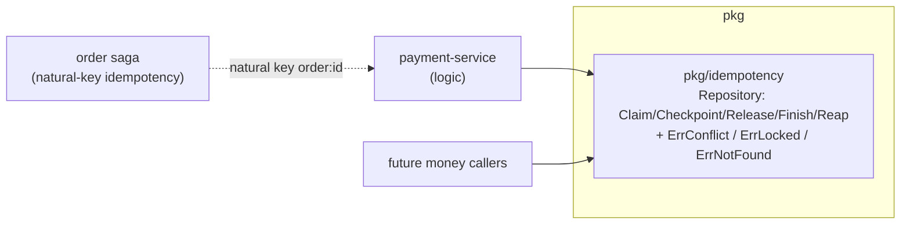

# ADR-010: Extract idempotency into a shared pkg/idempotency library

Move the payment service's brandur/Stripe-style idempotency machinery into a
shared `pkg/idempotency` so every money path (payment endpoints, the order saga,
future callers) reuses one implementation instead of re-deriving it.

| Status | Date | Related RFC |
|--------|------|-------------|
| Accepted | 2026-07-04 | [RFC-0010](../../rfc/RFC-0010/) |

> **Don't forget: every decision is a tradeoff.** Record what you gave up, not just
> what you gained.

## Context

Payment P1 built a robust idempotency layer: a `Claim → Checkpoint → Finish`
state machine with recovery points, a 90-second stale-lock takeover, and the
claim/replay/conflict/lock states keyed by `(user_id, key, method, path,
body-hash)`. This is the hard, easy-to-get-wrong part of any money API — and it
is not payment-specific. The order saga (as of ADR-009) and any future
money-touching endpoint need the same guarantees. Duplicating the state machine
per service is the classic drift trap: subtle divergence in lock takeover or
conflict semantics across copies is exactly the bug that causes a double charge.

The change also settles two contract points that ride with it: money-declines
need a distinct HTTP status, and per-order payment creation needs a uniqueness
guarantee.

## Decision

Extract the machinery into **`pkg/idempotency`** — one generic implementation
(the One-Version rule):

- The library is **generic**: keyed by `user_id + key + method + path +
  body-hash`, with a `subject_id BIGINT` recovery point that has **no foreign
  key** (each caller owns its own FK in its own migration — payment keeps its
  `payment_id`). Exposes `Claim/Checkpoint/Release/Finish/Reap` and the three
  sentinels `ErrConflict/ErrLocked/ErrNotFound`.
- **Payment delegates** to it; a thin boundary (`mapClaimErr`) re-emits the
  service's own domain sentinels, so the HTTP layer's status mapping is insulated
  from any future `pkg` rename (this boundary caught a real 500-instead-of-409
  regression during adoption).
- **Contract points absorbed by this decision:**
  - `422 PAYMENT_DECLINED` is a deliberately **new** platform status for a
    provider decline (distinct from validation `422` and from a `409` idempotency
    conflict).
  - A payment is **unique per order** (`UNIQUE(order_id)` at the payment
    service), so the saga's natural-key idempotency (`order:<id>`) and the
    body-hash claim together prevent two payments — or two different amounts — for
    one order.

## Alternatives considered

- **Keep idempotency in each service.** No shared dependency to version, but
  guarantees drift across copies — and drift in money idempotency is a
  double-charge waiting to happen. Rejected: this is precisely the code that must
  be one implementation.
- **A generic HTTP idempotency middleware.** Would cover simple request-replay,
  but money operations need `Checkpoint`/recovery-point semantics (resume a
  half-done charge across a crash) that a stateless replay cache can't express.
  Rejected as insufficient.
- **A separate repo for the idempotency library.** Cleaner isolation, but it
  shares a migration/schema contract with its callers; keeping it in the shared
  `pkg` module versions the contract alongside the protos and other shared code.
  Rejected.

## Consequences

- **One implementation, one contract.** New money callers get claim/replay/
  conflict/lock/stale-takeover for free; a fix lands once.
- **`pkg` semver coupling.** Callers pin a `pkg` version and bump to adopt fixes
  (payment and order now depend on the tag that carries the library). Normal for
  the shared module.
- **The generalization required a column rename** (`payment_id → subject_id`) in
  payment's `idempotency_keys` table. A plain rename is **not rolling-safe**;
  it is acceptable under single-replica / recreate-style deploys, and a proper
  expand/contract is deferred until payment runs multi-replica.
- **The domain-sentinel boundary is deliberate indirection.** Payment keeps its
  own `ErrKeyConflict/ErrKeyLocked` vocabulary and translates at the seam, so a
  `pkg` change can never silently alter an HTTP status code.

---

_Last updated: 2026-07-04_
