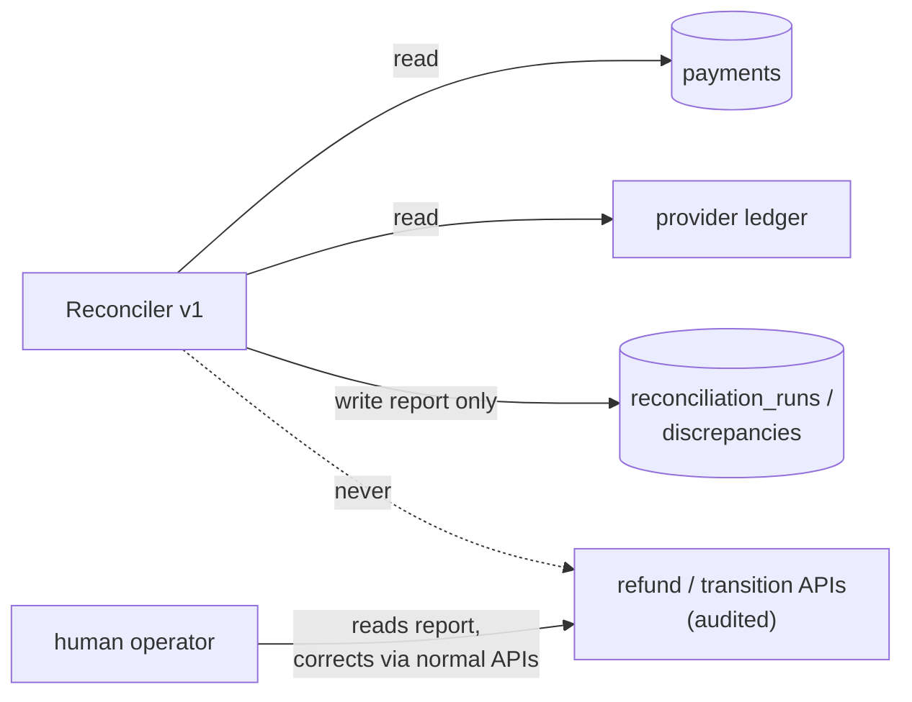

# ADR-011: Ship reconciliation detect-only; defer auto-heal

Reconciliation v1 detects and reports payment↔provider drift but never corrects
it — automated money movement stays off until the detector has earned trust.

| Status | Date | Related RFC |
|--------|------|-------------|
| Accepted | 2026-07-04 | [RFC-0010](../../rfc/RFC-0010/) |

> **Don't forget: every decision is a tradeoff.** Record what you gave up, not just
> what you gained.

## Context

RFC-0010 specifies a reconciliation job with **capped auto-heal**: page the
provider ledger, classify drift into four classes, and self-correct within hard
caps (`missing_provider` inside a settlement-lag window, `amount_mismatch`
≤ 1 minor unit via a correcting ledger entry, `status_mismatch` by re-fetching
and converging through normal transitions).

Building it forced the question the RFC deferred: **should the first version of
a drift detector be allowed to move money?** Auto-heal is only safe if the
detector's classifications are trustworthy — and the review of the detector
found exactly the kind of subtleties that argue for humility first: expired
holds and partial refunds initially classified as drift (benign
cross-vocabulary pairings), and a paging bug that would have silently dropped
provider pages and mis-flagged their payments. A detector wrong in those ways
*with heal enabled* would have auto-"corrected" correct records.

The adjacent question — a cross-service order↔payment reconciliation for the
rare captured-but-failed-order window — was decided at the same time.

## Decision

**v1 is detect-only, structurally.** The reconciler holds a segregated
`ProviderLedger` interface exposing only `GetTransactions`, and its repository
port writes only the `reconciliation_*` tables — it is *typed* to be unable to
capture, void, refund, or post ledger entries. Every pass records its
discrepancies; a human reads the report (internal API) and corrects through the
normal, audited APIs.

**Auto-heal becomes a future slice**, unlocked only after the detector has
soaked: a stretch of runs where every flagged discrepancy was a true positive
and every known drift was caught. The RFC's capped heal rules remain the design
for that slice.

**Order↔payment reconciliation is deferred.** The captured-but-failed-order
window (confirm fails *and* the saga's refund compensation also fails) is
already alertable — the saga logs failed money compensations at `Error`
([ADR-009](../ADR-009-saga-authorize-early-capture-late/)) — and requires two
independent failures to open. A second cross-service reconciler is built when
alert data shows it's needed, not speculatively.

## Alternatives considered

- **Capped auto-heal from day one (the RFC design).** Self-healing with tight
  caps and append-only correcting entries — auditable and bounded. Rejected for
  v1: a young detector's false positive with heal enabled silently corrupts a
  correct record, and the caps bound the blast radius per event, not the trust
  problem. The design is kept, just sequenced behind proven detection.
- **Detect + auto-heal only the "safe" class** (e.g. re-fetch-and-converge for
  `status_mismatch`). Tempting, but status convergence drives real state
  transitions — the least-safe thing to automate on a misclassification (the
  expired-hold false positive was a status class). Rejected.
- **No reconciliation until auto-heal is ready.** Ships nothing; the ADR-007
  crash window stays invisible. Rejected — detection alone already closes the
  visibility gap, which is most of the value.
- **Order-side reconciler in the same phase.** Closes the
  captured-but-failed window mechanically, but adds a second cross-service
  recon outside the RFC's scope for a window that needs two simultaneous
  failures and is already alerted on. Rejected as speculative; revisit with
  alert data.

## Consequences

- **Drift is now visible** — including the ADR-007 crash-between-commit-and-
  confirm window, which no internal check could see. Detection was verified
  end-to-end: an injected 1-minor-unit amount drift was caught and reported on
  the first pass ([reconciliation doc](../../../api/reconciliation.md)).
- **Remediation is manual.** A discrepancy sits in the report until a human
  acts; there is no self-healing MTTR. Acceptable at current volume; the soak
  period is exactly for building the confidence to automate.
- **The detector's equivalence rules are load-bearing.** Suppressing
  expired-hold and partial-refund pairings keeps the report actionable, at the
  cost of a documented blind spot: refund *amounts* aren't reconciled (the
  provider ledger exposes only a refunded flag). Recorded as a known limit.
- **A "clean run" claim is bounded** by what v1 compares — amount and status
  per charge. It does not prove refund-amount fidelity or currency agreement.
- **Follow-ups owned by the heal slice:** a metric + alert on
  `discrepancies_found > 0` (today detection is a log line + a report someone
  must poll), retention reaper for the recon tables, windowed scans before
  production volume, currency on the report, and the heal rules themselves.

---

_Last updated: 2026-07-04_
