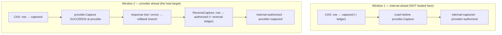
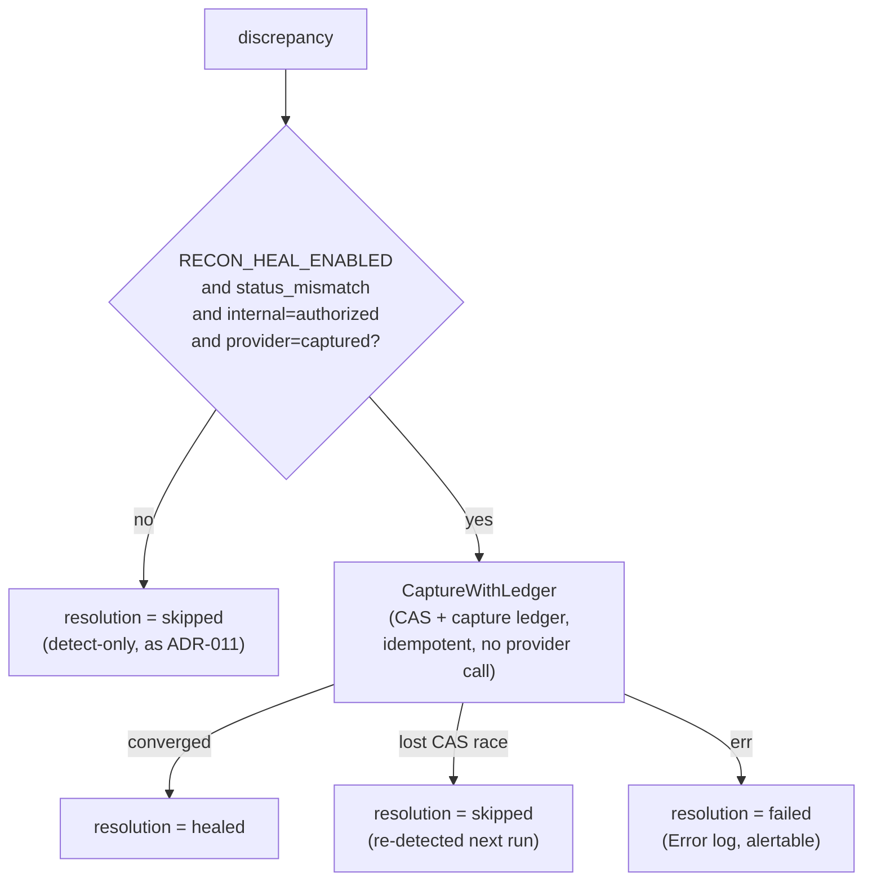

# ADR-012: Auto-heal one reconciliation class — the lost-capture-response window

Reconciliation may now self-correct **exactly one** drift class — an internal
`authorized` row against a provider `captured` charge — by re-driving the
existing idempotent capture. Every other class stays detect-only. Off by default
(`RECON_HEAL_ENABLED`).

| Status | Date | Related RFC |
|--------|------|-------------|
| Accepted | 2026-07-06 | [RFC-0010](../../rfc/RFC-0010/) |

> **Don't forget: every decision is a tradeoff.** Record what you gave up, not just
> what you gained.

## Context

[ADR-011](../ADR-011-detect-only-reconciliation/) shipped reconciliation
**detect-only**: the reconciler is *typed* to be unable to move money (its
provider port exposes only `GetTransactions`; its repository port writes only the
`reconciliation_*` tables). A human reads the report and corrects through the
normal audited APIs. That ADR named the soak condition for unlocking heal — a
stretch of runs where every flag was a true positive — and left the heal rules
as a future slice. Detection has since soaked: the detector's two benign
cross-vocabulary pairings (expired-hold, partial-refund) are understood and
suppressed by `statusReconciled`, and the paging bug that once dropped provider
pages is fixed.

The drift class worth automating first comes straight from the capture code.
`Service.Capture` is **CAS-first**: it commits the internal row to `captured`
(with the balanced capture ledger entry) *before* calling the provider. That
ordering creates two distinct crash/failure windows, and they are **not
symmetric**:

Both surface to the reconciler as a `status_mismatch`, but only one is safely
healable *from the internal side*:

- **Window 1 (`internal=captured` / `provider=authorized`)** — the provider
  never collected. Converging means driving the **provider** to capture, a
  provider write the reconciler deliberately cannot make (ADR-011). Out of scope.
- **Window 2 (`internal=authorized` / `provider=captured`)** — the provider
  *already collected the money*, but our lost-response rollback reverted the row.
  The internal state is simply behind the truth. Converging means re-running the
  capture we already have: `CaptureWithLedger`, CAS-guarded and idempotent.

Window 2 is the one to heal: the money is real, the fix is a no-net-new-effect
replay of an existing audited path, and getting it wrong is bounded by the CAS.

## Decision

**We will auto-heal exactly one class — Window 2 — and only when
`RECON_HEAL_ENABLED` is true (default false).** With the flag off, behaviour is
identical to ADR-011: detect, report, human corrects.

Heal is a step that runs **after** the discrepancies are persisted, so the report
always records what was found *before* any correction. For each discrepancy the
reconciler heals **only** when all hold:

1. class is `status_mismatch`, **and**
2. internal status is `authorized`, **and**
3. provider status is `captured`.

For a matching row it calls the repository's `CaptureWithLedger` **directly** —
the CAS `authorized→captured` plus the balanced capture ledger entry in one
transaction. It does **not** go through `Service.Capture`, which would call the
provider after the CAS; heal must never touch the provider (it already captured).
Because that path is idempotent (an already-captured row is a no-op) the 5-minute
recon cadence can re-run it harmlessly. The outcome is recorded on the
discrepancy as a `resolution` (`detected | healed | skipped | failed`):

- match → attempt convergence, then record by the **actual post-state**: `healed`
  only when the row is genuinely captured; `skipped` when a concurrent
  void/expiry won the CAS so it did not converge (still a real discrepancy the
  next run re-detects); `failed` (logged at `Error`, alertable) if the capture
  path errors. A failure never aborts the run.
- every non-matching discrepancy → `skipped` (recorded, never touched).

The provider port stays read-only; heal moves the **internal** row to match a
provider charge that already happened. No new money leaves or enters — it
reconciles the ledger to a capture the provider already performed.

This supersedes ADR-011's *detect-only* posture for this single class; ADR-011
otherwise stands.

## Alternatives considered

- **Heal all four classes (the RFC's capped auto-heal).** `missing_provider`
  inside a settlement window, `amount_mismatch` ≤ 1 minor unit via a correcting
  entry, `status_mismatch` by converging. Rejected for this slice: `missing_*`
  has no safe internal write (one side simply doesn't exist), and refund-amount
  drift is undetectable at all (the provider ledger exposes only a refunded
  *flag*, not an amount — a documented ADR-011 blind spot). Automating a class we
  can't even fully detect is how a young reconciler corrupts a correct record.
- **Also heal Window 1 (`internal=captured` / `provider=authorized`) by calling
  the provider to capture.** Symmetric on paper, but it requires giving the
  reconciler a provider *write* — reversing ADR-011's core structural guarantee —
  to chase a window that means the money was never collected (so the safe default
  is to *not* assert revenue). Rejected: keep the provider port read-only; a
  human voids or re-captures Window 1 through the normal APIs.
- **Heal unconditionally (no flag).** Simpler, but removes the staged-trust
  on-ramp ADR-011 was explicit about. The flag lets heal soak in one environment
  while others stay detect-only, and gives an instant kill-switch. Rejected.
- **Edit the row directly / post a raw ledger entry to "fix" it.** Fast, and
  catastrophic on a misclassification — it bypasses the CAS and the state
  machine. Rejected: only ever converge through the existing idempotent capture
  path, never a bespoke write.

## Consequences

- **One real, self-healing MTTR.** The lost-capture-response window — money
  collected, row reverted — closes automatically within a recon cycle instead of
  waiting on a human. This is the exact ADR-007 revenue-assurance gap for the
  provider-ahead direction.
- **The blast radius is the CAS.** Heal only ever calls an idempotent,
  CAS-guarded capture on a row that reconciliation says is `authorized` while the
  provider says `captured`. A stale read loses the CAS and no-ops; a concurrent
  void/expiry is serialized by the same CAS. A misclassification can at worst
  capture a row the provider genuinely captured — the safe direction.
- **Everything else is unchanged from ADR-011.** All other classes, and Window 1,
  remain detect-only: reported, `skipped`, human-corrected. `failed` heals are
  logged at `Error` for alerting.
- **The flag is load-bearing.** Default-off means production keeps ADR-011
  behaviour until an operator opts in; the report still records `detected` for
  the healable class so a dry run shows what *would* heal.
- **New schema.** `reconciliation_discrepancies` gains `resolution` +
  `resolved_at` (migration `000009_recon_resolution`) so a run's corrections are
  auditable alongside its detections.
- **Revisit trigger:** if alert data shows Window 1 (provider-ahead's mirror) or
  `missing_provider` recurring often enough to need automation, re-open with a
  proposal for a *provider-writing* reconciler — a larger decision that reverses
  ADR-011's read-only guarantee and deserves its own ADR.

---

_Last updated: 2026-07-06_
