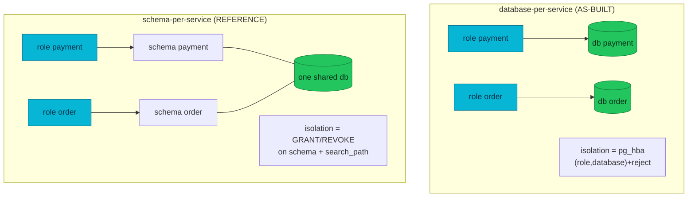
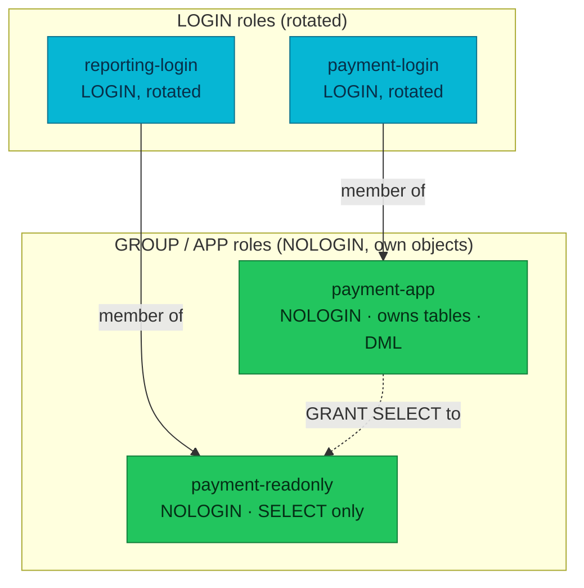
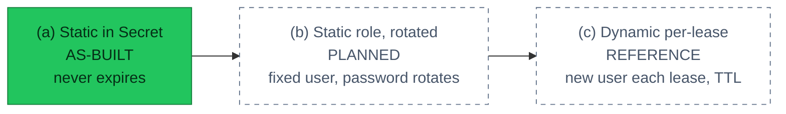

# ADR-025: PostgreSQL credential delivery & role model

The authoritative design record for **how PostgreSQL credentials are delivered, rotated,
and authorized** on this platform — covering isolation model (database- vs
schema-per-service), the role model (flat today vs a tiered target), the credential
spectrum (static → static-rotated → dynamic), pooler authentication modes, delivery &
rotation mechanics, and human/DBA access. It supersedes the original narrow ADR-025
("PgDog passthrough") by folding that PoC into the wider picture.

| Status | Date | Related RFC | Related ADRs |
|--------|------|-------------|--------------|
| Proposed | 2026-07-20 | [RFC-0008](../../rfc/RFC-0008/) · [RFC-0012](../../rfc/RFC-0012/) | [ADR-013](../ADR-013-per-service-db-triplet/) · [ADR-014](../ADR-014-pooler-credentials-valuesfrom/) · [ADR-015](../ADR-015-pg-hba-connection-isolation/) · [ADR-024](../ADR-024-floci-kms-emulator-auto-unseal/) · [ADR-026](../ADR-026-platform-db-pgbouncer-pilot/) |

> **Every decision is a tradeoff.** Stronger credential hygiene (short-lived, rotated,
> least-privilege) costs operational churn, pooler complexity, and app-side reconnection.
> The right point on that curve differs for **machines** (favor simple + stable) and
> **humans** (favor ephemeral + least-standing-access).

> **Legend for this ADR.** **As-built** = deployed today. **Planned** = committed target,
> not yet deployed. **Reference** = an industry-standard pattern documented for learning /
> comparison; not a commitment. Sections mix all three and label each.

---

## 1. Context & scope

Today every service authenticates to PostgreSQL with a **static password** that lives, in
plaintext, in a Kubernetes Secret (ESO-delivered from OpenBAO KV). A `kubectl get secret`
yields a credential that is valid **forever**. RFC-0008 finding #4 wants better: rotation
and/or short-lived credentials. But "just turn on dynamic credentials" collides with three
realities — the **isolation model**, the **role model**, and the **pooler** — so this ADR
maps the whole space and records what we choose for each.

**What this ADR decides** (§9): keep database-per-service; app service accounts move to
**static, rotated** login roles; humans use **dynamic** short-lived roles; pooler auth
follows [ADR-026](../ADR-026-platform-db-pgbouncer-pilot/). **What it teaches** (§2–§8):
the alternatives and their real-world tradeoffs, so future changes are informed.

---

## 2. Isolation model — database-per-service vs schema-per-service

**As-built: database-per-service.** Each service owns a dedicated PostgreSQL **database**
(`payment`, `cart`, `order`, …), owner = a same-named role; isolation is enforced by
**pg_hba per-`(role, database)` allow + a trailing `reject`** ([ADR-015](../ADR-015-pg-hba-connection-isolation/)).
There is no shared database partitioned by schema — no `CREATE SCHEMA`, no `search_path`
tricks. A leaked credential opens exactly one database.

The main **reference** alternative is **schema-per-service** (or schema-per-tenant): one
shared database, each service/tenant in its own `schema`, isolation by `GRANT`/`REVOKE` on
schemas + `search_path`.

| Dimension | **database-per-service** (as-built) | **schema-per-service** (reference) |
|---|---|---|
| Isolation primitive | pg_hba per-(role,database) + reject | schema `GRANT`/`REVOKE` + `search_path`; `REVOKE ... FROM PUBLIC` |
| Blast radius of a leaked cred | **one database** | one schema — **but** a misconfigured grant/`search_path` can leak sideways within the shared DB |
| Cross-service query | impossible without a second connection (good for microservices) | easy (`other_schema.table`) — convenient but erodes boundaries |
| PgBouncer/PgDog pool keying | pool per `(user, database)` → **more pools**, but clean separation | fewer databases → fewer pools; but users share a DB, so noisy-neighbor at the pool |
| Backup / restore / PITR granularity | **per database** (drop/restore one service cleanly) | whole shared DB; per-schema restore is manual |
| Connection overhead | one connection targets one DB | same DB, can multiplex more |
| Extensions / `shared_preload` | per database | shared — one service's extension affects all |
| Ops cost of adding a service | new `Database` + role + pg_hba line | new schema + grant set |
| Typical real-world fit | **microservices with independent lifecycles** (this platform) | **multi-tenant SaaS** (schema-per-tenant), or a monolith split into modules |

**Real cases.** Microservice platforms overwhelmingly pick **database-per-service**: each
team owns its lifecycle, backups, and blast radius (this platform, via ADR-013/015).
**Schema-per-tenant** shines for multi-tenant SaaS with thousands of identical tenants
where a database each is too heavy — but it leans entirely on disciplined `GRANT`s and
`search_path`, and one bad grant crosses tenants.

**Decision:** **stay database-per-service.** It matches the microservice shape, gives the
strongest default blast-radius, and the pg_hba model (ADR-015) already enforces it. A move
to schema-per-service would collapse the databases and rewrite the isolation model —
out of scope. Everything below expresses the role/credential design **within** the
database-per-service world.

---

## 3. Role model — flat today, tiered target

**As-built: flat.** Each service has exactly **one LOGIN role** (`inRoles: []`), which
**owns its database** and thus its tables. There is no group role, no read-only role, and
**no `GRANT`/`REVOKE`** anywhere — privileges come purely from ownership; `PUBLIC CONNECT`
is not revoked (ADR-015 deliberately relies on pg_hba, not grants).

**Reference target: tiered roles.** The industry-standard hardening is to split *who owns*
from *who logs in*, and to separate read/write from read-only:

- **App role** (`payment-app`, NOLOGIN) **owns** the schema/objects and holds DML
  (`CONNECT`, `USAGE`, `SELECT/INSERT/UPDATE/DELETE`) — **no** `DROP DATABASE`, `CREATE
  ROLE`, `ALTER SYSTEM`. Because it is NOLOGIN, no one authenticates *as* it.
- **Login role** (`payment-login`, LOGIN) is a **member** of `payment-app`, inherits its
  rights, and is the credential that **rotates**. Rotating a login never touches ownership.
- **Read-only role** (`payment-readonly`, NOLOGIN) holds `SELECT` only; a `reporting-login`
  is a member. Analytics/BI get read access without write.
- **DBA role** (`platform-dba`, LOGIN) — elevated, rotated by a stricter policy.
- **Pooler auth role** — CNPG's `cnpg_pooler_pgbouncer` (auto-managed, cert-auth), used by
  PgBouncer's `auth_query` (§5); rarely rotated.

### Naming convention (reference — reconciled to as-built)

| Kind | Example | LOGIN? | Rotated by OpenBAO? | As-built today |
|---|---|---|---|---|
| Login role | `payment-login` | ✅ | ✅ | the single role `payment` plays this part |
| App/group role | `payment-app` | ❌ | ❌ | **not present** (would own objects) |
| Read-only role | `payment-readonly` | ❌ | ❌ | **not present** |
| DBA role | `platform-dba` | ✅ | per policy | **not present** (no standing DBA role) |
| Pooler auth | `cnpg_pooler_pgbouncer` | ✅ | rarely | present on platform-db (ADR-026); PgDog has none |

Current as-built names (unchanged): SQL role/db `<svc>`; `DatabaseRole` CR
`<cluster>-role-<svc>`; Secret `<cluster>-<svc>-secret`; OpenBAO
`secret/data/local/databases/<cluster>/<svc>`.

**Cost of the tier (planned).** The platform manages **no grants** today (RFC-0012 /
ADR-015). A tiered model needs a grant-management mechanism — a bootstrap SQL Job or
per-service migration running `CREATE ROLE … NOLOGIN`, `GRANT`, `ALTER DEFAULT PRIVILEGES`,
and (for owner=group) `REASSIGN OWNED`. That is a real addition, deliberately deferred.

---

## 4. Credential spectrum — static → static-rotated → dynamic

| | (a) Static in Secret | (b) **Static role, rotated** | (c) Dynamic per-lease |
|---|---|---|---|
| Username | fixed | **fixed** | changes every lease (`v-…`) |
| Password | fixed forever | rotated on a schedule | new every lease |
| OpenBAO | KV `ExternalSecret` | `database/static-roles` (`rotation_period`) | `database/roles` + `VaultDynamicSecret` |
| Postgres churn | none | 1× `ALTER ROLE … PASSWORD` per period | `CREATE`+`DROP ROLE` (+`GRANT`/`REVOKE`) per lease |
| Pooler pools | 1 per (user,db) | **1 per (user,db)** (stable) | fragments — a pool per distinct user |
| Audit volume | low | low | **high** |
| Best for | (legacy only) | **app service accounts** | **humans / short jobs** |

**The churn argument (real).** With dynamic per-lease creds at TTL=1h across ~1000
service instances, Postgres would run on the order of **~1000 `CREATE ROLE` + ~1000 `DROP
ROLE` per hour** (≈ tens of thousands of role DDLs/day), each with `GRANT`/`REVOKE` — heavy
audit noise, `pg_roles` churn, and (if pg_hba matched exact names) constant HBA edits. This
is exactly why large platforms reserve dynamic creds for **humans and ephemeral jobs** and
use **static-rotated** roles for long-running app service accounts.

**Decision (spectrum):**

| Consumer | Choice | Why |
|---|---|---|
| **App service account** | **(b) static role, rotated** (e.g. 30–60 days) | stable username → pooler-friendly (1 pool), no role churn, simple |
| **Human (dev/SRE/DBA)** | **(c) dynamic**, short TTL | least standing access, per-person audit, auto-expiry |
| **Short-lived job** | (c) dynamic | scoped to the job's lifetime |

---

## 5. Pooler authentication modes

A pooler must decide how a client proves who it is. Three modes exist across poolers:

| Mode | How | PgDog | PgBouncer (CNPG) |
|---|---|---|---|
| **Static userlist** | pooler stores the password, validates locally | ✅ (`users.toml`, today via `valuesFrom`) | ✅ |
| **Passthrough / forward** | pooler forwards the client password; **Postgres authenticates**; bad creds ban the pool | ✅ `passthrough_auth` | — |
| **auth_query** | pooler uses a **dedicated account** to look up the password hash from `pg_shadow` and validates itself | ❌ **not supported** | ✅ (`cnpg_pooler_pgbouncer` + `user_search`) |

> **Correction folded in:** "the pooler uses a dedicated account to verify the user" is
> **auth_query = PgBouncer**, *not* PgDog. **PgDog has no auth_query** — its only
> no-static-list option is **passthrough**.

**Per-cluster (ADR-026):** product-db = **PgDog** (static list, or passthrough for
rotating users); platform-db = **CNPG PgBouncer** (**auth_query**, operator-managed).

**Pool keying = per `(user, database)`** in both. So a **fixed username** (static-rotated,
§4b) yields **one pool** — the pooler-friendly path — while **dynamic per-pod/per-lease
usernames fragment** into many pools. This is the second reason app creds should be
static-rotated, not dynamic.

**Rotation seamlessness (PoC evidence).** PgDog passthrough was validated by a
docker-compose PoC (images matching deployed `0.1.26` + upgrade candidate `0.1.49`);
`poc_dyn` was **never** in `users.toml`:

| Test | Config / version | Result |
|------|------------------|--------|
| Unlisted user connects (passthrough) | `enabled_plain`, 0.1.26 | ✅ Postgres authenticates |
| Wrong password | `enabled_plain`, 0.1.26 | ✅ rejected, pool banned |
| Rotate on a warm pool, no reload | `enabled_plain`, 0.1.26 | ❌ new password fails until reload (warm pool caches the old one) |
| Rotate on a warm pool, no reload | `enabled_plain_allow_change`, 0.1.49 | ✅ works immediately |
| `_allow_change` variant | 0.1.26 | ❌ rejected — **upgrade required** |

So even with a **fixed username**, password rotation is only seamless on PgDog with
`*_allow_change` (≥0.1.49). PgBouncer's `auth_query` re-looks-up on new connections, so it
tracks a rotated password without a static list at all.

---

## 6. Delivery & rotation mechanics

- **Static (a/b):** ESO `ExternalSecret` (KV) or a static-role secret → a K8s Secret the
  app consumes. **Dynamic (c):** ESO **`VaultDynamicSecret`** generator
  (`generators.external-secrets.io`, shipped by ESO 2.5.0, currently unused) reads
  `database/creds/<role>` and materializes rotating `username`+`password`.
- **The reconnection problem (as-built gap).** App creds arrive as **env vars**
  (`DB_USER`/`DB_PASSWORD`), read **once at pod start**; `pkg/dbx.NewPool(dsn)` parses the
  DSN once and has **no reload**. So today a rotated Secret only takes effect on **pod
  restart**.
- **Seamless path (planned):** deliver creds as a **file mount** (Secret as a volume) and
  give `pkg/dbx` a `pgxpool.Config.BeforeConnect` hook that reads the current
  user/password from the file **per new connection**. Existing connections drain at
  `server_lifetime`; new ones pick up the rotated cred — no restart. Set ESO
  `refreshInterval` **< TTL/rotation_period** so a fresh cred exists before the old expires
  (overlap window).
- **Who rotates what:** only **LOGIN** roles rotate (§3). App/group and read-only roles are
  NOLOGIN and never hold a password.

```mermaid
flowchart LR
    OB["OpenBAO<br/>static-role rotate (app)<br/>or dynamic (human)"] --> ESO["ESO<br/>ExternalSecret / VaultDynamicSecret"]
    ESO -->|"file mount (planned)"| VOL["/etc/db/secret"]
    VOL --> APP["app: dbx BeforeConnect<br/>reads current cred (planned)"]
    APP --> POOL["pooler (passthrough / auth_query)"]
    POOL --> PG[("PostgreSQL")]
    classDef platform fill:#7c3aed,color:#fff,stroke:#5b21b6;
    classDef service fill:#06b6d4,color:#082f49,stroke:#0e7490;
    classDef data fill:#22c55e,color:#052e16,stroke:#15803d;
    classDef planned fill:#fff,color:#475569,stroke:#64748b,stroke-dasharray:5 5;
    class OB,ESO,POOL platform; class APP service; class PG data; class VOL planned;
```

---

## 7. Human & DBA access (reference)

Humans never get a standing password — they request **dynamic, short-lived** creds scoped
to their role and everything is audited:

| Role | Dynamic role | Grants | TTL | Who (OIDC group) |
|---|---|---|---|---|
| Dev | `db-<svc>-ro` | `SELECT` only | 1h | `developers` |
| SRE | `db-<svc>-rw` | DML (or member of app role) | 1h | `sre` |
| Break-glass | `db-<svc>-admin` | broad, rare | 15–30m | on-call + approval + alert |

**OIDC for people, Kubernetes-auth for machines.** People never hold a static OpenBAO
token; each credential grant is logged (OpenBAO audit → Vector → VictoriaLogs). On **Kind**
OIDC is not available (RFC-0008 marks it cloud/staging), so the *mechanics* (dynamic
read-only role + TTL + audit) are rehearsable but OIDC itself is production-only.

---

## 8. Operations & audit at scale

- **Dynamic cost:** role DDL churn, audit-log volume, `pg_roles` growth, lease bookkeeping,
  and pooler pool fragmentation. Great for humans (bounded count), painful for thousands of
  app instances.
- **Static-rotated cost:** one `ALTER ROLE … PASSWORD` per period per role; pooler stays at
  one pool per (user, db); the only real complexity is **seamless app reconnection** (§6).
- **Monitor:** rotation success/age, pooler auth failures, sealed/expired-cred errors,
  ESO `sync_calls_error_total`.
- **Pragmatic recommendation:** static-rotated for app service accounts is the lower-risk,
  lower-noise default at scale; spend the dynamic complexity budget where it pays off —
  human access.

---

## 9. Decision (summary)

1. **Keep database-per-service** (ADR-013/015); schema-per-service documented as reference
   only.
2. **App service accounts → static, rotated login roles** (OpenBAO `database/static-roles`,
   fixed username, ~30–60d). **Humans/jobs → dynamic** short-TTL roles. (§4)
3. **Role model target = tiered** (NOLOGIN app/group owns objects ← rotated LOGIN member +
   read-only role), least-privilege per service. **Planned** — as-built is flat
   single-login; needs a grant-management mechanism (§3).
4. **Pooler auth follows [ADR-026]:** product-db PgDog (passthrough for rotating users, no
   auth_query); platform-db PgBouncer (auth_query). Fixed usernames keep pooling to one
   pool per (user, db). (§5)
5. **Seamless rotation is planned** via file-mounted creds + `pkg/dbx` `BeforeConnect` +
   ESO `refreshInterval` < rotation period. (§6)

## Alternatives considered

- **Dynamic per-lease for apps** — strongest isolation but role/audit churn + pool
  fragmentation at scale; rejected as the default (kept for humans). (§4, §8)
- **Migrate to schema-per-service** — convenient cross-service access, fewer databases; but
  weaker default isolation and rewrites ADR-015. Rejected. (§2)
- **PgDog `server_auth = "vault"`** — exists but undocumented/untested and static-role-only
  (skipped for passthrough); not a dynamic path. (§5)
- **Keep static-in-Secret forever** — status quo; no rotation. Rejected (the finding).

## Consequences

**Gain:** a coherent, scale-aware credential strategy — simple stable creds for machines,
ephemeral least-privilege for humans — with the pooler and role model that support it, and
a documented comparison so future architecture changes are informed.

**Accept:** the tiered role model, static-role rotation, seamless reconnection
(`pkg/dbx` change), and human OIDC access are **planned**, not deployed; each is a distinct
follow-up slice. Grants/tiers add a management mechanism the platform has so far avoided.
Two poolers now differ (PgDog vs PgBouncer). Production passthrough requires TLS.

## Related

- [RFC-0008](../../rfc/RFC-0008/) (secrets hardening — finding #4) · [RFC-0012](../../rfc/RFC-0012/) (credential triplets)
- [ADR-013](../ADR-013-per-service-db-triplet/) · [ADR-014](../ADR-014-pooler-credentials-valuesfrom/) · [ADR-015](../ADR-015-pg-hba-connection-isolation/) · [ADR-024](../ADR-024-floci-kms-emulator-auto-unseal/) · [ADR-026](../ADR-026-platform-db-pgbouncer-pilot/)
- [`docs/databases/008-pooler.md`](../../../databases/008-pooler.md)
