# ADR-025: PgDog passthrough auth to unblock dynamic DB credentials

Adopt PgDog **`passthrough_auth`** (plus a PgDog upgrade to a build with the
`*_allow_change` variants) as the mechanism that lets OpenBAO **dynamic** database
users authenticate **through the pooler** — the load-bearing blocker for RFC-0008's
dynamic DB credentials (finding #4). This ADR decides the *pooler groundwork*; app
conversion to dynamic creds is a later slice.

| Status | Date | Related RFC | Related research |
|--------|------|-------------|------------------|
| Proposed | 2026-07-20 | [RFC-0008](../../rfc/RFC-0008/) | [RFC-0008 research.md](../../rfc/RFC-0008/research.md) |

> **Every decision is a tradeoff.** Passthrough makes the pooler forward the client's
> password to PostgreSQL for authentication instead of validating it against a static
> list — which is exactly what dynamic users need, but it also means the pooler sees the
> plaintext password (mandating TLS in production) and pools fragment per distinct user.

## Context

RFC-0008 finding #4 wants OpenBAO's **database secrets engine** to mint short-lived
`v-{role}-{ts}` PostgreSQL users instead of static passwords. The as-built platform
blocks this at the **pooler**:

- Every app reaches PostgreSQL through **PgDog** (`pgdog-product`, `pgdog-platform`),
  which holds a **static, positional `[[users]]` list** with one password per role,
  injected via Flux `valuesFrom` from the ESO-delivered Secret. There is **no
  `auth_query`**, no admin/passthrough mode enabled today (`passthrough_auth =
  "disabled"`), so a rotating/unlisted username simply cannot authenticate.
- (Correction to the RFC premise: `cart`/`order` are **no longer** hardcoded
  `postInitSQL` users — all 11 roles are already RFC-0012 triplets. The only remaining
  part of finding #4 is the dynamic engine itself.)
- Direct-to-primary paths (Temporal, golang-migrate jobs) **bypass PgDog** and hit
  `*-db-rw:5432`, so they are not blocked — but the app runtime path is.

A [PoC](#poc-evidence) proved PgDog's `passthrough_auth` removes this blocker.

## Decision

On Kind, make the pooler **dynamic-ready**:

1. **Enable `passthrough_auth`** on the PgDog poolers. With it, PgDog asks the client for
   its password, **forwards it to PostgreSQL for authentication** (PG is authoritative;
   bad creds get the pool banned), and creates the user/pool on the fly — **no static
   `[[users]]` entry required**. Kind uses `enabled_plain_allow_change` (no TLS in
   cluster); **production must use `enabled_allow_change` with TLS** (passthrough exposes
   the plaintext password to the pooler otherwise).
2. **Upgrade PgDog** from the deployed `0.1.26` to a build that supports the
   `*_allow_change` variants (validated on `0.1.49`). `0.1.26` only has
   `disabled|enabled|enabled_plain`, under which a rotated password **fails until a
   pooler reload** — unacceptable for TTL'd dynamic creds.
3. **Per-service, not per-pod, dynamic users.** PgDog keys server pools per
   `(user, database)`, so a unique username per pod would fragment pooling. The engine
   issues one rotating user *per service role*, refreshed on a TTL.
4. **Role ownership stays split.** CNPG keeps owning the base/owner role (schema
   ownership, RFC-0012 triplet). The OpenBAO DB-engine `creation_statements` `GRANT` each
   ephemeral user **into a group role** (e.g. `app_cart`); `pg_hba` matches the group, so
   rotating usernames need no per-name HBA rule and there is no CNPG-vs-Vault ownership
   fight.
5. **Delivery via ESO `VaultDynamicSecret`** generator (`generators.external-secrets.io`,
   already shipped by ESO 2.5.0, currently unused) reads `database/creds/{role}` and
   materialises the rotating `username`+`password` into the app Secret.

**Scope of this slice:** the pooler groundwork (upgrade + passthrough + a rehearsal that
a dynamic user authenticates through PgDog). **Deferred** to a later slice: enabling the
OpenBAO DB engine for real service roles, `pg_hba` group wiring, and app-side
reconnection on rotation.

```mermaid
flowchart LR
    OB["OpenBAO DB engine<br/>(planned)"] -->|"v-cart-* GRANT app_cart"| PG[("PostgreSQL<br/>(CNPG)")]
    OB -->|"database/creds/cart"| ESO["ESO VaultDynamicSecret<br/>(planned)"]
    ESO -->|"rotating user+pass"| SEC["app Secret"]
    SEC --> APP["cart app"]
    APP -->|"passthrough_auth"| PD["PgDog<br/>(upgraded, passthrough)"]
    PD -->|"forwards creds → PG authenticates"| PG
    classDef service fill:#06b6d4,color:#082f49,stroke:#0e7490;
    classDef data fill:#22c55e,color:#052e16,stroke:#15803d;
    classDef platform fill:#7c3aed,color:#fff,stroke:#5b21b6;
    classDef planned fill:#fff,color:#475569,stroke:#64748b,stroke-dasharray:5 5;
    class APP service; class PG data; class PD,ESO platform; class OB,ESO planned;
```

## POC evidence

Docker-compose, PgDog images matching deployed `0.1.26` and the upgrade candidate
`0.1.49`, against `postgres:16`; user `poc_dyn` **never listed** in `users.toml`:

| Test | Config / version | Result |
|------|------------------|--------|
| Unlisted user connects through PgDog | `enabled_plain`, 0.1.26 | ✅ `current_user=poc_dyn` (PG authenticates) |
| Wrong password | `enabled_plain`, 0.1.26 | ✅ rejected (`FATAL: password … is wrong`) |
| Rotate password, warm pool, no reload | `enabled_plain`, 0.1.26 | ❌ new password fails until reload; warm pool keeps serving the **old** password |
| Rotate password, warm pool, no reload | `enabled_plain_allow_change`, 0.1.49 | ✅ new password works immediately |
| `_allow_change` rejected by old build | 0.1.26 | ✅ confirms upgrade is required |

## Alternatives considered

- **PgDog `auth_query` (PgBouncer-style)** — PgDog has **no `auth_query`**; passthrough is
  its equivalent. Not available.
- **PgDog native `server_auth = "vault"`** — exists (v0.1.46+) but is **undocumented,
  untested**, and per source is for **static** Vault roles only (explicitly *skipped for
  passthrough*). Not a dynamic path.
- **Bypass PgDog for dynamic paths** (direct-to-`-rw`, as migrations/Temporal do) — works
  but loses pooling for app runtime traffic; only viable for low-connection consumers.
- **Keep static triplets** — the status quo; no dynamic creds. Rejected (the finding).

## Consequences

**Gain:** the pooler blocker is removed — dynamic OpenBAO DB users can authenticate
through PgDog; the platform can proceed to real dynamic creds in a later slice; the path
mirrors production (swap `enabled_plain_allow_change` → TLS `enabled_allow_change`).

**Accept (the cost):**
- **Passthrough shows the pooler the plaintext password.** On Kind (`enabled_plain`, no
  in-cluster TLS) this is plaintext over the pod network — acceptable dev-grade,
  documented. **Production must run passthrough with TLS.**
- **PgDog upgrade (0.1.26 → ≥0.1.49) is required** for seamless rotation; upgrading the
  pooler is a change to the live DB path and must pass the full app-connectivity e2e.
- **Enabling passthrough changes auth for *all* users on that pooler** (not just dynamic
  ones) — existing static-triplet services must be verified to still connect.
- **Rotation is not instant on a warm pool without `_allow_change`** — the pool caches the
  old credential; `_allow_change` (upgraded build) is what makes rotation seamless.
- **Per-service, not per-pod** dynamic users (pool-keying constraint) — coarser than
  per-pod isolation, but keeps pooling effective.
- **App reconnection on rotation** and the **OpenBAO DB engine + `pg_hba` group wiring**
  are **not** solved here — deferred to the next slice.

## Related

- [RFC-0008](../../rfc/RFC-0008/) (finding #4 — dynamic DB creds) · [research.md](../../rfc/RFC-0008/research.md)
- [ADR-024](../ADR-024-floci-kms-emulator-auto-unseal/) (Slice 1 — auto-unseal)
- RFC-0012 (CNPG credential triplets — the static baseline this builds on)
