# ADR-028: inventory reservation & balance model

The as-built data and behaviour model inventory-service ships with: derived
available-to-promise, a reservation FSM with claim-via-row idempotency, and an
append-only movement ledger.

| Status | Date | Related RFC | Related research |
|--------|------|-------------|------------------|
| Accepted | 2026-07-24 | [RFC-0021](../../rfc/RFC-0021/) | [RFC-0021 research.md](../../rfc/RFC-0021/research.md) |

> **Every decision is a tradeoff.** Never storing available-to-promise removes a
> whole class of drift bugs but recomputes it on every read; separate physical and
> reserved deltas make the ledger auditable at the cost of a wider movement row.
> We take correctness-by-construction over convenience.

> **Contract stance: as-built.** Everything below is deployed in inventory-service
> (local-stack + cluster) as the `inventory.v1` contract. It has **no live caller**
> yet — the order saga still reserves through product ([ADR-027](../ADR-027-inventory-sole-stock-authority/)).
> Model behaviour is Implemented; *live use* is RFC-0021 phases 2–4.

## Context

[ADR-027](../ADR-027-inventory-sole-stock-authority/) decides that inventory-service
owns stock. That leaves the concrete model open: how balances are stored, how
"available to sell" is computed, how a reservation moves through its lifecycle
under saga retries and concurrency, and how physical movements are audited. The
product-owned predecessor stored a single `stock_quantity` column and decremented
it in place at reserve time, which conflates "reserved" with "sold" and leaves no
movement history ([product.md](../../../api/product.md)). RFC-0021 requires no
oversell, no double-reserve, and no double-commit — proven by DB constraints and
concurrency tests, not in-memory locks. This ADR records the model that satisfies
that.

## Decision

**Balances.** One `inventory_balances` row per `(sku_id, warehouse_id)` holding
`on_hand`, `reserved`, and `safety_stock` columns.
**Available-to-promise is derived, never stored:**
`available_to_promise = max(0, on_hand − reserved − safety_stock)`, computed by
queries so it cannot drift from its inputs. "Sold" is **not** a balance bucket:
committing a reservation does `on_hand −= q; reserved −= q` and records a
`SALE_COMMITTED` movement.

**Reservation FSM.** `RESERVED → COMMITTED | RELEASED | EXPIRED`; `RESERVED` is
the only non-terminal state. Each transition is replay-idempotent. A reservation
is **claimed via its row**: the primary key is the caller's `reservation_id`
(= order id in the initial integration), and a canonical `request_hash` over the
business-effective fields (items sorted by `sku_id`, quantities, destination)
detects replays. Same `reservation_id` + same hash returns the original result;
same `reservation_id` + a different hash fails `IDEMPOTENCY_CONFLICT`; the
`external_reference` (order id) is `UNIQUE`, so reusing an order id under a new
reservation id conflicts too.

```mermaid
stateDiagram-v2
    [*] --> RESERVED: Reserve<br/>(all-or-none, one warehouse)
    RESERVED --> COMMITTED: Commit<br/>on_hand−=q; reserved−=q<br/>SALE_COMMITTED (mandatory forward)
    RESERVED --> RELEASED: Release<br/>reserved−=q (compensation)
    RESERVED --> EXPIRED: reconciler (planned, phase 3)
    COMMITTED --> [*]
    RELEASED --> [*]
    EXPIRED --> [*]

    note right of COMMITTED
        terminal — Release a committed
        sale fails INVALID_TRANSITION
        (undo via a RETURN movement)
    end note
```

**Movement ledger.** An append-only `inventory_movements` table with **separate
`on_hand_delta` and `reserved_delta` columns**, so `RESERVE` (+reserved),
`RELEASE` (−reserved), `SALE_COMMITTED` (−both), `RECEIVE`/`ADJUST` (±on_hand),
`SET_SAFETY_STOCK`, and `RETURN` all audit unambiguously. `command_id` is `UNIQUE`
— the admin-command idempotency key; reservation-driven movements are keyed by
`reference_type`/`reference_id` instead.

**Allocation policy.** One order is fulfilled from **one warehouse** (v1). Reserve
picks the lowest-id active warehouse whose per-warehouse ATP satisfies *every*
line, locks that warehouse's balance rows `FOR UPDATE` in `(warehouse_id, sku_id)`
order (one global lock order → no deadlock between concurrent reservations), and
re-validates ATP under the locks — the unlocked scan is only a hint.

## Alternatives considered

- **Store `available` as a column** — one read, no derivation cost; rejected
  because it can drift from `on_hand`/`reserved`/`safety_stock` and needs its own
  update path and reconciliation. Deriving it makes drift impossible.
- **A single signed `delta` column in the ledger** — narrower rows; rejected
  because it cannot distinguish a physical change from a reserved change, so
  `RESERVE` vs `RECEIVE` vs `SALE_COMMITTED` become indistinguishable in audit.
- **Model "sold" as a balance bucket** (`available → reserved → sold`) — rejected:
  sold stock has physically left; carrying it as a balance invites it being
  re-derived into ATP. A `SALE_COMMITTED` movement plus the `on_hand`/`reserved`
  decrement records the sale without a phantom bucket.
- **Multi-warehouse split fulfillment** — explicitly a **non-goal** in v1 (see
  Consequences); the contract carries `warehouse_id` and a `destination_region`
  hint so it lands later without a break.

## Consequences

**Gain:** oversell is structurally impossible — DB `CHECK` constraints
(`on_hand ≥ 0`, `reserved ≥ 0`, `reserved ≤ on_hand`, `quantity > 0`) are the
backstop beneath the guarded, locked reserve path; ATP cannot drift; the ledger is
a complete, auditable history separating physical from reserved change; and
idempotency is enforced by the row/PK, not by best-effort application checks.

**Accept (the cost / limits):**
- **ATP is recomputed on every read** rather than stored — the deliberate price of
  no-drift.
- **No reservation auto-expiry in v1.** `expires_at` is **observability-only**; no
  sweeper releases an active reservation. A reconciler that reports (and later
  expires) stale `RESERVED` rows is **planned for RFC-0021 phase 3** — the
  `EXPIRED` state exists in the FSM but nothing transitions into it yet.
- **One-order-one-warehouse** — a basket no single active warehouse can fulfil is
  `INSUFFICIENT_STOCK`, even if the union of warehouses could. Multi-warehouse
  split fulfilment is a **non-goal** until a future contract-compatible slice.
- **No live caller yet** — the model is exercised by tests and grpcurl, not
  production traffic, until phases 2–4.

**Revisit trigger:** the phase-3 write cutover under real load, or a
multi-warehouse / backorder (ATP-from-incoming) requirement, re-opens the
allocation and expiry decisions here.

**docs/api sync (API-touching, this PR):** the shipped model is documented in
[inventory.md](../../../api/inventory.md) (data model, FSM, RPC semantics,
allocation, observability).

## Related

- [RFC-0021](../../rfc/RFC-0021/) · [research.md](../../rfc/RFC-0021/research.md)
- [ADR-027](../ADR-027-inventory-sole-stock-authority/) — the ownership decision this model implements
- [`docs/api/inventory.md`](../../../api/inventory.md) — the as-built contract
- [product.md](../../../api/product.md) — the predecessor `stock_quantity` model being replaced

---
_Last updated: 2026-07-24_
