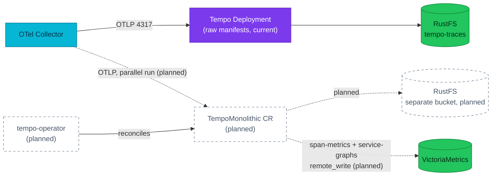

# ADR-032: Deliver Tempo through the tempo-operator TempoMonolithic CR

> **Decision summary:** We will replace the hand-written Tempo Deployment,
> ConfigMap, and Service with a `TempoMonolithic` custom resource managed by
> the grafana/tempo-operator, and enable the metrics-generator during the
> migration. We accept a new controller to operate and a Tempo version that is
> coupled to operator releases in exchange for managed upgrades,
> operator-generated config/ServiceMonitor/alerts, and a working service graph.

| Attribute | Value |
|-----------|-------|
| **Status** | Proposed |
| **Decision date** | — |
| **Owners** | `duynh` |
| **Deciders** | `duynh` |
| **Scope** | Delivery mechanism of the primary trace backend (Tempo) in the cluster |
| **Affected components** | Tempo, tempo-operator (new), OTel Collector, Grafana datasource, Kong ingress, ESO secret, RustFS buckets, Flux `tracing-local` wave |
| **Related RFC** | — |
| **Related research** | — |
| **Supersedes** | — |
| **Superseded by** | — |
| **Implementation tracking** | — (obligations below; not started) |
| **Adoption** | Not started |

## Context

Tempo is the platform's durable, primary trace backend. It runs today as raw
manifests in `kubernetes/infra/controllers/tracing/tempo/`: a single-replica
monolithic Deployment of `grafana/tempo:2.10.5` with a hand-written
`tempo.yaml` ConfigMap, an `emptyDir` WAL, and S3 storage on in-cluster RustFS
(bucket `tempo-traces`, 7-day retention). Credentials arrive via a
ClusterExternalSecret (`ACCESS_KEY_ID`/`ACCESS_SECRET_KEY`) and are spliced
into the config with the `-config.expand-env=true` flag. The Flux wave
`tracing-local` delivers it and health-checks `Deployment/tempo`.

Several pressures make the delivery mechanism worth revisiting:

- **Hand-maintained operational surface.** The Tempo config, Service,
  ServiceMonitor, and alert rules are all separate hand-written files that must
  be kept consistent with each other and with upstream Tempo defaults on every
  version bump.
- **The metrics-generator is inert.** The config carries a full
  `metrics_generator` block but `storage.remote_write` is empty and no override
  enables the processors, so no span metrics or service graphs are produced.
  The Grafana Tempo datasource is wired for `serviceMap` and `tracesToMetrics`
  against VictoriaMetrics — both dead ends today.
- **Upstream now ships a mature operator.** tempo-operator v0.21.0 manages
  Tempo v2.10.5 (exactly the running version), generates config,
  ServiceMonitors, PrometheusRules, and a Grafana datasource from a CR, and
  fixed the bug class this platform cares about (stuck deletion race, missing
  NetworkPolicy ports, env/`extraConfig` secret injection).
- **Learning value.** The platform already delivers Temporal, VictoriaMetrics,
  VictoriaLogs, CNPG, and Grafana through operators; Tempo is the remaining
  hand-rolled observability backend.

## Scope

### In scope

- How Tempo is delivered to the cluster: raw manifests vs an operator-managed
  custom resource, and which tempo-operator CR shape (`TempoMonolithic` vs
  `TempoStack`).
- Enabling the metrics-generator (span-metrics + service-graphs remote-written
  to VictoriaMetrics) as part of the migration.
- The rollout shape: a parallel run next to the existing Deployment before any
  cutover.

### Out of scope

- **Trace backend consolidation** (Tempo vs VictoriaTraces vs ClickHouse).
  `backends-comparison.md` already reserves that for a future ADR gated on
  VictoriaTraces reaching ~1.0/GA; this ADR keeps Tempo as the durable primary.
- Replacing the standalone in-memory Jaeger with the CR's embedded
  `jaegerui`. The CR enables Jaeger UI for Tempo's own data, but retiring the
  separate Jaeger deployment (and its collector exporter) is a follow-up
  decision.
- The head-sampling policy and the collector fan-out topology (RFC-0014 /
  ADR-023 territory).
- local-stack — it does not run Tempo (the `spanmetrics` connector stands in
  for the metrics-generator there).

## Decision drivers

| Priority | Driver | Why it matters |
|---------:|--------|----------------|
| 1 | Operability | Config, ServiceMonitor, alert rules, and upgrades should come from one declarative source instead of four hand-kept files |
| 2 | Blast radius / footprint | The Kind homelab budgets ~256Mi for Tempo; the replacement must stay a single pod |
| 3 | Learning value | Operating a real upstream operator (CRD semantics, managed upgrades, parallel-run cutover) is an explicit goal of this platform |
| 4 | Correctness of existing wiring | Grafana serviceMap/tracesToMetrics are configured but have no data source behind them; the migration should close that gap |

## Decision

We will deliver Tempo through the grafana/tempo-operator using a
`TempoMonolithic` custom resource (`tempo.grafana.com/v1alpha1`), replacing the
hand-written Deployment, ConfigMap, and Service. The operator is installed from
its released `tempo-operator.yaml` bundle (there is no official Helm chart) and
relies on cert-manager, which the Flux chain already provides.

The CR keeps the current shape — one pod, S3 backend on RustFS, 7-day
retention, OTLP gRPC/HTTP ingestion — and adds what the operator makes cheap:
operator-generated ServiceMonitor and PrometheusRules, the embedded Jaeger UI,
and an active metrics-generator remote-writing span-metrics and service-graphs
to VictoriaMetrics. Settings the `TempoMonolithic` CRD does not expose as
first-class fields (compactor retention, metrics-generator wiring) go through
`spec.extraConfig.tempo`, which the operator merges over its generated config.

Target CR (planned, illustrative — exact values land with implementation):

```yaml
apiVersion: tempo.grafana.com/v1alpha1
kind: TempoMonolithic
metadata:
  name: tempo
  namespace: monitoring
spec:
  storage:
    traces:
      backend: s3
      s3:
        secret: tempo-rustfs-credentials   # keys: bucket, endpoint, access_key_id, access_key_secret
  jaegerui:
    enabled: true
  observability:
    metrics:
      serviceMonitors: { enabled: true }
      prometheusRules: { enabled: true }
    grafana:
      dataSource: { enabled: false }       # keep the existing GrafanaDatasource (tracesToProfiles, serviceMap, tracesToLogsV2)
  extraConfig:
    tempo:
      compactor:
        compaction:
          block_retention: 168h
      metrics_generator:
        storage:
          remote_write:
            - url: <VictoriaMetrics vminsert remote-write URL>
      overrides:
        defaults:
          metrics_generator:
            processors: [service-graphs, span-metrics]
```

### Decision rules

| Rule | Required behavior |
|------|-------------------|
| **Ownership** | The `TempoMonolithic` CR is the single source of Tempo config; no hand-written Tempo ConfigMap/Deployment may coexist after cutover |
| **Write path** | Tempo config changes are edits to the CR (or its `extraConfig`) in git, reconciled by Flux; never `kubectl edit` on operator-generated objects |
| **Read path** | Producers and consumers use the operator-generated Service (`tempo-<cr-name>.monitoring.svc`); the legacy `tempo.monitoring.svc` name disappears at cutover |
| **Boundary** | Multitenancy, gateway/OIDC, and mTLS stay off — single-tenant, in-cluster only; needing them is a revisit trigger (TempoStack), not an `extraConfig` hack |
| **Failure behavior** | Parallel-run instances must use separate RustFS buckets; two Tempo instances must never share one bucket |
| **Compatibility** | Migration happens on a Tempo version the operator ships (v0.21.0 ↔ Tempo 2.10.5), so no block-format change is in play; version bumps thereafter ride operator releases via Renovate |

### Decision view



## Alternatives considered

| Option | Benefits | Costs / risks | Result |
|--------|----------|---------------|--------|
| **A — TempoMonolithic via tempo-operator** | Keeps the 1-pod footprint; managed upgrades; operator-generated ServiceMonitor/PrometheusRules; embedded Jaeger UI; native S3 secret handling (drops the `expand-env` splice) | New controller + webhook to run; `v1alpha1` API; retention and metrics-generator only reachable via `extraConfig`; service DNS name changes | **Selected** |
| **B — TempoStack via tempo-operator** | First-class CRD fields for retention/limits/metrics-generator; `resources.total` auto-split; multitenancy, OIDC/RBAC gateway, inter-component mTLS | Microservices mode: ~5–7 pods (distributor, ingester + PVC, querier, query-frontend, compactor, optional gateway) — a large jump from one 256Mi pod on Kind, buying features this single-tenant, no-in-cluster-auth platform does not use | Rejected |
| **C — Keep the raw Deployment** | Zero new moving parts; Renovate keeps bumping the image directly | Hand-maintained config/monitoring surface persists; metrics-generator still needs manual wiring; no operator learning | Rejected |
| **D — `grafana/tempo` Helm chart** | Less YAML than raw manifests; familiar HelmRelease flow | No managed upgrades or CRD semantics; swaps one templating layer for another without the learning value that motivates the change | Rejected |

### Why the selected option won

Option A is the only one that satisfies all four drivers at once: it keeps the
single-pod footprint (driver 2), moves config/monitoring/upgrades into one
reconciled CR (driver 1), is a genuine operator adoption exercise (driver 3),
and makes enabling the metrics-generator a one-block `extraConfig` addition
rather than a bespoke config rewrite (driver 4). v0.21.0 shipping exactly the
running Tempo 2.10.5 makes the migration version-neutral.

### Why the closest alternative lost

TempoStack is the "real" operator experience and the only shape with
first-class fields for everything this ADR pushes through `extraConfig`. It
lost on footprint, not features: the ingester alone becomes a StatefulSet with
a PVC, and the pre-tested size profiles assume resources the Kind homelab does
not have. Its differentiating features — multitenancy, OIDC gateway, mTLS
between components — are all no-ops for a single-tenant cluster with no
in-cluster auth. Choosing it would multiply pods roughly sevenfold to exercise
zero additional platform requirements.

## Consequences

### Positive consequences

- One declarative CR replaces four hand-kept files (ConfigMap, Deployment,
  Service, ServiceMonitor) plus the hand-written Tempo alert rules.
- Tempo upgrades become operator bumps that arrive pre-tested against the
  managed Tempo version.
- The metrics-generator finally produces `traces_spanmetrics_*` and
  `traces_service_graph_*` series, giving the already-configured Grafana
  serviceMap and tracesToMetrics links real data.
- S3 credentials are consumed natively from a Secret, removing the
  `-config.expand-env=true` splice.
- Operator-rendered pods carry a proper securityContext — the current
  Deployment has none.

### Negative consequences and accepted trade-offs

- A new controller and admission webhook to operate (and alert on), plus a
  cert-manager dependency for the webhook certificates (already present).
- Tempo's version is coupled to operator releases; Renovate shifts from
  bumping the Tempo image to bumping the operator bundle.
- The API is `v1alpha1` and may change between operator releases.
- The service DNS name changes (CR `tempo` → `tempo-tempo.monitoring.svc`),
  forcing a coordinated consumer cutover (collector exporter, Grafana
  datasource, Kong ingress, alert job labels, `flux-ui.sh`, Flux healthCheck).
- Retention, cache, and metrics-generator settings live in `extraConfig` —
  a merge the operator applies but does not validate field-by-field.

### Neutral consequences

- Kyverno posture is unchanged: no policy currently matches the `monitoring`
  namespace, so no PolicyException is needed.
- The 4-way collector fan-out (Tempo, Jaeger, VictoriaTraces, ClickHouse) is
  untouched by this decision; the parallel run temporarily makes it 5-way.
- ~15 observability docs describe the raw-manifest topology and must be
  updated at adoption time, not before.

## Implementation obligations

All rows are **planned** — nothing below has started; the decision is recorded
ahead of implementation.

| Obligation | Owner | Tracking | Completion signal |
|------------|-------|----------|-------------------|
| Deliver the operator bundle via Flux (pinned release) under `kubernetes/infra/controllers/tracing/` | `duynh` | — | `make validate` passes; operator Deployment healthy |
| ESO: emit an operator-format secret (`bucket`, `endpoint`, `access_key_id`, `access_key_secret`) alongside the current one | `duynh` | — | Secret present in `monitoring` with the four keys |
| RustFS: add a separate bucket for the parallel instance to `job-setup-buckets.yaml` | `duynh` | — | Bucket exists; CR instance writes blocks to it |
| Parallel run: `TempoMonolithic` CR (distinct name + bucket) + a fifth collector exporter | `duynh` | — | Same traces queryable from both backends in Grafana |
| Enable metrics-generator via `extraConfig` remote-writing to VictoriaMetrics | `duynh` | — | `traces_spanmetrics_*` / `traces_service_graph_*` series present; Grafana serviceMap renders |
| Cutover: repoint collector exporter, Grafana datasource, Kong ingress, alerts, `flux-ui.sh`, Flux healthCheck; remove the raw manifests and hand-written ServiceMonitor/alerts | `duynh` | — | Legacy `Deployment/tempo` gone; all consumers on the operator-generated Service |
| Update observability docs (`docs/observability/tracing/*`, `stack-review.md`, `backends-comparison.md`, `opentelemetry/README.md`, `grafana/README.md`, alert catalog, `AGENTS.md` stack line, `clusters/local/README.md`) | `duynh` | — | No doc describes the raw-manifest delivery as current |

## Validation and compliance

| Requirement | Verification |
|-------------|--------------|
| Single config source after cutover | Repo grep: no `tempo-config` ConfigMap, no `Deployment/tempo` manifest remains |
| GitOps delivery | `make validate` on every step; Flux healthCheck in `clusters/local/tracing.yaml` tracks the operator-created workload |
| Bucket isolation during parallel run | The two instances reference different bucket names in their storage config |
| Metrics-generator active | VictoriaMetrics query returns `traces_service_graph_request_total > 0` |
| Trace path intact | E2E: a demo login/checkout trace is findable via the Grafana Tempo datasource against the CR-backed instance |
| Documentation | Tracing docs and the alert catalog reference this ADR once adoption completes |

## Revisit triggers

Re-open this decision when one or more of the following become true:

- tempo-operator stops releasing, or `TempoMonolithic` is deprecated upstream.
- The platform gains a real multitenancy, in-cluster auth, or scale
  requirement that maps to TempoStack's feature set.
- VictoriaTraces reaches ~1.0/GA and the pre-announced consolidation ADR
  selects a different primary backend, making Tempo delivery moot.
- Operator version coupling blocks a Tempo upgrade the platform needs
  (e.g. a CVE fix shipping in Tempo before an operator release carries it).

A review does not automatically reverse the decision. A changed decision
requires a new ADR that supersedes this one.

## References

- [tempo-operator v0.21.0 release](https://github.com/grafana/tempo-operator/releases/tag/v0.21.0)
- [TempoMonolithic documentation](https://github.com/grafana/tempo-operator/blob/main/docs/tempomonolithic.md)
- [Tracing hub](../../../observability/tracing/README.md)
- [Trace backends comparison](../../../observability/tracing/backends-comparison.md) — reserves backend consolidation for a future ADR
- [Observability stack review](../../../observability/stack-review.md)
- [ADR-023](../ADR-023-clickhouse-observability-olap/) — ClickHouse as supplementary OLAP; Tempo remains day-to-day primary
- [ADR-002](../ADR-002-deploy-temporal-via-operator/) / [ADR-030](../ADR-030-temporal-workflow-versioning/) — prior operator-delivery precedents

## History

| Date | Status / adoption | Change |
|------|-------------------|--------|
| 2026-07-30 | Proposed / Not started | Initial draft |

---
_Last updated: 2026-07-30_
