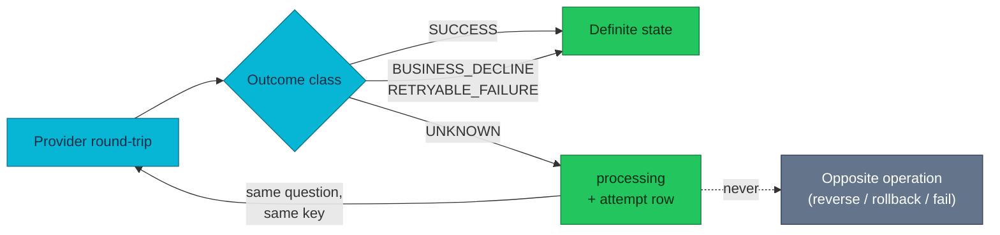

# ADR-034: Record an Unknown Provider Outcome Instead of Guessing It

> **Decision summary:** We will represent "the provider was asked and did not
> answer" as a first-class state — a `processing` intent plus a per-round-trip
> attempt log — and forbid an unknown outcome from triggering the semantic
> opposite operation. We accept a state a payment can sit in, and the machinery
> that gets it out again, in exchange for never reversing money whose fate we do
> not know.

| Attribute | Value |
|-----------|-------|
| **Status** | Accepted |
| **Decision date** | 2026-08-04 |
| **Owners** | `duynhne` |
| **Deciders** | `duynhne` |
| **Scope** | payment-service provider round-trips: authorize, capture, void, refund |
| **Affected components** | payment-service (API + gRPC + reconciler), mockpay, order-service (saga + cancellation), homelab alerts |
| **Related RFC** | [RFC-0021](../../rfc/RFC-0021/) (Phase 6) |
| **Related research** | [research.md](../../rfc/RFC-0021/research.md) |
| **Supersedes** | — |
| **Superseded by** | — |
| **Implementation tracking** | payment-service #47–#51, order-service #168–#169, homelab #646 |
| **Adoption** | Complete |

## Context

Every provider call has three possible answers, not two: yes, no, and silence.
Until phase 6 payment-service only modelled the first two, so silence was
resolved by assumption — and the assumption was always "it did not happen":

- a **capture** whose response was lost was reversed on the spot
  (`ReverseCapture`), so a provider that had collected the money was left holding
  it while our books said `authorized` with a reversal posted
- a **void** whose response was lost was rolled back to `authorized`, so a hold
  the provider had already released was recorded as still live and capturable
- a **refund** whose response was lost was answered as a success carrying
  `status:"failed"` **and sealed into the idempotency cache as a 201**, so every
  retry replayed the failed verdict and the money never returned
- an **authorize** whose response was lost stayed `pending` with no provider
  reference, which reconciliation filters out — a customer's card on hold with
  nothing looking for it

Each of these is the same mistake: an ambiguous answer treated as a definite one,
in the direction that happens to be convenient to write down. The order side had
already grown a defence against the refund case (verify `status=="succeeded"`,
park otherwise), and that defence was the platform's only mitigation.

The classifier disagreed with itself as well. A bare `503` was typed "transient"
— decided, nothing happened — while the same client's own rule said "server
errors and transport failures stay undecided: the request may well have been
processed".

## Scope

### In scope

- The vocabulary for an undecided provider answer, and where it is stored.
- The rule governing what an undecided answer may and may not trigger.
- How doubt is resolved, and by whom.
- Which HTTP/gRPC status each outcome class maps to, since the saga branches on it.

### Out of scope

- Reconciliation's own windowing and single-writer concerns — [ADR-035](../ADR-035-windowed-reconciliation/), [ADR-036](../ADR-036-single-writer-lease/).
- Refund identity — [ADR-037](../ADR-037-per-request-refund-identity/).
- Provider-side webhook settlement, which remains a separate delivery path.

## Decision drivers

| Priority | Driver | Why it matters |
|---------:|--------|----------------|
| 1 | Never move money on an assumption | A reversal against a collected charge, or a second payout, is not recoverable by retrying |
| 2 | Doubt must be escapable | A state a payment cannot leave is worse than the wrong answer it replaced |
| 3 | Callers must be able to tell doubt from rejection | The saga treats a rejection as permanent and compensates on it |
| 4 | Operability | Unresolved doubt is money nobody is looking at, so it has to be countable and ageable |

## Decision

We will model an undecided provider answer explicitly. `payments.status` gains
**`processing`**, meaning *an operation was attempted and its outcome is not
known*; `refunds.status` gains the same. Every provider round-trip appends a row
to **`payment_attempts`** carrying its `outcome_class`
(`SUCCESS` / `BUSINESS_DECLINE` / `RETRYABLE_FAILURE` / `UNKNOWN`), the provider
reference and status it returned, and **the idempotency key it was sent under**.

**An UNKNOWN outcome never triggers the semantic opposite operation.** A capture
keeps its posted ledger leg and parks; a void does not roll back; a refund is not
recorded failed. The row stops claiming an outcome nobody verified, and the
caller is told the outcome is unknown — never that it failed.

Doubt is resolved by asking the provider **the same question under the same
idempotency key**. A provider that already did the work replays its answer; one
that never received the request performs it now. Resolution runs on the request
path — so the caller who retries is the mechanism that un-parks the payment — and
again on a background sweep for the doubt nobody is retrying.

### Decision rules

| Rule | Required behavior |
|------|-------------------|
| **Ownership** | payment-service owns the classification; no caller re-derives it from a status code |
| **Write path** | An UNKNOWN outcome may only move an intent to `processing`, and only after its attempt row has landed |
| **Read path** | Callers distinguish outcomes by error identity: undecided → gRPC `Unavailable` / HTTP 503; decided rejection → `FailedPrecondition` / 4xx |
| **Boundary** | No path may perform the opposite of an operation whose outcome is unknown |
| **Resolution** | A re-drive reuses the ORIGINAL idempotency key; re-driving under a new key is a second charge, not a resolution |
| **Evidence first** | No park without a recorded attempt — a `processing` row nothing explains cannot be resolved by anything except manual SQL |
| **Bounded worklist** | A re-drive closes the question it re-asked, so unresolved doubt stays one open question per operation |
| **Failure behavior** | If the park itself loses its CAS, the answer stays an unknown one; reporting a precondition failure makes callers compensate |
| **Classification** | 429 is decided-and-did-nothing; 5xx, timeouts and transport failures are undecided |

### Decision view

## Alternatives considered

| Option | Benefits | Costs / risks | Result |
|--------|----------|---------------|--------|
| **A — `processing` intent state + attempt log, resolution by same-key re-drive** | The only option that never assumes; the key makes a re-drive safe; the log says which question is open and under which key | A new state with an escape to build and operate; one more table | Selected |
| **B — Attempt log only, no intent state** | Smaller change, no status vocabulary churn | The doubt is invisible to anything reading a payment — including the reconciler and order-service — so nothing acts on it. The authorize case was exactly an invisible doubt | Rejected |
| **C — Keep reversing on unknown, let reconciliation heal it** | No new state at all | Heal covers ONE drift class, was off by default, and had no alert. It also inverts the risk: the reversal happens immediately and the correction happens eventually | Rejected |
| **D — Treat unknown as failed and let the customer retry** | Simplest possible rule | Manufactures a definite answer from silence, which is the original bug wearing a policy | Rejected |

### Why the selected option won

Only A satisfies driver 1 structurally rather than by convention: with the
opposite operation forbidden and the key recorded, there is no code path left
that can move money on an assumption. B and C both keep the assumption and try to
detect it afterwards, which trades a small immediate loss for a large delayed one.

### Why the closest alternative lost

B is genuinely close — the attempt log is where the useful information lives. It
loses because the log is not on the read path. Order-service asks payment for a
*payment*, and the reconciler selects *payments*; neither reads an attempt table.
Without `processing` on the row, the doubt exists and nothing downstream can see
it, which is the exact shape of the authorize bug this ADR fixes.

## Consequences

### Positive consequences

- No code path performs the opposite of an operation whose outcome is unknown;
  the per-operation table in RFC-0021 phase 6 is the exit-gate evidence.
- Doubt is countable and ageable (`payment_doubt_open`,
  `payment_doubt_oldest_age_seconds`), so unresolved money has an owner and an
  alert instead of being discovered by a customer complaint.
- The saga can tell doubt from rejection, so it stops compensating operations
  that may have succeeded.
- A parked payment is escapable by the ordinary act of retrying, which means the
  common case needs no operator at all.

### Negative consequences and accepted trade-offs

- **`processing` is a state a payment can sit in.** It is only defensible because
  the escape ships with it; that machinery (request-path resolution, the sweep,
  the worklist gauges, six alerts) is real added surface.
- **An authorize attempt without a recorded key is unresolvable automatically.**
  The charge key is derived from the caller's `Idempotency-Key`, so only rows
  written before migration 000011 have this shape. Documented, alerted, and
  finite.
- **If the attempt log refuses a write, the park does not happen** and the
  pre-park state stands — a claim the provider has not confirmed. That state is
  detectable by reconciliation; a park with no evidence is detectable by nothing.
  The trade is deliberate and counted
  (`payment_attempt_write_failures_total`, critical-alerted).
- **A parked capture keeps its posted ledger leg** while the answer is unknown,
  so the books may briefly assert revenue the provider has not confirmed. Chosen
  over the alternative, which asserts the money is *not* ours while the provider
  holds it.
- **429 now parks nothing and 503 parks a payment.** The reclassification is
  correct but it changed mockpay's `…19` trigger and any operational habit built
  on the old meaning.

### Neutral consequences

- The provider histogram gained an `unknown` outcome label alongside `transient`.
- order-service must handle `processing` before payment can produce it, which
  constrains rollout order rather than design.

## Implementation obligations

| Obligation | Owner | Tracking | Completion signal |
|------------|-------|----------|-------------------|
| Attempt log + `processing` vocabulary | payment-service | #47 (migration 000010) | CHECK constraints live; attempt rows written per round-trip |
| Capture/void idempotency keys | payment-service | #48 | Keys sent and recorded, so a re-drive can replay |
| The rule, per operation, plus resolution | payment-service | #49, #50 | No path triggers the opposite; a retry un-parks |
| Order handles `processing` fail-closed | order-service | #168 | Cancelling a parked payment parks the order instead of settling it |
| Alerts + runbooks | homelab | #646 | Six rules live; doubt has an age alert |
| docs/api sync | homelab | this PR | `docs/api/payments.md` matches as-built |

## Validation and compliance

| Requirement | Verification |
|-------------|--------------|
| No opposite on unknown | Unit tests per operation: park, then assert neither the opposite nor a second charge occurred |
| Escapable | Retry-after-park tests for all four operations; a sweep test for doubt nobody retries |
| Same-key re-drive | A fresh caller key on a parked order resolves and leaves the provider charge count at 1 |
| Bounded worklist | Five unresolved passes cost five provider calls, not 32 (the test fails with the fix neutered) |
| Doubt ≠ rejection | Error-identity tests; the refund path wraps `ErrOutcomeUnknown` as well as its own sentinel |
| Reserve safety | Real-Postgres tests: a `processing` refund holds its reserve and can still settle |
| Operability | Phase-6 PrometheusRules + six runbooks |

## Revisit triggers

Re-open this decision when one or more of the following become true:

- The provider gains a query-by-reference endpoint, which would let resolution
  read state instead of re-driving an operation.
- Webhook settlement becomes reliable enough to close doubt before a retry does,
  changing who resolves first.
- A provider appears whose idempotency keys expire, which would break the
  "re-drive under the original key" guarantee resolution rests on.
- The open-doubt backlog stops being small in steady state, which would mean
  resolution is not keeping up and the escape needs a different shape.

## References

- [RFC-0021](../../rfc/RFC-0021/) — platform overhaul umbrella (Phase 6)
- [Payment contract](../../../api/payments.md)
- [ADR-007](../ADR-007-double-entry-payment-ledger/) — the ledger a parked capture keeps its leg in
- [ADR-009](../ADR-009-saga-authorize-early-capture-late/) — the saga shape that makes capture the ambiguous hop
- [ADR-011](../ADR-011-detect-only-reconciliation/) · [ADR-012](../ADR-012-reconciliation-auto-heal/) — the detector this decision stops relying on for correctness
- [ADR-033](../ADR-033-order-status-cancellation/) — the order FSM that fails closed on `processing`
- Runbooks: [PaymentDoubtStale](../../../observability/runbooks/microservices/PaymentDoubtStale.md), [PaymentAttemptEvidenceLost](../../../observability/runbooks/microservices/PaymentAttemptEvidenceLost.md)

## History

| Date | Status / adoption | Change |
|------|-------------------|--------|
| 2026-08-02 | Proposed / Partial | Drafted during RFC-0021 P6; the rule and the attempt log had landed |
| 2026-08-04 | Accepted / Complete | P6 shipped: payment #47–#51, order #168–#169, homelab #646 |

---
_Last updated: 2026-08-04_
