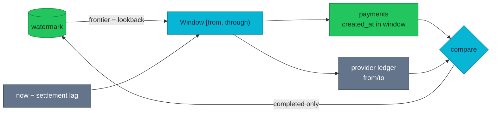

# ADR-035: Bound a Reconciliation Pass to a Time Window

> **Decision summary:** We will bound each reconciliation pass to a half-open
> window on charge creation time, asked of **both** sides, and advance a
> high-watermark only when a pass completes. We accept a lookback that re-reads
> recent ground and a settlement lag that delays detection in exchange for a pass
> whose cost stops growing with the platform's history.

| Attribute | Value |
|-----------|-------|
| **Status** | Accepted |
| **Decision date** | 2026-08-04 |
| **Owners** | `duynhne` |
| **Deciders** | `duynhne` |
| **Scope** | payment-service reconciliation pass boundaries and the provider ledger query |
| **Affected components** | payment-service (reconciler + internal API), mockpay, homelab alerts |
| **Related RFC** | [RFC-0021](../../rfc/RFC-0021/) (Phase 6) |
| **Related research** | [research.md](../../rfc/RFC-0021/research.md) |
| **Supersedes** | — |
| **Superseded by** | — |
| **Implementation tracking** | payment-service #52 (migration 000012), homelab #646 |
| **Adoption** | Complete |

## Context

Reconciliation v1 ([ADR-011](../ADR-011-detect-only-reconciliation/)) compared
**every** payment holding a provider reference against the provider's **entire**
ledger, holding both sides in memory for the duration of a pass. The repository's
own comment recorded this as a known limit: the set grows monotonically for the
life of the service, so the cost of checking today's payments grows with every
payment ever made.

Two further gaps came from the same unbounded shape. Nothing recorded how far
reconciliation had got, so a pass had no cheaper starting point than the
beginning; and nothing distinguished a reconciler that had **stopped** from one
that kept finding nothing — the discrepancy counter reads zero in both cases,
which the alert catalog recorded as an open gap.

Phase 6 also made an unbounded pass actively misleading: with `processing` rows in
the table, a pass that compared everything re-reported the same parked payments
on every run.

## Scope

### In scope

- The bounds of an automatic pass and where they come from.
- How the two sides of the comparison agree on those bounds.
- When the frontier moves, and in which direction.
- The manual backfill entry point.
- The signals that say whether reconciliation is running and keeping up.

### Out of scope

- What a discrepancy means and which class is healable — ADR-011, [ADR-012](../ADR-012-reconciliation-auto-heal/).
- Who is allowed to run a pass at all — [ADR-036](../ADR-036-single-writer-lease/).
- Refund-amount reconciliation and report currency, which remain v1 limits.

## Decision drivers

| Priority | Driver | Why it matters |
|---------:|--------|----------------|
| 1 | A discrepancy must be a fact about money | A bound applied to one side only manufactures discrepancies out of the question's shape |
| 2 | Bounded cost per pass | A detector that gets slower forever eventually stops being run |
| 3 | Never skip ground unchecked | Money missed by a pass that thought it had covered a window is money nobody looks for again |
| 4 | Detectable stoppage | A silent detector is indistinguishable from a healthy one |

## Decision

We will bound each pass to a half-open window `[from, through)` on the time a
charge was created, and **ask both sides for the same window** — the internal
query and the provider ledger. `GET /transactions` gained `from`/`to` filters and
every transaction now carries `created_at` for this purpose.

The automatic window runs from the last completed pass's frontier, less a
**lookback**, up to a **settlement lag** short of now. The frontier lives in a
single-row `reconciliation_watermark` table and advances **only when a pass
completes**, and **only forwards**.

An explicit window is available for a backfill through a separate entry point, so
a window can never be reached by accident.

### Decision rules

| Rule | Required behavior |
|------|-------------------|
| **Ownership** | The reconciler owns the window; no caller computes bounds for it |
| **Symmetry** | Both sides of a comparison are asked for the SAME bounds, always |
| **Half-open** | `[from, through)` — consecutive windows share a boundary and must not both claim the charge on it |
| **Frontier advance** | Only on a completed pass; only forwards (`GREATEST`) |
| **Failure behavior** | A failed pass leaves the frontier, so the next pass re-covers the same ground |
| **Single row** | The watermark's primary key is a boolean CHECKed true, so a second row is impossible rather than merely unexpected |
| **Input validation** | A malformed bound is refused, never dropped — a dropped bound silently widens the pass to everything |
| **Parked rows** | Payments in `processing` are excluded: their disagreement is a question the attempt log owns, not drift |

### Decision view

## Alternatives considered

| Option | Benefits | Costs / risks | Result |
|--------|----------|---------------|--------|
| **A — Window on creation time + completion-gated watermark, both sides bounded** | Bounded cost; no ground skipped; a stopped reconciler is visible through frontier age | Needs provider-side time filtering; two tuned constants; a lookback that re-reads | Selected |
| **B — Window the internal side only** | No provider change required | Compares a narrow internal set against the provider's whole history, so every older charge reads as `missing_internal`. A report of invented discrepancies is worse than a slow one | Rejected |
| **C — Keyset pagination by payment id, no time window** | Bounded per page, no clock reasoning at all | Provider ledgers are not ordered by our ids, so the two sides cannot be aligned; and id order does not express "recent", which is where drift matters | Rejected |
| **D — Rolling recent window plus a periodic full sweep** | Cheap common case, guaranteed eventual full coverage | The full sweep keeps the unbounded cost, just less often — the problem deferred rather than solved, and the sweep is the pass most likely to be quietly disabled | Rejected |

### Why the selected option won

A is the only option where a discrepancy remains a statement about money. Driver
1 rules out B outright, and C cannot satisfy it at all because the two sides have
no shared ordering other than time. A also turns driver 4 into a free
consequence: a frontier that stops moving is directly observable, so "is it
running?" becomes a gauge rather than an inference.

### Why the closest alternative lost

D is the closest, and it fails on driver 2 in a specific way: it keeps an
unbounded pass in the design and makes it rare. Rare expensive jobs are the ones
that get disabled during an incident and never re-enabled, so the guarantee it
buys is the guarantee most likely to be missing when it matters.

## Consequences

### Positive consequences

- A pass costs what the window holds, not what the platform's history holds.
- A reconciler that has stopped is visible through
  `payment_reconciliation_watermark_age_seconds`, which grows without bound —
  closing the gap the alert catalog recorded.
- Run outcome, duration, and heal failures are now series rather than log lines,
  so a heal that never works is no longer invisible.
- A backfill over a specific stretch of history is a supported operation.

### Negative consequences and accepted trade-offs

- **Two tuned constants** (1h lookback, 5m settlement lag). Both are honest
  guesses at this scale and would need revisiting under real provider latency.
- **Detection is delayed by the settlement lag.** Accepted: without it a payment
  created seconds ago is reported missing at the provider, and a report that cries
  wolf is a report nobody reads.
- **A discrepancy older than the lookback is never re-judged by the sweep.** It
  was recorded once and it is the alert's job from then on, not the frontier's.
- **The frontier is a new thing that can be wrong.** A watermark advanced past
  ground nobody compared would hide money permanently — hence completion-gating,
  monotonic advance, and the structural single-row constraint, each with its own
  test.
- **Backfill and the automatic window share one frontier.** A backfill over recent
  ground moves it; monotonic advance keeps an older backfill from dragging it back.

### Neutral consequences

- mockpay grew query parameters and a per-charge timestamp, as a real provider has.
- Integration tests must ask for a window that covers rows they just created,
  which is the settlement lag being honest rather than a test inconvenience.

## Implementation obligations

| Obligation | Owner | Tracking | Completion signal |
|------------|-------|----------|-------------------|
| Provider ledger time filtering + `created_at` | payment-service | #52 | `GET /transactions?from=&to=` bounds the answer; malformed bounds 400 |
| Windowed internal query + watermark | payment-service | #52 (migration 000012) | Frontier advances only on completion, only forwards |
| Backfill entry point | payment-service | #52 | Explicit window reaches `RunWindow`; absent window takes the automatic path |
| Run / staleness / heal-failure metrics | payment-service | #52 | Four series exported |
| Alerts consuming them | homelab | follow-up | Staleness alert live |

## Validation and compliance

| Requirement | Verification |
|-------------|--------------|
| Symmetry | Unit test asserts the ledger and the internal query received identical bounds |
| Completion gating | A failed pass leaves the frontier untouched (unit) |
| Monotonic advance | An older backfill does not pull the frontier back (unit + real Postgres) |
| Single row | Inserting a second watermark row is refused by the CHECK (real Postgres) |
| Windowed selection | A payment is included by a window covering it and excluded by one that closed before it existed (real Postgres) |
| Input refusal | Malformed and inverted bounds return 400 at the API and at mockpay, and no pass runs |
| Migration safety | 000012 up → down → re-up against the full chain from an empty database |

## Revisit triggers

Re-open this decision when one or more of the following become true:

- Provider latency makes a 5-minute settlement lag either wasteful or insufficient.
- Discrepancies routinely resolve themselves later than the 1-hour lookback,
  which would mean the lookback is doing no work.
- The provider offers a change-feed or cursor, which would replace time
  windowing with something exact.
- Reconciliation needs to run in parallel shards, which would make one frontier
  the wrong shape.

## References

- [RFC-0021](../../rfc/RFC-0021/) — platform overhaul umbrella (Phase 6)
- [Payment contract](../../../api/payments.md)
- [ADR-011](../ADR-011-detect-only-reconciliation/) — what a pass compares and reports
- [ADR-012](../ADR-012-reconciliation-auto-heal/) — the one healable class, whose failures are now a series
- [ADR-034](../ADR-034-provider-outcome-ambiguity/) — why parked payments are excluded from the report
- [ADR-036](../ADR-036-single-writer-lease/) — who may run a pass
- Runbook: [PaymentReconciliationDiscrepancy](../../../observability/runbooks/microservices/PaymentReconciliationDiscrepancy.md)

## History

| Date | Status / adoption | Change |
|------|-------------------|--------|
| 2026-08-04 | Accepted / Complete | Shipped in payment-service #52 with migration 000012 |

---
_Last updated: 2026-08-04_
