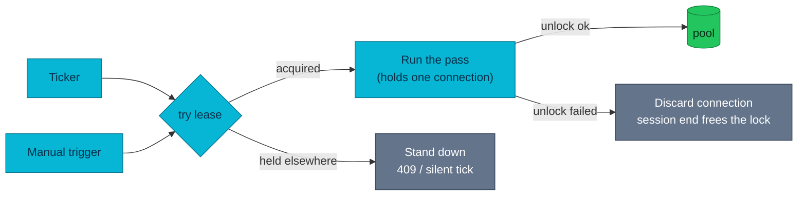

# ADR-036: Guard Single-Writer Background Roles with a Database Lease

> **Decision summary:** We will guard background roles that must have exactly one
> runner with a session-level Postgres advisory lock, taken non-blockingly before
> any work begins. We accept that a lease holds one pooled connection for its
> whole life in exchange for a guard that spans processes and needs no expiry to
> tune.

| Attribute | Value |
|-----------|-------|
| **Status** | Accepted |
| **Decision date** | 2026-08-04 |
| **Owners** | `duynhne` |
| **Deciders** | `duynhne` |
| **Scope** | payment-service background roles that must be single-writer; the reconciliation pass is the first |
| **Affected components** | payment-service (reconciler, internal API, background jobs) |
| **Related RFC** | [RFC-0021](../../rfc/RFC-0021/) (Phase 6) |
| **Related research** | [research.md](../../rfc/RFC-0021/research.md) |
| **Supersedes** | — |
| **Superseded by** | — |
| **Implementation tracking** | payment-service #53 |
| **Adoption** | Complete |

## Context

The only guard on a reconciliation pass was a boolean field on the HTTP handler.
It single-flighted concurrent POSTs *within one process* and did nothing else: the
five-minute ticker did not consult it, and a second replica would have its own
copy. Two replicas, or a manual trigger racing the ticker, would each read it as
"I am alone".

Two concurrent passes are not merely wasteful. They both page the provider
ledger, both write discrepancy rows for the same charges, and — once auto-heal is
enabled ([ADR-012](../ADR-012-reconciliation-auto-heal/)) — both try to converge
them. The report double-counts and the heal path races itself.

This is a general shape rather than one job's problem: the outbox relay documents
a single-writer assumption of its own, and the doubt sweep introduced in
[ADR-034](../ADR-034-provider-outcome-ambiguity/) has the same property.

## Scope

### In scope

- The mechanism that makes a background role single-writer across processes.
- What a runner does when it cannot get the lease.
- Where the lease is taken relative to any state the role writes.
- Ownership of the key space.

### Out of scope

- Making payment-service horizontally scalable. Migration 000007
  (`idempotency_keys.payment_id` → `subject_id`) is not rolling-safe, so
  `replicaCount` stays 1 regardless of this decision.
- Leader election for the service as a whole; this is per-role, not per-process.
- Retrofitting the outbox relay and the doubt sweep, which keep their current
  guards until they need this one.

## Decision drivers

| Priority | Driver | Why it matters |
|---------:|--------|----------------|
| 1 | Correctness across processes | A guard that only holds inside one process is not a guard |
| 2 | No stale guard after a crash | A role that stalls until an expiry elapses is a role that stalls during exactly the incident that killed it |
| 3 | No queueing | A guard that makes callers wait converts one slow pass into a backlog of passes |
| 4 | Operational simplicity | One fewer tunable is one fewer thing set wrong |

## Decision

We will guard such roles with a **session-level Postgres advisory lock**, taken
with the **non-blocking** `pg_try_advisory_lock` before any work begins. A runner
that cannot take the lease **stands down** — reported as `ErrLeaseHeld`, which is a
normal outcome rather than a failure: HTTP answers 409 and the ticker logs nothing.

Each mechanism choice was verified against the PostgreSQL documentation rather
than recalled:

- **advisory lock, not a lease table with an expiry** — the server frees session
  locks *"at the end of the session, even if the client disconnects
  ungracefully"*, so a crashed process releases immediately and there is no TTL to
  tune. A TTL is the knob that is either too short (two writers overlap) or too
  long (the role stalls after every crash).
- **session level, not transaction level** — a pass makes provider HTTP calls, so
  a transaction-scoped lock would hold a transaction open for its whole duration.
  An idle-in-transaction connection blocks vacuum and pins the oldest xmin, which
  is worse than the problem being solved.
- **non-blocking** — waiting would queue every ticker firing behind one slow pass.

### Decision rules

| Rule | Required behavior |
|------|-------------------|
| **Ownership** | The lease key space is declared in one place; a role does not invent its own number |
| **Write path** | The lease is taken BEFORE any state the role writes, including its own run record |
| **Read path** | `ErrLeaseHeld` is a normal outcome; callers stand down and do not retry into it |
| **Connection binding** | A session lock belongs to the session that took it, so the lease holds that pooled connection until release |
| **Failure behavior** | If the unlock fails, the connection is DISCARDED rather than returned to the pool |
| **Idempotence** | A second release is refused before the connection is touched |
| **Boundary** | The lease is a per-role guard, not service-wide leader election, and it does not license extra replicas |

### Decision view

## Alternatives considered

| Option | Benefits | Costs / risks | Result |
|--------|----------|---------------|--------|
| **A — Session-level advisory lock, non-blocking** | Crash-safe with no TTL; no extra table; exclusion enforced by the server | Holds one pooled connection per lease; the session/connection binding is subtle and easy to get wrong | Selected |
| **B — Lease table with an expiry and heartbeat renewal** | No held connection; visible in SQL; portable beyond Postgres | A TTL to tune, a renewal loop to get right, and a stale lease after every crash until it expires — the failure mode that matters most is the one it handles worst | Rejected |
| **C — Transaction-level advisory lock** | Auto-released, no unlock to pair, no leak possible | The pass calls the provider over HTTP, so the transaction stays open for its duration: idle-in-transaction blocks vacuum and pins the oldest xmin | Rejected |
| **D — Kubernetes Lease / leader election** | Standard, visible to operators, not tied to the database | Another dependency and another failure domain for a guard whose only consumer already requires the database; would not stop a manual trigger racing the elected leader in-process | Rejected |

### Why the selected option won

A satisfies drivers 1–3 without introducing anything to tune. Driver 2 is
decisive: an advisory lock's release is a property of the session ending, which
means the mechanism that frees the lease is the same event that killed the holder.
Nothing has to notice, and nothing has to wait.

### Why the closest alternative lost

B is the conventional choice and is genuinely more inspectable — a row an operator
can read. It lost on driver 2. Its behaviour after a crash is precisely the
behaviour we care about, and there it is at its weakest: the role is blocked until
a timer nobody can shorten expires, during the incident that caused the crash.
Choosing it would mean adding a knob whose only correct value depends on how long
the next outage lasts.

## Consequences

### Positive consequences

- One guard with one meaning at every entry point; the handler reports the answer
  instead of deciding it.
- A crashed holder frees the lease immediately, with nothing to configure.
- Standing down is cheap and silent, so the ticker does not manufacture errors
  when the guard does its job.
- The lease is taken before the run record exists, so standing down leaves no
  trace in the table an operator reads when money is missing.

### Negative consequences and accepted trade-offs

- **One pooled connection is held for the whole pass.** With a 25-connection pool
  that is comfortable, but it is a real resource and it makes releasing on every
  path mandatory rather than tidy.
- **The session/connection binding is subtle.** Handing the connection back early
  would leave the lock owned by a connection nobody controls, and an unlock issued
  on a different pooled connection quietly does nothing. This is documented at the
  code, because it is invisible at the call site.
- **A failed unlock costs a connection.** Returning it would be worse: advisory
  locks are reference counted *per session*, so a recycled connection still
  holding the lock would let a later pass on that same connection acquire the
  "held" lease — two writers, each certain it was alone.
- **Not a scaling licence.** `replicaCount` stays 1 for an unrelated reason, and
  the code says so where the lease is wired so the next reader does not conflate
  them.

### Neutral consequences

- The handler lost its `atomic.Bool`, which was a strictly weaker guard.
- Two other roles (outbox relay, doubt sweep) now have an obvious mechanism to
  adopt when they need it.

## Implementation obligations

| Obligation | Owner | Tracking | Completion signal |
|------------|-------|----------|-------------------|
| Lease vocabulary in the domain, mechanism in the repository | payment-service | #53 | Key space declared once; logic layer depends on the port, not the adapter |
| Every pass takes the lease before writing anything | payment-service | #53 | Standing down creates no run row |
| Discard a connection whose unlock failed | payment-service | #53 | The lease is obtainable again afterwards |
| Handler answers 409 from the lease, not from local state | payment-service | #53 | `atomic.Bool` removed |

## Validation and compliance

| Requirement | Verification |
|-------------|--------------|
| Cross-process exclusion | Real Postgres: a held lease refuses a second holder immediately and frees on release |
| Key isolation | Different keys do not exclude each other |
| No queueing | The refusal is immediate, asserted by the non-blocking call returning `ErrLeaseHeld` |
| Crash safety | A failed unlock discards the connection and the lease is obtainable again — the session end frees it |
| Pairing | A second release is reported, not ignored; a double connection release would otherwise panic |
| No leak | Pool statistics return to their prior value after release |
| Stand-down semantics | Unit: no run row, no source touched; a real failure is not reported as `ErrLeaseHeld` |

## Revisit triggers

Re-open this decision when one or more of the following become true:

- payment-service moves behind a transaction-pooling proxy that does not preserve
  sessions, which would break session-scoped locks entirely.
- A single-writer role appears whose work is long enough that holding a connection
  for its duration is no longer acceptable.
- Roles need to be leased across services rather than within one database.
- Migration 000007 becomes rolling-safe and multiple replicas become the goal,
  at which point the number of leased roles — and their interaction — needs review.

## References

- [RFC-0021](../../rfc/RFC-0021/) — platform overhaul umbrella (Phase 6)
- [Payment contract](../../../api/payments.md)
- [ADR-011](../ADR-011-detect-only-reconciliation/) · [ADR-012](../ADR-012-reconciliation-auto-heal/) — the role this guards, and why two runners is a correctness problem
- [ADR-035](../ADR-035-windowed-reconciliation/) — the pass boundaries the lease protects
- PostgreSQL documentation: *Explicit Locking → Advisory Locks*, *System Administration Functions → Advisory Lock Functions*

## History

| Date | Status / adoption | Change |
|------|-------------------|--------|
| 2026-08-04 | Accepted / Complete | Shipped in payment-service #53 |

---
_Last updated: 2026-08-04_
