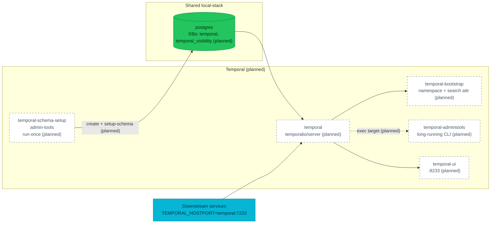

# ADR-039: Run Temporal on Postgres in local-stack for versioning parity

> **Decision summary:** We will replace the single `temporalio/temporal`
> dev-server container in `local-stack/compose.yaml` with the official
> five-container topology from `temporalio/samples-server` — Postgres schema
> setup, `temporalio/server`, namespace bootstrap, a long-running
> `temporalio/admin-tools` CLI target, and the Temporal UI — reusing the
> existing `postgres` service for persistence. We accept roughly 500 MiB of
> extra RAM and a longer first-boot in exchange for **state that survives a
> restart**: workflow history, timers, and Worker Deployment Versioning state
> all persist, so a drain rehearsal can span a server bounce and the storage
> engine matches the cluster's. Versioning APIs themselves already worked on the
> dev-server — see Context — so parity here is about durability and storage,
> not capability.

| Attribute | Value |
|-----------|-------|
| **Status** | Proposed |
| **Decision date** | — |
| **Owners** | `duynhne` |
| **Deciders** | `duynhne` |
| **Scope** | Temporal topology in `local-stack/` — how the dev compose stack runs the workflow engine. Cluster delivery is unaffected. |
| **Affected components** | `local-stack/compose.yaml`, `local-stack/postgres/init.sql`, new `local-stack/temporal/` directory (dynamic config), `local-stack/README.md`, `local-stack/docs/e2e-audit.md`, `docs/api/temporal.md`, `docs/api/microservices.md` |
| **Related RFC** | [RFC-0021](../../rfc/RFC-0021/) |
| **Related research** | — |
| **Related ADR** | [ADR-030](../ADR-030-temporal-workflow-versioning/) (Worker Versioning + official chart on the cluster), [ADR-001](../ADR-001-adopt-temporal-for-order-fulfillment/) (Temporal adoption, background) |
| **Supersedes** | — |
| **Superseded by** | — |
| **Implementation tracking** | homelab#746 — implements the topology, gates it with audit rows A14/A15, and corrects the docs |
| **Adoption** | Not started |

## Context

`local-stack/compose.yaml:83-93` runs Temporal as a single `temporalio/temporal:1.7.2`
container in dev-server mode (`server start-dev --namespace mop`) with in-memory
persistence. The container auto-registers the `mop` namespace on every start;
there is no separate schema step, no `admin-tools` container, no search
attribute registration, and every workflow disappears when the container
restarts.

The cluster tells a different story. ADR-030 accepted Worker Deployment
Versioning and re-platformed the cluster onto the official
`temporalio/helm-charts` release. `kubernetes/infra/controllers/temporal/helmrelease.yaml`
enables `admintools.enabled: true` (long-running `temporal-admintools`
Deployment) and pairs it with a suspended
`worker-set-current-version` CronJob that instantiates a
`temporalio/admin-tools:1.31.2` Job on activation. Every Worker Versioning
operation — `temporal worker deployment describe|list|set-current-version`,
the drain-gate `temporal workflow count` query, the `--unversioned` rollback —
runs through `kubectl exec deploy/temporal-admintools`. RFC-0021's
`cutover-rollback.md:88-132` catalogues three traps that only surface on this
topology: a `~80s` timing gap between worker Ready and worker registration, a
silent `:` vs `.` format mismatch on the `TemporalWorkerDeploymentVersion`
search attribute, and the meaningless `DrainageStatus: unspecified` state on
fresh builds. ADR-030's Consequences flagged search-attribute registration as
migration work that must happen through chart values or an admin-tools job —
which measurement has since narrowed: the two *versioning* attributes are
built-in system attributes and need no registration anywhere. Only genuinely
custom attributes would.

The gap is **durability and storage parity**, not API capability. That
distinction was measured on 2026-08-11, and it corrects two claims earlier
drafts of this ADR made:

| Claim | Verdict | Measurement |
|-------|---------|-------------|
| Dev-server persistence is in-memory, so no versioned state survives the restarts a cutover rehearsal requires | **Holds** | `docker compose restart temporal` took the namespace from **9 live executions to 0** |
| `mop` is registered by a server flag, not an operator command, so admin-tools CLI muscle memory is only exercised on Kind | **Holds** | `start-dev --namespace mop` re-registers it on every boot |
| `TemporalWorkerDeploymentVersion` is never registered, so the trap that matters most cannot fire locally | **Refuted** | It is a **built-in system** search attribute, read back as `"order-fulfillment:v1"` — no registration step exists or is needed |
| Worker Versioning APIs are gated behind dynamic-config flags dev-server does not surface | **Refuted** | With **zero** dynamic config, `worker deployment list`, `set-current-version`, `Pinned` behaviour, side-by-side builds and `DrainageStatus: draining` all worked |

So the versioning **API** surface was always reachable locally — the blocker was
only that no worker set `TEMPORAL_WORKER_DEPLOYMENT_NAME` / `_BUILD_ID`. What
genuinely cannot be rehearsed on the dev-server is anything that must **span a
restart**: a drain that outlives a server bounce, a timer that survives one, or
any `TemporalPersistenceErrorRateHigh` path. Two further divergences are
numbers, not behaviours: `numHistoryShards` is 1 locally against **512** in the
cluster, and namespace retention is the dev-server default rather than **168h**.

That restart-spanning class is the honest reason to move, and it is the one this
ADR is now argued on.

## Scope

### In scope

- The Temporal topology in `local-stack/compose.yaml`: which containers run,
  which images, which order.
- Persistence for local Temporal: reusing the existing `postgres` service and
  adding `temporal` and `temporal_visibility` databases via
  `local-stack/postgres/init.sql`.
- Bootstrap ownership: which container creates the `mop` namespace, and with
  which retention.
- A dynamic-config file, required only because the server will not start without
  one; explicitly not a place to enable versioning.
- The long-running `temporal-admintools` container as the CLI entry point,
  mirroring the cluster's `kubectl exec deploy/temporal-admintools` workflow.

### Out of scope

- Cluster delivery. `kubernetes/infra/controllers/temporal/helmrelease.yaml` is
  unchanged; ADR-030 keeps ownership of that path.
- Workflow history archival. Cluster and local both run with retention-only
  today; adopting archival is a separate ADR when a driver appears.
- Automating the `--build-id` sync for the `worker-set-current-version`
  CronJob. That remains an ADR-030 follow-up.
- Local TLS/mTLS, OIDC on the Web UI, multi-cluster replication.
- Any change to downstream services' `TEMPORAL_HOSTPORT` contract; they keep
  pointing at `temporal:7233`.

## Decision drivers

| Priority | Driver | Why it matters |
|---------:|--------|----------------|
| 1 | Restart-spanning rehearsal | The only way to exercise a drain, a timer, or a persistence-failure path across a server bounce. Versioning APIs work without this change; surviving a restart does not |
| 2 | Storage-engine parity | Postgres via the `postgres12` plugin, with the same `temporal` / `temporal_visibility` split and the same server version as the chart, so local persistence behaviour is the cluster's |
| 3 | Fidelity to the official pattern | `temporalio/samples-server/compose/docker-compose-postgres.yml` is the canonical Postgres compose recipe; `temporalio/auto-setup` is deprecated and stops at 1.29.7, so `server` + `admin-tools` is the only supported shape at 1.31.2 |
| 4 | Reversibility | The change is confined to `local-stack/`; a bad decision can be reverted in one PR without touching the cluster or services |
| 5 | Dev-loop cost | Extra containers, RAM, and first-boot time have to stay small enough that day-to-day iteration is not painful. Measured: cold start 26–38s |

## Decision

We will run Temporal in `local-stack/` as a **five-container topology on shared
Postgres**, replacing the current single dev-server container.

The topology is:

| Container | Image | Lifecycle | Role |
|-----------|-------|-----------|------|
| `temporal-schema` | `temporalio/admin-tools:1.31.2` | run-once, `service_completed_successfully` | Applies the schema to `temporal` and `temporal_visibility` (`setup-schema -v 0.0` + `update-schema`); the databases themselves come from `init.sql` |
| `temporal` | `temporalio/server:1.31.2` | long-running, healthcheck `nc -z localhost 7233` | Frontend / history / matching / worker roles bundled |
| `temporal-bootstrap` | `temporalio/admin-tools:1.31.2` | run-once, `service_completed_successfully` | Registers the `mop` namespace with `168h` retention |
| `temporal-admintools` | `temporalio/admin-tools:1.31.2` | long-running (`sleep infinity`) | Persistent CLI target — mirrors `kubectl exec deploy/temporal-admintools`, and **required**, because `temporalio/server` ships no client binary |
| `temporal-ui` | `temporalio/ui:2.53.1` | long-running | Web UI on :8233 |

Persistence reuses the existing `postgres` service; `local-stack/postgres/init.sql`
adds `CREATE DATABASE temporal;` and `CREATE DATABASE temporal_visibility;`
alongside the current per-service databases. Creating them there rather than with
`temporal-sql-tool create` mirrors the cluster, where CNPG `postInitSQL` owns
creation and Temporal runs with `createDatabase: false`.

`local-stack/temporal/dynamicconfig/development-sql.yaml` is mounted into the
server container **because the server refuses to start when
`DYNAMIC_CONFIG_FILE_PATH` does not resolve and the image ships no such file** —
not to enable versioning. Those APIs are on by default in 1.31, and the cluster
runs with no dynamic config at all, so this file stays as close to empty as
possible; every key in it is local-only behaviour the cluster does not have.

Configuration is by environment variable: templating lives **inside** the
`temporal-server` binary (`config_template_embedded.yaml`, visible in the startup
log), so `DB`, `POSTGRES_SEEDS`, `DBNAME`, `VISIBILITY_DBNAME` and
`NUM_HISTORY_SHARDS` are all still honoured. `BIND_ON_IP=0.0.0.0` is set so the
healthcheck can probe localhost; the entrypoint then derives
`TEMPORAL_BROADCAST_ADDRESS` itself.

Two values are pinned explicitly because leaving them implicit is how they go
wrong: **`numHistoryShards: 4`** and namespace retention **`168h`**. The shard
count is a deliberate divergence from the cluster's 512 — it partitions
throughput, not behaviour, and nothing local load-tests — and it is **immutable
after the databases are first initialised**. Retention matches the cluster.

All image tags track the cluster: `server` and `admin-tools` at the chart's
appVersion `1.31.2`, per
`kubernetes/infra/controllers/temporal/worker-set-current-version-cronjob.yaml`.
Note that **Renovate does not watch `local-stack/**`** (`.renovaterc.json5`
restricts every manager to `kubernetes/`), so the drift rule below has no
automation behind it and is enforced by review only.

Downstream services keep `TEMPORAL_HOSTPORT: temporal:7233`. The Web UI stays
on `:8233`. The `mop` namespace name does not change.

### Decision rules

| Rule | Required behavior |
|------|-------------------|
| **Persistence** | Local Temporal runs on the shared `postgres` container. Dev-server (`start-dev`, in-memory) must not be reintroduced in `local-stack/`. |
| **Namespace** | `mop` is created by the bootstrap container, not by a server flag. Ad-hoc `docker compose exec` is not the source of truth. No search-attribute registration step exists: the versioning attributes are built-in system attributes. |
| **CLI entry point** | Temporal CLI operations from developer or runbook flows use `docker compose exec temporal-admintools temporal ...`. This mirrors the cluster's `kubectl exec deploy/temporal-admintools ...` muscle memory, and there is no alternative — the server image has no client binary. |
| **Health probing** | The server healthcheck stays namespace-independent. A `--namespace mop` probe deadlocks: `mop` is created by `temporal-bootstrap`, which waits on this very healthcheck. |
| **Shard count** | `numHistoryShards` is fixed at 4 and documented as a divergence from the cluster's 512. It cannot be changed after the databases are initialised, so changing it means recreating them. |
| **Image pins** | The `admin-tools` image tag in `local-stack/` matches the cluster pin used by `worker-set-current-version-cronjob.yaml`. Version drift here is a bug. |
| **Downstream contract** | `TEMPORAL_HOSTPORT` for every consumer stays `temporal:7233`. Any transport change is a separate ADR. |
| **Failure behavior** | Compose start blocks Temporal-dependent services until `temporal-bootstrap` completes successfully; the existing `depends_on: temporal: service_healthy` blocks are updated accordingly. |

### Decision view

## Alternatives considered

| Option | Benefits | Costs / risks | Result |
|--------|----------|---------------|--------|
| **A — `temporalio/server` + Postgres + admin-tools** (this ADR) | Reproduces the cluster's operational shape and storage engine; state survives a restart; follows the upstream canonical compose recipe | Adds four containers, ~500 MiB RAM, extra first-boot time for schema setup | Selected |
| **B — Keep dev-server; rehearse versioning on Kind only** | Zero cost, no change | Nothing survives a restart, so a drain or timer spanning one stays untestable; `numHistoryShards` stuck at 1 and retention at the dev default | Rejected |
| **E — Keep dev-server, persist SQLite to a volume** (`--db-filename`) | Two lines and one container; restart survival works — verified | Storage engine is SQLite, not the cluster's Postgres, so no persistence behaviour transfers; `start-dev` offers no shard-count or retention control; keeps a dev-only server binary on the critical path | Rejected |
| **C — Fork `tsurdilo/my-temporal-dockercompose`** | End-to-end recipe including archival and a custom server | Unofficial pins, drifts from upstream, custom Go server adds a build path we do not need for this decision | Rejected |
| **D — Amend ADR-030 in place** | Single record touching cluster and local | Violates "one decision per ADR"; ADR-030 is already `Accepted` and scoped to the cluster; local-stack topology is an independent lever | Rejected |

### Why the selected option won

Option A is the only choice that satisfies drivers 1 and 2 together — state that
survives a restart **on the cluster's storage engine** — and it does so with the
smallest surface that allows it: everything is confined to `local-stack/`,
persistence reuses an existing container, and the four new containers are exactly
the shape the official `samples-server` recipe uses. Because the implementation
is one PR against a directory that already ships non-production tooling, driver 4
(reversibility) is trivially satisfied.

### Why the closest alternative lost

Option **E** is the closest alternative, and it is closer than the status quo:
measured on 2026-08-11, `start-dev --db-filename` on a named volume does deliver
restart survival for one flag and one volume. It loses on what the surviving
state is *stored in*. Every persistence property worth rehearsing — connection
handling, schema migration, the `TemporalPersistenceErrorRateHigh` path, the
behaviour of the pooled Postgres the cluster actually runs — is a property of the
engine, and SQLite shares none of it. `start-dev` also exposes no
`numHistoryShards` or retention control, so two of the divergences this ADR is
meant to close would stay open. Paying four containers to test the real engine is
the better trade.

Option B, the status quo, loses on the same axis and more sharply: nothing
survives a restart at all. Note that B's original rejection reasoning was wrong —
it claimed the RFC-0021 versioning traps could not fire locally, and they can (see
Context). B is rejected for durability, not for capability.

## Consequences

### Positive consequences

- A drain, a timer, or a persistence-failure path can now be rehearsed **across
  a server restart** — verified: the current version, a `draining` predecessor,
  and a pinned in-flight execution all survived `docker compose restart temporal`.
- Local persistence is the cluster's engine and schema, so migration and
  connection behaviour transfer instead of being SQLite-specific.
- `docker compose exec temporal-admintools temporal ...` becomes the local
  analogue of `kubectl exec deploy/temporal-admintools temporal ...`, so the
  runbook language is the same in both environments.
- Namespace retention is the cluster's `168h`, not a dev default.
- Gameday rehearsals gain a lightweight local option.

### Negative consequences and accepted trade-offs

- Compose gains four containers, roughly 500 MiB of extra RAM, and a longer
  first-boot while the schema setup runs.
- Three new image pins (`temporalio/server`, `temporalio/ui`,
  `temporalio/admin-tools`) that must be kept aligned with the cluster — and
  **Renovate does not watch `local-stack/**`**, so nothing automates it.
- `local-stack/postgres/init.sql` grows two more `CREATE DATABASE` statements.
  Existing developers need one `docker compose down` so the entrypoint re-runs
  it; without that, `temporal-schema` fails on missing databases.
- Every `docker compose exec -T temporal temporal ...` in the runbook and in
  developer muscle memory breaks: `temporalio/server` ships only the server
  binary and busybox. The commands move to `temporal-admintools`.
- The server refuses to start unless `DYNAMIC_CONFIG_FILE_PATH` resolves, so
  `local-stack/` now carries a config file that exists only to satisfy a path.
- `numHistoryShards` is 4 against the cluster's 512 and is immutable once the
  databases exist: changing it later means recreating them.

### Neutral consequences

- Downstream services see no contract change; `TEMPORAL_HOSTPORT` stays
  `temporal:7233` and the Web UI stays on `:8233`.
- Cluster delivery is untouched; ADR-030 remains authoritative there.
- Archival remains out of scope in both environments.
- `docker compose down` still wipes Temporal, because the `postgres` service
  holds no data volume. Durability is exercised with `restart`, and the audit's
  A14 row says so explicitly.
- Versioning still covers only `order-worker`. `checkout-service` builds its
  worker with `temporalx.NewWorker(tc, taskQueue)` and no options, so
  `AbandonedCheckoutWorkflow` is unversioned in **both** environments. That is a
  code gap in the service repo, which no topology here can close.

## Implementation obligations

The ADR PR is docs-only. Implementation lands in a follow-up PR against
`local-stack/` and updates the surrounding docs. On implementation:

1. Update `local-stack/compose.yaml` to the five-container topology; remove
   `temporalio/temporal:1.7.2` and its `start-dev` command.
2. Add `temporal` and `temporal_visibility` databases to
   `local-stack/postgres/init.sql`.
3. Add `local-stack/temporal/dynamicconfig/development-sql.yaml` and mount it
   into the `temporal` container. It exists to satisfy
   `DYNAMIC_CONFIG_FILE_PATH`, which the server requires and the image does not
   provide; keep it near-empty rather than enabling versioning flags, which are
   already on by default and absent from the cluster's own configuration.
4. Put the schema and namespace commands inline in `compose.yaml`. No scripts
   directory: two `temporal-sql-tool` invocations per database and one
   describe-or-create for `mop` do not need files of their own, and the
   surrounding stack keeps its configuration in `compose.yaml`,
   `postgres/init.sql`, and `gateway/kong.yml`.
5. Update `depends_on` for every service that requires Temporal to gate on
   `temporal-bootstrap: service_completed_successfully`.
6. Update `local-stack/README.md`, `docs/api/temporal.md`, and
   `docs/api/microservices.md` (whose local-deployment row still called Temporal
   an in-memory dev server) to describe the new topology.
7. Move every `docker compose exec -T temporal temporal ...` call in
   `local-stack/docs/e2e-audit.md` to `temporal-admintools`, and add the rows
   that gate the new behaviour: **A14** (execution count and history survive
   `restart temporal`) and **A15** (the conditional versioning drain drill).
   Without A14 the property this ADR exists to provide has nothing watching it.
8. Flip **Adoption** to `Complete` in this ADR when the implementation PR
   merges.
