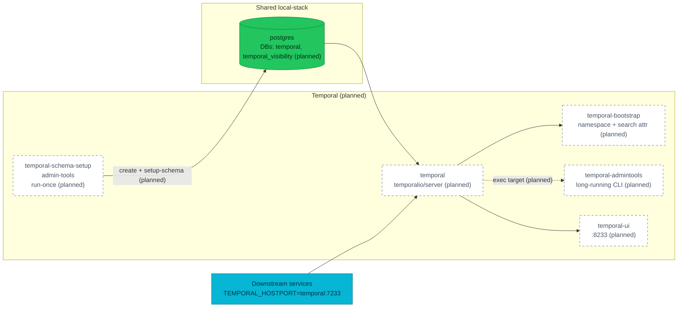

# ADR-039: Run Temporal on Postgres in local-stack for versioning parity

> **Decision summary:** We will replace the single `temporalio/temporal`
> dev-server container in `local-stack/compose.yaml` with the official
> five-container topology from `temporalio/samples-server` — Postgres schema
> setup, `temporalio/server`, namespace/search-attribute bootstrap, a
> long-running `temporalio/admin-tools` CLI target, and the Temporal UI —
> reusing the existing `postgres` service for persistence. We accept roughly
> 500 MiB of extra RAM and a longer first-boot on the compose stack in exchange
> for reproducing Worker Deployment Versioning (ADR-030 / RFC-0021) and the
> admin-tools operational workflow locally instead of only on Kind.

| Attribute | Value |
|-----------|-------|
| **Status** | Proposed |
| **Decision date** | — |
| **Owners** | `duynhne` |
| **Deciders** | `duynhne` |
| **Scope** | Temporal topology in `local-stack/` — how the dev compose stack runs the workflow engine. Cluster delivery is unaffected. |
| **Affected components** | `local-stack/compose.yaml`, `local-stack/postgres/init.sql`, new `local-stack/temporal/` directory (dynamic config + bootstrap scripts), `local-stack/README.md`, `docs/api/temporal.md`, `docs/proposals/rfc/RFC-0021/gameday.md` |
| **Related RFC** | [RFC-0021](../../rfc/RFC-0021/) |
| **Related research** | — |
| **Related ADR** | [ADR-030](../ADR-030-temporal-workflow-versioning/) (Worker Versioning + official chart on the cluster), [ADR-001](../ADR-001-adopt-temporal-for-order-fulfillment/) (Temporal adoption, background) |
| **Supersedes** | — |
| **Superseded by** | — |
| **Implementation tracking** | Follow-up implementation PR against `local-stack/`; ADR PR is docs-only |
| **Adoption** | Not started |

## Context

`local-stack/compose.yaml:83-93` runs Temporal as a single `temporalio/temporal:1.7.2`
container in dev-server mode (`server start-dev --namespace mop`) with in-memory
persistence. The container auto-registers the `mop` namespace on every start;
there is no separate schema step, no `admin-tools` container, no search
attribute registration, and every workflow disappears when the container
restarts.

The cluster tells a different story. ADR-030 accepted Worker Deployment
Versioning and re-platformed the cluster onto the official
`temporalio/helm-charts` release. `kubernetes/infra/controllers/temporal/helmrelease.yaml`
enables `admintools.enabled: true` (long-running `temporal-admintools`
Deployment) and pairs it with a suspended
`worker-set-current-version` CronJob that instantiates a
`temporalio/admin-tools:1.31.2` Job on activation. Every Worker Versioning
operation — `temporal worker deployment describe|list|set-current-version`,
the drain-gate `temporal workflow count` query, the `--unversioned` rollback —
runs through `kubectl exec deploy/temporal-admintools`. RFC-0021's
`cutover-rollback.md:88-132` catalogues three traps that only surface on this
topology: a `~80s` timing gap between worker Ready and worker registration, a
silent `:` vs `.` format mismatch on the `TemporalWorkerDeploymentVersion`
search attribute, and the meaningless `DrainageStatus: unspecified` state on
fresh builds. ADR-030's Consequences flagged search-attribute registration as
migration work that must now happen through chart values or an admin-tools job.

The gap is that none of this is reproducible on the dev loop:

- Dev-server persistence is in-memory, so no versioned worker state survives
  the restarts a cutover rehearsal requires.
- `mop` is registered by a server flag, not by an operator command, so the
  admin-tools CLI muscle memory is only exercised on Kind.
- `TemporalWorkerDeploymentVersion` is never registered, so the trap that
  matters most for versioning cannot fire locally.
- Worker Versioning APIs are gated behind dynamic-config flags that dev-server
  does not surface.

Gameday and per-PR rehearsals for versioning therefore have to happen on the
Kind cluster or in production-adjacent environments — a friction that is
avoidable and that lets the RFC-0021 traps escape earlier review stages.

## Scope

### In scope

- The Temporal topology in `local-stack/compose.yaml`: which containers run,
  which images, which order.
- Persistence for local Temporal: reusing the existing `postgres` service and
  adding `temporal` and `temporal_visibility` databases via
  `local-stack/postgres/init.sql`.
- Bootstrap ownership: which container creates the `mop` namespace and
  registers the `TemporalWorkerDeploymentVersion` search attribute.
- Dynamic-config file that enables Worker Deployment Versioning APIs locally.
- The long-running `temporal-admintools` container as the CLI entry point,
  mirroring the cluster's `kubectl exec deploy/temporal-admintools` workflow.

### Out of scope

- Cluster delivery. `kubernetes/infra/controllers/temporal/helmrelease.yaml` is
  unchanged; ADR-030 keeps ownership of that path.
- Workflow history archival. Cluster and local both run with retention-only
  today; adopting archival is a separate ADR when a driver appears.
- Automating the `--build-id` sync for the `worker-set-current-version`
  CronJob. That remains an ADR-030 follow-up.
- Local TLS/mTLS, OIDC on the Web UI, multi-cluster replication.
- Any change to downstream services' `TEMPORAL_HOSTPORT` contract; they keep
  pointing at `temporal:7233`.

## Decision drivers

| Priority | Driver | Why it matters |
|---------:|--------|----------------|
| 1 | Versioning parity with the cluster | Only path to reproduce the three RFC-0021 traps on the dev loop and rehearse gameday locally |
| 2 | Fidelity to the official pattern | `temporalio/samples-server/compose/docker-compose-postgres.yml` is the canonical Postgres compose recipe; using it lets us track upstream fixes for free |
| 3 | Reversibility | The change is confined to `local-stack/`; a bad decision can be reverted in one PR without touching the cluster or services |
| 4 | Dev-loop cost | Extra containers, RAM, and first-boot time have to stay small enough that day-to-day iteration is not painful |

## Decision

We will run Temporal in `local-stack/` as a **five-container topology on shared
Postgres**, replacing the current single dev-server container.

The topology is:

| Container | Image | Lifecycle | Role |
|-----------|-------|-----------|------|
| `temporal-schema-setup` | `temporalio/admin-tools:1.31.2` | run-once, `service_completed_successfully` | Creates DBs `temporal` and `temporal_visibility` (via `temporal-sql-tool create` + `setup-schema` + `update-schema`) |
| `temporal` | `temporalio/server:<pin>` | long-running, healthcheck on gRPC :7233 | Frontend / history / matching / worker roles bundled |
| `temporal-bootstrap` | `temporalio/admin-tools:1.31.2` | run-once, `service_completed_successfully` | Creates the `mop` namespace, registers the `TemporalWorkerDeploymentVersion` (Keyword) search attribute |
| `temporal-admintools` | `temporalio/admin-tools:1.31.2` | long-running (`sleep infinity`) | Persistent CLI target — mirrors `kubectl exec deploy/temporal-admintools` |
| `temporal-ui` | `temporalio/ui:<pin>` | long-running | Web UI on :8233 |

Persistence reuses the existing `postgres` service; `local-stack/postgres/init.sql`
adds `CREATE DATABASE temporal;` and `CREATE DATABASE temporal_visibility;`
alongside the current per-service databases. A new
`local-stack/temporal/dynamicconfig/development.yaml` file enables the Worker
Deployment Versioning APIs (`system.enableWorkerVersioningDataAPIs`,
`system.enableWorkerVersioningWorkflowAPIs`,
`frontend.workerVersioningRuleAPIs`) and is mounted into the server container.
The `admin-tools` version tracks the cluster pin (`1.31.2`, per
`kubernetes/infra/controllers/temporal/worker-set-current-version-cronjob.yaml`);
the `server` and `ui` image pins are chosen alongside the implementation PR.

Downstream services keep `TEMPORAL_HOSTPORT: temporal:7233`. The Web UI stays
on `:8233`. The `mop` namespace name and its retention semantics do not
change.

### Decision rules

| Rule | Required behavior |
|------|-------------------|
| **Persistence** | Local Temporal runs on the shared `postgres` container. Dev-server (`start-dev`, in-memory) must not be reintroduced in `local-stack/`. |
| **Namespace and search attributes** | `mop` and `TemporalWorkerDeploymentVersion` are created by the bootstrap container, not by server flags. Ad-hoc `docker compose exec` for these is not the source of truth. |
| **CLI entry point** | Temporal CLI operations from developer or runbook flows use `docker compose exec temporal-admintools temporal ...`. This mirrors the cluster's `kubectl exec deploy/temporal-admintools ...` muscle memory. |
| **Image pins** | The `admin-tools` image tag in `local-stack/` matches the cluster pin used by `worker-set-current-version-cronjob.yaml`. Version drift here is a bug. |
| **Downstream contract** | `TEMPORAL_HOSTPORT` for every consumer stays `temporal:7233`. Any transport change is a separate ADR. |
| **Failure behavior** | Compose start blocks Temporal-dependent services until `temporal-bootstrap` completes successfully; the existing `depends_on: temporal: service_healthy` blocks are updated accordingly. |

### Decision view

## Alternatives considered

| Option | Benefits | Costs / risks | Result |
|--------|----------|---------------|--------|
| **A — `temporalio/server` + Postgres + admin-tools** (this ADR) | Reproduces the cluster's operational shape; unlocks the three RFC-0021 traps; follows the upstream canonical compose recipe | Adds four containers, ~500 MiB RAM, extra first-boot time for schema setup | Selected |
| **B — Keep dev-server; rehearse versioning on Kind only** | Zero cost, no change | RFC-0021 traps keep escaping the dev loop; gameday friction persists | Rejected |
| **C — Fork `tsurdilo/my-temporal-dockercompose`** | End-to-end recipe including archival and a custom server | Unofficial pins, drifts from upstream, custom Go server adds a build path we do not need for this decision | Rejected |
| **D — Amend ADR-030 in place** | Single record touching cluster and local | Violates "one decision per ADR"; ADR-030 is already `Accepted` and scoped to the cluster; local-stack topology is an independent lever | Rejected |

### Why the selected option won

Option A is the only choice that satisfies driver 1 (versioning parity) at all,
and it does so with the smallest possible surface: everything is confined to
`local-stack/`, the persistence reuses an existing container, and the four new
containers are exactly the shape the official `samples-server` recipe uses.
Because the implementation is one PR against a directory that already ships
non-production tooling, driver 3 (reversibility) is trivially satisfied.

### Why the closest alternative lost

Option B — the status quo — is the honest alternative. It costs nothing and
keeps the compose stack simple. It loses because "run Worker Versioning traps
on Kind only" has now been the answer for one full RFC (RFC-0021 shipped
2026-08-06), and gameday evidence in `cutover-rollback.md` shows the traps are
subtle enough that catching them earlier is worth ~500 MiB of local RAM.

## Consequences

### Positive consequences

- The three RFC-0021 traps become reproducible on the dev loop, closing the
  parity gap ADR-030 flagged.
- `docker compose exec temporal-admintools temporal ...` becomes the local
  analogue of `kubectl exec deploy/temporal-admintools temporal ...`, so the
  runbook language is the same in both environments.
- The `TemporalWorkerDeploymentVersion` search attribute has an owner
  (bootstrap container), not an ad-hoc human step.
- Gameday rehearsals gain a lightweight local option.

### Negative consequences and accepted trade-offs

- Compose gains four containers, roughly 500 MiB of extra RAM, and a longer
  first-boot while the schema setup runs.
- Four new image pins (`temporalio/server`, `temporalio/ui`,
  `temporalio/admin-tools`, and Postgres visibility schema version) that must
  be kept aligned with the cluster.
- `local-stack/postgres/init.sql` grows two more `CREATE DATABASE` statements
  and must be re-run on a clean volume for existing developers.

### Neutral consequences

- Downstream services see no contract change; `TEMPORAL_HOSTPORT` stays
  `temporal:7233` and the Web UI stays on `:8233`.
- Cluster delivery is untouched; ADR-030 remains authoritative there.
- Archival remains out of scope in both environments.

## Implementation obligations

The ADR PR is docs-only. Implementation lands in a follow-up PR against
`local-stack/` and updates the surrounding docs. On implementation:

1. Update `local-stack/compose.yaml` to the five-container topology; remove
   `temporalio/temporal:1.7.2` and its `start-dev` command.
2. Add `temporal` and `temporal_visibility` databases to
   `local-stack/postgres/init.sql`.
3. Add `local-stack/temporal/dynamicconfig/development.yaml` (Worker
   Deployment Versioning APIs enabled) and mount it into the `temporal`
   container.
4. Add bootstrap scripts under `local-stack/temporal/scripts/` for the
   schema-setup and namespace/search-attribute steps, adapted from
   `temporalio/samples-server`.
5. Update `depends_on` for every service that requires Temporal to gate on
   `temporal-bootstrap: service_completed_successfully`.
6. Update `local-stack/README.md` and `docs/api/temporal.md` to describe the
   new topology.
7. Add a "local rehearsal" section to `docs/proposals/rfc/RFC-0021/gameday.md`
   documenting the compose commands and the three traps that are now
   reproducible.
8. Flip **Adoption** to `Complete` in this ADR when the implementation PR
   merges.
