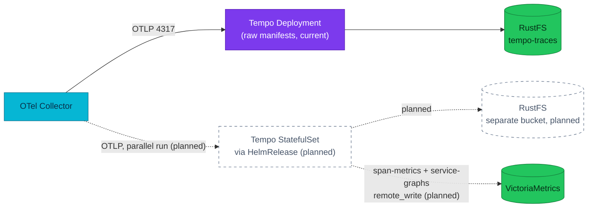

# ADR-040: Deliver Tempo through the `grafana-community/tempo` Helm chart

> **Decision summary:** We will replace the hand-written Tempo Deployment,
> ConfigMap, and Service with the `grafana-community/tempo` Helm chart
> (single-binary mode) delivered as a Flux `HelmRelease`, and enable the
> metrics-generator through the chart's `tempo.metricsGenerator` values. We
> accept a community-maintained chart (Apache-2.0, third-party maintainers)
> in exchange for a delivery pattern already used by every other operator or
> stateful component in this repository (cnpg, kyverno, cert-manager,
> jaegertracing, sloth, openbao, altinity clickhouse-operator, temporal,
> grafana, pgdog).

| Attribute | Value |
|-----------|-------|
| **Status** | Proposed |
| **Decision date** | — |
| **Owners** | `duynhne` |
| **Deciders** | `duynhne` |
| **Scope** | Delivery mechanism of the primary trace backend (Tempo) in the cluster |
| **Affected components** | Tempo, OTel Collector, Grafana datasource, Kong ingress, ESO secret, RustFS bucket, Flux `tracing-local` wave, ServiceMonitor + PrometheusRule for Tempo |
| **Related RFC** | — |
| **Related research** | — |
| **Related ADR** | [ADR-032](../ADR-032-tempo-operator-monolithic/) (superseded — same problem, operator-based delivery), [ADR-023](../ADR-023-clickhouse-observability-olap/) |
| **Supersedes** | [ADR-032](../ADR-032-tempo-operator-monolithic/) (withdrawn before adoption) |
| **Superseded by** | — |
| **Implementation tracking** | Follow-up controllers PR (`HelmRelease`) and configs PR (consumer cutover); this PR is docs-only |
| **Adoption** | Not started |

## Context

Tempo is the platform's durable, primary trace backend. It runs today as raw
manifests in `kubernetes/infra/controllers/tracing/tempo/`: a single-replica
monolithic Deployment of `grafana/tempo:2.10.5` with a hand-written
`tempo.yaml` ConfigMap, an `emptyDir` WAL, and S3 storage on in-cluster RustFS
(bucket `tempo-traces`, 7-day retention). Credentials arrive via a
ClusterExternalSecret (`ACCESS_KEY_ID`/`ACCESS_SECRET_KEY`) and are spliced
into the config with the `-config.expand-env=true` flag. The Flux wave
`tracing-local` delivers it and health-checks `Deployment/tempo`.

Two pressures make the delivery mechanism worth changing now:

- **Hand-maintained operational surface.** The Tempo config, Service,
  ServiceMonitor, and alert rules are separate hand-written files that must
  be kept consistent with each other and with upstream Tempo defaults on
  every version bump.
- **The metrics-generator is inert.** The config carries a full
  `metrics_generator` block but `storage.remote_write` is empty and no
  override enables the processors, so no span metrics or service graphs are
  produced. The Grafana Tempo datasource is wired for `serviceMap` and
  `tracesToMetrics` against VictoriaMetrics — both dead ends today.

ADR-032 addressed the same problem by adopting the `grafana/tempo-operator`
with a `TempoMonolithic` CR. Follow-up research invalidated its delivery
plan: **upstream tempo-operator ships no Helm chart** (only a raw
`tempo-operator.yaml` bundle) and `grafana/helm-charts` does not carry a
`tempo-operator` chart. Every other operator and stateful component in this
repository is delivered through `HelmRelease` + `HelmRepository`. Adopting
the operator therefore requires either a vendored raw bundle or a remote
kustomize URL — both off-pattern for this repo, both introduced solely to
ship one controller. ADR-032 is withdrawn on that basis and this ADR
supersedes it with a chart-based delivery that fits the existing pattern.

Tempo 3.0's rearchitecture (ingester and compactor modules removed,
Project Rhythm becomes the default write path) does not change the shape of
this decision — the same chart family covers both eras (`tempo` for the
single-binary and `tempo-distributed` for microservices), so the upgrade
path is a values change, not a delivery-mechanism change.

## Scope

### In scope

- How Tempo is delivered to the cluster: raw manifests vs a Helm chart.
- Which chart shape to adopt: `grafana-community/tempo` (single-binary,
  appVersion 2.10.x) vs `grafana-community/tempo-distributed`
  (microservices, appVersion 3.0.x).
- Enabling the metrics-generator (span-metrics + service-graphs remote-written
  to VictoriaMetrics) as part of the migration.
- The rollout shape: a parallel run next to the existing Deployment before
  any cutover.

### Out of scope

- **Trace backend consolidation** (Tempo vs VictoriaTraces vs ClickHouse).
  `backends-comparison.md` reserves that for a future ADR gated on
  VictoriaTraces reaching ~1.0/GA; this ADR keeps Tempo as the durable
  primary.
- Retiring the standalone in-memory Jaeger. The chart can expose Jaeger's
  gRPC/thrift receivers, but consolidating them with the collector fan-out
  is a follow-up decision.
- The head-sampling policy and the collector fan-out topology (RFC-0014 /
  ADR-023 territory).
- local-stack — it does not run Tempo (the `spanmetrics` connector stands in
  for the metrics-generator there).
- Tempo 3.x upgrade. The chart family supports it, but the upgrade itself is
  a follow-up PR once we have parallel-run evidence on 2.x.

## Decision drivers

| Priority | Driver | Why it matters |
|---------:|--------|----------------|
| 1 | Operability | Config, ServiceMonitor, upgrades should come from one declarative source instead of four hand-kept files |
| 2 | Fit with existing delivery patterns | Every other operator/stateful component in this repo ships through `HelmRelease`; introducing a second pattern for one component is a maintenance tax |
| 3 | Blast radius / footprint | The Kind homelab budgets ~256Mi for Tempo; the replacement must stay a single pod |
| 4 | Correctness of existing wiring | Grafana serviceMap/tracesToMetrics are configured but have no data source behind them; the migration should close that gap |

## Decision

We will deliver Tempo through the `grafana-community/tempo` Helm chart as a
Flux `HelmRelease`, replacing the hand-written Deployment, ConfigMap, and
Service. The `HelmRepository` `grafana-community` (URL
`https://grafana-community.github.io/helm-charts`) is registered under
`kubernetes/clusters/local/sources/helm/` alongside the existing chart
sources.

The release keeps the current shape — one pod, S3 backend on RustFS, 7-day
retention, OTLP gRPC/HTTP ingestion — and adds what the chart makes cheap:
`serviceMonitor.enabled: true`, an active metrics-generator remote-writing
span-metrics and service-graphs to VictoriaMetrics, and native envFrom
handling of the RustFS Secret. Retention, metrics-generator processors, and
overrides go through first-class values fields; the chart's own StatefulSet
template renders the pod.

Illustrative values (final numbers land with implementation):

```yaml
tempo:
  resources:
    requests: { cpu: 100m, memory: 128Mi }
    limits:   { memory: 256Mi }
  retention: 168h
  storage:
    trace:
      backend: s3
      s3:
        bucket: tempo-traces
        endpoint: rustfs-svc.rustfs.svc.cluster.local:9000
        insecure: true
        forcepathstyle: true
        region: us-east-1
        # access_key / secret_key expanded from env (extraEnv from tempo-rustfs-credentials)
  metricsGenerator:
    enabled: true
    storage:
      remote_write:
        - url: http://vmagent.monitoring.svc:8429/api/v1/write
  overrides:
    defaults:
      metrics_generator:
        processors: [service-graphs, span-metrics]
serviceMonitor:
  enabled: true
  additionalLabels:
    release: monitoring
```

### Decision rules

| Rule | Required behavior |
|------|-------------------|
| **Ownership** | The `HelmRelease` values object is the single source of Tempo config; no hand-written Tempo ConfigMap/Deployment may coexist after cutover |
| **Write path** | Tempo config changes are edits to values in git, reconciled by Flux; never `kubectl edit` on the rendered StatefulSet |
| **Read path** | Producers and consumers use the chart-generated Service (`tempo.monitoring.svc`); the DNS name is preserved so no consumer cutover is required |
| **Boundary** | The chart is used in single-binary mode only. Adopting microservices mode (`tempo-distributed`) is a separate ADR |
| **Failure behavior** | Parallel-run instances must use separate RustFS buckets; two Tempo instances must never share one bucket |
| **Chart provenance** | The chart repo is `grafana-community/helm-charts` (Apache-2.0, community-maintained). If Grafana Labs upstream ships a first-party chart, migrating to it is a values-only change and does not require a new ADR |

### Decision view



## Alternatives considered

| Option | Benefits | Costs / risks | Result |
|--------|----------|---------------|--------|
| **A — `grafana-community/tempo` chart (single-binary)** | `HelmRelease` pattern already used by every other chart-delivered component in this repo; metrics-generator and ServiceMonitor are first-class values fields; no new controller to run; no `v1alpha1` CRD lifecycle | Community-maintained (not Grafana Labs upstream); still hand-writes values for four hand-kept files worth of config, just consolidated in one HelmRelease | **Selected** |
| **B — tempo-operator + `TempoMonolithic` (ADR-032)** | CR-driven config + operator-generated ServiceMonitor/PrometheusRules; embedded Jaeger UI; native S3 secret handling; genuine operator adoption exercise | Upstream ships no Helm chart, so delivery would be a vendored raw YAML bundle or a remote kustomize URL — both off-pattern for this repo, both introduced for one controller; operator still pins Tempo 2.10.5 with no announced 3.x ETA | Rejected — see [ADR-032](../ADR-032-tempo-operator-monolithic/) (withdrawn) |
| **C — Keep the raw Deployment** | Zero new moving parts; Renovate keeps bumping the image directly | Hand-maintained config/monitoring surface persists; metrics-generator still needs manual wiring; ignores the operability driver that motivated this ADR | Rejected |
| **D — `grafana-community/tempo-distributed` chart (microservices)** | Distributed Tempo 3.x is available today (chart appVersion 3.0.2); first-class fields for retention/limits/metrics-generator; ready for Rhythm | ~5–7 component pods just like TempoStack; Tempo 3.x microservices pulls in Kafka; buys features single-tenant Kind does not use | Rejected on footprint grounds |
| **E — `grafana/tempo-operator` bundle without a chart** | CR-driven config + operator learning; matches ADR-032 exactly | Vendored raw YAML bundle or remote kustomize URL is the only way to deliver it; introduces an off-pattern in this repo for a single controller | Rejected — this is the delivery half of Option B and inherits its costs |

### Why the selected option won

Option A is the only choice that satisfies all four drivers together: it
consolidates config/monitoring/upgrades into a single reconciled
`HelmRelease` (driver 1), reuses the pattern every other Helm-delivered
component here already uses (driver 2), keeps the 1-pod footprint (driver
3), and enables the metrics-generator through first-class values fields
(driver 4). It does not create a new delivery pattern in the repo for one
component, and its Tempo 3.x upgrade path is a values change, not a
mechanism change.

### Why the closest alternative lost

Option B (tempo-operator via a vendored bundle) is the closest alternative
because the operator is the "real" reconciler experience and its CR is the
cleanest ownership boundary. It lost on delivery pattern, not features:
shipping a raw YAML bundle in a repository whose every other operator uses
`HelmRelease` creates one bespoke maintenance path — Renovate custom
manager, header comments explaining the exception, PR reviewers learning a
new shape — solely because upstream chose not to publish a chart. Waiting
for upstream to ship one would leave the operability gap open indefinitely.

## Consequences

### Positive consequences

- One `HelmRelease` values object replaces four hand-kept files.
- The delivery pattern matches every other Helm-delivered component in this
  repo; no new maintenance path is introduced.
- Tempo upgrades become chart version bumps that arrive pre-tested by the
  chart maintainers and Renovate.
- The metrics-generator finally produces `traces_spanmetrics_*` and
  `traces_service_graph_*` series, giving the already-configured Grafana
  serviceMap and tracesToMetrics links real data.
- The `-config.expand-env=true` splice is replaced by chart-native env
  handling.
- Tempo 3.x is a values change (chart appVersion), not a mechanism change.

### Negative consequences and accepted trade-offs

- The chart is community-maintained (`grafana-community/helm-charts`,
  Apache-2.0, third-party maintainers). This is the same trust surface used
  for `altinity/clickhouse-operator` today; not Grafana Labs upstream but
  active and permissively licensed.
- No CRD semantics for Tempo. Values are the interface, not a typed
  spec — validation happens at chart render, not at admission.
- PrometheusRules are not rendered by the `tempo` chart today; the
  existing hand-written `tempo-alerts.yaml` stays or is trimmed as part of
  the cutover.

### Neutral consequences

- Kyverno posture is unchanged: no policy currently matches the `monitoring`
  namespace, so no PolicyException is needed.
- The 4-way collector fan-out (Tempo, Jaeger, VictoriaTraces, ClickHouse)
  is untouched by this decision; the parallel run temporarily makes it
  5-way.
- Observability docs describing the raw-manifest topology must be updated at
  adoption time, not before.

## Implementation obligations

All rows are **planned** — nothing below has started; the decision is
recorded ahead of implementation.

| Obligation | Owner | Tracking | Completion signal |
|------------|-------|----------|-------------------|
| Register `grafana-community` HelmRepository under `kubernetes/clusters/local/sources/helm/` | `duynhne` | — | `flux get sources helm grafana-community -n flux-system` Ready |
| Deliver Tempo via `HelmRelease` under `kubernetes/infra/controllers/tracing/tempo-chart/` (chart-based path lives alongside the raw one during the parallel run) | `duynhne` | — | `make validate` passes; `HelmRelease` Ready; StatefulSet healthy |
| Configure S3 storage to consume `tempo-rustfs-credentials` through `tempo.extraEnv` / `extraEnvFrom` rather than the `-config.expand-env` splice | `duynhne` | — | No `-config.expand-env=true` in the rendered args; no plaintext credentials in values |
| RustFS: add a separate parallel-run bucket to `job-setup-buckets.yaml` | `duynhne` | — | Bucket exists; chart instance writes blocks to it |
| Parallel run: chart-delivered instance next to raw Deployment; fifth collector exporter | `duynhne` | — | Same traces queryable from both backends in Grafana |
| Enable metrics-generator (`tempo.metricsGenerator`) remote-writing to VictoriaMetrics | `duynhne` | — | `traces_spanmetrics_*` / `traces_service_graph_*` series present; Grafana serviceMap renders |
| Cutover: repoint collector exporter and remove the raw manifests + hand-written ServiceMonitor; keep or trim `tempo-alerts.yaml` | `duynhne` | — | Legacy `Deployment/tempo` gone; consumers on the chart-generated Service |
| Update observability docs (`docs/observability/tracing/*`, `stack-review.md`, `backends-comparison.md`, `opentelemetry/README.md`, `grafana/README.md`, alert catalog, `AGENTS.md` stack line, `clusters/local/README.md`) | `duynhne` | — | No doc describes raw-manifest delivery as current |

## Validation and compliance

| Requirement | Verification |
|-------------|--------------|
| Single config source after cutover | Repo grep: no `tempo-config` ConfigMap, no `Deployment/tempo` manifest remains |
| GitOps delivery | `make validate` on every step; Flux healthCheck in `clusters/local/tracing.yaml` tracks the chart-delivered workload |
| Bucket isolation during parallel run | The two instances reference different bucket names in their storage config |
| Metrics-generator active | VictoriaMetrics query returns `traces_service_graph_request_total > 0` |
| Trace path intact | E2E: a demo login/checkout trace is findable via the Grafana Tempo datasource against the chart-backed instance |
| Documentation | Tracing docs and the alert catalog reference this ADR once adoption completes |

## Revisit triggers

Re-open this decision when one or more of the following become true:

- `grafana-community/helm-charts` stops releasing the `tempo` chart, or the
  chart abandons the single-binary mode.
- Grafana Labs upstream ships a first-party `tempo` chart under
  `grafana/helm-charts`; migrating to it is a values-only change but the
  provenance change is worth an ADR footnote.
- Grafana Labs upstream ships a Helm chart for `tempo-operator`; at that
  point ADR-032's proposal (operator + `TempoMonolithic`) becomes deliverable
  through the same `HelmRelease` pattern used everywhere else, and this
  decision should be reconsidered.
- The platform gains a real multitenancy, in-cluster auth, or scale
  requirement that the single-binary chart cannot meet, and
  `tempo-distributed` becomes the right shape.
- VictoriaTraces reaches ~1.0/GA and the pre-announced consolidation ADR
  selects a different primary backend, making Tempo delivery moot.

A review does not automatically reverse the decision. A changed decision
requires a new ADR that supersedes this one.

## References

- [`grafana-community/helm-charts` — `tempo` chart](https://github.com/grafana-community/helm-charts/tree/main/charts/tempo) — single-binary Helm chart, appVersion 2.10.x
- [`grafana-community/helm-charts` — `tempo-distributed` chart](https://github.com/grafana-community/helm-charts/tree/main/charts/tempo-distributed) — microservices Helm chart, appVersion 3.0.x
- [Tempo 3.0 release notes](https://grafana.com/docs/tempo/latest/release-notes/v3-0/) — ingester/compactor removal, Rhythm architecture, config migration
- [Migrate from Tempo 2.x to 3.0](https://grafana.com/docs/tempo/latest/set-up-for-tracing/setup-tempo/migrate-to-3/)
- [Tempo architecture](https://grafana.com/docs/tempo/latest/introduction/architecture/) — monolithic vs microservices, Kafka boundary in Rhythm write path
- [Tracing hub](../../../observability/tracing/README.md)
- [Trace backends comparison](../../../observability/tracing/backends-comparison.md) — reserves backend consolidation for a future ADR
- [ADR-023](../ADR-023-clickhouse-observability-olap/) — ClickHouse as supplementary OLAP; Tempo remains day-to-day primary
- [ADR-032](../ADR-032-tempo-operator-monolithic/) — withdrawn; same problem, operator-based delivery rejected on delivery-pattern grounds

## History

| Date | Status / adoption | Change |
|------|-------------------|--------|
| 2026-08-10 | Proposed / Not started | Initial draft; supersedes ADR-032 |

---
_Last updated: 2026-08-10_
