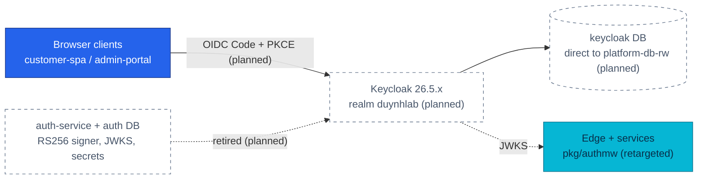

# ADR-041: Adopt Keycloak as the platform identity provider and retire auth-service

> **Decision summary:** We will make Keycloak the platform's only token issuer —
> realm `duynhlab`, two public PKCE clients, two realm roles, deterministic realm
> import — and retire the custom `auth-service` completely, including its `auth`
> database, RS256 signer, refresh-token-family logic, JWKS endpoint, and secret
> fan-out. We accept a stateful JVM identity server with its own database, tuning
> surface, and CVE stream in exchange for no longer operating a hand-written
> identity provider: credentials, sessions, tokens, roles, login UI, and realm
> keys become configuration on a mature OIDC server instead of security-critical
> custom Go code.

| Attribute | Value |
|-----------|-------|
| **Status** | Accepted |
| **Decision date** | 2026-08-11 |
| **Owners** | `duynhne` |
| **Deciders** | `duynhne` |
| **Scope** | Which component issues human access tokens for the platform, and what happens to the custom issuer it replaces |
| **Affected components** | New `identity` namespace (Keycloak + realm import), `keycloak` database on CNPG `platform-db`, `auth-service` (retired), `auth` database + `bootstrap.initdb` handover, frontend token layer, `pkg/authmw` consumers, local-stack |
| **Related RFC** | [RFC-0022](../../rfc/RFC-0022/) — identity design record, **executed by [RFC-0024](../../rfc/RFC-0024/)** |
| **Related research** | [RFC-0022 research.md](../../rfc/RFC-0022/research.md) |
| **Related ADR** | [ADR-042](../ADR-042-oidc-sub-as-user-id/) (`sub` as `user_id`), [ADR-043](../ADR-043-oidc-browser-workload-trust/) (browser OIDC / workload trust), [ADR-006](../ADR-006-rs256-jwt-kong-edge-auth/) + [RFC-0009](../../rfc/RFC-0009/) (the custom-issuer design this decision retires; its edge-coarse/service-authoritative verification split survives), [ADR-044](../ADR-044-envoy-gateway-platform-edge/) (the RFC-0024 edge that verifies this realm) |
| **Supersedes** | — |
| **Superseded by** | — |
| **Implementation tracking** | RFC-0024 program — phases P1/P3/P5 (PR trains) |
| **Adoption** | **Complete** — the realm is the only issuer in both environments and the Kind gate passed 2026-08-25: both realms answer as themselves (K4.4), a customer token mints through the realm with no password grant (K4.5), and Keycloak emits its own signals (K5.9, 7/7). `auth-service`'s cluster surface was deleted 2026-08-13 and the required ops docs exist |

## Context

RFC-0009 gave the platform signed RS256 JWTs, cached-JWKS verification in every
service via `pkg/authmw`, and coarse edge filtering — and made this project the
operator of its own identity provider. `auth-service` owns credential storage
and bcrypt hashing, login/register/refresh/logout endpoints under
`/auth/v1/public/...`, refresh-token families with reuse-triggers-revocation,
an RS256 signer whose private key lives in OpenBAO and fans out through the
`auth-jwt-signing` / `auth-issuer-jwt` ExternalSecrets, and a custom JWKS
endpoint. The frontend carries a matching custom token layer (`localStorage`,
silent 401 refresh, cross-tab locks) built specifically around that family
semantics. Every future identity feature — roles, MFA, account recovery,
session administration — would be more custom security-critical Go code.

The retirement is not free of coupling: the `auth` role and its secret double
as the CNPG `bootstrap.initdb` credentials for the whole `platform-db` cluster,
so dropping the database requires an explicit bootstrap handover first. The
full as-built inventory is audited in
[RFC-0022 research](../../rfc/RFC-0022/research.md#problem-statement).

The timing is deliberately opportunistic: no stable customer frontend contract
must be preserved, the Backoffice portal (RFC-0023) is not built yet, no
production identities need migration, and local-stack rebuilds the complete
environment from zero. RFC-0024 then absorbed the implementation — the new
Envoy Gateway edge is born trusting the Keycloak realm, so no
auth-service-to-new-edge wiring is ever built.

## Scope

### In scope

- Which component issues platform access tokens: Keycloak, and only Keycloak.
- The realm shape: realm name, clients, roles, audience, token/session TTLs,
  refresh semantics, deterministic import.
- Keycloak's deployment boundary: namespace, image pinning, database placement
  and connection path.
- The complete retirement of `auth-service` and everything that exists only to
  serve it, per the removal list in
  [RFC-0022 § Components removed](../../rfc/RFC-0022/README.md#components-removed).
- How user profiles are provisioned after registration moves to Keycloak (JIT).

### Out of scope

- The application `user_id` representation — [ADR-042](../ADR-042-oidc-sub-as-user-id/).
- Browser flow mechanics and east-west trust — [ADR-043](../ADR-043-oidc-browser-workload-trust/).
- The edge that verifies realm tokens (Envoy Gateway, `remoteJWKS`) — [ADR-044](../ADR-044-envoy-gateway-platform-edge/) /
  RFC-0024.
- Backoffice pages and `protected` business APIs (RFC-0023).
- Self-registration, forgot-password, email verification — deferred until an
  email stack exists (RFC-0022 open questions #11/#12).
- Multiple realms/issuers, social login, LDAP, tenancy, account linking, HA
  Keycloak topology.

## Decision drivers

| Priority | Driver | Why it matters |
|---------:|--------|----------------|
| 1 | Stop operating a custom IdP | Credential handling, refresh families, key custody, and every future identity feature are security-critical code the platform maintains alone today |
| 2 | Standard OIDC surface | Roles, hosted login, realm keys/JWKS, admin console, and browser flows arrive as configuration; the RBAC road (RFC-0023) unblocks without custom design |
| 3 | Keep RFC-0009's verification shape | Local offline verification, cached JWKS, edge-coarse/service-authoritative split, no IdP call on the hot path — proven and preserved |
| 4 | Greenfield window | No production identities, no stable frontend contract, rebuild-from-zero local stacks — the one moment this swap costs the least |
| 5 | Deterministic rebuild | Realm import must reproduce clients, roles, and demo users (fixed UUIDs) on every clean bring-up, like every other seeded fixture |

## Decision

We will deploy **Keycloak** (`quay.io/keycloak/keycloak` 26.5.x, pinned by
digest) in an `identity` namespace as the platform's only issuer of human
access tokens, and retire `auth-service` completely.

The realm is `duynhlab`, imported deterministically from
`duynhlab-realm.json`: demo users `alice`…`eve` carry **fixed declared UUIDs**
(the import preserves an explicit `id`), so domain seeds reference stable
subjects. Its database is `keycloak` on the CNPG `platform-db` cluster,
connected **direct to `platform-db-rw`** — Keycloak's Agroal pool relies on
long-lived connections and server-side prepared statements, which the
transaction-mode PgDog pooler breaks.

Two public OIDC clients exist: `customer-spa` and `admin-portal`, both
Authorization Code + PKCE S256, both with Direct Access Grants disabled. Two
realm roles start the model: `customer` and `backoffice_admin`. The platform
audience `duynhlab-platform` is added by an `oidc-audience-mapper` on a shared
`platform-api` client scope assigned to both clients. Token and session
lifetimes are configured deliberately, not inherited from defaults: access
tokens **15 min** for both clients; `customer-spa` SSO idle **14 d** / max
**30 d** with Remember Me; `admin-portal` client-session idle **30 min** / max
**10 h**. Refresh tokens rotate with reuse revocation: `Revoke Refresh Token`
enabled and `refreshTokenMaxReuse: 0`, preserving today's
reuse-revokes-the-family guarantee.

`auth-service` retires per RFC-0022's removal list: the runtime (deployment,
compose service, routes, seeds, NetworkPolicy), the `auth` database and role
(safe to drop — as-built, `platform-db`'s `bootstrap.initdb` already rests on
`user`/`platform-db-user-secret`, not on `auth`; RFC-0022's `platform_owner`
handover step is moot, per its 2026-08-11 history note), the custom RS256
signer and
refresh-family logic, the custom JWKS endpoint, `JWT_PRIVATE_KEY_PEM` and the
`auth-jwt-signing` / `auth-issuer-jwt` ExternalSecrets, and the frontend's
custom token layer. `docs/api/auth.md` is archived, not rewritten.

Profile provisioning is **JIT and already built**: user-service's
tolerant-read (claim-based fallback for a missing row) plus `PUT` upsert *is*
the just-in-time pattern, so no event listener or webhook is added. The
orphaned `POST /user/v1/internal/users` route — documented as "called by
auth-service", which makes zero outbound calls — retires with its phantom
caller.

### Decision rules

| Rule | Required behavior |
|------|-------------------|
| **Issuer** | Exactly one issuer is accepted platform-wide: the `duynhlab` realm. No second issuer, no custom token endpoint, no facade preserving `/auth/v1/public/...`. |
| **Credentials** | Passwords, sessions, refresh tokens, and realm keys live in Keycloak only. No application service stores or verifies a password. |
| **Clients** | Browser clients are public, Code + PKCE S256, Direct Access Grants off, exact redirect URIs/origins per environment (wildcards forbidden in production). |
| **Database** | Keycloak connects direct to `platform-db-rw`, never through the transaction-mode pooler. |
| **Bootstrap order** | Before the `auth` database and role are dropped, verify `bootstrap.initdb` does not reference them (as-built it rests on `user`/`platform-db-user-secret`) and validate with a Kind DR rebuild. |
| **Provisioning** | Profile rows are JIT: tolerant read + `PUT` upsert in user-service. No provisioning hook, webhook, or internal create route. |
| **Determinism** | A clean rebuild imports the realm (clients, roles, fixed-UUID demo users) with no manual console step. Realm drift against `duynhlab-realm.json` is a bug. |
| **Admission** | The Keycloak workload meets the standard Kyverno/PSS bar (digest-pinned image, resources, probes); exceptions go through the catalog process. |

### Decision view

## Alternatives considered

| Option | Benefits | Costs / risks | Result |
|--------|----------|---------------|--------|
| **A — Keycloak, direct OIDC, auth-service retired** | Standard OIDC + roles + hosted login + realm keys as configuration; deterministic realm import fits rebuild-from-zero; huge ecosystem; RFC-0009 verification shape preserved | Stateful JVM component with DB, memory, upgrade cadence, CVE stream; defaults (5 min TTL, reuse-revocation off) differ from today and must be tuned | Selected |
| **B — Keep the custom auth-service** | Zero new runtime; the code exists and works; maximum learning artifact | The platform keeps operating an IdP; MFA, recovery, session admin, and browser OIDC remain custom security-critical work; the RBAC backlog stays blocked on custom design | Rejected |
| **C — Lighter self-hosted IdPs (Zitadel, Authentik, Ory)** | Ory is API-first Go and composable; Zitadel is Go and gRPC-native; Authentik has a batteries-included UI | Ory is a kit (Kratos+Hydra+Oathkeeper) — more assembly for the same outcome; Zitadel/Authentik are younger ecosystems with fewer battle-tested runbooks; none reduces the schema/claim migration cost, which dominates | Rejected |
| **D — Buy, not build: SaaS IdP (Auth0, Cognito)** | Zero operational ownership; managed availability and compliance | An external dependency for local-first development and clean rebuilds; per-user pricing on a learning platform; no self-hosted operability lesson — against the homelab's purpose | Rejected |

### Why the selected option won

Only option A satisfies drivers 1 and 2 together while keeping driver 3
intact: the platform stops writing identity code, gains the standard OIDC
surface the RFC-0023 role model needs, and changes nothing about how services
verify — `pkg/authmw` retargets its issuer and JWKS URL, and the offline,
cached, fail-closed behavior carries over. The greenfield window (driver 4)
makes the one expensive part — the identifier migration, decided separately in
ADR-042 — as cheap as it will ever be.

### Why the closest alternative lost

Option B is the real contender: the custom service is deployed, tested, and
understood. It loses on trajectory, not on today's state. Every item on the
identity roadmap — roles for RFC-0023, MFA, account recovery, session
administration — is custom security-critical work under option B and realm
configuration under option A. Keeping it also keeps the three-system key
rotation drill, the refresh-family code, and the secret fan-out that exist
only because the platform is its own IdP. The learning value was realized by
building it once; operating it indefinitely teaches nothing further.

## Consequences

### Positive consequences

- The platform no longer stores passwords, mints tokens, or custodies signing
  keys in application code; identity features become realm configuration.
- Roles (`customer`, `backoffice_admin`) exist from day one, unblocking
  RFC-0023's `protected` route class.
- The RFC-0009 verification shape survives unchanged: offline local
  verification, cached JWKS, no IdP call on the authenticated hot path —
  Keycloak down means no *new* logins, not no service.
- One fewer secret path: `JWT_PRIVATE_KEY_PEM` and both auth ExternalSecrets
  disappear; realm keys rotate inside Keycloak.
- Deterministic realm import keeps the clean-rebuild property: fixed demo-user
  UUIDs make seeds reproducible.

### Negative consequences and accepted trade-offs

- A stateful JVM platform component joins the login critical path, with its own
  database, memory footprint, upgrade cadence (26.5.x has no LTS — minor
  upgrades follow upstream), and CVE stream.
- Session/token semantics change and are tuned, not inherited; the TTL and
  refresh table above is a configuration liability that must survive realm
  edits.
- Identity debugging moves from "our Go code" to "Keycloak configuration" — a
  skill and runbook shift; a Keycloak runbook and alert signals ship with the
  implementation.
- Retiring the `auth` database requires the `bootstrap.initdb` handover first —
  a step exercised only by DR rebuilds, validated on Kind.
- Self-registration and password recovery are deliberately absent until the
  email stack lands.

### Neutral consequences

- `user-service` keeps profile ownership unchanged; username/email stay
  verified-claim data, never database joins.
- The auth-service repository may be archived as learning material; it is no
  longer built, deployed, routed, seeded, or documented as live.
- Kong-specific integration work recorded in RFC-0022 (static realm key,
  two-step edge rotation) is never built — RFC-0024's edge verifies via
  `remoteJWKS`.

## Implementation obligations

| Obligation | Owner | Tracking | Completion signal |
|------------|-------|----------|-------------------|
| Keycloak runtime + deterministic realm bootstrap (cluster + local-stack) | `duynhne` | RFC-0024 P1 | Clean rebuild imports realm, clients, roles, fixed-UUID demo users |
| `keycloak` database + role on `platform-db`, direct connection | `duynhne` | RFC-0024 P1 | Keycloak healthy against `platform-db-rw`; no pooler in path |
| `bootstrap.initdb` independence from `auth` verified (comment hygiene in `services/auth.yaml`/`instance.yaml`; no `platform_owner` role needed as-built) | `duynhne` | RFC-0024 P5 | Kind DR rebuild succeeds with `auth` gone; RFC-0007 runbook updated |
| `pkg/authmw` retarget to realm issuer/JWKS + fleet cutover | `duynhne` | RFC-0024 P3 | All services verify realm tokens; wrong-issuer tokens rejected |
| auth-service removal sweep (runtime, routes, seeds, secrets, NetworkPolicy, `auth` DB) | `duynhne` | RFC-0024 P5 | auth-service absent from build/route/deploy/health/docs |
| Observability: Keycloak signals + runbook per alert-catalog process | `duynhne` | RFC-0024 P1/P4 | Login/token/readiness alerts catalogued; runbook linked |
| Update service contracts | `duynhne` | `docs/api/` (retire `auth.md`, update `user.md`, `api.md`, rollup) | As-built docs match code; `docs/platform/keycloak.md` exists |

## Validation and compliance

| Requirement | Verification |
|-------------|--------------|
| Single issuer | Fleet test: tokens with any other `iss` are rejected by every service; no route serves a custom token endpoint |
| Client hardening | Realm export check: public clients, PKCE S256 required, Direct Access Grants off, exact redirect URIs |
| Refresh semantics | Integration test: reusing a rotated refresh token revokes the session |
| Deterministic import | Clean rebuild produces identical realm (clients, roles, demo-user UUIDs) twice in a row |
| DB placement | Connection string review + `pg_stat_activity`: Keycloak sessions terminate at `platform-db-rw`, not the pooler |
| Retirement completeness | Removal-list sweep: no auth-service image, route, seed, secret, or NetworkPolicy remains; `auth` DB absent after handover |
| Documentation | `docs/api/` and `docs/platform/keycloak.md` link this ADR |

## Revisit triggers

Re-open this decision when one or more of the following become true:

- A second issuer, tenant realm, or account-linking requirement arrives
  (breaks the single-issuer constraint this ADR and ADR-042 rest on).
- Keycloak's operational cost (upgrades, CVE churn, memory) demonstrably
  exceeds what the platform can absorb.
- The project's identity needs shrink to something a lighter component serves
  (e.g. the Backoffice never materializes and one client remains).
- Keycloak's community distribution model changes in a way that undermines the
  pin-by-digest, upgrade-per-minor posture.

A review does not automatically reverse the decision. A changed decision
requires a new ADR that supersedes this one.

## References

- [RFC-0022](../../rfc/RFC-0022/) — identity design record (realm, clients, TTLs, removal list)
- [RFC-0022 research](../../rfc/RFC-0022/research.md) — mechanism deep dive, as-built audit, alternatives, open-question directions
- [RFC-0024](../../rfc/RFC-0024/) — executing program (phases P1/P3/P5)
- [ADR-006](../ADR-006-rs256-jwt-kong-edge-auth/) / [RFC-0009](../../rfc/RFC-0009/) — the custom-issuer era being retired; verification split preserved
- [ADR-042](../ADR-042-oidc-sub-as-user-id/) · [ADR-043](../ADR-043-oidc-browser-workload-trust/)
- [`docs/api/auth.md`](../../../api/auth.md) — contract to be archived
- [`docs/api/user.md`](../../../api/user.md) — profile boundary and JIT behavior

## History

| Date | Status / adoption | Change |
|------|-------------------|--------|
| 2026-08-10 | Proposed / Not started | Proposed inside the RFC-0022/RFC-0024 review |
| 2026-08-11 | Accepted / Not started | Accepted with the RFC-0024 program review (this PR); numbering assigned 041–043 because ADR-039/040 were consumed by unrelated decisions |
| 2026-08-12 | Accepted / Partial | Keycloak deployed on `platform-db` (RFC-0024 P1, #750); realm the only issuer in local-stack after the compose audit passed |
| 2026-08-13 | Accepted / Partial | `auth-service`'s cluster surface deleted (P5, #760) — the retirement half of this decision is done. Adoption recorded in #757 |
| 2026-08-14 | Accepted / Partial | Amended in effect by [ADR-050](../ADR-050-separate-staff-identity-realm/): the workforce moved to a second realm `duynhlab-staff`, so "realm `duynhlab`" in the decision summary is now one of two |
| 2026-08-24 | Accepted / Partial | Documentation obligation met: [`docs/platform/keycloak.md`](../../../platform/keycloak.md) created and [`docs/api/identity.md`](../../../api/identity.md) added, both linking this ADR. The sole remaining blocker to `Complete` is the Kind gate |
| 2026-08-25 | Accepted / **Complete** | Kind gate passed — K4.4/K4.5/K5.9 green on a cluster rebuilt from zero. The last obligation this record named is met. |

---
_Last updated: 2026-08-25 — Adoption → **Complete** on the Kind gate pass (ELIGIBLE); the History row was appended in the same edit._
