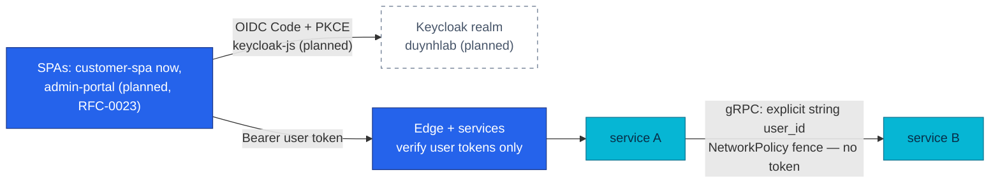

# ADR-043: Authenticate browsers via OIDC; keep east-west trust workload-level

> **Decision summary:** We will authenticate browsers with standard OIDC —
> Authorization Code + PKCE via `keycloak-js` against the realm's public
> clients — deleting the frontend's custom token layer rather than porting it,
> and we will **not** extend OAuth to service-to-service calls: east-west trust
> stays workload-level (NetworkPolicy today, workload identity/mTLS later per
> RFC-0020/RFC-0006). We accept that internal calls carry no per-request
> cryptographic identity for now in exchange for exactly one token audience —
> the human user — verified at the edge and in services, with no token-minting
> machinery on the internal call graph.

| Attribute | Value |
|-----------|-------|
| **Status** | Accepted |
| **Decision date** | 2026-08-11 |
| **Owners** | `duynhne` |
| **Deciders** | `duynhne` |
| **Scope** | How browsers obtain tokens, and what kind of trust authenticates service-to-service calls |
| **Affected components** | `frontend` (customer SPA token layer), future admin portal (RFC-0023), all internal gRPC callers, Temporal workers, NetworkPolicy set |
| **Related RFC** | [RFC-0022](../../rfc/RFC-0022/) — identity design record, **executed by [RFC-0024](../../rfc/RFC-0024/)** |
| **Related research** | [RFC-0022 research.md](../../rfc/RFC-0022/research.md) |
| **Related ADR** | [ADR-041](../ADR-041-keycloak-platform-idp/) (the realm and clients the SPAs authenticate against), [ADR-042](../ADR-042-oidc-sub-as-user-id/) (the subject the internal calls carry), [ADR-044](../ADR-044-envoy-gateway-platform-edge/) (the RFC-0024 edge that verifies the realm's user tokens) |
| **Supersedes** | — |
| **Superseded by** | — |
| **Implementation tracking** | RFC-0024 program — phases P1/P3/P5 (PR trains) |
| **Adoption** | Not started |

## Context

The frontend authenticates today against auth-service's custom endpoints and
carries a matching custom token layer: tokens in `localStorage`, a silent
401-refresh with an in-tab shared promise, and a cross-tab `navigator.locks`
coordinator — all built specifically around the custom refresh-family reuse
detection (`frontend/src/api/client.ts`). ADR-041 retires the issuer that
layer was built for, which forces a choice: port the custom machinery onto
Keycloak's token endpoint, or replace it with a standard OIDC client.

East-west, the platform has a deliberate and different trust model: internal
gRPC calls are fenced by NetworkPolicy, carry the explicit string `user_id` in
their payloads, and never forward end-user bearer tokens — no user JWT enters
the internal call graph or Temporal workflow history. Adopting an IdP raises
the question of whether services should now authenticate to each other with
OAuth Client Credentials or token exchange. RFC-0020 (internal TLS everywhere)
and RFC-0006 own the workload-identity/mTLS roadmap; deciding transport trust
here would collide with that territory.

## Scope

### In scope

- The browser authentication mechanism for both SPAs: flow, library, and
  what happens to the custom token layer.
- The east-west trust model during and after the identity cutover: whether
  service-to-service calls adopt OAuth machinery.
- What class of token the edge and services verify.

### Out of scope

- The realm, clients, roles, and TTLs those flows run against —
  [ADR-041](../ADR-041-keycloak-platform-idp/).
- The identifier the internal payloads carry —
  [ADR-042](../ADR-042-oidc-sub-as-user-id/).
- The edge component and its JWKS verification mechanics — [ADR-044](../ADR-044-envoy-gateway-platform-edge/) / RFC-0024.
- East-west mTLS, workload identity, or a service mesh — RFC-0020 / RFC-0006
  territory, explicitly not decided here.
- Backoffice pages and `protected` API business logic (RFC-0023).

## Decision drivers

| Priority | Driver | Why it matters |
|---------:|--------|----------------|
| 1 | Delete custom security code, don't relocate it | The token layer exists to reimplement what an OIDC client library already does; porting it would keep bespoke security-critical code alive under a new issuer |
| 2 | One token audience | Every verified token in the system means "a human user"; mixing user and machine tokens doubles the verifier's threat model without a consumer for the second kind |
| 3 | Respect adjacent ownership | Transport trust (mTLS, workload identity) has an owner (RFC-0020/RFC-0006); this program must not pre-empt it with OAuth plumbing that would be ripped out |
| 4 | Keep the internal graph token-free | No user JWT east-west or in Temporal history is an existing, tested invariant worth preserving verbatim |
| 5 | Standard, boring browser auth | Code + PKCE via a maintained library is the pattern every audit and every future contributor expects |

## Decision

We will authenticate browsers via standard OIDC and keep east-west trust
workload-level.

**Browsers:** both SPAs use Authorization Code + PKCE (S256) through
`keycloak-js` against their realm clients — `customer-spa` in this program,
`admin-portal` when RFC-0023 builds the Backoffice. Token acquisition,
storage, silent renewal, and logout are owned by the OIDC client integration.
The custom layer — `localStorage` token storage, the silent-refresh shared
promise, the cross-tab `navigator.locks` coordinator — is **deleted, not
ported**: it existed to drive the custom refresh-family semantics that retire
with auth-service.

**East-west:** service-to-service calls do **not** adopt OAuth Client
Credentials or token exchange. Trust between workloads stays workload-level:
NetworkPolicy fencing now, with workload identity/mTLS as later evolutions
owned by RFC-0020/RFC-0006. Internal gRPC payloads keep carrying the explicit
string `user_id` (ADR-042); end-user bearer tokens are never forwarded
east-west and never enter Temporal workflow history.

Consequently the edge and the services verify **user tokens only**: exactly
one class of principal exists, issued by the realm to a human via a browser
client.

### Decision rules

| Rule | Required behavior |
|------|-------------------|
| **Browser flow** | SPAs obtain tokens only via Authorization Code + PKCE against their own realm client. No password grant, no custom login form posting credentials to an API. |
| **Token handling** | The OIDC client library owns acquisition, renewal, and logout. No hand-rolled refresh scheduler, storage layer, or cross-tab lock may be reintroduced. |
| **East-west trust** | Internal calls are authorized by network reachability (NetworkPolicy), not tokens. No service requests, mints, forwards, or verifies a machine token. |
| **User context internally** | Business user context crosses service boundaries as the explicit string `user_id` in the RPC/command payload — never as a forwarded bearer token. |
| **Temporal boundary** | No token of any kind is written into workflow inputs or history. |
| **Verifier scope** | Edge and `pkg/authmw` verify realm **user** tokens only; introducing a second token audience (machine, exchange) requires a new ADR. |
| **Compatibility** | The custom `/auth/v1/public/...` login contract is not preserved in any form; the SPA cutover is part of the greenfield rebuild. |

### Decision view

## Alternatives considered

| Option | Benefits | Costs / risks | Result |
|--------|----------|---------------|--------|
| **A — Code+PKCE SPAs via keycloak-js; east-west stays workload-level** | Deletes the custom token layer; one token audience; no collision with RFC-0020/RFC-0006; preserves the token-free internal graph | Internal calls carry no per-request cryptographic identity yet; SPA tokens live in the browser (mitigated by 15-min TTL + rotation, ADR-041) | Selected |
| **B — OIDC at the edge (EG `oidc` filter) with cookie sessions** | Tokens never reach JS; the edge owns the whole flow | Turns the stateless edge into a session participant for first-party SPAs that don't need it; couples login UX to gateway config; recorded as an EG capability in RFC-0024, deliberately not adopted | Rejected |
| **C — OAuth Client Credentials for east-west** | Cryptographic caller identity per internal call; central revocation | Puts token issuance on the internal hot path and Keycloak into east-west availability; every service gains a client secret to store and rotate; solves transport trust with the wrong tool and pre-empts RFC-0020/RFC-0006 | Rejected |
| **D — Backend-for-frontend session model** | Smallest browser attack surface (httpOnly cookie, no token in JS) | Introduces a new stateful component per SPA that RFC-0022 explicitly declined (no facade/BFF); recreates session plumbing the platform just deleted with auth-service | Rejected |

### Why the selected option won

Option A is the only shape that satisfies drivers 1–4 simultaneously: the
custom layer dies instead of moving, the verifiers keep a single-audience
threat model, the internal graph keeps its existing token-free invariant, and
nothing is built on territory RFC-0020/RFC-0006 owns. It is also the smallest
change — the SPA swaps its auth integration, and every internal contract
stays byte-identical.

### Why the closest alternative lost

Option B is genuinely attractive — keeping tokens out of browser JavaScript
is a real security win, and the RFC-0024 edge can do it natively. It loses on
fit: for first-party SPAs talking to their own API, edge-managed cookie
sessions make the gateway stateful-per-user and move login behavior into
gateway configuration, while the actual browser-token risk is already bounded
by ADR-041's 15-minute access TTL and refresh rotation. The capability is
recorded (RFC-0024 keeps it as a known option), so if a third-party client or
a stricter posture ever demands it, the revisit path is explicit rather than
speculative.

## Consequences

### Positive consequences

- The frontend's bespoke token machinery — storage, silent-refresh promise,
  cross-tab locks — is deleted; browser auth becomes a maintained library's
  problem.
- Exactly one principal class exists platform-wide; verifiers, tests, and
  threat models stay single-audience.
- The internal call graph keeps its proven invariants: NetworkPolicy fencing,
  explicit `user_id`, no tokens in Temporal history.
- RFC-0020/RFC-0006 inherit a clean slate: no OAuth plumbing to unwind when
  workload identity/mTLS lands.
- The admin portal (RFC-0023) gets its authentication pattern for free — same
  flow, its own client and session posture.

### Negative consequences and accepted trade-offs

- Internal calls remain authenticated only by network position until
  RFC-0020/RFC-0006 deliver — a NetworkPolicy misconfiguration is not caught
  by a second cryptographic layer.
- Access tokens are held by browser JavaScript (in-memory via the OIDC
  client); accepted with the short TTL + rotation posture rather than a BFF.
- `keycloak-js` becomes a frontend dependency coupled to the IdP choice; an
  IdP change would touch the SPA integration.
- No central per-request revocation for in-flight access tokens (unchanged
  from today; bounded by the 15-min TTL).

### Neutral consequences

- Internal gRPC contracts and NetworkPolicies are untouched by this decision;
  only their *justification* is now recorded here.
- The edge's verification mechanics (SecurityPolicy `remoteJWKS`, role gate on
  `protected`) are ADR-044's concern; this ADR only fixes *what class* of
  token it sees.
- Logout becomes an OIDC/Keycloak session operation instead of a custom
  family-revocation endpoint.

## Implementation obligations

| Obligation | Owner | Tracking | Completion signal |
|------------|-------|----------|-------------------|
| Replace the frontend auth integration with `keycloak-js` (Code + PKCE, `customer-spa`) | `duynhne` | RFC-0024 P3 | Login/renewal/logout via OIDC; custom token layer deleted from `frontend` |
| Delete the custom token-layer code paths (`localStorage` storage, silent-refresh promise, `navigator.locks`) | `duynhne` | RFC-0024 P3 | No custom refresh scheduler or cross-tab lock remains in the SPA |
| Assert the east-west invariants in tests (no bearer forwarding, string `user_id`, token-free Temporal history) | `duynhne` | RFC-0024 P3 | Integration tests fail if a token crosses a service boundary or enters workflow history |
| Verify NetworkPolicy fencing survives the cutover (re-pointing sweep) | `duynhne` | RFC-0024 P2/P5 | Connectivity matrix from the new edge namespace matches intent |
| Admin-portal flow lands with RFC-0023 against the existing `admin-portal` client | `duynhne` | RFC-0023 | Backoffice authenticates via Code + PKCE with its stricter session posture |
| Update service contracts | `duynhne` | `docs/api/api.md` (shared auth rules), frontend docs | As-built docs describe OIDC browser auth + workload east-west trust |

## Validation and compliance

| Requirement | Verification |
|-------------|--------------|
| PKCE-only browser flow | Realm/client test: authorization requests without S256 PKCE rejected; Direct Access Grants off |
| Custom layer deleted | Repo check: no token persistence, refresh scheduler, or cross-tab lock code in `frontend` |
| No machine tokens | Repo + traffic check: no Client Credentials grant configured or exercised; no service fetches tokens |
| Token-free east-west | Integration test: gRPC metadata and payloads contain no bearer token; NetworkPolicy sweep passes |
| Token-free Temporal history | Workflow test: history export contains no token material |
| Single verifier audience | authmw/edge tests: only realm user tokens verify; anything else is 401 |
| Documentation | `docs/api/api.md` shared rules link this ADR |

## Revisit triggers

Re-open this decision when one or more of the following become true:

- A third-party or confidential client must call the platform APIs — machine
  identity then needs a real design (Client Credentials or workload identity),
  not an exception.
- RFC-0020/RFC-0006 deliver workload identity/mTLS — re-examine whether any
  token-based east-west layer is still worth considering (expected answer: no).
- A security posture change demands tokens out of browser JavaScript — the
  recorded edge-OIDC/BFF options become candidates.
- A real incident shows NetworkPolicy-only internal trust was insufficient in
  practice.

A review does not automatically reverse the decision. A changed decision
requires a new ADR that supersedes this one.

## References

- [RFC-0022](../../rfc/RFC-0022/) — identity design record (client security, non-goals, internal-topology goals)
- [RFC-0022 research](../../rfc/RFC-0022/research.md) — frontend token-layer audit, alternatives
- [RFC-0024](../../rfc/RFC-0024/) — executing program (phases P1/P3/P5); records the EG `oidc` filter as capability, not adopted
- [RFC-0023](../../rfc/RFC-0023/) — Backoffice portal; consumes the `admin-portal` client
- [RFC-0020](../../rfc/RFC-0020/) / [RFC-0006](../../rfc/RFC-0006/) — owners of east-west transport trust
- [ADR-041](../ADR-041-keycloak-platform-idp/) · [ADR-042](../ADR-042-oidc-sub-as-user-id/)
- [`docs/api/api.md`](../../../api/api.md) — shared auth rules and call graph

## History

| Date | Status / adoption | Change |
|------|-------------------|--------|
| 2026-08-10 | Proposed / Not started | Proposed inside the RFC-0022/RFC-0024 review |
| 2026-08-11 | Accepted / Not started | Accepted with the RFC-0024 program review (this PR); numbering assigned 041–043 because ADR-039/040 were consumed by unrelated decisions |

---
_Last updated: 2026-08-11_
