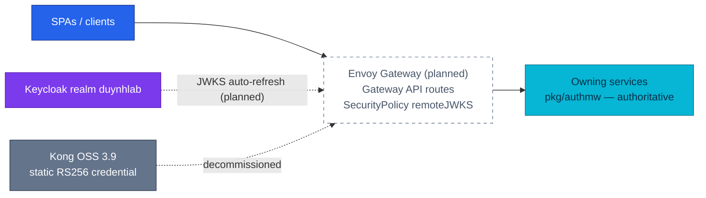

# ADR-044: Make Envoy Gateway the platform edge on the Gateway API

> **Decision summary:** We will replace Kong OSS 3.9 with **Envoy Gateway** as the
> platform's only edge, routed by standard Gateway API resources plus EG policy CRDs,
> with edge JWT verification moving from a statically provisioned RS256 credential to
> SecurityPolicy `remoteJWKS` against the Keycloak realm — because Kong Inc. froze the
> OSS line (no 3.10+, unannounced EOL) and Kong OSS cannot fetch JWKS. We accept a
> ~150-file greenfield rebuild and a quarterly upgrade duty in exchange for a
> CNCF-governed edge, portable standard routing, and a rotation-transparent Keycloak
> integration built exactly once. **ADR-006's principle survives, re-homed:** the edge
> does coarse checks; services (`pkg/authmw`) remain the authoritative fail-closed
> verifier.

| Attribute | Value |
|-----------|-------|
| **Status** | Accepted |
| **Decision date** | 2026-08-11 |
| **Owners** | `duynhne` |
| **Deciders** | `duynhne` |
| **Scope** | Which product is the platform edge, and in which config dialect it is driven. Rate-limit semantics and the local E2E gate are split out (see Related ADR). |
| **Affected components** | `kubernetes/infra/controllers/kong/` → Envoy Gateway HelmReleases, `kubernetes/infra/configs/kong/` → Gateway API + EG policy CRs, 31 Ingresses → HTTPRoutes, 11 NetworkPolicies, Kong monitoring (alerts, recording rules, dashboard, OTTL filter), ESO `auth-issuer-jwt`, Kyverno `kong-openbao` exception, `docs/platform/` |
| **Related RFC** | [RFC-0024](../../rfc/RFC-0024/) |
| **Related research** | [research.md](../../rfc/RFC-0024/research.md) |
| **Related ADR** | [ADR-041](../ADR-041-keycloak-platform-idp/) (adopt Keycloak as platform IdP — the realm this edge trusts, per RFC-0022), [ADR-045](../ADR-045-local-first-edge-rate-limiting/) (edge rate limiting), [ADR-046](../ADR-046-e2e-gate-kind-fallback/) (local E2E gate), [ADR-003](../ADR-003-jwt-validation-in-services-not-kong/) / [ADR-006](../ADR-006-rs256-jwt-kong-edge-auth/) (the Kong-era decisions this record re-homes) |
| **Supersedes** | [ADR-006](../ADR-006-rs256-jwt-kong-edge-auth/) (vehicle only — the edge-coarse/service-authoritative split is preserved) |
| **Superseded by** | — |
| **Implementation tracking** | RFC-0024 program — P2/P4/P5 trains |
| **Adoption** | Partial — Kong is deleted from main and Envoy Gateway is the only edge in both config sets; local standalone edge verified end to end (trace root, access log, edge JWT); cluster edge not yet run on Kind |

## Context

The platform's only edge is **Kong OSS 3.9**, deployed as KIC in DB-less mode:
31 Ingresses (`ingressClassName: kong`), 10 KongClusterPlugins, 5 KongUpstreamPolicies
plus 25 `konghq.com/*` Service annotations, a Kong-shaped monitoring surface
(13 alerts + 20 recording rules keyed to `kong_*` metrics — repo-verified count; the
RFC text said 19 recording rules), and a bespoke 283-line `kong.yml` dialect in
local-stack. Kong Inc. froze that line in 2025: **no OSS 3.10+ exists in any form**,
the unlicensed Enterprise image runs with a read-only Admin API (unusable for this
platform's DB-less config push), and the 3.9 maintenance line has **no published
end-of-support date**.

The freeze collides with the identity program. [RFC-0022](../../rfc/RFC-0022/README.md)
moves identity to Keycloak, but Kong OSS's `jwt` plugin **cannot fetch JWKS** — it
holds a statically provisioned RS256 public key ([ADR-006](../ADR-006-rs256-jwt-kong-edge-auth/)'s
vehicle), forcing a static-key ESO fan-out (`ExternalSecret auth-issuer-jwt`) and a
manual edge step in the key-rotation runbook; [RFC-0023](../../rfc/RFC-0023/README.md)'s
`protected` routes get only signature+exp at this edge, no role awareness. Building
the Keycloak edge on Kong means building it twice. RFC-0022 recorded a
gateway-distribution exit trigger; the owner activated it proactively on 2026-08-10
after a verified 24-criteria comparison (**EG 14 / tie 4 / Kong 1** —
[criteria matrix](../../rfc/RFC-0024/research.md#vs-platform-as-built)).

## Scope

### In scope

- The edge product: Envoy Gateway replaces Kong OSS as the platform's **only** edge.
- The config dialect: standard Gateway API (GatewayClass/Gateway/HTTPRoute) plus EG
  policy CRDs (SecurityPolicy, BackendTrafficPolicy, ClientTrafficPolicy, EnvoyProxy,
  Backend).
- The edge JWT vehicle: SecurityPolicy `remoteJWKS` against the Keycloak realm,
  including the in-cluster IdP pattern (`Backend` + `BackendTLSPolicy`), and the edge
  claim-authorization gate on `protected` routes.
- Cutover style (greenfield, no parallel-run) and the Kong decommission/archive rule.
- The version floor and pinning discipline (≥ v1.8.3, tag + digest).

### Out of scope

- Edge rate-limiting semantics — decided by [ADR-045](../ADR-045-local-first-edge-rate-limiting/).
- Where the local E2E release-audit gate runs — decided by [ADR-046](../ADR-046-e2e-gate-kind-fallback/).
- The identity design itself (realm, clients, claims, TTLs, `user_id` migration) —
  RFC-0022 is the design record; ADR-041 records its adoption.
- OIDC-at-edge for the SPAs (`keycloak-js` stays; EG's OIDC filter is recorded
  capability, not adopted), service mesh / east-west mTLS, ext_authz/OPA.
- Any service API path, host name, or audience vocabulary — all survive as-is.

## Decision drivers

| Priority | Driver | Why it matters |
|---------:|--------|----------------|
| 1 | Distribution viability | The edge is the security perimeter; a frozen line with unannounced EOL is one unpatched CVE from a forced migration. EG ships quarterly minors with live patch streams under CNCF governance |
| 2 | Build the Keycloak edge once | `remoteJWKS` makes the RFC-0022 integration native: zero provisioned key material, rotation-transparent. On Kong, the same integration needs a static-key ESO fan-out and a manual rotation step — then gets rebuilt anyway |
| 3 | Standard, portable config | Gateway API routes survive a future gateway change; Kong's Ingress-plus-vendor-annotations and the local `kong.yml` dialect do not |
| 4 | Preserve defense-in-depth | ADR-006's edge-coarse/service-authoritative split is a working security posture; the migration must re-home it, not weaken it |
| 5 | Edge telemetry | The edge is the fleet's tracing root and access-log source; EG's ParentBased sampler matches the fleet model, and its JSON logs + CEL filters resolve standing audit findings (F-2, F-8) |

## Decision

We will make **Envoy Gateway the platform's only edge**, pinned at **≥ v1.8.3** by tag
**and digest**, replacing Kong OSS 3.9 in a **greenfield cutover** — no parallel-run,
because Kind environments rebuild constantly and the production cluster contains no
Kong.

Routing is standard **Gateway API**: one GatewayClass, Gateways per host class
(`gateway.duynh.me`, `local.duynh.me`, admin hosts), and HTTPRoutes for all 31 ingress
surfaces. Everything the standard API does not cover attaches as EG policy CRDs:
**SecurityPolicy** (JWT, claim authorization, CORS, CIDR fencing),
**BackendTrafficPolicy** (retries, timeouts, health checks, request buffer, rate
limiting per ADR-045), **ClientTrafficPolicy**, **EnvoyProxy** (telemetry), and
**Backend** (non-Service upstreams).

Edge JWT verification moves from ADR-006's statically provisioned RS256 credential to
SecurityPolicy **`remoteJWKS`** against the Keycloak realm — zero provisioned key
material, rotation-transparent; the in-cluster IdP is reached via `Backend` +
`BackendTLSPolicy`. `protected` routes (RFC-0023) additionally gain an edge claim
gate: `realm_access.roles` must contain `backoffice_admin`. **This supersedes the Kong
vehicle of ADR-006 — and transitively ADR-003's Kong framing — while preserving the
principle both records converged on:** the edge does coarse checks; services
(`pkg/authmw`) remain the authoritative fail-closed verifier.

Kong is decommissioned completely — HelmRelease, all plugin/consumer CRs, the
`auth-issuer-jwt` ExternalSecret, the `kong_*` monitoring surface, the OTTL
deprecation filter, and the Kyverno `NET_BIND_SERVICE` exception — while Kong
**documentation is archived read-only** (banner, no rewrite) as platform history.

### Decision rules

| Rule | Required behavior |
|------|-------------------|
| **Ownership** | Envoy Gateway is the only edge. No second gateway, no Kong resource, and no parallel-run state may be introduced. |
| **Config dialect** | Routing changes are expressed as Gateway API resources + EG policy CRDs. No vendor annotations on Ingresses; no new bespoke gateway config dialect anywhere (cluster or local). |
| **Edge auth** | Edge JWT verification uses `remoteJWKS` against the Keycloak realm only. No provisioned key material, no credential Secret, no ESO path may reappear at the edge. |
| **Authority** | Services (`pkg/authmw`) remain the authoritative fail-closed verifier. Edge checks (signature/iss/aud/exp, role claim on `protected`) are additive; no route may rely on the edge as its only auth layer. |
| **Version pin** | The EG chart/images are pinned ≥ v1.8.3 by tag + digest; quarterly minor upgrades are a standing duty, watched by Renovate. |
| **Decommission** | Kong configs and monitoring are deleted, not disabled. Kong docs (`docs/platform/kong-gateway.md`, ADR-003/006) are archived read-only with banners/superseded-by links — never rewritten. |

### Decision view

## Alternatives considered

| Option | Benefits | Costs / risks | Result |
|--------|----------|---------------|--------|
| **A — Envoy Gateway** | CNCF governance, live patch streams; free JWKS/claim-authz; standard portable routing; telemetry model matches the fleet | ~150-file rebuild; quarterly upgrade duty; standalone-mode maturity unproven (ADR-046 owns the fallback) | Selected |
| **B — Stay pinned on Kong OSS 3.9** | Zero work now; patches still flowing today | Frozen features, unannounced EOL; permanent static-key edge for Keycloak; RFC-0022/0023 edge artifacts built twice; the exit trigger the owner already activated | Rejected |
| **C — Kong Gateway Enterprise** | `openid-connect` plugin (JWKS at edge); vendor support | Enterprise pricing for one feature; the unlicensed image is unusable (read-only Admin API); rejected in RFC-0022 research and re-confirmed | Rejected |
| **D — APISIX** | Apache-governed, free openid-connect, active community | Second config dialect (not Gateway API-native to the same depth); loses the standard-YAML-everywhere prize. **Recorded as the fallback vendor** if EG ever dead-ends the way Kong did | Rejected |
| **E — Drop edge JWT entirely** | Nothing to migrate for auth | A gateway is still needed for routing/TLS/rate-limit; discards ADR-006's defense-in-depth for ~zero savings once `remoteJWKS` exists | Rejected |

### Why the selected option won

Envoy Gateway is the only option that satisfies drivers 1–3 simultaneously: a
governed, patched distribution, a JWKS-native edge that makes the Keycloak
integration a one-time build with no key material, and routing in the
Kubernetes-standard dialect that would largely survive even a future gateway change.
The 24-criteria review scored it ahead on 14 criteria with 4 ties and a single Kong
win (compose maturity — which ADR-046 handles with a spike and an approved fallback).

### Why the closest alternative lost

Staying pinned (B) is the closest option because it costs nothing today — and that is
exactly its trap. The platform is about to build its Keycloak edge; on Kong that edge
is a static-key ESO fan-out plus a manual rotation step, both existing only because
of a limitation of a product line whose end date its vendor will not publish. Every
month of delay adds Kong-shaped artifacts the eventual forced migration deletes.
Moving before RFC-0022/0023 implement means the identity edge is built once, on the
survivor.

## Consequences

### Positive consequences

- Edge key rotation becomes invisible: `remoteJWKS` auto-refreshes, so the
  `auth-issuer-jwt` ExternalSecret and the manual edge rotation step are never built.
- `protected` routes gain an edge role gate (403 before the request enters the
  cluster) — impossible on Kong OSS — while services stay authoritative.
- Routes become portable standard YAML; the local `kong.yml` dialect dies (ADR-046);
  the edge rejoins a patched, CNCF-governed release train.
- Standing telemetry findings improve by migration: F-8 (frozen semconv) resolves,
  F-2 (unfilterable probe logs) gains CEL filtering at source, F-7's sampling model
  (ParentBased, 0.1) carries over as a number copy, not a redesign.

### Negative consequences and accepted trade-offs

- A real migration across ~150 files, with observability as the L-sized risk area:
  13 alerts + 20 recording rules on `kong_*` rewritten on `envoy_*`, dashboards
  swapped, the Vector `kong_json` pipeline re-mapped once.
- Quarterly upgrade duty replaces "pin and forget" (owner: accepted); Kong plugin
  intuition resets to Gateway API + Envoy semantics.
- 11 NetworkPolicies keyed to the `kong` namespace must be re-pointed — the
  highest-silence risk (traffic blackholes); swept with a checklist and Kind
  verification.
- Greenfield cutover means rollback is source-level (revert the PR train and
  rebuild), never a runtime toggle.

### Neutral consequences

- No service API, route path, host name, or audience class changes; the edge's
  NodePort exposure (30080/30443) carries over unchanged.
- ADR-003/ADR-006 stay in the record with superseded-by links; RFC-0009 gains one
  more superseded-in-part note; CHANGELOG history is untouched.
- The identity work itself (Keycloak deploy, auth-service retirement) executes in
  the same program but is owned by the RFC-0022 design record and ADR-041.

## Implementation obligations

| Obligation | Owner | Tracking | Completion signal |
|------------|-------|----------|-------------------|
| Gateway API CRDs + EG HelmReleases in the Flux chain (`cert-manager → gateway-api-crds → envoy-gateway → envoy-gateway-config`) | platform | RFC-0024 P2 | `make validate` green; EG reconciles on Kind |
| Gateway + HTTPRoutes for all 31 surfaces; SecurityPolicies (remoteJWKS, claim authz, CIDR, CORS); BTP; Kong deleted from the cluster chain | platform | RFC-0024 P2 | Scripted route-parity diff passes; Kong resources gone |
| Rewrite the 13 alerts + 20 recording rules on `envoy_*`; dashboards + Vector schema; delete the OTTL Kong filter | platform | RFC-0024 P4 | Alert catalog §2 rewritten; every rewritten alert fired synthetically |
| Decommission sweep: ESO secret, 11 NetworkPolicies re-pointed, Kyverno exception dropped, scripts re-pointed | platform | RFC-0024 P5 | Connectivity matrix from the EG namespace passes |
| Docs: create `docs/platform/envoy-gateway.md`; archive `docs/platform/kong-gateway.md` (banner); superseded-by links on ADR-003/006; `docs/api/api.md` edge-exposure prose | platform | RFC-0024 P5/P6 | No doc describes Kong as current |

## Validation and compliance

| Requirement | Verification |
|-------------|--------------|
| Route parity | Scripted diff of every host/path/audience pair before/after (31 surfaces, incl. temporal-ui); 404/401/403 per audience class re-asserted |
| Edge auth | Valid/invalid/expired Keycloak tokens rejected at edge **and** service; `protected` returns 403 without `backoffice_admin`; realm key rotation requires no edge action |
| Service authority | `pkg/authmw` untouched; a request bypassing the edge is still rejected by the service (fail-closed) |
| No Kong residue | Repo grep: no `konghq.com/*`, `KongClusterPlugin`, `kong.yml`, or `job="kong"` outside archived docs |
| Telemetry | Trace continuity SPA→edge→service (ParentBased); rewritten alerts fired; probe-filter CEL proven by volume delta |
| Documentation | `docs/api/api.md` edge exposure and `docs/platform/envoy-gateway.md` link this ADR |

## Amendments

### 2026-08-17 — CRD delivery moves from Helm to server-side apply

The decision above is unchanged: Envoy Gateway is the edge, driven by Gateway
API resources. What changes is **how its CRDs reach the cluster**.

The first Kind bring-up of this layer proved the planned mechanism cannot work.
The `gateway-crds-helm` chart ships CRDs in `templates/`, so Helm stores both
the rendered manifest and the whole chart in the release Secret:

| Delivery path | Measured | Ceiling | Result |
|---------------|----------|---------|--------|
| HelmRelease (planned) | release Secret ~2.06 MB | 1 MiB — `Secret` validation | rejected by the API server |
| `kubectl apply`, client-side | `envoyproxies` CRD 1.35 MB | 256 KB — `last-applied-configuration` annotation | rejected |
| **Server-side apply** (adopted) | 18 objects | — | applies |

The ceiling is structural, not a misconfiguration: `channel: standard` still
packages the unused experimental file, and removing it leaves ~1.63 MB; chart
`v1.9.0` packages the same way and is larger still. Letting the controller
chart install its own CRD subchart was measured at ~1.14 MB — under 10% below
the same ceiling, so it was rejected as an unproven margin rather than a fix.

**Amended decision:** `kubernetes/infra/controllers/gateway-api-crds/` holds the
CRDs as vendored manifests, applied by the existing `gateway-api-crds-local`
Flux Kustomization, which uses server-side apply. The controller HelmRelease
keeps `crds: Skip` and additionally sets
`crds.gatewayAPI.safeUpgradePolicy.enabled: false`, so the `safe-upgrades`
ValidatingAdmissionPolicy has exactly one declared owner.

**Accepted trade-off:** ~3.4 MB of generated YAML in git, and an Envoy Gateway
upgrade now requires re-rendering that directory in the same change as the
controller pin. The regeneration command is in
[`gateway-api-crds/README.md`](../../../../kubernetes/infra/controllers/gateway-api-crds/README.md).

**Obligation added:** the "Gateway API CRDs + EG HelmReleases in the Flux chain"
row above is satisfied by the Kustomization, not by a second HelmRelease.

## Revisit triggers

Re-open this decision when one or more of the following become true:

- Envoy Gateway's distribution dead-ends the way Kong's did (frozen line, withdrawn
  patches) — APISIX is the recorded fallback vendor, and the Gateway API routes
  largely survive such a move.
- A service mesh adoption (RFC-0020/RFC-0006 territory) moves edge/identity concerns
  into the mesh.
- The quarterly upgrade duty proves materially heavier than the ~2 lines/year the
  research estimated, or the edge-coarse/service-authoritative split is invalidated
  (e.g. a requirement for edge-only auth or full OIDC-at-edge for the SPAs).

A review does not automatically reverse the decision. A changed decision requires a
new ADR that supersedes this one.

## References

- [RFC-0024](../../rfc/RFC-0024/) — the deciding RFC (before→after map, resource mapping, phases)
- [RFC-0024 research](../../rfc/RFC-0024/research.md) — criteria matrix, deep-dives, blast-radius inventory, Context7 audit
- [RFC-0022](../../rfc/RFC-0022/README.md) — identity design record executed by the same program
- [RFC-0023](../../rfc/RFC-0023/README.md) — `protected` route class gaining the edge role gate
- [ADR-006](../ADR-006-rs256-jwt-kong-edge-auth/) / [ADR-003](../ADR-003-jwt-validation-in-services-not-kong/) — the superseded Kong-era decisions
- [ADR-045](../ADR-045-local-first-edge-rate-limiting/) · [ADR-046](../ADR-046-e2e-gate-kind-fallback/) — sibling edge decisions
- [`docs/platform/kong-gateway.md`](../../../platform/kong-gateway.md) — to be archived read-only

## History

| Date | Status / adoption | Change |
|------|-------------------|--------|
| 2026-08-10 | Proposed / Not started | Proposed inside the RFC-0024 review |
| 2026-08-11 | Accepted / Not started | Accepted with RFC-0024; numbering assigned 044–046 because ADR-039/040 were consumed by unrelated decisions (RFC text had said 045–047) |
| 2026-08-17 | Accepted / Partial | Amended: CRD delivery moves from a HelmRelease to vendored manifests applied server-side, after the first Kind bring-up proved the Helm path exceeds the 1 MiB `Secret` limit |

---
_Last updated: 2026-08-17_
